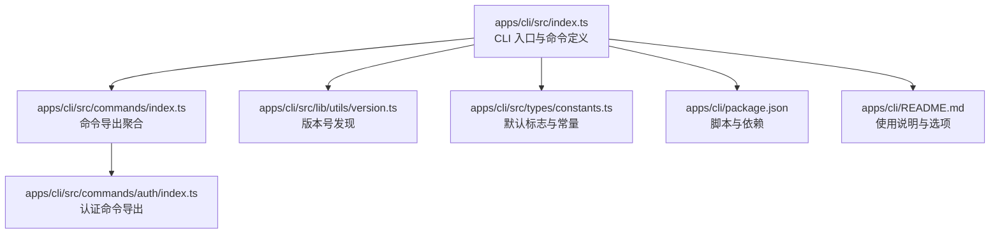
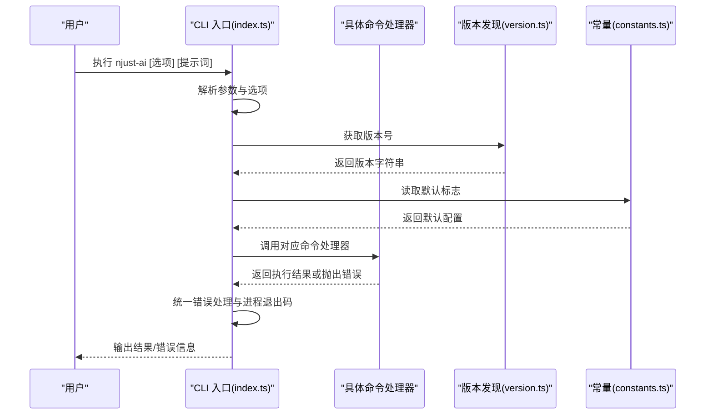
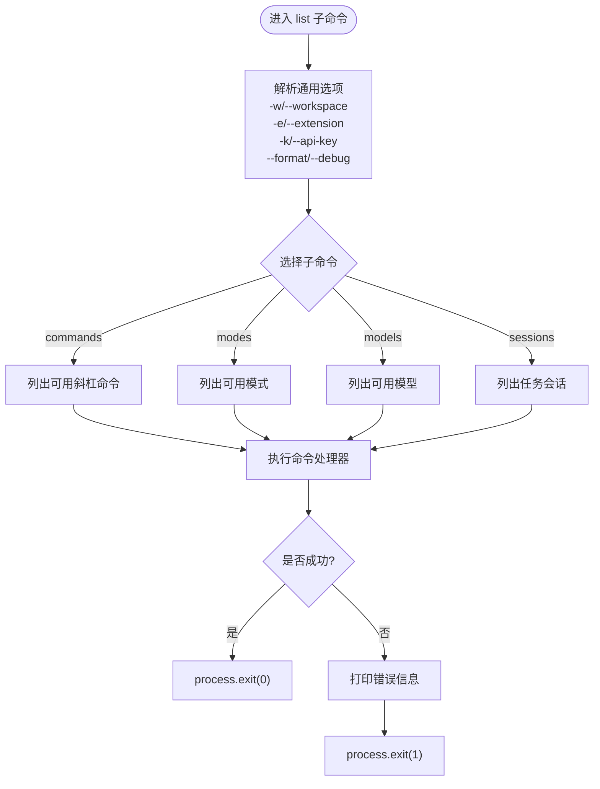
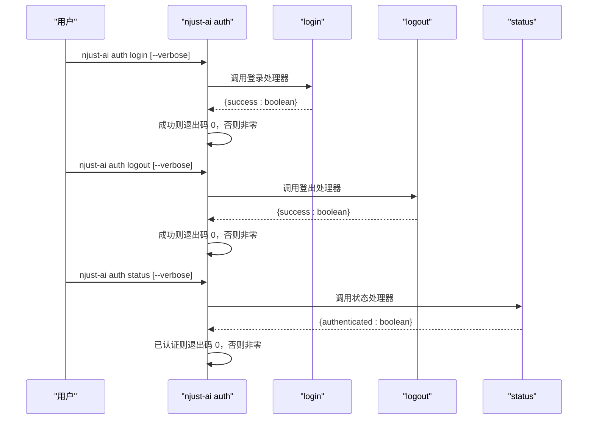
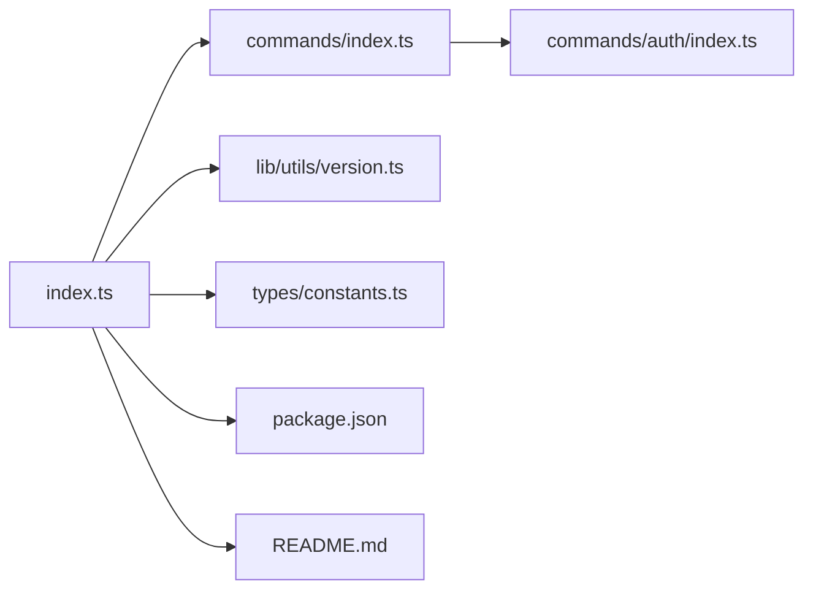

# CLI 工具开发

<cite>
**本文引用的文件**
- [apps/cli/src/index.ts](file://apps/cli/src/index.ts)
- [apps/cli/package.json](file://apps/cli/package.json)
- [apps/cli/README.md](file://apps/cli/README.md)
- [apps/cli/src/lib/utils/version.ts](file://apps/cli/src/lib/utils/version.ts)
- [apps/cli/src/types/constants.ts](file://apps/cli/src/types/constants.ts)
- [apps/cli/src/commands/auth/index.ts](file://apps/cli/src/commands/auth/index.ts)
- [apps/cli/src/commands/index.ts](file://apps/cli/src/commands/index.ts)
</cite>

## 目录
1. [简介](#简介)
2. [项目结构](#项目结构)
3. [核心组件](#核心组件)
4. [架构总览](#架构总览)
5. [详细组件分析](#详细组件分析)
6. [依赖关系分析](#依赖关系分析)
7. [性能考虑](#性能考虑)
8. [故障排除指南](#故障排除指南)
9. [结论](#结论)
10. [附录](#附录)

## 简介
本文件面向 CLI 工具开发，围绕 NJUST_AI CLI 的命令行接口设计进行系统化说明。内容涵盖命令系统架构、参数解析、输出格式化、配置管理、错误处理、认证流程、与 VS Code 扩展的集成方式以及数据同步机制，并提供使用示例、最佳实践、性能优化与用户体验改进建议。

## 项目结构
CLI 应用位于 monorepo 的 apps/cli 目录中，采用模块化组织：
- 入口文件负责命令定义与参数解析
- 命令分组（如 auth）通过导出聚合
- 版本信息动态发现
- 类型常量集中管理默认行为与配置

图表来源
- [apps/cli/src/index.ts:1-169](file://apps/cli/src/index.ts#L1-L169)
- [apps/cli/src/commands/index.ts:1-3](file://apps/cli/src/commands/index.ts#L1-L3)
- [apps/cli/src/commands/auth/index.ts:1-4](file://apps/cli/src/commands/auth/index.ts#L1-L4)
- [apps/cli/src/lib/utils/version.ts:1-25](file://apps/cli/src/lib/utils/version.ts#L1-L25)
- [apps/cli/src/types/constants.ts:1-28](file://apps/cli/src/types/constants.ts#L1-L28)
- [apps/cli/package.json:1-51](file://apps/cli/package.json#L1-L51)
- [apps/cli/README.md:1-321](file://apps/cli/README.md#L1-L321)

章节来源
- [apps/cli/src/index.ts:1-169](file://apps/cli/src/index.ts#L1-L169)
- [apps/cli/package.json:1-51](file://apps/cli/package.json#L1-L51)
- [apps/cli/README.md:1-321](file://apps/cli/README.md#L1-L321)

## 核心组件
- 命令定义与参数解析：基于 commander，定义主命令与子命令，支持位置参数与选项，提供默认值与类型转换。
- 认证子系统：提供 login/logout/status 子命令，支持浏览器登录、状态查询与登出。
- 列表子系统：提供 list commands/modes/models/sessions 子命令，支持统一的输出格式与调试开关。
- 升级命令：提供升级 CLI 到最新版本的能力。
- 版本管理：运行时从最近的 package.json 中读取版本号。
- 默认配置：集中于常量文件，统一默认模式、推理强度、模型与超时等。

章节来源
- [apps/cli/src/index.ts:17-168](file://apps/cli/src/index.ts#L17-L168)
- [apps/cli/src/lib/utils/version.ts:1-25](file://apps/cli/src/lib/utils/version.ts#L1-L25)
- [apps/cli/src/types/constants.ts:1-28](file://apps/cli/src/types/constants.ts#L1-L28)

## 架构总览
CLI 通过入口文件初始化命令树，解析参数后调用对应处理器；认证与列表命令均采用统一的错误处理与退出码策略；版本号动态发现确保发布一致性。

图表来源
- [apps/cli/src/index.ts:17-168](file://apps/cli/src/index.ts#L17-L168)
- [apps/cli/src/lib/utils/version.ts:1-25](file://apps/cli/src/lib/utils/version.ts#L1-L25)
- [apps/cli/src/types/constants.ts:1-28](file://apps/cli/src/types/constants.ts#L1-L28)

## 详细组件分析

### 主命令与参数解析
- 支持位置参数 [prompt] 与多种选项，包括工作区路径、打印模式、stdin 流式输入、调试开关、审批要求、API 密钥、提供商、模型、模式、终端 shell、推理强度、连续错误限制、错误退出策略、临时运行、一次性任务、输出格式等。
- 选项解析包含类型转换（如整数）、默认值与条件约束（如 stdin 流需配合打印模式与特定输出格式）。
- 动态版本号注入到命令描述中，便于用户识别当前版本。

章节来源
- [apps/cli/src/index.ts:19-70](file://apps/cli/src/index.ts#L19-L70)
- [apps/cli/src/lib/utils/version.ts:1-25](file://apps/cli/src/lib/utils/version.ts#L1-L25)

### 列表命令系统
- list 子命令组提供 commands/modes/models/sessions 四类列表，统一支持工作区、扩展路径、API 密钥、输出格式与调试开关。
- 采用统一的错误处理包装器，保证异常时输出错误信息并以非零退出码退出，成功时以零退出码退出。

图表来源
- [apps/cli/src/index.ts:72-130](file://apps/cli/src/index.ts#L72-L130)
- [apps/cli/src/index.ts:86-106](file://apps/cli/src/index.ts#L86-L106)

章节来源
- [apps/cli/src/index.ts:72-130](file://apps/cli/src/index.ts#L72-L130)
- [apps/cli/src/index.ts:86-106](file://apps/cli/src/index.ts#L86-L106)

### 认证命令系统
- 提供 login/logout/status 三个子命令，支持详细输出开关。
- 统一的错误处理与退出码策略：成功返回 0，失败返回非零码，便于脚本化集成。

图表来源
- [apps/cli/src/index.ts:139-166](file://apps/cli/src/index.ts#L139-L166)

章节来源
- [apps/cli/src/index.ts:139-166](file://apps/cli/src/index.ts#L139-L166)

### 升级命令
- 提供 upgrade 子命令用于升级 CLI 至最新版本。
- 统一的错误处理与退出码策略，确保脚本化升级的可靠性。

章节来源
- [apps/cli/src/index.ts:132-137](file://apps/cli/src/index.ts#L132-L137)
- [apps/cli/src/index.ts:97-106](file://apps/cli/src/index.ts#L97-L106)

### 版本管理
- 运行时从当前文件向上遍历查找最近的 package.json 并读取版本号，确保无论从源码还是打包产物运行，版本号一致。

章节来源
- [apps/cli/src/lib/utils/version.ts:1-25](file://apps/cli/src/lib/utils/version.ts#L1-L25)

### 默认配置与常量
- DEFAULT_FLAGS 集中定义默认模式、推理强度、模型与连续错误限制等。
- REASONING_EFFORTS 定义可选的推理强度枚举。
- FOLLOWUP_TIMEOUT_SECONDS 定义自动批准后续问题的超时时间。
- ASCII_ROO 为 ASCII 艺术标识。
- AUTH_BASE_URL 与 SDK_BASE_URL 支持通过环境变量覆盖认证与 SDK 基础地址。

章节来源
- [apps/cli/src/types/constants.ts:1-28](file://apps/cli/src/types/constants.ts#L1-L28)

### 与 VS Code 扩展的集成与数据同步
- CLI 使用 @njust-ai/vscode-shim 提供 VSCode API 兼容层，使扩展在 Node.js 环境中运行。
- 消息流：CLI → 扩展通过事件 "webviewMessage" 发送消息；扩展 → CLI 通过事件 "extensionWebviewMessage" 返回消息。
- 该机制支撑交互式 TUI、工具执行、命令调用与状态同步。

章节来源
- [apps/cli/README.md:228-266](file://apps/cli/README.md#L228-L266)

## 依赖关系分析
- CLI 入口依赖 commander 进行命令解析，依赖 @njust-ai/vscode-shim 提供 VSCode API 兼容层。
- 命令导出通过聚合文件统一暴露，便于入口按需导入。
- 版本与常量通过独立模块提供，降低耦合度。

图表来源
- [apps/cli/src/index.ts:1-169](file://apps/cli/src/index.ts#L1-L169)
- [apps/cli/src/commands/index.ts:1-3](file://apps/cli/src/commands/index.ts#L1-L3)
- [apps/cli/src/commands/auth/index.ts:1-4](file://apps/cli/src/commands/auth/index.ts#L1-L4)
- [apps/cli/src/lib/utils/version.ts:1-25](file://apps/cli/src/lib/utils/version.ts#L1-L25)
- [apps/cli/src/types/constants.ts:1-28](file://apps/cli/src/types/constants.ts#L1-L28)
- [apps/cli/package.json:1-51](file://apps/cli/package.json#L1-L51)
- [apps/cli/README.md:1-321](file://apps/cli/README.md#L1-L321)

章节来源
- [apps/cli/src/index.ts:1-169](file://apps/cli/src/index.ts#L1-L169)
- [apps/cli/package.json:1-51](file://apps/cli/package.json#L1-L51)

## 性能考虑
- 参数解析与默认值计算在启动阶段完成，避免重复 IO。
- 统一的错误处理减少异常传播成本，提升稳定性。
- 输出格式化与调试开关分离，便于在生产场景关闭冗余日志。
- 建议：对频繁调用的命令增加缓存策略（如模型列表、模式列表），并在批处理模式下合并请求以减少网络往返。

## 故障排除指南
- 常见错误与退出码
  - 成功：process.exit(0)
  - 失败：process.exit(1)，同时在标准错误输出中打印 "[CLI] Error: ..." 格式的错误信息
- 排查步骤
  - 启用调试模式查看详细信息
  - 检查 API 密钥与提供商配置
  - 验证工作区路径与权限
  - 对于认证相关问题，检查认证状态与令牌有效期
- 建议
  - 在自动化脚本中捕获非零退出码并进行重试或降级处理
  - 对于 stdin 流式输入，确保输出格式与流式协议匹配

章节来源
- [apps/cli/src/index.ts:86-106](file://apps/cli/src/index.ts#L86-L106)
- [apps/cli/src/index.ts:139-166](file://apps/cli/src/index.ts#L139-L166)

## 结论
本 CLI 工具通过清晰的命令分层、统一的参数解析与错误处理、灵活的输出格式与配置管理，提供了良好的开发者体验与可扩展性。结合 VS Code 扩展的兼容层与消息同步机制，实现了在终端环境中的完整 AI 辅助开发能力。建议在生产环境中启用合适的调试级别与输出格式，并通过环境变量与配置文件实现灵活部署。

## 附录

### 命令使用示例与最佳实践
- 交互式模式：直接传入提示词或留空进入 TUI 输入
- 批处理模式：使用 --print 输出机器可读结果
- 流式输入：通过 --stdin-prompt-stream 与 --print 配合，发送 NDJSON 控制命令
- 认证：使用 njust-ai auth login 登录，状态检查与登出同理
- 最佳实践
  - 在 CI/CD 中使用 --print 与明确的输出格式
  - 使用 --ephemeral 进行临时测试，避免污染持久状态
  - 合理设置 --reasoning-effort 与 --consecutive-mistake-limit 平衡准确性与效率

章节来源
- [apps/cli/README.md:71-176](file://apps/cli/README.md#L71-L176)

### 配置文件格式与环境变量
- 配置文件
  - 认证凭据存储于用户配置目录下的 credentials.json（由认证命令管理）
- 环境变量
  - API 密钥：根据提供商映射到相应环境变量
  - 认证与 SDK 基础地址：可通过 NJUST_AI_AUTH_BASE_URL 与 NJUST_AI_SDK_BASE_URL 覆盖
  - 开发代理：NJUST_AI_PROVIDER_URL 可指向本地代理服务

章节来源
- [apps/cli/README.md:209-227](file://apps/cli/README.md#L209-L227)
- [apps/cli/src/types/constants.ts:25-28](file://apps/cli/src/types/constants.ts#L25-L28)

### 日志记录与调试
- 调试开关：--debug 输出详细信息（含提示、路径等）
- 错误输出：统一以标准错误输出错误信息，便于管道与脚本处理
- 建议：在生产环境禁用调试输出，仅在问题排查时开启

章节来源
- [apps/cli/src/index.ts:45-46](file://apps/cli/src/index.ts#L45-L46)
- [apps/cli/src/index.ts:86-106](file://apps/cli/src/index.ts#L86-L106)