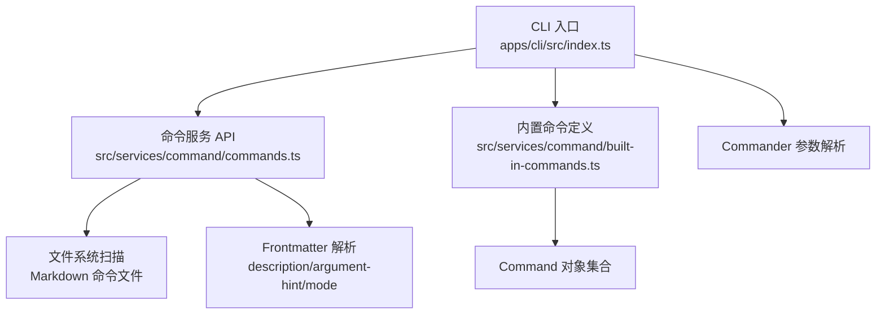
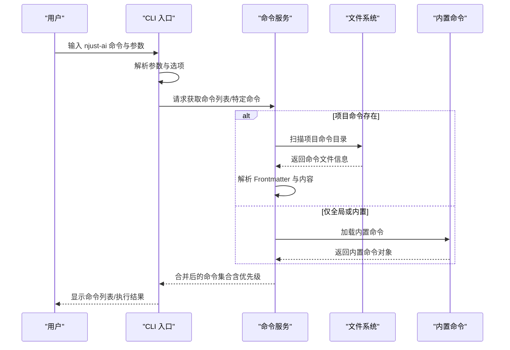
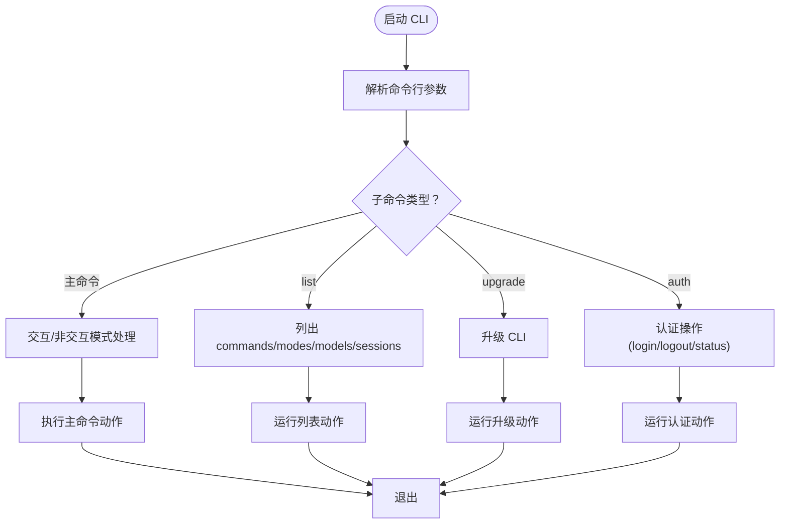
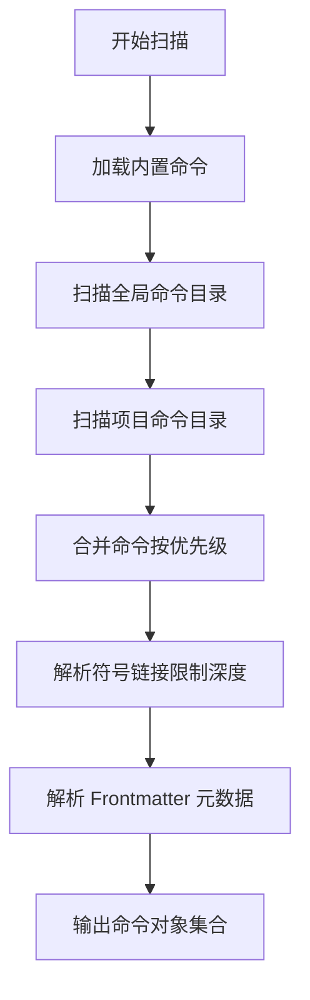
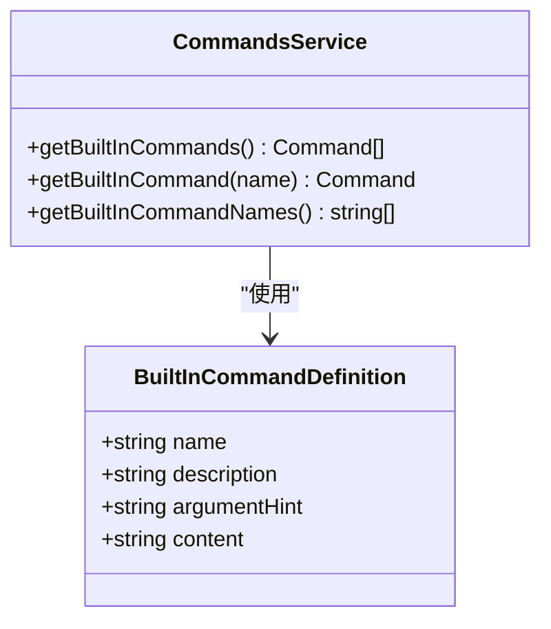
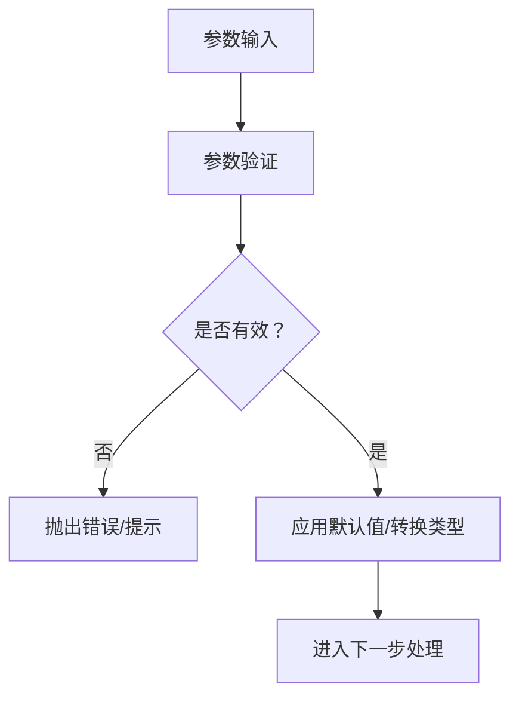
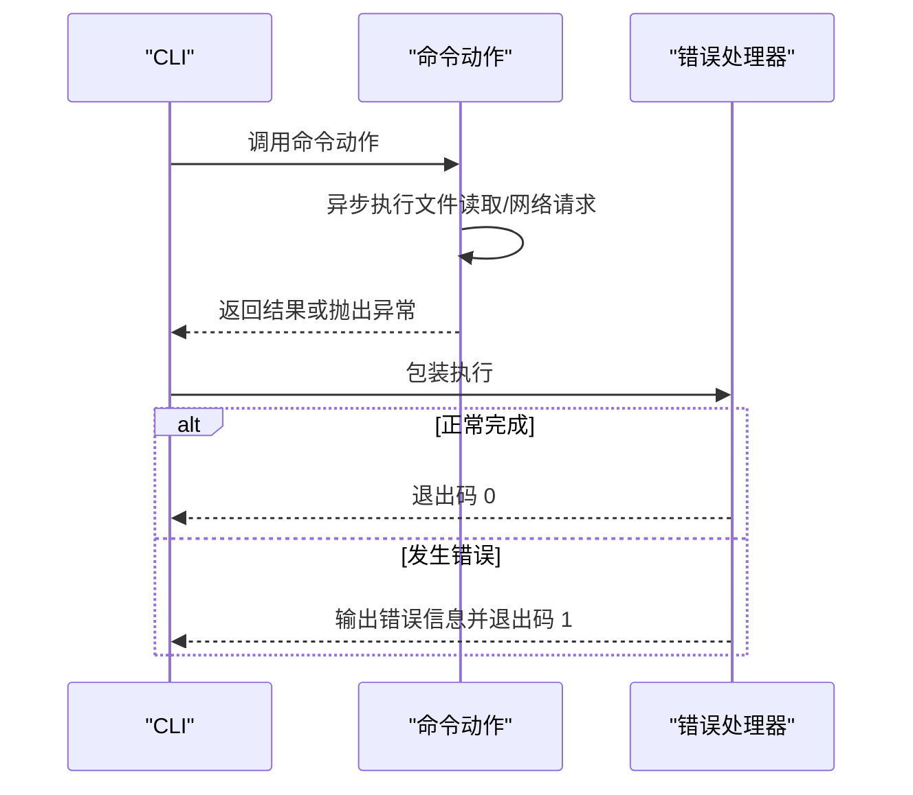
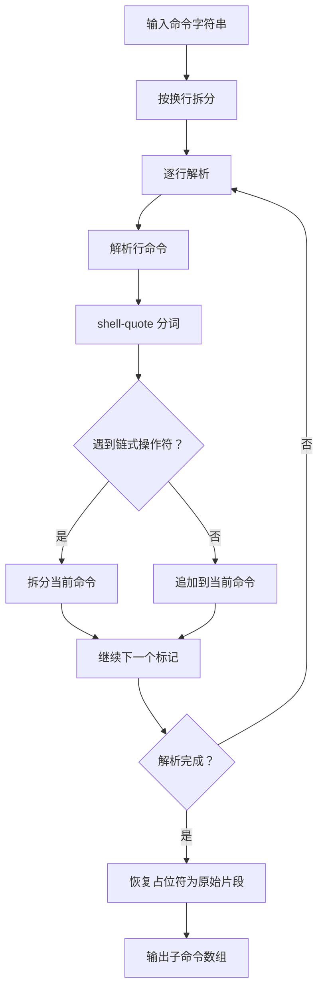
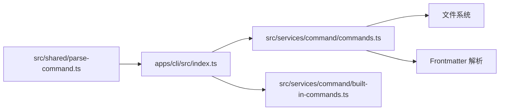

# 命令系统设计

<cite>
**本文档引用的文件**
- [apps/cli/src/index.ts](file://apps/cli/src/index.ts)
- [src/services/command/commands.ts](file://src/services/command/commands.ts)
- [src/services/command/built-in-commands.ts](file://src/services/command/built-in-commands.ts)
- [src/shared/parse-command.ts](file://src/shared/parse-command.ts)
- [apps/cli/src/commands/index.ts](file://apps/cli/src/commands/index.ts)
</cite>

## 目录
1. [简介](#简介)
2. [项目结构](#项目结构)
3. [核心组件](#核心组件)
4. [架构总览](#架构总览)
5. [详细组件分析](#详细组件分析)
6. [依赖关系分析](#依赖关系分析)
7. [性能考虑](#性能考虑)
8. [故障排除指南](#故障排除指南)
9. [结论](#结论)

## 简介
本文件面向 CLI 命令系统的设计与实现，重点阐述命令架构、命令注册机制、命令分类与组织方式，以及命令参数定义、验证规则与默认值设置。文档还涵盖命令执行流程、异步处理与错误传播机制，并通过具体实现示例展示如何创建新命令、处理用户输入与返回结果。最后，文档解释命令间的依赖关系与组合使用模式，并介绍命令帮助系统、自动补全与文档生成功能的实现细节。

## 项目结构
CLI 命令系统由三层组成：
- CLI 入口层：负责解析命令行参数、注册子命令并驱动执行。
- 命令服务层：负责命令发现、加载、解析与优先级合并。
- 内置命令层：提供预定义的命令内容与元数据。

**图表来源**
- [apps/cli/src/index.ts:17-169](file://apps/cli/src/index.ts#L17-L169)
- [src/services/command/commands.ts:127-170](file://src/services/command/commands.ts#L127-L170)
- [src/services/command/built-in-commands.ts:472-498](file://src/services/command/built-in-commands.ts#L472-L498)

**章节来源**
- [apps/cli/src/index.ts:17-169](file://apps/cli/src/index.ts#L17-L169)
- [src/services/command/commands.ts:127-170](file://src/services/command/commands.ts#L127-L170)
- [src/services/command/built-in-commands.ts:472-498](file://src/services/command/built-in-commands.ts#L472-L498)

## 核心组件
- CLI 入口与参数解析：基于 commander 的命令注册与选项定义，支持交互式与非交互式模式、会话管理、调试输出等。
- 命令发现与加载：从全局与项目命令目录递归扫描，支持符号链接解析，按优先级合并覆盖。
- 内置命令：以内嵌 JSON 定义的方式提供一组预置命令及其内容。
- 命令解析：将用户输入的命令字符串拆分为多个子命令，保留引号、重定向、子进程替换等特殊语法。

**章节来源**
- [apps/cli/src/index.ts:17-169](file://apps/cli/src/index.ts#L17-L169)
- [src/services/command/commands.ts:127-170](file://src/services/command/commands.ts#L127-L170)
- [src/services/command/built-in-commands.ts:472-498](file://src/services/command/built-in-commands.ts#L472-L498)
- [src/shared/parse-command.ts:16-38](file://src/shared/parse-command.ts#L16-L38)

## 架构总览
CLI 命令系统采用“入口层 + 服务层 + 内置层”的分层架构。入口层负责参数解析与命令注册；服务层负责命令发现、加载与优先级合并；内置层提供基础命令内容。命令内容以 Markdown 文件形式存储，支持 Frontmatter 元数据（描述、参数提示、模式）。

**图表来源**
- [apps/cli/src/index.ts:108-130](file://apps/cli/src/index.ts#L108-L130)
- [src/services/command/commands.ts:127-170](file://src/services/command/commands.ts#L127-L170)
- [src/services/command/built-in-commands.ts:472-498](file://src/services/command/built-in-commands.ts#L472-L498)

## 详细组件分析

### CLI 入口与命令注册
- 入口程序使用 commander 定义主命令与子命令，支持位置参数与透传选项。
- 主命令支持交互模式与非交互模式切换、会话恢复、调试输出、模型选择、模式切换等。
- 子命令包括 list（commands/modes/models/sessions）、upgrade、auth（login/logout/status）。
- 错误处理统一包装，捕获异常后输出错误信息并以相应退出码退出。

**图表来源**
- [apps/cli/src/index.ts:17-169](file://apps/cli/src/index.ts#L17-L169)

**章节来源**
- [apps/cli/src/index.ts:17-169](file://apps/cli/src/index.ts#L17-L169)

### 命令发现与加载机制
- 命令来源优先级：项目命令 > 全局命令 > 内置命令（后者可被前者覆盖）。
- 支持符号链接：递归解析符号链接目标，避免循环链接（最大深度限制），仅收集 Markdown 文件。
- 命令文件解析：使用 Frontmatter 提取 description、argument-hint、mode 等元数据，其余作为命令内容。
- 自动补全：提供命令名称列表接口，供外部工具调用。

**图表来源**
- [src/services/command/commands.ts:127-170](file://src/services/command/commands.ts#L127-L170)
- [src/services/command/commands.ts:269-350](file://src/services/command/commands.ts#L269-L350)

**章节来源**
- [src/services/command/commands.ts:127-170](file://src/services/command/commands.ts#L127-L170)
- [src/services/command/commands.ts:269-350](file://src/services/command/commands.ts#L269-L350)

### 内置命令定义
- 内置命令以键值对形式存储在内存中，每个命令包含名称、描述、可选参数提示与完整内容。
- 提供批量获取与单个查询接口，便于快速定位命令。
- 适用于无需外部文件即可提供的基础命令集。

**图表来源**
- [src/services/command/built-in-commands.ts:3-8](file://src/services/command/built-in-commands.ts#L3-L8)
- [src/services/command/built-in-commands.ts:472-498](file://src/services/command/built-in-commands.ts#L472-L498)

**章节来源**
- [src/services/command/built-in-commands.ts:472-498](file://src/services/command/built-in-commands.ts#L472-L498)

### 命令参数定义、验证与默认值
- 主命令参数：支持 prompt、prompt-file、session-id、workspace、print、stdin-prompt-stream、signal-only-exit、extension、debug、require-approval、api-key、provider、model、mode、terminal-shell、reasoning-effort、consecutive-mistake-limit、exit-on-error、ephemeral、oneshot、output-format 等。
- 子命令 list：支持 workspace、extension、api-key、format、debug 等通用选项。
- 默认值：部分选项提供默认值（如 model、mode、reasoning-effort），并在解析时进行类型转换（如 consecutive-mistake-limit 转为整数）。
- 验证规则：对 session-id 进行 UUID 校验（通过选项描述体现），对 output-format 进行枚举校验（text/json/stream-json）。

**图表来源**
- [apps/cli/src/index.ts:26-70](file://apps/cli/src/index.ts#L26-L70)
- [apps/cli/src/index.ts:78-84](file://apps/cli/src/index.ts#L78-L84)

**章节来源**
- [apps/cli/src/index.ts:26-70](file://apps/cli/src/index.ts#L26-L70)
- [apps/cli/src/index.ts:78-84](file://apps/cli/src/index.ts#L78-L84)

### 命令执行流程与异步处理
- 异步加载：命令扫描与文件读取均为异步操作，使用 Promise 并行处理多个目录条目。
- 错误传播：所有命令动作均包裹在统一的错误处理函数中，捕获异常后输出错误信息并以非零退出码退出。
- 流式输出：支持 stream-json 输出格式，配合 --stdin-prompt-stream 实现实时流式响应。

**图表来源**
- [apps/cli/src/index.ts:86-106](file://apps/cli/src/index.ts#L86-L106)

**章节来源**
- [apps/cli/src/index.ts:86-106](file://apps/cli/src/index.ts#L86-L106)

### 命令解析与多命令拆分
- 将输入字符串按换行符拆分为多行，再逐行解析为子命令序列。
- 使用 shell-quote 库正确处理引号、子进程替换、PowerShell 重定向、算术表达式、参数扩展等复杂语法。
- 对无法解析的情况提供回退策略，确保命令仍可被拆分执行。

**图表来源**
- [src/shared/parse-command.ts:16-38](file://src/shared/parse-command.ts#L16-L38)
- [src/shared/parse-command.ts:43-193](file://src/shared/parse-command.ts#L43-L193)

**章节来源**
- [src/shared/parse-command.ts:16-38](file://src/shared/parse-command.ts#L16-L38)
- [src/shared/parse-command.ts:43-193](file://src/shared/parse-command.ts#L43-L193)

### 命令帮助系统、自动补全与文档生成
- 帮助系统：基于 commander 的内置帮助输出，结合命令描述与参数说明。
- 自动补全：提供命令名称列表接口，供外部工具集成自动补全。
- 文档生成：命令内容采用 Markdown 格式，Frontmatter 中的 description、argument-hint、mode 可用于生成帮助文档与自动补全提示。

**章节来源**
- [apps/cli/src/index.ts:108-130](file://apps/cli/src/index.ts#L108-L130)
- [src/services/command/commands.ts:261-264](file://src/services/command/commands.ts#L261-L264)
- [src/services/command/commands.ts:222-241](file://src/services/command/commands.ts#L222-L241)

## 依赖关系分析
- CLI 入口依赖命令服务与内置命令，用于获取可用命令列表与执行动作。
- 命令服务依赖文件系统与 Frontmatter 解析库，用于扫描与解析命令文件。
- 命令解析模块独立于 CLI，可复用于其他场景。

**图表来源**
- [apps/cli/src/index.ts:17-169](file://apps/cli/src/index.ts#L17-L169)
- [src/services/command/commands.ts:127-170](file://src/services/command/commands.ts#L127-L170)
- [src/shared/parse-command.ts:16-38](file://src/shared/parse-command.ts#L16-L38)

**章节来源**
- [apps/cli/src/index.ts:17-169](file://apps/cli/src/index.ts#L17-L169)
- [src/services/command/commands.ts:127-170](file://src/services/command/commands.ts#L127-L170)
- [src/shared/parse-command.ts:16-38](file://src/shared/parse-command.ts#L16-L38)

## 性能考虑
- 并行扫描：命令目录扫描使用 Promise.all 并行处理多个条目，提升大目录下的加载速度。
- 符号链接限制：通过最大深度限制防止循环链接导致的无限递归与性能问题。
- Frontmatter 解析：仅在存在 Frontmatter 时进行解析，无 Frontmatter 的文件直接使用全文作为内容，减少不必要的解析开销。
- 输出格式：stream-json 适合实时流式输出，降低内存占用与延迟。

## 故障排除指南
- 命令文件读取失败：检查文件权限与路径，确认文件为有效的 Markdown 格式。
- 符号链接异常：确认符号链接目标存在且可访问，避免循环链接。
- 参数解析错误：检查参数格式与取值范围（如 output-format、reasoning-effort），确保符合枚举或类型要求。
- 错误处理：所有命令动作均通过统一的错误处理函数包装，出现异常时会输出错误信息并以非零退出码退出，便于定位问题。

**章节来源**
- [apps/cli/src/index.ts:86-106](file://apps/cli/src/index.ts#L86-L106)
- [src/services/command/commands.ts:343-345](file://src/services/command/commands.ts#L343-L345)

## 结论
该 CLI 命令系统通过清晰的分层架构实现了命令的发现、加载与执行，具备良好的扩展性与可维护性。内置命令与项目/全局命令的优先级机制确保了灵活性与一致性。参数解析与错误处理机制完善，支持多种输出格式与流式处理。建议在新增命令时遵循现有目录结构与 Frontmatter 规范，并充分利用内置命令与解析模块的能力，以保证系统的整体一致性与用户体验。