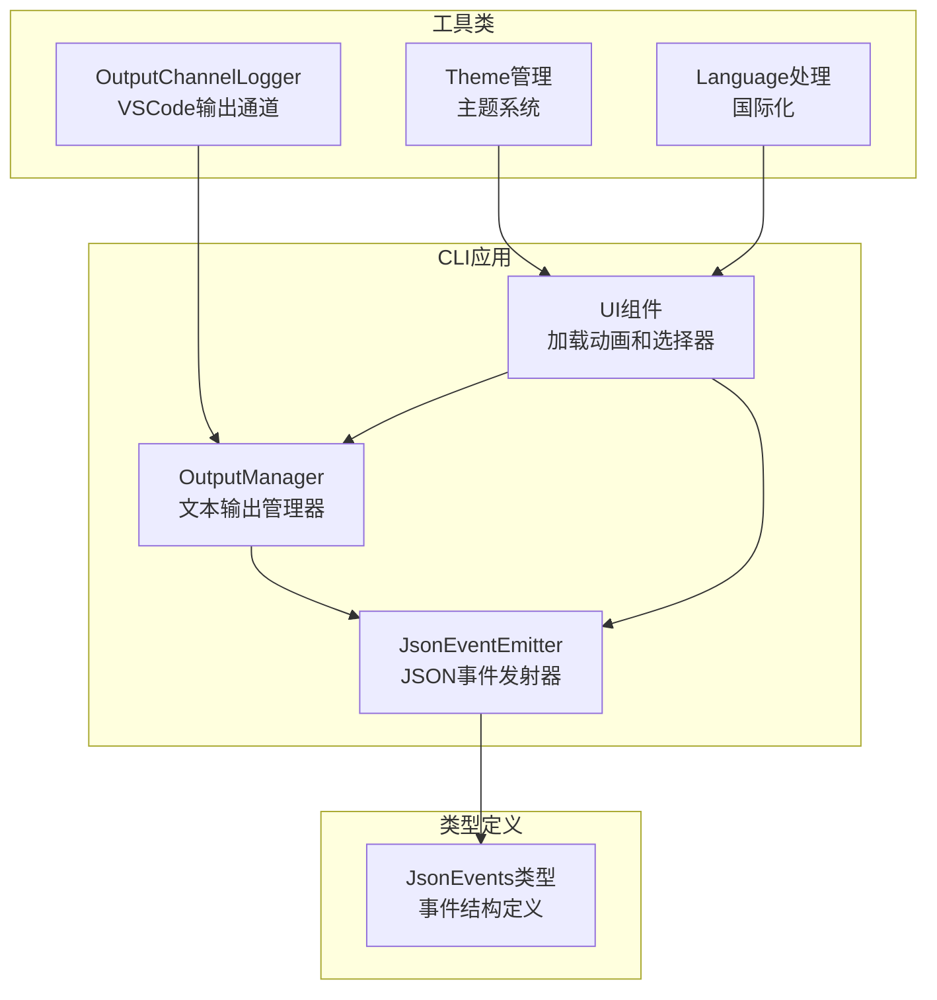
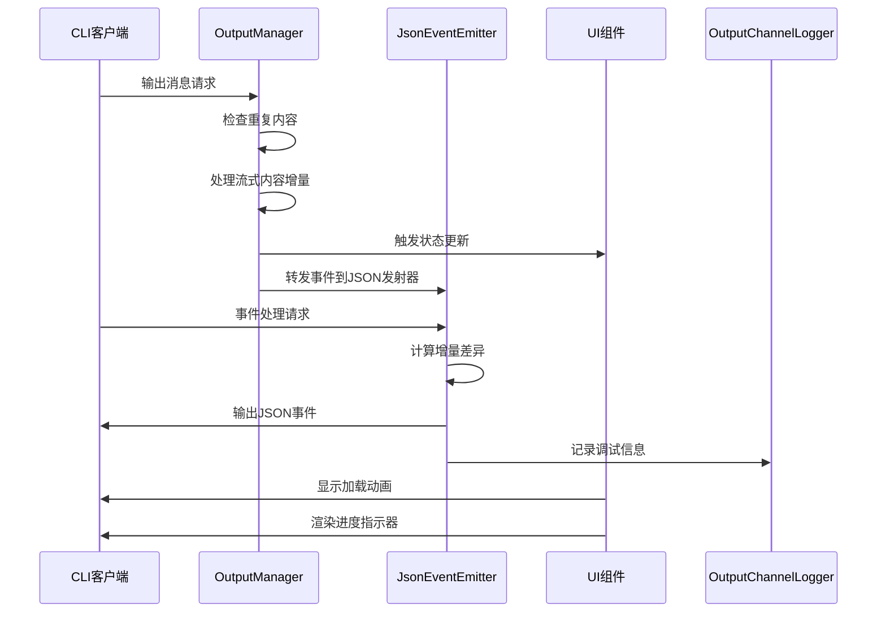
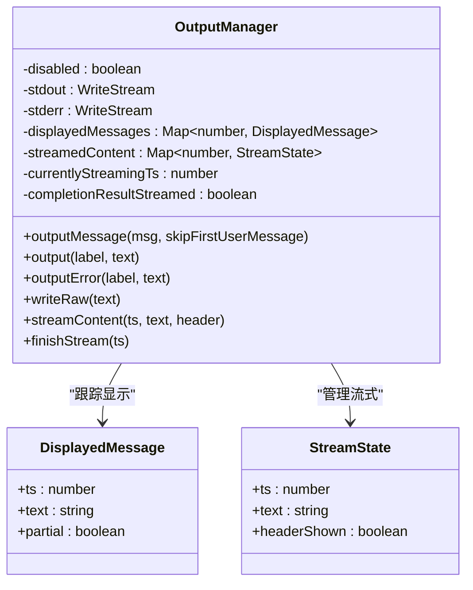
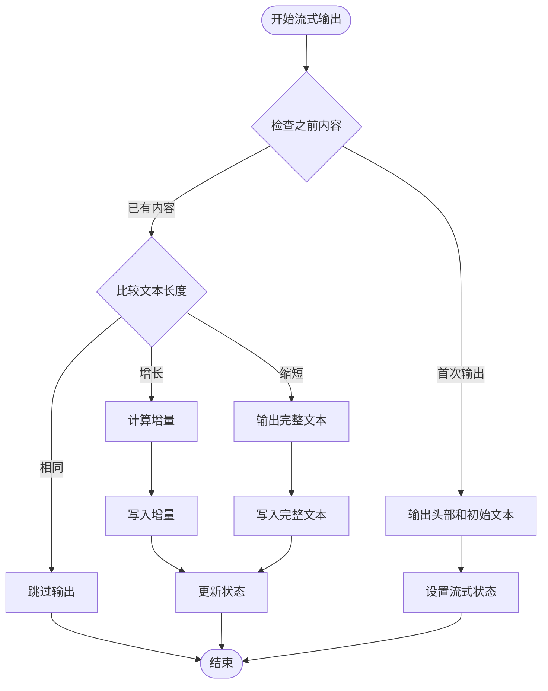
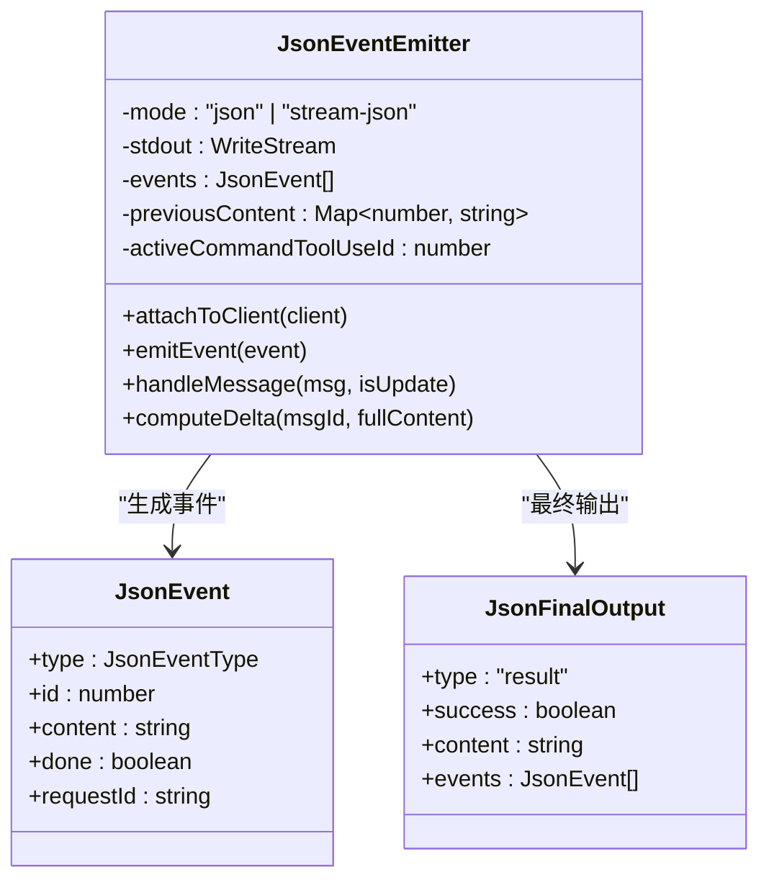
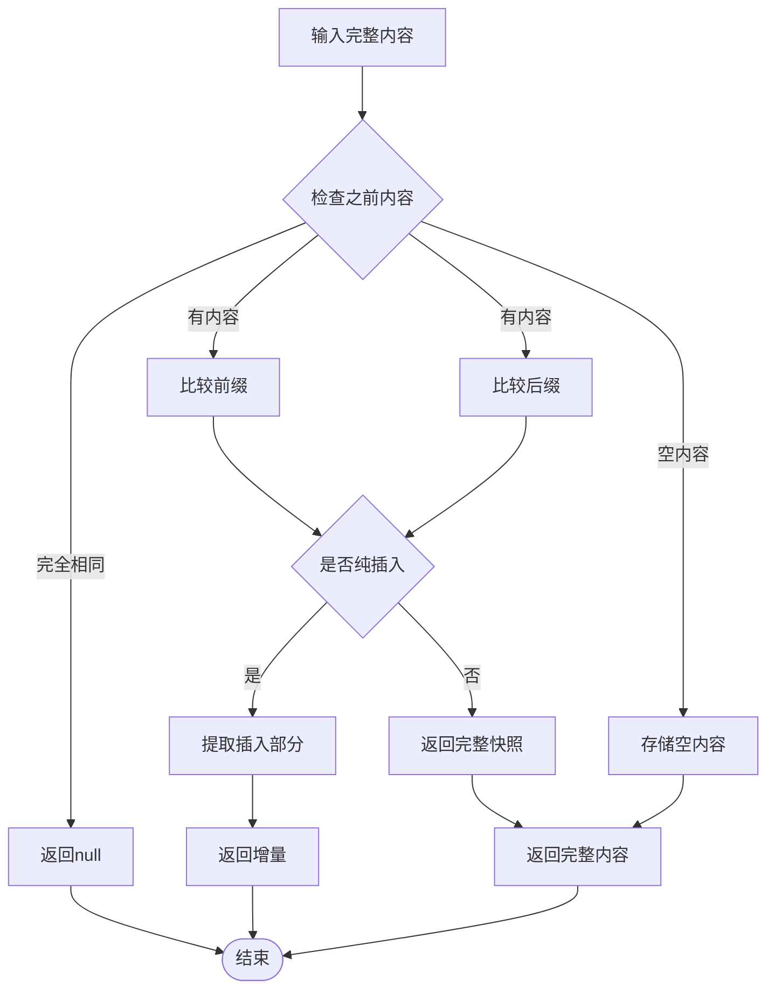
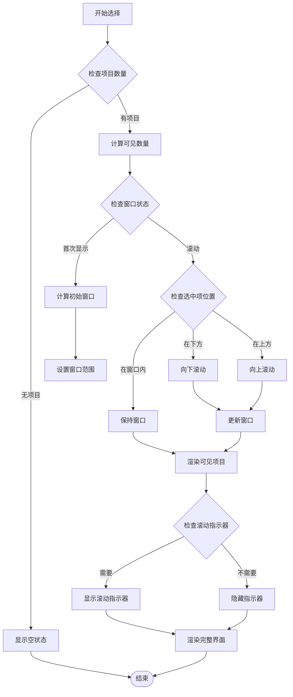

# 输出格式化

<cite>
**本文档引用的文件**
- [apps/cli/src/agent/output-manager.ts](file://apps/cli/src/agent/output-manager.ts)
- [apps/cli/src/agent/json-event-emitter.ts](file://apps/cli/src/agent/json-event-emitter.ts)
- [apps/cli/src/types/json-events.ts](file://apps/cli/src/types/json-events.ts)
- [apps/cli/src/ui/components/LoadingText.tsx](file://apps/cli/src/ui/components/LoadingText.tsx)
- [apps/cli/src/ui/components/autocomplete/PickerSelect.tsx](file://apps/cli/src/ui/components/autocomplete/PickerSelect.tsx)
- [src/utils/outputChannelLogger.ts](file://src/utils/outputChannelLogger.ts)
- [src/integrations/theme/getTheme.ts](file://src/integrations/theme/getTheme.ts)
- [src/shared/language.ts](file://src/shared/language.ts)
- [src/shared/__tests__/language.spec.ts](file://src/shared/__tests__/language.spec.ts)
</cite>

## 目录
1. [简介](#简介)
2. [项目结构](#项目结构)
3. [核心组件](#核心组件)
4. [架构概览](#架构概览)
5. [详细组件分析](#详细组件分析)
6. [依赖关系分析](#依赖关系分析)
7. [性能考虑](#性能考虑)
8. [故障排除指南](#故障排除指南)
9. [结论](#结论)

## 简介

本文档详细介绍了Njust-AI CLI输出格式化系统的全面技术文档。该系统提供了多种输出格式化功能，包括文本输出格式化、表格渲染、JSON和YAML格式化输出、颜色编码、样式定制和主题支持、进度条显示、加载动画和状态反馈等。

系统采用模块化设计，主要分为三个核心组件：OutputManager负责基础文本输出和流式处理，JsonEventEmitter处理结构化JSON事件输出，以及各种UI组件提供可视化反馈。所有组件都经过精心优化以处理大量数据和实时流式输出。

## 项目结构

CLI输出格式化系统主要分布在以下目录中：



**图表来源**
- [apps/cli/src/agent/output-manager.ts:1-464](file://apps/cli/src/agent/output-manager.ts#L1-L464)
- [apps/cli/src/agent/json-event-emitter.ts:1-906](file://apps/cli/src/agent/json-event-emitter.ts#L1-L906)
- [apps/cli/src/types/json-events.ts:1-122](file://apps/cli/src/types/json-events.ts#L1-L122)

**章节来源**
- [apps/cli/src/agent/output-manager.ts:1-464](file://apps/cli/src/agent/output-manager.ts#L1-L464)
- [apps/cli/src/agent/json-event-emitter.ts:1-906](file://apps/cli/src/agent/json-event-emitter.ts#L1-L906)
- [apps/cli/src/types/json-events.ts:1-122](file://apps/cli/src/types/json-events.ts#L1-L122)

## 核心组件

### OutputManager - 文本输出管理器

OutputManager是CLI输出系统的核心组件，负责处理所有文本输出和流式内容管理。其主要功能包括：

- **消息类型处理**：支持不同类型的消息（text、reasoning、command_output、error等）
- **流式内容管理**：使用增量计算确保只输出新内容
- **重复内容避免**：跟踪已显示的消息防止重复输出
- **状态跟踪**：监控当前流式状态和消息时间戳

### JsonEventEmitter - 结构化JSON事件发射器

JsonEventEmitter专门处理结构化JSON输出，支持两种模式：

- **stream-json模式**：NDJSON格式，每行一个JSON对象，适合实时流式处理
- **json模式**：单个JSON对象，包含累积的所有事件信息

该组件提供高效的增量计算和事件过滤机制。

### UI组件系统

系统包含多个React组件提供用户界面反馈：

- **LoadingText**：提供加载动画和随机思考短语
- **PickerSelect**：实现智能的自动完成选择器，支持窗口化显示大量选项

**章节来源**
- [apps/cli/src/agent/output-manager.ts:67-464](file://apps/cli/src/agent/output-manager.ts#L67-L464)
- [apps/cli/src/agent/json-event-emitter.ts:96-906](file://apps/cli/src/agent/json-event-emitter.ts#L96-L906)
- [apps/cli/src/ui/components/LoadingText.tsx:1-41](file://apps/cli/src/ui/components/LoadingText.tsx#L1-L41)
- [apps/cli/src/ui/components/autocomplete/PickerSelect.tsx:38-189](file://apps/cli/src/ui/components/autocomplete/PickerSelect.tsx#L38-L189)

## 架构概览



**图表来源**
- [apps/cli/src/agent/output-manager.ts:125-141](file://apps/cli/src/agent/output-manager.ts#L125-L141)
- [apps/cli/src/agent/json-event-emitter.ts:476-509](file://apps/cli/src/agent/json-event-emitter.ts#L476-L509)
- [apps/cli/src/ui/components/LoadingText.tsx:28-39](file://apps/cli/src/ui/components/LoadingText.tsx#L28-L39)

系统采用观察者模式和事件驱动架构，确保各个组件之间的松耦合和高内聚。

## 详细组件分析

### OutputManager详细分析

OutputManager实现了完整的文本输出管理功能：

#### 数据结构设计



**图表来源**
- [apps/cli/src/agent/output-manager.ts:27-40](file://apps/cli/src/agent/output-manager.ts#L27-L40)
- [apps/cli/src/agent/output-manager.ts:67-112](file://apps/cli/src/agent/output-manager.ts#L67-L112)

#### 流式输出算法

OutputManager使用增量计算算法确保高效的内容传输：



**图表来源**
- [apps/cli/src/agent/output-manager.ts:387-403](file://apps/cli/src/agent/output-manager.ts#L387-L403)

#### 错误处理机制

系统实现了多层次的错误处理和恢复机制：

- **重复内容检测**：防止消息重复显示
- **流式状态管理**：确保流式输出的正确结束
- **异常捕获**：在处理过程中捕获并记录异常
- **资源清理**：及时清理临时状态和定时器

**章节来源**
- [apps/cli/src/agent/output-manager.ts:125-464](file://apps/cli/src/agent/output-manager.ts#L125-L464)

### JsonEventEmitter详细分析

JsonEventEmitter提供了强大的结构化事件输出功能：

#### 事件类型系统



**图表来源**
- [apps/cli/src/agent/json-event-emitter.ts:96-142](file://apps/cli/src/agent/json-event-emitter.ts#L96-L142)
- [apps/cli/src/types/json-events.ts:67-122](file://apps/cli/src/types/json-events.ts#L67-L122)

#### 增量计算优化

JsonEventEmitter实现了高效的增量计算算法：



**图表来源**
- [apps/cli/src/agent/json-event-emitter.ts:250-294](file://apps/cli/src/agent/json-event-emitter.ts#L250-L294)

#### 命令输出处理

系统特别优化了命令输出的处理逻辑：

- **超时容错**：为命令执行设置超时保护
- **状态同步**：确保命令输出与执行状态同步
- **增量传输**：仅传输新增的输出内容
- **资源清理**：及时清理已完成命令的状态

**章节来源**
- [apps/cli/src/agent/json-event-emitter.ts:315-424](file://apps/cli/src/agent/json-event-emitter.ts#L315-L424)

### UI组件系统分析

#### LoadingText组件

LoadingText组件提供了丰富的加载反馈体验：

```mermaid
classDiagram
class LoadingText {
-randomPhrase : string
+children : ReactNode
+render() : JSX.Element
}
class Spinner {
+label : string
+type : string
}
LoadingText --> Spinner : "使用"
note for LoadingText : "随机思考短语\n加载动画\n响应式标签"
```

**图表来源**
- [apps/cli/src/ui/components/LoadingText.tsx:24-41](file://apps/cli/src/ui/components/LoadingText.tsx#L24-L41)

#### PickerSelect组件

PickerSelect实现了智能的选择器组件：



**图表来源**
- [apps/cli/src/ui/components/autocomplete/PickerSelect.tsx:38-189](file://apps/cli/src/ui/components/autocomplete/PickerSelect.tsx#L38-L189)

**章节来源**
- [apps/cli/src/ui/components/LoadingText.tsx:1-41](file://apps/cli/src/ui/components/LoadingText.tsx#L1-L41)
- [apps/cli/src/ui/components/autocomplete/PickerSelect.tsx:38-189](file://apps/cli/src/ui/components/autocomplete/PickerSelect.tsx#L38-L189)

## 依赖关系分析

```mermaid
graph TB
subgraph "外部依赖"
TYPES[@njust-ai/types<br/>类型定义]
OBSERVABLE[Observable<br/>观察者模式]
INKJS[@inkjs/ui<br/>React组件库]
end
subgraph "内部模块"
OUTPUT_MANAGER[OutputManager]
JSON_EMITTER[JsonEventEmitter]
JSON_EVENTS[JsonEvents类型]
OUTPUT_LOGGER[OutputChannelLogger]
THEME_MANAGER[Theme管理]
LANGUAGE_UTILS[Language工具]
end
TYPES --> OUTPUT_MANAGER
TYPES --> JSON_EMITTER
OBSERVABLE --> OUTPUT_MANAGER
INKJS --> OUTPUT_MANAGER
OUTPUT_MANAGER --> JSON_EMITTER
JSON_EMITTER --> JSON_EVENTS
OUTPUT_MANAGER --> OUTPUT_LOGGER
THEME_MANAGER --> OUTPUT_MANAGER
LANGUAGE_UTILS --> OUTPUT_MANAGER
```

**图表来源**
- [apps/cli/src/agent/output-manager.ts:16-18](file://apps/cli/src/agent/output-manager.ts#L16-L18)
- [apps/cli/src/agent/json-event-emitter.ts:17-23](file://apps/cli/src/agent/json-event-emitter.ts#L17-L23)

系统采用清晰的依赖层次结构，确保模块间的低耦合和高内聚。

**章节来源**
- [apps/cli/src/agent/output-manager.ts:16-23](file://apps/cli/src/agent/output-manager.ts#L16-L23)
- [apps/cli/src/agent/json-event-emitter.ts:17-23](file://apps/cli/src/agent/json-event-emitter.ts#L17-L23)

## 性能考虑

### 流式处理优化

系统实现了多项性能优化措施：

- **增量计算**：仅传输新增内容，减少网络带宽占用
- **内存管理**：使用Map数据结构高效管理状态
- **异步写入**：使用Promise管理异步I/O操作
- **背压控制**：通过pendingWrites集合控制输出速率

### 内存使用优化

```mermaid
flowchart TD
Start[开始处理] --> CheckMemory{检查内存使用}
CheckMemory --> |正常| ProcessNormal[正常处理]
CheckMemory --> |高| CleanupOld[清理旧状态]
CheckMemory --> |极高| ForceCleanup[强制清理}
ProcessNormal --> StoreNew[存储新状态]
CleanupOld --> RemoveStale[移除陈旧数据]
RemoveStale --> StoreNew
ForceCleanup --> ClearAll[清空所有状态]
ClearAll --> StoreNew
StoreNew --> Monitor[监控内存使用]
Monitor --> CheckMemory
```

### 并发处理

系统支持高并发场景：

- **事件队列**：使用Observable模式处理异步事件
- **流式处理**：支持实时流式数据处理
- **错误隔离**：每个组件独立处理自己的错误
- **资源管理**：及时释放不再使用的资源

## 故障排除指南

### 常见问题诊断

#### 输出重复问题

**症状**：相同内容重复显示
**解决方案**：
1. 检查displayedMessages映射表
2. 验证消息时间戳唯一性
3. 确认isAlreadyDisplayed方法正确性

#### 流式输出中断

**症状**：流式输出突然停止
**解决方案**：
1. 检查currentlyStreamingTs状态
2. 验证finishStream方法调用
3. 确认streamingState观察者正确注册

#### JSON事件丢失

**症状**：某些事件没有输出
**解决方案**：
1. 检查事件过滤规则
2. 验证emitEvent方法调用
3. 确认事件类型识别正确

### 调试工具

系统提供了多种调试辅助工具：

- **firstPartial日志**：跟踪首次部分输出
- **状态监控**：实时监控组件状态变化
- **事件追踪**：记录所有事件处理过程
- **性能指标**：监控内存使用和处理延迟

**章节来源**
- [apps/cli/src/agent/output-manager.ts:211-231](file://apps/cli/src/agent/output-manager.ts#L211-L231)
- [apps/cli/src/agent/json-event-emitter.ts:807-813](file://apps/cli/src/agent/json-event-emitter.ts#L807-L813)

## 结论

Njust-AI CLI输出格式化系统是一个高度模块化、性能优化的完整解决方案。系统通过精心设计的架构和算法，实现了高效的内容输出、流式处理和状态管理。

### 主要优势

1. **高性能**：通过增量计算和内存优化，确保处理大量数据时的流畅性
2. **模块化设计**：清晰的组件分离，便于维护和扩展
3. **实时处理**：支持流式输出和实时状态反馈
4. **国际化支持**：内置多语言支持和本地化配置
5. **错误处理**：完善的异常处理和恢复机制

### 技术特色

- **双模式输出**：支持传统文本输出和结构化JSON输出
- **智能增量**：仅传输变更内容，最大化网络效率
- **状态管理**：完整的流式状态跟踪和恢复
- **UI反馈**：丰富的加载动画和交互反馈
- **主题系统**：灵活的颜色编码和样式定制

该系统为CLI应用提供了强大而灵活的输出格式化能力，能够满足从简单文本输出到复杂流式数据处理的各种需求。