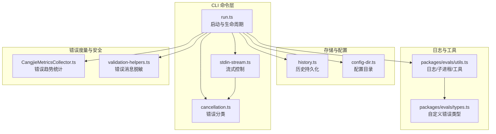
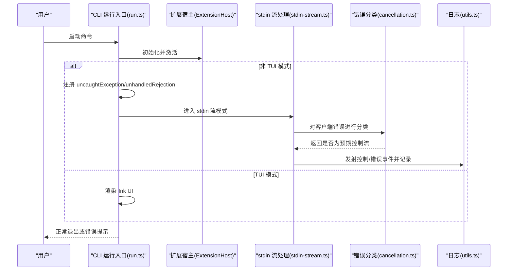
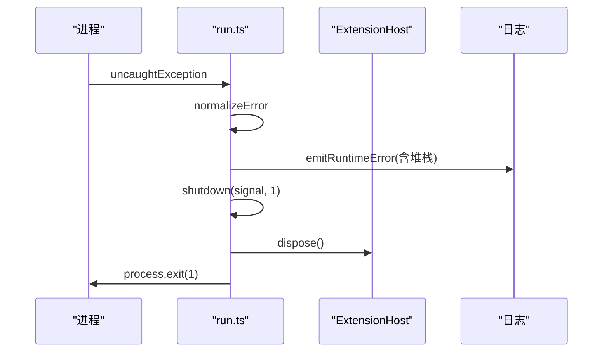
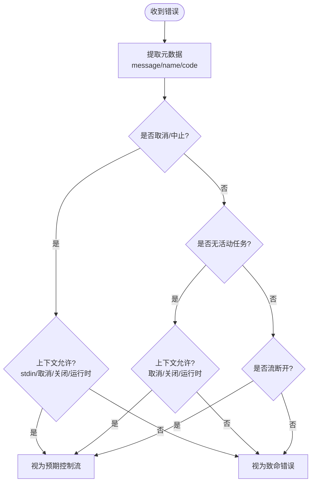
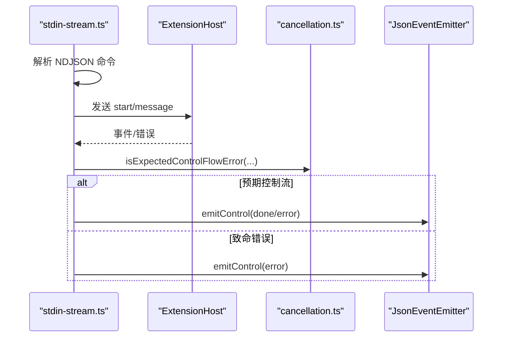
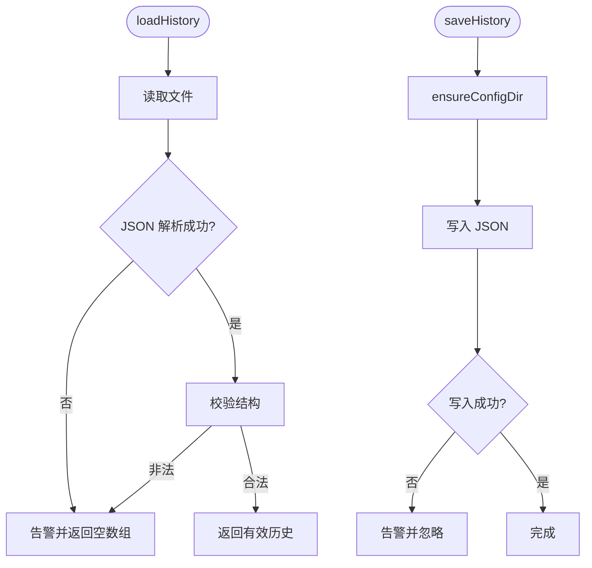
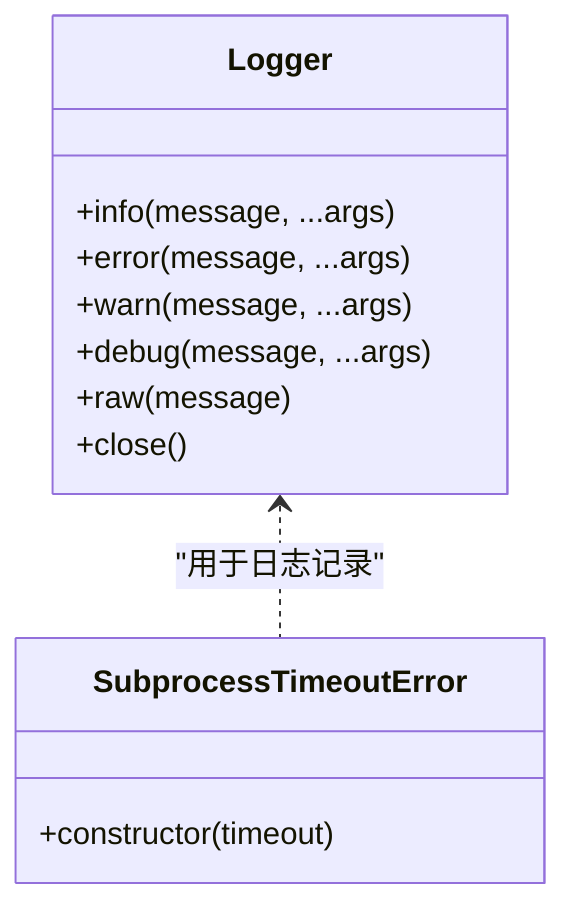
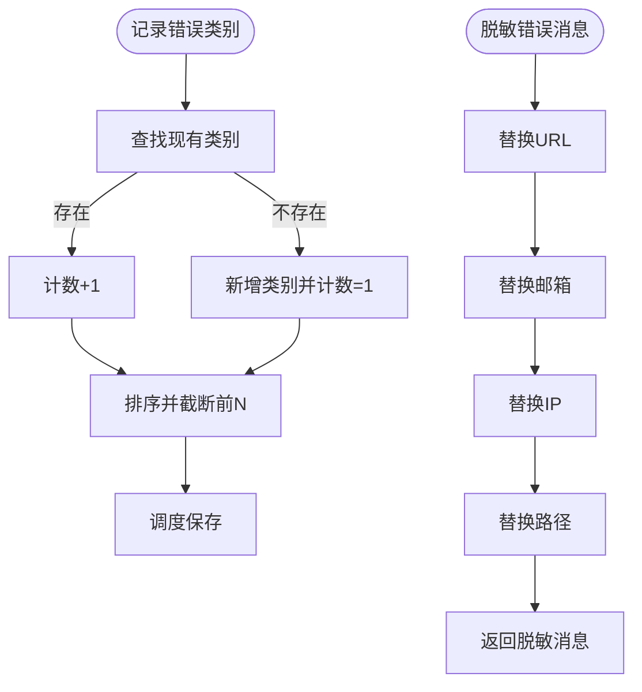
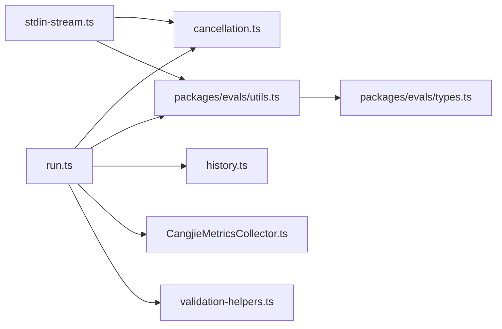

# 错误处理

<cite>
**本文引用的文件**
- [apps/cli/src/commands/cli/run.ts](file://apps/cli/src/commands/cli/run.ts)
- [apps/cli/src/commands/cli/cancellation.ts](file://apps/cli/src/commands/cli/cancellation.ts)
- [apps/cli/src/commands/cli/stdin-stream.ts](file://apps/cli/src/commands/cli/stdin-stream.ts)
- [apps/cli/src/lib/storage/history.ts](file://apps/cli/src/lib/storage/history.ts)
- [apps/cli/src/lib/storage/config-dir.ts](file://apps/cli/src/lib/storage/config-dir.ts)
- [packages/evals/src/cli/utils.ts](file://packages/evals/src/cli/utils.ts)
- [packages/evals/src/cli/types.ts](file://packages/evals/src/cli/types.ts)
- [packages/evals/src/db/queries/errors.ts](file://packages/evals/src/db/queries/errors.ts)
- [webview-ui/src/utils/sourceMapUtils.ts](file://webview-ui/src/utils/sourceMapUtils.ts)
- [src/services/cangjie-lsp/CangjieMetricsCollector.ts](file://src/services/cangjie-lsp/CangjieMetricsCollector.ts)
- [src/services/code-index/shared/validation-helpers.ts](file://src/services/code-index/shared/validation-helpers.ts)
- [.njust-ai/rules-debug/cli.md](file://.njust-ai/rules-debug/cli.md)
</cite>

## 目录
1. [简介](#简介)
2. [项目结构](#项目结构)
3. [核心组件](#核心组件)
4. [架构总览](#架构总览)
5. [详细组件分析](#详细组件分析)
6. [依赖关系分析](#依赖关系分析)
7. [性能考量](#性能考量)
8. [故障排查指南](#故障排查指南)
9. [结论](#结论)
10. [附录](#附录)

## 简介
本文件面向 CLI 的错误处理体系，系统性阐述错误分类、错误码定义与错误消息格式化策略，解释异常捕获、错误传播与降级处理机制，覆盖网络错误、文件操作错误与业务逻辑错误的差异化处理。同时提供用户友好提示、调试信息收集与错误报告能力，给出具体示例与最佳实践，并说明错误日志记录、堆栈跟踪与性能监控的实现要点。

## 项目结构
CLI 错误处理涉及命令入口、流式控制、存储与日志、子进程与超时、错误分类与上报等多个模块，形成“输入校验—异常捕获—分类判定—降级输出—日志记录—信号处理”的闭环。

图示来源
- [apps/cli/src/commands/cli/run.ts:110-683](file://apps/cli/src/commands/cli/run.ts#L110-L683)
- [apps/cli/src/commands/cli/stdin-stream.ts:342-800](file://apps/cli/src/commands/cli/stdin-stream.ts#L342-L800)
- [apps/cli/src/commands/cli/cancellation.ts:1-132](file://apps/cli/src/commands/cli/cancellation.ts#L1-L132)
- [apps/cli/src/lib/storage/history.ts:1-110](file://apps/cli/src/lib/storage/history.ts#L1-L110)
- [apps/cli/src/lib/storage/config-dir.ts:1-25](file://apps/cli/src/lib/storage/config-dir.ts#L1-L25)
- [packages/evals/src/cli/utils.ts:1-252](file://packages/evals/src/cli/utils.ts#L1-L252)
- [packages/evals/src/cli/types.ts:1-20](file://packages/evals/src/cli/types.ts#L1-L20)
- [src/services/cangjie-lsp/CangjieMetricsCollector.ts:93-105](file://src/services/cangjie-lsp/CangjieMetricsCollector.ts#L93-L105)
- [src/services/code-index/shared/validation-helpers.ts:9-35](file://src/services/code-index/shared/validation-helpers.ts#L9-L35)

章节来源
- [apps/cli/src/commands/cli/run.ts:110-683](file://apps/cli/src/commands/cli/run.ts#L110-L683)
- [apps/cli/src/commands/cli/stdin-stream.ts:342-800](file://apps/cli/src/commands/cli/stdin-stream.ts#L342-L800)
- [apps/cli/src/commands/cli/cancellation.ts:1-132](file://apps/cli/src/commands/cli/cancellation.ts#L1-L132)

## 核心组件
- 运行时错误捕获与传播：在非 TUI 模式下注册全局未捕获异常与未处理拒绝处理器，统一标准化错误并输出，随后按需优雅关闭。
- 错误分类与预期控制流：针对取消、无活动任务、流断开等场景建立模式匹配与集合判定，允许在特定上下文中将错误视为“预期控制流”，避免中断。
- 流式 stdin 控制：NDJSON 解析、队列快照、请求 ID 绑定、完成/错误事件发射，配合错误分类实现可控降级。
- 文件与存储错误：历史读写、配置目录创建均采用容错策略，遇到 ENOENT 等常见错误时记录告警并继续运行。
- 日志与调试：提供原始日志输出、带标签的日志器、子进程超时强制终止与 SIGKILL 发送，以及基于源映射的堆栈增强工具。
- 度量与脱敏：记录错误类别趋势，对错误消息进行敏感信息脱敏，保障报告安全性。

章节来源
- [apps/cli/src/commands/cli/run.ts:457-600](file://apps/cli/src/commands/cli/run.ts#L457-L600)
- [apps/cli/src/commands/cli/cancellation.ts:74-131](file://apps/cli/src/commands/cli/cancellation.ts#L74-L131)
- [apps/cli/src/commands/cli/stdin-stream.ts:405-443](file://apps/cli/src/commands/cli/stdin-stream.ts#L405-L443)
- [apps/cli/src/lib/storage/history.ts:46-82](file://apps/cli/src/lib/storage/history.ts#L46-L82)
- [packages/evals/src/cli/utils.ts:52-137](file://packages/evals/src/cli/utils.ts#L52-L137)
- [packages/evals/src/cli/types.ts:6-11](file://packages/evals/src/cli/types.ts#L6-L11)
- [src/services/cangjie-lsp/CangjieMetricsCollector.ts:93-105](file://src/services/cangjie-lsp/CangjieMetricsCollector.ts#L93-L105)
- [src/services/code-index/shared/validation-helpers.ts:9-35](file://src/services/code-index/shared/validation-helpers.ts#L9-L35)

## 架构总览
CLI 错误处理遵循“输入校验—异常捕获—分类判定—降级输出—日志记录—信号处理”的流程，关键路径如下：

图示来源
- [apps/cli/src/commands/cli/run.ts:411-683](file://apps/cli/src/commands/cli/run.ts#L411-L683)
- [apps/cli/src/commands/cli/stdin-stream.ts:342-800](file://apps/cli/src/commands/cli/stdin-stream.ts#L342-L800)
- [apps/cli/src/commands/cli/cancellation.ts:106-131](file://apps/cli/src/commands/cli/cancellation.ts#L106-L131)
- [packages/evals/src/cli/utils.ts:52-137](file://packages/evals/src/cli/utils.ts#L52-L137)

## 详细组件分析

### 组件 A：运行时错误捕获与传播
- 功能要点
  - 标准化错误对象，统一输出格式（JSON 或文本），保留堆栈信息。
  - 在 --signal-only-exit 模式下保持进程存活但不退出，仅输出提示。
  - 优雅关闭：移除监听、释放资源、刷新输出、退出进程。
- 关键路径
  - 未捕获异常与未处理拒绝：emitRuntimeError → shutdown。
  - 主流程异常：emitRuntimeError → disposeHost → flushStdout → process.exit(1)。

图示来源
- [apps/cli/src/commands/cli/run.ts:526-600](file://apps/cli/src/commands/cli/run.ts#L526-L600)

章节来源
- [apps/cli/src/commands/cli/run.ts:457-600](file://apps/cli/src/commands/cli/run.ts#L457-L600)

### 组件 B：错误分类与预期控制流
- 功能要点
  - 取消相关：基于错误名、错误码、消息模式识别取消/中止。
  - 无活动任务：识别“找不到任务/已完成/已取消”等提示。
  - 流断开：识别 EPIPE/ECONNRESET 等网络/流错误。
  - 上下文判定：stdin 流模式、取消请求、关闭中、运行时等上下文影响是否视为预期。
- 使用场景
  - stdin 流客户端错误监听：将预期控制流错误转为控制事件而非致命错误。
  - 任务启动/消息发送失败：根据分类决定是否发射“已取消/失败”事件。

图示来源
- [apps/cli/src/commands/cli/cancellation.ts:37-131](file://apps/cli/src/commands/cli/cancellation.ts#L37-L131)

章节来源
- [apps/cli/src/commands/cli/cancellation.ts:1-132](file://apps/cli/src/commands/cli/cancellation.ts#L1-L132)

### 组件 C：stdin 流式控制与错误传播
- 功能要点
  - NDJSON 解析与命令校验，逐条解析并校验字段。
  - 队列快照与请求 ID 绑定，保证事件溯源。
  - 客户端错误监听：对预期控制流错误转为控制事件，否则标记致命错误。
  - 任务生命周期事件：开始、确认、完成、失败、取消等。
- 关键路径
  - 客户端错误监听 → isExpectedControlFlowError → 控制事件或致命错误。
  - 任务完成 → 发射完成事件并清理状态。

图示来源
- [apps/cli/src/commands/cli/stdin-stream.ts:405-443](file://apps/cli/src/commands/cli/stdin-stream.ts#L405-L443)
- [apps/cli/src/commands/cli/stdin-stream.ts:667-721](file://apps/cli/src/commands/cli/stdin-stream.ts#L667-L721)
- [apps/cli/src/commands/cli/cancellation.ts:106-131](file://apps/cli/src/commands/cli/cancellation.ts#L106-L131)

章节来源
- [apps/cli/src/commands/cli/stdin-stream.ts:342-800](file://apps/cli/src/commands/cli/stdin-stream.ts#L342-L800)

### 组件 D：文件与存储错误处理
- 功能要点
  - 历史加载：JSON 解析失败或结构不合法时返回空列表并告警。
  - 历史保存：目录创建失败或写入失败仅记录告警，不影响主流程。
  - 配置目录：递归创建，忽略“已存在”错误。
- 最佳实践
  - 将“持久化失败”视为非致命，优先保证主流程可用。
  - 对常见错误码（如 ENOENT）进行显式判断与分支处理。

图示来源
- [apps/cli/src/lib/storage/history.ts:28-82](file://apps/cli/src/lib/storage/history.ts#L28-L82)
- [apps/cli/src/lib/storage/config-dir.ts:13-24](file://apps/cli/src/lib/storage/config-dir.ts#L13-L24)

章节来源
- [apps/cli/src/lib/storage/history.ts:1-110](file://apps/cli/src/lib/storage/history.ts#L1-L110)
- [apps/cli/src/lib/storage/config-dir.ts:1-25](file://apps/cli/src/lib/storage/config-dir.ts#L1-L25)

### 组件 E：日志记录与调试信息收集
- 功能要点
  - Logger：带时间戳、级别、标签的结构化日志，支持 raw 输出。
  - 子进程：超时等待，超时后强制 SIGKILL 并记录。
  - 堆栈增强：使用 StackTrace.js 应用源映射，还原源码位置。
  - 自定义错误类型：子进程超时错误类，便于统一捕获与处理。
- 使用建议
  - 在 CLI 调试阶段使用文件日志避免破坏 TUI。
  - 对外部进程输出进行缓冲与分发，避免噪声。

图示来源
- [packages/evals/src/cli/utils.ts:52-137](file://packages/evals/src/cli/utils.ts#L52-L137)
- [packages/evals/src/cli/types.ts:6-11](file://packages/evals/src/cli/types.ts#L6-L11)

章节来源
- [packages/evals/src/cli/utils.ts:1-252](file://packages/evals/src/cli/utils.ts#L1-L252)
- [packages/evals/src/cli/types.ts:1-20](file://packages/evals/src/cli/types.ts#L1-L20)
- [.njust-ai/rules-debug/cli.md:1-27](file://.njust-ai/rules-debug/cli.md#L1-L27)

### 组件 F：错误度量与消息脱敏
- 功能要点
  - 错误类别统计：记录 top 错误类别与趋势，便于定位高频问题。
  - 错误消息脱敏：去除 URL、邮箱、IP、路径等敏感信息，保障报告安全。
- 应用场景
  - 将错误分类纳入指标面板，辅助性能与稳定性分析。
  - 在错误报告中自动脱敏，避免泄露环境信息。

图示来源
- [src/services/cangjie-lsp/CangjieMetricsCollector.ts:93-105](file://src/services/cangjie-lsp/CangjieMetricsCollector.ts#L93-L105)
- [src/services/code-index/shared/validation-helpers.ts:9-35](file://src/services/code-index/shared/validation-helpers.ts#L9-L35)

章节来源
- [src/services/cangjie-lsp/CangjieMetricsCollector.ts:93-105](file://src/services/cangjie-lsp/CangjieMetricsCollector.ts#L93-L105)
- [src/services/code-index/shared/validation-helpers.ts:9-35](file://src/services/code-index/shared/validation-helpers.ts#L9-L35)

## 依赖关系分析
- 运行入口依赖错误分类模块进行预期控制流判定，依赖日志模块输出结构化错误信息。
- stdin 流模块依赖错误分类模块与 JSON 事件发射器，负责将错误转化为控制事件。
- 存储模块对 NodeFS 的 ErrnoException 进行显式处理，避免阻断主流程。
- 工具模块提供日志器、子进程超时与强制终止、源映射堆栈增强等能力，支撑调试与可观测性。

图示来源
- [apps/cli/src/commands/cli/run.ts:35-36](file://apps/cli/src/commands/cli/run.ts#L35-L36)
- [apps/cli/src/commands/cli/stdin-stream.ts:13-16](file://apps/cli/src/commands/cli/stdin-stream.ts#L13-L16)
- [packages/evals/src/cli/utils.ts:52-137](file://packages/evals/src/cli/utils.ts#L52-L137)
- [packages/evals/src/cli/types.ts:6-11](file://packages/evals/src/cli/types.ts#L6-L11)
- [src/services/cangjie-lsp/CangjieMetricsCollector.ts:93-105](file://src/services/cangjie-lsp/CangjieMetricsCollector.ts#L93-L105)
- [src/services/code-index/shared/validation-helpers.ts:9-35](file://src/services/code-index/shared/validation-helpers.ts#L9-L35)

章节来源
- [apps/cli/src/commands/cli/run.ts:35-36](file://apps/cli/src/commands/cli/run.ts#L35-L36)
- [apps/cli/src/commands/cli/stdin-stream.ts:13-16](file://apps/cli/src/commands/cli/stdin-stream.ts#L13-L16)

## 性能考量
- 日志开销控制：使用延迟计算与条件记录，避免在低级别日志下产生昂贵的字符串拼接。
- 子进程超时：合理设置超时阈值，超时后立即强制终止，防止僵尸进程占用资源。
- 错误度量：限制 top 错误类别数量，定期截断，降低内存与序列化成本。
- TUI 与流输出：在非 TTY 环境下切换到纯文本输出，减少渲染开销。

## 故障排查指南
- 常见错误与处理
  - 取消/中止：识别取消错误码与模式，转为“已取消”控制事件，避免误判为致命错误。
  - 无活动任务：在取消/关闭/运行时上下文中允许“无活动任务”提示，转为“已完成/已取消”事件。
  - 流断开：EPIPE/ECONNRESET 等视为预期，记录并恢复。
  - 文件错误：ENOENT 等常见错误仅告警，不中断主流程。
- 调试技巧
  - 使用文件日志替代 console，避免破坏 TUI。
  - 启用 --debug 模式查看模型预热失败等警告。
  - 使用源映射堆栈增强工具还原真实源码位置。
- 报告与度量
  - 记录错误类别与趋势，定位高频问题。
  - 对错误消息进行脱敏后再上报，保护敏感信息。

章节来源
- [apps/cli/src/commands/cli/cancellation.ts:74-131](file://apps/cli/src/commands/cli/cancellation.ts#L74-L131)
- [apps/cli/src/lib/storage/history.ts:46-82](file://apps/cli/src/lib/storage/history.ts#L46-L82)
- [.njust-ai/rules-debug/cli.md:1-27](file://.njust-ai/rules-debug/cli.md#L1-L27)
- [webview-ui/src/utils/sourceMapUtils.ts:119-163](file://webview-ui/src/utils/sourceMapUtils.ts#L119-L163)
- [src/services/cangjie-lsp/CangjieMetricsCollector.ts:93-105](file://src/services/cangjie-lsp/CangjieMetricsCollector.ts#L93-L105)
- [src/services/code-index/shared/validation-helpers.ts:9-35](file://src/services/code-index/shared/validation-helpers.ts#L9-L35)

## 结论
本 CLI 错误处理体系以“可预期的控制流”为核心，结合严格的错误分类、结构化的日志与可观测性工具，实现了在网络、文件与业务层面的稳健处理。通过将“持久化失败”等非关键错误降级为告警，确保主流程稳定运行；通过错误度量与消息脱敏，兼顾问题定位与安全合规。建议在生产环境中持续关注错误趋势，完善自动化告警与回放能力。

## 附录
- 错误消息格式化
  - 文本模式：统一前缀与堆栈输出，便于快速定位。
  - JSON 模式：结构化事件，包含类型、请求 ID、内容与代码。
- 错误码定义建议
  - 任务相关：task_busy、task_aborted、task_failed、task_completed。
  - 控制相关：accepted、responded、error、done。
  - 客户端相关：client_error、no_active_task。
- 最佳实践
  - 明确区分“预期控制流”与“致命错误”，避免误伤。
  - 对外部进程与网络调用设置超时与重试策略。
  - 在 CI/CD 环境中启用文件日志与源映射堆栈，提升可追溯性。