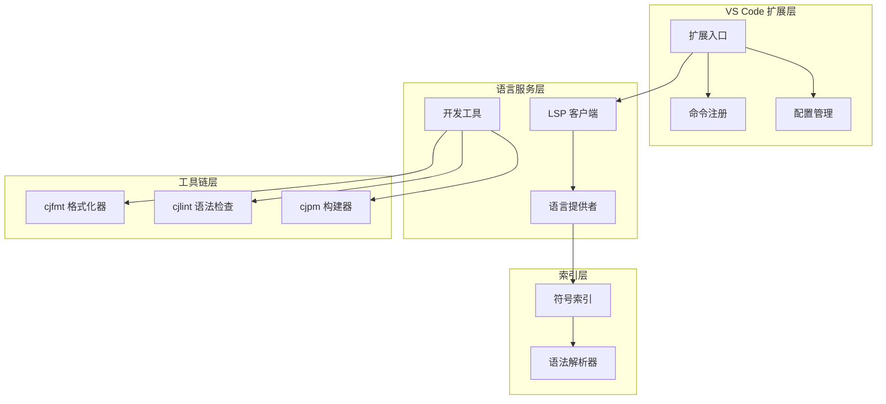
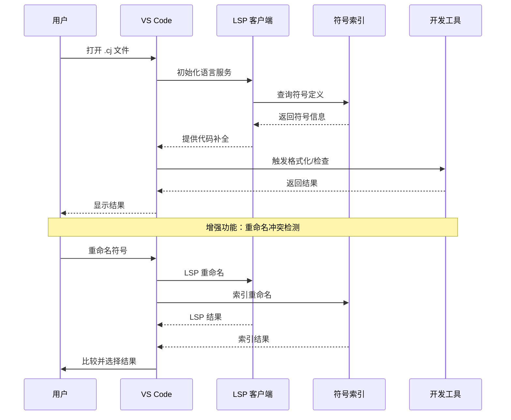
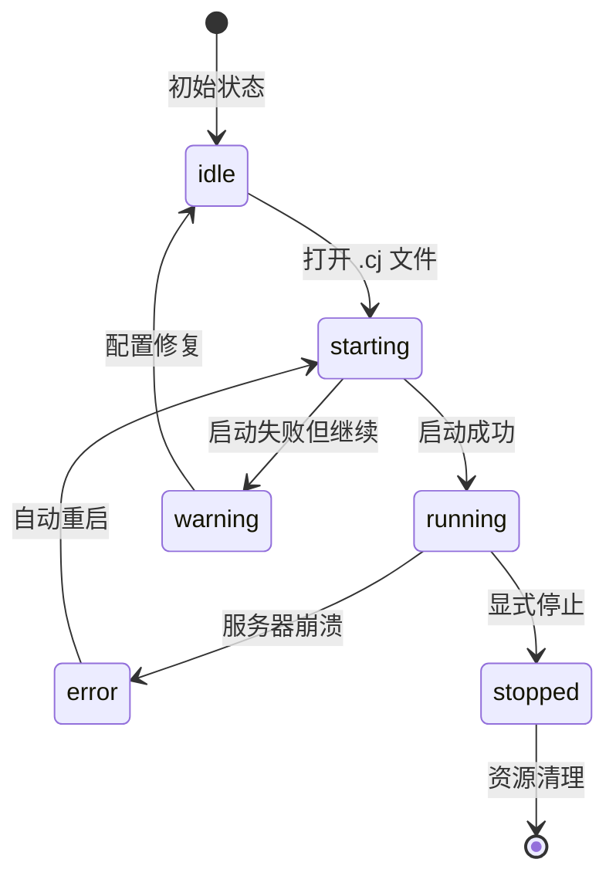
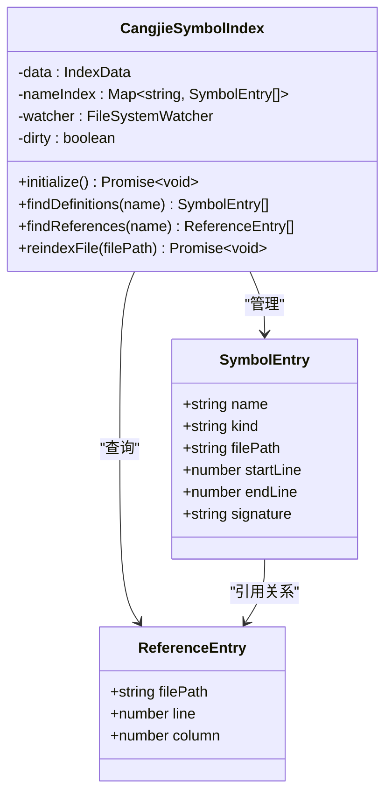
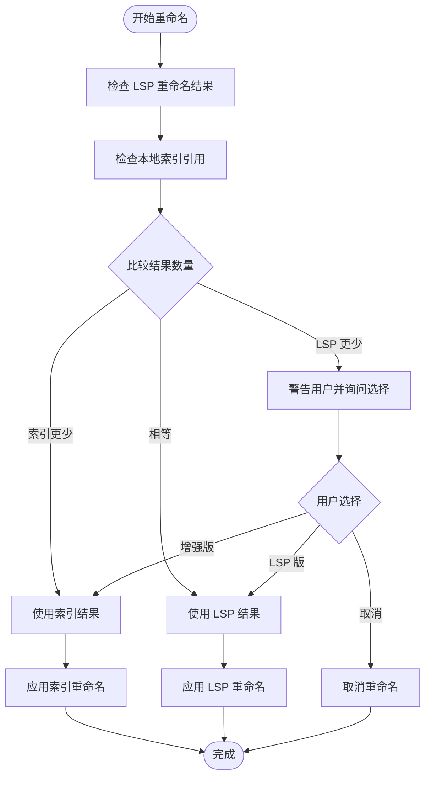
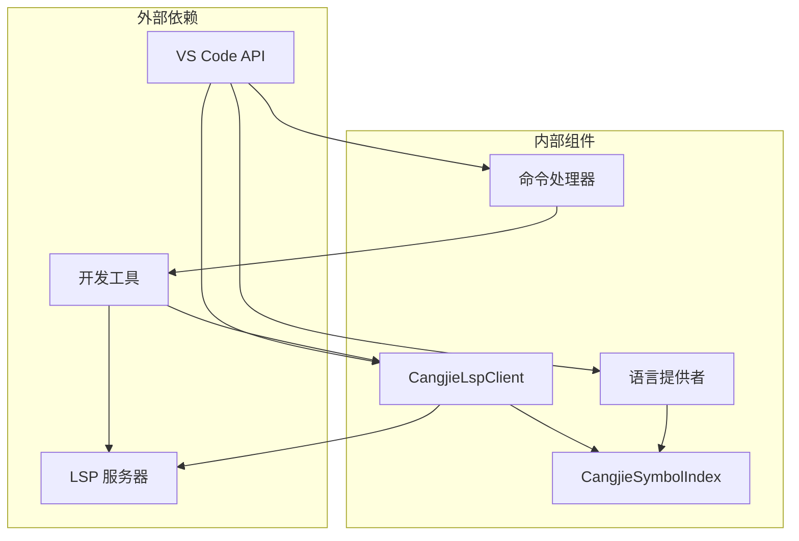

# Cangjie 语言支持

<cite>
**本文档引用的文件**
- [CangjieLspClient.ts](file://src/services/cangjie-lsp/CangjieLspClient.ts)
- [CangjieCodeActionProvider.ts](file://src/services/cangjie-lsp/CangjieCodeActionProvider.ts)
- [CangjieHoverProvider.ts](file://src/services/cangjie-lsp/CangjieHoverProvider.ts)
- [CangjieDefinitionProvider.ts](file://src/services/cangjie-lsp/CangjieDefinitionProvider.ts)
- [CangjieReferenceProvider.ts](file://src/services/cangjie-lsp/CangjieReferenceProvider.ts)
- [CangjieSymbolIndex.ts](file://src/services/cangjie-lsp/CangjieSymbolIndex.ts)
- [CangjieEnhancedRenameProvider.ts](file://src/services/cangjie-lsp/CangjieEnhancedRenameProvider.ts)
- [CangjieDocumentSymbolProvider.ts](file://src/services/cangjie-lsp/CangjieDocumentSymbolProvider.ts)
- [CangjieFoldingRangeProvider.ts](file://src/services/cangjie-lsp/CangjieFoldingRangeProvider.ts)
- [cangjieCommands.ts](file://src/services/cangjie-lsp/cangjieCommands.ts)
- [CangjieLintConfig.ts](file://src/services/cangjie-lsp/CangjieLintConfig.ts)
- [CjlintDiagnostics.ts](file://src/services/cangjie-lsp/CjlintDiagnostics.ts)
- [CjfmtFormatter.ts](file://src/services/cangjie-lsp/CjfmtFormatter.ts)
- [CangjieCompileGuard.ts](file://src/services/cangjie-lsp/CangjieCompileGuard.ts)
- [cangjie.json](file://src/snippets/cangjie.json)
</cite>

## 目录
1. [简介](#简介)
2. [项目结构](#项目结构)
3. [核心组件](#核心组件)
4. [架构概览](#架构概览)
5. [详细组件分析](#详细组件分析)
6. [依赖分析](#依赖分析)
7. [性能考虑](#性能考虑)
8. [故障排除指南](#故障排除指南)
9. [结论](#结论)
10. [附录](#附录)

## 简介

Cangjie 语言支持是基于 VS Code 的完整开发环境解决方案，专为 Cangjie 编程语言设计。该系统集成了语言服务器协议(LSP)、代码补全、语法诊断、符号索引、重命名支持等核心功能，同时提供了与 AI 模式的深度集成。

该系统的核心设计理念是通过本地符号索引和多种工具链的协同工作，为开发者提供接近实时的开发体验。系统不仅支持标准的 LSP 功能，还包含了增强的代码分析、自动格式化、编译保护等高级特性。

## 项目结构

Cangjie 语言支持系统采用模块化的架构设计，主要分为以下几个核心部分：

**图表来源**
- [CangjieLspClient.ts:1-660](file://src/services/cangjie-lsp/CangjieLspClient.ts#L1-L660)
- [CangjieSymbolIndex.ts:1-470](file://src/services/cangjie-lsp/CangjieSymbolIndex.ts#L1-L470)

**章节来源**
- [CangjieLspClient.ts:1-660](file://src/services/cangjie-lsp/CangjieLspClient.ts#L1-L660)
- [CangjieSymbolIndex.ts:1-470](file://src/services/cangjie-lsp/CangjieSymbolIndex.ts#L1-L470)

## 核心组件

### 语言服务器客户端 (LSP Client)

CangjieLspClient 是整个系统的核心组件，负责管理语言服务器的生命周期和配置。它实现了智能的延迟启动机制，只有在用户实际打开 .cj 文件时才启动语言服务器，从而避免不必要的资源消耗。

关键特性包括：
- **智能启动策略**：检测工作区中的 .cj 文件后才启动服务器
- **自动重启机制**：服务器意外退出时自动重启，最多尝试3次
- **配置监听**：实时响应 VS Code 设置变化
- **性能监控**：记录首次补全和悬停响应时间

### 符号索引系统

CangjieSymbolIndex 提供了强大的跨文件符号查找能力，通过本地缓存和增量更新机制实现高效的代码导航。

主要功能：
- **实时索引构建**：扫描工作区中的所有 .cj 文件
- **增量更新**：文件修改时自动重新索引
- **跨文件查询**：支持定义和引用的跨文件查找
- **依赖分析**：分析文件间的导入关系

### 开发工具集成

系统集成了多个开发工具，提供完整的开发体验：

- **cjfmt 格式化器**：自动代码格式化
- **cjlint 语法检查器**：静态代码分析
- **cjpm 构建器**：项目管理和构建
- **编译保护**：保存时自动编译和格式化

**章节来源**
- [CangjieLspClient.ts:277-660](file://src/services/cangjie-lsp/CangjieLspClient.ts#L277-L660)
- [CangjieSymbolIndex.ts:43-470](file://src/services/cangjie-lsp/CangjieSymbolIndex.ts#L43-L470)

## 架构概览

Cangjie 语言支持系统采用了分层架构设计，确保各组件之间的松耦合和高内聚：

**图表来源**
- [CangjieLspClient.ts:376-565](file://src/services/cangjie-lsp/CangjieLspClient.ts#L376-L565)
- [CangjieEnhancedRenameProvider.ts:31-78](file://src/services/cangjie-lsp/CangjieEnhancedRenameProvider.ts#L31-L78)

系统架构的关键特点：
- **事件驱动**：基于 VS Code 的事件系统实现响应式更新
- **异步处理**：大量使用 Promise 和异步操作提升性能
- **错误隔离**：每个组件都有独立的错误处理机制
- **资源管理**：完善的生命周期管理，防止内存泄漏

## 详细组件分析

### 语言服务器客户端详解

CangjieLspClient 实现了复杂的服务器生命周期管理：

**图表来源**
- [CangjieLspClient.ts:270-292](file://src/services/cangjie-lsp/CangjieLspClient.ts#L270-L292)

关键实现细节：
- **环境变量管理**：自动检测和设置 CANGJIE_HOME
- **路径解析**：支持多种安装位置和配置方式
- **中间件模式**：实现补全和悬停的防抖机制
- **诊断过滤**：智能过滤 LSP 的误报诊断

### 符号索引系统的数据结构

符号索引系统使用了高效的数据结构来存储和查询符号信息：

**图表来源**
- [CangjieSymbolIndex.ts:18-41](file://src/services/cangjie-lsp/CangjieSymbolIndex.ts#L18-L41)
- [CangjieSymbolIndex.ts:43-83](file://src/services/cangjie-lsp/CangjieSymbolIndex.ts#L43-L83)

### 增强重命名功能

CangjieEnhancedRenameProvider 提供了智能的重命名功能，能够检测 LSP 和本地索引之间的差异：

**图表来源**
- [CangjieEnhancedRenameProvider.ts:54-78](file://src/services/cangjie-lsp/CangjieEnhancedRenameProvider.ts#L54-L78)

**章节来源**
- [CangjieLspClient.ts:1-660](file://src/services/cangjie-lsp/CangjieLspClient.ts#L1-L660)
- [CangjieSymbolIndex.ts:1-470](file://src/services/cangjie-lsp/CangjieSymbolIndex.ts#L1-L470)
- [CangjieEnhancedRenameProvider.ts:1-126](file://src/services/cangjie-lsp/CangjieEnhancedRenameProvider.ts#L1-L126)

## 依赖分析

系统依赖关系图展示了各组件之间的交互：

**图表来源**
- [CangjieLspClient.ts:4-11](file://src/services/cangjie-lsp/CangjieLspClient.ts#L4-L11)
- [cangjieCommands.ts:1-141](file://src/services/cangjie-lsp/cangjieCommands.ts#L1-L141)

**章节来源**
- [CangjieLspClient.ts:4-11](file://src/services/cangjie-lsp/CangjieLspClient.ts#L4-L11)
- [cangjieCommands.ts:1-141](file://src/services/cangjie-lsp/cangjieCommands.ts#L1-L141)

## 性能考虑

### 缓存策略

系统采用了多层次的缓存机制来优化性能：

1. **符号索引缓存**：将解析后的符号信息持久化到磁盘
2. **文件读取缓存**：缓存文件内容以避免重复读取
3. **计算结果缓存**：缓存昂贵的操作结果
4. **网络请求缓存**：避免重复的外部服务调用

### 异步处理

所有可能阻塞 UI 的操作都采用了异步处理：

- **增量索引构建**：批量处理文件，避免长时间阻塞
- **防抖机制**：对频繁触发的事件进行防抖处理
- **超时控制**：为外部进程调用设置合理的超时时间
- **并发限制**：控制同时运行的任务数量

### 内存管理

系统实现了严格的内存管理策略：

- **定时清理**：定期清理过期的缓存数据
- **资源释放**：确保所有订阅都被正确取消
- **垃圾回收**：及时释放不再使用的对象引用
- **监控告警**：监控内存使用情况并发出警告

## 故障排除指南

### 常见问题及解决方案

#### 语言服务器无法启动

**症状**：VS Code 显示 "Cangjie LSP 启动失败"

**可能原因**：
1. CANGJIE_HOME 环境变量未设置
2. LSP 服务器二进制文件不存在
3. SDK 环境配置不正确

**解决步骤**：
1. 检查 CANGJIE_HOME 是否正确设置
2. 验证 LSPServer 可执行文件是否存在
3. 运行 SDK 的 envsetup 脚本
4. 查看输出面板中的详细错误信息

#### 符号索引不准确

**症状**：跳转到定义或查找引用结果不正确

**解决方法**：
1. 手动触发重新索引
2. 检查 .cj 文件的语法是否正确
3. 清理索引缓存文件
4. 重启 VS Code

#### 性能问题

**症状**：代码补全响应缓慢或内存占用过高

**优化建议**：
1. 检查工作区大小，考虑使用 .gitignore 排除不需要的文件
2. 减少同时打开的 .cj 文件数量
3. 更新到最新版本的扩展
4. 调整 VS Code 的内存限制

**章节来源**
- [CangjieLspClient.ts:567-594](file://src/services/cangjie-lsp/CangjieLspClient.ts#L567-L594)
- [CangjieSymbolIndex.ts:132-151](file://src/services/cangjie-lsp/CangjieSymbolIndex.ts#L132-L151)

## 结论

Cangjie 语言支持系统是一个功能完整、性能优异的开发环境解决方案。通过精心设计的架构和多种优化技术，系统为 Cangjie 开发者提供了接近实时的开发体验。

系统的主要优势包括：
- **智能化的启动机制**：按需启动，节省系统资源
- **强大的符号索引**：支持跨文件的代码导航
- **丰富的开发工具**：从格式化到构建的一站式解决方案
- **AI 集成**：与 AI 模式无缝协作
- **良好的性能**：通过缓存和异步处理保证响应速度

未来的发展方向包括进一步优化大型项目的性能、增强 AI 集成功能、以及提供更多定制化的开发工具。

## 附录

### 配置选项参考

系统支持多种配置选项来满足不同开发需求：

| 配置项 | 类型 | 默认值 | 描述 |
|--------|------|--------|------|
| cangjieLsp.enabled | boolean | true | 启用/禁用 LSP 服务 |
| cangjieLsp.serverPath | string | "" | LSP 服务器可执行文件路径 |
| cangjieLsp.enableLog | boolean | false | 启用 LSP 日志 |
| cangjieLsp.logPath | string | "" | LSP 日志文件路径 |
| cangjieLsp.disableAutoImport | boolean | false | 禁用自动导入功能 |

### 命令列表

系统提供了丰富的命令来支持各种开发任务：

- `njust-ai.cangjieBuild` - 构建项目
- `njust-ai.cangjieRun` - 运行程序
- `njust-ai.cangjieTest` - 运行测试
- `njust-ai.cangjieCheck` - 检查代码
- `njust-ai.cangjieClean` - 清理项目
- `njust-ai.cangjieRestartLsp` - 重启语言服务器
- `njust-ai.cangjieInsertTemplate` - 插入模板
- `njust-ai.cangjieProfile` - 性能分析
- `njust-ai.cangjieExtractFunction` - 提取函数
- `njust-ai.cangjieMoveFile` - 移动文件

### 最佳实践

1. **项目组织**：遵循标准的 Cangjie 项目结构
2. **代码风格**：使用 cjfmt 自动格式化代码
3. **错误处理**：利用编译保护功能及时发现错误
4. **性能优化**：合理使用符号索引和缓存机制
5. **AI 集成**：充分利用 AI 模式提供的智能功能