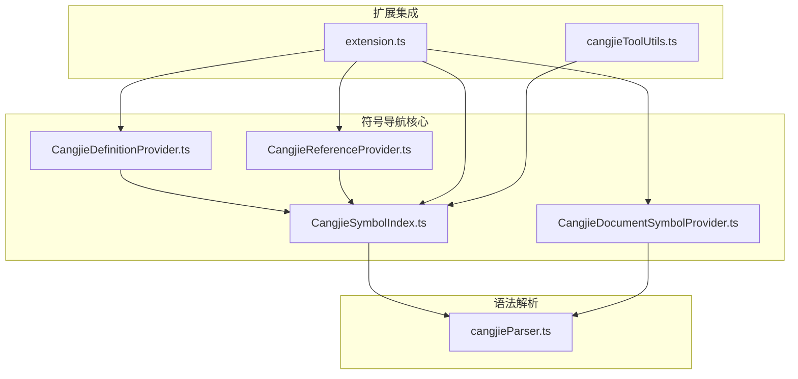
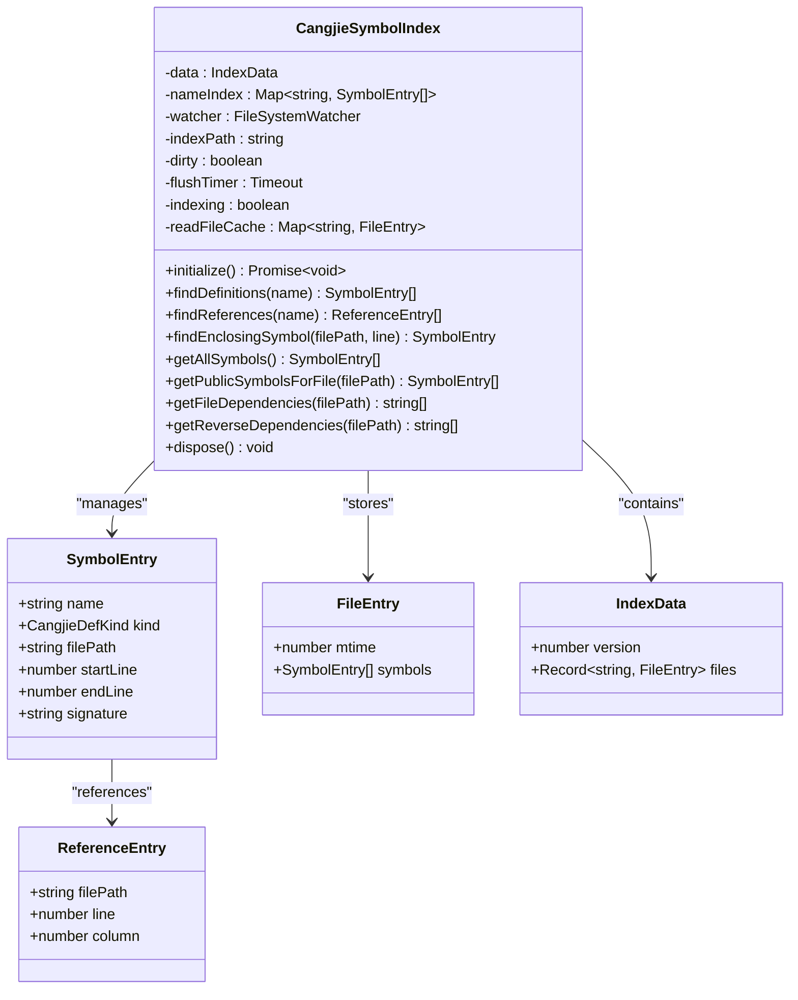
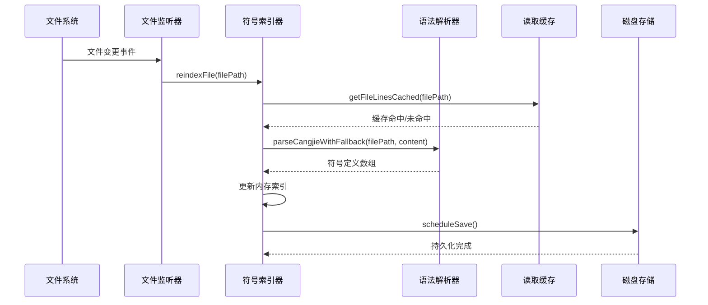
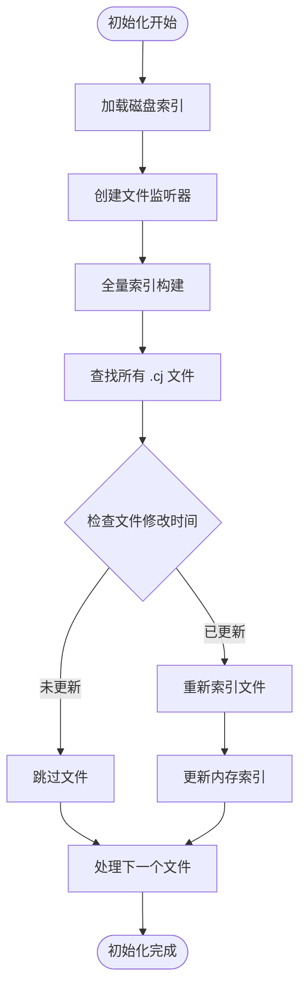
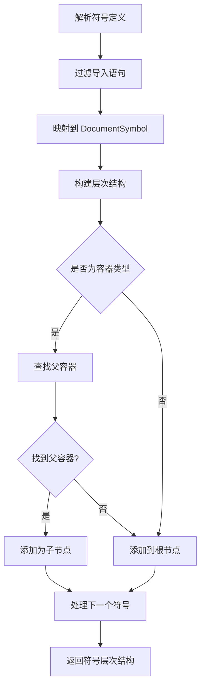
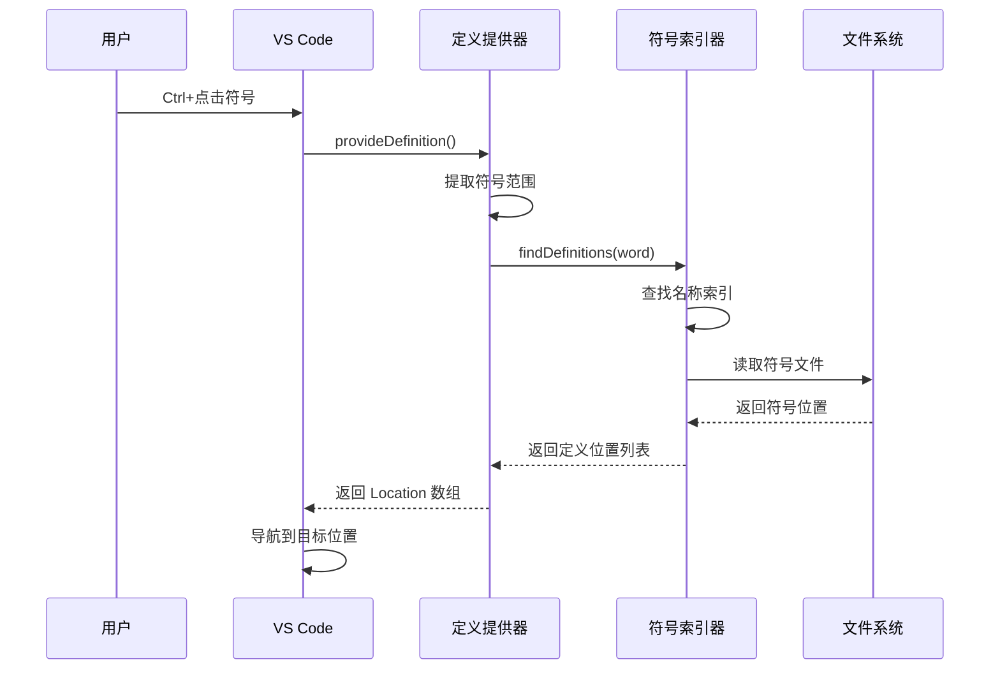
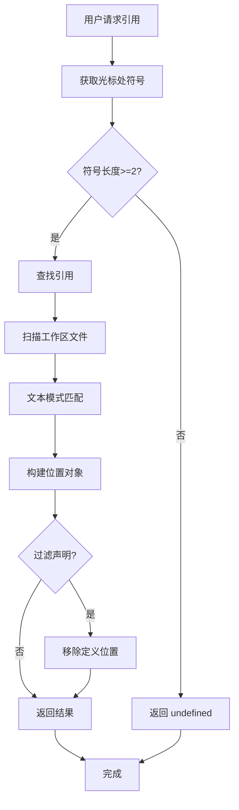
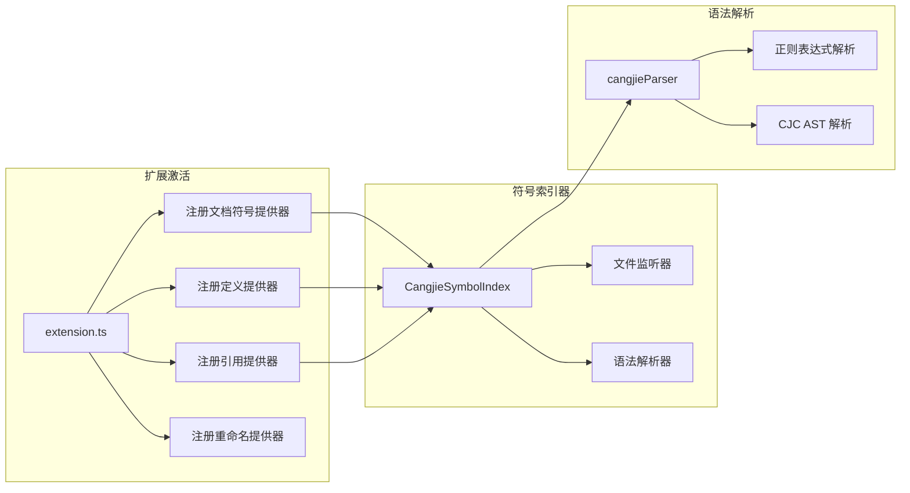

# 符号导航与索引

<cite>
**本文档引用的文件**
- [CangjieSymbolIndex.ts](file://src/services/cangjie-lsp/CangjieSymbolIndex.ts)
- [CangjieDocumentSymbolProvider.ts](file://src/services/cangjie-lsp/CangjieDocumentSymbolProvider.ts)
- [CangjieDefinitionProvider.ts](file://src/services/cangjie-lsp/CangjieDefinitionProvider.ts)
- [CangjieReferenceProvider.ts](file://src/services/cangjie-lsp/CangjieReferenceProvider.ts)
- [cangjieParser.ts](file://src/services/tree-sitter/cangjieParser.ts)
- [extension.ts](file://src/extension.ts)
- [cangjieToolUtils.ts](file://src/services/cangjie-lsp/cangjieToolUtils.ts)
</cite>

## 目录
1. [简介](#简介)
2. [项目结构](#项目结构)
3. [核心组件](#核心组件)
4. [架构概览](#架构概览)
5. [详细组件分析](#详细组件分析)
6. [依赖关系分析](#依赖关系分析)
7. [性能考虑](#性能考虑)
8. [故障排除指南](#故障排除指南)
9. [结论](#结论)

## 简介

Cangjie 符号导航与索引系统是 Njust-AI 编辑器中用于提供高效代码导航和符号管理的核心功能模块。该系统实现了完整的符号索引生命周期管理，包括符号提取、索引构建、查询优化和跨文件引用追踪。

系统主要包含三个核心组件：
- **符号索引器 (CangjieSymbolIndex)**：负责符号的提取、索引构建和持久化存储
- **文档符号提供器 (CangjieDocumentSymbolProvider)**：支持 VS Code 大纲视图和符号跳转功能
- **定义/引用提供器**：实现智能跳转和跨文件引用追踪

## 项目结构

Cangjie 符号导航功能分布在以下关键目录中：

**图表来源**
- [CangjieSymbolIndex.ts:1-470](file://src/services/cangjie-lsp/CangjieSymbolIndex.ts#L1-L470)
- [CangjieDocumentSymbolProvider.ts:1-89](file://src/services/cangjie-lsp/CangjieDocumentSymbolProvider.ts#L1-L89)
- [extension.ts:317-420](file://src/extension.ts#L317-L420)

**章节来源**
- [CangjieSymbolIndex.ts:1-470](file://src/services/cangjie-lsp/CangjieSymbolIndex.ts#L1-L470)
- [extension.ts:317-420](file://src/extension.ts#L317-L420)

## 核心组件

### 符号索引系统架构

Cangjie 符号索引系统采用分层架构设计，确保高性能和可扩展性：

**图表来源**
- [CangjieSymbolIndex.ts:18-41](file://src/services/cangjie-lsp/CangjieSymbolIndex.ts#L18-L41)
- [CangjieSymbolIndex.ts:43-56](file://src/services/cangjie-lsp/CangjieSymbolIndex.ts#L43-L56)

### 符号提取策略

系统采用双重符号提取策略以平衡准确性和性能：

1. **正则表达式解析器**：快速提取符号定义，无需外部依赖
2. **CJC AST 解析器**：通过 Cangjie SDK 获取精确的语法树信息

**章节来源**
- [cangjieParser.ts:68-87](file://src/services/tree-sitter/cangjieParser.ts#L68-L87)
- [cangjieParser.ts:145-195](file://src/services/tree-sitter/cangjieParser.ts#L145-L195)
- [cangjieParser.ts:530-537](file://src/services/tree-sitter/cangjieParser.ts#L530-L537)

## 架构概览

Cangjie 符号导航系统采用事件驱动的索引更新机制：

**图表来源**
- [CangjieSymbolIndex.ts:75-83](file://src/services/cangjie-lsp/CangjieSymbolIndex.ts#L75-L83)
- [CangjieSymbolIndex.ts:200-231](file://src/services/cangjie-lsp/CangjieSymbolIndex.ts#L200-L231)
- [CangjieSymbolIndex.ts:132-151](file://src/services/cangjie-lsp/CangjieSymbolIndex.ts#L132-L151)

## 详细组件分析

### 符号索引器 (CangjieSymbolIndex)

#### 初始化流程

符号索引器在扩展激活时初始化，执行完整的索引构建过程：

**图表来源**
- [CangjieSymbolIndex.ts:65-83](file://src/services/cangjie-lsp/CangjieSymbolIndex.ts#L65-L83)
- [CangjieSymbolIndex.ts:153-194](file://src/services/cangjie-lsp/CangjieSymbolIndex.ts#L153-L194)

#### 查询优化机制

系统实现了多种查询优化策略：

1. **名称索引 (Name Index)**：基于符号名称的快速查找
2. **读取缓存 (Read File Cache)**：基于文件修改时间戳的缓存机制
3. **批量处理 (Batch Processing)**：并发处理多个文件的索引更新

**章节来源**
- [CangjieSymbolIndex.ts:103-130](file://src/services/cangjie-lsp/CangjieSymbolIndex.ts#L103-L130)
- [CangjieSymbolIndex.ts:243-257](file://src/services/cangjie-lsp/CangjieSymbolIndex.ts#L243-L257)
- [CangjieSymbolIndex.ts:173-176](file://src/services/cangjie-lsp/CangjieSymbolIndex.ts#L173-L176)

### 文档符号提供器 (CangjieDocumentSymbolProvider)

#### 符号层次结构构建

文档符号提供器将解析出的符号转换为 VS Code 的 DocumentSymbol 结构：

**图表来源**
- [CangjieDocumentSymbolProvider.ts:43-74](file://src/services/cangjie-lsp/CangjieDocumentSymbolProvider.ts#L43-L74)

#### 符号种类映射

系统支持多种 Cangjie 符号类型的 VS Code 符号映射：

| Cangjie 类型 | VS Code 符号类型 | 描述 |
|-------------|------------------|------|
| class | Class | 类定义 |
| struct | Struct | 结构体定义 |
| interface | Interface | 接口定义 |
| enum | Enum | 枚举定义 |
| func/main/macro | Function | 函数/主程序/宏 |
| extend | Namespace | 扩展定义 |
| var/let | Variable | 变量定义 |
| type_alias | TypeParameter | 类型别名 |
| package | Package | 包声明 |
| import | Module | 导入语句 |
| prop | Property | 属性定义 |
| init | Constructor | 构造函数 |

**章节来源**
- [CangjieDocumentSymbolProvider.ts:4-21](file://src/services/cangjie-lsp/CangjieDocumentSymbolProvider.ts#L4-L21)

### 定义提供器 (CangjieDefinitionProvider)

#### 跨文件定义解析

定义提供器实现智能的跨文件符号定位：

**图表来源**
- [CangjieDefinitionProvider.ts:12-30](file://src/services/cangjie-lsp/CangjieDefinitionProvider.ts#L12-L30)

### 引用提供器 (CangjieReferenceProvider)

#### 文本级引用追踪

引用提供器通过文本扫描实现跨文件引用追踪：

**图表来源**
- [CangjieReferenceProvider.ts:12-39](file://src/services/cangjie-lsp/CangjieReferenceProvider.ts#L12-L39)

**章节来源**
- [CangjieReferenceProvider.ts:24-29](file://src/services/cangjie-lsp/CangjieReferenceProvider.ts#L24-L29)

## 依赖关系分析

### 扩展注册流程

Cangjie 符号导航功能通过 VS Code 语言服务 API 注册：

**图表来源**
- [extension.ts:317-420](file://src/extension.ts#L317-L420)
- [CangjieSymbolIndex.ts:65-83](file://src/services/cangjie-lsp/CangjieSymbolIndex.ts#L65-L83)

### 配置选项

系统支持多种配置选项来优化符号索引行为：

| 配置项 | 类型 | 默认值 | 描述 |
|--------|------|--------|------|
| cangjieTools.useCjcAstForIndex | boolean | false | 是否使用 CJC AST 进行索引 |
| cangjieLsp.cjcPath | string | "" | CJC 可执行文件路径 |
| cangjieTools.cjpmPath | string | "" | CJPM 工具路径 |

**章节来源**
- [CangjieSymbolIndex.ts:196-198](file://src/services/cangjie-lsp/CangjieSymbolIndex.ts#L196-L198)
- [cangjieParser.ts:357-380](file://src/services/tree-sitter/cangjieParser.ts#L357-L380)

## 性能考虑

### 缓存策略

系统实现了多层次的缓存机制以提升性能：

1. **文件修改时间戳缓存**：避免重复读取未修改文件
2. **符号名称索引缓存**：O(1) 时间复杂度的符号查找
3. **批量索引更新**：并发处理多个文件的索引更新

### 内存优化

- 使用 Map 数据结构进行符号索引存储
- 实现惰性加载机制，仅在需要时解析文件内容
- 定期清理不再使用的缓存条目

### I/O 优化

- 限制同时处理的文件数量（批量大小）
- 使用流式文件读取减少内存占用
- 实现指数退避的保存策略避免频繁磁盘写入

## 故障排除指南

### 常见问题及解决方案

#### 符号索引不完整

**症状**：某些符号无法在大纲视图中显示或无法跳转

**可能原因**：
1. 文件未被正确索引
2. 语法解析失败
3. 符号名称不符合规范

**解决步骤**：
1. 检查文件是否为 `.cj` 扩展名
2. 验证文件语法是否正确
3. 重启语言服务器
4. 清理符号索引缓存

#### 跨文件引用失效

**症状**：Ctrl+点击引用无法跳转到正确位置

**可能原因**：
1. 符号名称不匹配
2. 文件编码问题
3. 缓存数据过期

**解决步骤**：
1. 确认符号名称拼写正确
2. 检查文件编码格式
3. 手动触发索引重建
4. 检查文件权限

#### 性能问题

**症状**：符号导航响应缓慢

**优化建议**：
1. 启用 CJC AST 解析（如果可用）
2. 调整批量处理大小
3. 清理不必要的文件监听
4. 检查磁盘空间和 I/O 性能

**章节来源**
- [CangjieSymbolIndex.ts:132-151](file://src/services/cangjie-lsp/CangjieSymbolIndex.ts#L132-L151)
- [CangjieSymbolIndex.ts:459-468](file://src/services/cangjie-lsp/CangjieSymbolIndex.ts#L459-L468)

## 结论

Cangjie 符号导航与索引系统通过精心设计的架构和多种优化策略，为开发者提供了高效、可靠的代码导航体验。系统的主要优势包括：

1. **双解析策略**：结合正则表达式和 AST 解析，平衡性能和准确性
2. **事件驱动更新**：实时响应文件变更，保持索引最新
3. **多层缓存机制**：显著提升查询性能
4. **完整的跨文件支持**：支持符号跳转和引用追踪
5. **可配置性**：支持多种配置选项以适应不同使用场景

该系统为 Cangjie 语言提供了现代化的开发工具支持，是 Njust-AI 编辑器的重要组成部分。通过持续的性能优化和功能扩展，该系统将继续为 Cangjie 开发者提供卓越的编程体验。