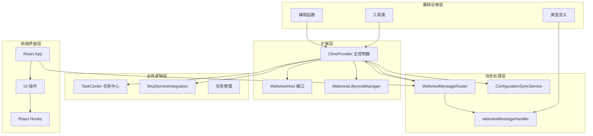
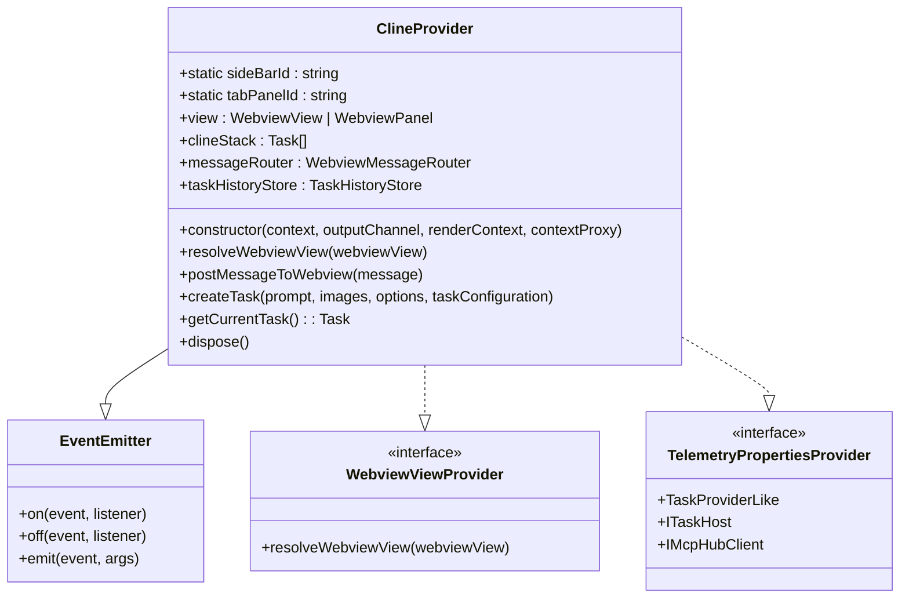
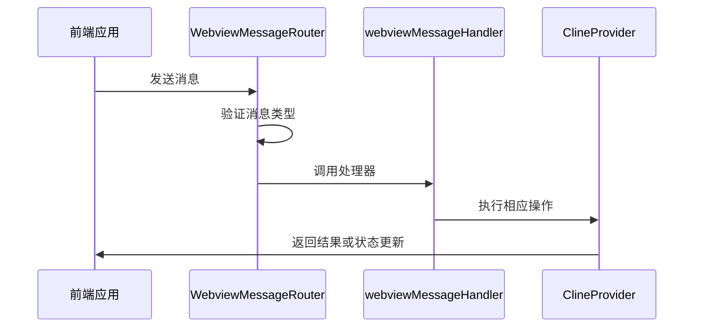
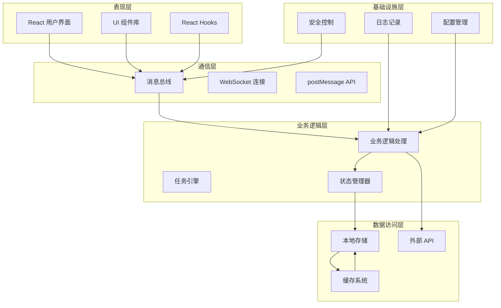
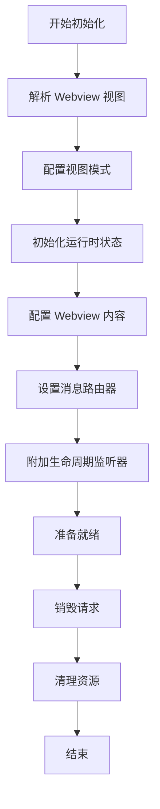
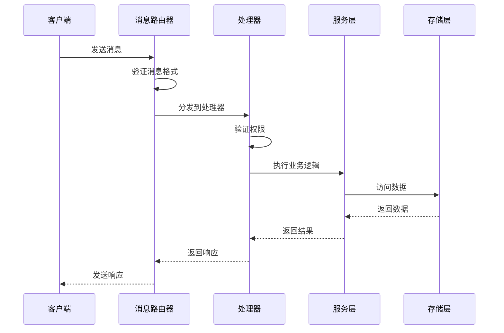
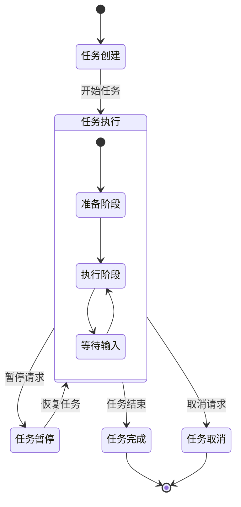
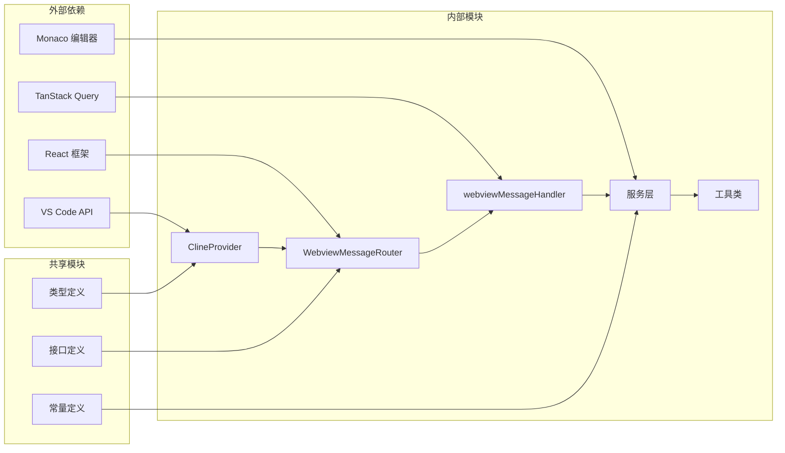

# Webview 集成系统

<cite>
**本文档引用的文件**
- [ClineProvider.ts](file://src/core/webview/ClineProvider.ts)
- [WebviewMessageRouter.ts](file://src/core/webview/WebviewMessageRouter.ts)
- [webviewMessageHandler.ts](file://src/core/webview/webviewMessageHandler.ts)
- [WebviewHost.ts](file://src/core/webview/WebviewHost.ts)
- [WebviewLifecycleManager.ts](file://src/core/webview/WebviewLifecycleManager.ts)
- [ConfigurationSyncService.ts](file://src/core/webview/ConfigurationSyncService.ts)
- [TaskCenter.ts](file://src/core/webview/TaskCenter.ts)
- [McpServiceIntegration.ts](file://src/core/webview/McpServiceIntegration.ts)
- [getNonce.ts](file://src/core/webview/getNonce.ts)
- [getUri.ts](file://src/core/webview/getUri.ts)
- [WebviewMessage.ts](file://src/shared/WebviewMessage.ts)
- [App.tsx](file://webview-ui/src/App.tsx)
- [vite.config.ts](file://webview-ui/vite.config.ts)
</cite>

## 目录
1. [简介](#简介)
2. [项目结构](#项目结构)
3. [核心组件](#核心组件)
4. [架构概览](#架构概览)
5. [详细组件分析](#详细组件分析)
6. [依赖关系分析](#依赖关系分析)
7. [性能考虑](#性能考虑)
8. [故障排除指南](#故障排除指南)
9. [结论](#结论)

## 简介

Webview 集成系统是 Njust-AI 扩展的核心组成部分，负责在 VS Code 中提供现代化的 AI 助手界面。该系统采用模块化设计，将复杂的 webview 生命周期管理、消息路由、状态同步等功能分解为独立的服务组件。

系统主要特点：
- **模块化架构**：将大型 ClineProvider 文件分解为多个专门的服务类
- **双向通信**：通过消息传递机制实现 VS Code 扩展与前端界面的双向通信
- **状态管理**：完整的任务栈管理和配置同步机制
- **MCP 集成**：支持模型推理服务的集成和管理
- **响应式设计**：支持侧边栏和编辑器标签页两种显示模式

## 项目结构

Webview 集成系统采用分层架构设计，主要包含以下层次：

**图表来源**
- [ClineProvider.ts:133-250](file://src/core/webview/ClineProvider.ts#L133-L250)
- [WebviewMessageRouter.ts:46-74](file://src/core/webview/WebviewMessageRouter.ts#L46-L74)
- [App.tsx:49-271](file://webview-ui/src/App.tsx#L49-L271)

**章节来源**
- [ClineProvider.ts:1-800](file://src/core/webview/ClineProvider.ts#L1-L800)
- [vite.config.ts:55-199](file://webview-ui/vite.config.ts#L55-L199)

## 核心组件

### ClineProvider - 主控制器

ClineProvider 是整个 Webview 集成系统的核心控制器，继承自 EventEmitter 并实现了多个接口：

**图表来源**
- [ClineProvider.ts:133-141](file://src/core/webview/ClineProvider.ts#L133-L141)
- [ClineProvider.ts:185-249](file://src/core/webview/ClineProvider.ts#L185-L249)

### WebviewMessageRouter - 消息路由器

WebviewMessageRouter 负责处理来自前端的消息并将其路由到相应的处理器：

**图表来源**
- [WebviewMessageRouter.ts:55-61](file://src/core/webview/WebviewMessageRouter.ts#L55-L61)
- [webviewMessageHandler.ts:81-522](file://src/core/webview/webviewMessageHandler.ts#L81-L522)

**章节来源**
- [ClineProvider.ts:133-250](file://src/core/webview/ClineProvider.ts#L133-L250)
- [WebviewMessageRouter.ts:1-74](file://src/core/webview/WebviewMessageRouter.ts#L1-L74)
- [webviewMessageHandler.ts:1-800](file://src/core/webview/webviewMessageHandler.ts#L1-L800)

## 架构概览

Webview 集成系统采用分层架构，每层都有明确的职责分工：

**图表来源**
- [App.tsx:101-151](file://webview-ui/src/App.tsx#L101-L151)
- [ClineProvider.ts:756-773](file://src/core/webview/ClineProvider.ts#L756-L773)

## 详细组件分析

### Webview 生命周期管理

Webview 生命周期管理是系统的基础功能，确保 webview 的正确创建、配置和销毁：

**图表来源**
- [WebviewLifecycleManager.ts:54-105](file://src/core/webview/WebviewLifecycleManager.ts#L54-L105)
- [ClineProvider.ts:756-773](file://src/core/webview/ClineProvider.ts#L756-L773)

### 消息处理机制

系统采用事件驱动的消息处理机制，支持多种消息类型和处理流程：

**图表来源**
- [WebviewMessageRouter.ts:55-61](file://src/core/webview/WebviewMessageRouter.ts#L55-L61)
- [webviewMessageHandler.ts:81-522](file://src/core/webview/webviewMessageHandler.ts#L81-L522)

### 任务管理系统

任务管理系统负责管理用户的任务栈和状态转换：

**图表来源**
- [TaskCenter.ts:72-82](file://src/core/webview/TaskCenter.ts#L72-L82)
- [TaskCenter.ts:84-137](file://src/core/webview/TaskCenter.ts#L84-L137)

**章节来源**
- [WebviewLifecycleManager.ts:1-156](file://src/core/webview/WebviewLifecycleManager.ts#L1-L156)
- [webviewMessageHandler.ts:522-800](file://src/core/webview/webviewMessageHandler.ts#L522-L800)
- [TaskCenter.ts:1-146](file://src/core/webview/TaskCenter.ts#L1-L146)

## 依赖关系分析

系统采用清晰的依赖关系设计，避免循环依赖并保持模块间的松耦合：

**图表来源**
- [ClineProvider.ts:10-111](file://src/core/webview/ClineProvider.ts#L10-L111)
- [WebviewMessageRouter.ts:11-13](file://src/core/webview/WebviewMessageRouter.ts#L11-L13)

### 关键依赖关系

系统的关键依赖关系包括：

1. **VS Code 扩展 API**：提供 webview 创建、消息传递、文件系统访问等功能
2. **React 生态系统**：提供用户界面构建和状态管理
3. **TanStack Query**：提供数据获取和缓存管理
4. **Monaco 编辑器**：提供代码编辑和语法高亮功能

**章节来源**
- [ClineProvider.ts:1-51](file://src/core/webview/ClineProvider.ts#L1-L51)
- [vite.config.ts:84-94](file://webview-ui/vite.config.ts#L84-L94)

## 性能考虑

Webview 集成系统在设计时充分考虑了性能优化：

### 内存管理
- 使用弱引用管理任务事件监听器
- 实现资源清理机制防止内存泄漏
- 采用惰性加载策略减少初始启动时间

### 网络优化
- 实现请求缓存机制
- 支持增量更新减少数据传输
- 优化 WebSocket 连接管理

### 渲染性能
- 使用 React.memo 优化组件渲染
- 实现虚拟滚动处理大量数据
- 采用防抖和节流技术处理高频操作

## 故障排除指南

### 常见问题及解决方案

#### Webview 无法加载
1. **检查 CSP 设置**：确保 Content-Security-Policy 正确配置
2. **验证资源路径**：确认静态资源路径正确且可访问
3. **检查权限**：验证扩展权限配置

#### 消息通信失败
1. **验证消息格式**：确保消息符合 WebviewMessage 接口定义
2. **检查路由配置**：确认消息路由器正确初始化
3. **查看日志**：使用输出通道查看错误信息

#### 性能问题
1. **监控内存使用**：定期检查内存泄漏
2. **优化渲染**：使用 React DevTools 分析渲染性能
3. **检查网络请求**：分析 API 调用频率和响应时间

**章节来源**
- [ClineProvider.ts:595-646](file://src/core/webview/ClineProvider.ts#L595-L646)
- [WebviewMessageRouter.ts:63-73](file://src/core/webview/WebviewMessageRouter.ts#L63-L73)

## 结论

Webview 集成系统展现了现代 VS Code 扩展开发的最佳实践，通过模块化设计、清晰的架构分离和完善的错误处理机制，为用户提供了一个稳定、高效的 AI 助手界面。

系统的主要优势包括：
- **可维护性**：模块化设计使得代码易于理解和维护
- **可扩展性**：接口化的架构支持功能扩展和定制
- **可靠性**：完善的错误处理和资源管理机制
- **性能**：优化的渲染和网络处理策略

未来改进方向：
- 进一步优化内存使用和渲染性能
- 增强错误恢复和重试机制
- 扩展更多 AI 服务集成选项
- 改进用户体验和交互设计