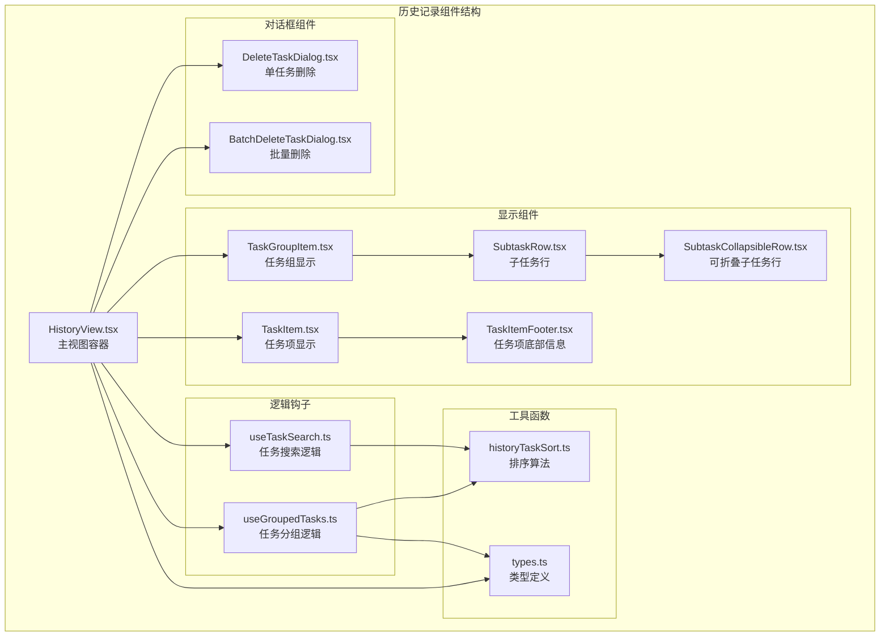
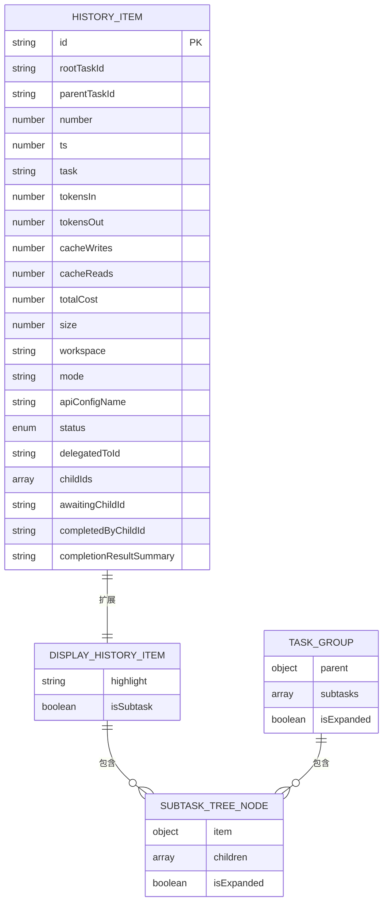
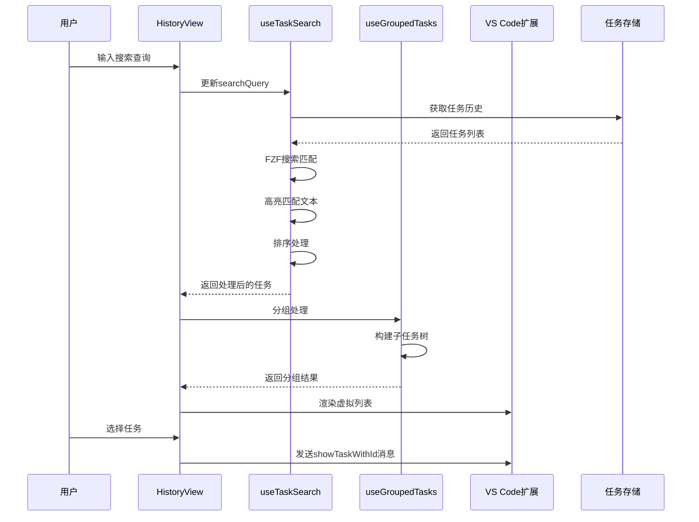
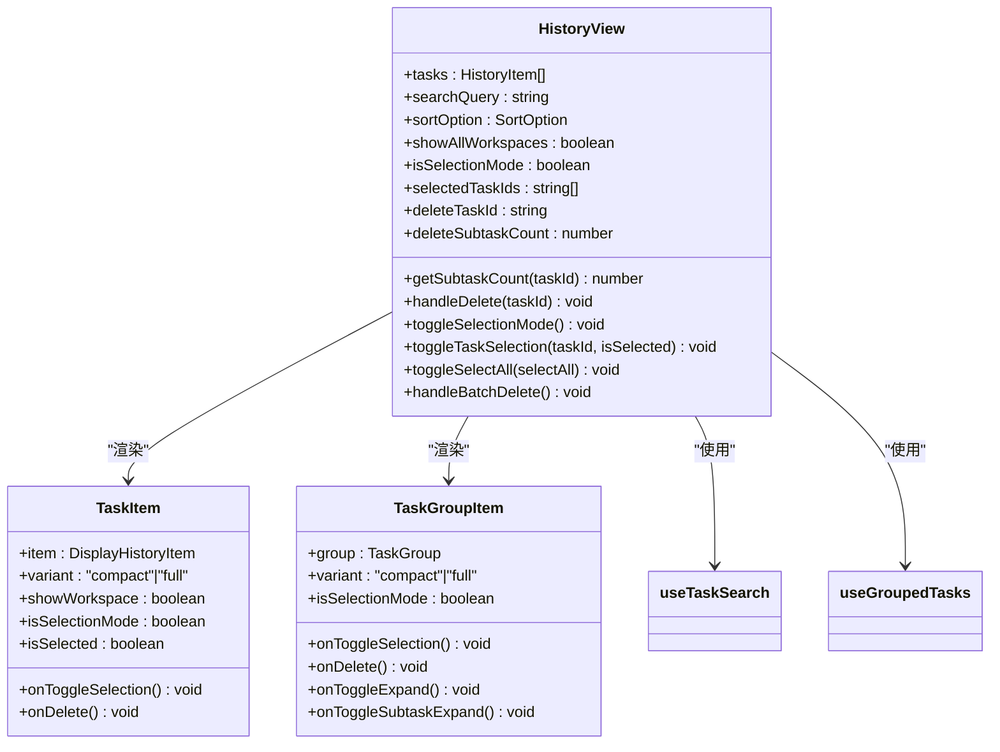
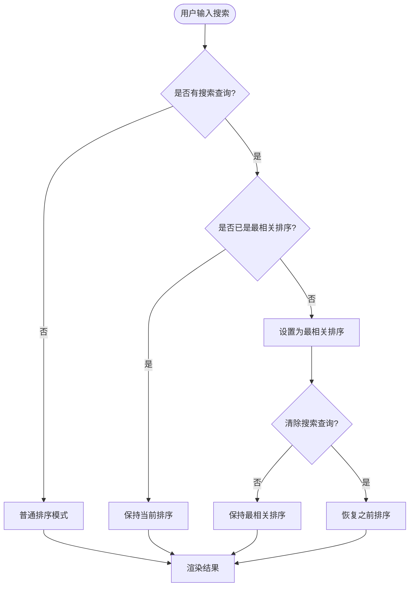
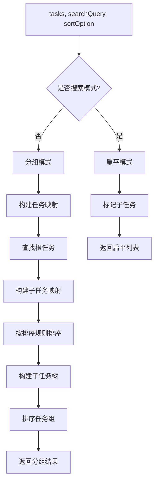
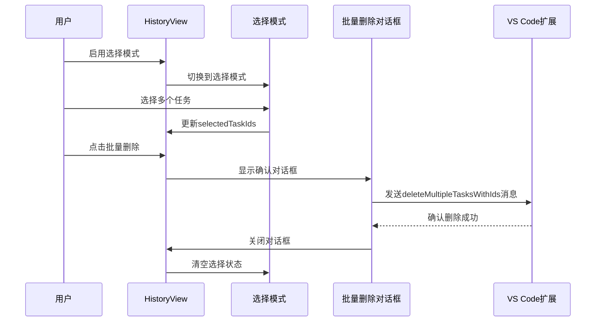
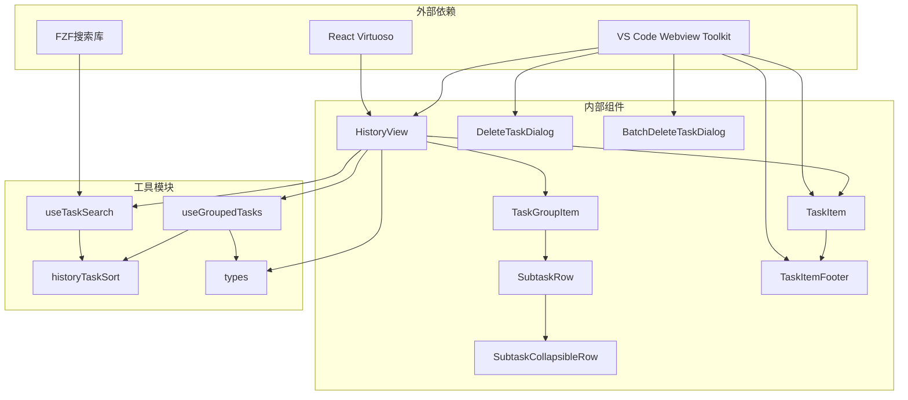

# 历史记录组件

<cite>
**本文档引用的文件**
- [HistoryView.tsx](file://webview-ui/src/components/history/HistoryView.tsx)
- [TaskItem.tsx](file://webview-ui/src/components/history/TaskItem.tsx)
- [TaskGroupItem.tsx](file://webview-ui/src/components/history/TaskGroupItem.tsx)
- [SubtaskRow.tsx](file://webview-ui/src/components/history/SubtaskRow.tsx)
- [SubtaskCollapsibleRow.tsx](file://webview-ui/src/components/history/SubtaskCollapsibleRow.tsx)
- [useTaskSearch.ts](file://webview-ui/src/components/history/useTaskSearch.ts)
- [useGroupedTasks.ts](file://webview-ui/src/components/history/useGroupedTasks.ts)
- [types.ts](file://webview-ui/src/components/history/types.ts)
- [historyTaskSort.ts](file://webview-ui/src/components/history/historyTaskSort.ts)
- [TaskItemFooter.tsx](file://webview-ui/src/components/history/TaskItemFooter.tsx)
- [DeleteTaskDialog.tsx](file://webview-ui/src/components/history/DeleteTaskDialog.tsx)
- [BatchDeleteTaskDialog.tsx](file://webview-ui/src/components/history/BatchDeleteTaskDialog.tsx)
- [history.ts](file://packages/types/src/history.ts)
</cite>

## 目录
1. [简介](#简介)
2. [项目结构](#项目结构)
3. [核心组件](#核心组件)
4. [架构概览](#架构概览)
5. [详细组件分析](#详细组件分析)
6. [依赖关系分析](#依赖关系分析)
7. [性能考虑](#性能考虑)
8. [故障排除指南](#故障排除指南)
9. [结论](#结论)

## 简介

历史记录组件是Njust-AI项目中用于展示和管理任务历史的核心UI组件。该组件提供了完整的任务历史浏览、搜索、分组、选择和删除功能，支持复杂的父子任务关系展示和虚拟滚动优化。

该组件主要服务于开发者在VS Code环境中查看和管理AI代理生成的任务历史，包括主任务和子任务的层次化展示、多种排序方式、智能搜索功能以及批量操作能力。

## 项目结构

历史记录组件位于webview-ui项目的components/history目录下，采用模块化设计，每个组件职责明确：

**图表来源**
- [HistoryView.tsx:1-363](file://webview-ui/src/components/history/HistoryView.tsx#L1-L363)
- [TaskItem.tsx:1-126](file://webview-ui/src/components/history/TaskItem.tsx#L1-L126)
- [TaskGroupItem.tsx:1-94](file://webview-ui/src/components/history/TaskGroupItem.tsx#L1-L94)

**章节来源**
- [HistoryView.tsx:1-363](file://webview-ui/src/components/history/HistoryView.tsx#L1-L363)
- [TaskItem.tsx:1-126](file://webview-ui/src/components/history/TaskItem.tsx#L1-L126)
- [TaskGroupItem.tsx:1-94](file://webview-ui/src/components/history/TaskGroupItem.tsx#L1-L94)

## 核心组件

### 主要组件概述

历史记录系统由以下核心组件构成：

1. **HistoryView** - 主视图容器，负责整体布局和状态管理
2. **TaskItem** - 单个任务项的显示组件
3. **TaskGroupItem** - 包含父任务和子任务树的任务组组件
4. **SubtaskRow** - 子任务行组件，支持递归嵌套
5. **SubtaskCollapsibleRow** - 可折叠的子任务计数行
6. **搜索和分组钩子** - 处理搜索、分组和排序逻辑

### 数据模型

组件使用标准化的历史记录数据模型：

**图表来源**
- [history.ts:1-32](file://packages/types/src/history.ts#L1-L32)
- [types.ts:1-61](file://webview-ui/src/components/history/types.ts#L1-L61)

**章节来源**
- [history.ts:1-32](file://packages/types/src/history.ts#L1-L32)
- [types.ts:1-61](file://webview-ui/src/components/history/types.ts#L1-L61)

## 架构概览

历史记录组件采用React Hooks模式，实现了清晰的职责分离和高效的渲染机制：

**图表来源**
- [HistoryView.tsx:34-48](file://webview-ui/src/components/history/HistoryView.tsx#L34-L48)
- [useTaskSearch.ts:11-79](file://webview-ui/src/components/history/useTaskSearch.ts#L11-L79)
- [useGroupedTasks.ts:41-135](file://webview-ui/src/components/history/useGroupedTasks.ts#L41-L135)

## 详细组件分析

### HistoryView 组件分析

HistoryView是历史记录系统的主容器组件，负责协调所有子组件的工作：

**图表来源**
- [HistoryView.tsx:28-363](file://webview-ui/src/components/history/HistoryView.tsx#L28-L363)
- [TaskItem.tsx:12-126](file://webview-ui/src/components/history/TaskItem.tsx#L12-L126)
- [TaskGroupItem.tsx:9-94](file://webview-ui/src/components/history/TaskGroupItem.tsx#L9-L94)

#### 搜索和过滤功能

HistoryView实现了智能搜索功能，当用户输入搜索查询时会自动切换到最相关排序模式：

**图表来源**
- [HistoryView.tsx:141-148](file://webview-ui/src/components/history/HistoryView.tsx#L141-L148)
- [useTaskSearch.ts:18-26](file://webview-ui/src/components/history/useTaskSearch.ts#L18-L26)

**章节来源**
- [HistoryView.tsx:104-363](file://webview-ui/src/components/history/HistoryView.tsx#L104-L363)
- [useTaskSearch.ts:11-79](file://webview-ui/src/components/history/useTaskSearch.ts#L11-L79)

### 任务分组逻辑

useGroupedTasks钩子实现了复杂的数据分组和树形结构构建：

**图表来源**
- [useGroupedTasks.ts:41-135](file://webview-ui/src/components/history/useGroupedTasks.ts#L41-L135)

#### 子任务树构建算法

子任务树的构建采用了递归算法，支持任意深度的嵌套：

**章节来源**
- [useGroupedTasks.ts:15-30](file://webview-ui/src/components/history/useGroupedTasks.ts#L15-L30)
- [useGroupedTasks.ts:60-102](file://webview-ui/src/components/history/useGroupedTasks.ts#L60-L102)

### 批量操作处理

历史记录组件提供了完整的批量操作功能：

**图表来源**
- [HistoryView.tsx:97-102](file://webview-ui/src/components/history/HistoryView.tsx#L97-L102)
- [BatchDeleteTaskDialog.tsx:21-59](file://webview-ui/src/components/history/BatchDeleteTaskDialog.tsx#L21-L59)

**章节来源**
- [HistoryView.tsx:50-102](file://webview-ui/src/components/history/HistoryView.tsx#L50-L102)
- [BatchDeleteTaskDialog.tsx:1-59](file://webview-ui/src/components/history/BatchDeleteTaskDialog.tsx#L1-L59)

### 状态管理机制

组件使用React状态管理来跟踪各种交互状态：

| 状态属性 | 类型 | 描述 | 默认值 |
|---------|------|------|--------|
| isSelectionMode | boolean | 是否处于选择模式 | false |
| selectedTaskIds | string[] | 已选择的任务ID数组 | [] |
| deleteTaskId | string \| null | 待删除的任务ID | null |
| deleteSubtaskCount | number | 删除任务关联的子任务数量 | 0 |
| expandedIds | Set<string> | 展开的分组ID集合 | new Set() |
| searchQuery | string | 搜索查询字符串 | "" |
| sortOption | SortOption | 排序选项 | "newest" |
| showAllWorkspaces | boolean | 是否显示所有工作区 | false |

**章节来源**
- [HistoryView.tsx:50-54](file://webview-ui/src/components/history/HistoryView.tsx#L50-L54)
- [useGroupedTasks.ts:46](file://webview-ui/src/components/history/useGroupedTasks.ts#L46)
- [useTaskSearch.ts:12-16](file://webview-ui/src/components/history/useTaskSearch.ts#L12-L16)

## 依赖关系分析

历史记录组件的依赖关系清晰且模块化：

**图表来源**
- [HistoryView.tsx:1-27](file://webview-ui/src/components/history/HistoryView.tsx#L1-L27)
- [TaskItem.tsx:1-11](file://webview-ui/src/components/history/TaskItem.tsx#L1-L11)
- [useTaskSearch.ts:1-8](file://webview-ui/src/components/history/useTaskSearch.ts#L1-L8)

**章节来源**
- [HistoryView.tsx:1-363](file://webview-ui/src/components/history/HistoryView.tsx#L1-L363)
- [useTaskSearch.ts:1-80](file://webview-ui/src/components/history/useTaskSearch.ts#L1-L80)

## 性能考虑

### 虚拟滚动优化

历史记录组件使用React Virtuoso实现高性能的虚拟滚动：

1. **内存效率**：只渲染可见区域内的项目，大幅减少DOM节点数量
2. **滚动性能**：通过虚拟化技术确保大量历史记录的流畅滚动
3. **初始渲染**：设置`initialTopMostItemIndex={0}`确保从顶部开始显示

### 计算优化

1. **Memo化优化**：使用`useMemo`避免不必要的重新计算
2. **搜索缓存**：FZF实例在依赖不变时保持缓存
3. **展开状态缓存**：使用`Set`高效管理展开状态

### 渲染优化

1. **条件渲染**：根据搜索模式选择不同的渲染路径
2. **懒加载**：子任务树仅在需要时展开
3. **事件委托**：减少事件处理器的数量

## 故障排除指南

### 常见问题及解决方案

1. **搜索无结果**
   - 检查`taskHistory`数据是否正确加载
   - 确认`cwd`（当前工作目录）设置正确
   - 验证搜索查询格式

2. **分组显示异常**
   - 检查`parentTaskId`字段完整性
   - 确认任务ID唯一性
   - 验证排序选项有效性

3. **虚拟滚动卡顿**
   - 检查项目高度一致性
   - 确认`itemContent`函数正确实现
   - 验证数据稳定性

4. **删除操作失败**
   - 检查VS Code消息通道连接
   - 确认任务ID有效性
   - 验证权限设置

**章节来源**
- [DeleteTaskDialog.tsx:32-37](file://webview-ui/src/components/history/DeleteTaskDialog.tsx#L32-L37)
- [BatchDeleteTaskDialog.tsx:25-30](file://webview-ui/src/components/history/BatchDeleteTaskDialog.tsx#L25-L30)

## 结论

历史记录组件是一个设计精良、功能完整的任务历史管理系统。其主要特点包括：

1. **模块化架构**：清晰的组件分离和职责划分
2. **高性能实现**：虚拟滚动和多种优化技术
3. **丰富的功能**：搜索、分组、排序、批量操作等
4. **良好的用户体验**：直观的界面设计和响应式交互
5. **可扩展性**：基于TypeScript的良好类型系统

该组件为开发者提供了强大的任务历史管理能力，支持复杂的父子任务关系展示和高效的批量操作，是Njust-AI项目中不可或缺的重要组成部分。