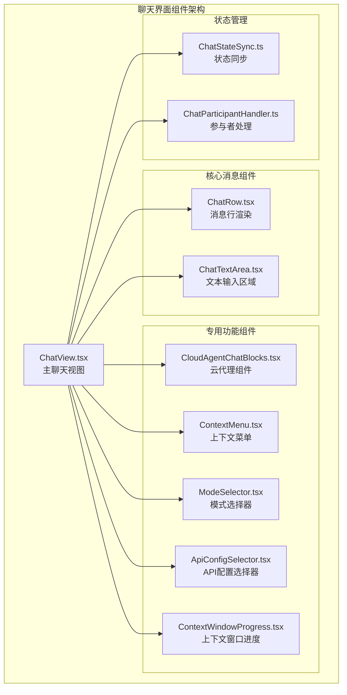
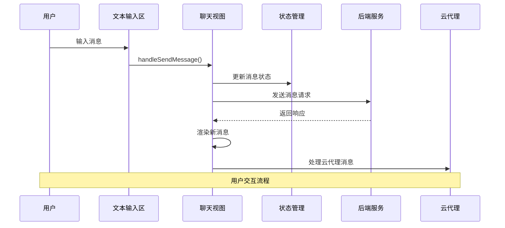
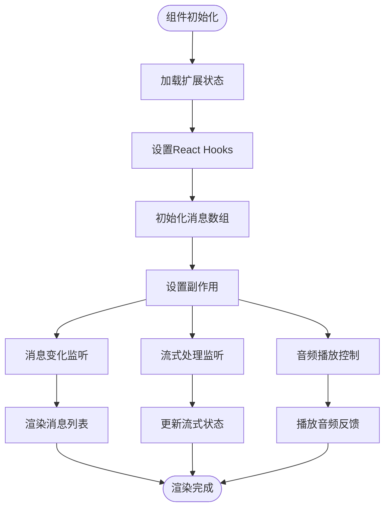
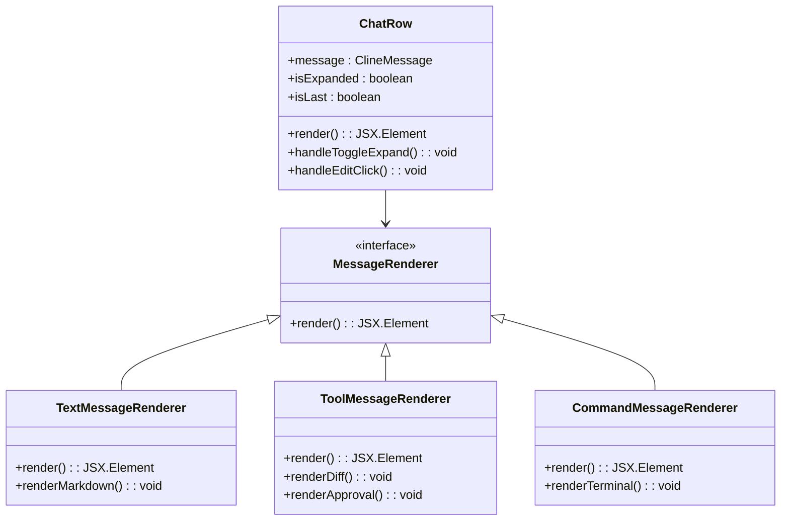
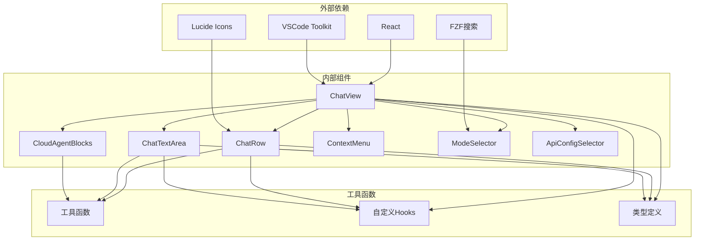

# 聊天界面组件

<cite>
**本文档引用的文件**
- [ChatView.tsx](file://webview-ui/src/components/chat/ChatView.tsx)
- [ChatRow.tsx](file://webview-ui/src/components/chat/ChatRow.tsx)
- [ChatTextArea.tsx](file://webview-ui/src/components/chat/ChatTextArea.tsx)
- [CloudAgentChatBlocks.tsx](file://webview-ui/src/components/chat/cloud-agent/CloudAgentChatBlocks.tsx)
- [ContextWindowProgress.tsx](file://webview-ui/src/components/chat/ContextWindowProgress.tsx)
- [ContextMenu.tsx](file://webview-ui/src/components/chat/ContextMenu.tsx)
- [ModeSelector.tsx](file://webview-ui/src/components/chat/ModeSelector.tsx)
- [ApiConfigSelector.tsx](file://webview-ui/src/components/chat/ApiConfigSelector.tsx)
- [ChatParticipantHandler.ts](file://src/chat/ChatParticipantHandler.ts)
- [ChatStateSync.ts](file://src/chat/ChatStateSync.ts)
</cite>

## 目录
1. [简介](#简介)
2. [项目结构](#项目结构)
3. [核心组件](#核心组件)
4. [架构概览](#架构概览)
5. [详细组件分析](#详细组件分析)
6. [依赖关系分析](#依赖关系分析)
7. [性能考虑](#性能考虑)
8. [故障排除指南](#故障排除指南)
9. [结论](#结论)

## 简介

聊天界面组件是Njust-AI项目中用于构建智能聊天体验的核心模块。该组件系统提供了完整的聊天功能，包括消息显示、用户输入、工具调用、文件操作、云代理集成等高级功能。本文档深入分析了聊天视图、聊天行、文本区域等核心组件的设计和实现，详细说明了状态管理、事件处理机制、消息渲染逻辑和用户交互行为。

## 项目结构

聊天界面组件主要位于webview-ui/src/components/chat目录下，采用模块化设计，每个组件都有明确的职责分工：



**图表来源**
- [ChatView.tsx:1-100](file://webview-ui/src/components/chat/ChatView.tsx#L1-L100)
- [ChatRow.tsx:1-100](file://webview-ui/src/components/chat/ChatRow.tsx#L1-L100)
- [ChatTextArea.tsx:1-100](file://webview-ui/src/components/chat/ChatTextArea.tsx#L1-L100)

**章节来源**
- [ChatView.tsx:1-200](file://webview-ui/src/components/chat/ChatView.tsx#L1-L200)
- [ChatRow.tsx:1-200](file://webview-ui/src/components/chat/ChatRow.tsx#L1-L200)
- [ChatTextArea.tsx:1-200](file://webview-ui/src/components/chat/ChatTextArea.tsx#L1-L200)

## 核心组件

### ChatView - 主聊天视图组件

ChatView是整个聊天界面的核心容器组件，负责管理聊天状态、处理用户交互、协调各个子组件的工作。

**主要功能特性：**
- 消息流管理和实时更新
- 用户输入处理和验证
- 工具调用和命令执行
- 文件操作权限管理
- 音频反馈和通知
- 自动审批机制

**状态管理机制：**
- 使用React Hooks进行状态管理
- LRU缓存优化消息可见性
- 深度比较优化渲染性能
- 响应式布局适配不同屏幕尺寸

**章节来源**
- [ChatView.tsx:595-679](file://webview-ui/src/components/chat/ChatView.tsx#L595-L679)
- [ChatView.tsx:100-200](file://webview-ui/src/components/chat/ChatView.tsx#L100-L200)

### ChatRow - 消息行渲染组件

ChatRow专门负责单个消息的渲染和显示，支持多种消息类型和复杂的UI交互。

**支持的消息类型：**
- 文本消息（普通对话）
- 工具调用请求（文件编辑、搜索等）
- 命令执行结果
- 错误和警告信息
- 完成状态报告

**渲染特性：**
- 条件渲染根据消息类型
- 展开/折叠代码块
- 图片和文件预览
- 实时进度指示器

**章节来源**
- [ChatRow.tsx:142-210](file://webview-ui/src/components/chat/ChatRow.tsx#L142-L210)
- [ChatRow.tsx:500-700](file://webview-ui/src/components/chat/ChatRow.tsx#L500-L700)

### ChatTextArea - 文本输入组件

ChatTextArea提供丰富的文本输入功能，包括智能提示、文件选择、快捷键支持等。

**核心功能：**
- 智能@提及自动完成
- 文件路径搜索和选择
- 多种输入模式支持
- 图片粘贴和预览
- 历史记录导航

**交互特性：**
- 支持多种Enter键行为配置
- 实时语法高亮
- 拖拽文件上传
- 语音输入集成

**章节来源**
- [ChatTextArea.tsx:74-97](file://webview-ui/src/components/chat/ChatTextArea.tsx#L74-L97)
- [ChatTextArea.tsx:443-604](file://webview-ui/src/components/chat/ChatTextArea.tsx#L443-L604)

## 架构概览

聊天界面组件采用分层架构设计，确保各组件职责清晰、耦合度低：



**图表来源**
- [ChatView.tsx:595-679](file://webview-ui/src/components/chat/ChatView.tsx#L595-L679)
- [ChatTextArea.tsx:616-682](file://webview-ui/src/components/chat/ChatTextArea.tsx#L616-L682)

**章节来源**
- [ChatView.tsx:255-454](file://webview-ui/src/components/chat/ChatView.tsx#L255-L454)
- [ChatRow.tsx:214-320](file://webview-ui/src/components/chat/ChatRow.tsx#L214-L320)

## 详细组件分析

### ChatView 组件深度分析

#### 状态管理系统

ChatView实现了复杂的状态管理机制，包括：



**图表来源**
- [ChatView.tsx:100-150](file://webview-ui/src/components/chat/ChatView.tsx#L100-L150)
- [ChatView.tsx:255-454](file://webview-ui/src/components/chat/ChatView.tsx#L255-L454)

#### 事件处理机制

ChatView采用集中式事件处理模式：

**消息发送流程：**
1. 用户输入验证
2. 状态检查（是否在流式传输中）
3. 消息队列处理
4. 后端通信
5. 状态更新和UI刷新

**工具调用处理：**
- 自动审批机制
- 批量操作支持
- 权限验证
- 错误处理和重试

**章节来源**
- [ChatView.tsx:595-679](file://webview-ui/src/components/chat/ChatView.tsx#L595-L679)
- [ChatView.tsx:724-796](file://webview-ui/src/components/chat/ChatView.tsx#L724-L796)

### ChatRow 组件详细分析

#### 消息类型渲染策略

ChatRow根据不同消息类型采用不同的渲染策略：



**图表来源**
- [ChatRow.tsx:122-137](file://webview-ui/src/components/chat/ChatRow.tsx#L122-L137)
- [ChatRow.tsx:508-606](file://webview-ui/src/components/chat/ChatRow.tsx#L508-L606)

#### 文件操作权限管理

ChatRow实现了完善的文件操作权限管理系统：

**支持的操作类型：**
- 单文件编辑（diff显示）
- 批量文件操作
- 文件读取权限
- 目录浏览权限
- 保护文件操作

**权限验证流程：**
1. 检查操作类型
2. 验证工作区权限
3. 显示权限确认对话框
4. 处理用户响应
5. 执行或拒绝操作

**章节来源**
- [ChatRow.tsx:508-606](file://webview-ui/src/components/chat/ChatRow.tsx#L508-L606)
- [ChatRow.tsx:636-703](file://webview-ui/src/components/chat/ChatRow.tsx#L636-L703)

### ChatTextArea 组件详细分析

#### 上下文菜单系统

ChatTextArea集成了强大的上下文菜单系统：

```mermaid
flowchart TD
Input[用户输入] --> DetectMention[检测@提及]
DetectMention --> ShowMenu[显示上下文菜单]
ShowMenu --> FileSearch[文件搜索]
ShowMenu --> CommandSearch[命令搜索]
ShowMenu --> GitSearch[Git提交搜索]
ShowMenu --> ModeSearch[模式搜索]
FileSearch --> FileResults[文件搜索结果]
CommandSearch --> CommandResults[命令搜索结果]
GitSearch --> GitResults[Git搜索结果]
ModeSearch --> ModeResults[模式搜索结果]
FileResults --> InsertMention[插入@提及]
CommandResults --> InsertCommand[插入/命令]
GitResults --> InsertCommit[插入提交哈希]
ModeResults --> ChangeMode[切换模式]
InsertMention --> UpdateInput[更新输入框]
InsertCommand --> UpdateInput
InsertCommit --> UpdateInput
ChangeMode --> UpdateInput
```

**图表来源**
- [ChatTextArea.tsx:616-682](file://webview-ui/src/components/chat/ChatTextArea.tsx#L616-L682)
- [ContextMenu.tsx:47-49](file://webview-ui/src/components/chat/ContextMenu.tsx#L47-L49)

#### 智能输入处理

**输入验证和处理：**
- 实时@提及检测
- 命令语法验证
- 文件路径解析
- URL自动识别
- 图片数据处理

**快捷键支持：**
- Enter键行为配置
- Ctrl/Cmd+Enter发送
- 模式切换快捷键
- 历史记录导航

**章节来源**
- [ChatTextArea.tsx:443-604](file://webview-ui/src/components/chat/ChatTextArea.tsx#L443-L604)
- [ContextMenu.tsx:32-43](file://webview-ui/src/components/chat/ContextMenu.tsx#L32-L43)

### 云代理组件分析

#### CloudAgentChatBlocks

云代理组件提供了专门的聊天块渲染功能：

**核心功能：**
- 云代理消息识别
- 技术细节对话框
- 运行槽位管理
- 预览摘要生成

**消息类型处理：**
- 延迟工具执行消息
- 工具错误消息
- 助手文本消息
- 完成结果消息

**章节来源**
- [CloudAgentChatBlocks.tsx:13-36](file://webview-ui/src/components/chat/cloud-agent/CloudAgentChatBlocks.tsx#L13-L36)
- [CloudAgentChatBlocks.tsx:148-260](file://webview-ui/src/components/chat/cloud-agent/CloudAgentChatBlocks.tsx#L148-L260)

## 依赖关系分析

聊天界面组件之间的依赖关系如下：



**图表来源**
- [ChatView.tsx:1-35](file://webview-ui/src/components/chat/ChatView.tsx#L1-L35)
- [ChatRow.tsx:1-25](file://webview-ui/src/components/chat/ChatRow.tsx#L1-L25)

**章节来源**
- [ChatView.tsx:1-50](file://webview-ui/src/components/chat/ChatView.tsx#L1-L50)
- [ChatRow.tsx:1-50](file://webview-ui/src/components/chat/ChatRow.tsx#L1-L50)

## 性能考虑

### 渲染优化

聊天界面组件采用了多种性能优化策略：

**虚拟滚动：**
- 使用react-virtuoso实现无限滚动
- 消息列表按需渲染
- 内存使用优化

**状态优化：**
- useMemo深度比较优化
- useCallback函数引用稳定
- React.memo组件缓存

**渲染策略：**
- 条件渲染减少DOM节点
- 异步渲染避免阻塞主线程
- 防抖处理高频更新

### 交互性能

**输入处理优化：**
- 智能防抖减少API调用
- 实时验证避免无效请求
- 批量更新合并状态变更

**资源管理：**
- 图片懒加载
- 音频资源缓存
- WebSocket连接池

## 故障排除指南

### 常见问题诊断

**消息不显示问题：**
1. 检查消息状态是否正确更新
2. 验证消息类型识别
3. 确认渲染条件满足

**输入无响应问题：**
1. 检查键盘事件绑定
2. 验证输入状态管理
3. 确认焦点状态

**工具调用失败：**
1. 检查权限验证
2. 验证API连接
3. 查看错误日志

### 调试技巧

**开发工具使用：**
- React DevTools检查组件树
- Redux DevTools调试状态
- 浏览器开发者工具监控网络

**日志记录：**
- 关键事件添加日志
- 错误捕获和处理
- 性能指标监控

**章节来源**
- [ChatView.tsx:612-630](file://webview-ui/src/components/chat/ChatView.tsx#L612-L630)
- [ChatRow.tsx:321-328](file://webview-ui/src/components/chat/ChatRow.tsx#L321-L328)

## 结论

聊天界面组件系统展现了现代前端架构的最佳实践，通过模块化设计、状态管理优化、性能考虑和用户体验关注，构建了一个功能完整、性能优异的聊天界面解决方案。

**主要优势：**
- 清晰的组件职责分离
- 高效的状态管理机制
- 丰富的用户交互功能
- 良好的性能表现
- 完善的错误处理

**未来改进方向：**
- 更多的自定义主题支持
- 增强的无障碍功能
- 更灵活的布局选项
- 改进的离线支持

这个组件系统为开发者提供了坚实的基础，可以在此基础上扩展更多高级功能和定制需求。