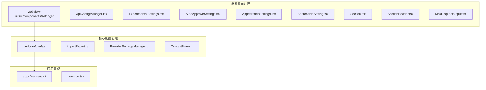
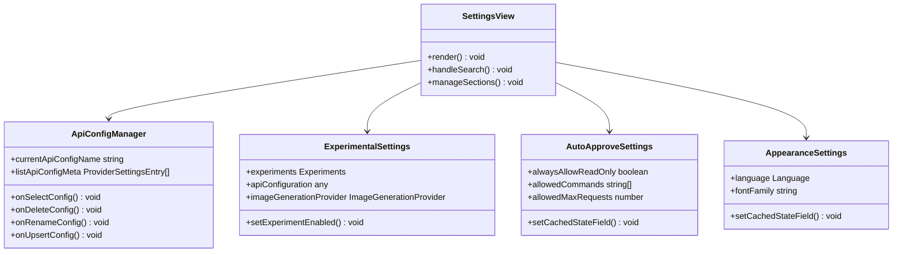
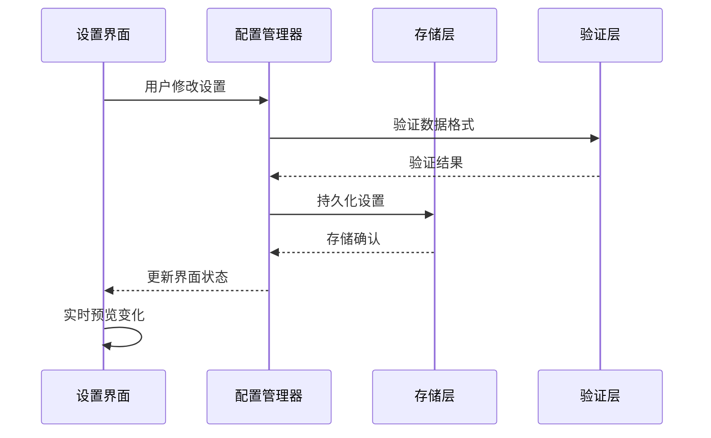
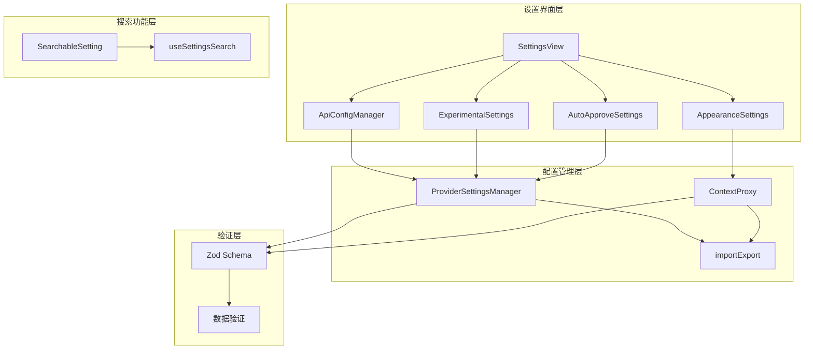
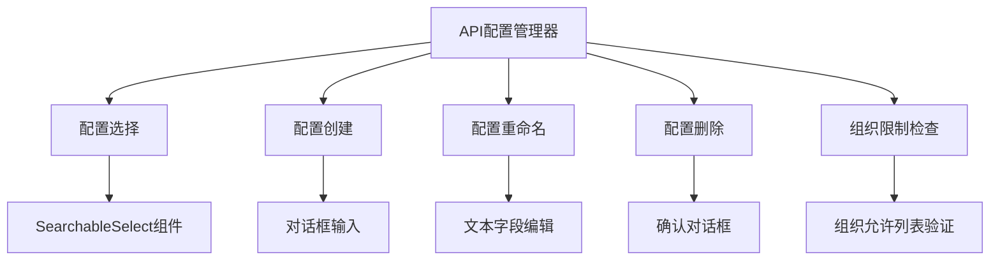
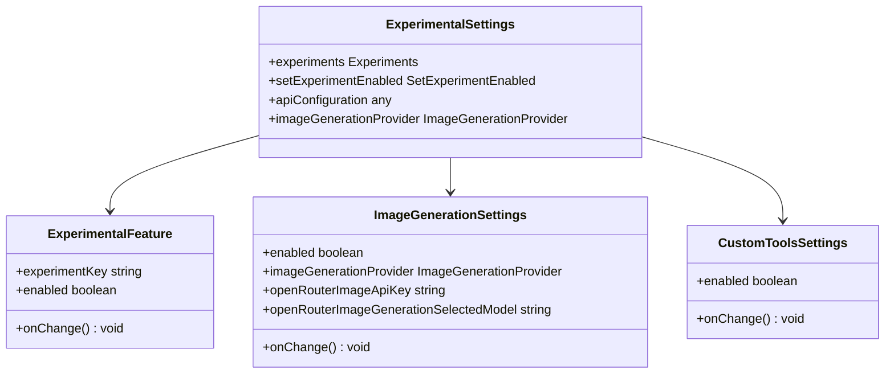
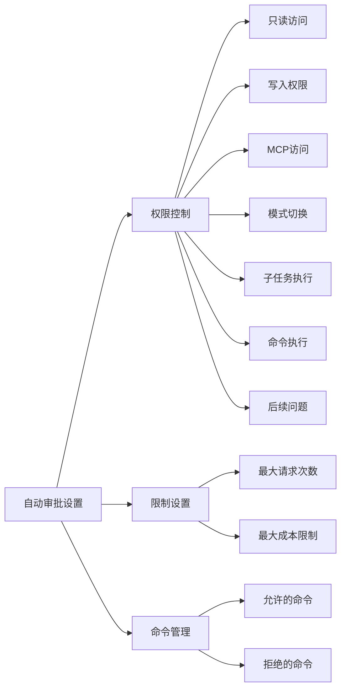
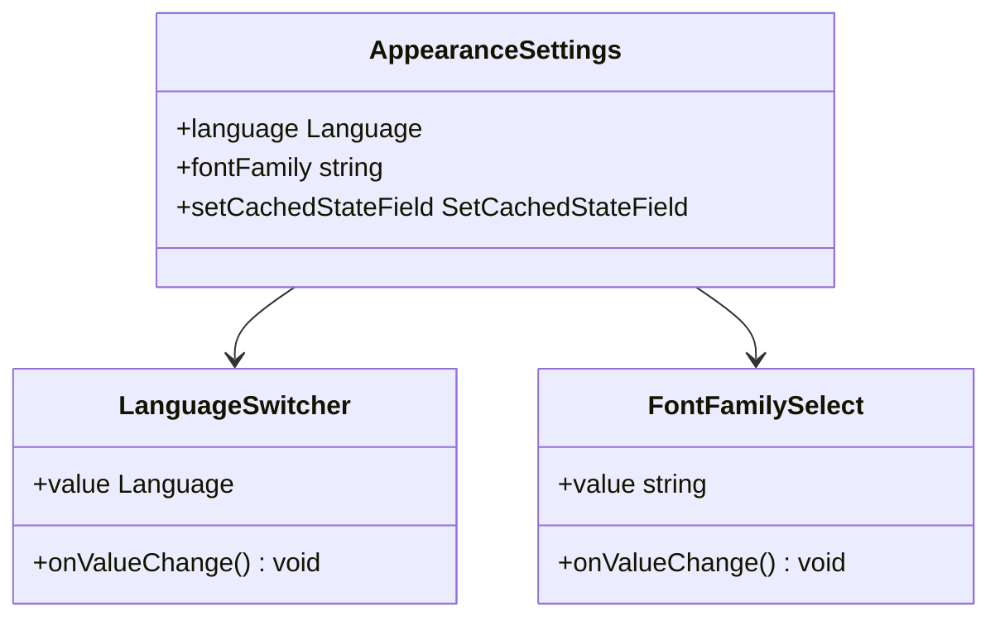
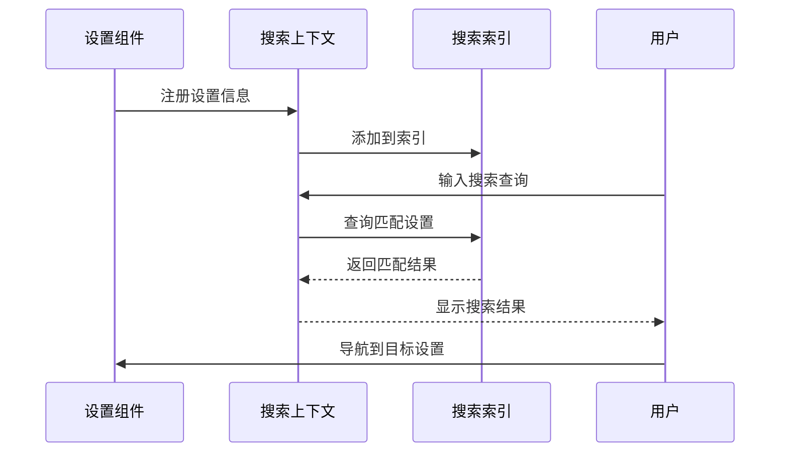
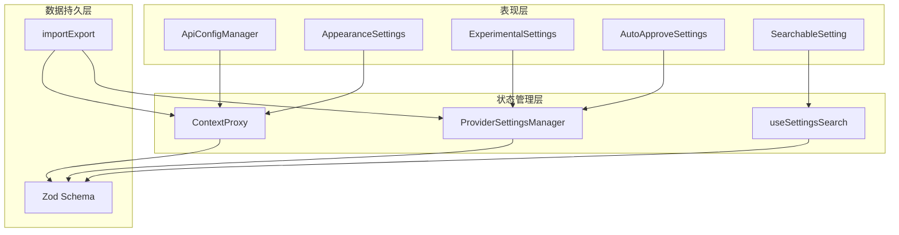

# 设置界面组件

<cite>
**本文档引用的文件**
- [ApiConfigManager.tsx](file://webview-ui/src/components/settings/ApiConfigManager.tsx)
- [ExperimentalSettings.tsx](file://webview-ui/src/components/settings/ExperimentalSettings.tsx)
- [AutoApproveSettings.tsx](file://webview-ui/src/components/settings/AutoApproveSettings.tsx)
- [AppearanceSettings.tsx](file://webview-ui/src/components/settings/AppearanceSettings.tsx)
- [SearchableSetting.tsx](file://webview-ui/src/components/settings/SearchableSetting.tsx)
- [Section.tsx](file://webview-ui/src/components/settings/Section.tsx)
- [SectionHeader.tsx](file://webview-ui/src/components/settings/SectionHeader.tsx)
- [MaxRequestsInput.tsx](file://webview-ui/src/components/settings/MaxRequestsInput.tsx)
- [importExport.ts](file://src/core/config/importExport.ts)
- [ProviderSettingsManager.ts](file://src/core/config/ProviderSettingsManager.ts)
- [ContextProxy.ts](file://src/core/config/ContextProxy.ts)
- [new-run.tsx](file://apps/web-evals/src/app/runs/new/new-run.tsx)
</cite>

## 目录
1. [简介](#简介)
2. [项目结构](#项目结构)
3. [核心组件](#核心组件)
4. [架构概览](#架构概览)
5. [详细组件分析](#详细组件分析)
6. [依赖关系分析](#依赖关系分析)
7. [性能考虑](#性能考虑)
8. [故障排除指南](#故障排除指南)
9. [结论](#结论)

## 简介

设置界面组件是Njust-AI项目中用于管理用户偏好和系统配置的核心模块。该组件体系提供了完整的设置管理功能，包括API配置管理、提供商设置、实验性功能开关、可搜索设置等。本文档将深入分析这些组件的设计和实现，涵盖数据绑定、验证规则、实时预览和持久化机制。

## 项目结构

设置界面组件主要分布在以下目录结构中：

**图表来源**
- [ApiConfigManager.tsx:1-359](file://webview-ui/src/components/settings/ApiConfigManager.tsx#L1-L359)
- [importExport.ts:1-342](file://src/core/config/importExport.ts#L1-L342)
- [ProviderSettingsManager.ts:1-882](file://src/core/config/ProviderSettingsManager.ts#L1-L882)

## 核心组件

### 设置视图架构

设置界面采用分层架构设计，通过多个专门的组件来管理不同类型的应用设置：

**图表来源**
- [ApiConfigManager.tsx:19-37](file://webview-ui/src/components/settings/ApiConfigManager.tsx#L19-L37)
- [ExperimentalSettings.tsx:18-44](file://webview-ui/src/components/settings/ExperimentalSettings.tsx#L18-L44)
- [AutoApproveSettings.tsx:21-54](file://webview-ui/src/components/settings/AutoApproveSettings.tsx#L21-L54)
- [AppearanceSettings.tsx:23-27](file://webview-ui/src/components/settings/AppearanceSettings.tsx#L23-L27)

### 数据流架构

设置组件之间的数据流通过以下机制实现：

**图表来源**
- [ContextProxy.ts:523-526](file://src/core/config/ContextProxy.ts#L523-L526)
- [ProviderSettingsManager.ts:355-378](file://src/core/config/ProviderSettingsManager.ts#L355-L378)

**章节来源**
- [ApiConfigManager.tsx:1-359](file://webview-ui/src/components/settings/ApiConfigManager.tsx#L1-L359)
- [ExperimentalSettings.tsx:1-127](file://webview-ui/src/components/settings/ExperimentalSettings.tsx#L1-L127)
- [AutoApproveSettings.tsx:1-398](file://webview-ui/src/components/settings/AutoApproveSettings.tsx#L1-L398)
- [AppearanceSettings.tsx:1-87](file://webview-ui/src/components/settings/AppearanceSettings.tsx#L1-L87)

## 架构概览

设置界面组件采用模块化设计，每个组件负责特定的功能领域：

**图表来源**
- [SearchableSetting.tsx:1-80](file://webview-ui/src/components/settings/SearchableSetting.tsx#L1-L80)
- [importExport.ts:75-198](file://src/core/config/importExport.ts#L75-L198)
- [ProviderSettingsManager.ts:39-55](file://src/core/config/ProviderSettingsManager.ts#L39-L55)

## 详细组件分析

### API配置管理器

API配置管理器是设置界面的核心组件之一，负责管理用户的API配置文件：

#### 组件功能特性

**图表来源**
- [ApiConfigManager.tsx:19-37](file://webview-ui/src/components/settings/ApiConfigManager.tsx#L19-L37)
- [ApiConfigManager.tsx:48-66](file://webview-ui/src/components/settings/ApiConfigManager.tsx#L48-L66)

#### 配置验证机制

组件实现了多层次的配置验证：

1. **名称验证**: 确保配置名称唯一且不为空
2. **组织限制**: 基于组织允许列表验证提供商有效性
3. **状态管理**: 处理创建、重命名、删除等不同操作状态

**章节来源**
- [ApiConfigManager.tsx:68-85](file://webview-ui/src/components/settings/ApiConfigManager.tsx#L68-L85)
- [ApiConfigManager.tsx:121-179](file://webview-ui/src/components/settings/ApiConfigManager.tsx#L121-L179)

### 实验性功能设置

实验性功能设置组件提供了灵活的实验性功能开关管理：

#### 功能组织结构

**图表来源**
- [ExperimentalSettings.tsx:18-44](file://webview-ui/src/components/settings/ExperimentalSettings.tsx#L18-L44)
- [ExperimentalSettings.tsx:52-122](file://webview-ui/src/components/settings/ExperimentalSettings.tsx#L52-L122)

#### 实验性功能管理

组件支持多种实验性功能的动态启用/禁用：

1. **图像生成功能**: 支持OpenRouter等图像生成服务
2. **自定义工具**: 允许用户扩展工具集
3. **功能开关**: 提供统一的实验性功能控制界面

**章节来源**
- [ExperimentalSettings.tsx:51-122](file://webview-ui/src/components/settings/ExperimentalSettings.tsx#L51-L122)

### 自动审批设置

自动审批设置组件管理着系统的自动化决策功能：

#### 设置项分类

**图表来源**
- [AutoApproveSettings.tsx:21-54](file://webview-ui/src/components/settings/AutoApproveSettings.tsx#L21-L54)

#### 实时交互机制

组件实现了丰富的实时交互功能：

1. **滑块控制**: 用于调整超时时间等数值设置
2. **复选框切换**: 控制各种权限和功能的启用状态
3. **命令管理**: 支持添加和移除允许或拒绝的命令

**章节来源**
- [AutoApproveSettings.tsx:152-393](file://webview-ui/src/components/settings/AutoApproveSettings.tsx#L152-L393)

### 外观设置

外观设置组件负责管理界面的显示偏好：

#### 字体和语言设置

**图表来源**
- [AppearanceSettings.tsx:23-27](file://webview-ui/src/components/settings/AppearanceSettings.tsx#L23-L27)
- [AppearanceSettings.tsx:47-82](file://webview-ui/src/components/settings/AppearanceSettings.tsx#L47-L82)

**章节来源**
- [AppearanceSettings.tsx:29-86](file://webview-ui/src/components/settings/AppearanceSettings.tsx#L29-L86)

### 可搜索设置

可搜索设置组件提供了强大的设置查找和导航功能：

#### 搜索索引机制

**图表来源**
- [SearchableSetting.tsx:56-66](file://webview-ui/src/components/settings/SearchableSetting.tsx#L56-L66)

**章节来源**
- [SearchableSetting.tsx:27-79](file://webview-ui/src/components/settings/SearchableSetting.tsx#L27-L79)

## 依赖关系分析

设置组件之间的依赖关系体现了清晰的分层架构：

**图表来源**
- [ContextProxy.ts:40-566](file://src/core/config/ContextProxy.ts#L40-L566)
- [ProviderSettingsManager.ts:57-574](file://src/core/config/ProviderSettingsManager.ts#L57-L574)
- [importExport.ts:23-38](file://src/core/config/importExport.ts#L23-L38)

### 核心依赖关系

1. **配置管理依赖**: 所有设置组件都依赖于配置管理器进行数据持久化
2. **验证依赖**: 使用Zod模式进行数据验证，确保设置的完整性
3. **搜索依赖**: 可搜索设置组件依赖于专门的搜索索引上下文

**章节来源**
- [ProviderSettingsManager.ts:1-882](file://src/core/config/ProviderSettingsManager.ts#L1-L882)
- [ContextProxy.ts:1-589](file://src/core/config/ContextProxy.ts#L1-L589)

## 性能考虑

设置界面组件在设计时充分考虑了性能优化：

### 数据绑定优化

1. **批量更新**: 使用Promise.all进行并发状态更新
2. **缓存机制**: 内存缓存减少存储访问频率
3. **懒加载**: 搜索索引仅在需要时初始化

### 渲染优化

1. **记忆化组件**: 使用React.memo避免不必要的重新渲染
2. **条件渲染**: 根据功能启用状态动态渲染相关设置
3. **虚拟滚动**: 对于大量配置项使用虚拟化技术

### 存储优化

1. **增量更新**: 仅更新变更的设置项
2. **去重处理**: 避免重复的配置项处理
3. **异步操作**: 所有存储操作都是异步执行

## 故障排除指南

### 常见问题及解决方案

#### 配置导入失败

当配置导入过程中出现错误时，系统会提供详细的错误信息：

1. **文件格式错误**: 检查JSON文件格式是否正确
2. **配置验证失败**: 查看具体验证错误信息
3. **权限问题**: 确认文件访问权限

#### 设置同步问题

如果发现设置不同步，可以尝试：

1. **重新初始化**: 调用ContextProxy.initialize()重新加载设置
2. **清理缓存**: 清除内存缓存后重新加载
3. **检查存储**: 验证VSCode存储状态

#### 搜索功能异常

如果搜索功能出现问题：

1. **重建索引**: 重新注册所有可搜索设置
2. **检查标签**: 确保设置标签正确翻译
3. **验证上下文**: 确认搜索上下文已正确初始化

**章节来源**
- [importExport.ts:186-197](file://src/core/config/importExport.ts#L186-L197)
- [ContextProxy.ts:554-566](file://src/core/config/ContextProxy.ts#L554-L566)

## 结论

设置界面组件展现了现代前端架构的最佳实践，通过模块化设计、清晰的分层结构和完善的错误处理机制，为用户提供了一个强大而易用的配置管理界面。组件间的松耦合设计使得系统具有良好的可维护性和扩展性。

主要优势包括：

1. **模块化设计**: 每个组件职责明确，便于单独测试和维护
2. **类型安全**: 使用TypeScript和Zod确保数据完整性
3. **用户体验**: 提供实时预览、搜索导航等现代化功能
4. **可扩展性**: 支持新的设置项和功能模块的轻松添加

未来可以进一步优化的方向包括：增强离线支持、改进性能监控、增加设置模板功能等。