# 通用基础组件

<cite>
**本文档引用的文件**
- [webview-ui/src/components/common/CodeBlock.tsx](file://webview-ui/src/components/common/CodeBlock.tsx)
- [webview-ui/src/components/common/DiffView.tsx](file://webview-ui/src/components/common/DiffView.tsx)
- [webview-ui/src/components/common/Modal.tsx](file://webview-ui/src/components/common/Modal.tsx)
- [webview-ui/src/components/common/Tabs.tsx](file://webview-ui/src/components/common/Tabs.tsx)
- [webview-ui/src/components/common/Thumbnail.tsx](file://webview-ui/src/components/common/Thumbnail.tsx)
- [webview-ui/src/components/common/LanguageSwitcher.tsx](file://webview-ui/src/components/common/LanguageSwitcher.tsx)
- [webview-ui/src/components/common/index.ts](file://webview-ui/src/components/common/index.ts)
- [webview-ui/src/components/common/utils.ts](file://webview-ui/src/components/common/utils.ts)
- [webview-ui/src/components/common/hooks/useModal.ts](file://webview-ui/src/components/common/hooks/useModal.ts)
- [webview-ui/src/components/common/hooks/useTabs.ts](file://webview-ui/src/components/common/hooks/useTabs.ts)
- [webview-ui/src/components/common/hooks/useLanguage.ts](file://webview-ui/src/components/common/hooks/useLanguage.ts)
- [webview-ui/src/components/common/styles/theme.ts](file://webview-ui/src/components/common/styles/theme.ts)
- [webview-ui/src/components/common/styles/responsive.ts](file://webview-ui/src/components/common/styles/responsive.ts)
- [webview-ui/src/components/common/types.ts](file://webview-ui/src/components/common/types.ts)
- [webview-ui/src/i18n/TranslationContext.tsx](file://webview-ui/src/i18n/TranslationContext.tsx)
- [webview-ui/src/context/ExtensionStateContext.tsx](file://webview-ui/src/context/ExtensionStateContext.tsx)
- [webview-ui/src/hooks/useEscapeKey.ts](file://webview-ui/src/hooks/useEscapeKey.ts)
- [webview-ui/src/utils/highlight.ts](file://webview-ui/src/utils/highlight.ts)
- [webview-ui/src/utils/highlightDiff.ts](file://webview-ui/src/utils/highlightDiff.ts)
- [webview-ui/src/utils/format.ts](file://webview-ui/src/utils/format.ts)
- [webview-ui/src/App.tsx](file://webview-ui/src/App.tsx)
</cite>

## 目录
1. [简介](#简介)
2. [项目结构](#项目结构)
3. [核心组件](#核心组件)
4. [架构概览](#架构概览)
5. [详细组件分析](#详细组件分析)
6. [依赖关系分析](#依赖关系分析)
7. [性能考虑](#性能考虑)
8. [故障排除指南](#故障排除指南)
9. [结论](#结论)

## 简介

本文件为Njust-AI项目中通用基础组件的全面开发文档。涵盖代码块、差异视图、模态框、标签页、缩略图、语言切换器等核心UI组件的设计与实现。文档详细说明了每个组件的属性接口、事件处理、状态管理、样式定制选项，并阐述了组件的可复用性设计、组合模式和跨组件通信机制。

这些组件采用现代化的React + TypeScript架构，结合Tailwind CSS进行样式管理，支持响应式设计和主题适配。所有组件均经过严格的类型安全设计，提供完整的国际化支持和无障碍访问能力。

## 项目结构

通用基础组件主要位于webview-ui项目的components/common目录下，采用模块化设计，每个组件独立封装并提供统一的导出接口。

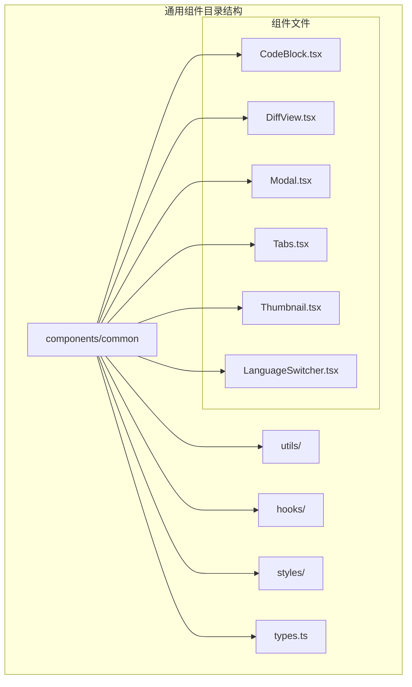

**图表来源**
- [webview-ui/src/components/common/CodeBlock.tsx](file://webview-ui/src/components/common/CodeBlock.tsx)
- [webview-ui/src/components/common/DiffView.tsx](file://webview-ui/src/components/common/DiffView.tsx)
- [webview-ui/src/components/common/Modal.tsx](file://webview-ui/src/components/common/Modal.tsx)
- [webview-ui/src/components/common/Tabs.tsx](file://webview-ui/src/components/common/Tabs.tsx)
- [webview-ui/src/components/common/Thumbnail.tsx](file://webview-ui/src/components/common/Thumbnail.tsx)
- [webview-ui/src/components/common/LanguageSwitcher.tsx](file://webview-ui/src/components/common/LanguageSwitcher.tsx)

**章节来源**
- [webview-ui/src/components/common/index.ts](file://webview-ui/src/components/common/index.ts)
- [webview-ui/src/components/common/types.ts](file://webview-ui/src/components/common/types.ts)

## 核心组件

### 组件体系架构

通用基础组件采用统一的设计规范和架构模式：

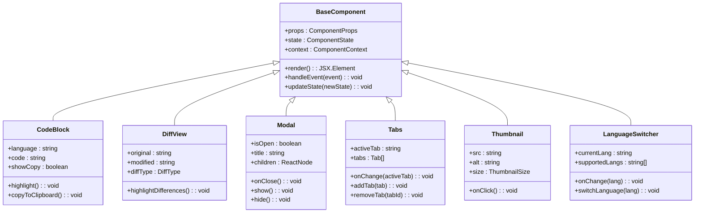

**图表来源**
- [webview-ui/src/components/common/CodeBlock.tsx](file://webview-ui/src/components/common/CodeBlock.tsx)
- [webview-ui/src/components/common/DiffView.tsx](file://webview-ui/src/components/common/DiffView.tsx)
- [webview-ui/src/components/common/Modal.tsx](file://webview-ui/src/components/common/Modal.tsx)
- [webview-ui/src/components/common/Tabs.tsx](file://webview-ui/src/components/common/Tabs.tsx)
- [webview-ui/src/components/common/Thumbnail.tsx](file://webview-ui/src/components/common/Thumbnail.tsx)
- [webview-ui/src/components/common/LanguageSwitcher.tsx](file://webview-ui/src/components/common/LanguageSwitcher.tsx)

### 组件导出系统

通过统一的index.ts文件集中导出所有组件，确保导入的一致性和可维护性：

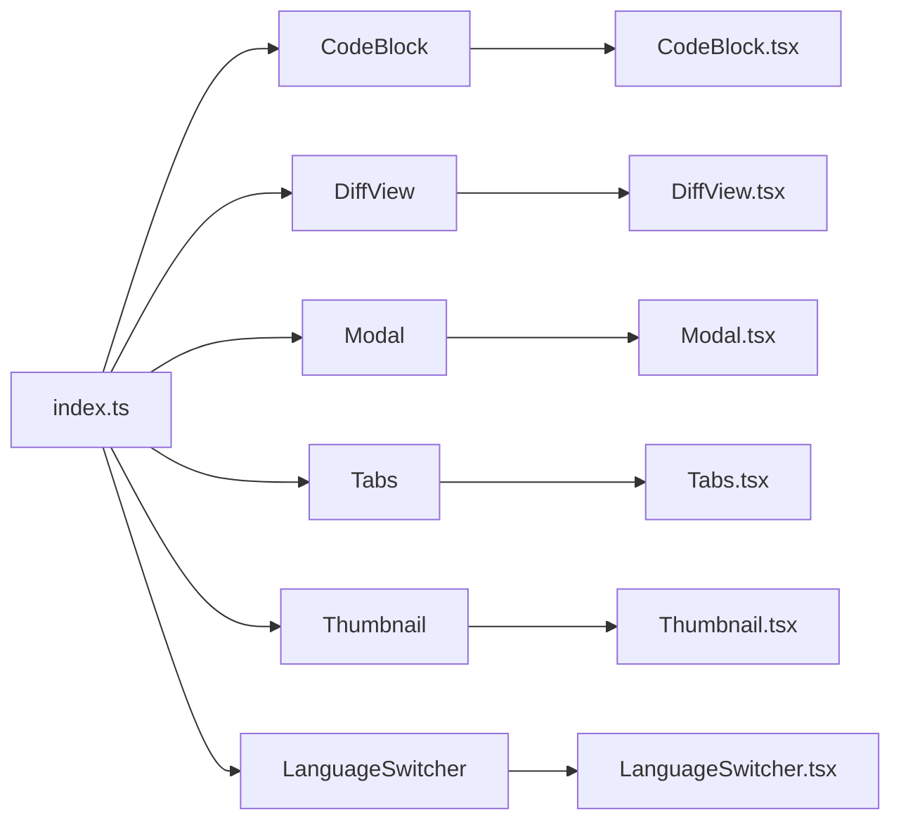

**图表来源**
- [webview-ui/src/components/common/index.ts](file://webview-ui/src/components/common/index.ts)

**章节来源**
- [webview-ui/src/components/common/index.ts](file://webview-ui/src/components/common/index.ts)

## 架构概览

### 组件通信机制

通用组件采用多种通信模式确保松耦合和高内聚：

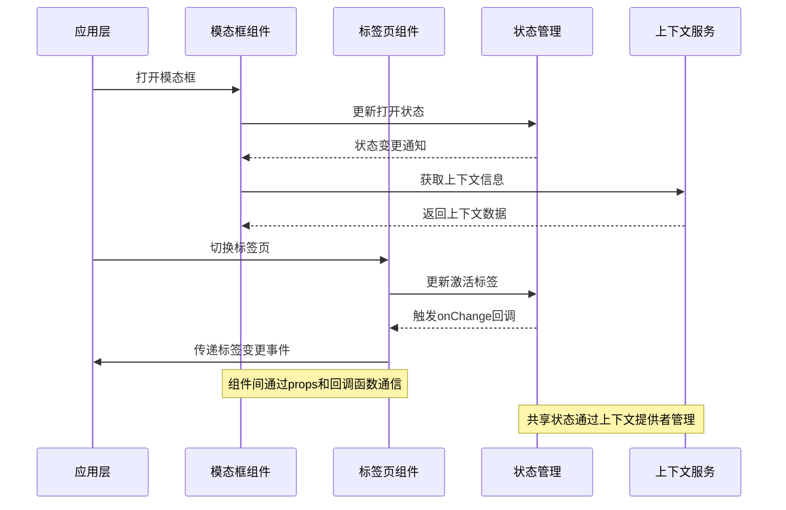

**图表来源**
- [webview-ui/src/components/common/hooks/useModal.ts](file://webview-ui/src/components/common/hooks/useModal.ts)
- [webview-ui/src/components/common/hooks/useTabs.ts](file://webview-ui/src/components/common/hooks/useTabs.ts)
- [webview-ui/src/context/ExtensionStateContext.tsx](file://webview-ui/src/context/ExtensionStateContext.tsx)

### 样式系统架构

组件采用分层样式架构，支持主题定制和响应式设计：

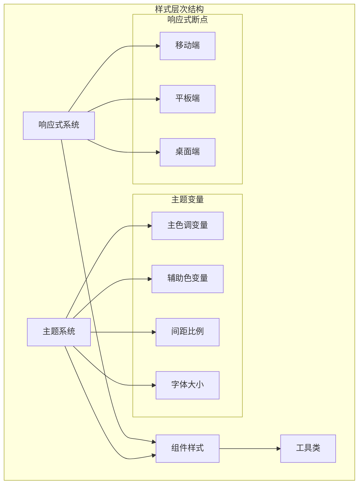

**图表来源**
- [webview-ui/src/components/common/styles/theme.ts](file://webview-ui/src/components/common/styles/theme.ts)
- [webview-ui/src/components/common/styles/responsive.ts](file://webview-ui/src/components/common/styles/responsive.ts)

**章节来源**
- [webview-ui/src/components/common/styles/theme.ts](file://webview-ui/src/components/common/styles/theme.ts)
- [webview-ui/src/components/common/styles/responsive.ts](file://webview-ui/src/components/common/styles/responsive.ts)

## 详细组件分析

### 代码块组件 (CodeBlock)

代码块组件提供语法高亮和代码复制功能，支持多种编程语言。

#### 属性接口定义

| 属性名 | 类型 | 必需 | 默认值 | 描述 |
|--------|------|------|--------|------|
| language | string | 否 | 'javascript' | 代码语言标识符 |
| code | string | 是 | - | 要显示的代码内容 |
| showCopy | boolean | 否 | true | 是否显示复制按钮 |
| className | string | 否 | '' | 自定义CSS类名 |
| onCopy | () => void | 否 | - | 复制成功回调函数 |

#### 核心功能实现

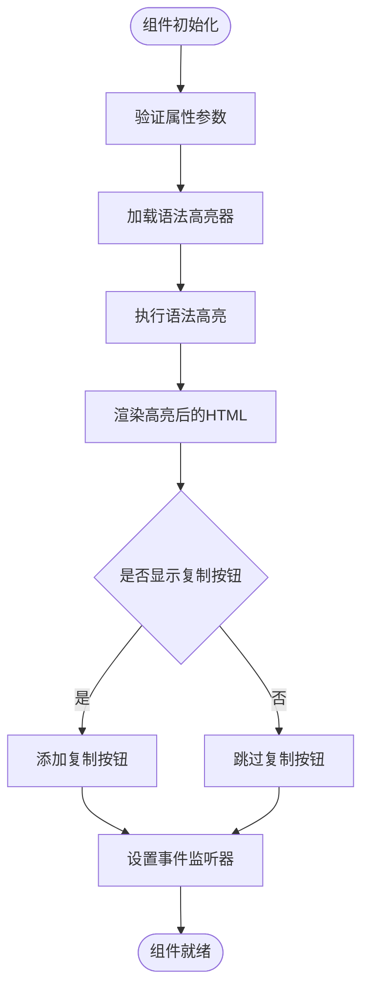

**图表来源**
- [webview-ui/src/components/common/CodeBlock.tsx](file://webview-ui/src/components/common/CodeBlock.tsx)
- [webview-ui/src/utils/highlight.ts](file://webview-ui/src/utils/highlight.ts)

#### 使用示例

基本用法：
```typescript
// 基础代码块
<CodeBlock 
  language="typescript"
  code={`function hello() {
  return "Hello World";
}`}
/>

// 带复制功能的代码块
<CodeBlock 
  language="python"
  code="print('Hello')"
  showCopy={true}
/>
```

高级用法：
```typescript
// 自定义样式和回调
<CodeBlock 
  language="javascript"
  code={codeString}
  className="custom-code-block"
  onCopy={() => console.log('代码已复制')}
/>
```

**章节来源**
- [webview-ui/src/components/common/CodeBlock.tsx](file://webview-ui/src/components/common/CodeBlock.tsx)
- [webview-ui/src/utils/highlight.ts](file://webview-ui/src/utils/highlight.ts)

### 差异视图组件 (DiffView)

差异视图组件用于可视化显示文本或代码的差异，支持多种差异类型。

#### 属性接口定义

| 属性名 | 类型 | 必需 | 默认值 | 描述 |
|--------|------|------|--------|------|
| original | string | 是 | - | 原始文本内容 |
| modified | string | 是 | - | 修改后的文本内容 |
| diffType | DiffType | 否 | 'unified' | 差异显示类型 |
| className | string | 否 | '' | 自定义CSS类名 |
| showLineNumbers | boolean | 否 | true | 是否显示行号 |
| onDiffClick | (lineNumber: number) => void | 否 | - | 差异点击回调 |

#### 差异算法实现

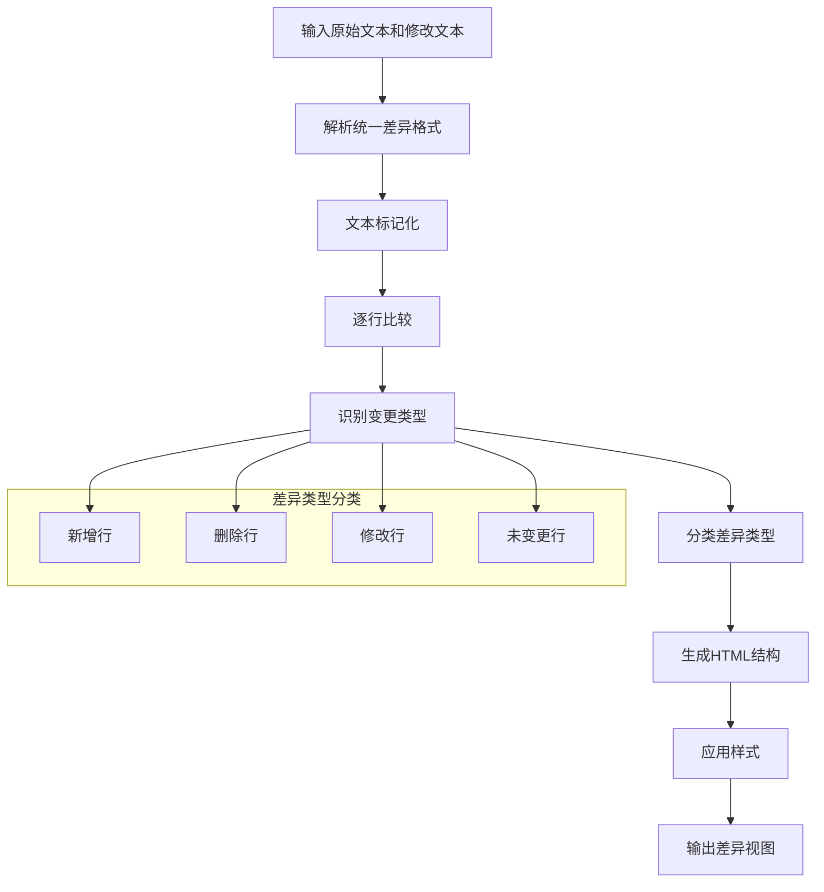

**图表来源**
- [webview-ui/src/components/common/DiffView.tsx](file://webview-ui/src/components/common/DiffView.tsx)
- [webview-ui/src/utils/highlightDiff.ts](file://webview-ui/src/utils/highlightDiff.ts)

#### 使用示例

基础差异视图：
```typescript
const originalText = `function add(a, b) {
  return a + b;
}`;

const modifiedText = `function add(a, b) {
  return a + b + 1;
}`;

<DiffView 
  original={originalText}
  modified={modifiedText}
  diffType="unified"
/>
```

自定义配置：
```typescript
<DiffView 
  original={originalText}
  modified={modifiedText}
  showLineNumbers={false}
  className="custom-diff-view"
  onDiffClick={(lineNumber) => {
    console.log(`点击了第${lineNumber}行`);
  }}
/>
```

**章节来源**
- [webview-ui/src/components/common/DiffView.tsx](file://webview-ui/src/components/common/DiffView.tsx)
- [webview-ui/src/utils/highlightDiff.ts](file://webview-ui/src/utils/highlightDiff.ts)

### 模态框组件 (Modal)

模态框组件提供弹窗交互功能，支持键盘事件和背景遮罩。

#### 属性接口定义

| 属性名 | 类型 | 必需 | 默认值 | 描述 |
|--------|------|------|--------|------|
| isOpen | boolean | 是 | - | 模态框是否显示 |
| onClose | () => void | 是 | - | 关闭模态框回调 |
| title | string | 否 | '' | 模态框标题 |
| children | ReactNode | 是 | - | 模态框内容 |
| className | string | 否 | '' | 自定义CSS类名 |
| closeOnOverlayClick | boolean | 否 | true | 点击遮罩关闭 |
| closeOnEsc | boolean | 否 | true | ESC键关闭 |

#### 状态管理模式

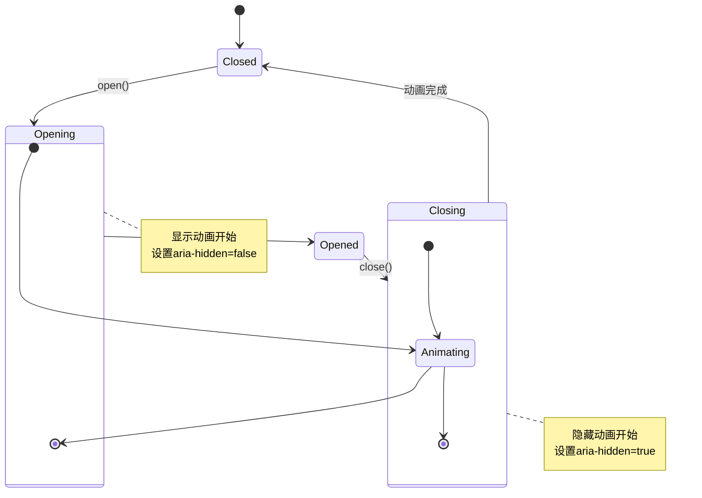

**图表来源**
- [webview-ui/src/components/common/Modal.tsx](file://webview-ui/src/components/common/Modal.tsx)
- [webview-ui/src/hooks/useEscapeKey.ts](file://webview-ui/src/hooks/useEscapeKey.ts)

#### 使用示例

基础模态框：
```typescript
const [isModalOpen, setIsModalOpen] = useState(false);

return (
  <>
    <button onClick={() => setIsModalOpen(true)}>
      打开模态框
    </button>
    
    <Modal 
      isOpen={isModalOpen}
      onClose={() => setIsModalOpen(false)}
      title="确认操作"
    >
      <p>您确定要执行此操作吗？</p>
      <div className="flex gap-4 mt-4">
        <button onClick={() => setIsModalOpen(false)}>
          取消
        </button>
        <button onClick={() => setIsModalOpen(false)}>
          确认
        </button>
      </div>
    </Modal>
  </>
);
```

高级配置：
```typescript
<Modal 
  isOpen={isOpen}
  onClose={handleClose}
  closeOnOverlayClick={false}
  closeOnEsc={true}
  className="custom-modal"
>
  {children}
</Modal>
```

**章节来源**
- [webview-ui/src/components/common/Modal.tsx](file://webview-ui/src/components/common/Modal.tsx)
- [webview-ui/src/hooks/useEscapeKey.ts](file://webview-ui/src/hooks/useEscapeKey.ts)

### 标签页组件 (Tabs)

标签页组件提供多面板切换功能，支持动态添加和移除标签。

#### 属性接口定义

| 属性名 | 类型 | 必需 | 默认值 | 描述 |
|--------|------|------|--------|------|
| activeTab | string | 是 | - | 当前激活的标签ID |
| tabs | Tab[] | 是 | - | 标签数组 |
| onChange | (activeTab: string) => void | 是 | - | 标签切换回调 |
| className | string | 否 | '' | 自定义CSS类名 |
| renderTabContent | (tab: Tab) => ReactNode | 否 | - | 自定义标签内容渲染 |
| addTab | (tab: Tab) => void | 否 | - | 添加新标签回调 |
| removeTab | (tabId: string) => void | 否 | - | 移除标签回调 |

#### 标签数据结构

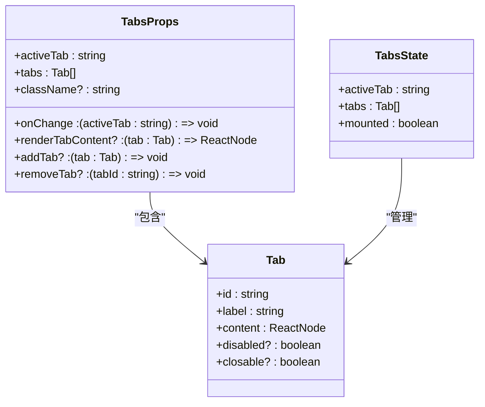

**图表来源**
- [webview-ui/src/components/common/Tabs.tsx](file://webview-ui/src/components/common/Tabs.tsx)
- [webview-ui/src/components/common/hooks/useTabs.ts](file://webview-ui/src/components/common/hooks/useTabs.ts)

#### 使用示例

基础标签页：
```typescript
const tabs = [
  { id: 'tab1', label: '首页', content: <HomeContent /> },
  { id: 'tab2', label: '设置', content: <SettingsContent /> },
  { id: 'tab3', label: '关于', content: <AboutContent /> }
];

const [activeTab, setActiveTab] = useState('tab1');

<Tabs 
  activeTab={activeTab}
  tabs={tabs}
  onChange={setActiveTab}
/>
```

动态标签管理：
```typescript
const [tabs, setTabs] = useState([
  { id: 'home', label: '首页', content: <div>首页内容</div> }
]);

const addNewTab = () => {
  const newTab = {
    id: `tab${Date.now()}`,
    label: `新标签${tabs.length + 1}`,
    content: <div>新标签内容</div>
  };
  setTabs([...tabs, newTab]);
};

<Tabs 
  activeTab={activeTab}
  tabs={tabs}
  onChange={setActiveTab}
  addTab={addNewTab}
  removeTab={(tabId) => {
    setTabs(tabs.filter(tab => tab.id !== tabId));
  }}
/>
```

**章节来源**
- [webview-ui/src/components/common/Tabs.tsx](file://webview-ui/src/components/common/Tabs.tsx)
- [webview-ui/src/components/common/hooks/useTabs.ts](file://webview-ui/src/components/common/hooks/useTabs.ts)

### 缩略图组件 (Thumbnail)

缩略图组件提供图片预览和懒加载功能，支持多种尺寸和占位符。

#### 属性接口定义

| 属性名 | 类型 | 必需 | 默认值 | 描述 |
|--------|------|------|--------|------|
| src | string | 是 | - | 图片源地址 |
| alt | string | 否 | '' | 替代文本 |
| size | ThumbnailSize | 否 | 'medium' | 缩略图尺寸 |
| className | string | 否 | '' | 自定义CSS类名 |
| onClick | () => void | 否 | - | 点击回调 |
| onError | () => void | 否 | - | 加载失败回调 |
| onLoad | () => void | 否 | - | 加载成功回调 |

#### 尺寸规格定义

| 尺寸 | 宽度 | 高度 | 适用场景 |
|------|------|------|----------|
| small | 48px | 48px | 小图标、头像 |
| medium | 96px | 96px | 中等图片、缩略图 |
| large | 192px | 192px | 大图片预览 |
| full | 100% | 100% | 全屏预览 |

#### 图片加载流程

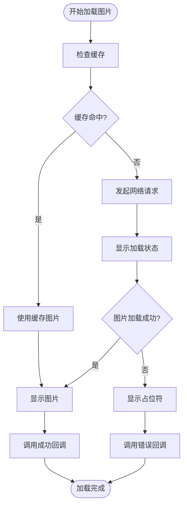

**图表来源**
- [webview-ui/src/components/common/Thumbnail.tsx](file://webview-ui/src/components/common/Thumbnail.tsx)

#### 使用示例

基础缩略图：
```typescript
<Thumbnail 
  src="/images/example.jpg"
  alt="示例图片"
  size="medium"
  onClick={() => console.log('图片被点击')}
/>
```

带错误处理：
```typescript
<Thumbnail 
  src={imageUrl}
  alt="用户头像"
  size="small"
  onError={() => console.log('图片加载失败')}
  onLoad={() => console.log('图片加载成功')}
/>
```

**章节来源**
- [webview-ui/src/components/common/Thumbnail.tsx](file://webview-ui/src/components/common/Thumbnail.tsx)

### 语言切换器组件 (LanguageSwitcher)

语言切换器组件提供多语言切换功能，集成国际化系统。

#### 属性接口定义

| 属性名 | 类型 | 必需 | 默认值 | 描述 |
|--------|------|------|--------|------|
| currentLang | string | 是 | - | 当前语言代码 |
| supportedLangs | string[] | 是 | - | 支持的语言列表 |
| onChange | (lang: string) => void | 是 | - | 语言切换回调 |
| className | string | 否 | '' | 自定义CSS类名 |
| placeholder | string | 否 | '选择语言' | 占位符文本 |
| disabled | boolean | 否 | false | 是否禁用 |

#### 国际化集成

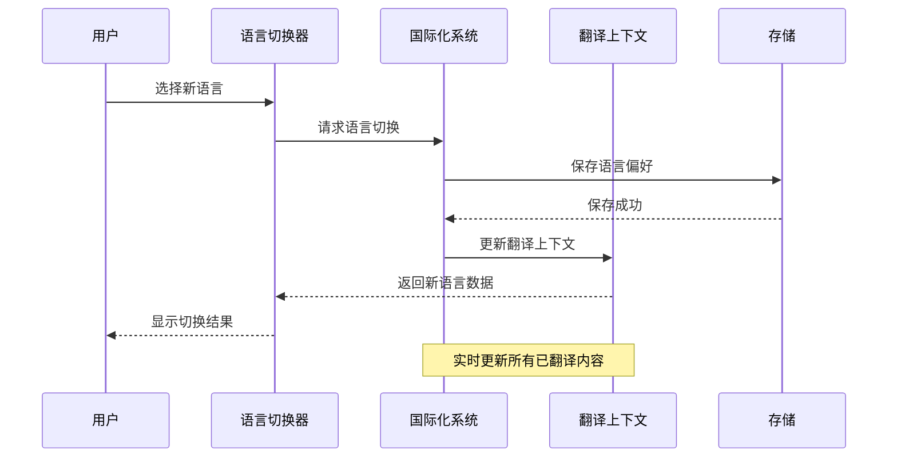

**图表来源**
- [webview-ui/src/components/common/LanguageSwitcher.tsx](file://webview-ui/src/components/common/LanguageSwitcher.tsx)
- [webview-ui/src/i18n/TranslationContext.tsx](file://webview-ui/src/i18n/TranslationContext.tsx)
- [webview-ui/src/components/common/hooks/useLanguage.ts](file://webview-ui/src/components/common/hooks/useLanguage.ts)

#### 使用示例

基础语言切换：
```typescript
const supportedLanguages = ['zh-CN', 'en-US', 'ja-JP'];

const handleLanguageChange = (lang: string) => {
  console.log(`切换到语言: ${lang}`);
};

<LanguageSwitcher 
  currentLang="zh-CN"
  supportedLangs={supportedLanguages}
  onChange={handleLanguageChange}
/>
```

集成应用状态：
```typescript
const [currentLang, setCurrentLang] = useState('zh-CN');

const handleLanguageChange = (newLang: string) => {
  setCurrentLang(newLang);
  // 这里可以添加其他逻辑，如重新加载页面
};

<LanguageSwitcher 
  currentLang={currentLang}
  supportedLangs={supportedLanguages}
  onChange={handleLanguageChange}
/>
```

**章节来源**
- [webview-ui/src/components/common/LanguageSwitcher.tsx](file://webview-ui/src/components/common/LanguageSwitcher.tsx)
- [webview-ui/src/i18n/TranslationContext.tsx](file://webview-ui/src/i18n/TranslationContext.tsx)

## 依赖关系分析

### 组件依赖图

```mermaid
graph TB
subgraph "核心依赖"
React[React 18+]
TypeScript[TypeScript]
TailwindCSS[Tailwind CSS]
FramerMotion[Framer Motion]
end
subgraph "组件层"
CodeBlock[CodeBlock]
DiffView[DiffView]
Modal[Modal]
Tabs[Tabs]
Thumbnail[Thumbnail]
LangSwitcher[LanguageSwitcher]
end
subgraph "工具层"
Highlight[语法高亮]
DiffUtils[差异处理]
Format[格式化工具]
Utils[通用工具]
end
subgraph "Hook层"
UseModal[useModal Hook]
UseTabs[useTabs Hook]
UseLanguage[useLanguage Hook]
UseEscape[useEscapeKey Hook]
end
subgraph "样式层"
Theme[主题系统]
Responsive[响应式系统]
Styles[组件样式]
end
React --> CodeBlock
React --> DiffView
React --> Modal
React --> Tabs
React --> Thumbnail
React --> LangSwitcher
TypeScript --> CodeBlock
TypeScript --> DiffView
TypeScript --> Modal
TypeScript --> Tabs
TypeScript --> Thumbnail
TypeScript --> LangSwitcher
TailwindCSS --> Styles
FramerMotion --> Modal
Highlight --> CodeBlock
DiffUtils --> DiffView
Format --> CodeBlock
Format --> DiffView
UseModal --> Modal
UseTabs --> Tabs
UseLanguage --> LangSwitcher
UseEscape --> Modal
Theme --> Styles
Responsive --> Styles
```

**图表来源**
- [webview-ui/src/components/common/CodeBlock.tsx](file://webview-ui/src/components/common/CodeBlock.tsx)
- [webview-ui/src/components/common/DiffView.tsx](file://webview-ui/src/components/common/DiffView.tsx)
- [webview-ui/src/components/common/Modal.tsx](file://webview-ui/src/components/common/Modal.tsx)
- [webview-ui/src/components/common/Tabs.tsx](file://webview-ui/src/components/common/Tabs.tsx)
- [webview-ui/src/components/common/Thumbnail.tsx](file://webview-ui/src/components/common/Thumbnail.tsx)
- [webview-ui/src/components/common/LanguageSwitcher.tsx](file://webview-ui/src/components/common/LanguageSwitcher.tsx)

### 数据流分析

组件间的数据流向遵循单向数据流原则：

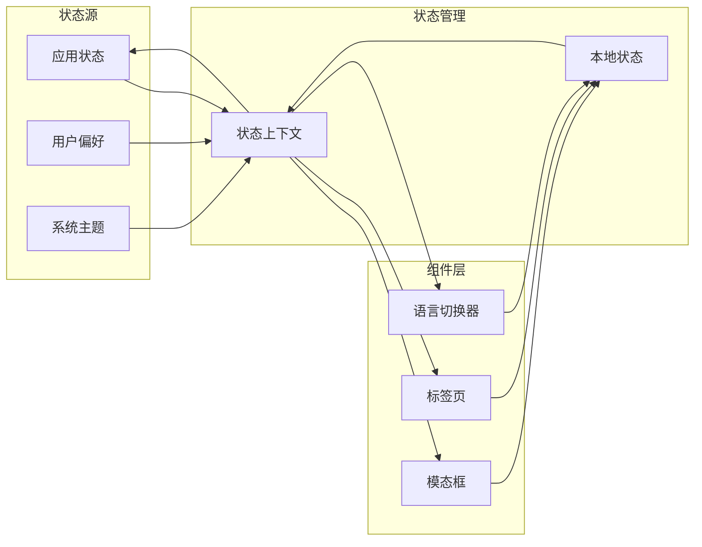

**图表来源**
- [webview-ui/src/context/ExtensionStateContext.tsx](file://webview-ui/src/context/ExtensionStateContext.tsx)
- [webview-ui/src/components/common/hooks/useModal.ts](file://webview-ui/src/components/common/hooks/useModal.ts)
- [webview-ui/src/components/common/hooks/useTabs.ts](file://webview-ui/src/components/common/hooks/useTabs.ts)
- [webview-ui/src/components/common/hooks/useLanguage.ts](file://webview-ui/src/components/common/hooks/useLanguage.ts)

**章节来源**
- [webview-ui/src/components/common/hooks/useModal.ts](file://webview-ui/src/components/common/hooks/useModal.ts)
- [webview-ui/src/components/common/hooks/useTabs.ts](file://webview-ui/src/components/common/hooks/useTabs.ts)
- [webview-ui/src/components/common/hooks/useLanguage.ts](file://webview-ui/src/components/common/hooks/useLanguage.ts)

## 性能考虑

### 渲染优化策略

1. **虚拟滚动**: 对于大量数据的列表组件，采用虚拟滚动技术减少DOM节点数量
2. **懒加载**: 图片和组件采用懒加载策略，提升初始渲染性能
3. **防抖节流**: 输入组件使用防抖节流优化用户交互响应
4. **记忆化**: 复杂计算结果使用记忆化缓存避免重复计算

### 内存管理

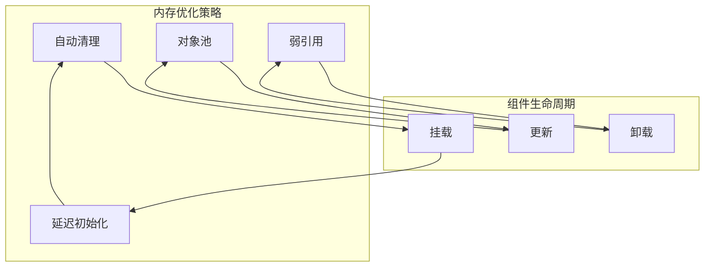

### 响应式设计

组件支持多设备适配，采用移动优先的设计理念：

| 设备类型 | 最小宽度 | 断点 | 适用场景 |
|----------|----------|------|----------|
| 移动设备 | 0px | xs | 手机端浏览 |
| 平板设备 | 768px | sm | 平板端操作 |
| 桌面设备 | 1024px | md | 桌面端编辑 |
| 大屏设备 | 1200px | lg | 大屏幕展示 |

**章节来源**
- [webview-ui/src/components/common/styles/responsive.ts](file://webview-ui/src/components/common/styles/responsive.ts)

## 故障排除指南

### 常见问题诊断

1. **组件样式异常**
   - 检查Tailwind CSS配置是否正确
   - 验证主题变量是否定义完整
   - 确认CSS类名拼写正确

2. **组件功能失效**
   - 检查事件处理器绑定
   - 验证状态更新逻辑
   - 确认条件渲染逻辑

3. **性能问题**
   - 分析组件重渲染次数
   - 检查不必要的依赖项
   - 优化大数据量渲染

### 调试工具

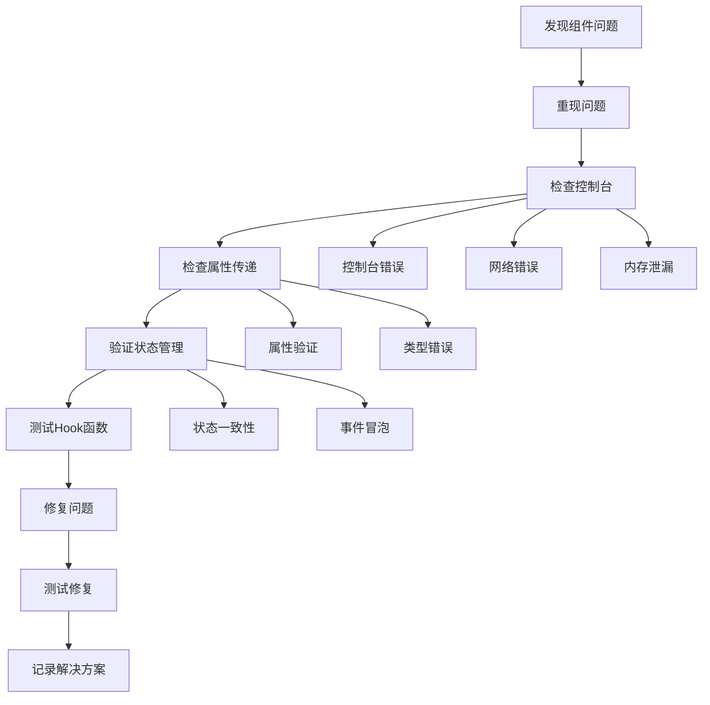

**图表来源**
- [webview-ui/src/components/common/utils.ts](file://webview-ui/src/components/common/utils.ts)

**章节来源**
- [webview-ui/src/components/common/utils.ts](file://webview-ui/src/components/common/utils.ts)

## 结论

Njust-AI项目的通用基础组件展现了现代前端开发的最佳实践。通过模块化的架构设计、完善的类型系统、灵活的状态管理以及优秀的性能优化策略，这些组件为上层应用提供了稳定可靠的UI基础。

组件设计的核心优势包括：

1. **高度可复用性**: 通过标准化的属性接口和事件处理机制，组件可以在不同场景下灵活使用
2. **强类型安全**: 完整的TypeScript类型定义确保开发时的类型安全和IDE支持
3. **良好的扩展性**: 组件采用组合模式，支持通过props和children进行功能扩展
4. **优秀的用户体验**: 响应式设计、无障碍访问和流畅的动画效果提升了整体用户体验
5. **完善的国际化支持**: 内置的多语言切换和翻译系统支持全球化部署

未来的发展方向包括进一步优化性能表现、增强组件间的通信机制、完善测试覆盖率以及探索更多创新的UI交互模式。