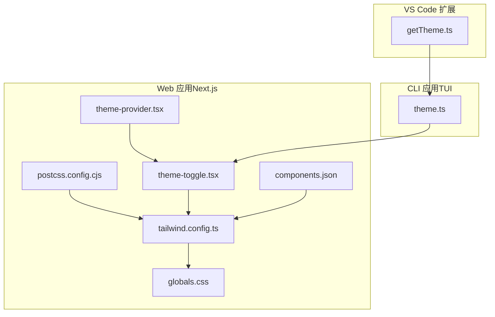
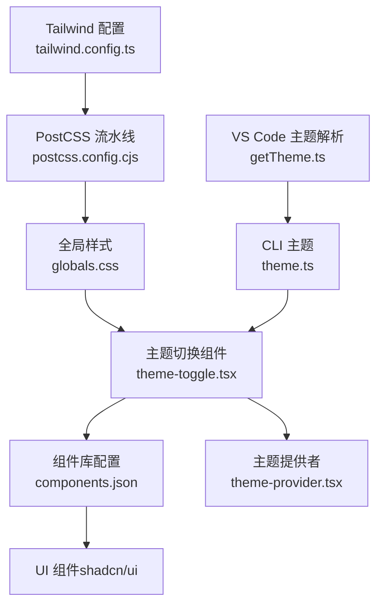
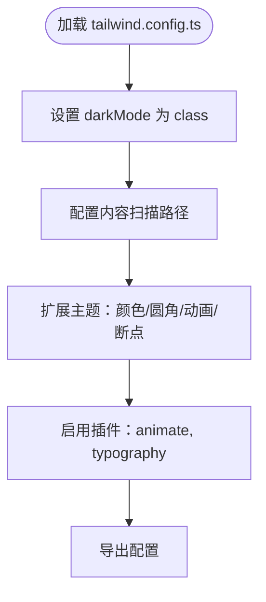
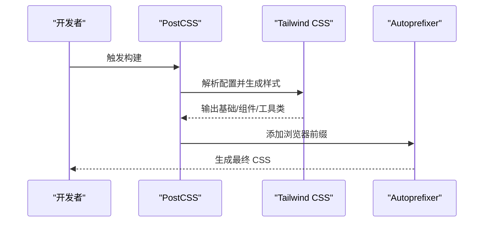
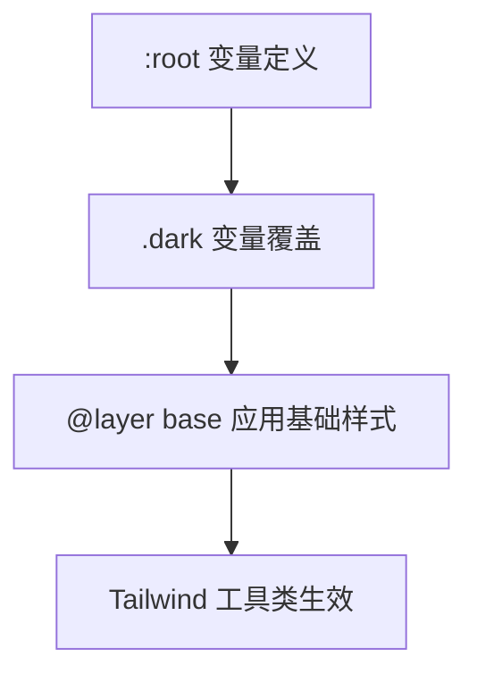
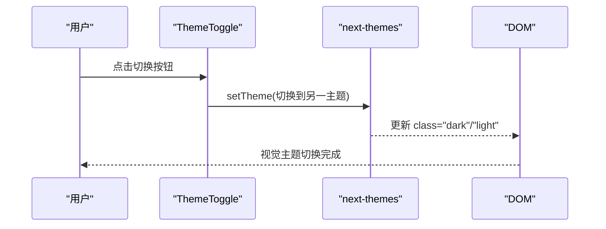
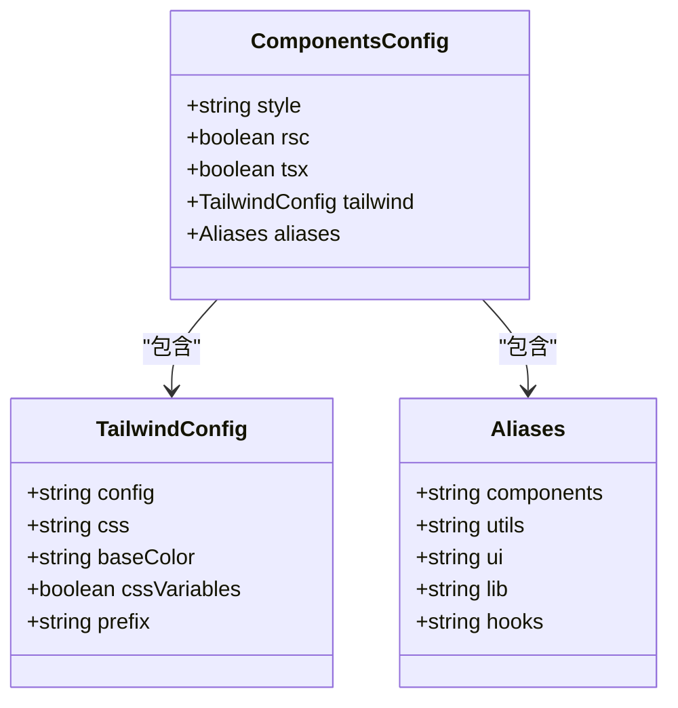
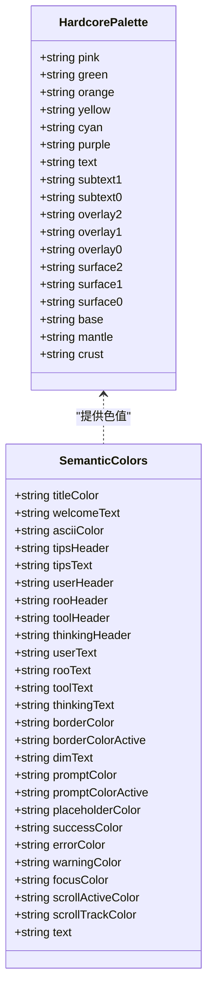
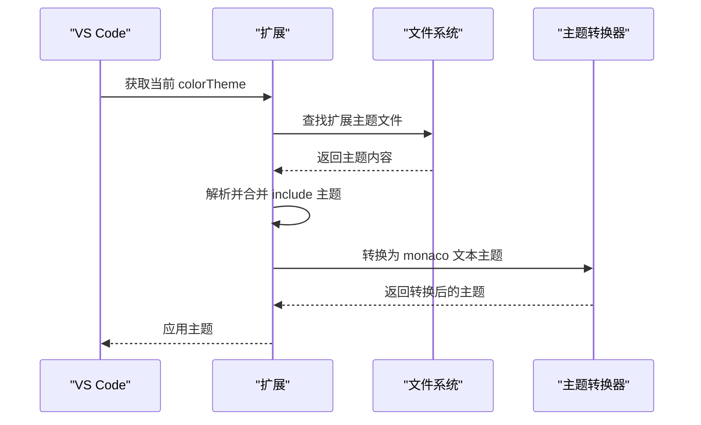
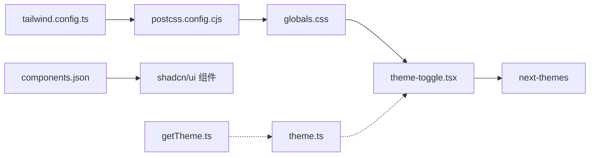

# 样式与主题

<cite>
**本文档引用的文件**
- [tailwind.config.ts](file://apps/web-Njust-AI/tailwind.config.ts)
- [postcss.config.cjs](file://apps/web-Njust-AI/postcss.config.cjs)
- [globals.css](file://apps/web-Njust-AI/src/app/globals.css)
- [theme-toggle.tsx](file://apps/web-Njust-AI/src/components/chromes/theme-toggle.tsx)
- [theme.ts](file://apps/cli/src/ui/theme.ts)
- [getTheme.ts](file://src/integrations/theme/getTheme.ts)
- [components.json](file://apps/web-Njust-AI/components.json)
- [theme-provider.tsx](file://apps/web-evals/src/components/providers/theme-provider.tsx)
</cite>

## 目录
1. [简介](#简介)
2. [项目结构](#项目结构)
3. [核心组件](#核心组件)
4. [架构总览](#架构总览)
5. [详细组件分析](#详细组件分析)
6. [依赖关系分析](#依赖关系分析)
7. [性能考虑](#性能考虑)
8. [故障排除指南](#故障排除指南)
9. [结论](#结论)
10. [附录](#附录)

## 简介
本文件面向样式与主题系统，系统化梳理 Tailwind CSS 配置与使用、组件样式组织、主题系统实现、预设样式与颜色体系、响应式设计策略，并提供样式变量管理、主题切换机制、自定义样式开发指南、性能优化与浏览器兼容性建议。文档同时覆盖 CLI TUI 主题与 VS Code 扩展主题集成，帮助读者在多端场景下构建一致且可维护的设计系统。

## 项目结构
样式与主题相关的核心文件主要分布在以下位置：
- Web 应用（Next.js）：Tailwind 配置、PostCSS、全局样式、主题切换组件、组件库配置
- CLI 应用（TUI）：硬核配色方案与文本色彩映射
- VS Code 扩展：主题解析与转换，支持高对比度与明暗主题

**图表来源**
- [tailwind.config.ts:1-119](file://apps/web-Njust-AI/tailwind.config.ts#L1-L119)
- [postcss.config.cjs:1-7](file://apps/web-Njust-AI/postcss.config.cjs#L1-L7)
- [globals.css:1-73](file://apps/web-Njust-AI/src/app/globals.css#L1-L73)
- [theme-toggle.tsx:1-41](file://apps/web-Njust-AI/src/components/chromes/theme-toggle.tsx#L1-L41)
- [components.json:1-22](file://apps/web-Njust-AI/components.json#L1-L22)
- [theme-provider.tsx:1-13](file://apps/web-evals/src/components/providers/theme-provider.tsx#L1-L13)
- [theme.ts:1-80](file://apps/cli/src/ui/theme.ts#L1-L80)
- [getTheme.ts:1-128](file://src/integrations/theme/getTheme.ts#L1-L128)

**章节来源**
- [tailwind.config.ts:1-119](file://apps/web-Njust-AI/tailwind.config.ts#L1-L119)
- [postcss.config.cjs:1-7](file://apps/web-Njust-AI/postcss.config.cjs#L1-L7)
- [globals.css:1-73](file://apps/web-Njust-AI/src/app/globals.css#L1-L73)
- [theme-toggle.tsx:1-41](file://apps/web-Njust-AI/src/components/chromes/theme-toggle.tsx#L1-L41)
- [components.json:1-22](file://apps/web-Njust-AI/components.json#L1-L22)
- [theme-provider.tsx:1-13](file://apps/web-evals/src/components/providers/theme-provider.tsx#L1-L13)
- [theme.ts:1-80](file://apps/cli/src/ui/theme.ts#L1-L80)
- [getTheme.ts:1-128](file://src/integrations/theme/getTheme.ts#L1-L128)

## 核心组件
- Tailwind CSS 配置：定义容器、颜色系统、圆角、动画、断点与插件
- PostCSS 流水线：启用 Tailwind 与 Autoprefixer
- 全局样式：CSS 变量定义与明暗主题切换
- 主题切换组件：基于 next-themes 的客户端切换逻辑
- 组件库配置：shadcn/ui 集成与别名映射
- CLI 主题：硬核配色方案与语义化颜色映射
- VS Code 主题：主题解析、合并与转换

**章节来源**
- [tailwind.config.ts:1-119](file://apps/web-Njust-AI/tailwind.config.ts#L1-L119)
- [postcss.config.cjs:1-7](file://apps/web-Njust-AI/postcss.config.cjs#L1-L7)
- [globals.css:1-73](file://apps/web-Njust-AI/src/app/globals.css#L1-L73)
- [theme-toggle.tsx:1-41](file://apps/web-Njust-AI/src/components/chromes/theme-toggle.tsx#L1-L41)
- [components.json:1-22](file://apps/web-Njust-AI/components.json#L1-L22)
- [theme.ts:1-80](file://apps/cli/src/ui/theme.ts#L1-L80)
- [getTheme.ts:1-128](file://src/integrations/theme/getTheme.ts#L1-L128)

## 架构总览
样式系统采用“配置驱动 + 变量中心 + 组件库”的分层架构：
- 配置层：Tailwind 与 PostCSS 定义工具类与构建流程
- 变量层：CSS 自定义属性集中管理颜色与半径
- 组件层：基于 shadcn/ui 的可复用 UI 组件
- 切换层：next-themes 提供主题状态与持久化
- 扩展层：CLI 与 VS Code 主题独立但遵循统一设计语言

**图表来源**
- [tailwind.config.ts:1-119](file://apps/web-Njust-AI/tailwind.config.ts#L1-L119)
- [postcss.config.cjs:1-7](file://apps/web-Njust-AI/postcss.config.cjs#L1-L7)
- [globals.css:1-73](file://apps/web-Njust-AI/src/app/globals.css#L1-L73)
- [theme-toggle.tsx:1-41](file://apps/web-Njust-AI/src/components/chromes/theme-toggle.tsx#L1-L41)
- [components.json:1-22](file://apps/web-Njust-AI/components.json#L1-L22)
- [theme-provider.tsx:1-13](file://apps/web-evals/src/components/providers/theme-provider.tsx#L1-L13)
- [theme.ts:1-80](file://apps/cli/src/ui/theme.ts#L1-L80)
- [getTheme.ts:1-128](file://src/integrations/theme/getTheme.ts#L1-L128)

## 详细组件分析

### Tailwind CSS 配置与使用
- 明暗模式：通过类选择器实现，配合 CSS 变量切换
- 内容扫描：覆盖 pages、components、app、src 与根目录
- 主题扩展：
  - 颜色系统：基于 hsl(var(--*)) 的语义化命名（边框、输入、环形、背景、前景、主/次级、破坏性、柔和、强调、气泡、卡片、图表系列）
  - 圆角：基于 CSS 变量 --radius 的层级化缩放
  - 动画：手风琴展开/收起、淡入淡出、脉冲发光
  - 断点：新增 xs: 420px
- 插件：tailwindcss-animate、@tailwindcss/typography

**图表来源**
- [tailwind.config.ts:1-119](file://apps/web-Njust-AI/tailwind.config.ts#L1-L119)

**章节来源**
- [tailwind.config.ts:1-119](file://apps/web-Njust-AI/tailwind.config.ts#L1-L119)

### PostCSS 与构建流水线
- 使用 PostCSS 加载 tailwindcss 与 autoprefixer 插件
- 在构建阶段生成兼容目标浏览器的 CSS

**图表来源**
- [postcss.config.cjs:1-7](file://apps/web-Njust-AI/postcss.config.cjs#L1-L7)

**章节来源**
- [postcss.config.cjs:1-7](file://apps/web-Njust-AI/postcss.config.cjs#L1-L7)

### 全局样式与 CSS 变量
- :root 定义浅色主题变量（背景、前景、卡片、弹出层、主/次级、柔和、强调、破坏性、边框、输入、环形、圆角半径、图表系列）
- .dark 定义深色主题变量，覆盖关键色彩
- @layer base：全局边框与背景/文字应用

**图表来源**
- [globals.css:1-73](file://apps/web-Njust-AI/src/app/globals.css#L1-L73)

**章节来源**
- [globals.css:1-73](file://apps/web-Njust-AI/src/app/globals.css#L1-L73)

### 主题切换机制（Web）
- 使用 next-themes 管理主题状态与持久化
- 客户端组件通过 useTheme 获取当前主题并切换
- 避免水合不匹配：挂载后才渲染交互元素

**图表来源**
- [theme-toggle.tsx:1-41](file://apps/web-Njust-AI/src/components/chromes/theme-toggle.tsx#L1-L41)

**章节来源**
- [theme-toggle.tsx:1-41](file://apps/web-Njust-AI/src/components/chromes/theme-toggle.tsx#L1-L41)

### 组件库与样式组织（shadcn/ui）
- 组件库配置：style 为 new-york，tailwind.css 指向全局样式，启用 CSS 变量
- 别名映射：components、utils、ui、lib、hooks
- TSX 与 RSC 支持开启

**图表来源**
- [components.json:1-22](file://apps/web-Njust-AI/components.json#L1-L22)

**章节来源**
- [components.json:1-22](file://apps/web-Njust-AI/components.json#L1-L22)

### CLI TUI 主题（硬核配色）
- 定义一组固定色板（粉红、绿色、橙色、黄色、青色、紫色等）
- 提供标题、提示、消息头、消息文本、边框、占位符、状态、焦点指示等语义化映射
- 适用于终端界面的颜色一致性与可读性

**图表来源**
- [theme.ts:1-80](file://apps/cli/src/ui/theme.ts#L1-L80)

**章节来源**
- [theme.ts:1-80](file://apps/cli/src/ui/theme.ts#L1-L80)

### VS Code 扩展主题集成
- 解析当前工作区颜色主题名称
- 遍历扩展贡献的主题文件，定位目标主题
- 支持默认主题映射与包含（include）主题合并
- 使用 monaco-vscode-textmate-theme-converter 转换为可用格式
- 自动识别 base（vs/vs-dark/hc-black）

**图表来源**
- [getTheme.ts:1-128](file://src/integrations/theme/getTheme.ts#L1-L128)

**章节来源**
- [getTheme.ts:1-128](file://src/integrations/theme/getTheme.ts#L1-L128)

## 依赖关系分析
- Tailwind 依赖 PostCSS 与 Autoprefixer
- 全局样式依赖 CSS 变量与明暗类
- 主题切换组件依赖 next-themes
- 组件库依赖 shadcn/ui 配置
- CLI 主题与 Web 主题相互独立，但共享设计语言

**图表来源**
- [tailwind.config.ts:1-119](file://apps/web-Njust-AI/tailwind.config.ts#L1-L119)
- [postcss.config.cjs:1-7](file://apps/web-Njust-AI/postcss.config.cjs#L1-L7)
- [globals.css:1-73](file://apps/web-Njust-AI/src/app/globals.css#L1-L73)
- [theme-toggle.tsx:1-41](file://apps/web-Njust-AI/src/components/chromes/theme-toggle.tsx#L1-L41)
- [components.json:1-22](file://apps/web-Njust-AI/components.json#L1-L22)
- [theme.ts:1-80](file://apps/cli/src/ui/theme.ts#L1-L80)
- [getTheme.ts:1-128](file://src/integrations/theme/getTheme.ts#L1-L128)

**章节来源**
- [tailwind.config.ts:1-119](file://apps/web-Njust-AI/tailwind.config.ts#L1-L119)
- [postcss.config.cjs:1-7](file://apps/web-Njust-AI/postcss.config.cjs#L1-L7)
- [globals.css:1-73](file://apps/web-Njust-AI/src/app/globals.css#L1-L73)
- [theme-toggle.tsx:1-41](file://apps/web-Njust-AI/src/components/chromes/theme-toggle.tsx#L1-L41)
- [components.json:1-22](file://apps/web-Njust-AI/components.json#L1-L22)
- [theme.ts:1-80](file://apps/cli/src/ui/theme.ts#L1-L80)
- [getTheme.ts:1-128](file://src/integrations/theme/getTheme.ts#L1-L128)

## 性能考虑
- 构建优化
  - 合理配置内容扫描路径，避免扫描无关目录
  - 仅启用必要插件，减少编译体积
- 运行时优化
  - CSS 变量集中管理，降低重复定义
  - 动画使用硬件加速友好的属性（如 opacity、transform）
  - 避免在关键路径上引入大体积第三方样式
- 浏览器兼容性
  - 通过 Autoprefixer 自动添加厂商前缀
  - 对于旧版浏览器，确保必要的 polyfill 与降级方案

[本节为通用指导，无需特定文件引用]

## 故障排除指南
- 主题切换无效
  - 检查是否正确包裹在 ThemeProvider 下
  - 确认 DOM 上存在 class="dark" 或 "light"
- 水合不匹配警告
  - 确保客户端组件在挂载后再渲染交互元素
- 样式未生效
  - 检查 globals.css 是否被正确导入
  - 确认 tailwind.config.ts 的 content 路径包含目标组件
- VS Code 主题不显示
  - 检查 colorTheme 配置与扩展主题文件是否存在
  - 确认 include 主题路径正确

**章节来源**
- [theme-provider.tsx:1-13](file://apps/web-evals/src/components/providers/theme-provider.tsx#L1-L13)
- [theme-toggle.tsx:1-41](file://apps/web-Njust-AI/src/components/chromes/theme-toggle.tsx#L1-L41)
- [globals.css:1-73](file://apps/web-Njust-AI/src/app/globals.css#L1-L73)
- [tailwind.config.ts:1-119](file://apps/web-Njust-AI/tailwind.config.ts#L1-L119)
- [getTheme.ts:1-128](file://src/integrations/theme/getTheme.ts#L1-L128)

## 结论
该样式与主题系统以 Tailwind CSS 为核心，结合 CSS 变量、next-themes 与 shadcn/ui，实现了跨端一致的设计语言与灵活的主题切换。CLI 与 VS Code 扩展分别提供独立的主题实现，满足不同运行环境的需求。通过合理的配置与最佳实践，可在保证性能的同时提升开发效率与用户体验。

[本节为总结，无需特定文件引用]

## 附录

### 预设样式与颜色系统
- 语义化颜色命名：边框、输入、环形、背景、前景、主/次级、破坏性、柔和、强调、气泡、卡片、图表系列
- 圆角层级：基于 --radius 的 lg/md/sm 缩放
- 动画集：手风琴、淡入淡出、脉冲发光

**章节来源**
- [tailwind.config.ts:20-80](file://apps/web-Njust-AI/tailwind.config.ts#L20-L80)

### 响应式设计
- 断点：xs: 420px；容器最大宽度：2xl: 1400px
- 建议：在组件中优先使用语义化断点，避免硬编码像素

**章节来源**
- [tailwind.config.ts:16-112](file://apps/web-Njust-AI/tailwind.config.ts#L16-L112)

### 主题切换开发指南
- 在应用根部包裹 ThemeProvider
- 使用 useTheme 获取/切换主题
- 在客户端组件中避免服务端渲染期间的状态变更

**章节来源**
- [theme-provider.tsx:1-13](file://apps/web-evals/src/components/providers/theme-provider.tsx#L1-L13)
- [theme-toggle.tsx:1-41](file://apps/web-Njust-AI/src/components/chromes/theme-toggle.tsx#L1-L41)

### 自定义样式开发示例
- 新增颜色：在 tailwind.config.ts 的 extend.colors 中添加语义键值
- 新增动画：在 extend.keyframes 与 extend.animation 中定义
- 新增断点：在 extend.screens 中扩展

**章节来源**
- [tailwind.config.ts:20-112](file://apps/web-Njust-AI/tailwind.config.ts#L20-L112)

### 设计系统最佳实践
- 使用 CSS 变量集中管理品牌色与语义色
- 保持组件库风格一致（style/new-york），避免混用
- 为每个语义颜色提供明/暗两套变量，确保主题一致性
- 在 CLI 与 Web 端保持相同的语义映射，减少认知负担

**章节来源**
- [components.json:1-22](file://apps/web-Njust-AI/components.json#L1-L22)
- [theme.ts:1-80](file://apps/cli/src/ui/theme.ts#L1-L80)