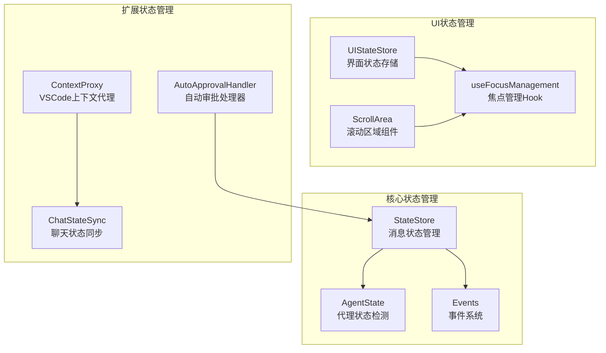
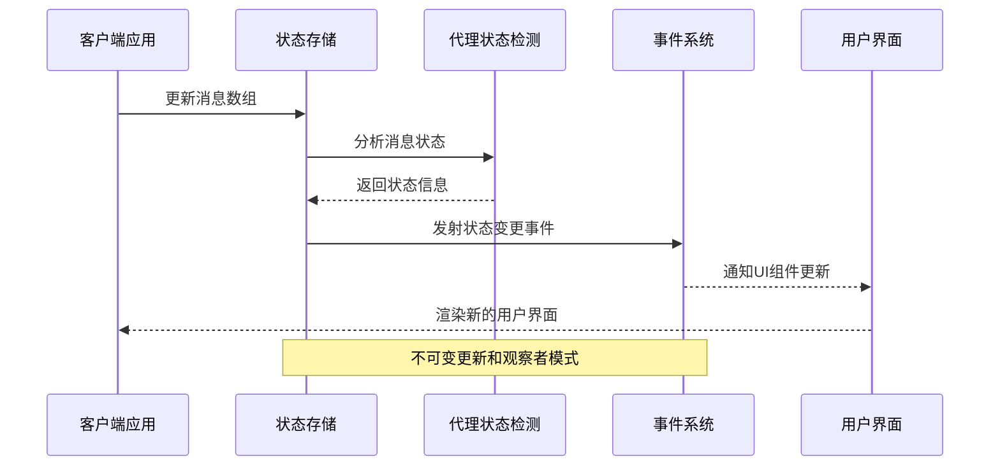
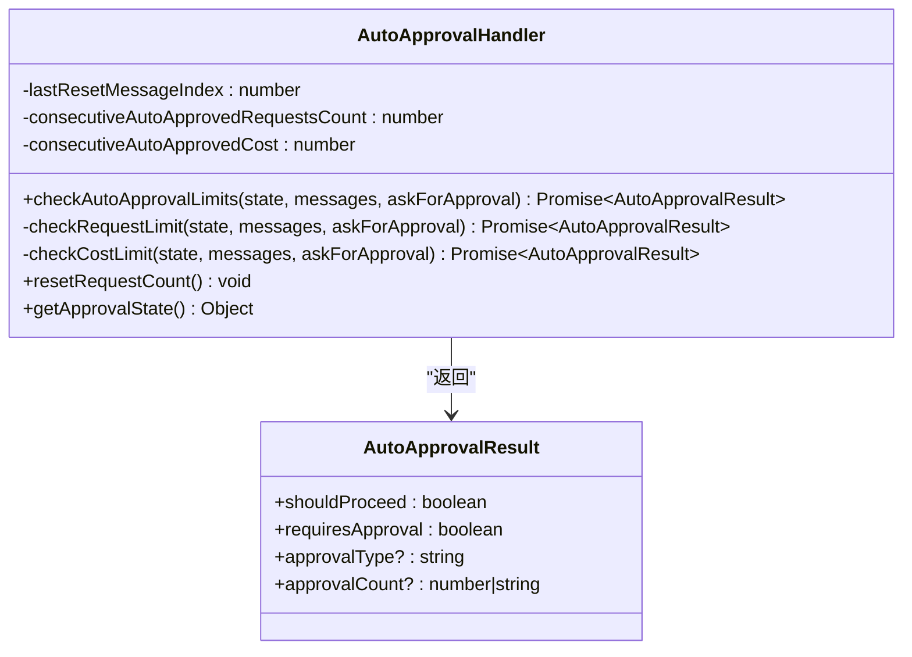
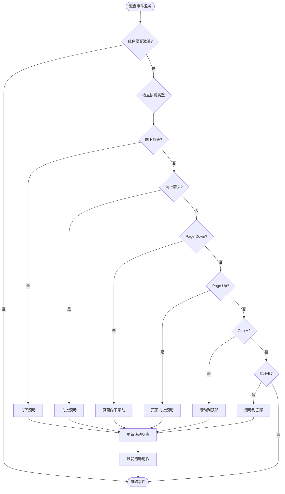
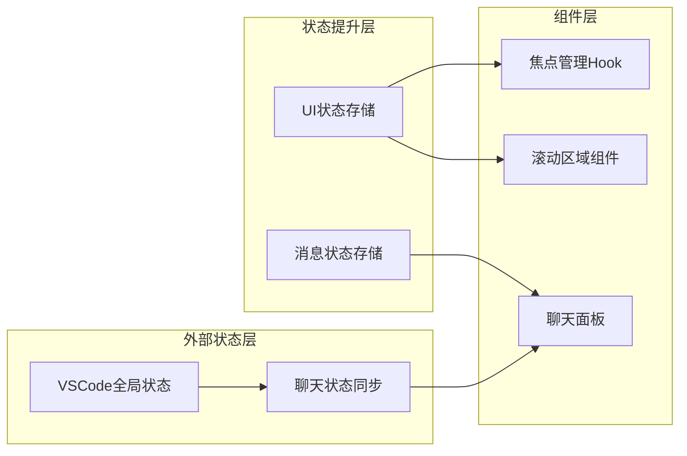
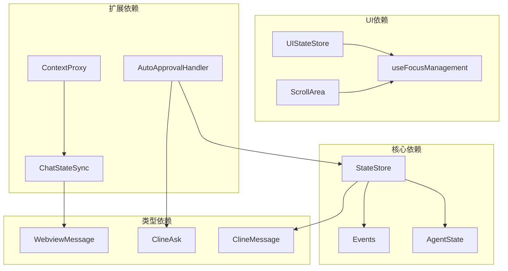

# 状态管理

<cite>
**本文档引用的文件**
- [AutoApprovalHandler.ts](file://src/core/auto-approval/AutoApprovalHandler.ts)
- [useFocusManagement.ts](file://apps/cli/src/ui/hooks/useFocusManagement.ts)
- [ScrollArea.tsx](file://apps/cli/src/ui/components/ScrollArea.tsx)
- [state-store.ts](file://apps/cli/src/agent/state-store.ts)
- [ChatStateSync.ts](file://src/chat/ChatStateSync.ts)
- [uiStateStore.ts](file://apps/cli/src/ui/stores/uiStateStore.ts)
- [ContextProxy.ts](file://src/core/config/ContextProxy.ts)
- [events.ts](file://apps/cli/src/agent/events.ts)
- [agent-state.ts](file://apps/cli/src/agent/agent-state.ts)
- [WebviewMessage.ts](file://src/shared/WebviewMessage.ts)
</cite>

## 目录
1. [简介](#简介)
2. [项目结构](#项目结构)
3. [核心组件](#核心组件)
4. [架构概览](#架构概览)
5. [详细组件分析](#详细组件分析)
6. [依赖关系分析](#依赖关系分析)
7. [性能考虑](#性能考虑)
8. [故障排除指南](#故障排除指南)
9. [结论](#结论)

## 简介

本文件详细阐述了Njust-AI项目中的状态管理系统，重点涵盖自定义Hook设计模式、状态提升策略、组件间状态共享机制。系统实现了自动审批状态管理、键盘事件处理、滚动生命周期等关键功能，并提供了状态更新的最佳实践、性能优化技巧和内存泄漏防护方案。

## 项目结构

状态管理系统主要分布在以下几个模块：

**图表来源**
- [state-store.ts:106-385](file://apps/cli/src/agent/state-store.ts#L106-L385)
- [agent-state.ts:305-438](file://apps/cli/src/agent/agent-state.ts#L305-L438)
- [events.ts:151-215](file://apps/cli/src/agent/events.ts#L151-L215)

## 核心组件

### 状态存储系统

状态存储系统采用不可变更新和观察者模式设计，确保状态变更的可追踪性和组件间的响应性。

**Section sources**
- [state-store.ts:106-385](file://apps/cli/src/agent/state-store.ts#L106-L385)

### 代理状态检测

代理状态检测系统基于消息流分析，提供精确的状态识别和状态机转换。

**Section sources**
- [agent-state.ts:305-438](file://apps/cli/src/agent/agent-state.ts#L305-L438)

### 事件系统

事件系统提供类型安全的事件发射器，支持多种状态变更事件的订阅和通知。

**Section sources**
- [events.ts:151-215](file://apps/cli/src/agent/events.ts#L151-L215)

## 架构概览

**图表来源**
- [state-store.ts:211-224](file://apps/cli/src/agent/state-store.ts#L211-L224)
- [events.ts:192-194](file://apps/cli/src/agent/events.ts#L192-L194)

## 详细组件分析

### 自动审批状态管理

自动审批处理器实现了智能的请求限制和成本控制机制，确保AI交互的安全性和可控性。

**图表来源**
- [AutoApprovalHandler.ts:13-155](file://src/core/auto-approval/AutoApprovalHandler.ts#L13-L155)

**Section sources**
- [AutoApprovalHandler.ts:21-135](file://src/core/auto-approval/AutoApprovalHandler.ts#L21-L135)

### 键盘事件处理系统

滚动区域组件实现了完整的键盘导航功能，支持方向键、Page Up/Down、Home/End等快捷键操作。

**图表来源**
- [ScrollArea.tsx:287-318](file://apps/cli/src/ui/components/ScrollArea.tsx#L287-L318)

**Section sources**
- [ScrollArea.tsx:286-318](file://apps/cli/src/ui/components/ScrollArea.tsx#L286-L318)

### 滚动生命周期管理

滚动区域组件实现了复杂的生命周期管理，包括高度测量、内容变化检测和自动滚动控制。

**Section sources**
- [ScrollArea.tsx:187-284](file://apps/cli/src/ui/components/ScrollArea.tsx#L187-L284)

### UI状态提升策略

UI状态提升通过Zustand实现，将界面特定的状态与业务逻辑状态分离。

**Section sources**
- [uiStateStore.ts:75-87](file://apps/cli/src/ui/stores/uiStateStore.ts#L75-L87)

### 组件间状态共享机制

**图表来源**
- [uiStateStore.ts:1-88](file://apps/cli/src/ui/stores/uiStateStore.ts#L1-L88)
- [ChatStateSync.ts:17-54](file://src/chat/ChatStateSync.ts#L17-L54)

**Section sources**
- [ChatStateSync.ts:30-108](file://src/chat/ChatStateSync.ts#L30-L108)

## 依赖关系分析

**图表来源**
- [state-store.ts:15-18](file://apps/cli/src/agent/state-store.ts#L15-L18)
- [WebviewMessage.ts:1-4](file://src/shared/WebviewMessage.ts#L1-L4)

**Section sources**
- [ContextProxy.ts:40-104](file://src/core/config/ContextProxy.ts#L40-L104)

## 性能考虑

### 状态更新优化

1. **不可变更新**: 所有状态更新都创建新对象，避免直接修改现有状态
2. **批量更新**: 使用useReducer减少不必要的重渲染
3. **记忆化**: useMemo和useCallback优化昂贵的计算和回调

### 内存管理最佳实践

1. **事件监听清理**: 确保所有事件监听器在组件卸载时正确清理
2. **定时器管理**: 及时清理setInterval和setTimeout
3. **引用清理**: 使用useRef管理DOM引用，在适当时候清理

### 性能监控建议

1. **状态变更追踪**: 使用history功能监控状态变更频率
2. **渲染性能分析**: 监控组件渲染次数和渲染时间
3. **内存使用监控**: 定期检查内存使用情况，防止泄漏

## 故障排除指南

### 常见问题诊断

1. **状态不同步问题**
   - 检查事件订阅是否正确设置
   - 验证状态更新的不可变性
   - 确认观察者模式的正确实现

2. **键盘事件无响应**
   - 验证isActive属性状态
   - 检查事件优先级和冲突
   - 确认组件焦点状态

3. **内存泄漏排查**
   - 检查事件监听器清理
   - 验证定时器清理
   - 确认引用循环检测

**Section sources**
- [events.ts:334-343](file://apps/cli/src/agent/events.ts#L334-L343)
- [ScrollArea.tsx:224-274](file://apps/cli/src/ui/components/ScrollArea.tsx#L224-L274)

### 调试方法

1. **状态历史记录**: 启用状态历史功能进行回溯分析
2. **事件日志**: 记录所有状态变更事件
3. **性能分析**: 使用React DevTools分析渲染性能
4. **内存分析**: 定期检查内存使用情况

## 结论

Njust-AI的状态管理系统通过精心设计的架构实现了高效的状态管理、组件间通信和用户体验优化。系统采用不可变状态更新、观察者模式和类型安全的设计原则，确保了系统的稳定性、可维护性和可扩展性。通过合理的性能优化和内存管理策略，系统能够在复杂的应用场景中保持良好的性能表现。