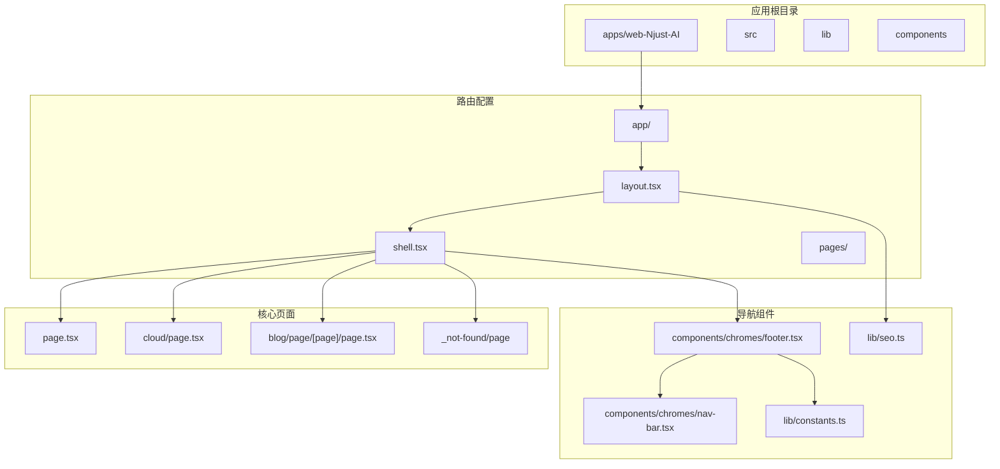
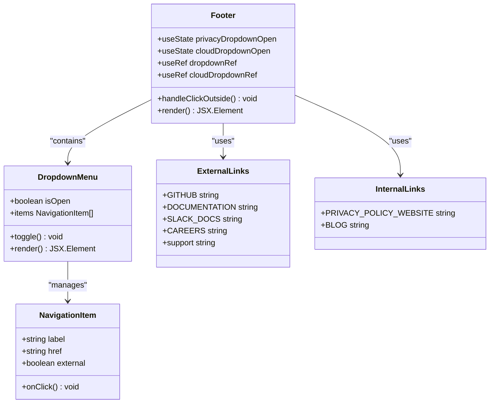
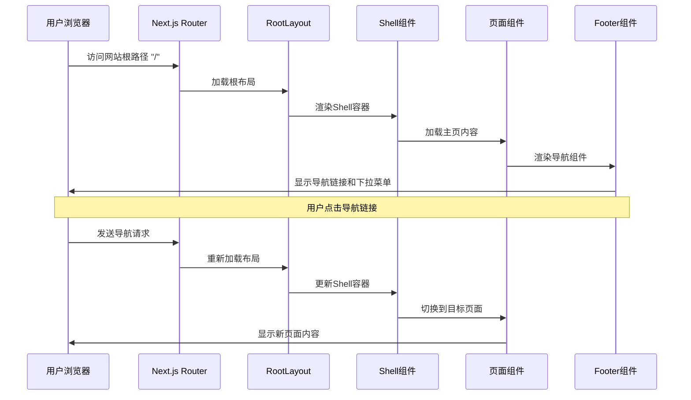
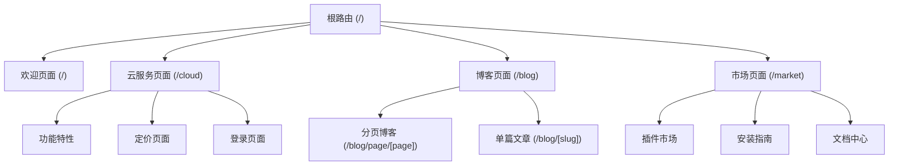
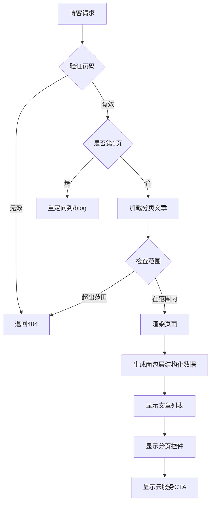
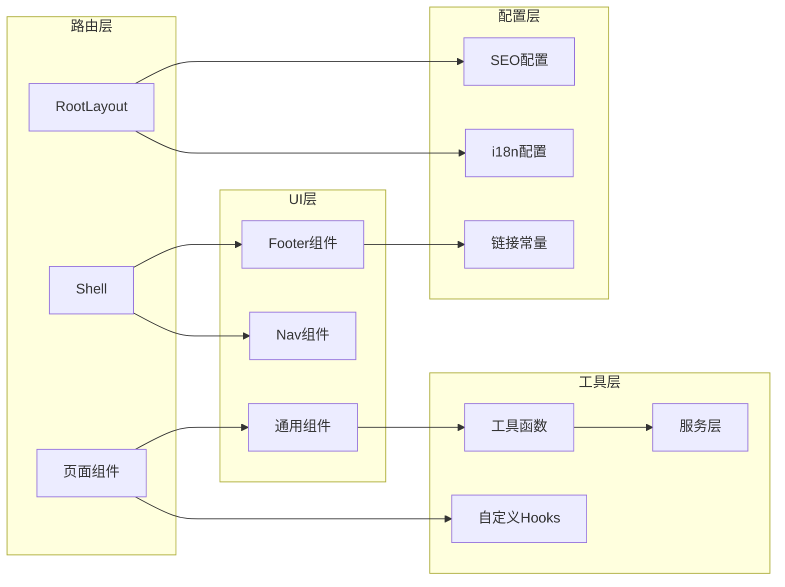
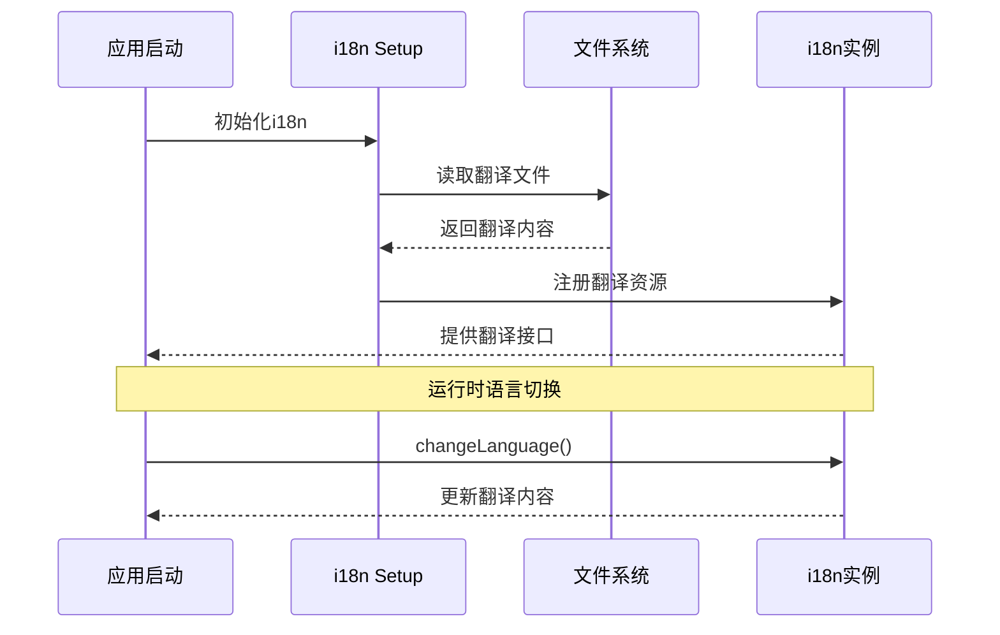

# 路由与导航

<cite>
**本文档引用的文件**
- [apps/web-Njust-AI/src/app/page.tsx](file://apps/web-Njust-AI/src/app/page.tsx)
- [apps/web-Njust-AI/src/app/layout.tsx](file://apps/web-Njust-AI/src/app/layout.tsx)
- [apps/web-Njust-AI/src/app/cloud/page.tsx](file://apps/web-Njust-AI/src/app/cloud/page.tsx)
- [apps/web-Njust-AI/src/app/shell.tsx](file://apps/web-Njust-AI/src/app/shell.tsx)
- [apps/web-Njust-AI/src/components/chromes/footer.tsx](file://apps/web-Njust-AI/src/components/chromes/footer.tsx)
- [apps/web-Njust-AI/src/lib/constants.ts](file://apps/web-Njust-AI/src/lib/constants.ts)
- [apps/web-Njust-AI/src/lib/seo.ts](file://apps/web-Njust-AI/src/lib/seo.ts)
- [apps/web-Njust-AI/src/app/blog/page/[page]/page.tsx](file://apps/web-Njust-AI/src/app/blog/page/[page]/page.tsx)
- [src/i18n/index.ts](file://src/i18n/index.ts)
- [src/i18n/setup.ts](file://src/i18n/setup.ts)
- [src/shared/language.ts](file://src/shared/language.ts)
</cite>

## 目录
1. [简介](#简介)
2. [项目结构](#项目结构)
3. [核心组件](#核心组件)
4. [架构概览](#架构概览)
5. [详细组件分析](#详细组件分析)
6. [依赖关系分析](#依赖关系分析)
7. [性能考虑](#性能考虑)
8. [故障排除指南](#故障排除指南)
9. [结论](#结论)

## 简介

本文件为NJU-Njust-AI项目的路由与导航系统提供全面的技术文档。该系统基于Next.js App Router架构，实现了完整的页面路由设计、导航模式和页面跳转机制。文档详细说明了欢迎页面、市场页面、云服务页面等核心路由的实现方式，涵盖了路由守卫、权限控制和导航状态管理的最佳实践。

系统采用现代化的React组件化架构，结合i18n国际化支持，提供了灵活的多语言导航体验。通过TypeScript类型安全保证和严格的代码组织结构，确保了路由系统的可维护性和扩展性。

## 项目结构

NJU-Njust-AI项目采用模块化的文件组织结构，路由系统主要分布在以下关键目录中：

**图表来源**
- [apps/web-Njust-AI/src/app/layout.tsx:1-112](file://apps/web-Njust-AI/src/app/layout.tsx#L1-L112)
- [apps/web-Njust-AI/src/app/shell.tsx:1-19](file://apps/web-Njust-AI/src/app/shell.tsx#L1-L19)

**章节来源**
- [apps/web-Njust-AI/src/app/layout.tsx:1-112](file://apps/web-Njust-AI/src/app/layout.tsx#L1-L112)
- [apps/web-Njust-AI/src/app/shell.tsx:1-19](file://apps/web-Njust-AI/src/app/shell.tsx#L1-L19)

## 核心组件

### 应用布局系统

应用采用分层布局架构，通过RootLayout、Shell和各个页面组件的组合实现完整的导航体验。

**RootLayout组件**负责全局元数据管理和主题提供器包装，确保所有页面共享一致的视觉风格和SEO配置。

**Shell组件**作为页面容器，集成了导航栏、主要内容区域和页脚，同时处理统计数据的异步加载。

**章节来源**
- [apps/web-Njust-AI/src/app/layout.tsx:89-112](file://apps/web-Njust-AI/src/app/layout.tsx#L89-L112)
- [apps/web-Njust-AI/src/app/shell.tsx:8-18](file://apps/web-Njust-AI/src/app/shell.tsx#L8-L18)

### 导航组件架构

导航系统通过Footer组件实现多层次的导航结构，包括产品导航、资源导航和公司信息等模块。

**图表来源**
- [apps/web-Njust-AI/src/components/chromes/footer.tsx:13-399](file://apps/web-Njust-AI/src/components/chromes/footer.tsx#L13-L399)
- [apps/web-Njust-AI/src/lib/constants.ts:1-40](file://apps/web-Njust-AI/src/lib/constants.ts#L1-L40)

**章节来源**
- [apps/web-Njust-AI/src/components/chromes/footer.tsx:13-399](file://apps/web-Njust-AI/src/components/chromes/footer.tsx#L13-L399)
- [apps/web-Njust-AI/src/lib/constants.ts:1-40](file://apps/web-Njust-AI/src/lib/constants.ts#L1-L40)

## 架构概览

NJU-Njust-AI的路由系统采用现代的App Router架构，实现了静态生成、动态路由和SEO优化的完美结合。

**图表来源**
- [apps/web-Njust-AI/src/app/layout.tsx:89-112](file://apps/web-Njust-AI/src/app/layout.tsx#L89-L112)
- [apps/web-Njust-AI/src/app/shell.tsx:8-18](file://apps/web-Njust-AI/src/app/shell.tsx#L8-L18)

### 路由层次结构

系统采用清晰的路由层次结构，每个层级都有明确的职责分工：

**图表来源**
- [apps/web-Njust-AI/src/app/page.tsx:18-83](file://apps/web-Njust-AI/src/app/page.tsx#L18-L83)
- [apps/web-Njust-AI/src/app/cloud/page.tsx:142-297](file://apps/web-Njust-AI/src/app/cloud/page.tsx#L142-L297)

**章节来源**
- [apps/web-Njust-AI/src/app/page.tsx:18-83](file://apps/web-Njust-AI/src/app/page.tsx#L18-L83)
- [apps/web-Njust-AI/src/app/cloud/page.tsx:142-297](file://apps/web-Njust-AI/src/app/cloud/page.tsx#L142-L297)

## 详细组件分析

### 欢迎页面（Home Page）

欢迎页面作为应用的主要入口，采用了响应式设计和渐进式加载策略。

**页面特性**：
- 使用revalidate缓存策略，每小时自动刷新
- 集成结构化数据以优化SEO
- 包含多个功能区块：公司标志、FAQ、用户评价、CTA等
- 提供外部链接到VS Code扩展和云服务

**章节来源**
- [apps/web-Njust-AI/src/app/page.tsx:15-83](file://apps/web-Njust-AI/src/app/page.tsx#L15-L83)

### 云服务页面（Cloud Page）

云服务页面专门介绍和推广云服务功能，具有完整的功能展示和转化引导。

**核心功能**：
- 英雄区域展示云服务优势
- "如何工作"步骤说明
- 功能特性网格展示
- 价格和试用按钮
- 截图展示实际界面

**SEO优化**：
- 特定的元数据配置
- Open Graph图像生成
- 关键词优化
- Canonical URL设置

**章节来源**
- [apps/web-Njust-AI/src/app/cloud/page.tsx:16-62](file://apps/web-Njust-AI/src/app/cloud/page.tsx#L16-L62)
- [apps/web-Njust-AI/src/app/cloud/page.tsx:142-297](file://apps/web-Njust-AI/src/app/cloud/page.tsx#L142-L297)

### 博客分页系统

博客分页系统实现了完整的文章列表分页功能，支持SEO友好的URL结构。

**图表来源**
- [apps/web-Njust-AI/src/app/blog/page/[page]/page.tsx](file://apps/web-Njust-AI/src/app/blog/page/[page]/page.tsx#L91-L175)

**章节来源**
- [apps/web-Njust-AI/src/app/blog/page/[page]/page.tsx](file://apps/web-Njust-AI/src/app/blog/page/[page]/page.tsx#L91-L175)

### 导航状态管理

导航系统通过React状态管理实现复杂的交互效果，特别是下拉菜单的状态控制。

**状态管理机制**：
- 使用useState管理下拉菜单的打开/关闭状态
- 通过useRef获取DOM元素引用
- 实现点击外部区域自动关闭功能
- 支持键盘导航和无障碍访问

**章节来源**
- [apps/web-Njust-AI/src/components/chromes/footer.tsx:13-399](file://apps/web-Njust-AI/src/components/chromes/footer.tsx#L13-L399)

## 依赖关系分析

路由系统的核心依赖关系体现了清晰的关注点分离：

**图表来源**
- [apps/web-Njust-AI/src/app/layout.tsx:1-112](file://apps/web-Njust-AI/src/app/layout.tsx#L1-L112)
- [apps/web-Njust-AI/src/lib/constants.ts:1-40](file://apps/web-Njust-AI/src/lib/constants.ts#L1-L40)

### 国际化路由支持

系统实现了完整的国际化支持，通过以下组件协同工作：

**i18n配置架构**：
- setup.ts负责翻译文件的动态加载和初始化
- index.ts提供统一的翻译接口
- language.ts处理语言格式化和回退逻辑

**国际化流程**：

**图表来源**
- [src/i18n/setup.ts:1-82](file://src/i18n/setup.ts#L1-L82)
- [src/i18n/index.ts:1-41](file://src/i18n/index.ts#L1-L41)

**章节来源**
- [src/i18n/setup.ts:1-82](file://src/i18n/setup.ts#L1-L82)
- [src/i18n/index.ts:1-41](file://src/i18n/index.ts#L1-L41)
- [src/shared/language.ts:21-28](file://src/shared/language.ts#L21-L28)

## 性能考虑

### 缓存策略

系统采用多层缓存策略确保最佳性能：

**页面级缓存**：
- 使用revalidate参数控制缓存刷新频率
- 支持增量静态生成（ISR）
- 动态内容使用服务器端渲染（SSR）

**组件级优化**：
- 图片懒加载和预加载策略
- 组件代码分割和按需加载
- 防抖和节流优化高频操作

### SEO优化

通过结构化数据和元标签优化搜索引擎可见性：

**SEO配置**：
- Open Graph元标签支持社交媒体分享
- 结构化数据提升搜索结果丰富性
- Canonical URL避免重复内容
- 关键词优化和描述定制

**章节来源**
- [apps/web-Njust-AI/src/app/page.tsx:15-16](file://apps/web-Njust-AI/src/app/page.tsx#L15-L16)
- [apps/web-Njust-AI/src/app/cloud/page.tsx:33-62](file://apps/web-Njust-AI/src/app/cloud/page.tsx#L33-L62)
- [apps/web-Njust-AI/src/lib/seo.ts:1-31](file://apps/web-Njust-AI/src/lib/seo.ts#L1-L31)

## 故障排除指南

### 常见问题诊断

**路由不生效**：
1. 检查文件命名是否符合Next.js约定
2. 验证路径参数是否正确配置
3. 确认组件导出格式

**导航失效**：
1. 检查Link组件的href属性
2. 验证外部链接的有效性
3. 确认下拉菜单的事件绑定

**国际化问题**：
1. 验证翻译文件的完整性
2. 检查语言代码格式
3. 确认回退语言的配置

### 性能监控

**监控指标**：
- 页面加载时间
- 首屏渲染时间
- 组件渲染性能
- 缓存命中率

**优化建议**：
- 实施适当的缓存策略
- 优化图片和资源加载
- 减少不必要的重渲染
- 使用React Profiler分析性能瓶颈

**章节来源**
- [apps/web-Njust-AI/src/components/chromes/footer.tsx:21-37](file://apps/web-Njust-AI/src/components/chromes/footer.tsx#L21-L37)

## 结论

NJU-Njust-AI的路由与导航系统展现了现代Web应用的最佳实践。通过清晰的架构设计、完善的国际化支持和优秀的性能优化，系统为用户提供了流畅、直观的导航体验。

系统的核心优势包括：

1. **模块化设计**：清晰的组件分离和职责划分
2. **国际化支持**：完整的多语言解决方案
3. **SEO优化**：全面的搜索引擎友好性
4. **性能优化**：多层缓存和加载优化策略
5. **可扩展性**：灵活的架构便于功能扩展

未来可以考虑的改进方向包括更细粒度的权限控制、更丰富的导航状态管理以及更完善的错误处理机制。这些改进将进一步提升系统的用户体验和维护性。