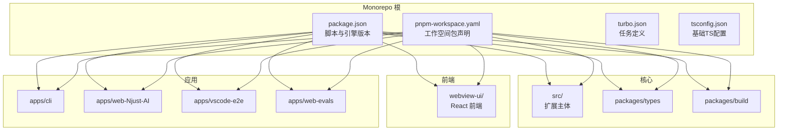
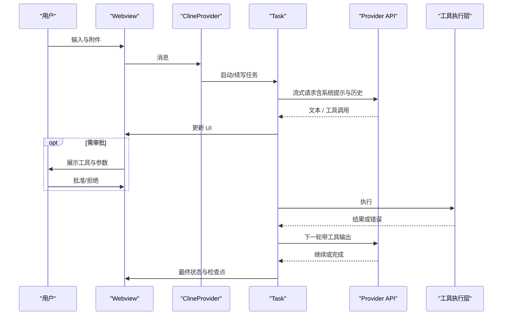
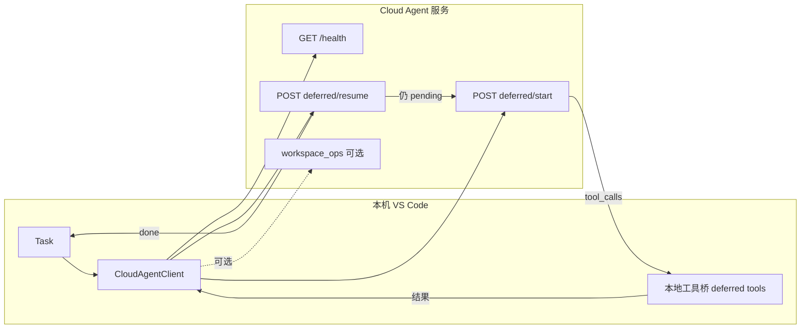
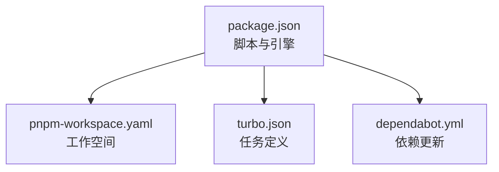

# 开发者指南

<cite>
**本文引用的文件**
- [CONTRIBUTING.md](file://CONTRIBUTING.md)
- [CODE_OF_CONDUCT.md](file://CODE_OF_CONDUCT.md)
- [README.md](file://README.md)
- [package.json](file://package.json)
- [pnpm-workspace.yaml](file://pnpm-workspace.yaml)
- [.github/pull_request_template.md](file://.github/pull_request_template.md)
- [.github/dependabot.yml](file://.github/dependabot.yml)
- [turbo.json](file://turbo.json)
- [tsconfig.json](file://tsconfig.json)
- [src/eslint.config.mjs](file://src/eslint.config.mjs)
- [webview-ui/eslint.config.mjs](file://webview-ui/eslint.config.mjs)
- [apps/cli/eslint.config.mjs](file://apps/cli/eslint.config.mjs)
- [apps/web-Njust-AI/eslint.config.mjs](file://apps/web-Njust-AI/eslint.config.mjs)
- [packages/build/eslint.config.mjs](file://packages/build/eslint.config.mjs)
- [.vscode/launch.json](file://.vscode/launch.json)
- [.vscode/settings.json](file://.vscode/settings.json)
</cite>

## 目录
1. [简介](#简介)
2. [项目结构](#项目结构)
3. [核心组件](#核心组件)
4. [架构总览](#架构总览)
5. [详细组件分析](#详细组件分析)
6. [依赖分析](#依赖分析)
7. [性能考虑](#性能考虑)
8. [故障排查指南](#故障排查指南)
9. [结论](#结论)
10. [附录](#附录)

## 简介
本指南面向项目开发者，提供从环境搭建、编码规范、提交流程、代码审查到发布的全流程说明。项目采用 Issue-First 的协作方式，所有 Pull Request 必须关联已分配的 GitHub Issue；同时遵循贡献守则与行为准则，确保开放、包容、高效的协作。

- Issue-First 协作：所有 PR 必须链接到已分配的 Issue，未链接的 PR 可能被关闭。
- 贡献守则与行为准则：所有贡献者需遵守行为准则，尊重多元背景，营造安全、友善的社区氛围。
- 开发与发布：提供本地开发、调试、构建 VSIX 的标准流程，以及持续集成与依赖更新策略。

章节来源
- [CONTRIBUTING.md:11](file://CONTRIBUTING.md#L11)
- [CONTRIBUTING.md:22-24](file://CONTRIBUTING.md#L22-L24)
- [CONTRIBUTING.md:122-126](file://CONTRIBUTING.md#L122-L126)

## 项目结构
项目采用 monorepo 结构，通过 pnpm workspace 管理多包，核心目录与职责如下：
- src：VS Code 扩展主体（核心逻辑、服务、API、国际化等）
- webview-ui：React 侧栏/WebView 前端
- packages：共享类型与工具包
- apps：CLI、VS Code E2E、Next.js 评估与官网等应用
- 根目录脚本与配置：Turbo、ESLint、TypeScript、VS Code 调试与任务



图表来源
- [pnpm-workspace.yaml:1-6](file://pnpm-workspace.yaml#L1-L6)
- [package.json:1-68](file://package.json#L1-L68)

章节来源
- [README.md:346-364](file://README.md#L346-L364)
- [pnpm-workspace.yaml:1-6](file://pnpm-workspace.yaml#L1-L6)
- [package.json:1-68](file://package.json#L1-L68)

## 核心组件
- 任务与消息管线：Task 负责一次用户请求的完整生命周期；ClineProvider 作为 Webview 宿主与全局状态粘合层；presentAssistantMessage 将模型输出解析为 UI 块。
- 模式与提示词：内置多种模式（如 Cloud Agent、Cangjie Dev、Orchestrator 等），支持项目级 .roomodes 覆盖。
- AI 提供商接入：统一抽象在 api/providers 下，覆盖多家模型厂商与 OpenAI 兼容接口。
- 原生工具与自动批准：内置工具集合（读写文件、搜索、执行命令等），结合 auto-approval 减少重复审批。
- MCP 与 Cloud Agent：McpHub 管理 MCP 服务器，Cloud Agent 客户端支持健康检查与延期协议循环。
- 代码索引与语义搜索：基于 Tree-sitter 的解析与嵌入模型，构建向量库并支持检索。
- 技能系统：从工作区扫描 SKILL.md，按来源与模式解析覆盖顺序，运行时通过 skill 工具注入长上下文。
- 仓颉语言工作台：LSP、cjpm 任务、调试、格式化/诊断、测试 CodeLens 等一体化工具链。
- 编辑器与 Diff 集成：上下文菜单、Diff 视图、Code Actions 与灯泡菜单。
- 终端子系统：TerminalRegistry 统一管理 Agent 终端，支持上下文菜单与 Shell 适配。
- 检查点：ShadowCheckpointService 在关键步骤创建影子副本，支持回滚。
- 联网搜索：WebSearchProvider 可选启用，支持网络搜索工具。
- VS Code 内置 AI 集成：Chat 参与者与 LM 工具注册，状态同步保障一致性。
- 配置与国际化：ContextProxy 作为单一可信来源，支持迁移与多语言回退。

章节来源
- [README.md:189-286](file://README.md#L189-L286)

## 架构总览
下图展示扩展的运行时分层与交互关系：Webview 与扩展宿主分离，宿主内 ClineProvider/Task 串联 UI、模型与服务；服务层涵盖 MCP、代码索引、Cloud Agent、Skills、仓颉 LSP 等。

```mermaid
graph TB
subgraph "呈现层"
WV["webview-uiReact"]
VSC["VS Code：编辑器·终端·内置 Chat"]
end
subgraph "扩展宿主"
CP["ClineProvider"]
TH["webviewMessageHandler"]
TK["Task"]
PR["api/providers"]
end
subgraph "服务层"
MCP["McpHub · RooToolsMcpServer"]
IDX["code-index · tree-sitter"]
CA["cloud-agent"]
SK["SkillsManager"]
CJ["cangjie-lsp · cjpm · debug"]
OTH["checkpoints · run-code · web-search"]
end
WV < --> |"postMessage"| CP
CP --> TH
TH --> TK
TK --> PR
TK --> MCP
TK --> IDX
TK --> CA
TK --> SK
TK --> CJ
TK --> OTH
VSC --> |"LM Tools / Participant"| TK
```

图表来源
- [README.md:35-68](file://README.md#L35-L68)

## 详细组件分析

### 任务与消息管线
- Task 生命周期：从启动/续写到工具执行、检查点写入、Cloud Agent 循环。
- ClineProvider：注册命令、转发消息、维护当前任务与历史。
- presentAssistantMessage：解析模型输出为文本、推理块、工具调用块。
- webviewMessageHandler：将 UI 操作映射为状态更新（如切换模式、同步配置）。



图表来源
- [README.md:74-97](file://README.md#L74-L97)

章节来源
- [README.md:196-202](file://README.md#L196-L202)

### 模式与提示词
- 内置模式：Cloud Agent、Architect、Code、Ask、Debug、Cangjie Dev、Orchestrator 等。
- 自定义模式：项目根目录 .roomodes YAML 覆盖/追加，项目优先。
- 工具组：每种模式绑定工具子集，控制 Agent 能力边界。
- 提示词拼装：按模式、工具、用户规则、工作区规则组合系统提示。

章节来源
- [README.md:204-210](file://README.md#L204-L210)

### AI 提供商接入
- 统一抽象：providers 下按厂商实现流式补全、工具调用、错误与超时处理。
- 常见接入：OpenAI 兼容、Anthropic、Gemini、OpenRouter、Ollama、LM Studio、DeepSeek、Qwen、Bedrock、VS Code Language Model API 等。
- 索引专用嵌入：代码索引模块可使用独立嵌入模型与端点。

章节来源
- [README.md:211-216](file://README.md#L211-L216)

### 原生工具与自动批准
- 内置工具：读文件、写文件/打补丁、列目录、工作区搜索、执行终端命令、代码库语义搜索、web_search、skill、子任务/模式切换、待办列表更新等。
- 自动批准：auto-approval 与设置中的始终允许列表配合，减少重复点击。
- 终端执行安全：allowedCommands、deniedCommands、超时与白名单等限制。

章节来源
- [README.md:217-222](file://README.md#L217-L222)

### MCP 与 Cloud Agent
- McpHub：启动/停止 MCP 进程、管理多服务器配置、将 MCP 工具暴露给当前任务。
- RooToolsMcpServer：扩展内嵌 MCP 服务，把部分 Njust-AI 能力以 MCP 工具形式提供。
- Cloud Agent：客户端支持 GET /health、POST /v1/run，以及 deferred/start 与 deferred/resume 循环；可选 workspace_ops 与编译反馈。



图表来源
- [README.md:99-125](file://README.md#L99-L125)

章节来源
- [README.md:223-236](file://README.md#L223-L236)

### 代码索引与语义搜索
- 管理器：按工作区文件夹维护索引生命周期。
- 流水线：扫描文件 → Tree-sitter 解析分块 → 嵌入模型 → 向量存储（如 Qdrant）。
- 搜索服务：自然语言查询命中向量库，供 Agent 工具与 VS Code 注册的 NJUST_AIbaseSearch 使用。
- 缓存：减少重复嵌入与重建成本。

章节来源
- [README.md:237-243](file://README.md#L237-L243)

### Skills 子系统
- SkillsManager：扫描 SKILL.md，解析 frontmatter（名称、描述、modeSlugs 等）。
- 解析与去重：同名 Skill 按来源与模式解析覆盖顺序（项目优先于全局等）。
- 运行时：模型通过 skill 工具按名称加载正文，用于仓颉文档、算法模板等长上下文注入。

章节来源
- [README.md:244-249](file://README.md#L244-L249)

### 仓颉（Cangjie）语言工作台
- 语言包：注册 cangjie 语言、TextMate 语法、片段、cjpm taskDefinitions、cjc problemMatchers。
- LSP：CangjieLspClient 连接语言服务；状态栏显示连接与错误提示。
- 格式化与诊断：可选集成 cjfmt、cjlint。
- cjpm：CjpmTaskProvider 对接 Tasks: Run Task 与 cjpm 子命令。
- 调试：Cangjie Debug 调试类型与 CangjieDebugAdapterFactory 对接 cjdb。
- 与 AI 协同：Cangjie Dev 模式为仓颉专项提示词与工具范围，可配合 Skills 中的仓颉文档技能。

章节来源
- [README.md:250-260](file://README.md#L250-L260)

### 编辑器与 Diff 集成
- 上下文菜单：加入上下文、解释、改进；另有修复等命令。
- Diff 视图：对模型提议的修改使用专用 diff 方案，便于逐块接受或拒绝。
- Code Actions：与灯泡菜单集成，将快捷修复接入工作流。

章节来源
- [README.md:261-266](file://README.md#L261-L266)

### 终端子系统
- TerminalRegistry：统一管理 Agent 使用的终端实例，避免与用户终端冲突并跟踪输出。
- 终端上下文菜单：加入上下文、修复命令、解释命令。
- Shell 适配：消息管线中可配置 PowerShell/Zsh 等行为，减少输出解析误判。

章节来源
- [README.md:267-272](file://README.md#L267-L272)

### Checkpoints（检查点）
- ShadowCheckpointService：在任务关键步骤创建影子副本，支持回滚；含排除规则避免索引目录或构建产物被误拷贝。

章节来源
- [README.md:273-276](file://README.md#L273-L276)

### 联网搜索
- WebSearchProvider：在设置中开启 enableWebSearch 并配置 Tavily API Key 后，Agent 可调用网络搜索工具拉取最新网页摘要。

章节来源
- [README.md:277-279](file://README.md#L277-L279)

### VS Code 内置 AI 集成
- Chat 参与者：注册 @njust-ai 子命令（code / architect / ask / debug / plan 等），与内置聊天 UI 协作。
- Language Model 工具：NJUST_AI_readFile、NJUST_AI_editFile、NJUST_AI_executeCommand、NJUST_AI_searchFiles、NJUST_AI_listFiles、NJUST_AIbaseSearch。
- 状态同步：ChatStateSync 在适当时机与扩展侧状态对齐。

章节来源
- [README.md:281-286](file://README.md#L281-L286)

### 配置、迁移与国际化
- ContextProxy：扩展内设置的单一可信来源，与 VS Code 配置协同。
- 迁移与导入：migrateSettings、importSettings 命令与自动导入逻辑。
- 自定义存储路径：可将任务/状态存放到用户指定目录。
- i18n：仅维护 English、简体中文、繁體中文；其他语言回退为英文。

章节来源
- [README.md:287-293](file://README.md#L287-L293)

## 依赖分析
- 包管理与工作空间：pnpm workspace 声明 src、webview-ui、apps/*、packages/*。
- 脚本与引擎：package.json 定义 lint、test、build、bundle、vsix 等脚本；Node.js 与 pnpm 版本要求明确。
- 任务编排：turbo.json 定义 lint、check-types、test、format、build 等任务及其依赖。
- 依赖更新：dependabot.yml 配置每周自动检查 npm 依赖更新。



图表来源
- [package.json:1-68](file://package.json#L1-L68)
- [pnpm-workspace.yaml:1-6](file://pnpm-workspace.yaml#L1-L6)
- [turbo.json:1-22](file://turbo.json#L1-L22)
- [.github/dependabot.yml:1-12](file://.github/dependabot.yml#L1-L12)

章节来源
- [package.json:1-68](file://package.json#L1-L68)
- [pnpm-workspace.yaml:1-6](file://pnpm-workspace.yaml#L1-L6)
- [turbo.json:1-22](file://turbo.json#L1-L22)
- [.github/dependabot.yml:1-12](file://.github/dependabot.yml#L1-L12)

## 性能考虑
- 代码索引：合理配置嵌入模型与向量存储，减少重复嵌入与重建成本；在大型工作区中按需增量索引。
- 工具调用：优先使用本地工具，避免不必要的网络往返；对高开销工具（如 web_search、codebase_search）设置合理的缓存与超时。
- 终端执行：严格限制危险命令与长时间挂起，必要时使用超时白名单；避免与用户终端冲突。
- Cloud Agent：在 deferredProtocol 下，尽量减少 start/resume 循环次数，优化服务端推理与本地工具执行的配比。
- 前端渲染：在 webview-ui 中避免不必要的重渲染，使用稳定的数据结构与浅比较。

## 故障排查指南
- 调试配置：使用 VS Code launch.json 启动扩展开发窗口，预构建任务与源映射定位问题。
- 环境变量：开发期可在扩展安装目录放置 .env（由 dotenvx 加载），注入密钥而不写入用户设置。
- 网络代理：调试模式下可初始化 HTTP(S) 代理（initializeNetworkProxy），便于企业环境抓包。
- 依赖版本：确保 Node.js 与 pnpm 版本满足 package.json 引擎要求；使用 pnpm install 安装依赖。
- 任务与状态：通过 ContextProxy 与 VS Code 配置协同，避免双轨配置脱节；必要时使用 migrateSettings 导入旧键名。

章节来源
- [README.md:302-301](file://README.md#L302-L301)
- [.vscode/launch.json:1-30](file://.vscode/launch.json#L1-L30)
- [.vscode/settings.json:1-33](file://.vscode/settings.json#L1-L33)

## 结论
本指南总结了项目的开发规范、提交流程、代码审查与发布策略，明确了 monorepo 结构下的职责划分与协作方式。建议新贡献者先通读贡献指南与行为准则，再按 Issue-First 流程认领任务，遵循编码规范与测试要求，最终通过 PR 模板完成高质量的贡献。

## 附录

### 开发环境设置与 IDE 配置
- 环境要求：Node.js 与 pnpm 版本见 package.json 引擎字段。
- 安装依赖：使用 pnpm install 安装所有包。
- VS Code 调试：F5 启动扩展开发窗口，自动热重载；launch.json 已配置扩展主机调试参数。
- IDE 设置：.vscode/settings.json 提供文件排除、搜索排除、终端环境变量（如 CANGJIE_*）与编辑器偏好。

章节来源
- [README.md:304-327](file://README.md#L304-L327)
- [.vscode/launch.json:1-30](file://.vscode/launch.json#L1-L30)
- [.vscode/settings.json:1-33](file://.vscode/settings.json#L1-L33)

### 代码规范与质量工具
- ESLint：src 与 webview-ui 分别使用 @njust-ai/config-eslint 的基础与 React 配置；部分文件有特殊规则放宽。
- TypeScript：tsconfig.json 继承 @njust-ai/config-typescript/base.json，包含必要的类型与排除。
- 格式化与检查：通过 turbo 任务统一执行 lint、check-types、format、test、build。

章节来源
- [src/eslint.config.mjs:1-36](file://src/eslint.config.mjs#L1-L36)
- [webview-ui/eslint.config.mjs:1-47](file://webview-ui/eslint.config.mjs#L1-L47)
- [apps/cli/eslint.config.mjs:1-5](file://apps/cli/eslint.config.mjs#L1-L5)
- [apps/web-Njust-AI/eslint.config.mjs:1-5](file://apps/web-Njust-AI/eslint.config.mjs#L1-L5)
- [packages/build/eslint.config.mjs:1-5](file://packages/build/eslint.config.mjs#L1-L5)
- [tsconfig.json:1-10](file://tsconfig.json#L1-L10)
- [turbo.json:1-22](file://turbo.json#L1-L22)

### 提交流程与代码审查
- Issue-First：所有 PR 必须链接到已分配的 GitHub Issue；未链接的 PR 可能被关闭。
- PR 模板：.github/pull_request_template.md 规范描述、测试步骤、截图/视频、文档更新与附加说明。
- 审查节奏：日常快速检查与周度深入评审相结合，及时迭代反馈。

章节来源
- [CONTRIBUTING.md:63-72](file://CONTRIBUTING.md#L63-L72)
- [CONTRIBUTING.md:114-121](file://CONTRIBUTING.md#L114-L121)
- [CONTRIBUTING.md:128-132](file://CONTRIBUTING.md#L128-L132)
- [.github/pull_request_template.md:1-76](file://.github/pull_request_template.md#L1-L76)

### 发布流程
- 构建 VSIX：使用 pnpm vsix 生成 .vsix 文件；或使用 pnpm install:vsix 自动安装。
- 类型包发布：通过 npm:publish:types 脚本发布 @njust-ai/types 包。
- 评估与基准：使用 evals 脚本运行评估服务（需要 Docker Compose）。

章节来源
- [README.md:328-345](file://README.md#L328-L345)
- [package.json:27-28](file://package.json#L27-L28)

### 社区参与与治理
- 行为准则：所有成员需遵守 CODE_OF_CONDUCT.md，维护包容与安全的社区环境。
- 沟通渠道：主要通过 Discord 与 Hannes Rudolph 联系；经验丰富的贡献者可直接通过 GitHub Projects 参与。
- 依赖更新：dependabot 自动发起 weekly 更新，保持生态健康。

章节来源
- [CODE_OF_CONDUCT.md:11-52](file://CODE_OF_CONDUCT.md#L11-L52)
- [CONTRIBUTING.md:50-53](file://CONTRIBUTING.md#L50-L53)
- [.github/dependabot.yml:1-12](file://.github/dependabot.yml#L1-L12)