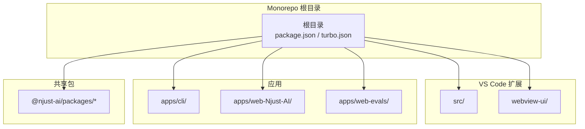
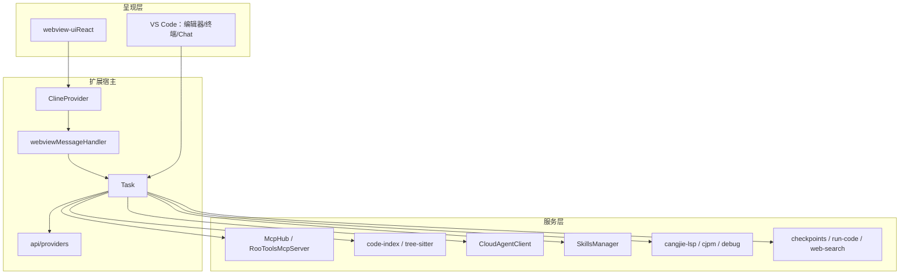
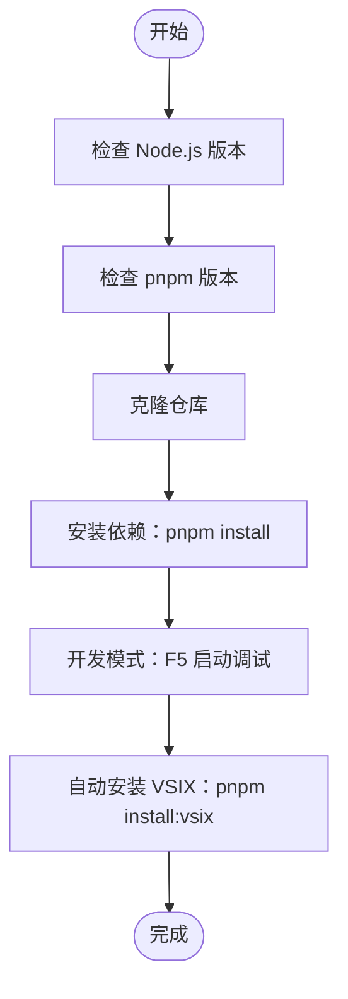
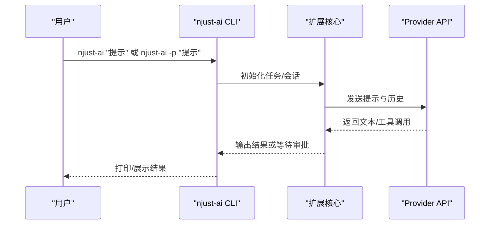
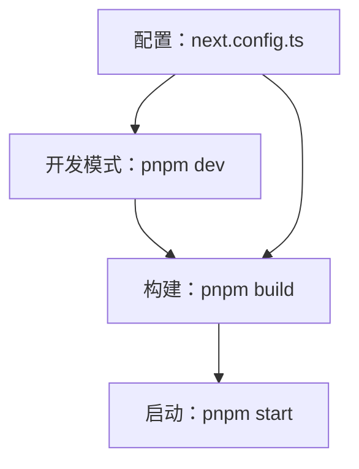
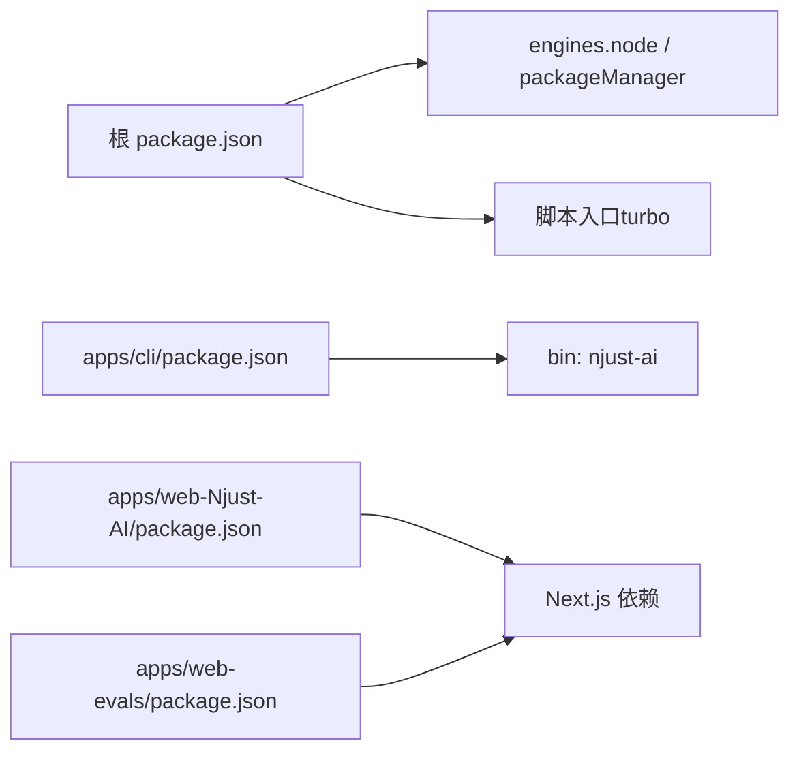

# 快速开始

<cite>
**本文引用的文件**
- [README.md](file://README.md)
- [package.json](file://package.json)
- [scripts/bootstrap.mjs](file://scripts/bootstrap.mjs)
- [.github/dependabot.yml](file://.github/dependabot.yml)
- [locales/zh-CN/README.md](file://locales/zh-CN/README.md)
- [apps/cli/package.json](file://apps/cli/package.json)
- [apps/cli/src/index.ts](file://apps/cli/src/index.ts)
- [apps/web-Njust-AI/package.json](file://apps/web-Njust-AI/package.json)
- [apps/web-Njust-AI/next.config.ts](file://apps/web-Njust-AI/next.config.ts)
- [apps/web-evals/package.json](file://apps/web-evals/package.json)
- [apps/web-evals/next.config.ts](file://apps/web-evals/next.config.ts)
- [AGENTS.md](file://AGENTS.md)
</cite>

## 目录
1. [简介](#简介)
2. [项目结构](#项目结构)
3. [核心组件](#核心组件)
4. [架构概览](#架构概览)
5. [详细组件分析](#详细组件分析)
6. [依赖分析](#依赖分析)
7. [性能考虑](#性能考虑)
8. [故障排除指南](#故障排除指南)
9. [结论](#结论)
10. [附录](#附录)

## 简介
本指南面向首次接触 Njust-AI（NJUST_AI）项目的开发者与使用者，帮助你在最短时间内完成环境准备、安装配置与基础体验。你将学会：
- 准确的环境要求（Node.js、pnpm 版本）
- 从零开始的安装步骤（克隆仓库、依赖安装、开发环境配置）
- VS Code 扩展安装与使用
- CLI 工具 njust-ai 的基本用法
- Web 应用的本地开发与部署要点
- 常见问题与故障排除

## 项目结构
Njust-AI 采用 monorepo 结构，核心由 VS Code 扩展主体、React Webview 前端、CLI 工具与多个 Next.js 应用组成。关键目录与职责如下：
- src/：VS Code 扩展主体（核心逻辑、服务层、UI 与交互）
- webview-ui/：React 侧栏/WebView 前端
- apps/cli/：命令行工具 njust-ai
- apps/web-Njust-AI/：官网/营销站点
- apps/web-evals/：评估与实验站点
- packages/：共享类型与工具包
- scripts/：安装引导与构建脚本

**图表来源**
- [README.md:346-364](file://README.md#L346-L364)
- [package.json:1-68](file://package.json#L1-L68)

**章节来源**
- [README.md:346-364](file://README.md#L346-L364)
- [package.json:1-68](file://package.json#L1-L68)

## 核心组件
- VS Code 扩展主体：负责任务生命周期、消息管线、模式与工具调度、Cloud Agent、MCP、代码索引、仓颉语言支持等。
- React Webview 前端：提供对话、模式切换、设置、历史与工具审批等 UI。
- CLI 工具 njust-ai：在命令行中启动交互式会话或非交互式输出，支持模式、模型、会话管理与认证。
- Web 应用：Next.js 站点，用于官网、评估与实验。

**章节来源**
- [README.md:185-298](file://README.md#L185-L298)
- [apps/cli/package.json:1-51](file://apps/cli/package.json#L1-L51)

## 架构概览
Njust-AI 的运行时分为三层：呈现层（Webview + VS Code UI）、扩展宿主（ClineProvider/Task）、服务层（MCP、索引、Cloud Agent、Skills、仓颉 LSP 等）。消息从 Webview 进入 Task，经 Provider API 推理，必要时执行工具，最终回到 UI。

**图表来源**
- [README.md:37-68](file://README.md#L37-L68)

**章节来源**
- [README.md:33-97](file://README.md#L33-L97)

## 详细组件分析

### 环境要求与安装
- 环境要求
  - Node.js：20.19.2
  - pnpm：10.8.1
- 安装步骤
  1) 克隆仓库并进入目录
  2) 安装依赖：pnpm install
  3) 启动开发模式：在 VS Code 中按 F5
- VSIX 安装
  - 自动安装：pnpm install:vsix
  - 手动安装：pnpm vsix 后使用 code --install-extension bin/*.vsix

**图表来源**
- [README.md:304-344](file://README.md#L304-L344)
- [package.json:4-6](file://package.json#L4-L6)

**章节来源**
- [README.md:304-344](file://README.md#L304-L344)
- [package.json:4-6](file://package.json#L4-L6)
- [scripts/bootstrap.mjs:42-78](file://scripts/bootstrap.mjs#L42-L78)

### VS Code 扩展安装与使用
- 开发模式：F5 启动新 VS Code 窗口，加载扩展并热重载
- 自动安装 VSIX：pnpm install:vsix，自动卸载旧版、构建并安装最新版
- 手动安装 VSIX：pnpm vsix 生成 .vsix，再用 code --install-extension 安装
- 常用设置与模式：在扩展设置中配置 Provider、模型、Cloud Agent、MCP、Skills 等

**章节来源**
- [locales/zh-CN/README.md:94-156](file://locales/zh-CN/README.md#L94-L156)
- [README.md:304-344](file://README.md#L304-L344)

### CLI 工具 njust-ai 使用
- 基本用法
  - njust-ai "你的提示"：启动交互式会话
  - njust-ai -p "你的提示"：非交互式打印输出
  - njust-ai -c：继续当前工作区最近的任务
  - njust-ai --session-id <id>：按会话 ID 恢复任务
- 列表命令
  - njust-ai list commands/modes/models/sessions：列出可用条目
- 认证
  - njust-ai auth login/logout/status：管理 Cloud 认证状态

**图表来源**
- [apps/cli/src/index.ts:17-168](file://apps/cli/src/index.ts#L17-L168)

**章节来源**
- [apps/cli/src/index.ts:17-168](file://apps/cli/src/index.ts#L17-L168)
- [apps/cli/package.json:8-10](file://apps/cli/package.json#L8-L10)

### Web 应用部署
- web-Njust-AI（官网站点）
  - 开发：pnpm dev
  - 构建：pnpm build
  - 启动：pnpm start
  - 配置：next.config.ts 设置重定向与 Turbopack 根
- web-evals（评估站点）
  - 开发：pnpm dev
  - 构建：pnpm build
  - 配置：next.config.ts 简化配置

**图表来源**
- [apps/web-Njust-AI/package.json:5-15](file://apps/web-Njust-AI/package.json#L5-L15)
- [apps/web-Njust-AI/next.config.ts:1-40](file://apps/web-Njust-AI/next.config.ts#L1-L40)
- [apps/web-evals/package.json:5-13](file://apps/web-evals/package.json#L5-L13)
- [apps/web-evals/next.config.ts:1-8](file://apps/web-evals/next.config.ts#L1-L8)

**章节来源**
- [apps/web-Njust-AI/package.json:5-15](file://apps/web-Njust-AI/package.json#L5-L15)
- [apps/web-Njust-AI/next.config.ts:1-40](file://apps/web-Njust-AI/next.config.ts#L1-L40)
- [apps/web-evals/package.json:5-13](file://apps/web-evals/package.json#L5-L13)
- [apps/web-evals/next.config.ts:1-8](file://apps/web-evals/next.config.ts#L1-L8)

## 依赖分析
- 根级 package.json 声明了 engines（Node.js 20.19.2）与 packageManager（pnpm@10.8.1），并提供统一的脚本入口（turbo 驱动）
- apps/cli/package.json 定义了 njust-ai 命令入口与依赖
- apps/web-Njust-AI/ 与 apps/web-evals/ 使用 Next.js，分别配置了不同的路由与重定向策略

**图表来源**
- [package.json:1-68](file://package.json#L1-L68)
- [apps/cli/package.json:1-51](file://apps/cli/package.json#L1-L51)
- [apps/web-Njust-AI/package.json:16-47](file://apps/web-Njust-AI/package.json#L16-L47)
- [apps/web-evals/package.json:14-51](file://apps/web-evals/package.json#L14-L51)

**章节来源**
- [package.json:1-68](file://package.json#L1-L68)
- [apps/cli/package.json:1-51](file://apps/cli/package.json#L1-L51)
- [apps/web-Njust-AI/package.json:16-47](file://apps/web-Njust-AI/package.json#L16-L47)
- [apps/web-evals/package.json:14-51](file://apps/web-evals/package.json#L14-L51)

## 性能考虑
- 使用 pnpm 10.8.1 与 Turbo 构建系统，提升安装与构建速度
- Webview 与扩展宿主分离，减少主线程阻塞
- 代码索引采用向量化检索与缓存，降低重复计算
- Cloud Agent 支持延期协议，推理在服务端、工具在本地执行，优化交互延迟

[本节为通用指导，无需特定文件引用]

## 故障排除指南
- Node.js 版本不匹配
  - 症状：安装失败或运行时报错
  - 处理：升级到 20.19.2，确保 pnpm 10.8.1
- pnpm 未安装或版本过低
  - 症状：脚本报错找不到 pnpm
  - 处理：全局安装 pnpm 或使用内置引导脚本
- VS Code 扩展无法加载
  - 症状：F5 启动新窗口但无扩展
  - 处理：确认已执行 pnpm install；检查 TypeScript/ESLint 配置；尝试重新构建
- Cloud Agent 无法连接
  - 症状：/health 或 /v1/run 404/超时
  - 处理：参考 AGENTS.md 的本地 Mock 与 Deferred 协议说明，检查 serverUrl 与 API Key
- 仓颉（Cangjie）工具链问题
  - 症状：cjfmt/cjlint/cjpm 无法找到或报错
  - 处理：设置 CANGJIE_HOME 或 njust-ai.cangjieLsp.serverPath；验证工具路径与权限

**章节来源**
- [scripts/bootstrap.mjs:42-78](file://scripts/bootstrap.mjs#L42-L78)
- [AGENTS.md:7-22](file://AGENTS.md#L7-L22)

## 结论
通过本快速开始指南，你已经完成了 Njust-AI 的环境准备、安装与基础使用。建议下一步：
- 在 VS Code 中体验扩展核心功能（对话、模式、工具审批）
- 使用 njust-ai CLI 进行命令行交互与非交互式输出
- 部署 web-Njust-AI 或 web-evals 进行 Web 应用开发与评估
- 阅读 AGENTS.md 了解 Cloud Agent 与仓颉工具链的高级用法

[本节为总结性内容，无需特定文件引用]

## 附录

### 常用命令速查
- 安装依赖：pnpm install
- 开发模式：F5（VS Code）
- 自动安装 VSIX：pnpm install:vsix
- 手动安装 VSIX：pnpm vsix 后 code --install-extension bin/*.vsix
- CLI 基本用法：njust-ai "提示" / njust-ai -p "提示" / njust-ai -c
- CLI 列表：njust-ai list commands/modes/models/sessions
- CLI 认证：njust-ai auth login/logout/status
- Web 开发：apps/web-Njust-AI/ 与 apps/web-evals/ 的 dev/build/start

**章节来源**
- [README.md:304-344](file://README.md#L304-L344)
- [apps/cli/src/index.ts:17-168](file://apps/cli/src/index.ts#L17-L168)
- [apps/web-Njust-AI/package.json:5-15](file://apps/web-Njust-AI/package.json#L5-L15)
- [apps/web-evals/package.json:5-13](file://apps/web-evals/package.json#L5-L13)