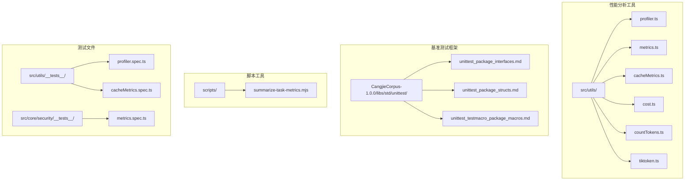
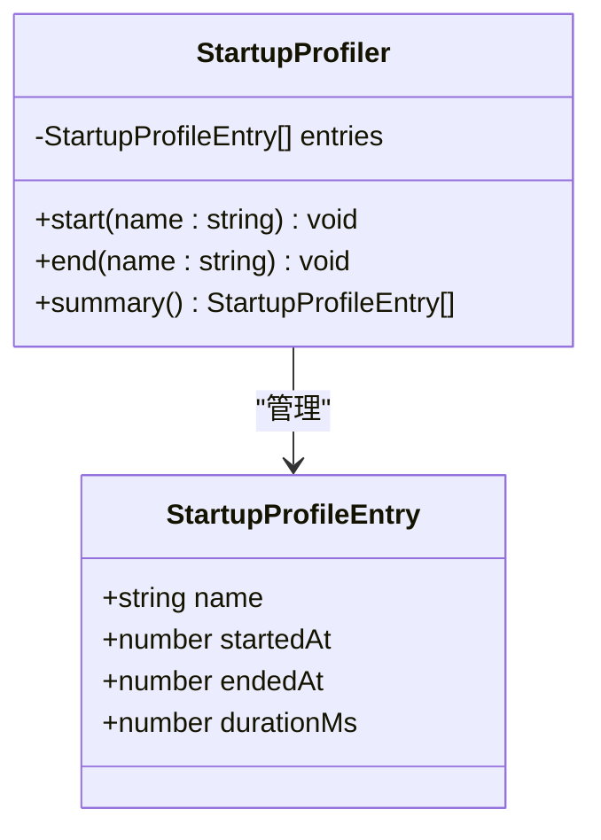
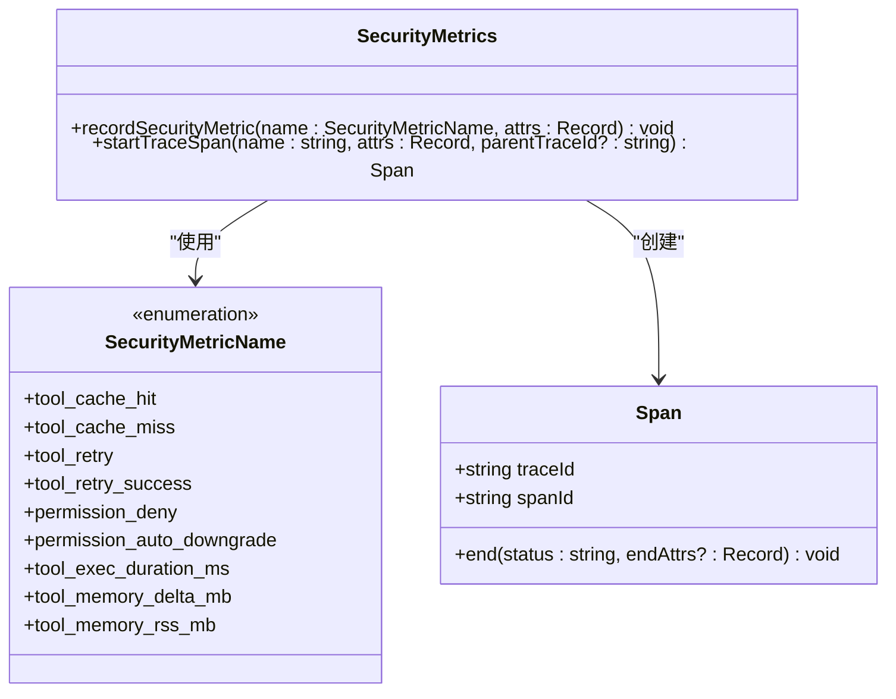
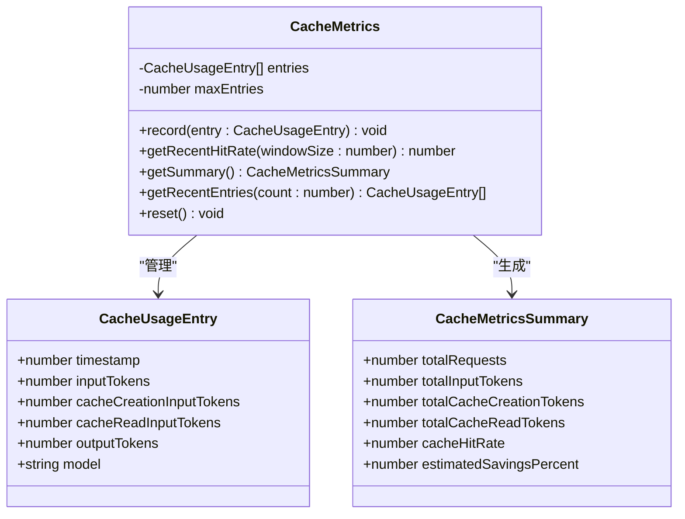
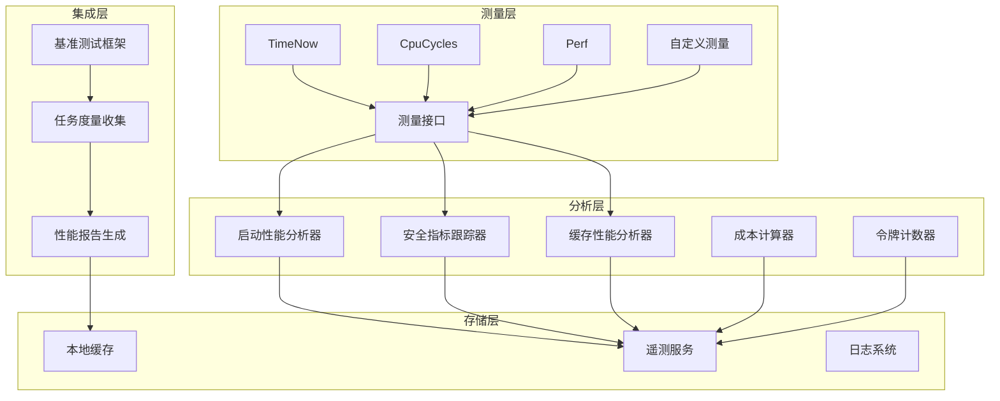
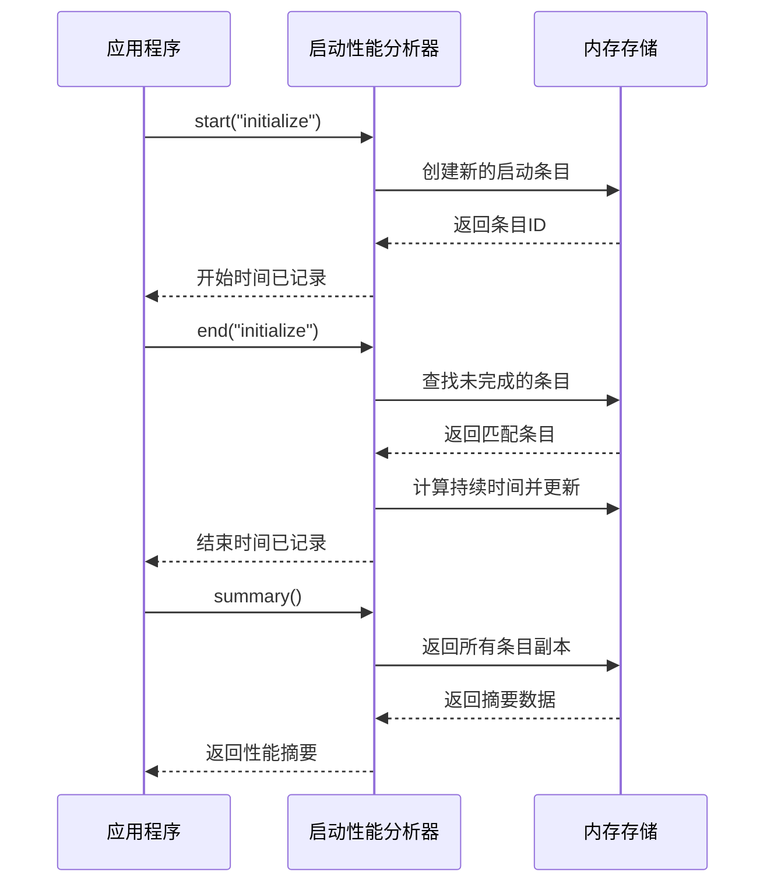
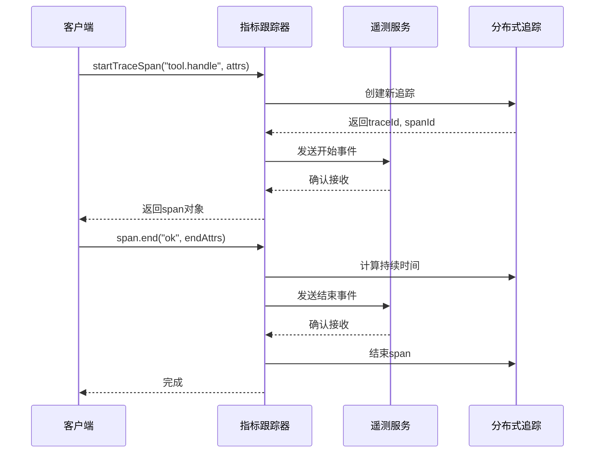
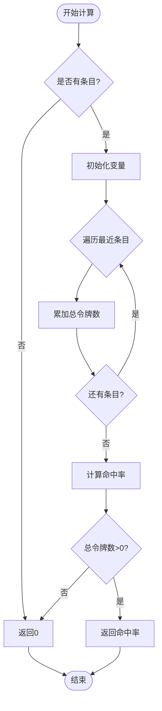
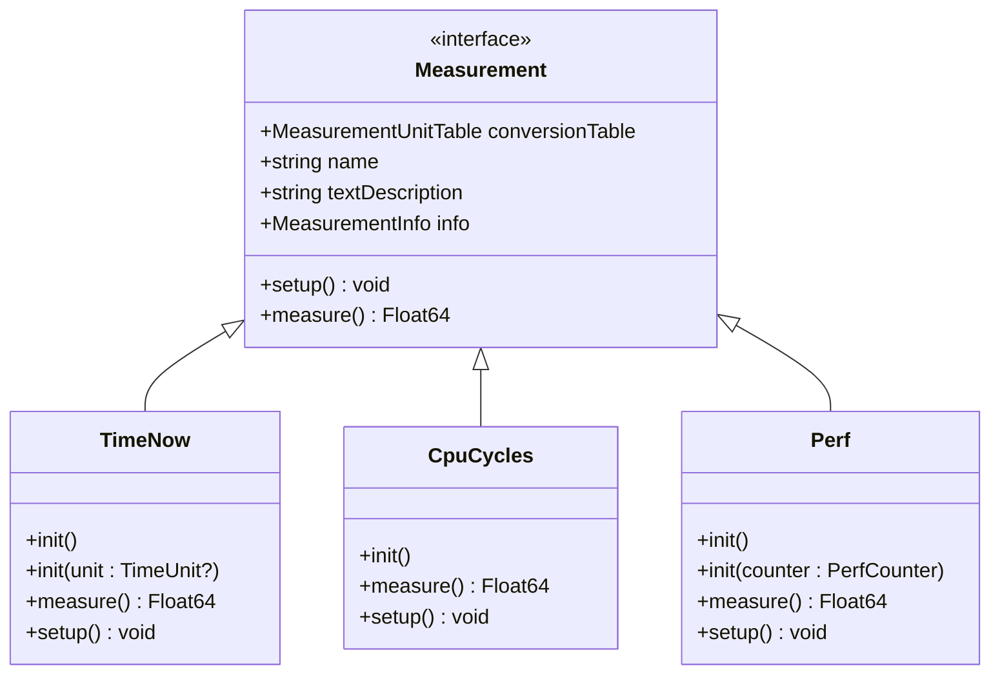
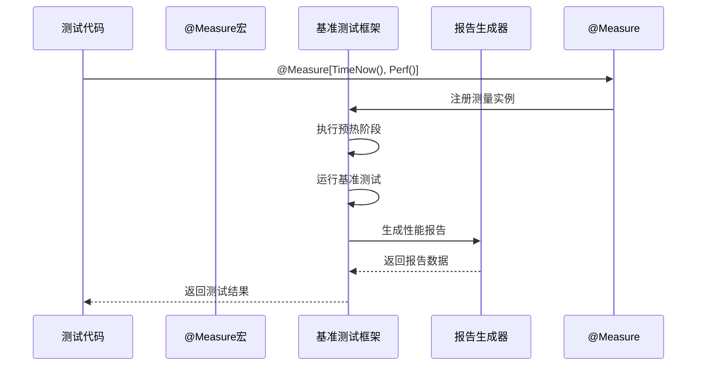

# 性能分析工具

<cite>
**本文档引用的文件**
- [profiler.ts](file://src/utils/profiler.ts)
- [profiler.spec.ts](file://src/utils/__tests__/profiler.spec.ts)
- [metrics.ts](file://src/core/security/metrics.ts)
- [metrics.spec.ts](file://src/core/security/__tests__/metrics.spec.ts)
- [cacheMetrics.ts](file://src/utils/cacheMetrics.ts)
- [cacheMetrics.spec.ts](file://src/utils/__tests__/cacheMetrics.spec.ts)
- [cost.ts](file://src/shared/cost.ts)
- [countTokens.ts](file://src/utils/countTokens.ts)
- [tiktoken.ts](file://src/utils/tiktoken.ts)
- [summarize-task-metrics.mjs](file://scripts/summarize-task-metrics.mjs)
- [unittest_package_interfaces.md](file://CangjieCorpus-1.0.0/libs/std/unittest/unittest_package_api/unittest_package_interfaces.md)
- [unittest_package_structs.md](file://CangjieCorpus-1.0.0/libs/std/unittest/unittest_package_api/unittest_package_structs.md)
- [unittest_testmacro_package_macros.md](file://.njust-ai/skills/cangjie-full-docs/std/unittest_testmacro/unittest_testmacro_package_api/unittest_testmacro_package_macros.md)
</cite>

## 目录
1. [简介](#简介)
2. [项目结构](#项目结构)
3. [核心组件](#核心组件)
4. [架构概览](#架构概览)
5. [详细组件分析](#详细组件分析)
6. [依赖关系分析](#依赖关系分析)
7. [性能考虑](#性能考虑)
8. [故障排除指南](#故障排除指南)
9. [结论](#结论)

## 简介

本项目提供了全面的性能分析工具集，涵盖了启动性能监控、安全指标跟踪、缓存性能分析、成本计算和令牌计数等多个维度。这些工具旨在帮助开发者优化应用程序性能，监控资源使用情况，并提供数据驱动的性能改进指导。

性能分析工具主要分为以下几类：

- **启动性能监控**：跟踪应用启动过程中的关键阶段耗时
- **安全指标跟踪**：监控工具执行时间和内存使用等安全相关指标
- **缓存性能分析**：分析缓存命中率和节省效果
- **成本计算**：基于令牌使用量计算API调用成本
- **令牌计数**：高效计算内容的令牌数量
- **基准测试框架**：提供多种测量方式的性能测试能力

## 项目结构

性能分析工具分布在项目的多个目录中，形成了完整的性能监控体系：



**图表来源**
- [profiler.ts:1-28](file://src/utils/profiler.ts#L1-L28)
- [metrics.ts:1-79](file://src/core/security/metrics.ts#L1-L79)
- [cacheMetrics.ts:1-130](file://src/utils/cacheMetrics.ts#L1-L130)

**章节来源**
- [profiler.ts:1-28](file://src/utils/profiler.ts#L1-L28)
- [metrics.ts:1-79](file://src/core/security/metrics.ts#L1-L79)
- [cacheMetrics.ts:1-130](file://src/utils/cacheMetrics.ts#L1-L130)

## 核心组件

### 启动性能分析器

启动性能分析器是专门用于监控应用启动过程的工具，能够精确记录各个启动阶段的开始和结束时间。



**图表来源**
- [profiler.ts:1-28](file://src/utils/profiler.ts#L1-L28)

### 安全指标跟踪器

安全指标跟踪器提供了全面的安全相关性能监控能力，包括工具执行时间、内存使用和权限控制等指标。



**图表来源**
- [metrics.ts:4-26](file://src/core/security/metrics.ts#L4-L26)

### 缓存性能分析器

缓存性能分析器专注于分析缓存系统的性能表现，提供详细的缓存命中率和节省效果统计。



**图表来源**
- [cacheMetrics.ts:16-126](file://src/utils/cacheMetrics.ts#L16-L126)

**章节来源**
- [profiler.ts:8-27](file://src/utils/profiler.ts#L8-L27)
- [metrics.ts:15-79](file://src/core/security/metrics.ts#L15-L79)
- [cacheMetrics.ts:36-126](file://src/utils/cacheMetrics.ts#L36-L126)

## 架构概览

性能分析工具的整体架构采用分层设计，从底层的测量工具到上层的应用集成，形成了完整的性能监控生态系统。



**图表来源**
- [unittest_package_interfaces.md:178-203](file://CangjieCorpus-1.0.0/libs/std/unittest/unittest_package_api/unittest_package_interfaces.md#L178-L203)
- [metrics.ts:28-79](file://src/core/security/metrics.ts#L28-L79)

## 详细组件分析

### 启动性能分析器详细分析

启动性能分析器通过简单的API提供了完整的启动时间监控功能。其设计简洁而高效，避免了不必要的性能开销。

#### 核心功能流程



**图表来源**
- [profiler.ts:11-24](file://src/utils/profiler.ts#L11-L24)

#### 数据结构设计

启动性能分析器使用轻量级的数据结构来最小化内存占用：

- **StartupProfileEntry**：包含名称、开始时间、结束时间和持续时间
- **StartupProfiler**：维护条目数组并提供查询方法

这种设计确保了即使在大量性能测试场景下也能保持良好的性能表现。

**章节来源**
- [profiler.ts:1-28](file://src/utils/profiler.ts#L1-L28)
- [profiler.spec.ts:5-20](file://src/utils/__tests__/profiler.spec.ts#L5-L20)

### 安全指标跟踪器详细分析

安全指标跟踪器提供了企业级的性能监控能力，集成了遥测服务和分布式追踪功能。

#### 分布式追踪流程



**图表来源**
- [metrics.ts:28-78](file://src/core/security/metrics.ts#L28-L78)

#### 指标类型分类

安全指标跟踪器支持九种不同类型的性能指标：

| 指标类型 | 描述 | 用途 |
|---------|------|------|
| tool_cache_hit | 工具缓存命中 | 监控工具执行效率 |
| tool_cache_miss | 工具缓存未命中 | 识别缓存优化机会 |
| tool_retry | 工具重试次数 | 监控错误恢复机制 |
| tool_retry_success | 成功重试次数 | 评估系统稳定性 |
| permission_deny | 权限拒绝次数 | 安全审计和监控 |
| permission_auto_downgrade | 权限自动降级 | 安全策略执行验证 |
| tool_exec_duration_ms | 工具执行时间(ms) | 性能瓶颈识别 |
| tool_memory_delta_mb | 工具内存变化(MB) | 内存泄漏检测 |
| tool_memory_rss_mb | 工具RSS内存(MB) | 内存使用监控 |

**章节来源**
- [metrics.ts:4-26](file://src/core/security/metrics.ts#L4-L26)
- [metrics.spec.ts:5-29](file://src/core/security/__tests__/metrics.spec.ts#L5-L29)

### 缓存性能分析器详细分析

缓存性能分析器专注于分析缓存系统的性能表现，提供了详细的统计分析功能。

#### 缓存命中率计算算法



**图表来源**
- [cacheMetrics.ts:54-69](file://src/utils/cacheMetrics.ts#L54-L69)

#### 统计指标计算

缓存性能分析器提供三种级别的统计分析：

1. **滑动窗口统计**：最近N次请求的缓存命中率
2. **聚合统计**：所有记录的综合统计信息
3. **估算节省**：基于缓存读取节省的成本估算

**章节来源**
- [cacheMetrics.ts:50-126](file://src/utils/cacheMetrics.ts#L50-L126)
- [cacheMetrics.spec.ts:5-64](file://src/utils/__tests__/cacheMetrics.spec.ts#L5-L64)

### 基准测试框架详细分析

基准测试框架提供了强大的性能测试能力，支持多种测量方式和自定义指标。

#### 测量接口设计



**图表来源**
- [unittest_package_interfaces.md:178-328](file://CangjieCorpus-1.0.0/libs/std/unittest/unittest_package_api/unittest_package_interfaces.md#L178-L328)
- [unittest_package_structs.md:372-449](file://CangjieCorpus-1.0.0/libs/std/unittest/unittest_package_api/unittest_package_structs.md#L372-L449)

#### 基准测试宏系统

基准测试框架通过宏系统提供了简洁的测试编写体验：



**图表来源**
- [unittest_testmacro_package_macros.md:260-297](file://.njust-ai/skills/cangjie-full-docs/std/unittest_testmacro/unittest_testmacro_package_api/unittest_testmacro_package_macros.md#L260-L297)

**章节来源**
- [unittest_package_interfaces.md:178-328](file://CangjieCorpus-1.0.0/libs/std/unittest/unittest_package_api/unittest_package_interfaces.md#L178-L328)
- [unittest_package_structs.md:372-449](file://CangjieCorpus-1.0.0/libs/std/unittest/unittest_package_api/unittest_package_structs.md#L372-L449)
- [unittest_testmacro_package_macros.md:260-297](file://.njust-ai/skills/cangjie-full-docs/std/unittest_testmacro/unittest_testmacro_package_api/unittest_testmacro_package_macros.md#L260-L297)

## 依赖关系分析

性能分析工具之间的依赖关系形成了清晰的层次结构，确保了模块间的松耦合和高内聚。

```mermaid
graph TB
subgraph "外部依赖"
A[workerpool] --> B[countTokens.js工作线程]
C[tiktoken] --> D[令牌编码器]
E[@njust-ai/telemetry] --> F[遥测服务]
end
subgraph "内部模块"
G[profiler.ts] --> H[测试文件]
I[metrics.ts] --> J[安全测试]
K[cacheMetrics.ts] --> L[工具测试]
M[cost.ts] --> N[共享模块]
O[countTokens.ts] --> P[tiktoken.ts]
end
subgraph "基准测试"
Q[unittest_package_interfaces.md] --> R[性能测试]
S[unittest_package_structs.md] --> R
T[unittest_testmacro_package_macros.md] --> R
end
B --> O
D --> O
F --> I
O --> N
R --> U[任务度量收集]
U --> V[summarize-task-metrics.mjs]
```

**图表来源**
- [countTokens.ts:1-46](file://src/utils/countTokens.ts#L1-L46)
- [tiktoken.ts:1-107](file://src/utils/tiktoken.ts#L1-L107)
- [metrics.ts:1-3](file://src/core/security/metrics.ts#L1-L3)

**章节来源**
- [countTokens.ts:1-46](file://src/utils/countTokens.ts#L1-L46)
- [tiktoken.ts:1-107](file://src/utils/tiktoken.ts#L1-L107)
- [metrics.ts:1-3](file://src/core/security/metrics.ts#L1-L3)

## 性能考虑

### 内存使用优化

性能分析工具在设计时充分考虑了内存使用效率：

- **启动性能分析器**：使用固定大小的条目数组，超过限制时自动移除最旧的条目
- **缓存性能分析器**：限制最大条目数量（默认500），确保内存使用可控
- **令牌计数器**：复用编码器实例，避免重复创建导致的内存浪费

### 并发处理能力

系统采用了多种并发处理策略来提高性能：

- **工作线程池**：令牌计数使用独立的工作线程，避免阻塞主线程
- **异步操作**：遥测服务调用采用异步方式，不影响主流程执行
- **懒加载模式**：编码器和工作线程按需创建，减少启动时的资源消耗

### 缓存策略

性能分析工具实现了多层次的缓存策略：

- **编码器缓存**：tiktoken编码器实例被全局缓存复用
- **工作线程缓存**：工作线程池在进程生命周期内保持活跃状态
- **统计缓存**：最近的统计结果在内存中缓存，避免重复计算

## 故障排除指南

### 常见问题诊断

#### 启动性能分析器问题

**问题**：启动时间记录不准确
- 检查是否正确调用了`start()`和`end()`方法
- 确认条目名称的唯一性
- 验证时间戳的正确性

**问题**：内存使用持续增长
- 检查条目数量是否超过限制
- 确认`summary()`方法是否正确使用
- 考虑重置分析器以释放内存

#### 安全指标跟踪器问题

**问题**：遥测事件发送失败
- 检查网络连接状态
- 验证遥测服务的可用性
- 确认事件格式的正确性

**问题**：追踪ID生成异常
- 检查随机数生成器的状态
- 验证UUID格式的正确性
- 确认父追踪ID的传递

#### 缓存性能分析器问题

**问题**：缓存命中率计算错误
- 检查输入令牌数的准确性
- 验证缓存读取令牌数的统计
- 确认统计窗口大小的设置

**问题**：内存使用过高
- 检查最大条目数量的配置
- 确认条目清理机制的正常运行
- 考虑调整统计窗口大小

**章节来源**
- [profiler.spec.ts:5-20](file://src/utils/__tests__/profiler.spec.ts#L5-L20)
- [metrics.spec.ts:5-29](file://src/core/security/__tests__/metrics.spec.ts#L5-L29)
- [cacheMetrics.spec.ts:5-64](file://src/utils/__tests__/cacheMetrics.spec.ts#L5-L64)

## 结论

本项目的性能分析工具集提供了全面的性能监控解决方案，涵盖了从应用启动到工具执行的各个环节。通过模块化的架构设计和高效的实现方式，这些工具能够在不影响主业务逻辑的情况下提供准确的性能数据。

主要优势包括：

1. **多维度监控**：从启动时间、工具执行到缓存性能的全方位监控
2. **高精度测量**：使用专业的测量技术和算法确保数据准确性
3. **低开销设计**：优化的内存使用和并发处理机制
4. **易于集成**：清晰的API设计和完善的测试覆盖
5. **扩展性强**：支持自定义测量指标和分析方法

这些工具为开发者提供了强大的性能分析能力，有助于识别性能瓶颈、优化资源使用并提升整体用户体验。通过持续的监控和分析，团队可以建立数据驱动的性能优化流程，确保应用程序在各种环境下都能保持最佳性能表现。