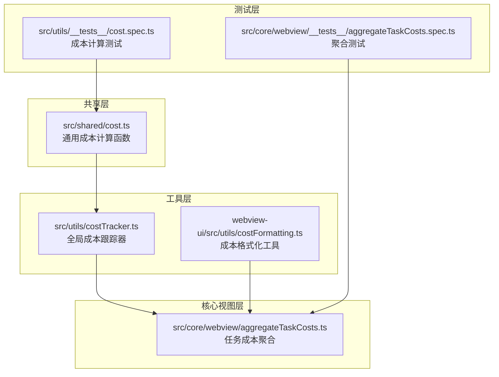
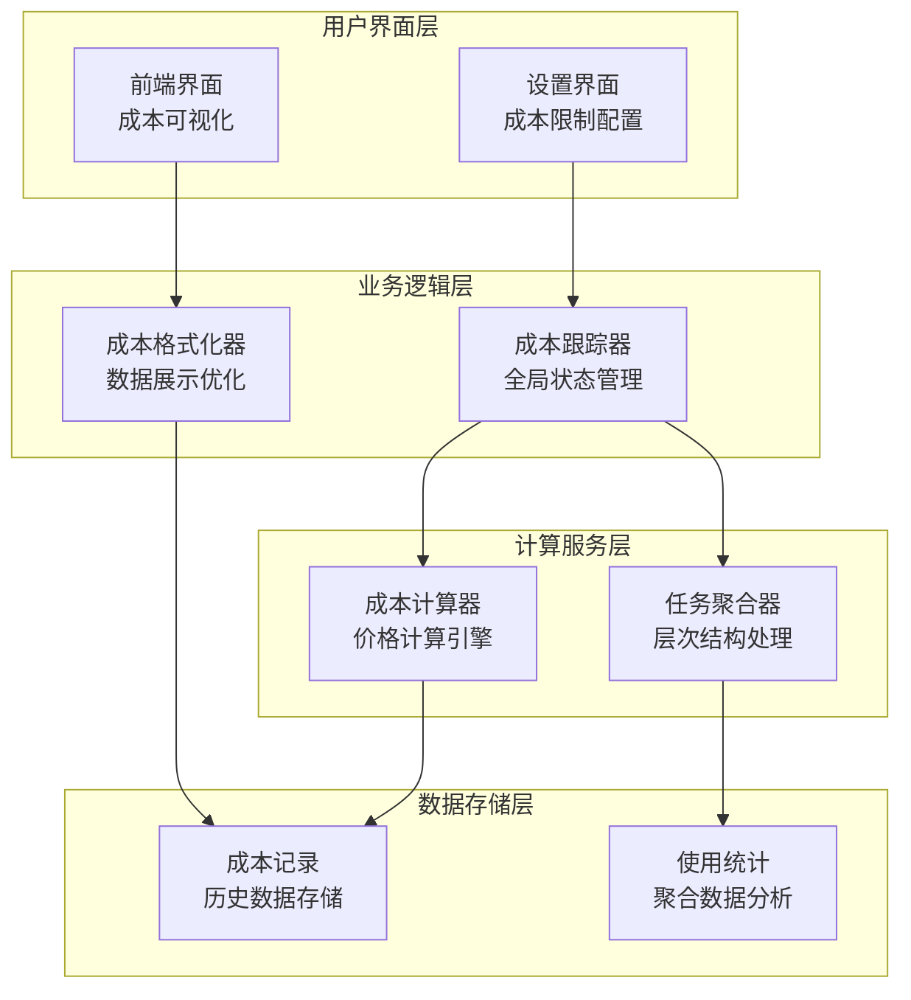
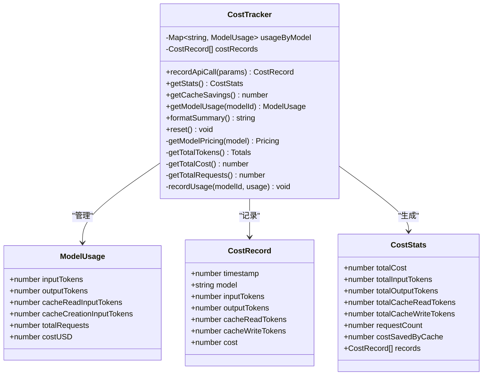
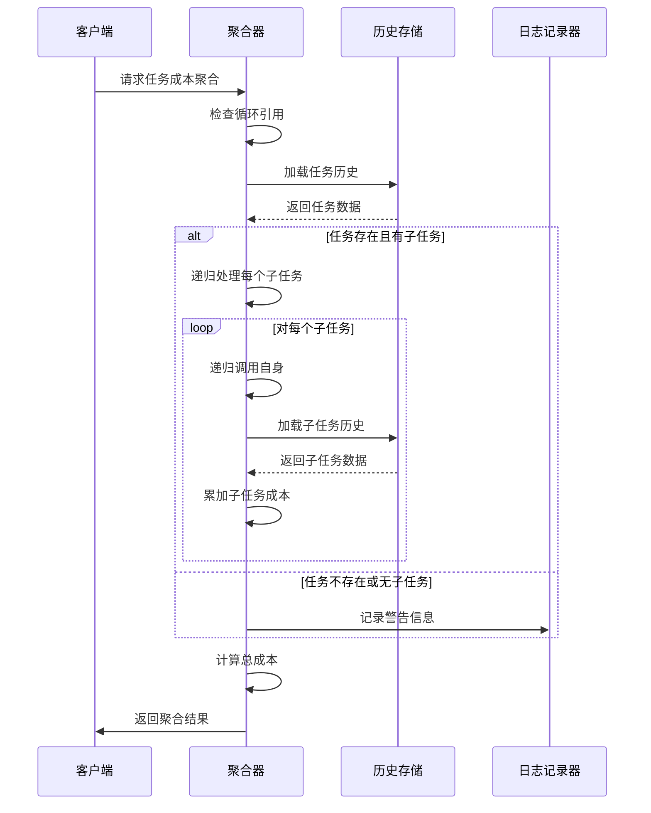

# 成本跟踪系统

<cite>
**本文档引用的文件**
- [cost.ts](file://src/shared/cost.ts)
- [costTracker.ts](file://src/utils/costTracker.ts)
- [aggregateTaskCosts.ts](file://src/core/webview/aggregateTaskCosts.ts)
- [costFormatting.ts](file://webview-ui/src/utils/costFormatting.ts)
- [cost.spec.ts](file://src/utils/__tests__/cost.spec.ts)
- [aggregateTaskCosts.spec.ts](file://src/core/webview/__tests__/aggregateTaskCosts.spec.ts)
- [MaxCostInput.tsx](file://webview-ui/src/components/settings/MaxCostInput.tsx)
</cite>

## 目录
1. [简介](#简介)
2. [项目结构](#项目结构)
3. [核心组件](#核心组件)
4. [架构概览](#架构概览)
5. [详细组件分析](#详细组件分析)
6. [依赖关系分析](#依赖关系分析)
7. [性能考虑](#性能考虑)
8. [故障排除指南](#故障排除指南)
9. [结论](#结论)

## 简介

成本跟踪系统是NJU-AI-CJ项目中的一个关键模块，负责实时监控和计算AI模型调用的成本。该系统支持多种AI提供商（如Anthropic和OpenAI）的定价模型，包括提示缓存功能，并提供多层次的成本聚合和分析能力。

系统主要包含三个核心功能：
- **实时API成本计算**：基于令牌使用量和模型定价自动计算成本
- **任务层次成本聚合**：支持多层级任务的成本汇总和分解
- **成本格式化显示**：为前端界面提供成本数据的格式化展示

## 项目结构

成本跟踪系统分布在项目的多个目录中，采用模块化设计：



**图表来源**
- [cost.ts:1-119](file://src/shared/cost.ts#L1-L119)
- [costTracker.ts:1-271](file://src/utils/costTracker.ts#L1-L271)
- [aggregateTaskCosts.ts:1-66](file://src/core/webview/aggregateTaskCosts.ts#L1-L66)

**章节来源**
- [cost.ts:1-119](file://src/shared/cost.ts#L1-L119)
- [costTracker.ts:1-271](file://src/utils/costTracker.ts#L1-L271)
- [aggregateTaskCosts.ts:1-66](file://src/core/webview/aggregateTaskCosts.ts#L1-L66)

## 核心组件

### 1. 通用成本计算模块

该模块提供了跨平台的成本计算功能，支持不同的AI提供商定价模型。

**主要特性：**
- 支持Anthropic和OpenAI两种定价模式
- 处理提示缓存的成本计算
- 长上下文定价策略应用
- 类型安全的模型信息处理

**章节来源**
- [cost.ts:42-119](file://src/shared/cost.ts#L42-L119)

### 2. 全局成本跟踪器

这是一个单例模式的成本跟踪器，负责记录和管理所有API调用的成本信息。

**核心功能：**
- 实时记录API调用的令牌使用情况
- 自动计算成本并存储详细记录
- 提供统计分析和汇总报告
- 支持按模型维度的成本聚合

**章节来源**
- [costTracker.ts:60-271](file://src/utils/costTracker.ts#L60-L271)

### 3. 任务成本聚合器

专门用于处理任务层次结构的成本聚合，支持递归计算子任务成本。

**关键特性：**
- 递归遍历任务树结构
- 防止循环引用的安全机制
- 详细的成本分解报告
- 异步成本加载支持

**章节来源**
- [aggregateTaskCosts.ts:21-66](file://src/core/webview/aggregateTaskCosts.ts#L21-L66)

## 架构概览

成本跟踪系统采用分层架构设计，确保了模块间的清晰分离和高内聚低耦合：



**图表来源**
- [costTracker.ts:60-271](file://src/utils/costTracker.ts#L60-L271)
- [cost.ts:42-119](file://src/shared/cost.ts#L42-L119)
- [aggregateTaskCosts.ts:21-66](file://src/core/webview/aggregateTaskCosts.ts#L21-L66)

## 详细组件分析

### 成本计算算法分析

系统实现了两种主要的成本计算模式，针对不同AI提供商的定价策略进行了优化：

```mermaid
flowchart TD
Start([开始成本计算]) --> CheckProvider{检查提供商类型}
CheckProvider --> |Anthropic| AnthropicCalc[Anthropic计算流程<br/>输入不包含缓存令牌]
CheckProvider --> |OpenAI| OpenAICalc[OpenAI计算流程<br/>输入已包含缓存令牌]
AnthropicCalc --> CalcBase[计算基础成本<br/>输入*输入价格/1M]
AnthropicCalc --> CalcOutput[计算输出成本<br/>输出*输出价格/1M]
AnthropicCalc --> CalcCacheWrites[计算缓存写入成本<br/>缓存写入*缓存写入价格/1M]
AnthropicCalc --> CalcCacheReads[计算缓存读取成本<br/>缓存读取*缓存读取价格/1M]
OpenAICalc --> CalcNonCached[计算非缓存输入成本<br/>(总输入-缓存)*输入价格/1M]
OpenAICalc --> CalcOutput2[计算输出成本<br/>输出*输出价格/1M]
OpenAICalc --> CalcCacheWrites2[计算缓存写入成本<br/>缓存写入*缓存写入价格/1M]
OpenAICalc --> CalcCacheReads2[计算缓存读取成本<br/>缓存读取*缓存读取价格/1M]
CalcBase --> ApplyLongContext{应用长上下文定价?}
CalcNonCached --> ApplyLongContext
ApplyLongContext --> |是| LongContext[应用长上下文价格乘数]
ApplyLongContext --> |否| SumUp[汇总所有成本]
LongContext --> SumUp
SumUp --> End([返回最终成本结果])
```

**图表来源**
- [cost.ts:66-119](file://src/shared/cost.ts#L66-L119)

**章节来源**
- [cost.ts:66-119](file://src/shared/cost.ts#L66-L119)

### 成本跟踪器类结构



**图表来源**
- [costTracker.ts:60-271](file://src/utils/costTracker.ts#L60-L271)

**章节来源**
- [costTracker.ts:60-271](file://src/utils/costTracker.ts#L60-L271)

### 任务成本聚合算法

系统提供了强大的任务层次结构成本聚合功能：



**图表来源**
- [aggregateTaskCosts.ts:21-66](file://src/core/webview/aggregateTaskCosts.ts#L21-L66)

**章节来源**
- [aggregateTaskCosts.ts:21-66](file://src/core/webview/aggregateTaskCosts.ts#L21-L66)

## 依赖关系分析

成本跟踪系统的依赖关系清晰明确，遵循了单一职责原则：

```mermaid
graph LR
subgraph "外部依赖"
Types[@njust-ai/types<br/>类型定义]
React[react-i18next<br/>国际化支持]
end
subgraph "内部模块"
SharedCost[src/shared/cost.ts]
UtilsCostTracker[src/utils/costTracker.ts]
WebViewAggregate[src/core/webview/aggregateTaskCosts.ts]
WebviewFormat[webview-ui/src/utils/costFormatting.ts]
SettingsUI[webview-ui/src/components/settings/MaxCostInput.tsx]
end
Types --> SharedCost
Types --> WebViewAggregate
SharedCost --> UtilsCostTracker
UtilsCostTracker --> WebViewAggregate
UtilsCostTracker --> WebviewFormat
React --> WebviewFormat
React --> SettingsUI
SharedCost -.-> Tests[测试模块]
UtilsCostTracker -.-> Tests
WebViewAggregate -.-> Tests
```

**图表来源**
- [cost.ts:1-3](file://src/shared/cost.ts#L1-L3)
- [costTracker.ts:1-2](file://src/utils/costTracker.ts#L1-L2)
- [aggregateTaskCosts.ts](file://src/core/webview/aggregateTaskCosts.ts#L1)

**章节来源**
- [cost.ts:1-3](file://src/shared/cost.ts#L1-L3)
- [costTracker.ts:1-2](file://src/utils/costTracker.ts#L1-L2)
- [aggregateTaskCosts.ts](file://src/core/webview/aggregateTaskCosts.ts#L1)

## 性能考虑

### 时间复杂度分析

1. **成本计算函数**：O(1) - 基础数学运算，不依赖输入大小
2. **成本跟踪器**：O(n) - n为记录数量，主要用于统计计算
3. **任务聚合**：O(h) - h为任务树的高度，最坏情况下可能达到O(n)

### 内存使用优化

- 使用Map数据结构存储模型使用情况，提供O(1)的查找性能
- 成本记录采用数组存储，便于序列化和传输
- 递归聚合使用Set防止重复访问，避免内存泄漏

### 缓存策略

- 模型定价信息缓存在常量中，避免重复查询
- 使用toFixed方法进行数值精度控制，减少浮点运算误差

## 故障排除指南

### 常见问题及解决方案

**问题1：成本计算结果异常**
- 检查输入参数是否正确（令牌数量、模型名称）
- 验证模型定价信息是否存在
- 确认是否正确选择了提供商类型

**问题2：任务聚合出现循环引用**
- 检查任务历史数据的childIds字段
- 确保没有形成闭环引用
- 查看控制台警告信息

**问题3：前端显示格式化错误**
- 检查i18n标签是否正确配置
- 验证成本值是否为有效数字
- 确认格式化函数的参数传递

**章节来源**
- [aggregateTaskCosts.ts:26-30](file://src/core/webview/aggregateTaskCosts.ts#L26-L30)
- [costFormatting.ts:25-33](file://webview-ui/src/utils/costFormatting.ts#L25-L33)

### 测试覆盖范围

系统包含完整的测试套件，确保各组件的可靠性：

- **成本计算测试**：覆盖Anthropic和OpenAI两种提供商的所有场景
- **任务聚合测试**：验证递归聚合、循环引用检测、边界条件处理
- **格式化测试**：确保前端显示的一致性和正确性

**章节来源**
- [cost.spec.ts:1-307](file://src/utils/__tests__/cost.spec.ts#L1-L307)
- [aggregateTaskCosts.spec.ts:1-326](file://src/core/webview/__tests__/aggregateTaskCosts.spec.ts#L1-L326)

## 结论

成本跟踪系统通过精心设计的架构和实现，为NJU-AI-CJ项目提供了全面的成本监控和分析能力。系统的主要优势包括：

1. **模块化设计**：清晰的分层架构便于维护和扩展
2. **类型安全**：完整的TypeScript类型定义确保代码质量
3. **性能优化**：高效的算法和数据结构设计
4. **测试完备**：全面的单元测试和集成测试保障可靠性
5. **用户体验**：友好的前端界面和灵活的配置选项

该系统不仅满足了当前的成本跟踪需求，还为未来的功能扩展奠定了坚实的基础。通过持续的优化和改进，成本跟踪系统将继续为AI工具的合理使用和成本控制提供重要支撑。