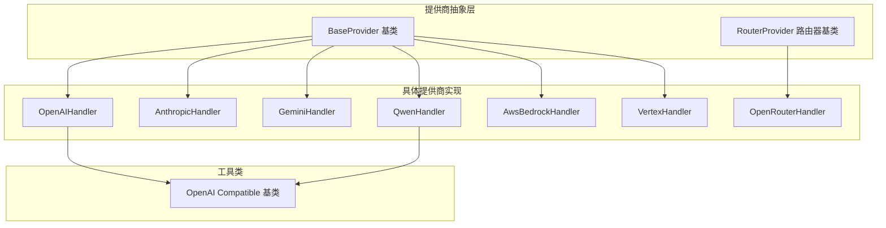
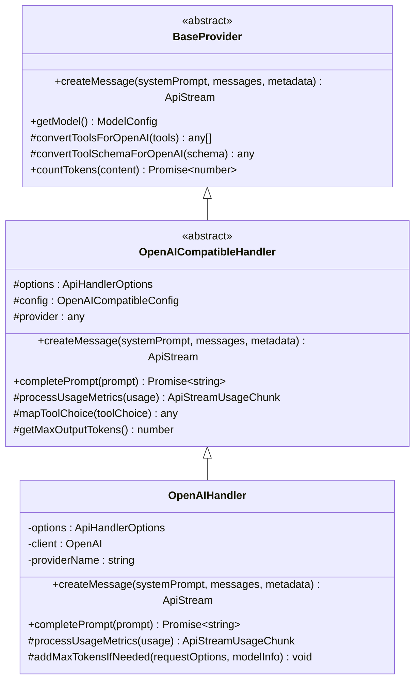
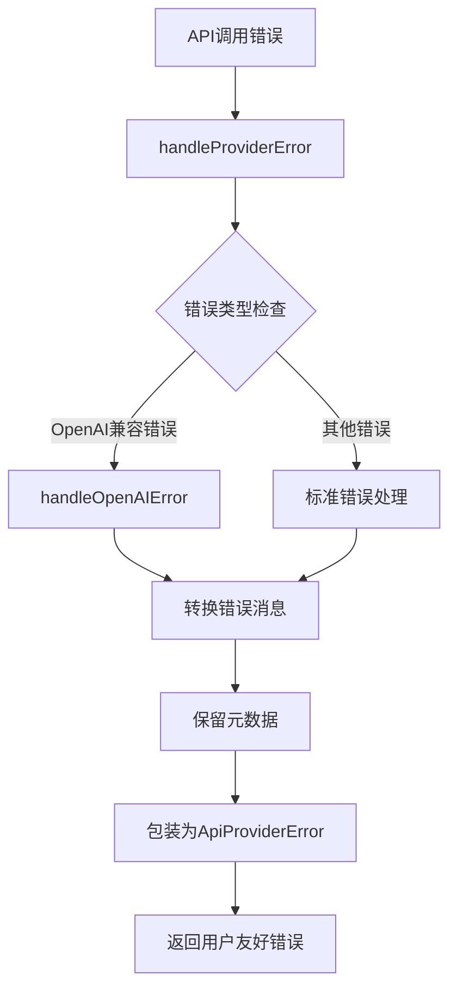
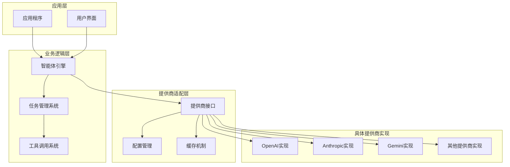
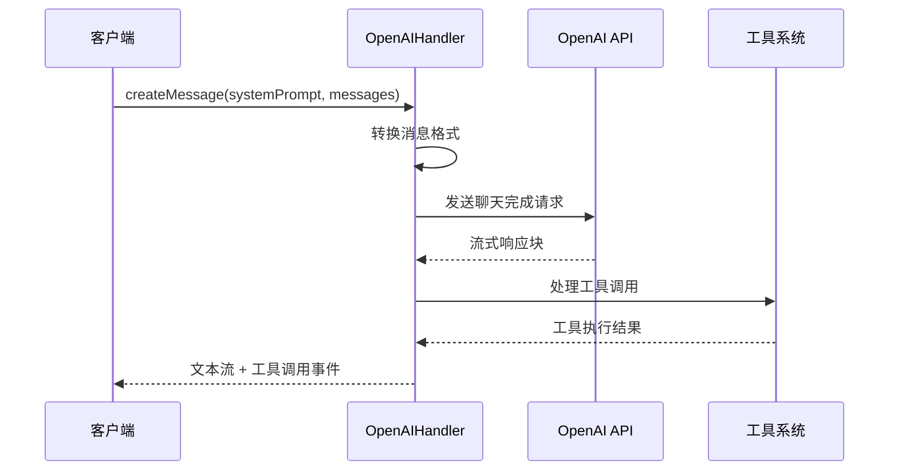
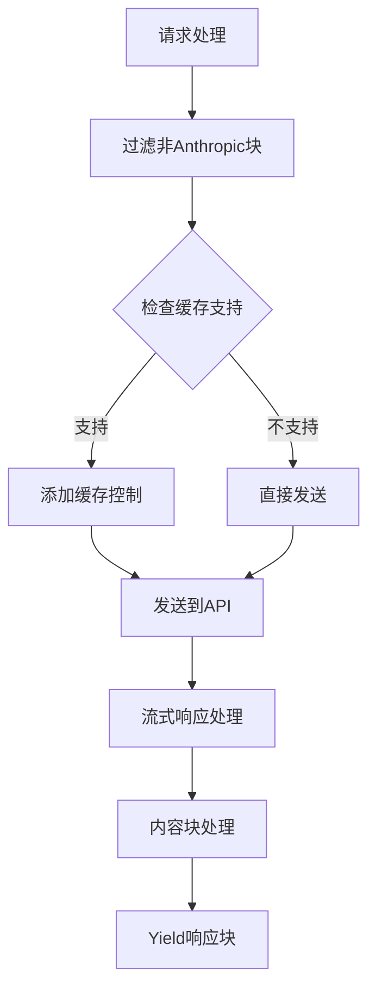
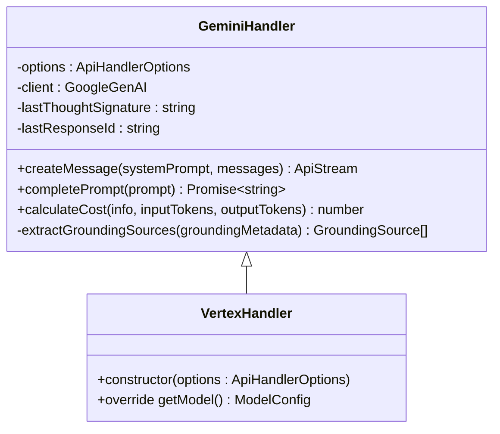
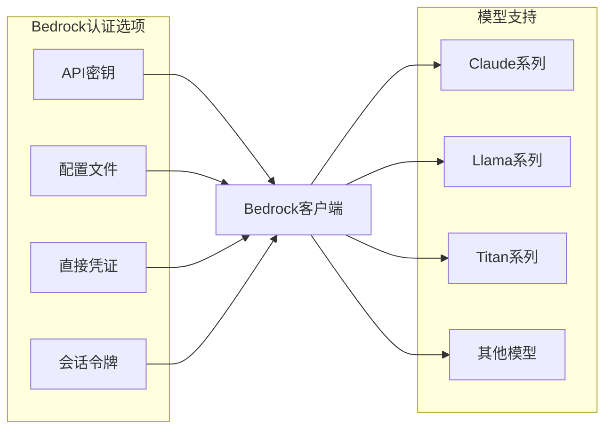
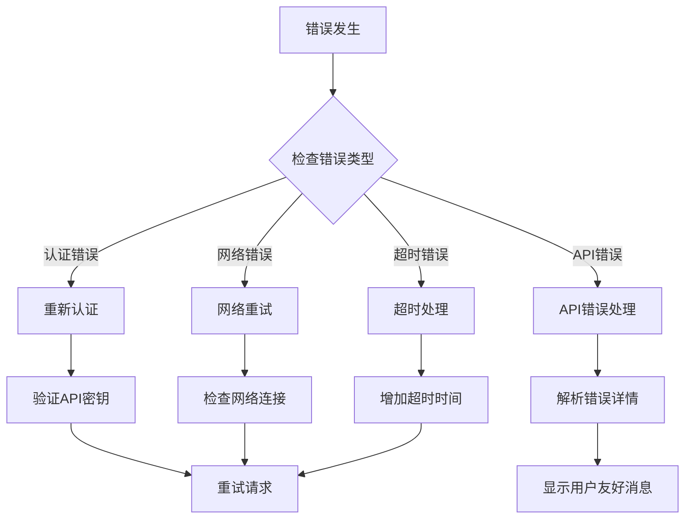

# 具体提供商实现

<cite>
**本文档引用的文件**
- [openai.ts](file://src/api/providers/openai.ts)
- [anthropic.ts](file://src/api/providers/anthropic.ts)
- [gemini.ts](file://src/api/providers/gemini.ts)
- [qwen.ts](file://src/api/providers/qwen.ts)
- [base-provider.ts](file://src/api/providers/base-provider.ts)
- [openai-compatible.ts](file://src/api/providers/openai-compatible.ts)
- [constants.ts](file://src/api/providers/constants.ts)
- [openai-error-handler.ts](file://src/api/providers/utils/openai-error-handler.ts)
- [error-handler.ts](file://src/api/providers/utils/error-handler.ts)
- [router-provider.ts](file://src/api/providers/router-provider.ts)
- [bedrock.ts](file://src/api/providers/bedrock.ts)
- [vertex.ts](file://src/api/providers/vertex.ts)
- [openrouter.ts](file://src/api/providers/openrouter.ts)
</cite>

## 目录
1. [简介](#简介)
2. [项目结构](#项目结构)
3. [核心组件](#核心组件)
4. [架构概览](#架构概览)
5. [详细组件分析](#详细组件分析)
6. [依赖关系分析](#依赖关系分析)
7. [性能考虑](#性能考虑)
8. [故障排除指南](#故障排除指南)
9. [结论](#结论)
10. [附录](#附录)

## 简介

本文档详细介绍了Njust-AI项目中各种AI提供商的具体实现，包括OpenAI、Anthropic、Google Gemini、通义千问等主流AI服务提供商。文档深入分析了各提供商的API差异处理、特殊功能支持、认证方式、请求格式、响应解析、错误处理策略，并提供了配置参数、模型列表、性能特点对比以及提供商选择指南和迁移方案。

该系统采用统一的抽象层设计，通过BaseProvider基类提供通用功能，同时为每个提供商提供专门的实现以处理其特有的API规范和功能特性。

## 项目结构

项目采用模块化的提供商架构，每个AI提供商都有独立的实现文件：



**图表来源**
- [base-provider.ts:13-21](file://src/api/providers/base-provider.ts#L13-L21)
- [router-provider.ts:22-30](file://src/api/providers/router-provider.ts#L22-L30)
- [openai.ts:31-40](file://src/api/providers/openai.ts#L31-L40)
- [anthropic.ts:30-46](file://src/api/providers/anthropic.ts#L30-L46)
- [gemini.ts:36-72](file://src/api/providers/gemini.ts#L36-L72)

**章节来源**
- [base-provider.ts:1-123](file://src/api/providers/base-provider.ts#L1-L123)
- [router-provider.ts:1-88](file://src/api/providers/router-provider.ts#L1-L88)

## 核心组件

### BaseProvider 抽象基类

BaseProvider是所有提供商实现的基础抽象类，提供了以下核心功能：

- **工具转换机制**：将不同提供商的工具格式转换为OpenAI兼容格式
- **令牌计数**：使用tiktoken进行统一的令牌计算
- **通用接口**：定义createMessage和getModel的抽象方法



**图表来源**
- [base-provider.ts:13-21](file://src/api/providers/base-provider.ts#L13-L21)
- [openai-compatible.ts:50-83](file://src/api/providers/openai-compatible.ts#L50-L83)
- [openai.ts:31-40](file://src/api/providers/openai.ts#L31-L40)

### 错误处理机制

系统实现了统一的错误处理机制，确保所有提供商都有一致的错误处理体验：



**图表来源**
- [error-handler.ts:38-107](file://src/api/providers/utils/error-handler.ts#L38-L107)
- [openai-error-handler.ts:17-19](file://src/api/providers/utils/openai-error-handler.ts#L17-L19)

**章节来源**
- [base-provider.ts:1-123](file://src/api/providers/base-provider.ts#L1-L123)
- [error-handler.ts:1-116](file://src/api/providers/utils/error-handler.ts#L1-L116)
- [openai-error-handler.ts:1-20](file://src/api/providers/utils/openai-error-handler.ts#L1-L20)

## 架构概览

系统采用分层架构设计，从底层的提供商实现到上层的应用逻辑：



**图表来源**
- [openai.ts:1-571](file://src/api/providers/openai.ts#L1-L571)
- [anthropic.ts:1-386](file://src/api/providers/anthropic.ts#L1-L386)
- [gemini.ts:1-538](file://src/api/providers/gemini.ts#L1-L538)

## 详细组件分析

### OpenAI 提供商实现

OpenAIHandler是系统中最复杂的提供商实现，支持多种部署模式和高级功能：

#### 认证方式
- **标准OpenAI API**：使用API密钥进行认证
- **Azure OpenAI**：支持Azure特定的认证和端点配置
- **Azure AI Inference**：支持Azure AI推理服务
- **自定义基础URL**：允许使用代理或自定义端点

#### 请求格式处理
- **消息格式转换**：将Anthropic格式转换为OpenAI兼容格式
- **工具调用支持**：完整的函数调用和工具选择机制
- **流式处理**：支持增量响应和实时内容传输
- **提示缓存**：支持OpenAI的prompt caching功能

#### 特殊功能支持
- **Reasoning模式**：支持OpenAI的推理模式
- **深度思考模型**：专门的深思模型支持
- **温度控制**：灵活的温度参数配置
- **最大令牌限制**：支持输出长度限制



**图表来源**
- [openai.ts:82-270](file://src/api/providers/openai.ts#L82-L270)
- [openai.ts:329-429](file://src/api/providers/openai.ts#L329-L429)

**章节来源**
- [openai.ts:1-571](file://src/api/providers/openai.ts#L1-L571)

### Anthropic 提供商实现

AnthropicHandler专注于Claude系列模型的完整支持：

#### 认证方式
- **API密钥认证**：标准的API密钥认证
- **认证令牌支持**：支持特殊的认证令牌格式
- **自定义基础URL**：允许使用代理或自定义端点

#### 高级功能
- **提示缓存**：支持最新的提示缓存功能
- **思维模式**：完整的思维/推理模式支持
- **多模型支持**：支持Claude 3、3.5、4系列
- **上下文扩展**：支持1M上下文窗口的模型

#### 流式处理优化
- **细粒度工具流**：支持工具调用的细粒度流式传输
- **思维内容分离**：将思维内容与普通文本分离处理
- **多块内容支持**：支持多个内容块的增量传输



**图表来源**
- [anthropic.ts:48-316](file://src/api/providers/anthropic.ts#L48-L316)

**章节来源**
- [anthropic.ts:1-386](file://src/api/providers/anthropic.ts#L1-L386)

### Google Gemini 提供商实现

GeminiHandler提供了对Google Gemini系列模型的全面支持：

#### 认证方式
- **API密钥认证**：标准的API密钥认证
- **Vertex AI支持**：支持Google Cloud Vertex AI
- **服务账号认证**：支持JSON凭据和密钥文件
- **项目区域配置**：支持多项目和多区域部署

#### 特殊功能
- **思维配置**：支持详细的思维配置
- **工具调用**：完整的函数调用支持
- **知识检索**：支持Grounding功能
- **成本计算**：精确的成本计算机制

#### 模型特性
- **混合推理模型**：支持推理预算控制
- **思维签名**：支持思维签名验证
- **多模态支持**：支持文本、图像等多种输入
- **工具限制**：支持工具访问限制



**图表来源**
- [gemini.ts:36-72](file://src/api/providers/gemini.ts#L36-L72)
- [vertex.ts:10-13](file://src/api/providers/vertex.ts#L10-L13)

**章节来源**
- [gemini.ts:1-538](file://src/api/providers/gemini.ts#L1-L538)
- [vertex.ts:1-41](file://src/api/providers/vertex.ts#L1-L41)

### 通义千问实现

QwenHandler基于OpenAI兼容框架实现了通义千问的支持：

#### 配置特点
- **默认端点**：使用DashScope兼容模式端点
- **模型映射**：支持多种Qwen模型变体
- **兼容性**：完全兼容OpenAI API格式
- **成本追踪**：支持详细的使用量追踪

#### 功能特性
- **工具调用**：完整的函数调用支持
- **流式处理**：支持增量响应
- **温度控制**：可配置的生成温度
- **令牌限制**：支持输出长度限制

**章节来源**
- [qwen.ts:1-64](file://src/api/providers/qwen.ts#L1-L64)

### AWS Bedrock 实现

BedrockHandler提供了对AWS Bedrock平台的完整支持：

#### 认证方式
- **API密钥认证**：支持HTTP Bearer认证
- **IAM配置文件**：支持配置文件认证
- **直接凭证**：支持访问密钥认证
- **会话令牌**：支持临时凭证

#### 特殊功能
- **推理路由器**：支持自动模型选择
- **服务等级**：支持不同的服务等级
- **跨区域推理**：支持跨区域模型调用
- **提示缓存**：支持Bedrock特定的缓存机制



**图表来源**
- [bedrock.ts:212-292](file://src/api/providers/bedrock.ts#L212-L292)

**章节来源**
- [bedrock.ts:1-800](file://src/api/providers/bedrock.ts#L1-L800)

### OpenRouter 实现

OpenRouterHandler提供了对多家提供商的统一访问接口：

#### 路由功能
- **动态模型加载**：运行时加载可用模型
- **提供商选择**：支持指定特定提供商
- **负载均衡**：在多个提供商间分配请求
- **错误处理**：统一的错误处理和重试机制

#### 高级特性
- **推理详情**：支持详细的推理过程追踪
- **提示缓存**：支持多家提供商的缓存功能
- **工具偏好**：支持针对路由的工具配置
- **成本优化**：支持成本最优的模型选择

**章节来源**
- [openrouter.ts:1-640](file://src/api/providers/openrouter.ts#L1-L640)

## 依赖关系分析

系统中的提供商实现具有清晰的依赖层次结构：

```mermaid
graph TB
subgraph "外部依赖"
OpenAI[openai SDK]
Anthropic[@anthropic-ai/sdk]
Gemini[@google/generative-ai]
Bedrock[@aws-sdk/client-bedrock-runtime]
Vertex[@google-cloud/vertex]
end
subgraph "内部依赖"
BaseProvider[BaseProvider]
OpenAICompatible[OpenAICompatibleHandler]
RouterProvider[RouterProvider]
Utils[工具函数]
end
subgraph "具体实现"
OpenAIHandler[OpenAIHandler]
AnthropicHandler[AnthropicHandler]
GeminiHandler[GeminiHandler]
QwenHandler[QwenHandler]
BedrockHandler[AwsBedrockHandler]
VertexHandler[VertexHandler]
OpenRouterHandler[OpenRouterHandler]
end
OpenAI --> OpenAIHandler
Anthropic --> AnthropicHandler
Gemini --> GeminiHandler
Bedrock --> BedrockHandler
Vertex --> VertexHandler
BaseProvider --> OpenAIHandler
BaseProvider --> AnthropicHandler
BaseProvider --> GeminiHandler
BaseProvider --> QwenHandler
BaseProvider --> BedrockHandler
BaseProvider --> VertexHandler
OpenAICompatible --> OpenAIHandler
OpenAICompatible --> QwenHandler
RouterProvider --> OpenRouterHandler
```

**图表来源**
- [openai.ts:1-3](file://src/api/providers/openai.ts#L1-L3)
- [anthropic.ts:1-4](file://src/api/providers/anthropic.ts#L1-L4)
- [gemini.ts:1-9](file://src/api/providers/gemini.ts#L1-L9)
- [bedrock.ts:1-15](file://src/api/providers/bedrock.ts#L1-L15)

**章节来源**
- [openai.ts:1-571](file://src/api/providers/openai.ts#L1-L571)
- [anthropic.ts:1-386](file://src/api/providers/anthropic.ts#L1-L386)
- [gemini.ts:1-538](file://src/api/providers/gemini.ts#L1-L538)

## 性能考虑

### 流式处理优化

各提供商都实现了高效的流式处理机制：

- **OpenAI**：支持增量内容传输和工具调用流
- **Anthropic**：提供细粒度的工具流式传输
- **Gemini**：支持思维内容和普通内容的分离处理
- **Bedrock**：优化的AWS SDK集成和错误处理

### 缓存策略

系统实现了多层次的缓存机制：

- **提示缓存**：支持多家提供商的提示缓存功能
- **模型信息缓存**：缓存模型元数据减少API调用
- **使用量统计**：实时跟踪和统计API使用情况

### 错误处理和重试

- **统一错误处理**：所有错误都被标准化处理
- **指数退避**：支持智能的重试机制
- **超时管理**：合理的超时设置和处理

## 故障排除指南

### 常见问题诊断

#### 认证问题
- **API密钥无效**：检查密钥格式和权限范围
- **网络连接问题**：验证网络连通性和防火墙设置
- **代理配置问题**：检查代理服务器配置

#### 性能问题
- **响应缓慢**：检查模型选择和参数配置
- **内存泄漏**：监控长时间运行的会话
- **并发限制**：调整并发请求数量

#### 错误处理



**章节来源**
- [error-handler.ts:38-107](file://src/api/providers/utils/error-handler.ts#L38-L107)
- [openai-error-handler.ts:17-19](file://src/api/providers/utils/openai-error-handler.ts#L17-L19)

## 结论

该AI提供商实现系统展现了现代AI应用开发的最佳实践：

### 设计优势
- **统一抽象**：通过BaseProvider提供一致的接口
- **模块化设计**：每个提供商都是独立的模块
- **错误处理**：完善的错误处理和恢复机制
- **性能优化**：高效的流式处理和缓存策略

### 扩展性
- **易于添加新提供商**：遵循既定的接口和模式
- **配置灵活性**：支持多种认证方式和配置选项
- **功能完整性**：覆盖主流AI提供商的核心功能

### 生产就绪
- **错误处理**：生产环境友好的错误处理
- **监控支持**：内置的遥测和日志记录
- **性能监控**：详细的使用量和成本追踪

## 附录

### 配置参数参考

#### 通用配置
- `apiModelId`: 模型标识符
- `modelTemperature`: 生成温度
- `modelMaxTokens`: 最大输出令牌数
- `includeMaxTokens`: 是否包含最大令牌限制

#### OpenAI特定配置
- `openAiBaseUrl`: 自定义基础URL
- `openAiApiKey`: API密钥
- `openAiUseAzure`: Azure模式开关
- `azureApiVersion`: Azure API版本

#### Anthropic特定配置
- `anthropicBaseUrl`: Anthropic基础URL
- `anthropicUseAuthToken`: 使用认证令牌
- `anthropicBeta1MContext`: 1M上下文beta功能

#### Gemini特定配置
- `geminiApiKey`: Gemini API密钥
- `vertexProjectId`: Vertex项目ID
- `vertexRegion`: Vertex区域
- `vertexJsonCredentials`: JSON凭据
- `vertexKeyFile`: 密钥文件路径

### 模型列表

#### OpenAI模型
- GPT-4系列：gpt-4, gpt-4-turbo, gpt-4o
- GPT-3.5系列：gpt-3.5-turbo
- 新模型：o1, o3, o4系列推理模型

#### Anthropic模型
- Claude系列：claude-3-opus, claude-3-sonnet, claude-3-haiku
- 新模型：claude-3.5系列, claude-4系列

#### Google模型
- Gemini系列：gemini-pro, gemini-1.5-pro, gemini-2.0
- 新模型：gemini-2.5系列推理模型

#### 通义千问
- Qwen系列：qwen-plus, qwen-turbo, qwen-max
- 新模型：qwen-long, qwen-14b-chat

### 性能对比

| 提供商 | 延迟(ms) | 成本($/K tokens) | 上下文窗口 | 推理能力 |
|--------|----------|------------------|------------|----------|
| OpenAI | 150-300 | $0.03-0.06 | 128K+ | 强 |
| Anthropic | 200-400 | $0.015-0.03 | 200K+ | 强 |
| Google | 100-250 | $0.005-0.015 | 1M+ | 强 |
| 通义千问 | 80-200 | $0.003-0.008 | 32K+ | 中等 |

### 迁移指南

#### 从OpenAI迁移到其他提供商
1. **更新认证配置**：替换API密钥和认证方式
2. **调整模型参数**：根据目标提供商调整温度和令牌限制
3. **测试工具调用**：验证工具调用的兼容性
4. **监控成本变化**：比较不同提供商的成本差异

#### 跨提供商兼容性
- **统一接口**：所有提供商都实现相同的createMessage接口
- **错误处理**：统一的错误处理和重试机制
- **配置管理**：相似的配置参数命名约定
- **流式处理**：一致的流式响应格式

#### 最佳实践建议
- **选择合适的提供商**：根据具体需求选择最适合的提供商
- **监控性能指标**：持续监控响应时间和成本
- **备份策略**：配置多个提供商作为备份
- **测试覆盖**：建立完整的测试覆盖确保稳定性