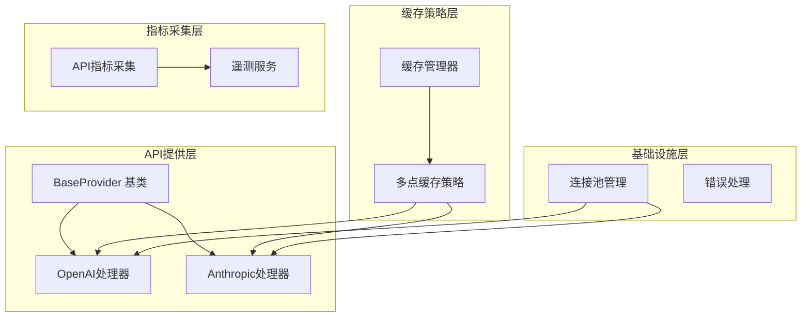
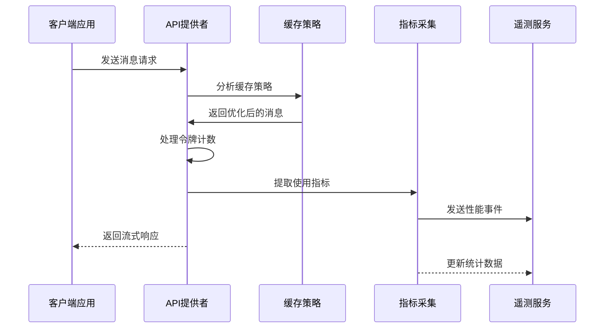
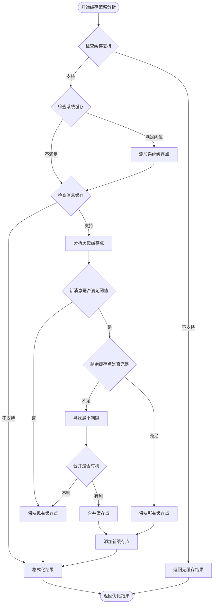
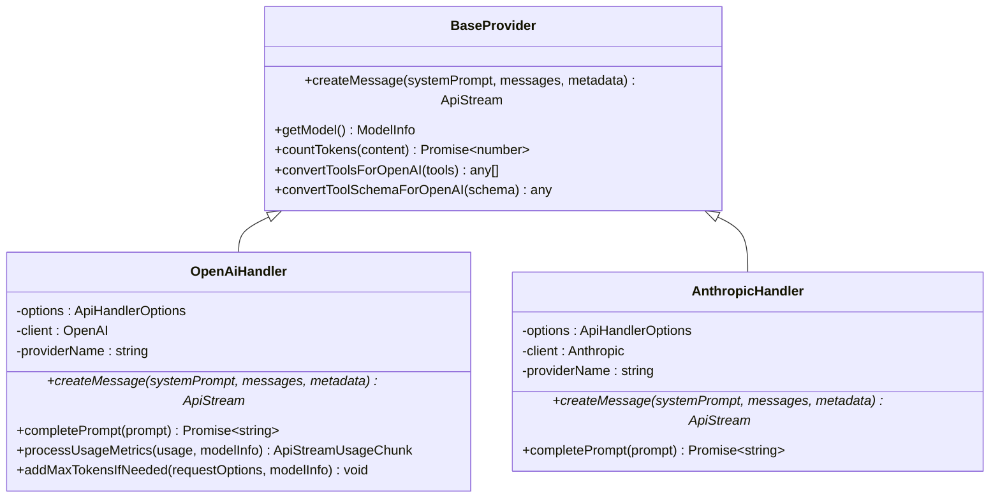
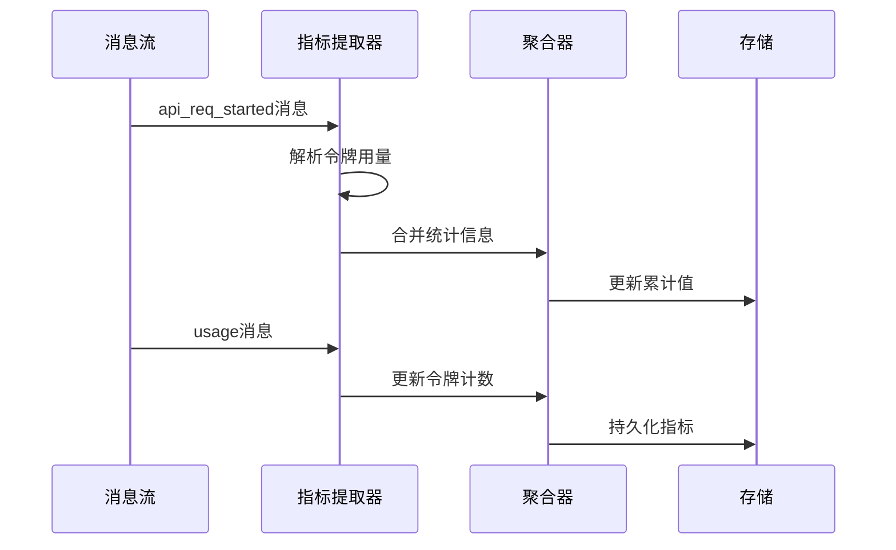
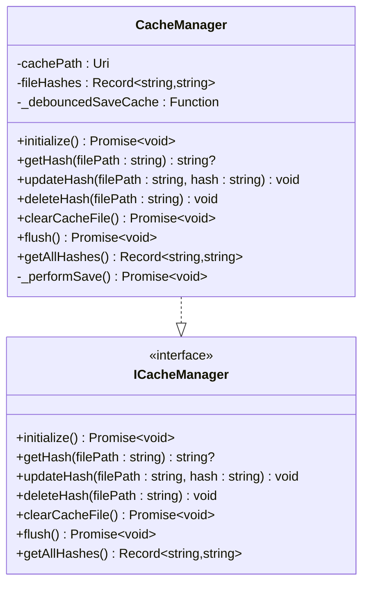

# 性能监控与优化

<cite>
**本文档引用的文件**
- [src/api/providers/base-provider.ts](file://src/api/providers/base-provider.ts)
- [src/api/providers/openai.ts](file://src/api/providers/openai.ts)
- [src/api/providers/anthropic.ts](file://src/api/providers/anthropic.ts)
- [src/api/transform/cache-strategy/multi-point-strategy.ts](file://src/api/transform/cache-strategy/multi-point-strategy.ts)
- [src/services/code-index/cache-manager.ts](file://src/services/code-index/cache-manager.ts)
- [src/shared/getApiMetrics.ts](file://src/shared/getApiMetrics.ts)
- [src/shared/__tests__/getApiMetrics.spec.ts](file://src/shared/__tests__/getApiMetrics.spec.ts)
- [packages/telemetry/src/index.ts](file://packages/telemetry/src/index.ts)
- [packages/evals/src/db/migrations/0002_snapshot.json](file://packages/evals/src/db/migrations/0002_snapshot.json)
- [src/core/task/Task.ts](file://src/core/task/Task.ts)
- [src/api/providers/__tests__/bedrock-error-handling.spec.ts](file://src/api/providers/__tests__/bedrock-error-handling.spec.ts)
- [CangjieCorpus-1.0.0/libs/std/database_sql/database_sql_package_classes.md](file://CangjieCorpus-1.0.0/libs/std/database_sql/database_sql_package_classes.md)
- [CangjieCorpus-1.0.0/libs/std/ref/ref_samples/weakref_in_cache.md](file://CangjieCorpus-1.0.0/libs/std/ref/ref_samples/weakref_in_cache.md)
- [.njust-ai/skills/cangjie-full-docs/std/unittest/unittest_package_api/unittest_package_interfaces.md](file://.njust-ai/skills/cangjie-full-docs/std/unittest/unittest_package_api/unittest_package_interfaces.md)
- [.njust-ai/skills/cangjie-full-docs/std/unittest/unittest_package_api/unittest_package_structs.md](file://.njust-ai/skills/cangjie-full-docs/std/unittest/unittest_package_api/unittest_package_structs.md)
</cite>

## 目录
1. [引言](#引言)
2. [项目结构](#项目结构)
3. [核心组件](#核心组件)
4. [架构概览](#架构概览)
5. [详细组件分析](#详细组件分析)
6. [依赖关系分析](#依赖关系分析)
7. [性能考虑](#性能考虑)
8. [故障排除指南](#故障排除指南)
9. [结论](#结论)

## 引言

本文件为AI模型性能监控与优化的综合技术文档。项目通过多维度指标采集、智能缓存策略、连接池管理、错误处理与重试机制，构建了完整的性能监控体系。文档涵盖响应时间、吞吐量、成功率等关键指标的测量方法，详细说明缓存策略、预加载机制、连接池管理的实现原理，并提供性能瓶颈识别、资源使用优化、容量规划建议。

## 项目结构

项目采用模块化架构，围绕API提供者、缓存策略、指标采集和监控服务四个核心领域组织代码：



**图表来源**
- [src/api/providers/base-provider.ts:1-123](file://src/api/providers/base-provider.ts#L1-L123)
- [src/api/providers/openai.ts:1-571](file://src/api/providers/openai.ts#L1-L571)
- [src/api/providers/anthropic.ts:1-386](file://src/api/providers/anthropic.ts#L1-L386)

**章节来源**
- [src/api/providers/base-provider.ts:1-123](file://src/api/providers/base-provider.ts#L1-L123)
- [src/api/providers/openai.ts:1-571](file://src/api/providers/openai.ts#L1-L571)
- [src/api/providers/anthropic.ts:1-386](file://src/api/providers/anthropic.ts#L1-L386)

## 核心组件

### API提供者基类
BaseProvider为所有AI服务提供者提供统一的抽象接口，包含工具转换、令牌计数等通用功能。

### 缓存策略引擎
MultiPointStrategy实现了智能缓存点放置算法，支持系统提示缓存和消息缓存的组合优化。

### 指标采集系统
GetApiMetrics负责从聊天消息中提取和聚合API使用指标，包括令牌用量、缓存命中率和成本统计。

### 遥测监控服务
TelemetryService提供事件追踪和性能数据收集能力，支持异步事件发送和批量刷新。

**章节来源**
- [src/api/providers/base-provider.ts:10-123](file://src/api/providers/base-provider.ts#L10-L123)
- [src/api/transform/cache-strategy/multi-point-strategy.ts:1-315](file://src/api/transform/cache-strategy/multi-point-strategy.ts#L1-L315)
- [src/shared/getApiMetrics.ts:1-9](file://src/shared/getApiMetrics.ts#L1-L9)
- [packages/telemetry/src/index.ts:1-207](file://packages/telemetry/src/index.ts#L1-L207)

## 架构概览

系统采用分层架构设计，各层职责明确，通过标准化接口实现松耦合集成：



**图表来源**
- [src/api/providers/openai.ts:82-270](file://src/api/providers/openai.ts#L82-L270)
- [src/api/providers/anthropic.ts:48-316](file://src/api/providers/anthropic.ts#L48-L316)
- [src/api/transform/cache-strategy/multi-point-strategy.ts:14-53](file://src/api/transform/cache-strategy/multi-point-strategy.ts#L14-L53)

## 详细组件分析

### 缓存策略组件分析

#### 多点缓存策略算法
MultiPointStrategy实现了复杂的缓存点放置优化算法，通过分析消息令牌分布和历史缓存模式，动态决定最优缓存位置。



**图表来源**
- [src/api/transform/cache-strategy/multi-point-strategy.ts:63-242](file://src/api/transform/cache-strategy/multi-point-strategy.ts#L63-L242)

#### 缓存点放置决策逻辑
算法采用贪心策略结合历史数据分析，确保缓存点放置既能最大化缓存收益，又能保持系统的响应性能。

**章节来源**
- [src/api/transform/cache-strategy/multi-point-strategy.ts:14-315](file://src/api/transform/cache-strategy/multi-point-strategy.ts#L14-L315)

### API提供者组件分析

#### OpenAI处理器
OpenAIHandler继承BaseProvider，实现了OpenAI兼容API的完整支持，包括流式响应处理、工具调用支持和令牌计数功能。



**图表来源**
- [src/api/providers/base-provider.ts:13-122](file://src/api/providers/base-provider.ts#L13-L122)
- [src/api/providers/openai.ts:31-535](file://src/api/providers/openai.ts#L31-L535)
- [src/api/providers/anthropic.ts:30-385](file://src/api/providers/anthropic.ts#L30-L385)

#### Anthropic处理器
AnthropicHandler专注于Anthropic Claude系列模型的支持，实现了先进的提示缓存功能和思维内容处理。

**章节来源**
- [src/api/providers/openai.ts:1-571](file://src/api/providers/openai.ts#L1-L571)
- [src/api/providers/anthropic.ts:1-386](file://src/api/providers/anthropic.ts#L1-L386)

### 指标采集组件分析

#### API指标采集系统
GetApiMetrics提供了强大的指标聚合能力，能够从聊天消息流中提取详细的使用统计信息。



**图表来源**
- [src/shared/getApiMetrics.ts:1-9](file://src/shared/getApiMetrics.ts#L1-L9)

**章节来源**
- [src/shared/getApiMetrics.ts:1-9](file://src/shared/getApiMetrics.ts#L1-L9)
- [src/shared/__tests__/getApiMetrics.spec.ts:1-329](file://src/shared/__tests__/getApiMetrics.spec.ts#L1-L329)

### 缓存管理组件分析

#### 代码索引缓存管理器
CacheManager实现了高效的文件哈希缓存机制，支持去抖动保存和全局存储管理。



**图表来源**
- [src/services/code-index/cache-manager.ts:10-111](file://src/services/code-index/cache-manager.ts#L10-L111)

**章节来源**
- [src/services/code-index/cache-manager.ts:1-111](file://src/services/code-index/cache-manager.ts#L1-L111)

## 依赖关系分析

系统采用清晰的依赖层次结构，避免循环依赖并确保模块间的松耦合：

```mermaid
graph LR
subgraph "外部依赖"
OpenAI[openai SDK]
Anthropic[@anthropic-ai/sdk]
Axios[axios]
end
subgraph "内部模块"
BaseProvider[api/providers/base-provider]
OpenAIHandler[api/providers/openai]
AnthropicHandler[api/providers/anthropic]
CacheStrategy[api/transform/cache-strategy]
CacheManager[services/code-index/cache-manager]
GetApiMetrics[shared/getApiMetrics]
TelemetryService[packages/telemetry]
end
OpenAI --> OpenAIHandler
Anthropic --> AnthropicHandler
Axios --> OpenAIHandler
BaseProvider --> OpenAIHandler
BaseProvider --> AnthropicHandler
CacheStrategy --> OpenAIHandler
CacheStrategy --> AnthropicHandler
CacheManager --> CacheStrategy
GetApiMetrics --> TelemetryService
```

**图表来源**
- [src/api/providers/openai.ts:1-12](file://src/api/providers/openai.ts#L1-L12)
- [src/api/providers/anthropic.ts:1-5](file://src/api/providers/anthropic.ts#L1-L5)

**章节来源**
- [src/api/providers/openai.ts:1-571](file://src/api/providers/openai.ts#L1-L571)
- [src/api/providers/anthropic.ts:1-386](file://src/api/providers/anthropic.ts#L1-L386)

## 性能考虑

### 响应时间优化策略

系统通过多种机制优化响应时间：

1. **智能缓存策略**：MultiPointStrategy动态分析消息模式，减少重复计算
2. **流式处理**：支持异步流式响应，提升用户体验
3. **连接池管理**：合理配置连接池参数，避免连接争用

### 吞吐量提升方案

- **批量处理**：支持多消息批量处理，提高系统利用率
- **预加载机制**：提前加载常用模型和配置
- **资源复用**：连接和对象的高效复用

### 成功率保障措施

- **指数退避重试**：智能重试机制，避免雪崩效应
- **速率限制**：全局API请求频率控制
- **错误分类处理**：针对不同错误类型采取差异化处理策略

## 故障排除指南

### 常见性能问题诊断

#### 缓存策略问题
- **症状**：缓存命中率低，响应时间不稳定
- **诊断**：检查MultiPointStrategy的缓存点放置逻辑
- **解决方案**：调整最小令牌阈值和缓存点数量配置

#### 连接池问题
- **症状**：连接超时，请求排队等待
- **诊断**：监控连接池状态和超时配置
- **解决方案**：调整最大连接数和超时时间

#### 指标采集问题
- **症状**：指标统计不准确，成本计算异常
- **诊断**：验证消息流中的指标提取逻辑
- **解决方案**：修复消息解析和聚合逻辑

**章节来源**
- [src/api/providers/__tests__/bedrock-error-handling.spec.ts:47-534](file://src/api/providers/__tests__/bedrock-error-handling.spec.ts#L47-L534)
- [src/core/task/Task.ts:4966-5001](file://src/core/task/Task.ts#L4966-L5001)

## 结论

本性能监控与优化体系通过多层次的设计实现了全面的性能管理能力。缓存策略算法、智能指标采集、完善的错误处理机制共同构成了高效的性能监控解决方案。系统具备良好的扩展性和维护性，能够适应不断变化的业务需求和技术环境。

通过实施本文档提出的优化策略和最佳实践，可以显著提升AI模型的性能表现，为用户提供更加流畅和可靠的使用体验。