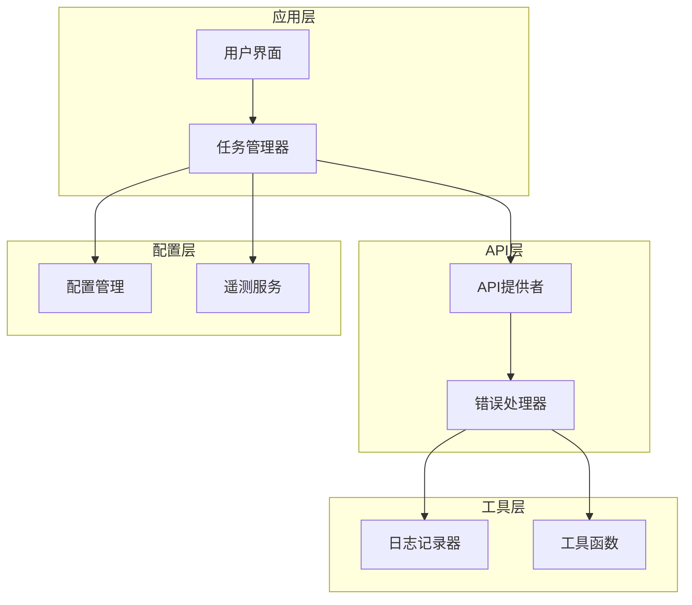
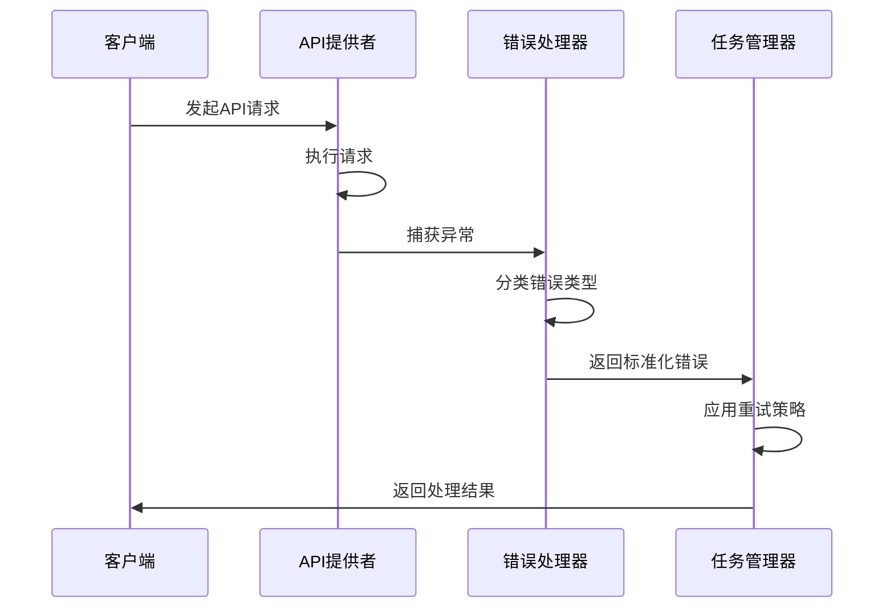
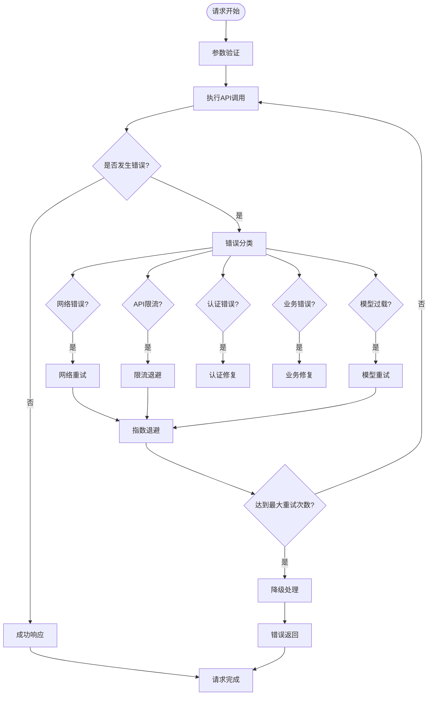
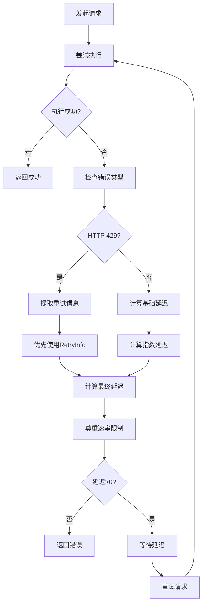
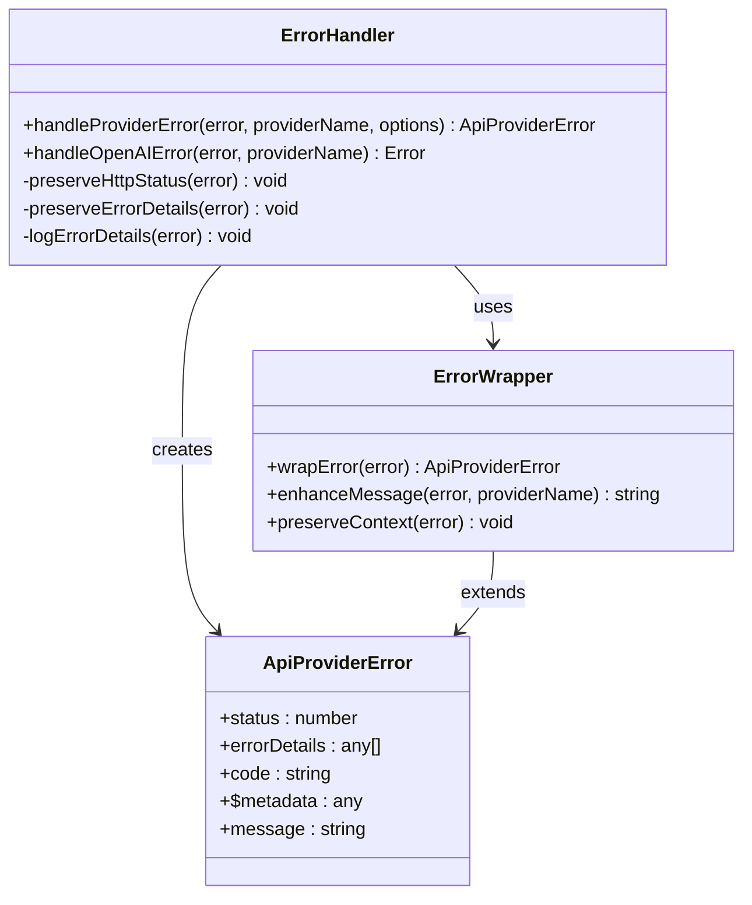
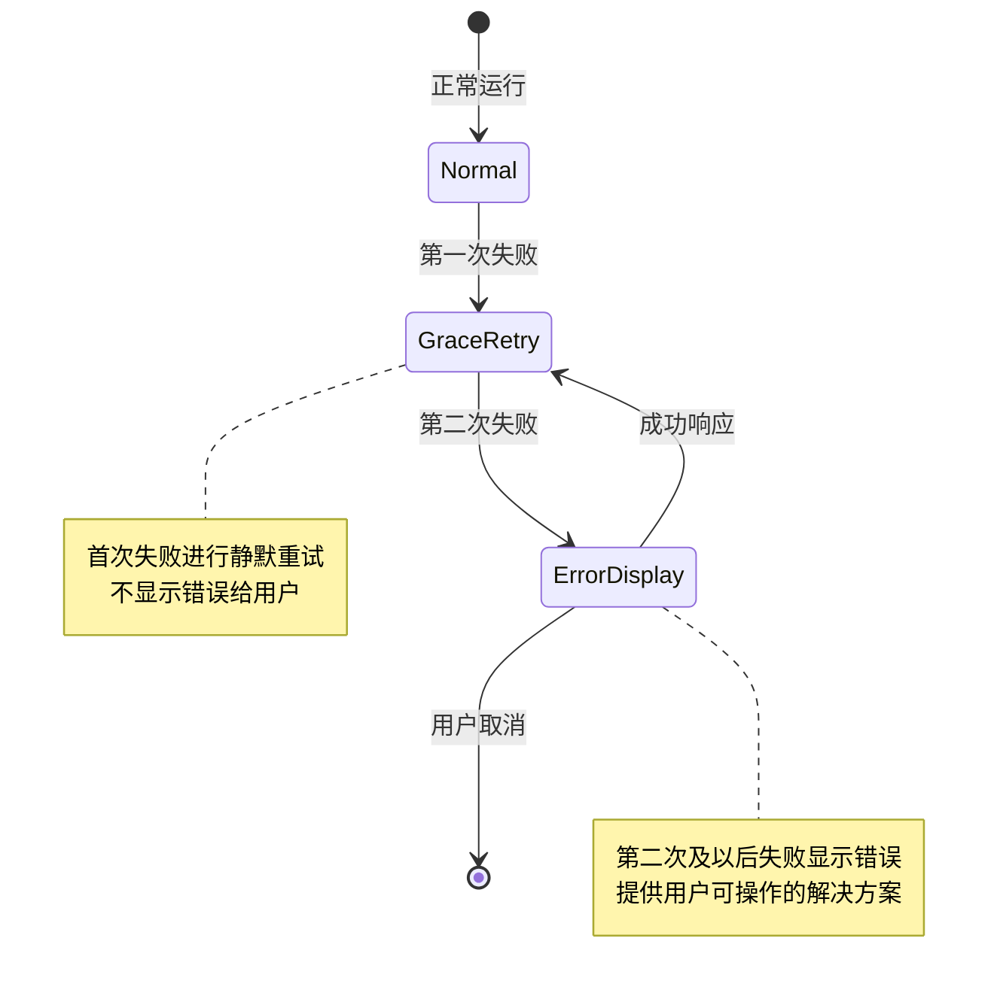
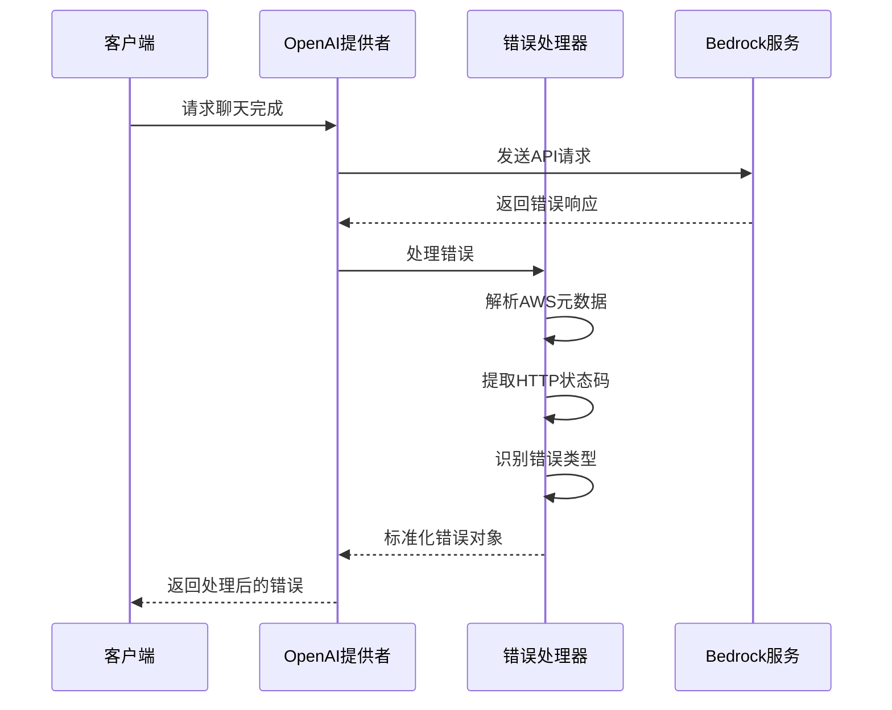
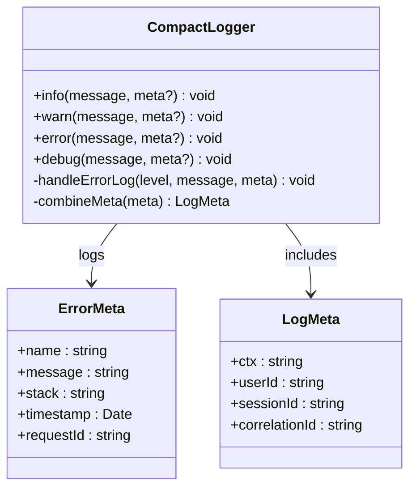
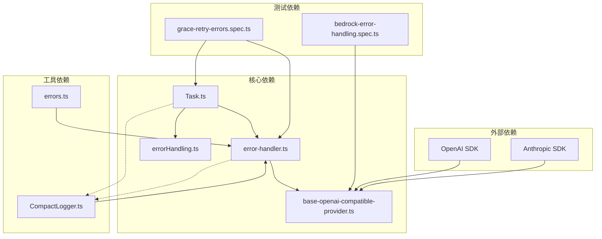

# 错误处理与重试机制

<cite>
**本文档引用的文件**
- [errorHandling.ts](file://src/utils/errorHandling.ts)
- [errors.ts](file://src/utils/errors.ts)
- [error-handler.ts](file://src/api/providers/utils/error-handler.ts)
- [openai-error-handler.ts](file://src/api/providers/utils/openai-error-handler.ts)
- [base-openai-compatible-provider.ts](file://src/api/providers/base-openai-compatible-provider.ts)
- [Task.ts](file://src/core/task/Task.ts)
- [grace-retry-errors.spec.ts](file://src/core/task/__tests__/grace-retry-errors.spec.ts)
- [bedrock-error-handling.spec.ts](file://src/api/providers/__tests__/bedrock-error-handling.spec.ts)
- [openai-error-handler.spec.ts](file://src/api/providers/utils/__tests__/openai-error-handler.spec.ts)
- [CompactLogger.ts](file://src/utils/logging/CompactLogger.ts)
</cite>

## 目录
1. [引言](#引言)
2. [项目结构](#项目结构)
3. [核心组件](#核心组件)
4. [架构概览](#架构概览)
5. [详细组件分析](#详细组件分析)
6. [依赖关系分析](#依赖关系分析)
7. [性能考虑](#性能考虑)
8. [故障排除指南](#故障排除指南)
9. [结论](#结论)

## 引言

本文件详细阐述了Njust-AI项目中的AI模型错误处理与重试机制。系统实现了统一的错误分类体系、异常捕获策略、错误恢复机制，涵盖了网络错误、API限流、模型过载等不同错误类型的处理方式。通过指数退避重试、熔断器模式、降级策略等技术手段，确保系统的稳定性和用户体验。

## 项目结构

项目采用模块化设计，错误处理机制分布在多个层次：



**图表来源**
- [Task.ts:4962-5001](file://src/core/task/Task.ts#L4962-L5001)
- [error-handler.ts:38-107](file://src/api/providers/utils/error-handler.ts#L38-L107)

**章节来源**
- [Task.ts:4932-5001](file://src/core/task/Task.ts#L4932-L5001)
- [error-handler.ts:1-116](file://src/api/providers/utils/error-handler.ts#L1-L116)

## 核心组件

### 统一错误分类体系

系统建立了完整的错误分类体系，包括：

1. **网络错误类**：连接超时、DNS解析失败、网络中断
2. **API限流类**：HTTP 429状态码、速率限制触发
3. **模型过载类**：服务器内部错误、资源不足
4. **认证错误类**：API密钥无效、权限不足
5. **业务逻辑类**：输入验证失败、参数错误

### 异常捕获策略

系统采用多层次的异常捕获策略：



**图表来源**
- [base-openai-compatible-provider.ts:106-111](file://src/api/providers/base-openai-compatible-provider.ts#L106-L111)
- [error-handler.ts:38-107](file://src/api/providers/utils/error-handler.ts#L38-L107)

**章节来源**
- [error-handler.ts:15-107](file://src/api/providers/utils/error-handler.ts#L15-L107)
- [openai-error-handler.ts:1-20](file://src/api/providers/utils/openai-error-handler.ts#L1-L20)

## 架构概览

系统采用分层架构设计，错误处理机制贯穿整个请求生命周期：



**图表来源**
- [Task.ts:4962-5001](file://src/core/task/Task.ts#L4962-L5001)
- [base-openai-compatible-provider.ts:106-111](file://src/api/providers/base-openai-compatible-provider.ts#L106-L111)

## 详细组件分析

### 指数退避重试机制

系统实现了智能的指数退避重试算法：

#### 核心重试逻辑



**图表来源**
- [Task.ts:4962-5001](file://src/core/task/Task.ts#L4962-L5001)

#### 重试参数配置

系统支持灵活的重试参数配置：

| 参数 | 默认值 | 描述 | 范围 |
|------|--------|------|------|
| baseDelay | 1秒 | 基础等待时间 | 0.1-10秒 |
| maxExponentialBackoff | 60秒 | 最大指数退避时间 | 10-300秒 |
| maxRetries | 3次 | 最大重试次数 | 1-10次 |
| rateLimitWindow | 60秒 | 速率限制窗口 | 10-120秒 |

**章节来源**
- [Task.ts:4962-5001](file://src/core/task/Task.ts#L4962-L5001)

### 错误处理器

#### 统一错误处理流程



**图表来源**
- [error-handler.ts:38-107](file://src/api/providers/utils/error-handler.ts#L38-L107)

#### 错误消息格式化

系统提供统一的错误消息格式：

```
[ProviderName] API Error: [具体错误信息]
Status: [HTTP状态码]
Code: [错误代码]
Request ID: [请求标识符]
Timestamp: [时间戳]
```

**章节来源**
- [error-handler.ts:54-94](file://src/api/providers/utils/error-handler.ts#L54-L94)

### 任务管理器错误处理

#### 连续失败检测机制

系统实现了智能的连续失败检测：



**图表来源**
- [grace-retry-errors.spec.ts:280-352](file://src/core/task/__tests__/grace-retry-errors.spec.ts#L280-L352)

#### 失败计数器管理

系统维护多个失败计数器：

| 计数器名称 | 用途 | 重置条件 |
|------------|------|----------|
| consecutiveNoAssistantMessagesCount | 检测无回复情况 | 收到有效文本内容 |
| consecutiveNoToolUseCount | 检测无工具使用 | 收到工具调用 |
| totalApiFailures | 总API失败次数 | 系统重启或手动重置 |

**章节来源**
- [grace-retry-errors.spec.ts:213-265](file://src/core/task/__tests__/grace-retry-errors.spec.ts#L213-L265)

### API提供者错误处理

#### OpenAI兼容错误处理



**图表来源**
- [bedrock-error-handling.spec.ts:70-95](file://src/api/providers/__tests__/bedrock-error-handling.spec.ts#L70-L95)

#### 错误类型识别优先级

系统采用多层错误识别机制：

1. **HTTP状态码优先**：429状态码优先于其他识别规则
2. **AWS错误类型**：ThrottlingException等特定错误类型
3. **消息模式匹配**：基于错误消息内容的模式识别
4. **通用错误处理**：默认的错误处理机制

**章节来源**
- [bedrock-error-handling.spec.ts:342-376](file://src/api/providers/__tests__/bedrock-error-handling.spec.ts#L342-L376)

### 日志记录与监控

#### 结构化日志记录

系统实现了完整的日志记录机制：



**图表来源**
- [CompactLogger.ts:95-135](file://src/utils/logging/CompactLogger.ts#L95-L135)

#### 错误统计分析

系统提供实时的错误统计功能：

| 统计指标 | 计算方式 | 用途 |
|----------|----------|------|
| 错误率 | 失败请求数/总请求数 | 监控系统稳定性 |
| 错误分布 | 按错误类型分类统计 | 识别主要问题 |
| 重试成功率 | 成功重试次数/重试尝试次数 | 评估重试效果 |
| 平均恢复时间 | 从失败到恢复的平均时间 | 优化恢复策略 |

**章节来源**
- [CompactLogger.ts:85-135](file://src/utils/logging/CompactLogger.ts#L85-L135)

## 依赖关系分析

系统各组件间的依赖关系如下：



**图表来源**
- [Task.ts:4932-5001](file://src/core/task/Task.ts#L4932-L5001)
- [error-handler.ts:1-116](file://src/api/providers/utils/error-handler.ts#L1-L116)

**章节来源**
- [Task.ts:4932-5001](file://src/core/task/Task.ts#L4932-L5001)
- [error-handler.ts:1-116](file://src/api/providers/utils/error-handler.ts#L1-L116)

## 性能考虑

### 重试策略优化

系统在性能方面采取了多项优化措施：

1. **智能退避算法**：避免过度重试造成系统压力
2. **并发控制**：限制同时进行的重试操作数量
3. **资源清理**：及时释放失败请求占用的资源
4. **缓存策略**：利用缓存减少重复请求

### 内存管理

系统实现了高效的内存管理机制：

- **垃圾回收优化**：定期清理临时错误对象
- **内存池管理**：复用常用的错误处理对象
- **监控内存使用**：实时监控内存消耗情况

## 故障排除指南

### 常见错误诊断

#### 网络连接问题

**症状**：频繁出现连接超时或DNS解析失败

**诊断步骤**：
1. 检查网络连接状态
2. 验证API端点可达性
3. 确认防火墙设置
4. 测试代理配置

**解决方案**：
- 增加重试间隔
- 配置备用API端点
- 启用连接池复用

#### API限流处理

**症状**：收到大量HTTP 429状态码响应

**诊断方法**：
1. 检查当前API使用量
2. 分析请求频率模式
3. 识别高负载时段

**缓解策略**：
- 实施更保守的退避算法
- 调整请求配额
- 启用请求队列管理

#### 认证错误排查

**症状**：API密钥验证失败

**检查清单**：
- 验证API密钥格式正确
- 确认密钥权限范围
- 检查密钥有效期
- 排查字符编码问题

**修复建议**：
- 重新生成API密钥
- 更新配置文件
- 清除缓存的密钥信息

### 调试工具使用

#### 日志分析

系统提供了丰富的调试工具：

1. **详细日志级别**：记录完整的错误堆栈信息
2. **性能指标监控**：跟踪请求延迟和吞吐量
3. **错误模式识别**：自动识别常见错误模式
4. **实时告警系统**：异常情况即时通知

#### 诊断命令

```bash
# 查看错误统计
npm run diagnostics:errors

# 监控系统健康状况
npm run diagnostics:health

# 分析重试行为
npm run diagnostics:retries

# 检查配置有效性
npm run diagnostics:config
```

**章节来源**
- [errorHandling.ts:1-16](file://src/utils/errorHandling.ts#L1-L16)
- [errors.ts:1-6](file://src/utils/errors.ts#L1-L6)

## 结论

Njust-AI项目的错误处理与重试机制展现了现代AI应用的最佳实践。通过建立统一的错误分类体系、实施智能的重试策略、提供完善的监控告警功能，系统能够在保证用户体验的同时，最大化地提高服务的稳定性和可靠性。

关键优势包括：

1. **多层次防护**：从网络层到应用层的全方位错误处理
2. **智能决策**：基于错误类型和上下文的自适应处理策略
3. **可观测性**：完整的日志记录和性能监控能力
4. **可扩展性**：模块化的架构设计便于功能扩展

未来可以进一步优化的方向包括：增强机器学习驱动的错误预测、实现更精细的资源调度、完善跨平台的错误处理一致性等。