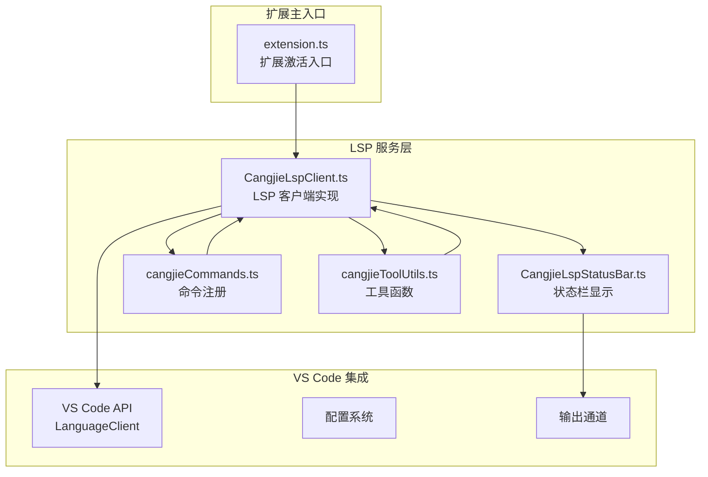
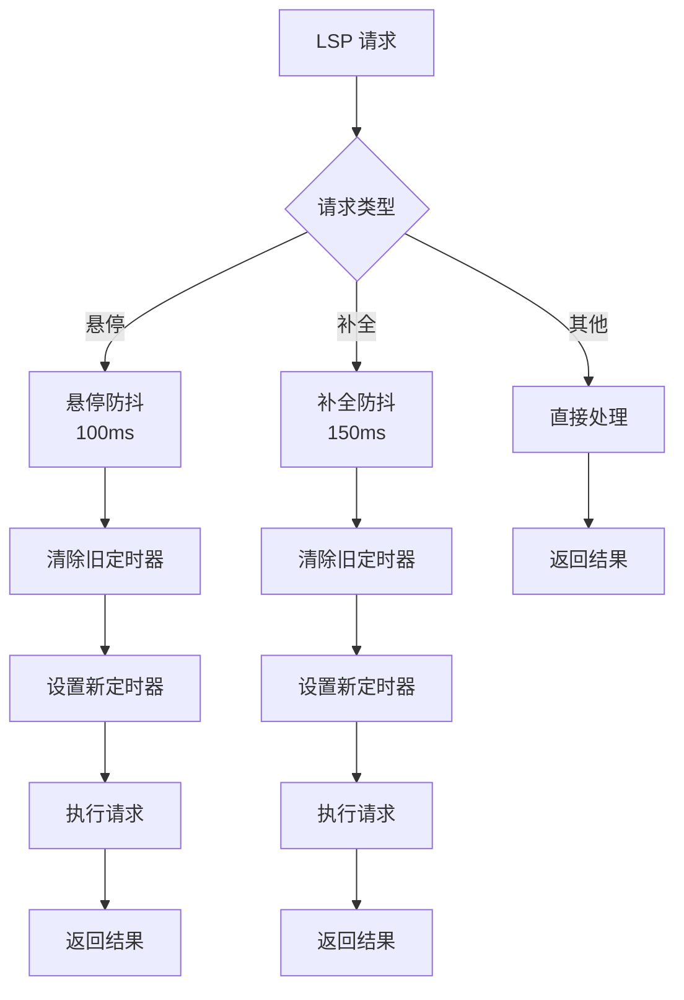
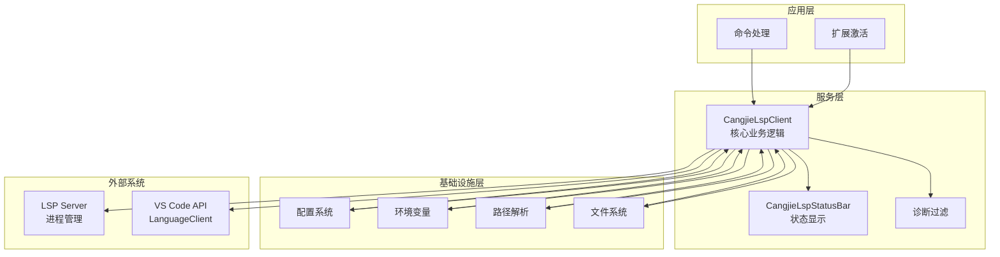
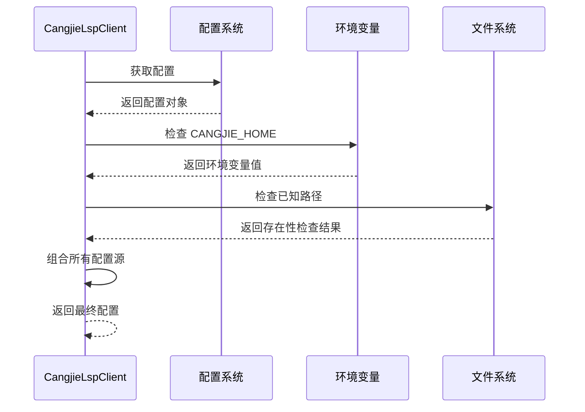
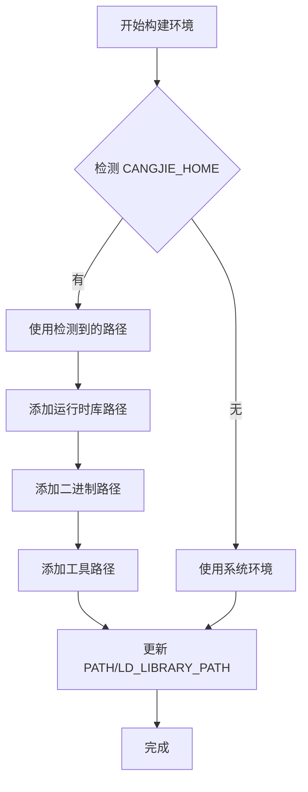
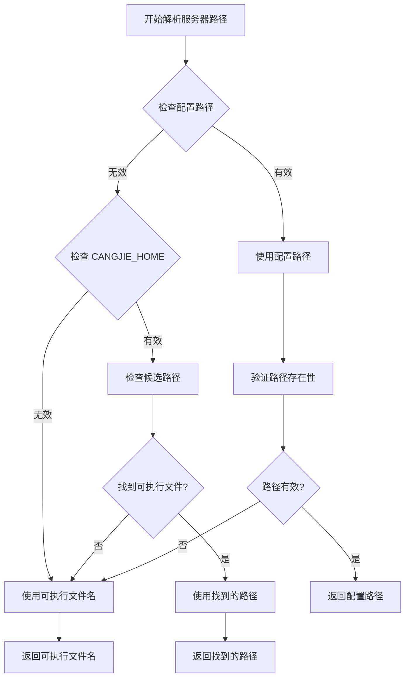
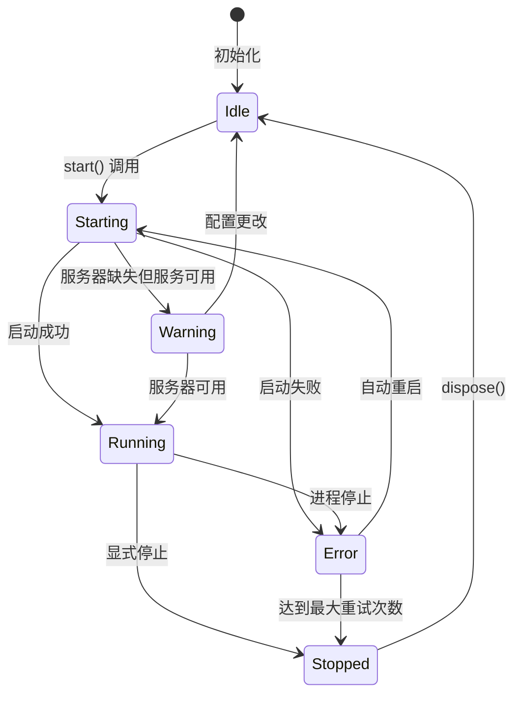
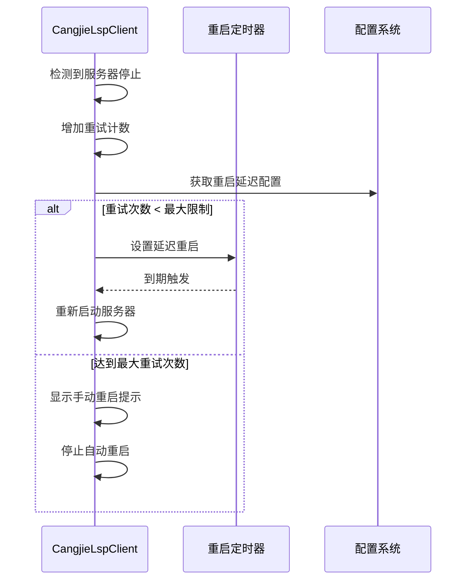
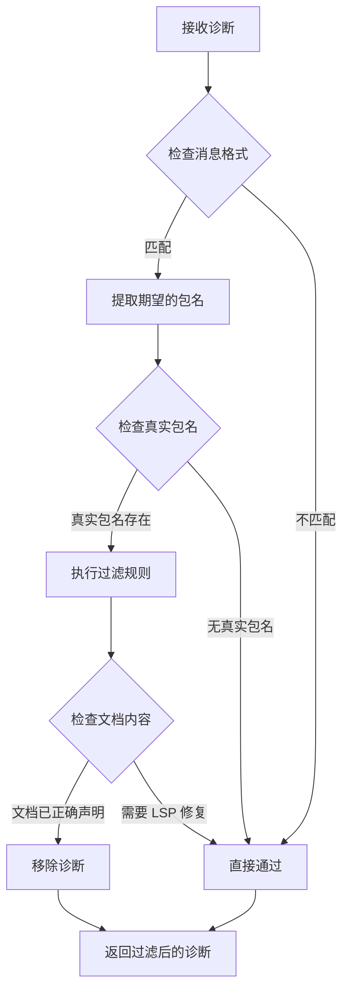
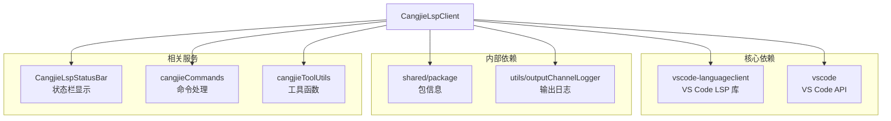

# LSP 客户端实现

<cite>
**本文档引用的文件**
- [CangjieLspClient.ts](file://src/services/cangjie-lsp/CangjieLspClient.ts)
- [extension.ts](file://src/extension.ts)
- [CangjieLspStatusBar.ts](file://src/services/cangjie-lsp/CangjieLspStatusBar.ts)
- [cangjieCommands.ts](file://src/services/cangjie-lsp/cangjieCommands.ts)
- [cangjieToolUtils.ts](file://src/services/cangjie-lsp/cangjieToolUtils.ts)
- [package.json](file://package.json)
</cite>

## 目录
1. [简介](#简介)
2. [项目结构](#项目结构)
3. [核心组件](#核心组件)
4. [架构概览](#架构概览)
5. [详细组件分析](#详细组件分析)
6. [依赖关系分析](#依赖关系分析)
7. [性能考虑](#性能考虑)
8. [故障排除指南](#故障排除指南)
9. [结论](#结论)

## 简介

Cangjie LSP 客户端是 VS Code 扩展中的核心组件，负责管理 Cangjie 语言服务器的生命周期、配置检测、环境变量构建和服务器路径解析。该客户端实现了智能的延迟启动机制、中间件防抖处理、状态管理和自动重启策略，确保了高效的开发体验和稳定的语言服务功能。

## 项目结构

Cangjie LSP 客户端位于扩展的 `src/services/cangjie-lsp` 目录中，与扩展主入口点紧密集成：

**图表来源**
- [extension.ts:191-233](file://src/extension.ts#L191-L233)
- [CangjieLspClient.ts:277-660](file://src/services/cangjie-lsp/CangjieLspClient.ts#L277-L660)

**章节来源**
- [extension.ts:191-233](file://src/extension.ts#L191-L233)
- [CangjieLspClient.ts:1-660](file://src/services/cangjie-lsp/CangjieLspClient.ts#L1-L660)

## 核心组件

### CangjieLspClient 类

CangjieLspClient 是整个 LSP 客户端的核心类，实现了完整的语言服务器管理功能：

#### 主要特性
- **智能延迟启动**: 仅在用户打开 .cj 文件时启动服务器
- **配置检测**: 支持多种配置方式（设置、环境变量、路径）
- **中间件防抖**: 对高频请求进行防抖处理
- **状态管理**: 完整的状态跟踪和事件通知
- **自动重启**: 智能的服务器崩溃恢复机制

#### 关键属性
- `_state`: 当前服务器状态（idle/starting/running/warning/error/stopped）
- `_lspOutputChannel`: LSP 输出通道
- `client`: VS Code LanguageClient 实例
- `autoRestartCount`: 自动重启计数器

**章节来源**
- [CangjieLspClient.ts:277-303](file://src/services/cangjie-lsp/CangjieLspClient.ts#L277-L303)

### 中间件机制

客户端实现了专门的防抖中间件来优化高频 LSP 请求：

**图表来源**
- [CangjieLspClient.ts:20-56](file://src/services/cangjie-lsp/CangjieLspClient.ts#L20-L56)

**章节来源**
- [CangjieLspClient.ts:20-56](file://src/services/cangjie-lsp/CangjieLspClient.ts#L20-L56)

## 架构概览

Cangjie LSP 客户端采用分层架构设计，实现了清晰的关注点分离：

**图表来源**
- [extension.ts:191-233](file://src/extension.ts#L191-L233)
- [CangjieLspClient.ts:476-525](file://src/services/cangjie-lsp/CangjieLspClient.ts#L476-L525)

## 详细组件分析

### 配置检测系统

配置检测系统支持多层级配置，确保灵活性和可靠性：

**图表来源**
- [CangjieLspClient.ts:139-182](file://src/services/cangjie-lsp/CangjieLspClient.ts#L139-L182)

#### 配置优先级
1. 用户配置设置
2. 环境变量（CANGJIE_HOME）
3. 工具链安装位置
4. 系统 PATH

**章节来源**
- [CangjieLspClient.ts:139-182](file://src/services/cangjie-lsp/CangjieLspClient.ts#L139-L182)

### 环境变量构建

环境变量构建确保 LSP 服务器能够正确找到所需的运行时库：

**图表来源**
- [CangjieLspClient.ts:188-219](file://src/services/cangjie-lsp/CangjieLspClient.ts#L188-L219)

**章节来源**
- [CangjieLspClient.ts:188-219](file://src/services/cangjie-lsp/CangjieLspClient.ts#L188-L219)

### 服务器路径解析

服务器路径解析实现了智能的二进制文件定位机制：

**图表来源**
- [CangjieLspClient.ts:228-253](file://src/services/cangjie-lsp/CangjieLspClient.ts#L228-L253)

**章节来源**
- [CangjieLspClient.ts:228-253](file://src/services/cangjie-lsp/CangjieLspClient.ts#L228-L253)

### 状态管理系统

状态管理系统提供了完整的服务器生命周期跟踪：

**图表来源**
- [CangjieLspClient.ts:270-276](file://src/services/cangjie-lsp/CangjieLspClient.ts#L270-L276)

**章节来源**
- [CangjieLspClient.ts:270-276](file://src/services/cangjie-lsp/CangjieLspClient.ts#L270-L276)

### 自动重启策略

自动重启策略实现了智能的服务器崩溃恢复机制：

**图表来源**
- [CangjieLspClient.ts:567-594](file://src/services/cangjie-lsp/CangjieLspClient.ts#L567-L594)

**章节来源**
- [CangjieLspClient.ts:567-594](file://src/services/cangjie-lsp/CangjieLspClient.ts#L567-L594)

### 诊断过滤机制

诊断过滤机制解决了包名不匹配的常见问题：

**图表来源**
- [CangjieLspClient.ts:86-129](file://src/services/cangjie-lsp/CangjieLspClient.ts#L86-L129)

**章节来源**
- [CangjieLspClient.ts:86-129](file://src/services/cangjie-lsp/CangjieLspClient.ts#L86-L129)

## 依赖关系分析

Cangjie LSP 客户端与其他组件的依赖关系如下：

**图表来源**
- [CangjieLspClient.ts:1-11](file://src/services/cangjie-lsp/CangjieLspClient.ts#L1-L11)

**章节来源**
- [CangjieLspClient.ts:1-11](file://src/services/cangjie-lsp/CangjieLspClient.ts#L1-L11)

## 性能考虑

### 防抖优化
- **悬停请求**: 100ms 防抖延迟，减少不必要的服务器调用
- **补全请求**: 150ms 防抖延迟，平衡响应速度和性能

### 延迟启动
- 仅在用户打开 .cj 文件时启动服务器
- 避免对非 Cangjie 项目造成资源浪费

### 缓存机制
- 环境变量构建结果缓存
- CANGJIE_HOME 检测结果缓存
- 减少重复的文件系统检查

### 内存管理
- 及时清理定时器和订阅者
- 正确处理异步操作的错误情况
- 避免内存泄漏

## 故障排除指南

### 服务器启动失败

**常见原因及解决方案**：
1. **缺少 CANGJIE_HOME 环境变量**
   - 解决方案：运行 SDK 的 envsetup 脚本或手动设置环境变量

2. **服务器二进制文件不存在**
   - 解决方案：检查服务器路径配置或安装 Cangjie SDK

3. **权限问题**
   - 解决方案：确保服务器二进制文件具有执行权限

**章节来源**
- [CangjieLspClient.ts:546-564](file://src/services/cangjie-lsp/CangjieLspClient.ts#L546-L564)

### 配置错误

**诊断方法**：
1. 检查 VS Code 设置中的 `njust-ai.cangjieLsp` 配置
2. 验证 CANGJIE_HOME 环境变量设置
3. 确认服务器路径的可访问性

**章节来源**
- [CangjieLspClient.ts:355-362](file://src/services/cangjie-lsp/CangjieLspClient.ts#L355-L362)

### 性能问题

**优化建议**：
1. 使用防抖中间件减少请求频率
2. 启用延迟启动避免不必要的资源消耗
3. 检查网络代理配置影响
4. 监控输出通道中的性能指标

**章节来源**
- [CangjieLspClient.ts:492-516](file://src/services/cangjie-lsp/CangjieLspClient.ts#L492-L516)

## 结论

Cangjie LSP 客户端实现了一个功能完整、性能优化的语言服务器管理解决方案。其核心优势包括：

1. **智能启动策略**: 通过延迟启动和配置检测优化资源使用
2. **稳健的错误处理**: 完善的错误捕获和自动重启机制
3. **性能优化**: 防抖中间件和缓存策略提升用户体验
4. **状态管理**: 清晰的状态跟踪和事件通知机制
5. **扩展性**: 模块化设计便于功能扩展和维护

该实现为 Cangjie 开发者提供了可靠的语言服务基础，同时保持了良好的性能表现和用户体验。