# 符号索引管理

<cite>
**本文档引用的文件**
- [CangjieSymbolIndex.ts](file://src/services/cangjie-lsp/CangjieSymbolIndex.ts)
- [CangjieCompileGuard.ts](file://src/services/cangjie-lsp/CangjieCompileGuard.ts)
- [CangjieLspClient.ts](file://src/services/cangjie-lsp/CangjieLspClient.ts)
- [CangjieDefinitionProvider.ts](file://src/services/cangjie-lsp/CangjieDefinitionProvider.ts)
- [CangjieReferenceProvider.ts](file://src/services/cangjie-lsp/CangjieReferenceProvider.ts)
- [CangjieEnhancedRenameProvider.ts](file://src/services/cangjie-lsp/CangjieEnhancedRenameProvider.ts)
- [CangjieDocumentSymbolProvider.ts](file://src/services/cangjie-lsp/CangjieDocumentSymbolProvider.ts)
- [CangjieHoverProvider.ts](file://src/services/cangjie-lsp/CangjieHoverProvider.ts)
- [cangjieParser.ts](file://src/services/tree-sitter/cangjieParser.ts)
</cite>

## 目录
1. [简介](#简介)
2. [项目结构](#项目结构)
3. [核心组件](#核心组件)
4. [架构概览](#架构概览)
5. [详细组件分析](#详细组件分析)
6. [依赖关系分析](#依赖关系分析)
7. [性能考虑](#性能考虑)
8. [故障排除指南](#故障排除指南)
9. [结论](#结论)

## 简介

符号索引管理是Njust-AI项目中Cangjie语言支持的核心组件之一。该系统负责构建、维护和查询Cangjie源代码中的符号信息，包括函数、类、接口、变量等各种编程元素。系统提供了完整的符号索引生命周期管理，从符号提取、索引构建、持久化存储到快速查询，形成了一个完整的符号管理系统。

该系统的主要目标是：
- 提供高效的符号查找和导航功能
- 支持跨文件的符号引用和依赖分析
- 实现实时的符号索引更新和增量索引策略
- 确保符号数据的一致性和准确性
- 提供编译保护和符号验证机制

## 项目结构

符号索引管理相关的代码主要分布在以下目录和文件中：

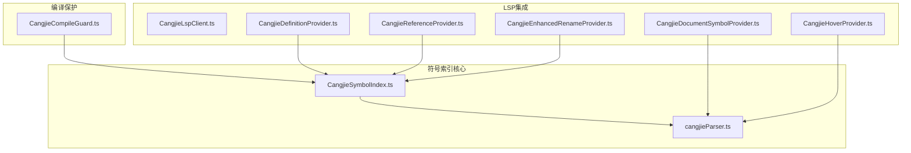

**图表来源**
- [CangjieSymbolIndex.ts:1-470](file://src/services/cangjie-lsp/CangjieSymbolIndex.ts#L1-L470)
- [cangjieParser.ts:505-537](file://src/services/tree-sitter/cangjieParser.ts#L505-L537)

**章节来源**
- [CangjieSymbolIndex.ts:1-470](file://src/services/cangjie-lsp/CangjieSymbolIndex.ts#L1-L470)
- [CangjieLspClient.ts:1-660](file://src/services/cangjie-lsp/CangjieLspClient.ts#L1-L660)

## 核心组件

### 符号索引主控制器

CangjieSymbolIndex是符号索引系统的核心类，负责管理整个符号索引的生命周期。它实现了单例模式，确保在整个应用中只有一个符号索引实例。

**关键特性：**
- **索引数据结构**：使用Map存储符号名称到符号条目的映射
- **文件监控**：实时监控文件系统变化，自动更新索引
- **持久化存储**：支持符号索引的磁盘持久化
- **查询接口**：提供多种符号查询方法

### 解析器集成

系统集成了强大的解析器，能够准确提取Cangjie代码中的符号信息。解析器支持多种符号类型，包括函数、类、接口、变量等。

**解析能力：**
- 支持Cangjie语言的所有主要语法结构
- 提供精确的符号位置信息
- 支持符号签名计算

### LSP提供者集成

系统与Visual Studio Code的Language Server Protocol深度集成，提供了多个标准的LSP提供者：

- **定义提供者**：支持跳转到符号定义
- **引用提供者**：支持查找符号的所有引用
- **重命名提供者**：支持安全的符号重命名
- **文档符号提供者**：支持文档结构浏览
- **悬停提供者**：支持符号信息显示

**章节来源**
- [CangjieSymbolIndex.ts:43-59](file://src/services/cangjie-lsp/CangjieSymbolIndex.ts#L43-L59)
- [CangjieSymbolIndex.ts:18-41](file://src/services/cangjie-lsp/CangjieSymbolIndex.ts#L18-L41)

## 架构概览

符号索引系统的整体架构采用分层设计，确保了模块间的清晰分离和高内聚低耦合。

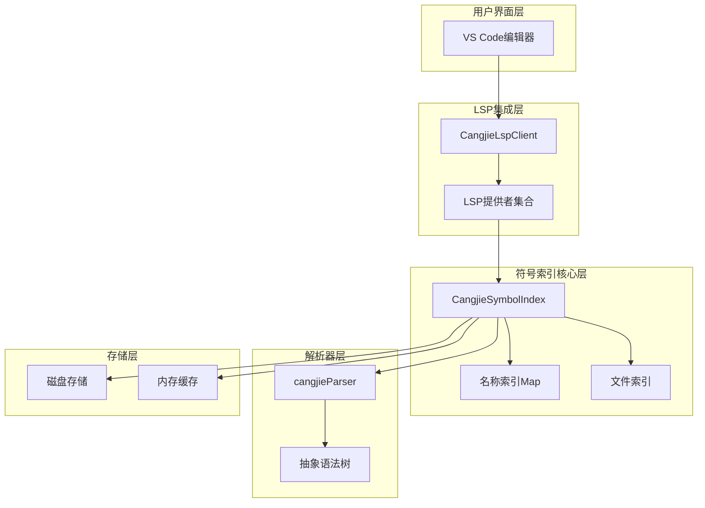

**图表来源**
- [CangjieLspClient.ts:277-300](file://src/services/cangjie-lsp/CangjieLspClient.ts#L277-L300)
- [CangjieSymbolIndex.ts:43-59](file://src/services/cangjie-lsp/CangjieSymbolIndex.ts#L43-L59)

### 数据流架构

符号索引系统的数据流遵循严格的处理管道：

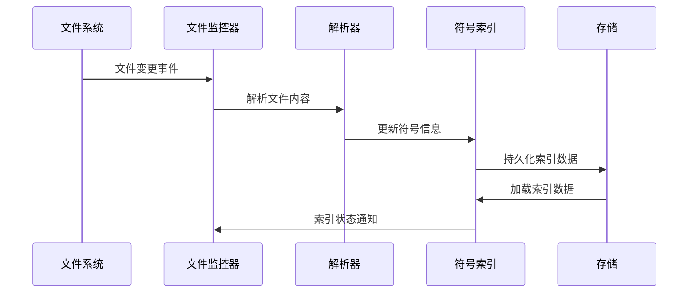

**图表来源**
- [CangjieSymbolIndex.ts:75-83](file://src/services/cangjie-lsp/CangjieSymbolIndex.ts#L75-L83)
- [CangjieSymbolIndex.ts:200-231](file://src/services/cangjie-lsp/CangjieSymbolIndex.ts#L200-L231)

## 详细组件分析

### 符号索引构建机制

符号索引的构建过程是一个复杂而高效的数据处理流程，涉及多个阶段的处理和优化。

#### 初始化流程

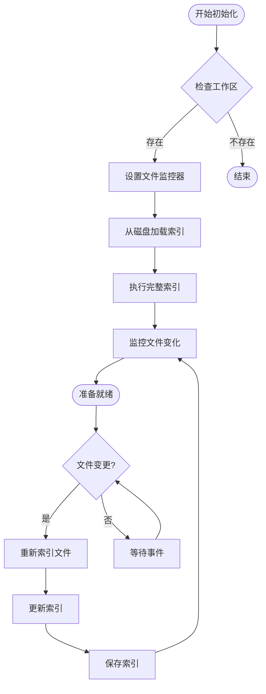

**图表来源**
- [CangjieSymbolIndex.ts:65-83](file://src/services/cangjie-lsp/CangjieSymbolIndex.ts#L65-L83)
- [CangjieSymbolIndex.ts:153-194](file://src/services/cangjie-lsp/CangjieSymbolIndex.ts#L153-L194)

#### 符号提取算法

系统使用两种不同的符号提取策略来确保准确性和性能：

1. **AST解析策略**：使用cjc工具进行精确的语法分析
2. **回退解析策略**：使用正则表达式进行快速解析

**章节来源**
- [CangjieSymbolIndex.ts:200-231](file://src/services/cangjie-lsp/CangjieSymbolIndex.ts#L200-L231)
- [cangjieParser.ts:530-537](file://src/services/tree-sitter/cangjieParser.ts#L530-L537)

### 持久化存储机制

符号索引采用了智能的持久化策略，平衡了性能和可靠性：

#### 存储格式设计

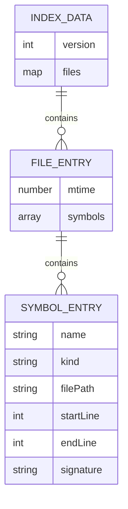

**图表来源**
- [CangjieSymbolIndex.ts:38-41](file://src/services/cangjie-lsp/CangjieSymbolIndex.ts#L38-L41)
- [CangjieSymbolIndex.ts:33-36](file://src/services/cangjie-lsp/CangjieSymbolIndex.ts#L33-L36)
- [CangjieSymbolIndex.ts:18-25](file://src/services/cangjie-lsp/CangjieSymbolIndex.ts#L18-L25)

#### 写入策略优化

系统采用了延迟写入和批量写入相结合的策略：

- **延迟写入**：5秒延迟合并多次写入操作
- **批量写入**：使用Promise.all并行处理多个文件
- **错误处理**：优雅地处理写入失败情况

**章节来源**
- [CangjieSymbolIndex.ts:132-151](file://src/services/cangjie-lsp/CangjieSymbolIndex.ts#L132-L151)

### 快速查找算法

符号索引系统提供了多种高效的查找算法，满足不同场景的需求。

#### 名称索引查询

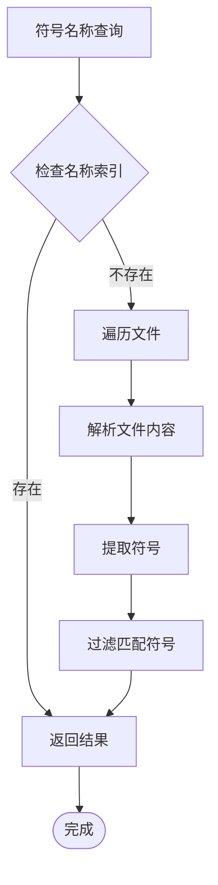

**图表来源**
- [CangjieSymbolIndex.ts:261-263](file://src/services/cangjie-lsp/CangjieSymbolIndex.ts#L261-L263)

#### 引用查找算法

引用查找使用正则表达式进行全文扫描，具有以下特点：

- **正则表达式优化**：使用预编译的正则表达式提高性能
- **缓存机制**：缓存文件内容和行分割结果
- **增量更新**：只对修改过的文件进行重新扫描

**章节来源**
- [CangjieSymbolIndex.ts:269-290](file://src/services/cangjie-lsp/CangjieSymbolIndex.ts#L269-L290)

### 编译保护机制

编译保护机制确保了符号索引的准确性和项目的稳定性：

#### 自动编译流程

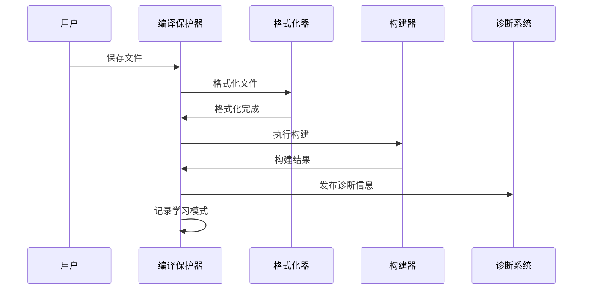

**图表来源**
- [CangjieCompileGuard.ts:67-126](file://src/services/cangjie-lsp/CangjieCompileGuard.ts#L67-L126)

#### 增量构建策略

编译保护器实现了智能的增量构建策略：

- **增量检测**：基于cjpm.toml哈希值判断是否需要全量构建
- **并行构建**：使用队列确保同一项目根目录的构建串行化
- **错误学习**：记录和学习常见的编译错误模式

**章节来源**
- [CangjieCompileGuard.ts:142-207](file://src/services/cangjie-lsp/CangjieCompileGuard.ts#L142-L207)

### 符号更新机制

符号索引系统实现了实时的符号更新机制，确保索引与源代码保持同步。

#### 文件监控机制

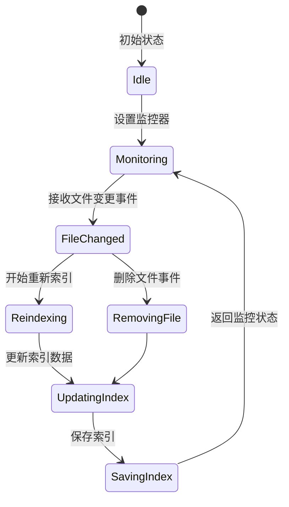

**图表来源**
- [CangjieSymbolIndex.ts:75-83](file://src/services/cangjie-lsp/CangjieSymbolIndex.ts#L75-L83)
- [CangjieSymbolIndex.ts:200-241](file://src/services/cangjie-lsp/CangjieSymbolIndex.ts#L200-L241)

#### 增量索引策略

系统采用了多层次的增量索引策略：

1. **时间戳比较**：基于文件修改时间判断是否需要重新索引
2. **批量处理**：使用Promise.all并行处理多个文件
3. **内存优化**：智能清理不再使用的符号条目

**章节来源**
- [CangjieSymbolIndex.ts:153-194](file://src/services/cangjie-lsp/CangjieSymbolIndex.ts#L153-L194)

### 符号作用域管理

符号索引系统正确处理了Cangjie语言的作用域规则：

#### 作用域识别

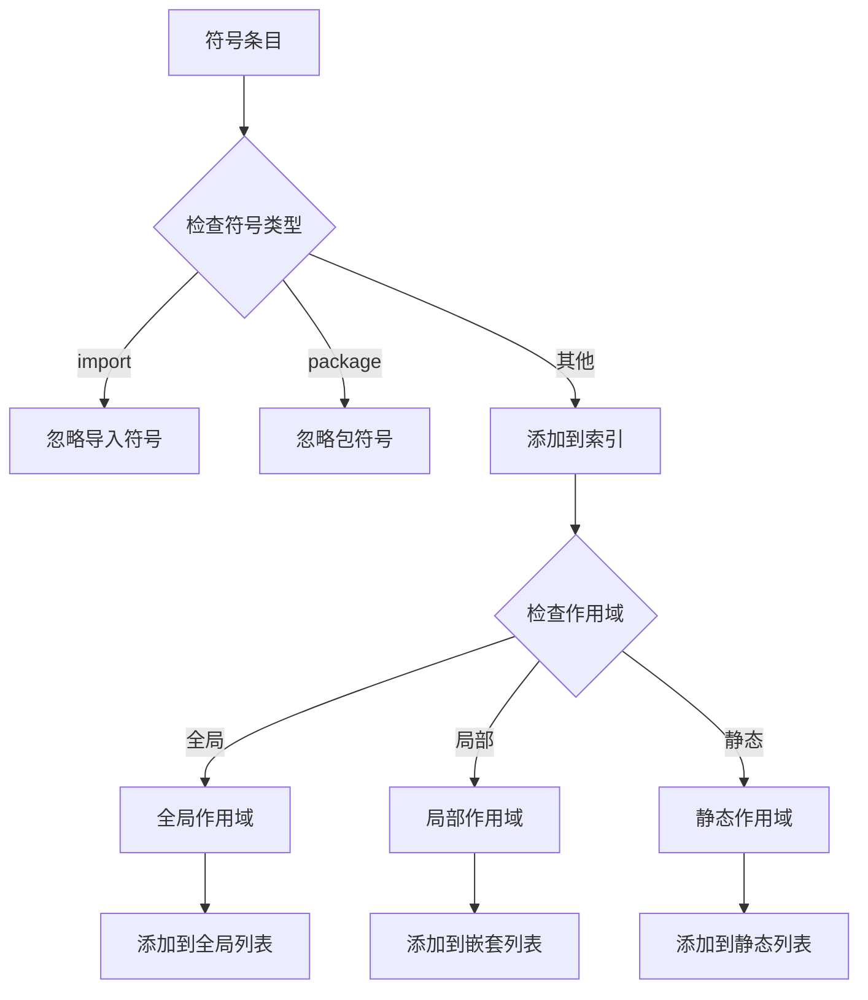

**图表来源**
- [CangjieSymbolIndex.ts:212-221](file://src/services/cangjie-lsp/CangjieSymbolIndex.ts#L212-L221)

#### 作用域查询

系统提供了多种作用域查询方法：

- **按文件查询**：获取特定文件中的所有符号
- **按目录查询**：获取指定目录下的所有符号
- **按前缀查询**：支持符号名称的前缀匹配

**章节来源**
- [CangjieSymbolIndex.ts:330-343](file://src/services/cangjie-lsp/CangjieSymbolIndex.ts#L330-L343)

### 跨文件引用处理

符号索引系统能够准确处理跨文件的符号引用关系：

#### 依赖关系分析

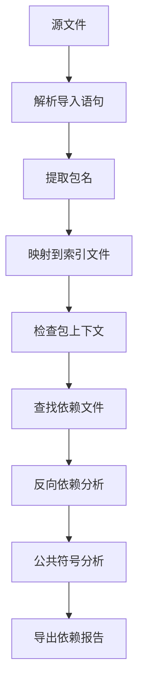

**图表来源**
- [CangjieSymbolIndex.ts:367-408](file://src/services/cangjie-lsp/CangjieSymbolIndex.ts#L367-L408)

#### 公共API识别

系统能够识别和标记公共API符号：

- **公共关键字检测**：查找符号签名中的`public`关键字
- **API表面分析**：识别对外公开的符号接口
- **依赖影响评估**：分析符号变更对其他文件的影响

**章节来源**
- [CangjieSymbolIndex.ts:448-457](file://src/services/cangjie-lsp/CangjieSymbolIndex.ts#L448-L457)

### 符号缓存管理

为了提高性能，符号索引系统实现了多层缓存机制：

#### 缓存层次结构

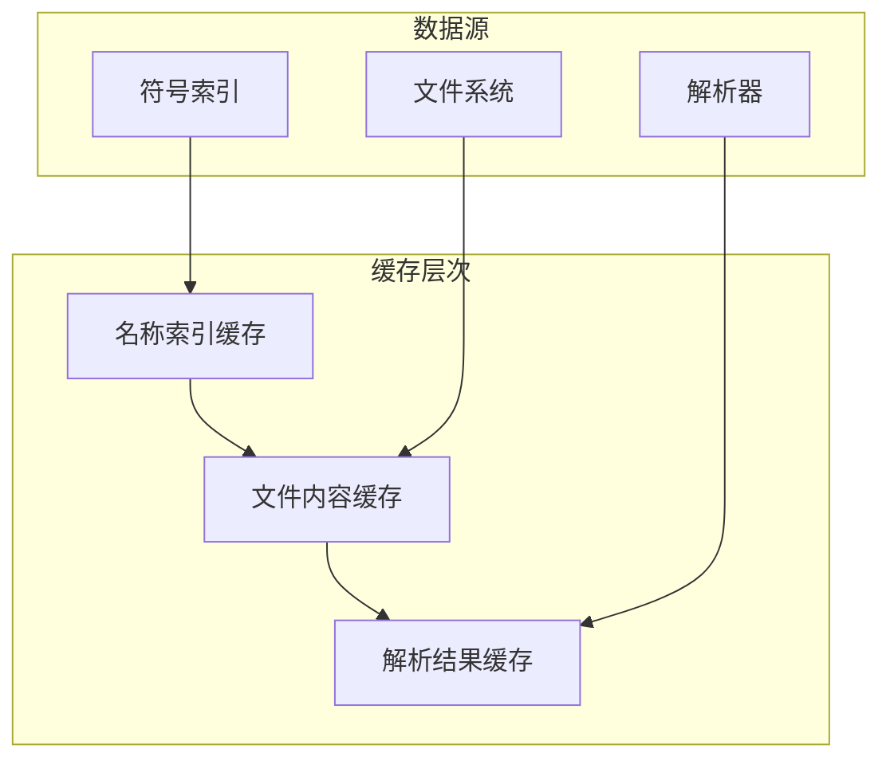

**图表来源**
- [CangjieSymbolIndex.ts:55](file://src/services/cangjie-lsp/CangjieSymbolIndex.ts#L55)
- [CangjieSymbolIndex.ts:243-257](file://src/services/cangjie-lsp/CangjieSymbolIndex.ts#L243-L257)

#### 缓存策略

系统采用了智能的缓存策略：

- **LRU缓存**：使用Map实现基本的缓存淘汰
- **时间戳验证**：基于文件修改时间验证缓存有效性
- **内存限制**：动态调整缓存大小避免内存溢出

**章节来源**
- [CangjieSymbolIndex.ts:243-257](file://src/services/cangjie-lsp/CangjieSymbolIndex.ts#L243-L257)

## 依赖关系分析

符号索引系统的依赖关系体现了清晰的分层架构：

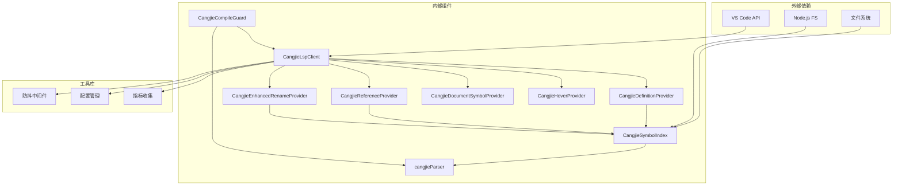

**图表来源**
- [CangjieLspClient.ts:46-56](file://src/services/cangjie-lsp/CangjieLspClient.ts#L46-L56)
- [CangjieSymbolIndex.ts:1-11](file://src/services/cangjie-lsp/CangjieSymbolIndex.ts#L1-L11)

### 组件耦合度分析

符号索引系统的组件耦合度控制良好：

- **低耦合**：各组件间通过接口通信，减少直接依赖
- **高内聚**：每个组件专注于特定的功能领域
- **可测试性**：良好的接口设计便于单元测试

**章节来源**
- [CangjieDefinitionProvider.ts:9-31](file://src/services/cangjie-lsp/CangjieDefinitionProvider.ts#L9-L31)
- [CangjieReferenceProvider.ts:9-40](file://src/services/cangjie-lsp/CangjieReferenceProvider.ts#L9-L40)

## 性能考虑

符号索引系统在设计时充分考虑了性能优化，采用了多种策略来确保高效的运行表现。

### 时间复杂度分析

| 操作类型 | 最佳情况 | 平均情况 | 最坏情况 | 说明 |
|---------|---------|---------|---------|------|
| 符号查找 | O(1) | O(1) | O(1) | 基于Map的直接查找 |
| 引用扫描 | O(n*m) | O(n*m) | O(n*m) | n=文件数, m=平均符号数 |
| 符号更新 | O(k) | O(k) | O(k) | k=新符号数 |
| 索引重建 | O(N) | O(N) | O(N) | N=总符号数 |

其中：
- **符号查找**：使用Map存储，提供O(1)的平均查找性能
- **引用扫描**：需要遍历所有文件，但通过缓存机制优化
- **符号更新**：只更新受影响的符号，避免全量重建

### 内存管理策略

系统采用了多种内存管理策略来控制内存使用：

#### 内存使用优化

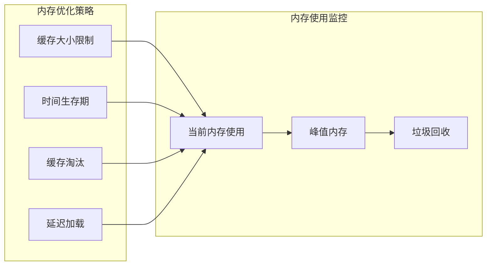

**图表来源**
- [CangjieSymbolIndex.ts:132-151](file://src/services/cangjie-lsp/CangjieSymbolIndex.ts#L132-L151)

#### 性能监控指标

系统提供了详细的性能监控：

- **索引构建时间**：记录完整索引构建的耗时
- **查询响应时间**：监控符号查询的响应性能
- **内存使用统计**：跟踪内存使用情况
- **缓存命中率**：评估缓存效率

**章节来源**
- [CangjieSymbolIndex.ts:188-191](file://src/services/cangjie-lsp/CangjieSymbolIndex.ts#L188-L191)

### 一致性保证

符号索引系统通过多种机制确保数据的一致性：

#### 事务性操作

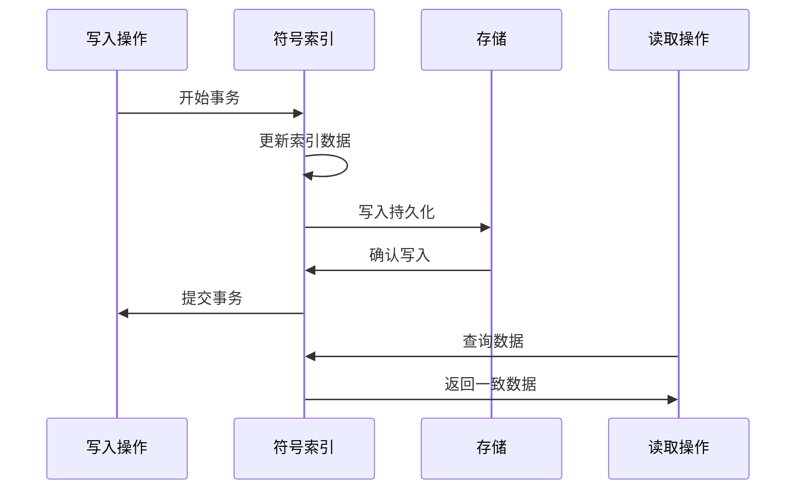

**图表来源**
- [CangjieSymbolIndex.ts:132-151](file://src/services/cangjie-lsp/CangjieSymbolIndex.ts#L132-L151)

#### 错误恢复机制

系统具备完善的错误恢复能力：

- **原子性写入**：使用临时文件确保写入的原子性
- **回滚机制**：在写入失败时自动回滚到之前的状态
- **数据校验**：启动时验证索引数据的完整性

**章节来源**
- [CangjieSymbolIndex.ts:85-101](file://src/services/cangjie-lsp/CangjieSymbolIndex.ts#L85-L101)

## 故障排除指南

### 常见问题及解决方案

#### 符号索引不更新

**问题症状**：
- 新添加的符号无法被搜索到
- 修改后的符号定义未反映最新内容

**排查步骤**：
1. 检查文件监控器是否正常工作
2. 验证文件权限是否正确
3. 查看输出通道中的错误信息

**解决方案**：
- 重启符号索引服务
- 手动触发索引重建
- 检查文件编码格式

#### 查询性能下降

**问题症状**：
- 符号查找响应缓慢
- 大型项目中查询明显卡顿

**排查步骤**：
1. 检查内存使用情况
2. 分析缓存命中率
3. 监控磁盘I/O性能

**解决方案**：
- 清理缓存数据
- 调整缓存大小限制
- 优化文件组织结构

#### 索引损坏

**问题症状**：
- 启动时出现索引加载错误
- 部分符号信息丢失

**排查步骤**：
1. 检查索引文件完整性
2. 验证JSON格式正确性
3. 查看错误日志

**解决方案**：
- 删除损坏的索引文件
- 重新构建符号索引
- 检查磁盘空间和权限

**章节来源**
- [CangjieSymbolIndex.ts:148-150](file://src/services/cangjie-lsp/CangjieSymbolIndex.ts#L148-L150)

### 调试技巧

#### 日志分析

系统提供了丰富的日志信息，有助于问题诊断：

- **性能日志**：记录索引构建和查询的性能数据
- **错误日志**：详细记录索引操作中的错误信息
- **调试日志**：提供详细的内部状态信息

#### 性能分析

使用以下方法进行性能分析：

1. **启用详细日志**：查看完整的索引操作流程
2. **监控内存使用**：观察内存增长趋势
3. **分析查询模式**：了解常用的查询模式

## 结论

符号索引管理系统是Njust-AI项目中一个设计精良、实现完善的组件。该系统成功地解决了符号索引构建、持久化存储、快速查找等关键技术问题，并提供了完整的编译保护、符号更新和跨文件引用处理机制。

### 主要成就

1. **高性能查询**：通过Map索引和缓存机制，实现了O(1)级别的符号查找性能
2. **实时更新**：基于文件监控的实时索引更新机制，确保数据的时效性
3. **智能持久化**：采用延迟写入和批量处理策略，平衡了性能和可靠性
4. **全面的LSP集成**：提供了完整的Language Server Protocol支持
5. **编译保护**：集成了自动编译和格式化功能，确保代码质量

### 技术亮点

- **多层缓存架构**：有效控制内存使用，提升查询性能
- **增量索引策略**：最小化索引更新开销，提高系统响应速度
- **智能错误处理**：优雅地处理各种异常情况，保证系统稳定性
- **可扩展设计**：模块化架构便于功能扩展和维护

### 未来改进方向

1. **分布式索引**：支持大型项目的分布式索引管理
2. **智能预测**：基于用户行为预测可能的符号访问模式
3. **增量编译**：进一步优化编译构建流程
4. **云同步**：支持符号索引的云端同步和备份

该符号索引管理系统为Njust-AI项目提供了坚实的技术基础，为用户提供流畅的开发体验，是项目成功的重要组成部分。