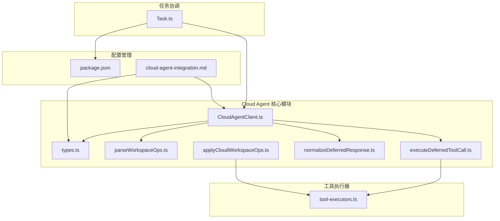
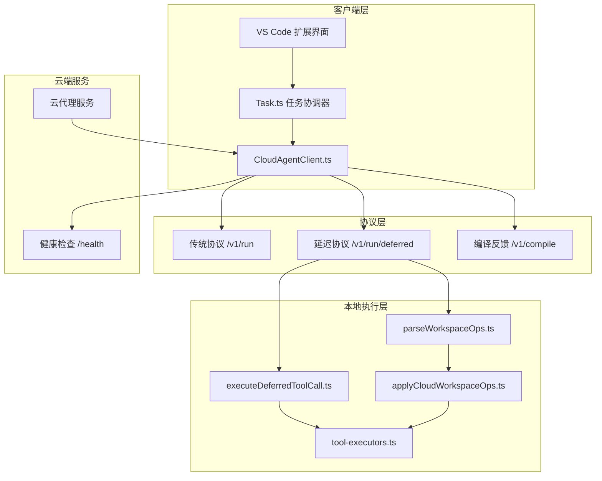
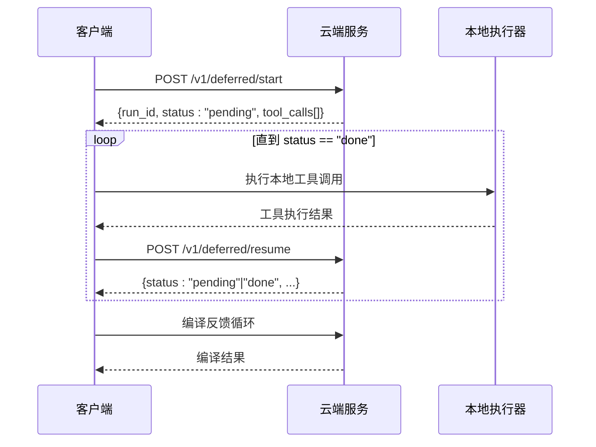
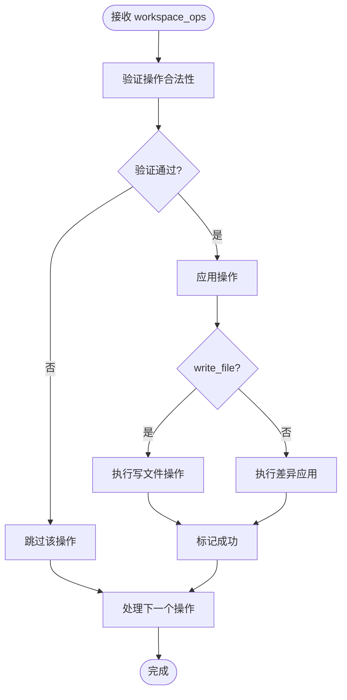
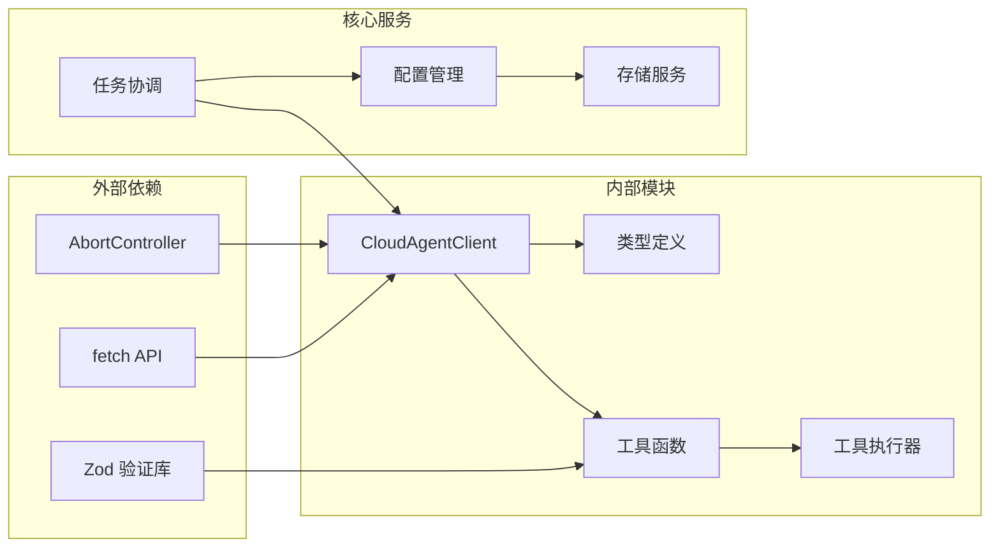

# Cloud Agent 架构

<cite>
**本文档引用的文件**
- [CloudAgentClient.ts](file://src/services/cloud-agent/CloudAgentClient.ts)
- [types.ts](file://src/services/cloud-agent/types.ts)
- [applyCloudWorkspaceOps.ts](file://src/services/cloud-agent/applyCloudWorkspaceOps.ts)
- [parseWorkspaceOps.ts](file://src/services/cloud-agent/parseWorkspaceOps.ts)
- [normalizeDeferredResponse.ts](file://src/services/cloud-agent/normalizeDeferredResponse.ts)
- [executeDeferredToolCall.ts](file://src/services/cloud-agent/executeDeferredToolCall.ts)
- [tool-executors.ts](file://src/services/mcp-server/tool-executors.ts)
- [cloud-agent-integration.md](file://docs/cloud-agent-integration.md)
- [Task.ts](file://src/core/task/Task.ts)
- [package.json](file://src/package.json)
- [test-cloud-agent-mock.mjs](file://src/test-cloud-agent-mock.mjs)
</cite>

## 目录
1. [简介](#简介)
2. [项目结构](#项目结构)
3. [核心组件](#核心组件)
4. [架构总览](#架构总览)
5. [详细组件分析](#详细组件分析)
6. [依赖关系分析](#依赖关系分析)
7. [性能考虑](#性能考虑)
8. [故障排除指南](#故障排除指南)
9. [结论](#结论)
10. [最佳实践](#最佳实践)

## 简介

Cloud Agent 架构是一个分布式任务执行系统，旨在通过云端智能代理与本地开发环境的协同工作，实现高效的代码编写、调试和维护。该架构采用 REST API 通信模式，支持两种执行协议：传统的单次请求协议和推荐的延迟执行协议。

系统的核心设计理念包括：
- **分布式协作**：云端代理负责智能决策和任务规划，本地环境负责具体的操作执行
- **状态同步**：通过结构化的状态管理和增量更新机制保持云端和本地状态的一致性
- **工作流编排**：灵活的任务执行流程，支持迭代优化和错误恢复
- **安全隔离**：严格的权限控制和路径验证，确保本地文件系统的安全

## 项目结构

Cloud Agent 架构主要分布在以下模块中：

**图表来源**
- [CloudAgentClient.ts:43-339](file://src/services/cloud-agent/CloudAgentClient.ts#L43-L339)
- [types.ts:1-102](file://src/services/cloud-agent/types.ts#L1-L102)
- [tool-executors.ts:1-208](file://src/services/mcp-server/tool-executors.ts#L1-L208)

**章节来源**
- [CloudAgentClient.ts:1-339](file://src/services/cloud-agent/CloudAgentClient.ts#L1-L339)
- [types.ts:1-102](file://src/services/cloud-agent/types.ts#L1-L102)
- [tool-executors.ts:1-208](file://src/services/mcp-server/tool-executors.ts#L1-L208)

## 核心组件

### CloudAgentClient - 主要客户端类

CloudAgentClient 是 Cloud Agent 架构的核心组件，负责与云端服务进行 HTTP 通信。该类实现了完整的 REST API 客户端功能，包括健康检查、任务提交、编译反馈和延迟执行协议。

**主要特性**：
- **认证机制**：支持设备令牌和 API 密钥双重认证
- **超时控制**：灵活的请求超时和中断机制
- **错误处理**：完善的错误捕获和用户友好的错误信息
- **协议支持**：同时支持传统和延迟执行两种协议

### 数据模型定义

系统使用 TypeScript 接口定义了完整的数据交换格式：

**核心数据类型**：
- `CloudRunResponse`：传统协议的响应格式
- `DeferredResponse`：延迟协议的响应格式
- `WorkspaceOp`：结构化工作区操作类型
- `CloudAgentCallbacks`：回调接口定义

**章节来源**
- [CloudAgentClient.ts:43-339](file://src/services/cloud-agent/CloudAgentClient.ts#L43-L339)
- [types.ts:11-102](file://src/services/cloud-agent/types.ts#L11-L102)

## 架构总览

Cloud Agent 架构采用分层设计，从底层的 HTTP 通信到上层的任务编排，形成了完整的分布式系统：

**图表来源**
- [CloudAgentClient.ts:118-206](file://src/services/cloud-agent/CloudAgentClient.ts#L118-L206)
- [cloud-agent-integration.md:13-23](file://docs/cloud-agent-integration.md#L13-L23)
- [Task.ts:2463-2478](file://src/core/task/Task.ts#L2463-L2478)

## 详细组件分析

### 延迟执行协议

延迟执行协议是 Cloud Agent 的核心创新，它允许云端代理在执行过程中动态请求本地工具调用，实现更灵活的任务编排。

**图表来源**
- [CloudAgentClient.ts:306-333](file://src/services/cloud-agent/CloudAgentClient.ts#L306-L333)
- [executeDeferredToolCall.ts:15-83](file://src/services/cloud-agent/executeDeferredToolCall.ts#L15-L83)
- [cloud-agent-integration.md:183-207](file://docs/cloud-agent-integration.md#L183-L207)

### 工作区操作处理

系统支持结构化的工作区操作，通过 `workspace_ops` 字段实现云端到本地的精确文件操作：

**图表来源**
- [parseWorkspaceOps.ts:41-61](file://src/services/cloud-agent/parseWorkspaceOps.ts#L41-L61)
- [applyCloudWorkspaceOps.ts:21-33](file://src/services/cloud-agent/applyCloudWorkspaceOps.ts#L21-L33)

### 认证与安全机制

系统实现了多层次的安全防护机制：

**认证流程**：
1. 设备令牌认证：每个设备自动生成唯一的设备令牌
2. API 密钥认证：可选的 API 密钥验证
3. 请求头验证：统一的认证头格式

**安全措施**：
- 路径验证：防止路径逃逸攻击
- 操作限制：限制操作数量和大小
- 权限控制：基于用户设置的执行权限

**章节来源**
- [CloudAgentClient.ts:96-105](file://src/services/cloud-agent/CloudAgentClient.ts#L96-L105)
- [tool-executors.ts:13-20](file://src/services/mcp-server/tool-executors.ts#L13-L20)
- [parseWorkspaceOps.ts:5-11](file://src/services/cloud-agent/parseWorkspaceOps.ts#L5-L11)

## 依赖关系分析

Cloud Agent 架构的依赖关系体现了清晰的分层设计：

**图表来源**
- [CloudAgentClient.ts:1-15](file://src/services/cloud-agent/CloudAgentClient.ts#L1-L15)
- [parseWorkspaceOps.ts:1-3](file://src/services/cloud-agent/parseWorkspaceOps.ts#L1-L3)
- [Task.ts:2463-2478](file://src/core/task/Task.ts#L2463-L2478)

**章节来源**
- [CloudAgentClient.ts:1-339](file://src/services/cloud-agent/CloudAgentClient.ts#L1-L339)
- [parseWorkspaceOps.ts:1-62](file://src/services/cloud-agent/parseWorkspaceOps.ts#L1-L62)

## 性能考虑

### 网络优化策略

Cloud Agent 架构采用了多种网络优化技术：

**连接管理**：
- 无状态 REST 设计，避免连接建立开销
- 支持请求超时和中断机制
- 统一的错误处理和重试策略

**数据传输优化**：
- 结构化的工作区操作减少冗余数据
- 分块传输和流式处理
- 压缩和缓存策略

### 本地执行优化

**并发执行**：
- 工具调用的异步执行
- 批量操作的并行处理
- 资源使用的合理分配

**内存管理**：
- 大文件操作的流式处理
- 内存使用监控和限制
- 及时的资源清理

## 故障排除指南

### 常见问题诊断

**连接问题**：
- 检查 `njust-ai.cloudAgent.serverUrl` 配置
- 验证网络连通性和防火墙设置
- 确认 API 密钥配置正确

**认证失败**：
- 验证设备令牌的有效性
- 检查 API 密钥与服务端配置匹配
- 确认请求头格式正确

**操作失败**：
- 检查工作区操作的合法性
- 验证文件路径和权限
- 确认本地工具可用性

### 调试工具

系统提供了丰富的调试功能：

**日志记录**：
- 详细的请求和响应日志
- 错误堆栈跟踪
- 性能指标监控

**配置检查**：
- 自动配置验证
- 连接状态检测
- 权限级别检查

**章节来源**
- [CloudAgentClient.ts:131-140](file://src/services/cloud-agent/CloudAgentClient.ts#L131-L140)
- [cloud-agent-integration.md:330-337](file://docs/cloud-agent-integration.md#L330-L337)

## 结论

Cloud Agent 架构通过精心设计的分布式任务执行模式，成功地将云端智能代理与本地开发环境有机结合。其核心优势包括：

**技术创新**：
- 延迟执行协议提供了灵活的任务编排能力
- 结构化的工作区操作实现了精确的本地文件管理
- 多层次的安全机制确保了系统安全性

**实用性**：
- 简洁的 REST API 设计降低了集成复杂度
- 灵活的配置选项适应不同部署场景
- 完善的错误处理提升了用户体验

**可扩展性**：
- 模块化的架构便于功能扩展
- 清晰的接口定义支持第三方集成
- 良好的性能表现支撑大规模应用

## 最佳实践

### 云端部署建议

**基础设施**：
- 使用负载均衡器处理高并发请求
- 配置适当的缓存策略提升响应速度
- 实施监控和日志收集机制

**安全配置**：
- 启用 HTTPS 和 TLS 加密
- 实施 API 速率限制和配额管理
- 定期轮换 API 密钥

### 本地集成指导

**配置优化**：
- 根据网络环境调整超时参数
- 合理设置工作区操作权限
- 配置合适的编译反馈循环

**性能调优**：
- 监控网络延迟和带宽使用
- 优化本地工具执行效率
- 实施合理的缓存策略

**故障处理**：
- 建立完善的错误报告机制
- 制定应急响应预案
- 定期进行系统健康检查

通过遵循这些最佳实践，可以充分发挥 Cloud Agent 架构的优势，构建稳定可靠的分布式开发环境。