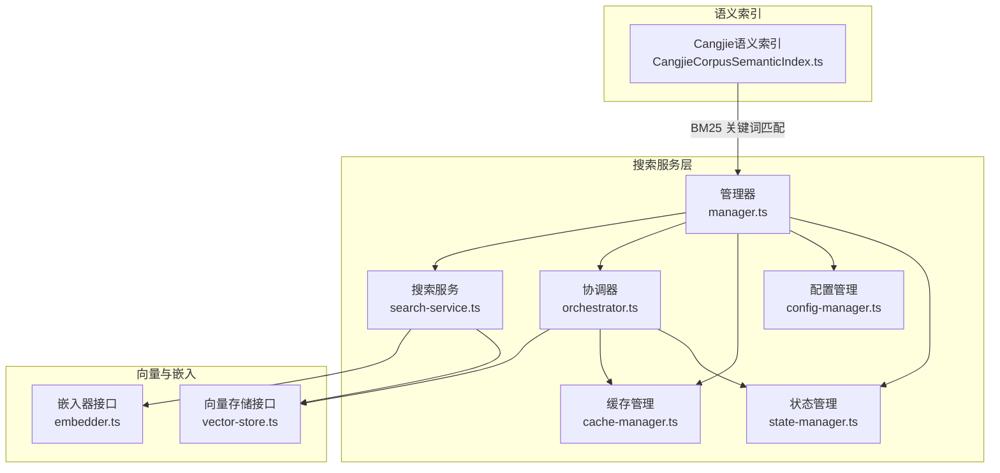
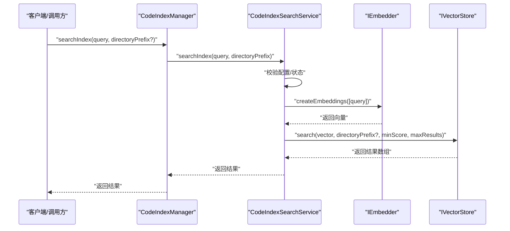
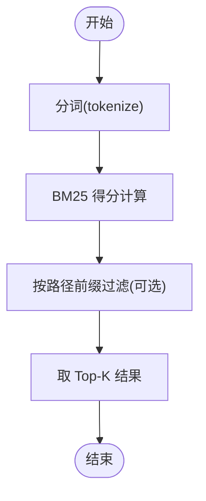
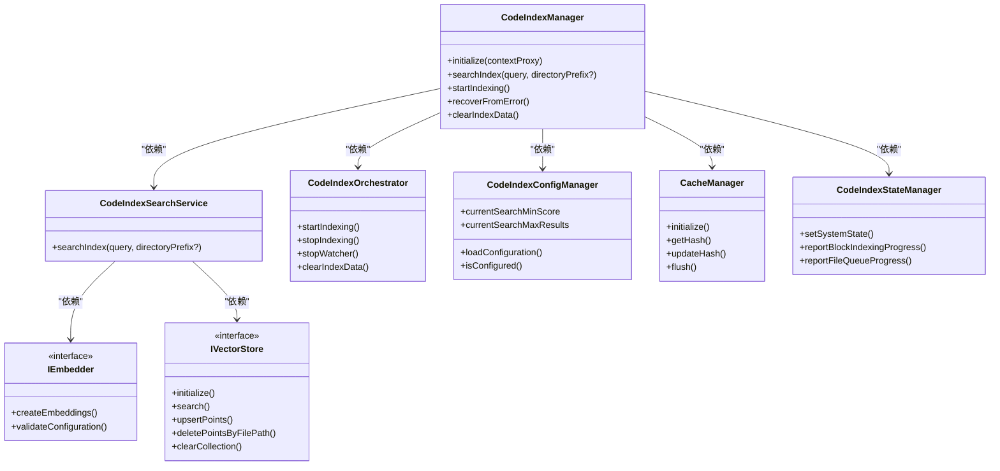

# 搜索查询处理

<cite>
**本文引用的文件**
- [search-service.ts](file://src/services/code-index/search-service.ts)
- [manager.ts](file://src/services/code-index/manager.ts)
- [orchestrator.ts](file://src/services/code-index/orchestrator.ts)
- [config-manager.ts](file://src/services/code-index/config-manager.ts)
- [cache-manager.ts](file://src/services/code-index/cache-manager.ts)
- [state-manager.ts](file://src/services/code-index/state-manager.ts)
- [vector-store.ts](file://src/services/code-index/interfaces/vector-store.ts)
- [embedder.ts](file://src/services/code-index/interfaces/embedder.ts)
- [CangjieCorpusSemanticIndex.ts](file://src/services/cangjie-corpus/CangjieCorpusSemanticIndex.ts)
- [format-score.ts](file://apps/web-Njust-AI/src/lib/format-score.ts)
</cite>

## 目录
1. [简介](#简介)
2. [项目结构](#项目结构)
3. [核心组件](#核心组件)
4. [架构总览](#架构总览)
5. [详细组件分析](#详细组件分析)
6. [依赖关系分析](#依赖关系分析)
7. [性能考虑](#性能考虑)
8. [故障排查指南](#故障排查指南)
9. [结论](#结论)
10. [附录](#附录)

## 简介
本文件面向“搜索查询处理系统”，围绕查询预处理、语义理解、向量检索、结果排序与聚合的完整流程进行深入解析，并结合仓库现有实现，补充模糊匹配算法、相关性评分机制、查询优化策略、并发查询处理、结果去重与缓存、性能监控与错误恢复等主题。文档同时提供架构图与查询流程图，帮助读者快速把握系统设计与实现要点。

## 项目结构
该搜索系统主要由以下模块构成：
- 配置管理：负责加载与校验嵌入模型、向量数据库连接、搜索阈值与最大结果数等配置。
- 状态管理：统一维护索引状态（待机/索引中/已索引/错误/停止）与进度事件。
- 缓存管理：基于文件哈希的增量扫描与缓存持久化，支持防抖写入与手动刷新。
- 搜索服务：对外提供查询入口，生成查询向量并调用向量存储检索。
- 协调器：编排索引初始化、全量/增量扫描、文件监听与批处理进度上报。
- 向量存储接口：抽象不同向量数据库客户端（如 Qdrant），统一 upsert、search、清理等操作。
- 嵌入器接口：抽象不同提供商的嵌入生成能力（OpenAI、Ollama、兼容 OpenAI 接口等）。
- 语义索引（CangjieCorpus）：提供基于 BM25 的关键词匹配与语义索引检索。

图表来源
- [manager.ts:18-466](file://src/services/code-index/manager.ts#L18-L466)
- [search-service.ts:11-66](file://src/services/code-index/search-service.ts#L11-L66)
- [orchestrator.ts:14-399](file://src/services/code-index/orchestrator.ts#L14-L399)
- [config-manager.ts:12-545](file://src/services/code-index/config-manager.ts#L12-L545)
- [cache-manager.ts:10-111](file://src/services/code-index/cache-manager.ts#L10-L111)
- [state-manager.ts:5-120](file://src/services/code-index/state-manager.ts#L5-L120)
- [vector-store.ts:10-98](file://src/services/code-index/interfaces/vector-store.ts#L10-L98)
- [embedder.ts:5-44](file://src/services/code-index/interfaces/embedder.ts#L5-L44)
- [CangjieCorpusSemanticIndex.ts:116-183](file://src/services/cangjie-corpus/CangjieCorpusSemanticIndex.ts#L116-L183)

章节来源
- [manager.ts:18-466](file://src/services/code-index/manager.ts#L18-L466)
- [search-service.ts:11-66](file://src/services/code-index/search-service.ts#L11-L66)
- [orchestrator.ts:14-399](file://src/services/code-index/orchestrator.ts#L14-L399)
- [config-manager.ts:12-545](file://src/services/code-index/config-manager.ts#L12-L545)
- [cache-manager.ts:10-111](file://src/services/code-index/cache-manager.ts#L10-L111)
- [state-manager.ts:5-120](file://src/services/code-index/state-manager.ts#L5-L120)
- [vector-store.ts:10-98](file://src/services/code-index/interfaces/vector-store.ts#L10-L98)
- [embedder.ts:5-44](file://src/services/code-index/interfaces/embedder.ts#L5-L44)
- [CangjieCorpusSemanticIndex.ts:116-183](file://src/services/cangjie-corpus/CangjieCorpusSemanticIndex.ts#L116-L183)

## 核心组件
- 配置管理（CodeIndexConfigManager）
  - 负责加载/校验嵌入器提供商、模型维度、Qdrant 连接信息、最小搜索分数与最大结果数等。
  - 提供是否需要重启的判断逻辑，以避免频繁重建服务实例。
- 状态管理（CodeIndexStateManager）
  - 统一的状态枚举与事件发布，支持块级/文件级进度上报。
- 缓存管理（CacheManager）
  - 基于文件路径哈希的缓存持久化，采用防抖写入与手动 flush，减少磁盘 IO。
- 搜索服务（CodeIndexSearchService）
  - 对外提供查询入口，生成查询向量，调用向量存储执行检索。
- 协调器（CodeIndexOrchestrator）
  - 管理索引初始化、全量/增量扫描、文件监听、批处理进度与错误处理。
- 向量存储接口（IVectorStore）
  - 抽象 upsert、search、删除、集合管理等操作，屏蔽具体向量库差异。
- 嵌入器接口（IEmbedder）
  - 抽象不同提供商的嵌入生成与配置校验。
- 语义索引（CangjieCorpusSemanticIndex）
  - 提供 BM25 关键词匹配与语义索引检索，支持懒加载与诊断消息。

章节来源
- [config-manager.ts:12-545](file://src/services/code-index/config-manager.ts#L12-L545)
- [state-manager.ts:5-120](file://src/services/code-index/state-manager.ts#L5-L120)
- [cache-manager.ts:10-111](file://src/services/code-index/cache-manager.ts#L10-L111)
- [search-service.ts:11-66](file://src/services/code-index/search-service.ts#L11-L66)
- [orchestrator.ts:14-399](file://src/services/code-index/orchestrator.ts#L14-L399)
- [vector-store.ts:10-98](file://src/services/code-index/interfaces/vector-store.ts#L10-L98)
- [embedder.ts:5-44](file://src/services/code-index/interfaces/embedder.ts#L5-L44)
- [CangjieCorpusSemanticIndex.ts:116-183](file://src/services/cangjie-corpus/CangjieCorpusSemanticIndex.ts#L116-L183)

## 架构总览
下图展示搜索查询处理在系统中的端到端交互：

图表来源
- [manager.ts:336-342](file://src/services/code-index/manager.ts#L336-L342)
- [search-service.ts:27-64](file://src/services/code-index/search-service.ts#L27-L64)
- [embedder.ts:5-21](file://src/services/code-index/interfaces/embedder.ts#L5-L21)
- [vector-store.ts:31-36](file://src/services/code-index/interfaces/vector-store.ts#L31-L36)

## 详细组件分析

### 查询预处理与语义理解
- 查询预处理
  - 通过嵌入器生成查询向量，作为后续向量检索的输入。
  - 支持目录前缀过滤，便于限定搜索范围。
- 语义理解
  - 使用嵌入模型将自然语言查询映射到高维向量空间，利用向量相似度进行语义匹配。
  - 配置管理提供最小分数阈值与最大结果数，确保检索质量与性能平衡。

章节来源
- [search-service.ts:27-64](file://src/services/code-index/search-service.ts#L27-L64)
- [config-manager.ts:525-543](file://src/services/code-index/config-manager.ts#L525-L543)
- [embedder.ts:5-21](file://src/services/code-index/interfaces/embedder.ts#L5-L21)

### 向量检索与结果排序
- 向量检索
  - 搜索服务调用向量存储的 search 方法，传入查询向量、目录前缀、最小分数与最大结果数。
  - 向量存储接口定义了统一的检索契约，便于替换不同向量库实现。
- 结果排序
  - 向量相似度通常由底层向量库计算并返回，系统在此基础上进行二次筛选（如按目录前缀过滤）。
  - 可通过最小分数阈值与最大结果数控制输出规模与质量。

章节来源
- [search-service.ts:55-57](file://src/services/code-index/search-service.ts#L55-L57)
- [vector-store.ts:31-36](file://src/services/code-index/interfaces/vector-store.ts#L31-L36)

### 语义索引（BM25 关键词匹配）
- 语义索引提供基于 BM25 的关键词匹配，适用于 Cangjie 文档语料的快速检索。
- 实现要点
  - 分词策略：中文采用双字符与单字组合，英文采用单词与驼峰拆分。
  - BM25 计算：基于词频、逆文档频率与平均文档长度，计算片段得分。
  - 懒加载：首次搜索时加载预计算索引，失败时提供诊断信息。

图表来源
- [CangjieCorpusSemanticIndex.ts:59-108](file://src/services/cangjie-corpus/CangjieCorpusSemanticIndex.ts#L59-L108)
- [CangjieCorpusSemanticIndex.ts:178-183](file://src/services/cangjie-corpus/CangjieCorpusSemanticIndex.ts#L178-L183)

章节来源
- [CangjieCorpusSemanticIndex.ts:59-108](file://src/services/cangjie-corpus/CangjieCorpusSemanticIndex.ts#L59-L108)
- [CangjieCorpusSemanticIndex.ts:178-183](file://src/services/cangjie-corpus/CangjieCorpusSemanticIndex.ts#L178-L183)

### 并发查询处理与结果聚合
- 并发查询
  - 系统未显式实现多线程/异步队列调度；建议在上层调用处对查询进行并发限制与去重。
- 结果聚合
  - 可将向量检索与语义索引结果按得分加权合并，再进行去重与排序。
- 去重算法
  - 基于文件路径与代码块范围的元组去重，或基于内容哈希的近似去重。

[本节为概念性说明，不直接分析具体文件，故无章节来源]

### 查询优化策略
- 查询向量化
  - 使用高质量嵌入模型，合理设置最小分数阈值与最大结果数。
- 目录前缀过滤
  - 在搜索服务中传入目录前缀，缩小检索空间。
- 缓存与增量扫描
  - 利用缓存管理记录文件哈希，跳过未变更文件，显著降低索引成本。

章节来源
- [search-service.ts:49-57](file://src/services/code-index/search-service.ts#L49-L57)
- [cache-manager.ts:73-94](file://src/services/code-index/cache-manager.ts#L73-L94)

### 查询缓存、性能监控与错误恢复
- 查询缓存
  - 缓存管理采用防抖写入与手动 flush，减少频繁磁盘 IO。
- 性能监控
  - 状态管理提供事件发布，协调器在索引过程中上报块级/文件级进度。
- 错误恢复
  - 管理器提供 recoverFromError 方法，清除错误状态并强制重新初始化，确保后续操作可用。

章节来源
- [cache-manager.ts:28-31](file://src/services/code-index/cache-manager.ts#L28-L31)
- [state-manager.ts:58-114](file://src/services/code-index/state-manager.ts#L58-L114)
- [manager.ts:277-301](file://src/services/code-index/manager.ts#L277-L301)

### 相关性评分机制
- 向量相似度
  - 由底层向量库计算，系统通过最小分数阈值进行二次过滤。
- BM25 关键词匹配
  - 基于 TF-IDF 的 BM25 公式，结合文档长度归一化，适合关键词检索场景。
- 结果格式化
  - Web 展示侧提供分数格式化工具，便于用户阅读。

章节来源
- [CangjieCorpusSemanticIndex.ts:89-108](file://src/services/cangjie-corpus/CangjieCorpusSemanticIndex.ts#L89-L108)
- [format-score.ts:1-1](file://apps/web-Njust-AI/src/lib/format-score.ts#L1-L1)

## 依赖关系分析
- 组件耦合
  - CodeIndexManager 作为门面，协调 SearchService、Orchestrator、CacheManager、ConfigManager、StateManager。
  - SearchService 依赖 IEmbedder 与 IVectorStore，体现良好的接口隔离。
- 外部依赖
  - 向量存储接口抽象不同提供商（如 Qdrant），便于替换与扩展。
  - 嵌入器接口抽象多种提供商，支持本地与云端模型。

图表来源
- [manager.ts:18-466](file://src/services/code-index/manager.ts#L18-L466)
- [search-service.ts:11-66](file://src/services/code-index/search-service.ts#L11-L66)
- [orchestrator.ts:14-399](file://src/services/code-index/orchestrator.ts#L14-L399)
- [config-manager.ts:12-545](file://src/services/code-index/config-manager.ts#L12-L545)
- [cache-manager.ts:10-111](file://src/services/code-index/cache-manager.ts#L10-L111)
- [state-manager.ts:5-120](file://src/services/code-index/state-manager.ts#L5-L120)
- [vector-store.ts:10-98](file://src/services/code-index/interfaces/vector-store.ts#L10-L98)
- [embedder.ts:5-44](file://src/services/code-index/interfaces/embedder.ts#L5-L44)

## 性能考虑
- 向量检索性能
  - 合理设置最小分数阈值与最大结果数，避免返回过多低质量结果。
  - 使用目录前缀过滤，减少向量库扫描范围。
- 索引构建性能
  - 利用缓存管理的文件哈希，跳过未变更文件，缩短增量扫描时间。
  - 协调器在全量扫描前标记“索引不完整”，扫描完成后标记完成，便于后续增量扫描。
- 写入与持久化
  - 缓存管理采用防抖写入，批量落盘，降低磁盘压力。
- 语义索引
  - BM25 检索适合关键词匹配，可与向量检索互补，提高召回率。

[本节为通用性能建议，不直接分析具体文件，故无章节来源]

## 故障排查指南
- 索引状态异常
  - 通过状态管理器的事件订阅观察系统状态变化，定位卡顿或停滞阶段。
- 搜索失败
  - 检查配置管理器的配置有效性与最小分数阈值设置；确认嵌入器配置校验通过。
- 错误恢复
  - 使用管理器的 recoverFromError 方法清除错误状态并强制重新初始化。
- 缓存一致性
  - 当索引失败或网络中断时，协调器会根据情况清理缓存，避免缓存与向量库不一致。

章节来源
- [state-manager.ts:33-56](file://src/services/code-index/state-manager.ts#L33-L56)
- [config-manager.ts:233-277](file://src/services/code-index/config-manager.ts#L233-L277)
- [manager.ts:277-301](file://src/services/code-index/manager.ts#L277-L301)
- [orchestrator.ts:297-332](file://src/services/code-index/orchestrator.ts#L297-L332)

## 结论
该搜索查询处理系统通过清晰的分层设计与接口抽象，实现了从查询预处理、语义理解、向量检索到结果排序与聚合的完整链路。配合缓存管理与状态监控，系统具备较好的增量更新与错误恢复能力。建议在上层引入并发控制与结果去重策略，并结合 BM25 与向量检索的混合策略进一步提升查询精度与响应时间。

## 附录
- 相关性评分
  - 向量相似度与 BM25 得分可结合使用，形成多路召回与重排序的混合方案。
- 查询优化
  - 优先使用目录前缀过滤与最小分数阈值，其次考虑增加最大结果数以提升召回。
- 高并发处理
  - 在调用层实现查询队列与去重，避免重复计算；对慢查询进行超时与取消控制。

[本节为概念性总结，不直接分析具体文件，故无章节来源]