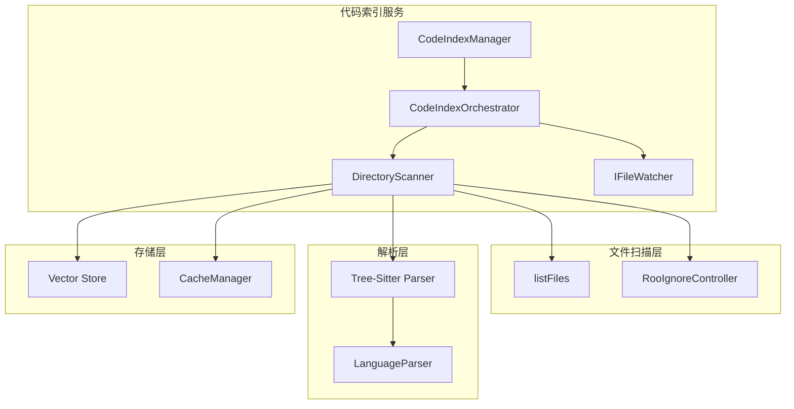
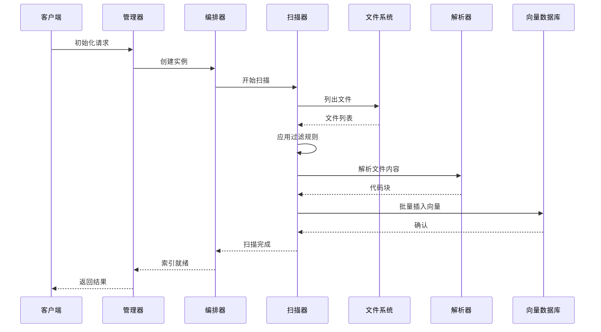
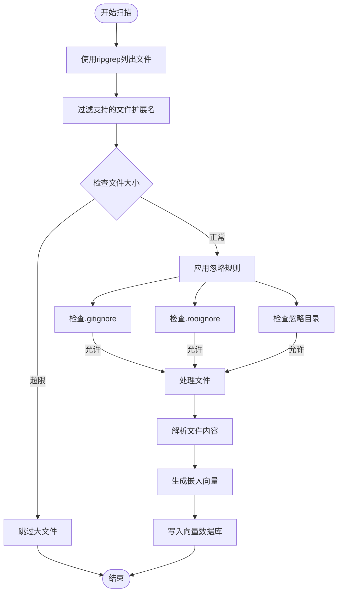
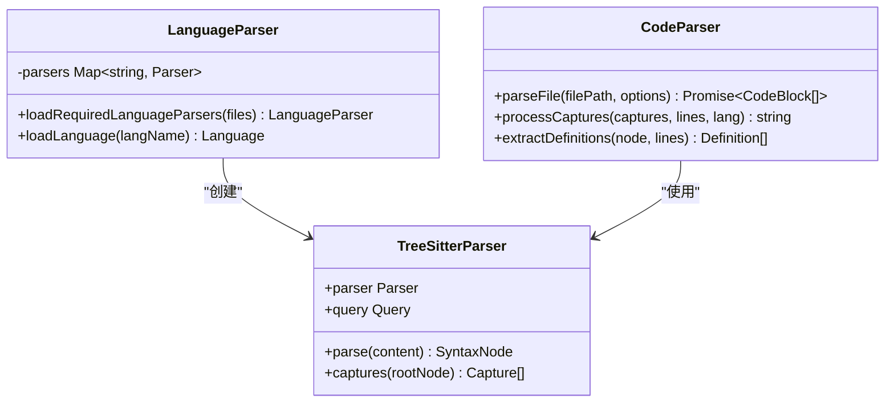
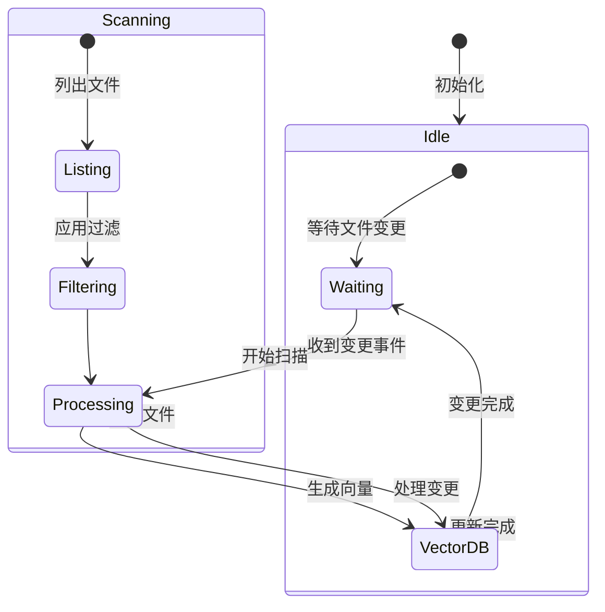
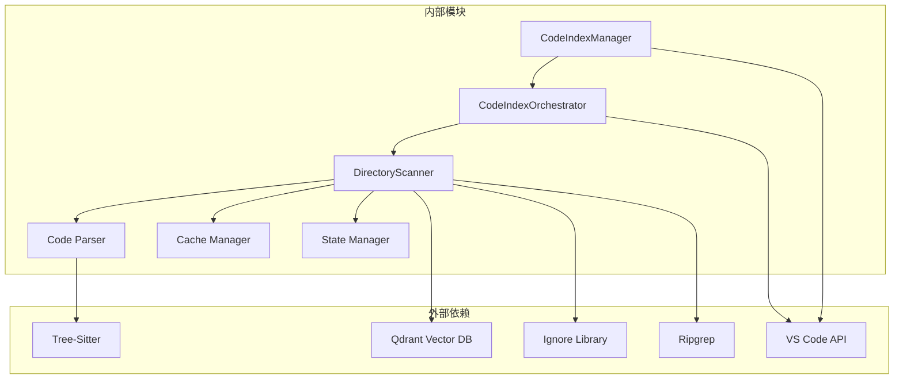
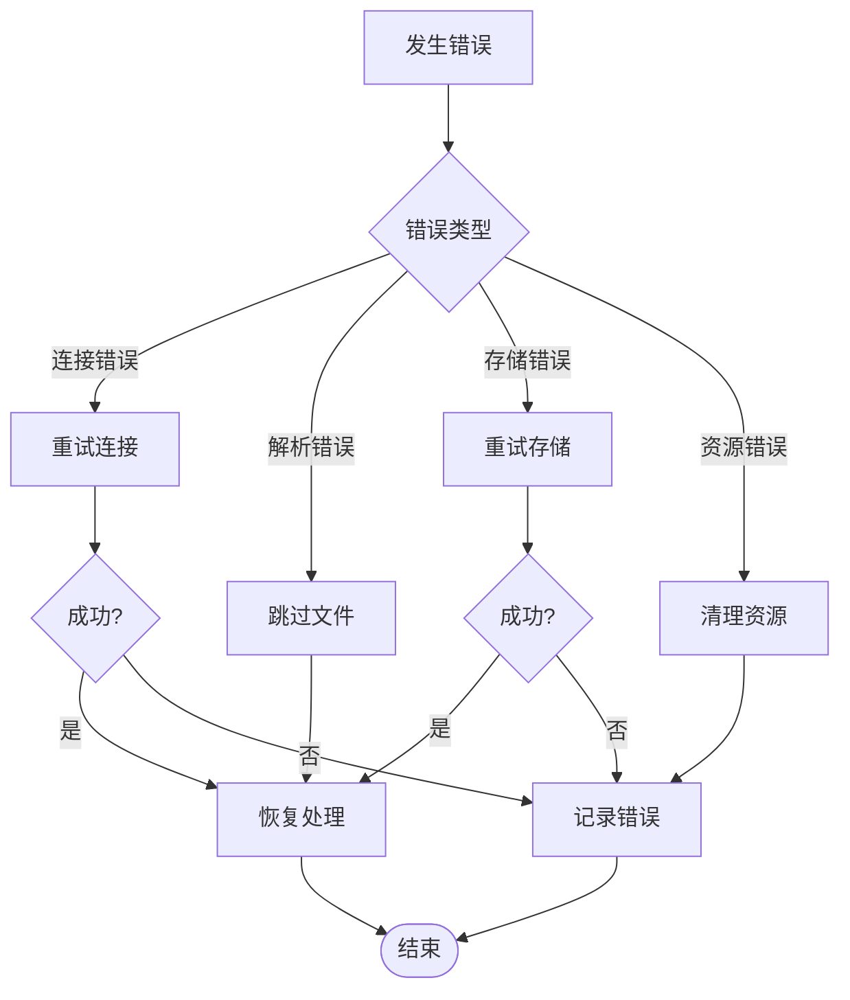

# 文件处理流水线

<cite>
**本文档引用的文件**
- [src/services/code-index/manager.ts](file://src/services/code-index/manager.ts)
- [src/services/code-index/orchestrator.ts](file://src/services/code-index/orchestrator.ts)
- [src/services/code-index/processors/scanner.ts](file://src/services/code-index/processors/scanner.ts)
- [src/services/glob/list-files.ts](file://src/services/glob/list-files.ts)
- [src/core/ignore/RooIgnoreController.ts](file://src/core/ignore/RooIgnoreController.ts)
- [src/services/treessitter/languageParser.ts](file://src/services/treessitter/languageParser.ts)
- [src/services/treessitter/index.ts](file://src/services/treessitter/index.ts)
- [src/core/tools/ReadFileTool.ts](file://src/core/tools/ReadFileTool.ts)
- [src/services/code-index/constants.ts](file://src/services/code-index/constants.ts)
- [src/services/code-index/shared/supported-extensions.ts](file://src/services/code-index/shared/supported-extensions.ts)
</cite>

## 目录
1. [简介](#简介)
2. [项目结构](#项目结构)
3. [核心组件](#核心组件)
4. [架构概览](#架构概览)
5. [详细组件分析](#详细组件分析)
6. [依赖关系分析](#依赖关系分析)
7. [性能考虑](#性能考虑)
8. [故障排除指南](#故障排除指南)
9. [结论](#结论)

## 简介

文件处理流水线是Njust-AI项目中的核心组件，负责扫描、解析和索引代码文件，为AI助手提供智能搜索和上下文理解能力。该流水线实现了完整的文件处理生命周期，包括文件扫描、过滤、解析、嵌入向量化和索引存储。

## 项目结构

文件处理流水线主要分布在以下模块中：

**图表来源**
- [src/services/code-index/manager.ts:18-92](file://src/services/code-index/manager.ts#L18-L92)
- [src/services/code-index/orchestrator.ts:14-27](file://src/services/code-index/orchestrator.ts#L14-L27)
- [src/services/code-index/processors/scanner.ts:32-57](file://src/services/code-index/processors/scanner.ts#L32-L57)

**章节来源**
- [src/services/code-index/manager.ts:1-466](file://src/services/code-index/manager.ts#L1-L466)
- [src/services/code-index/orchestrator.ts:1-399](file://src/services/code-index/orchestrator.ts#L1-L399)

## 核心组件

### 代码索引管理器 (CodeIndexManager)

CodeIndexManager是整个文件处理流水线的协调者，负责初始化和管理所有相关服务。它实现了单例模式，确保每个工作区只有一个实例。

**主要职责：**
- 初始化配置管理器、状态管理器、服务工厂
- 创建和管理缓存管理器
- 协调索引服务的启动和停止
- 处理设置变更和错误恢复

### 编排器 (CodeIndexOrchestrator)

编排器负责协调整个索引流程，包括初始扫描和增量更新。它监控文件系统变化，自动处理新文件和修改的文件。

**关键特性：**
- 支持全量扫描和增量扫描
- 实时文件变更检测
- 批处理优化和并发控制
- 错误处理和恢复机制

### 目录扫描器 (DirectoryScanner)

目录扫描器是文件处理的核心组件，负责递归扫描目录、过滤文件、解析内容并生成嵌入向量。

**处理流程：**
1. 使用ripgrep快速列出文件
2. 应用.gitignore和.rooignore过滤规则
3. 检查文件大小限制
4. 解析文件内容
5. 生成代码块和嵌入向量
6. 批量写入向量数据库

**章节来源**
- [src/services/code-index/processors/scanner.ts:67-371](file://src/services/code-index/processors/scanner.ts#L67-L371)

## 架构概览

文件处理流水线采用分层架构设计，每层都有明确的职责分离：

**图表来源**
- [src/services/code-index/manager.ts:162-214](file://src/services/code-index/manager.ts#L162-L214)
- [src/services/code-index/orchestrator.ts:92-333](file://src/services/code-index/orchestrator.ts#L92-L333)
- [src/services/code-index/processors/scanner.ts:67-371](file://src/services/code-index/processors/scanner.ts#L67-L371)

## 详细组件分析

### 文件扫描与过滤

#### 文件扫描器实现

文件扫描器使用ripgrep进行高效的文件发现，结合多种过滤机制确保只处理需要的文件：

**图表来源**
- [src/services/code-index/processors/scanner.ts:78-104](file://src/services/code-index/processors/scanner.ts#L78-L104)
- [src/services/glob/list-files.ts:33-76](file://src/services/glob/list-files.ts#L33-L76)

#### 忽略规则处理

系统实现了多层次的文件过滤机制：

**1. .gitignore规则**
- 自动加载和应用.gitignore文件
- 支持路径模式匹配
- 递归目录扫描时正确处理

**2. .rooignore规则**
- 自定义忽略文件，支持标准语法
- 实时文件监听和热更新
- 命令执行安全验证

**3. 内置忽略规则**
- 隐藏目录过滤（除显式目标外）
- 临时文件和缓存目录
- 特定开发工具生成的文件

**章节来源**
- [src/services/glob/list-files.ts:326-592](file://src/services/glob/list-files.ts#L326-L592)
- [src/core/ignore/RooIgnoreController.ts:64-116](file://src/core/ignore/RooIgnoreController.ts#L64-L116)

### 代码解析器实现

#### Tree-Sitter集成

系统使用Tree-Sitter作为主要的代码解析引擎，支持多种编程语言：

**支持的语言扩展：**
- JavaScript/TypeScript/JSX/TSX
- Python, Rust, Go
- C/C++, C#
- Ruby, Java, PHP
- Swift, Kotlin
- HTML, CSS, Vue
- Elixir, Lua, Solidity

**解析流程：**
1. 动态加载WASM格式的语言解析器
2. 使用查询语言提取代码结构
3. 生成标准化的代码块
4. 应用语义标记和上下文信息

**图表来源**
- [src/services/treessitter/languageParser.ts:78-231](file://src/services/treessitter/languageParser.ts#L78-L231)
- [src/services/treessitter/index.ts:314-351](file://src/services/treessitter/index.ts#L314-L351)

**章节来源**
- [src/services/treessitter/languageParser.ts:1-232](file://src/services/treessitter/languageParser.ts#L1-L232)
- [src/services/treessitter/index.ts:121-351](file://src/services/treessitter/index.ts#L121-L351)

### 增量索引更新

#### 文件监听器实现

系统实现了高效的文件变更检测机制：

**图表来源**
- [src/services/code-index/orchestrator.ts:32-83](file://src/services/code-index/orchestrator.ts#L32-L83)
- [src/services/code-index/processors/scanner.ts:127-264](file://src/services/code-index/processors/scanner.ts#L127-L264)

**关键特性：**
- 实时文件系统监控
- 批处理优化减少数据库压力
- 并发控制防止资源竞争
- 自动重试机制处理临时失败

**章节来源**
- [src/services/code-index/orchestrator.ts:32-83](file://src/services/code-index/orchestrator.ts#L32-L83)
- [src/services/code-index/processors/scanner.ts:127-371](file://src/services/code-index/processors/scanner.ts#L127-L371)

### 配置选项与参数

系统提供了丰富的配置选项来优化性能和行为：

**文件大小限制：**
- 默认最大文件大小：10MB
- 超限文件自动跳过
- 支持配置调整

**并发控制：**
- 解析并发数：10个文件同时解析
- 批处理并发数：5个批次同时处理
- 最大挂起批次：10个批次排队

**批处理配置：**
- 批处理阈值：100个代码块
- 最大重试次数：3次
- 初始重试延迟：1秒

**章节来源**
- [src/services/code-index/constants.ts:1-200](file://src/services/code-index/constants.ts#L1-L200)
- [src/services/code-index/processors/scanner.ts:33-57](file://src/services/code-index/processors/scanner.ts#L33-L57)

## 依赖关系分析

文件处理流水线的依赖关系呈现清晰的层次结构：

**图表来源**
- [src/services/code-index/manager.ts:1-17](file://src/services/code-index/manager.ts#L1-L17)
- [src/services/code-index/processors/scanner.ts:1-31](file://src/services/code-index/processors/scanner.ts#L1-L31)

**依赖特点：**
- 松耦合设计，模块间接口清晰
- 外部依赖通过适配器模式封装
- 支持插件化扩展新的语言解析器
- 缓存机制减少重复计算

**章节来源**
- [src/services/code-index/manager.ts:1-466](file://src/services/code-index/manager.ts#L1-L466)
- [src/services/code-index/processors/scanner.ts:1-485](file://src/services/code-index/processors/scanner.ts#L1-L485)

## 性能考虑

### 大文件处理优化

系统针对大文件场景进行了专门优化：

**内存管理：**
- 文件大小预检查，避免加载超大文件
- 流式处理减少内存占用
- 及时释放解析器资源

**I/O优化：**
- 使用ripgrep进行高效文件发现
- 批量数据库操作减少网络往返
- 缓存机制避免重复解析

### 并发处理策略

**多级并发控制：**
1. **文件解析并发**：限制同时解析的文件数量
2. **批处理并发**：控制向量数据库操作的并发度
3. **队列管理**：动态调整处理队列长度

**资源保护机制：**
- 信号量防止资源过度使用
- 异步互斥锁保证数据一致性
- 超时机制避免死锁

### 资源消耗优化

**智能缓存策略：**
- 基于文件哈希的增量更新
- LRU缓存淘汰机制
- 磁盘空间自动清理

**错误恢复：**
- 分布式错误处理
- 自动重试和退避算法
- 部分失败不影响整体进度

## 故障排除指南

### 常见问题诊断

**索引失败排查：**
1. 检查向量数据库连接状态
2. 验证文件权限和访问权限
3. 确认磁盘空间充足
4. 查看日志中的具体错误信息

**性能问题诊断：**
1. 监控CPU和内存使用率
2. 检查网络连接稳定性
3. 验证并发设置是否合理
4. 分析批处理大小影响

### 错误恢复机制

系统实现了完善的错误恢复机制：

**章节来源**
- [src/services/code-index/orchestrator.ts:297-333](file://src/services/code-index/orchestrator.ts#L297-L333)
- [src/services/code-index/processors/scanner.ts:452-483](file://src/services/code-index/processors/scanner.ts#L452-L483)

## 结论

文件处理流水线通过精心设计的架构和优化策略，实现了高效、可靠的代码文件处理能力。其主要优势包括：

**技术优势：**
- 多层次过滤确保处理效率
- Tree-Sitter解析提供准确的语法理解
- 智能缓存机制减少重复计算
- 完善的错误处理和恢复机制

**可扩展性：**
- 插件化的语言解析器支持
- 模块化设计便于功能扩展
- 配置驱动的参数调整
- 良好的性能监控和调优

该流水线为AI助手提供了强大的代码理解和检索能力，是整个Njust-AI生态系统的重要基础设施。