# Webview 通信架构

<cite>
**本文档引用的文件**
- [ClineProvider.ts](file://src/core/webview/ClineProvider.ts)
- [messageEnhancer.ts](file://src/core/webview/messageEnhancer.ts)
- [webviewMessageHandler.ts](file://src/core/webview/webviewMessageHandler.ts)
- [skillsMessageHandler.ts](file://src/core/webview/skillsMessageHandler.ts)
- [getNonce.ts](file://src/core/webview/getNonce.ts)
- [getUri.ts](file://src/core/webview/getUri.ts)
- [WebviewMessage.ts](file://src/shared/WebviewMessage.ts)
- [webviewMessageHandler.spec.ts](file://src/core/webview/__tests__/webviewMessageHandler.spec.ts)
</cite>

## 目录
1. [简介](#简介)
2. [项目结构](#项目结构)
3. [核心组件](#核心组件)
4. [架构概览](#架构概览)
5. [详细组件分析](#详细组件分析)
6. [依赖关系分析](#依赖关系分析)
7. [性能考虑](#性能考虑)
8. [故障排除指南](#故障排除指南)
9. [结论](#结论)

## 简介

本文件详细阐述了 VS Code 扩展中 Webview 通信架构的设计与实现。该架构实现了扩展宿主与 Webview 之间的双向通信机制，包括消息传递协议、数据序列化方案、ClineProvider 实现模式、消息路由机制、状态同步策略等。文档还涵盖了 Webview 初始化流程、UI 更新机制、用户交互处理的数据流，以及通信安全机制、消息验证和错误处理策略。

## 项目结构

Webview 通信架构主要由以下核心模块组成：

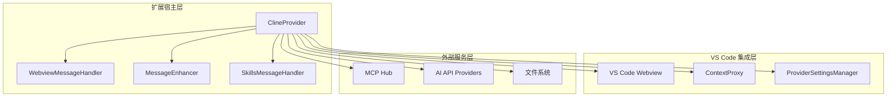

**图表来源**
- [ClineProvider.ts:126-135](file://src/core/webview/ClineProvider.ts#L126-L135)
- [webviewMessageHandler.ts:30-48](file://src/core/webview/webviewMessageHandler.ts#L30-L48)
- [messageEnhancer.ts:27-91](file://src/core/webview/messageEnhancer.ts#L27-L91)

**章节来源**
- [ClineProvider.ts:126-135](file://src/core/webview/ClineProvider.ts#L126-L135)
- [webviewMessageHandler.ts:30-48](file://src/core/webview/webviewMessageHandler.ts#L30-L48)

## 核心组件

### ClineProvider 类

ClineProvider 是 Webview 通信架构的核心控制器，负责管理 Webview 生命周期、状态同步和消息路由。

**关键特性：**
- 实现了 `vscode.WebviewViewProvider` 接口
- 继承自 `EventEmitter` 支持事件驱动架构
- 提供任务栈管理功能
- 实现全局状态管理

**主要职责：**
- Webview 初始化和销毁
- 状态同步和广播
- 任务生命周期管理
- 外部服务集成

**章节来源**
- [ClineProvider.ts:126-312](file://src/core/webview/ClineProvider.ts#L126-L312)

### WebviewMessageHandler

负责处理来自 Webview 的消息请求，实现消息路由和业务逻辑执行。

**核心功能：**
- 消息类型分发
- 业务逻辑执行
- 错误处理和回退机制
- 状态更新协调

**章节来源**
- [webviewMessageHandler.ts:81-522](file://src/core/webview/webviewMessageHandler.ts#L81-L522)

### MessageEnhancer

提供消息增强功能，通过 AI 生成更高质量的提示词。

**主要能力：**
- 基于配置的 AI 提示词增强
- 任务历史上下文整合
- 错误恢复和降级处理

**章节来源**
- [messageEnhancer.ts:27-137](file://src/core/webview/messageEnhancer.ts#L27-L137)

## 架构概览

Webview 通信架构采用事件驱动和消息路由相结合的设计模式：

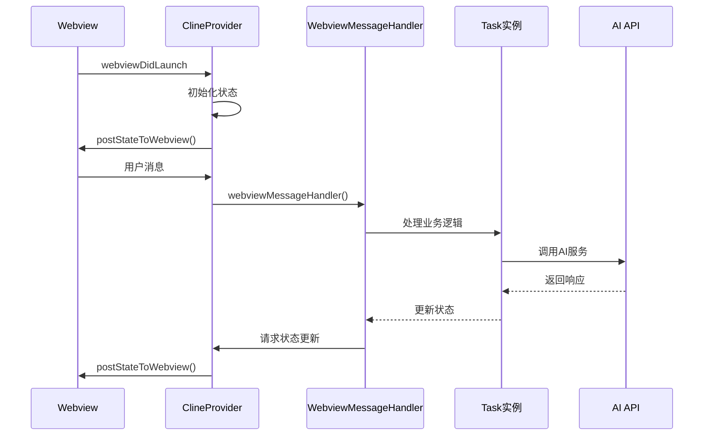

**图表来源**
- [ClineProvider.ts:730-800](file://src/core/webview/ClineProvider.ts#L730-L800)
- [webviewMessageHandler.ts:522-619](file://src/core/webview/webviewMessageHandler.ts#L522-L619)

## 详细组件分析

### ClineProvider 实现模式

ClineProvider 采用了工厂模式和单例模式的混合实现：

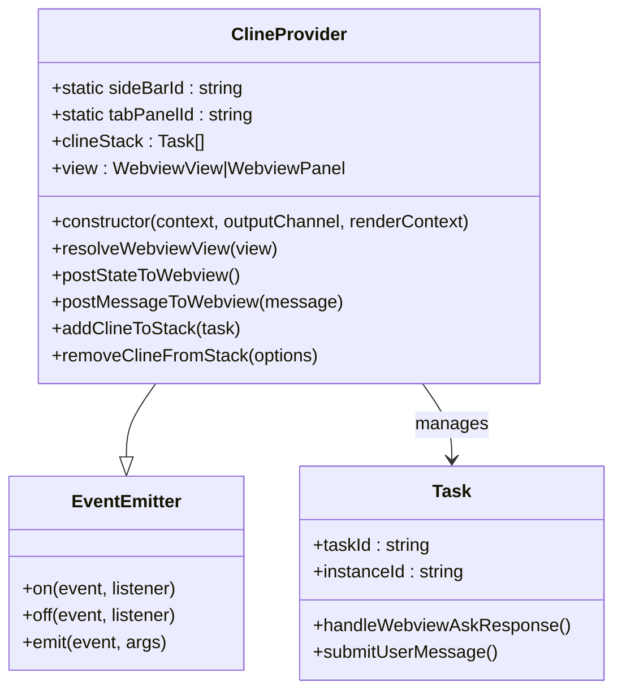

**图表来源**
- [ClineProvider.ts:126-175](file://src/core/webview/ClineProvider.ts#L126-L175)
- [ClineProvider.ts:374-480](file://src/core/webview/ClineProvider.ts#L374-L480)

**实现特点：**
- 使用任务栈管理多任务并发
- 实现了完整的生命周期管理
- 提供事件驱动的消息处理机制

**章节来源**
- [ClineProvider.ts:126-480](file://src/core/webview/ClineProvider.ts#L126-L480)

### 消息路由机制

消息路由通过 switch 语句实现，支持多种消息类型：

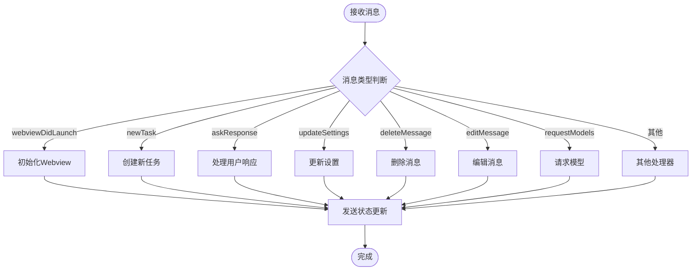

**图表来源**
- [webviewMessageHandler.ts:522-800](file://src/core/webview/webviewMessageHandler.ts#L522-L800)

**消息类型支持：**
- Webview 初始化消息
- 任务管理消息
- 设置更新消息
- 文件操作消息
- 技能管理消息

**章节来源**
- [webviewMessageHandler.ts:522-800](file://src/core/webview/webviewMessageHandler.ts#L522-L800)

### 状态同步策略

状态同步采用增量更新和序列号机制：

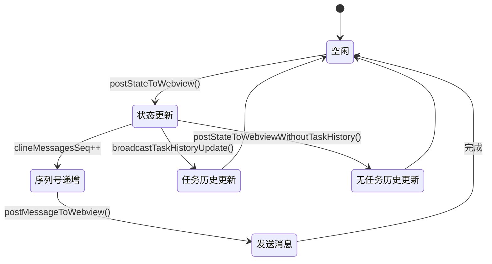

**图表来源**
- [ClineProvider.ts:1862-1883](file://src/core/webview/ClineProvider.ts#L1862-L1883)
- [ClineProvider.ts:2405-2421](file://src/core/webview/ClineProvider.ts#L2405-L2421)

**同步策略：**
- 单调递增的序列号防止过期状态
- 任务历史的增量更新避免大数据传输
- 延迟写入机制优化性能

**章节来源**
- [ClineProvider.ts:1862-1883](file://src/core/webview/ClineProvider.ts#L1862-L1883)
- [ClineProvider.ts:2405-2421](file://src/core/webview/ClineProvider.ts#L2405-L2421)

### Webview 初始化流程

Webview 初始化包含多个阶段的安全检查和资源准备：

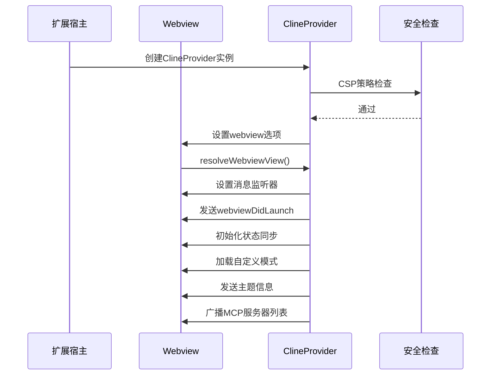

**图表来源**
- [ClineProvider.ts:730-800](file://src/core/webview/ClineProvider.ts#L730-L800)
- [ClineProvider.ts:1205-1268](file://src/core/webview/ClineProvider.ts#L1205-L1268)

**初始化步骤：**
- 内容安全策略(CSP)配置
- 资源根目录设置
- 开发环境热重载支持
- 终端集成配置同步

**章节来源**
- [ClineProvider.ts:730-800](file://src/core/webview/ClineProvider.ts#L730-L800)
- [ClineProvider.ts:1205-1268](file://src/core/webview/ClineProvider.ts#L1205-L1268)

### UI 更新机制

UI 更新采用响应式设计，支持增量更新和批量更新：

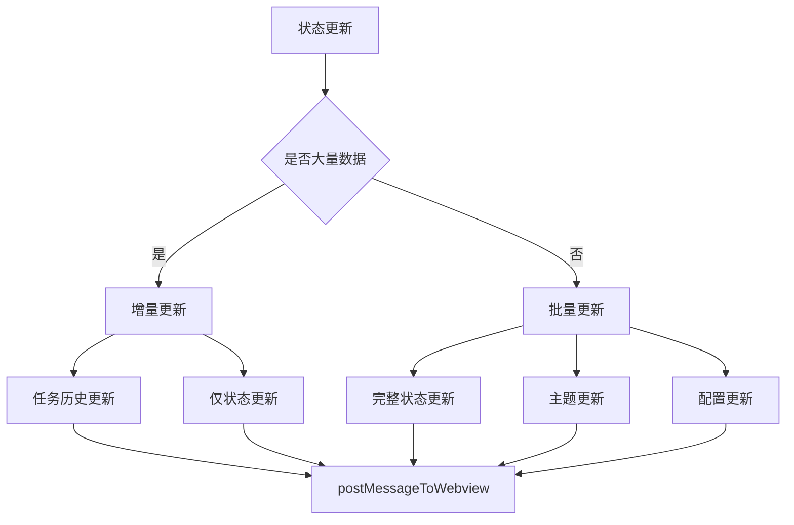

**图表来源**
- [ClineProvider.ts:1862-1883](file://src/core/webview/ClineProvider.ts#L1862-L1883)

**更新策略：**
- 大数据量时使用增量更新
- 小数据量时使用批量更新
- 主题和配置变化的特殊处理

**章节来源**
- [ClineProvider.ts:1862-1883](file://src/core/webview/ClineProvider.ts#L1862-L1883)

### 用户交互处理

用户交互通过统一的消息接口处理，支持多种输入方式：

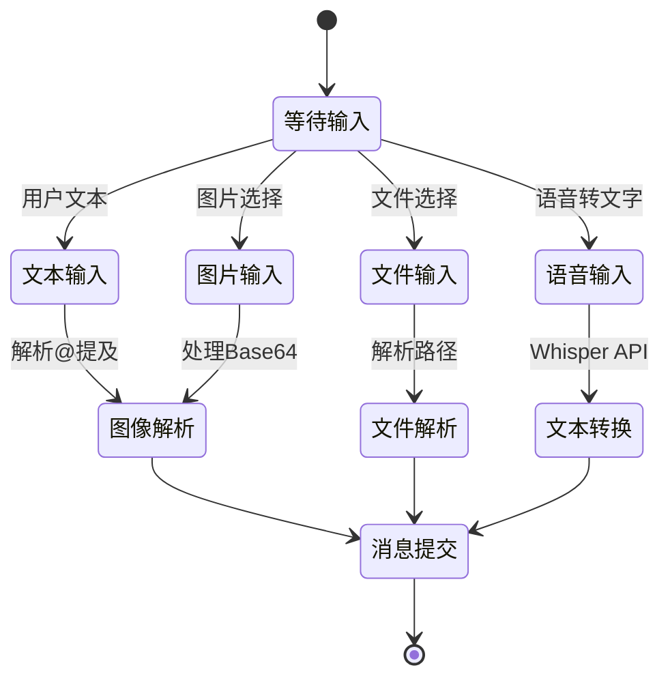

**图表来源**
- [webviewMessageHandler.ts:161-175](file://src/core/webview/webviewMessageHandler.ts#L161-L175)

**交互类型：**
- 文本消息处理
- 图片和文件上传
- 语音识别集成
- 实时图像解析

**章节来源**
- [webviewMessageHandler.ts:161-175](file://src/core/webview/webviewMessageHandler.ts#L161-L175)

### 通信安全机制

安全机制采用多层次防护策略：

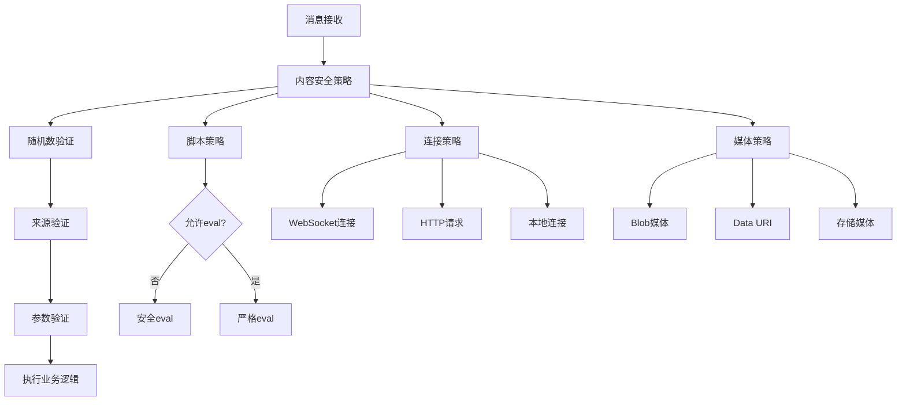

**图表来源**
- [ClineProvider.ts:1163-1191](file://src/core/webview/ClineProvider.ts#L1163-L1191)
- [getNonce.ts:9-16](file://src/core/webview/getNonce.ts#L9-L16)

**安全措施：**
- 内容安全策略(CSP)配置
- 随机数(nonce)验证
- 来源域白名单
- 连接限制和监控

**章节来源**
- [ClineProvider.ts:1163-1191](file://src/core/webview/ClineProvider.ts#L1163-L1191)
- [getNonce.ts:9-16](file://src/core/webview/getNonce.ts#L9-L16)

### 消息验证和错误处理

消息验证采用严格的类型检查和错误恢复机制：

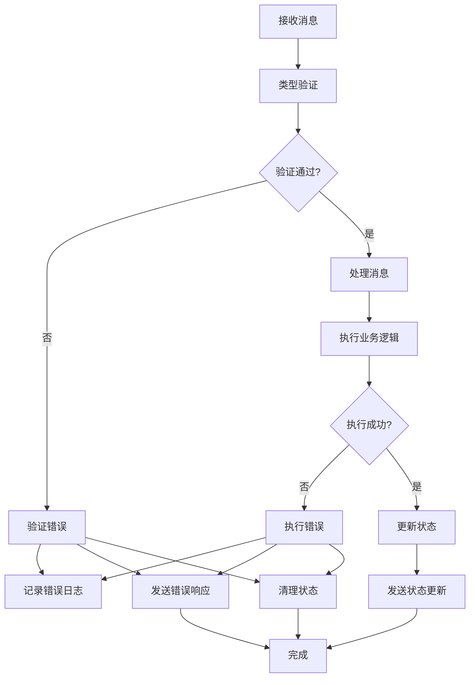

**图表来源**
- [webviewMessageHandler.ts:81-116](file://src/core/webview/webviewMessageHandler.ts#L81-L116)

**错误处理策略：**
- 严格的输入验证
- 分级错误处理
- 状态回滚机制
- 用户友好的错误提示

**章节来源**
- [webviewMessageHandler.ts:81-116](file://src/core/webview/webviewMessageHandler.ts#L81-L116)

### 消息增强器(MessageEnhancer)

MessageEnhancer 提供智能消息增强功能：

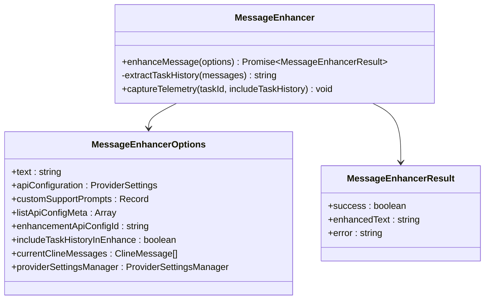

**图表来源**
- [messageEnhancer.ts:27-91](file://src/core/webview/messageEnhancer.ts#L27-L91)

**增强流程：**
- 配置选择和验证
- 任务历史上下文提取
- AI 提示词生成
- 结果返回和错误处理

**章节来源**
- [messageEnhancer.ts:27-137](file://src/core/webview/messageEnhancer.ts#L27-L137)

### Webview 消息处理器架构

Webview 消息处理器采用模块化设计：

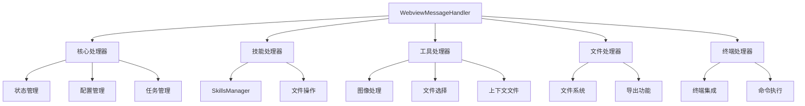

**图表来源**
- [webviewMessageHandler.ts:34-40](file://src/core/webview/webviewMessageHandler.ts#L34-L40)

**处理器模块：**
- 核心状态管理
- 技能管理系统
- 工具集操作
- 文件系统交互
- 终端集成

**章节来源**
- [webviewMessageHandler.ts:34-40](file://src/core/webview/webviewMessageHandler.ts#L34-L40)

## 依赖关系分析

```mermaid
graph TD
subgraph "核心依赖"
VSCode[VS Code API]
Types[@njust-ai/types]
EventEmitter[EventEmitter]
end
subgraph "业务服务"
Task[Task类]
MCP[MCP Hub]
Skills[SkillsManager]
Provider[ProviderSettingsManager]
end
subgraph "工具函数"
Utils[工具函数集合]
FS[文件系统]
Network[网络请求]
end
ClineProvider --> VSCode
ClineProvider --> Types
ClineProvider --> EventEmitter
ClineProvider --> Task
ClineProvider --> MCP
ClineProvider --> Skills
ClineProvider --> Provider
ClineProvider --> Utils
ClineProvider --> FS
ClineProvider --> Network
```

**图表来源**
- [ClineProvider.ts:12-105](file://src/core/webview/ClineProvider.ts#L12-L105)

**依赖特点：**
- 清晰的层次结构
- 弱耦合设计
- 可测试性良好
- 易于扩展和维护

**章节来源**
- [ClineProvider.ts:12-105](file://src/core/webview/ClineProvider.ts#L12-L105)

## 性能考虑

### 跨进程通信优化

针对 VS Code 扩展的跨进程通信特性，架构采用了多项优化策略：

**内存管理优化：**
- 任务栈的及时清理和垃圾回收
- 大对象的延迟加载
- 事件监听器的自动清理

**网络通信优化：**
- 模型列表的缓存机制
- 并发请求的限流控制
- 失败重试的指数退避

**UI 更新优化：**
- 增量状态更新减少传输量
- 序列号机制防止状态过期
- 批量更新减少渲染次数

### 消息丢失防护

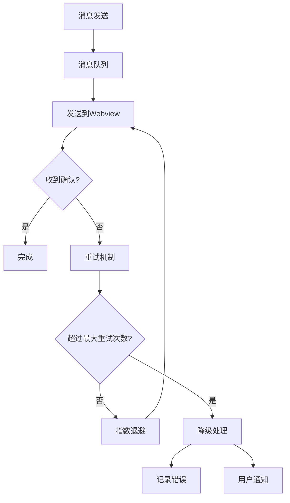

**降级策略：**
- 自动重试机制
- 状态回滚保护
- 用户友好的错误提示
- 日志记录和监控

### 状态不一致解决方案

**序列号同步：**
- 单调递增的序列号
- 过期状态拒绝机制
- 异步状态合并策略

**事务性更新：**
- 批量状态更新原子性
- 失败回滚机制
- 数据一致性检查

## 故障排除指南

### 常见问题诊断

**Webview 无法加载：**
1. 检查 CSP 配置是否正确
2. 验证资源路径是否有效
3. 确认 nonce 生成是否正常

**消息处理异常：**
1. 查看消息类型是否在处理器中注册
2. 检查参数验证是否通过
3. 确认异步操作是否正确处理

**状态不同步：**
1. 检查序列号是否递增
2. 验证状态更新频率
3. 确认增量更新逻辑

### 调试技巧

**开发环境调试：**
- 启用开发模式的热重载
- 使用浏览器开发者工具
- 监控网络请求和响应

**生产环境调试：**
- 启用详细的日志记录
- 使用性能分析工具
- 监控内存使用情况

**章节来源**
- [webviewMessageHandler.spec.ts:166-206](file://src/core/webview/__tests__/webviewMessageHandler.spec.ts#L166-L206)

## 结论

Webview 通信架构通过精心设计的组件分离、事件驱动的消息处理和严格的安全机制，实现了高效、可靠、可扩展的扩展宿主与 Webview 通信系统。该架构具有以下优势：

**技术优势：**
- 清晰的架构层次和职责分离
- 强大的消息路由和状态管理机制
- 完善的安全防护和错误处理
- 优秀的性能优化和资源管理

**可维护性：**
- 模块化设计便于扩展
- 完善的测试覆盖
- 详细的文档和注释
- 灵活的配置和定制能力

**未来发展：**
该架构为未来的功能扩展和技术演进提供了良好的基础，能够适应不断变化的需求和挑战。