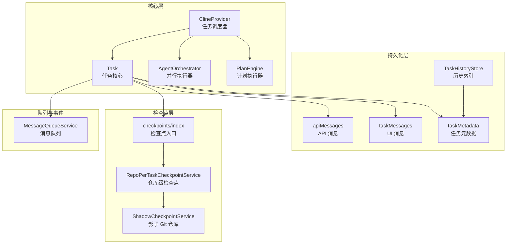
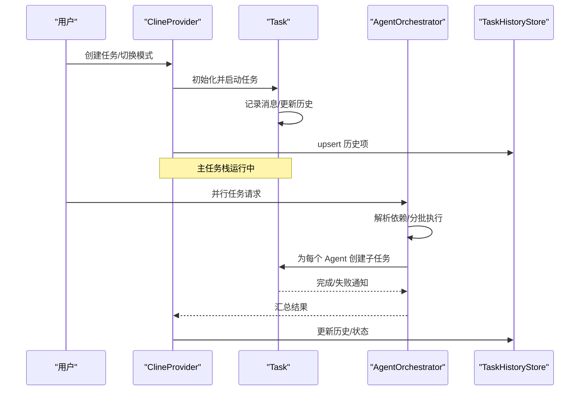
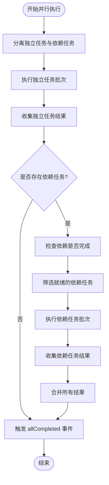
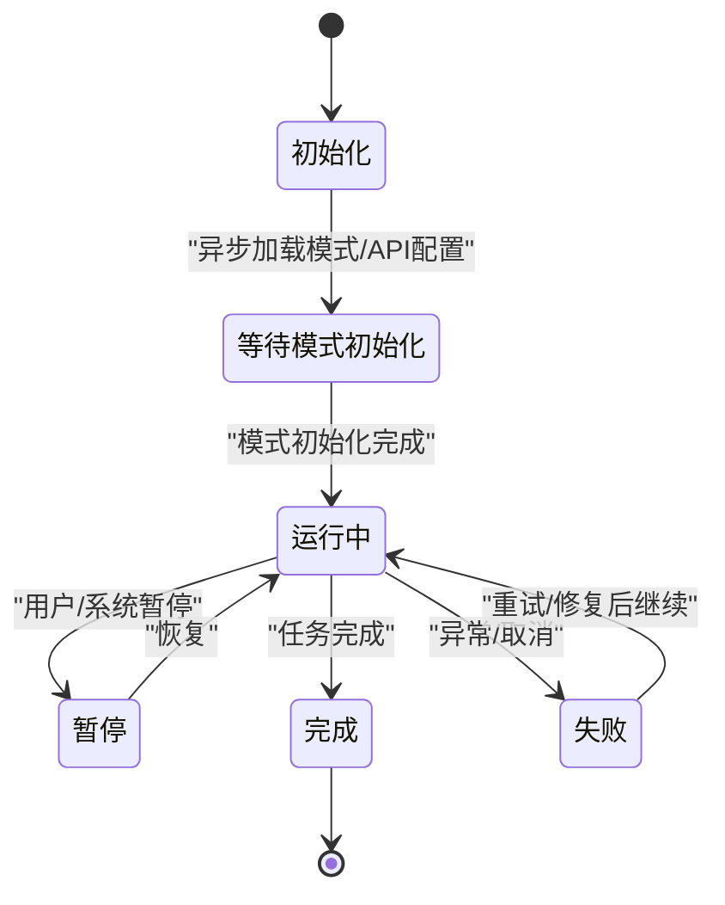
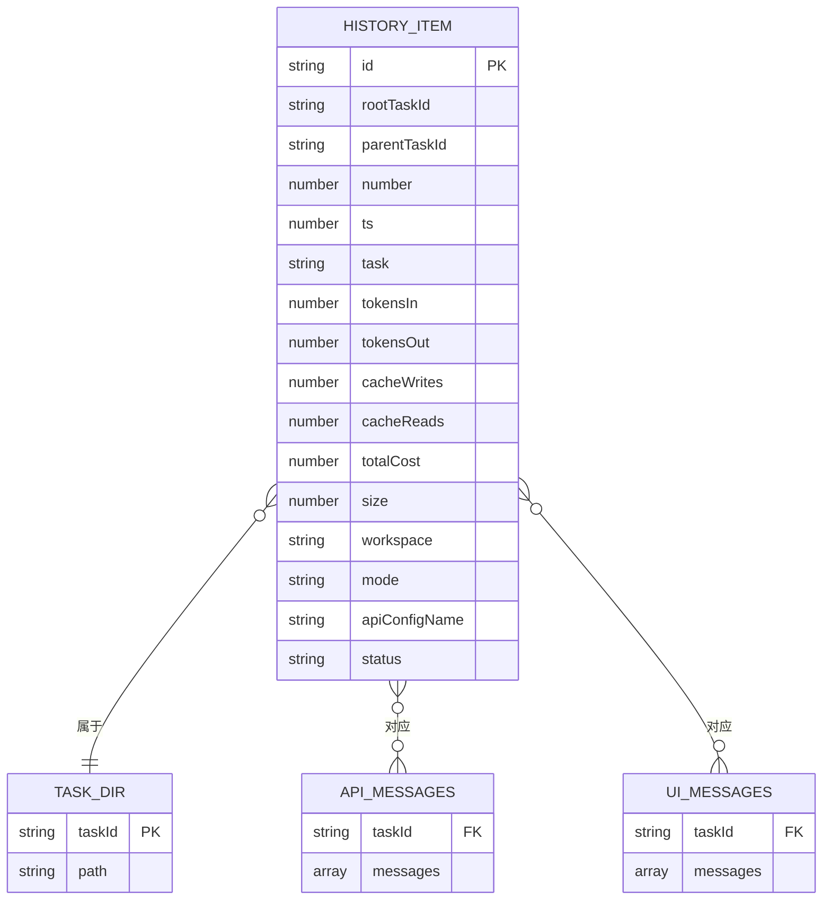
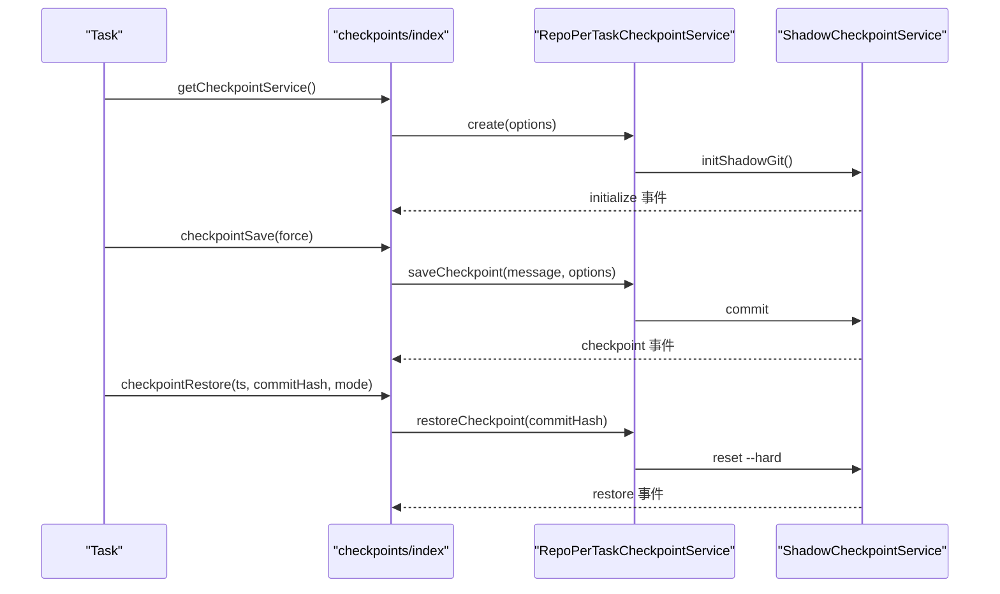
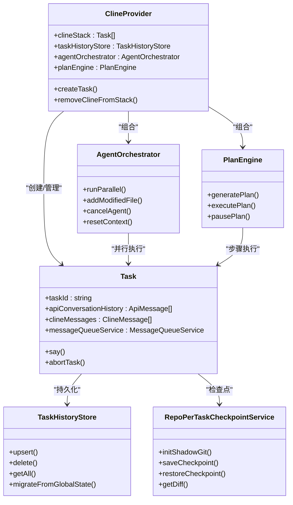

# 任务处理架构

<cite>
**本文档引用的文件**
- [AgentOrchestrator.ts](file://src/core/agent/AgentOrchestrator.ts)
- [Task.ts](file://src/core/task/Task.ts)
- [TaskHistoryStore.ts](file://src/core/task-persistence/TaskHistoryStore.ts)
- [types.ts](file://src/core/agent/types.ts)
- [PlanEngine.ts](file://src/core/agent/PlanEngine.ts)
- [index.ts](file://src/core/checkpoints/index.ts)
- [RepoPerTaskCheckpointService.ts](file://src/services/checkpoints/RepoPerTaskCheckpointService.ts)
- [ShadowCheckpointService.ts](file://src/services/checkpoints/ShadowCheckpointService.ts)
- [taskMessages.ts](file://src/core/task-persistence/taskMessages.ts)
- [apiMessages.ts](file://src/core/task-persistence/apiMessages.ts)
- [taskMetadata.ts](file://src/core/task-persistence/taskMetadata.ts)
- [MessageQueueService.ts](file://src/core/message-queue/MessageQueueService.ts)
- [ClineProvider.ts](file://src/core/webview/ClineProvider.ts)
</cite>

## 目录
1. [简介](#简介)
2. [项目结构](#项目结构)
3. [核心组件](#核心组件)
4. [架构总览](#架构总览)
5. [详细组件分析](#详细组件分析)
6. [依赖关系分析](#依赖关系分析)
7. [性能考虑](#性能考虑)
8. [故障排除指南](#故障排除指南)
9. [结论](#结论)

## 简介
本文件系统性阐述 Njust-AI 的任务处理架构，重点覆盖以下方面：
- 任务生命周期管理：从创建、调度、执行到监控的完整流程
- AgentOrchestrator 并行执行机制：多 Agent 协同与上下文共享
- 任务状态持久化策略：历史记录、消息存储、检查点机制
- 任务依赖管理、上下文传递、错误处理与重试机制
- 任务历史存储、状态恢复、检查点机制的设计与实现
- 高并发任务处理、资源限制与性能优化
- 任务监控指标与调试工具使用方法

## 项目结构
Njust-AI 的任务处理架构围绕 Task 核心类构建，通过 ClineProvider 统一调度，配合 AgentOrchestrator 实现并行执行，通过多种持久化模块保障状态可恢复性，并以检查点服务实现工作区快照与回滚能力。

**图表来源**
- [ClineProvider.ts:126-320](file://src/core/webview/ClineProvider.ts#L126-L320)
- [Task.ts:176-587](file://src/core/task/Task.ts#L176-L587)
- [AgentOrchestrator.ts:39-96](file://src/core/agent/AgentOrchestrator.ts#L39-L96)
- [PlanEngine.ts:44-111](file://src/core/agent/PlanEngine.ts#L44-L111)
- [TaskHistoryStore.ts:44-100](file://src/core/task-persistence/TaskHistoryStore.ts#L44-L100)
- [index.ts:28-130](file://src/core/checkpoints/index.ts#L28-L130)
- [RepoPerTaskCheckpointService.ts:6-15](file://src/services/checkpoints/RepoPerTaskCheckpointService.ts#L6-L15)
- [ShadowCheckpointService.ts:79-207](file://src/services/checkpoints/ShadowCheckpointService.ts#L79-L207)

**章节来源**
- [ClineProvider.ts:126-320](file://src/core/webview/ClineProvider.ts#L126-L320)
- [Task.ts:176-587](file://src/core/task/Task.ts#L176-L587)

## 核心组件
- Task：任务生命周期的核心实体，负责消息管理、工具调用、上下文压缩、检查点集成、历史记录与事件发布。
- ClineProvider：任务调度与状态聚合者，维护任务栈、事件转发、历史迁移与持久化协调。
- AgentOrchestrator：并行任务执行器，支持依赖排序、上下文共享、超时与失败处理。
- PlanEngine：基于 LLM 的计划生成与执行引擎，支持步骤依赖、批量执行与失败传播。
- 持久化模块：历史索引（TaskHistoryStore）、API 消息（apiMessages）、UI 消息（taskMessages）、任务元数据（taskMetadata）。
- 检查点服务：通过 ShadowCheckpointService 提供影子 Git 仓库，实现工作区快照、差异比较与回滚。

**章节来源**
- [Task.ts:176-587](file://src/core/task/Task.ts#L176-L587)
- [ClineProvider.ts:126-320](file://src/core/webview/ClineProvider.ts#L126-L320)
- [AgentOrchestrator.ts:39-96](file://src/core/agent/AgentOrchestrator.ts#L39-L96)
- [PlanEngine.ts:44-111](file://src/core/agent/PlanEngine.ts#L44-L111)
- [TaskHistoryStore.ts:44-100](file://src/core/task-persistence/TaskHistoryStore.ts#L44-L100)
- [index.ts:28-130](file://src/core/checkpoints/index.ts#L28-L130)

## 架构总览
Njust-AI 的任务处理采用“单任务主栈 + 多 Agent 并行”的双轨模式：
- 主任务栈：由 ClineProvider 维护，遵循 LIFO 调度，支持委托与恢复。
- 并行执行：AgentOrchestrator 在后台独立运行多个 Agent，共享上下文并通过事件驱动结果汇总。
- 历史与状态：所有任务状态通过文件系统持久化，历史索引加速启动读取；检查点服务提供工作区快照能力。
- 监控与指标：通过事件流与消息队列输出令牌用量、工具使用等指标。

**图表来源**
- [ClineProvider.ts:374-480](file://src/core/webview/ClineProvider.ts#L374-L480)
- [AgentOrchestrator.ts:61-96](file://src/core/agent/AgentOrchestrator.ts#L61-L96)
- [Task.ts:176-587](file://src/core/task/Task.ts#L176-L587)
- [TaskHistoryStore.ts:160-184](file://src/core/task-persistence/TaskHistoryStore.ts#L160-L184)

## 详细组件分析

### AgentOrchestrator 并行执行机制
- 依赖解析与分批：将任务按依赖关系拆分为独立任务与依赖任务，先执行独立任务，再执行满足前置条件的依赖任务。
- 上下文共享：通过 SharedContext 维护已修改文件集合与已完成结果映射，在每个 Agent 执行前注入共享上下文提示。
- 超时与失败处理：统一超时时间（10 分钟），Promise.allSettled 收敛并发结果，失败时记录错误信息并发出事件。
- 取消与清理：支持按 Agent 取消与全部取消，清理活动任务映射，确保资源回收。

**图表来源**
- [AgentOrchestrator.ts:61-96](file://src/core/agent/AgentOrchestrator.ts#L61-L96)
- [AgentOrchestrator.ts:98-114](file://src/core/agent/AgentOrchestrator.ts#L98-L114)
- [AgentOrchestrator.ts:116-176](file://src/core/agent/AgentOrchestrator.ts#L116-L176)

**章节来源**
- [AgentOrchestrator.ts:39-96](file://src/core/agent/AgentOrchestrator.ts#L39-L96)
- [AgentOrchestrator.ts:98-176](file://src/core/agent/AgentOrchestrator.ts#L98-L176)
- [types.ts:52-67](file://src/core/agent/types.ts#L52-L67)

### 任务生命周期管理
- 创建与初始化：Task 构造函数根据历史项或新任务参数初始化，设置工作区路径、模式、API 配置、检查点开关等。
- 模式与配置异步初始化：通过 provider.getState() 异步加载当前模式与 API 配置，失败时回退默认值并记录日志。
- 事件驱动的状态变更：任务在启动、完成、暂停、恢复、被中断等状态下发出事件，ClineProvider 转发至 Webview。
- 委托与恢复：支持父子任务链，移除子任务时修复父任务元数据，保证历史列表一致性。

**图表来源**
- [Task.ts:431-587](file://src/core/task/Task.ts#L431-L587)
- [Task.ts:590-718](file://src/core/task/Task.ts#L590-L718)
- [ClineProvider.ts:411-480](file://src/core/webview/ClineProvider.ts#L411-L480)

**章节来源**
- [Task.ts:431-587](file://src/core/task/Task.ts#L431-L587)
- [Task.ts:590-718](file://src/core/task/Task.ts#L590-L718)
- [ClineProvider.ts:374-480](file://src/core/webview/ClineProvider.ts#L374-L480)

### 任务状态持久化策略
- 历史索引与文件存储：TaskHistoryStore 将每个任务的历史项写入独立 JSON 文件，并维护 _index.json 作为启动时的快速索引。
- 写入锁与一致性：使用 safeWriteJson 的互斥锁与进程内写锁，避免并发写冲突；定期校验与 fs.watch 增强跨实例一致性。
- 消息持久化：apiMessages 保存 API 对话历史，taskMessages 保存 UI 消息，二者分别独立存储，便于增量读取与迁移。
- 元数据计算：taskMetadata 基于消息与目录大小计算令牌用量、成本与目录体积，用于历史列表展示与统计。

**图表来源**
- [TaskHistoryStore.ts:14-18](file://src/core/task-persistence/TaskHistoryStore.ts#L14-L18)
- [TaskHistoryStore.ts:44-100](file://src/core/task-persistence/TaskHistoryStore.ts#L44-L100)
- [apiMessages.ts:40-107](file://src/core/task-persistence/apiMessages.ts#L40-L107)
- [taskMessages.ts:17-56](file://src/core/task-persistence/taskMessages.ts#L17-L56)
- [taskMetadata.ts:30-118](file://src/core/task-persistence/taskMetadata.ts#L30-L118)

**章节来源**
- [TaskHistoryStore.ts:44-100](file://src/core/task-persistence/TaskHistoryStore.ts#L44-L100)
- [apiMessages.ts:40-107](file://src/core/task-persistence/apiMessages.ts#L40-L107)
- [taskMessages.ts:17-56](file://src/core/task-persistence/taskMessages.ts#L17-L56)
- [taskMetadata.ts:30-118](file://src/core/task-persistence/taskMetadata.ts#L30-L118)

### 检查点机制设计与实现
- 影子 Git 仓库：ShadowCheckpointService 在全局存储中为每个任务创建独立的 .git 仓库，隔离环境变量，绑定工作树为当前工作区。
- 快照与回滚：saveCheckpoint 基于 staged 变更提交，支持允许空提交；restoreCheckpoint 清理并硬重置到指定提交；getDiff 获取文件差异。
- 生命周期与容错：初始化阶段检测嵌套 Git 仓库、校验 core.worktree 设置；失败时发出 error 事件并禁用检查点功能。
- 与任务集成：通过 checkpoints/index 提供统一入口，等待服务初始化、发送警告消息、更新 Webview 当前检查点。

**图表来源**
- [index.ts:28-130](file://src/core/checkpoints/index.ts#L28-L130)
- [RepoPerTaskCheckpointService.ts:6-15](file://src/services/checkpoints/RepoPerTaskCheckpointService.ts#L6-L15)
- [ShadowCheckpointService.ts:129-207](file://src/services/checkpoints/ShadowCheckpointService.ts#L129-L207)
- [ShadowCheckpointService.ts:295-342](file://src/services/checkpoints/ShadowCheckpointService.ts#L295-L342)
- [ShadowCheckpointService.ts:344-372](file://src/services/checkpoints/ShadowCheckpointService.ts#L344-L372)

**章节来源**
- [index.ts:28-130](file://src/core/checkpoints/index.ts#L28-L130)
- [ShadowCheckpointService.ts:129-207](file://src/services/checkpoints/ShadowCheckpointService.ts#L129-L207)
- [ShadowCheckpointService.ts:295-372](file://src/services/checkpoints/ShadowCheckpointService.ts#L295-L372)

### 任务依赖管理与上下文传递
- 依赖定义：PlanEngine 中 PlanStep 的 dependencies 字段定义步骤间的先行关系；AgentOrchestrator 中 ParallelTaskSpec 的 dependencies 字段定义并行任务的依赖。
- 上下文注入：AgentOrchestrator 在每次任务执行前构建共享上下文提示，包含已修改文件与已完成结果摘要，确保后续任务能感知先前执行结果。
- 依赖传播：PlanEngine 在执行失败时会取消其依赖的后续步骤，防止无效执行。

**章节来源**
- [PlanEngine.ts:14-37](file://src/core/agent/PlanEngine.ts#L14-L37)
- [PlanEngine.ts:341-358](file://src/core/agent/PlanEngine.ts#L341-L358)
- [AgentOrchestrator.ts:217-238](file://src/core/agent/AgentOrchestrator.ts#L217-L238)

### 错误处理与重试机制
- 超时控制：AgentOrchestrator 与 PlanEngine 的任务轮询均设置 10 分钟超时，超时抛出错误并标记失败。
- 失败传播：PlanEngine 在步骤失败时标记自身及依赖步骤为 cancelled，避免无效执行。
- 重试与恢复：ClineProvider 在任务中断时尝试重新构建任务实例，确保状态一致性；检查点服务提供回滚能力，减少人工干预。
- 日志与告警：通过 OutputChannel 输出关键事件与错误信息；检查点初始化超时发送 Webview 警告消息。

**章节来源**
- [AgentOrchestrator.ts:178-215](file://src/core/agent/AgentOrchestrator.ts#L178-L215)
- [PlanEngine.ts:201-238](file://src/core/agent/PlanEngine.ts#L201-L238)
- [ClineProvider.ts:236-264](file://src/core/webview/ClineProvider.ts#L236-L264)
- [index.ts:21-26](file://src/core/checkpoints/index.ts#L21-L26)

### 任务监控指标与调试工具
- 令牌与工具使用：Task 内部通过防抖函数定时上报令牌用量与工具使用情况，避免高频事件风暴。
- 历史与成本：taskMetadata 计算总令牌输入/输出、缓存读写次数与总成本，用于历史列表展示与成本分析。
- 调试命令：通过命令面板执行相关操作，结合 OutputChannel 与 Webview 的消息通道定位问题。

**章节来源**
- [Task.ts:558-573](file://src/core/task/Task.ts#L558-L573)
- [taskMetadata.ts:41-118](file://src/core/task-persistence/taskMetadata.ts#L41-L118)
- [ClineProvider.ts:730-800](file://src/core/webview/ClineProvider.ts#L730-L800)

## 依赖关系分析

**图表来源**
- [ClineProvider.ts:126-320](file://src/core/webview/ClineProvider.ts#L126-L320)
- [Task.ts:176-587](file://src/core/task/Task.ts#L176-L587)
- [AgentOrchestrator.ts:39-96](file://src/core/agent/AgentOrchestrator.ts#L39-L96)
- [PlanEngine.ts:44-111](file://src/core/agent/PlanEngine.ts#L44-L111)
- [TaskHistoryStore.ts:44-100](file://src/core/task-persistence/TaskHistoryStore.ts#L44-L100)
- [RepoPerTaskCheckpointService.ts:6-15](file://src/services/checkpoints/RepoPerTaskCheckpointService.ts#L6-L15)

**章节来源**
- [ClineProvider.ts:126-320](file://src/core/webview/ClineProvider.ts#L126-L320)
- [Task.ts:176-587](file://src/core/task/Task.ts#L176-L587)

## 性能考虑
- 并发控制：AgentOrchestrator 使用 Promise.allSettled 控制并发，避免单点阻塞；PlanEngine 支持最大并行数配置。
- I/O 优化：TaskHistoryStore 使用防抖写入与跨实例 fs.watch，降低磁盘压力；消息文件分片存储，避免大文件读写。
- 缓存与去重：taskMetadata 使用 NodeCache 缓存目录大小；MessageQueueService 去重重复内容，减少冗余存储。
- 资源隔离：检查点服务通过影子 Git 仓库隔离环境变量，避免外部 Git 配置干扰，提升稳定性。

## 故障排除指南
- 检查点不可用：若 Git 未安装或影子仓库初始化失败，系统会禁用检查点功能并提示用户；可通过日志与 Webview 警告定位原因。
- 历史索引不同步：TaskHistoryStore 提供定期校验与 fs.watch 增强，必要时手动触发 reconcile 或重启扩展以修复。
- 并行任务卡死：检查 AgentOrchestrator 的超时与轮询逻辑，确认任务是否正常完成或被取消；必要时调用 cancelAgent 或 cancelAll。
- 令牌用量异常：通过 Task 的防抖事件确认上报频率，检查是否有大量重复工具调用导致用量激增。

**章节来源**
- [index.ts:132-210](file://src/core/checkpoints/index.ts#L132-L210)
- [TaskHistoryStore.ts:244-290](file://src/core/task-persistence/TaskHistoryStore.ts#L244-L290)
- [AgentOrchestrator.ts:178-215](file://src/core/agent/AgentOrchestrator.ts#L178-L215)

## 结论
Njust-AI 的任务处理架构通过 Task 核心、ClineProvider 调度、AgentOrchestrator 并行执行与完善的持久化/检查点体系，实现了高可靠的任务生命周期管理。该架构在保证功能完整性的同时，兼顾了并发性能、状态可恢复性与可观测性，适合复杂工程场景下的持续开发与协作。