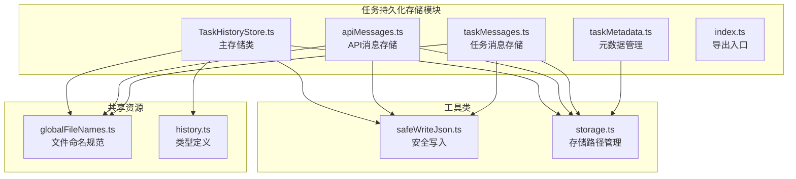
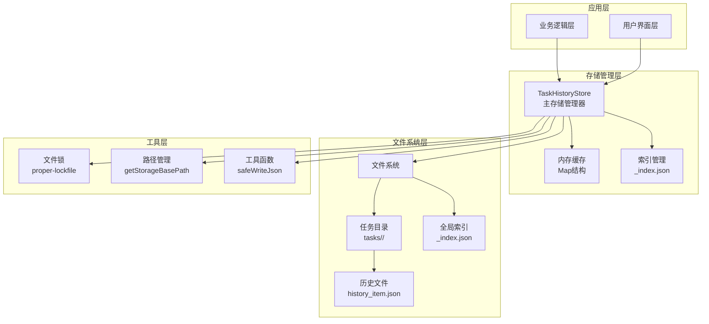
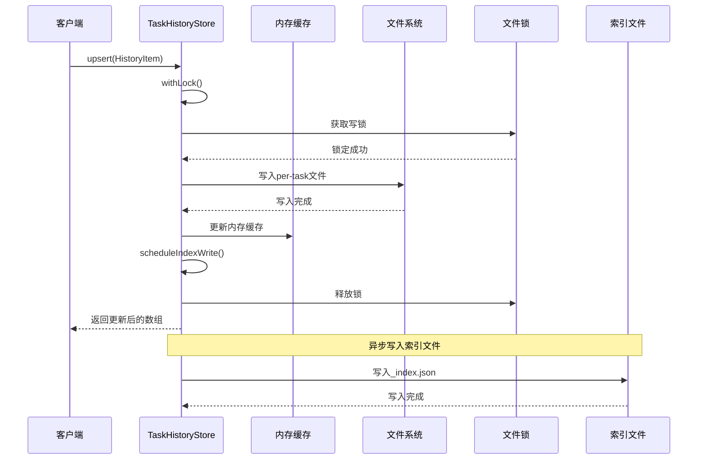
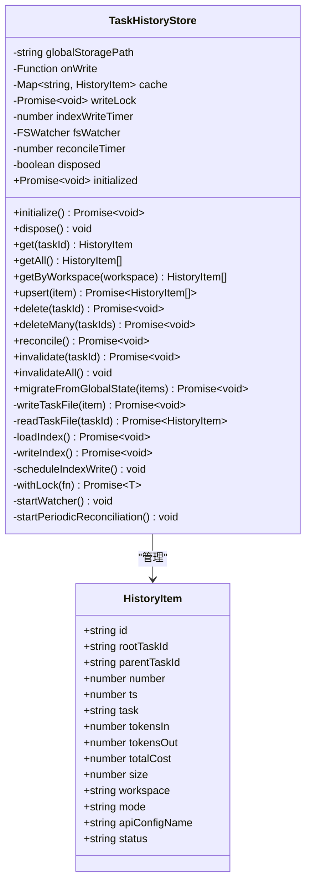
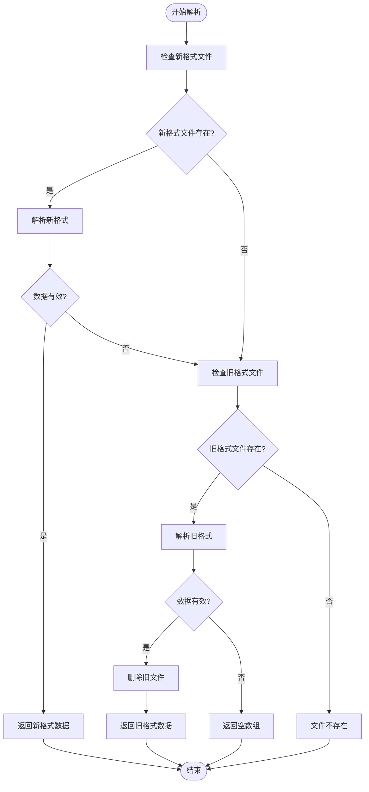
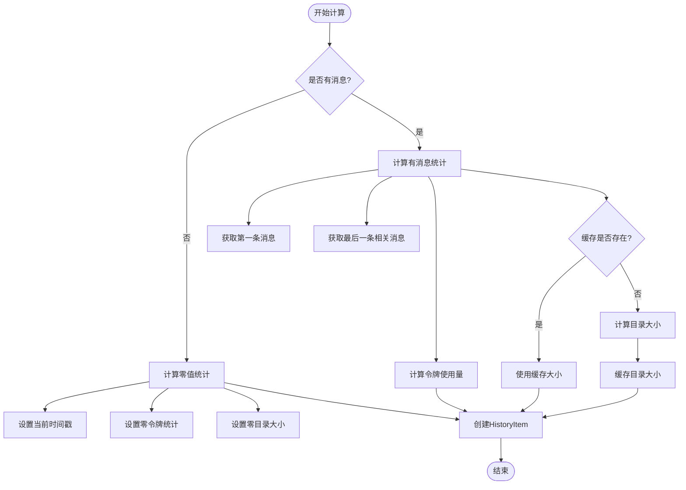
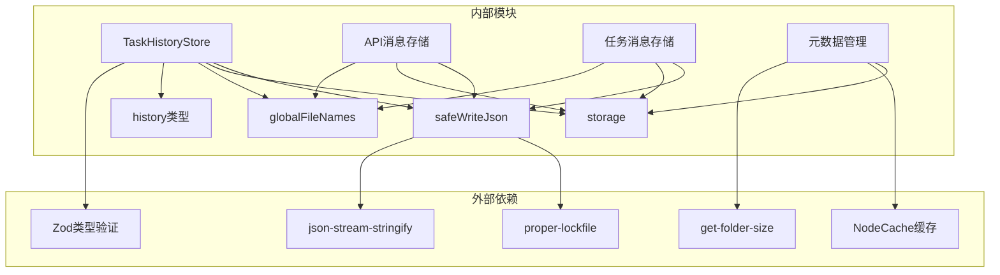

# 任务持久化存储

<cite>
**本文档引用的文件**
- [TaskHistoryStore.ts](file://src/core/task-persistence/TaskHistoryStore.ts)
- [apiMessages.ts](file://src/core/task-persistence/apiMessages.ts)
- [taskMessages.ts](file://src/core/task-persistence/taskMessages.ts)
- [taskMetadata.ts](file://src/core/task-persistence/taskMetadata.ts)
- [index.ts](file://src/core/task-persistence/index.ts)
- [globalFileNames.ts](file://src/shared/globalFileNames.ts)
- [safeWriteJson.ts](file://src/utils/safeWriteJson.ts)
- [storage.ts](file://src/utils/storage.ts)
- [history.ts](file://packages/types/src/history.ts)
- [TaskHistoryStore.spec.ts](file://src/core/task-persistence/__tests__/TaskHistoryStore.spec.ts)
</cite>

## 目录
1. [简介](#简介)
2. [项目结构](#项目结构)
3. [核心组件](#核心组件)
4. [架构概览](#架构概览)
5. [详细组件分析](#详细组件分析)
6. [依赖关系分析](#依赖关系分析)
7. [性能考虑](#性能考虑)
8. [故障排除指南](#故障排除指南)
9. [结论](#结论)
10. [附录](#附录)

## 简介

任务持久化存储系统是Njust-AI项目中用于管理和存储任务历史的核心组件。该系统提供了完整的任务生命周期管理，包括任务历史的创建、更新、查询、删除以及数据的一致性和可靠性保证。

系统采用分布式文件系统架构，通过JSON文件格式存储任务数据，并实现了多层缓存策略以确保高性能的数据访问。该设计支持跨进程和跨实例的数据同步，同时提供了完善的错误处理和恢复机制。

## 项目结构

任务持久化存储模块位于`src/core/task-persistence/`目录下，包含以下核心文件：

**图表来源**
- [TaskHistoryStore.ts:1-573](file://src/core/task-persistence/TaskHistoryStore.ts#L1-L573)
- [apiMessages.ts:1-122](file://src/core/task-persistence/apiMessages.ts#L1-L122)
- [taskMessages.ts:1-57](file://src/core/task-persistence/taskMessages.ts#L1-L57)
- [taskMetadata.ts:1-119](file://src/core/task-persistence/taskMetadata.ts#L1-L119)

**章节来源**
- [TaskHistoryStore.ts:1-573](file://src/core/task-persistence/TaskHistoryStore.ts#L1-L573)
- [index.ts:1-5](file://src/core/task-persistence/index.ts#L1-L5)

## 核心组件

### TaskHistoryStore 主存储类

TaskHistoryStore是整个任务持久化存储系统的核心，负责管理所有任务历史数据的存储和检索。该类实现了以下关键功能：

- **分布式文件存储**：每个任务的历史数据存储在独立的JSON文件中
- **内存缓存**：使用Map结构提供快速的数据访问
- **索引管理**：维护全局索引文件以支持快速列表查询
- **并发控制**：通过写锁确保数据一致性
- **跨实例同步**：使用文件系统监视器实现多实例间的数据同步

### API消息存储

API消息存储模块专门处理与AI服务交互产生的消息数据，支持多种AI提供商的消息格式：

- **多格式支持**：兼容Anthropic、OpenRouter、Gemini等多种AI提供商格式
- **推理内容保护**：特殊处理推理过程中的思考内容
- **非破坏性压缩**：支持摘要和截断功能而不丢失原始数据
- **向后兼容**：自动迁移旧格式的消息文件

### 任务消息存储

任务消息存储模块管理用户界面相关的消息数据：

- **UI消息管理**：存储聊天界面的消息历史
- **类型安全**：使用ClineMessage类型确保数据完整性
- **文件组织**：按任务ID组织消息文件

### 元数据管理

元数据管理模块负责计算和维护任务的各种统计信息：

- **令牌使用统计**：计算输入输出令牌数量
- **成本计算**：根据API使用量计算任务成本
- **目录大小统计**：跟踪任务数据目录的存储使用情况
- **状态管理**：维护任务的执行状态

**章节来源**
- [TaskHistoryStore.ts:44-73](file://src/core/task-persistence/TaskHistoryStore.ts#L44-L73)
- [apiMessages.ts:12-38](file://src/core/task-persistence/apiMessages.ts#L12-L38)
- [taskMessages.ts:12-56](file://src/core/task-persistence/taskMessages.ts#L12-L56)
- [taskMetadata.ts:30-118](file://src/core/task-persistence/taskMetadata.ts#L30-L118)

## 架构概览

任务持久化存储系统采用分层架构设计，确保了良好的可维护性和扩展性：

**图表来源**
- [TaskHistoryStore.ts:44-100](file://src/core/task-persistence/TaskHistoryStore.ts#L44-L100)
- [storage.ts:14-48](file://src/utils/storage.ts#L14-L48)
- [safeWriteJson.ts:35-193](file://src/utils/safeWriteJson.ts#L35-L193)

### 数据流图

**图表来源**
- [TaskHistoryStore.ts:160-185](file://src/core/task-persistence/TaskHistoryStore.ts#L160-L185)
- [safeWriteJson.ts:54-79](file://src/utils/safeWriteJson.ts#L54-L79)

## 详细组件分析

### TaskHistoryStore 类分析

TaskHistoryStore类实现了完整的任务历史存储功能，具有以下特点：

#### 类结构设计

**图表来源**
- [TaskHistoryStore.ts:44-573](file://src/core/task-persistence/TaskHistoryStore.ts#L44-L573)
- [history.ts:7-31](file://packages/types/src/history.ts#L7-L31)

#### 初始化流程

TaskHistoryStore的初始化过程包含以下步骤：

1. **目录创建**：确保任务存储目录存在
2. **索引加载**：从_index.json文件加载历史记录
3. **数据校验**：通过reconcile方法同步磁盘和缓存数据
4. **文件监视**：启动文件系统监视器实现跨实例同步
5. **周期性同步**：设置定期校验定时器作为后备机制

#### 并发控制机制

系统通过双重机制确保数据一致性：

- **进程内串行化**：使用Promise链确保同一进程内的操作串行执行
- **跨进程文件锁**：使用proper-lockfile防止不同进程同时写入同一文件

**章节来源**
- [TaskHistoryStore.ts:80-100](file://src/core/task-persistence/TaskHistoryStore.ts#L80-L100)
- [TaskHistoryStore.ts:538-545](file://src/core/task-persistence/TaskHistoryStore.ts#L538-L545)
- [safeWriteJson.ts:54-79](file://src/utils/safeWriteJson.ts#L54-L79)

### API消息存储分析

API消息存储模块提供了灵活的消息数据管理能力：

#### 消息格式支持

**图表来源**
- [apiMessages.ts:40-107](file://src/core/task-persistence/apiMessages.ts#L40-L107)

#### 向后兼容性

API消息存储模块实现了完整的向后兼容性：

- **双格式支持**：同时支持新旧两种消息格式
- **自动迁移**：检测到旧格式时自动迁移并删除旧文件
- **错误恢复**：解析失败时优雅降级，不中断系统运行

**章节来源**
- [apiMessages.ts:40-122](file://src/core/task-persistence/apiMessages.ts#L40-L122)

### 元数据管理分析

元数据管理模块负责计算任务的各种统计信息：

#### 统计计算流程

**图表来源**
- [taskMetadata.ts:30-118](file://src/core/task-persistence/taskMetadata.ts#L30-L118)

#### 缓存策略

元数据管理模块采用了智能缓存策略：

- **目录大小缓存**：使用NodeCache缓存任务目录大小
- **缓存过期**：30秒TTL，5分钟检查周期
- **异步计算**：避免阻塞主线程

**章节来源**
- [taskMetadata.ts:13-118](file://src/core/task-persistence/taskMetadata.ts#L13-L118)

## 依赖关系分析

任务持久化存储系统的依赖关系清晰明确：

**图表来源**
- [TaskHistoryStore.ts:1-10](file://src/core/task-persistence/TaskHistoryStore.ts#L1-L10)
- [taskMetadata.ts:1-2](file://src/core/task-persistence/taskMetadata.ts#L1-L2)
- [safeWriteJson.ts:1-6](file://src/utils/safeWriteJson.ts#L1-L6)

### 关键依赖说明

- **Zod类型验证**：确保数据结构的完整性和类型安全
- **NodeCache缓存**：提供高性能的内存缓存支持
- **proper-lockfile**：实现可靠的文件级互斥锁
- **json-stream-stringify**：支持大文件的流式JSON序列化

**章节来源**
- [TaskHistoryStore.ts:1-10](file://src/core/task-persistence/TaskHistoryStore.ts#L1-L10)
- [taskMetadata.ts:1-2](file://src/core/task-persistence/taskMetadata.ts#L1-L2)
- [safeWriteJson.ts:1-6](file://src/utils/safeWriteJson.ts#L1-L6)

## 性能考虑

任务持久化存储系统在设计时充分考虑了性能优化：

### 存储策略优化

1. **分层缓存架构**：
   - 内存缓存：Map结构提供O(1)的查找性能
   - 磁盘索引：_index.json文件支持快速列表查询
   - 懒加载：仅在需要时读取具体任务文件

2. **异步写入机制**：
   - 防抖写入：2秒防抖窗口减少频繁磁盘I/O
   - 批量写入：多个变更合并为单次写入操作
   - 流式写入：大文件使用流式JSON序列化

3. **并发控制优化**：
   - Promise链串行化：避免锁竞争和死锁
   - 文件级锁定：最小化锁定范围
   - 超时重试：处理长时间文件操作

### 内存管理

- **缓存大小限制**：内存缓存只存储活跃任务的元数据
- **垃圾回收**：及时清理不再使用的缓存项
- **内存监控**：定期检查内存使用情况

### I/O优化

- **批量操作**：支持批量删除和批量更新
- **增量索引**：仅更新发生变化的部分
- **预读机制**：提前加载可能需要的数据

## 故障排除指南

### 常见问题及解决方案

#### 数据不一致问题

**症状**：不同实例看到的任务历史不一致

**原因分析**：
- 文件系统监视器失效
- 网络文件系统延迟
- 进程崩溃导致未正确释放锁

**解决方案**：
- 检查文件监视器状态
- 启用定期校验机制
- 实施更严格的锁超时机制

#### 性能问题

**症状**：任务历史读取响应缓慢

**原因分析**：
- 索引文件过大
- 磁盘I/O瓶颈
- 缓存命中率低

**解决方案**：
- 重建索引文件
- 优化磁盘存储位置
- 调整缓存策略

#### 数据损坏问题

**症状**：历史文件无法读取或解析失败

**原因分析**：
- 文件写入过程中断电
- 文件权限问题
- JSON格式错误

**解决方案**：
- 使用safeWriteJson的原子写入特性
- 检查文件权限和磁盘空间
- 实施数据完整性检查

**章节来源**
- [TaskHistoryStore.ts:465-530](file://src/core/task-persistence/TaskHistoryStore.ts#L465-L530)
- [safeWriteJson.ts:137-192](file://src/utils/safeWriteJson.ts#L137-L192)

### 监控和诊断

系统提供了完善的监控和诊断功能：

- **日志记录**：详细的错误和调试信息
- **性能指标**：缓存命中率、磁盘I/O统计
- **健康检查**：自动检测存储状态

## 结论

任务持久化存储系统通过精心设计的架构和实现，成功解决了任务历史数据存储的复杂需求。系统的主要优势包括：

1. **高可靠性**：通过多重机制确保数据一致性和完整性
2. **高性能**：分层缓存和异步处理提供优秀的性能表现
3. **可扩展性**：模块化设计支持功能扩展和性能优化
4. **易维护性**：清晰的代码结构和完善的测试覆盖

该系统为Njust-AI项目提供了坚实的数据持久化基础，能够满足各种复杂的任务管理需求。

## 附录

### 配置选项

系统支持以下配置选项：

- **自定义存储路径**：允许用户指定自定义的存储位置
- **缓存配置**：可调整缓存大小和过期策略
- **写入策略**：可配置写入行为和性能参数

### API参考

- **TaskHistoryStore**：主存储管理器
- **readApiMessages/saveApiMessages**：API消息读写
- **readTaskMessages/saveTaskMessages**：任务消息读写
- **taskMetadata**：元数据计算

### 最佳实践

- 定期备份重要数据
- 监控存储空间使用情况
- 及时处理存储警告
- 定期清理过期任务数据