# 任务生命周期管理

<cite>
**本文档引用的文件**
- [Task.ts](file://src/core/task/Task.ts)
- [TaskHistoryStore.ts](file://src/core/task-persistence/TaskHistoryStore.ts)
- [taskMetadata.ts](file://src/core/task-persistence/taskMetadata.ts)
- [index.ts](file://src/core/task-persistence/index.ts)
- [ClineProvider.ts](file://src/core/webview/ClineProvider.ts)
- [stdin-stream.ts](file://apps/cli/src/commands/cli/stdin-stream.ts)
- [agent-state.ts](file://apps/cli/src/agent/agent-state.ts)
- [AGENT_LOOP.md](file://apps/cli/docs/AGENT_LOOP.md)
</cite>

## 目录
1. [简介](#简介)
2. [项目结构](#项目结构)
3. [核心组件](#核心组件)
4. [架构概览](#架构概览)
5. [详细组件分析](#详细组件分析)
6. [依赖关系分析](#依赖关系分析)
7. [性能考虑](#性能考虑)
8. [故障排除指南](#故障排除指南)
9. [结论](#结论)

## 简介

本文档深入解析Njust-AI项目中的任务生命周期管理系统，重点阐述Task类的核心设计架构、任务状态管理、异步初始化机制以及持久化策略。该系统支持复杂的任务创建、执行、暂停、恢复和终止流程，具备完善的并发控制、资源管理和数据一致性保障。

## 项目结构

任务生命周期管理涉及多个关键模块：

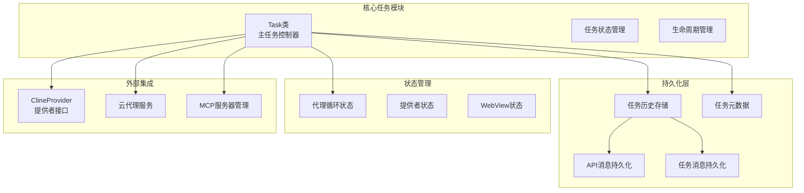

**图表来源**
- [Task.ts:176-587](file://src/core/task/Task.ts#L176-L587)
- [TaskHistoryStore.ts:44-73](file://src/core/task-persistence/TaskHistoryStore.ts#L44-L73)
- [index.ts:1-5](file://src/core/task-persistence/index.ts#L1-L5)

**章节来源**
- [Task.ts:1-800](file://src/core/task/Task.ts#L1-L800)
- [TaskHistoryStore.ts:1-100](file://src/core/task-persistence/TaskHistoryStore.ts#L1-L100)
- [index.ts:1-5](file://src/core/task-persistence/index.ts#L1-L5)

## 核心组件

### Task类架构设计

Task类采用事件驱动架构，实现了完整的任务生命周期管理：

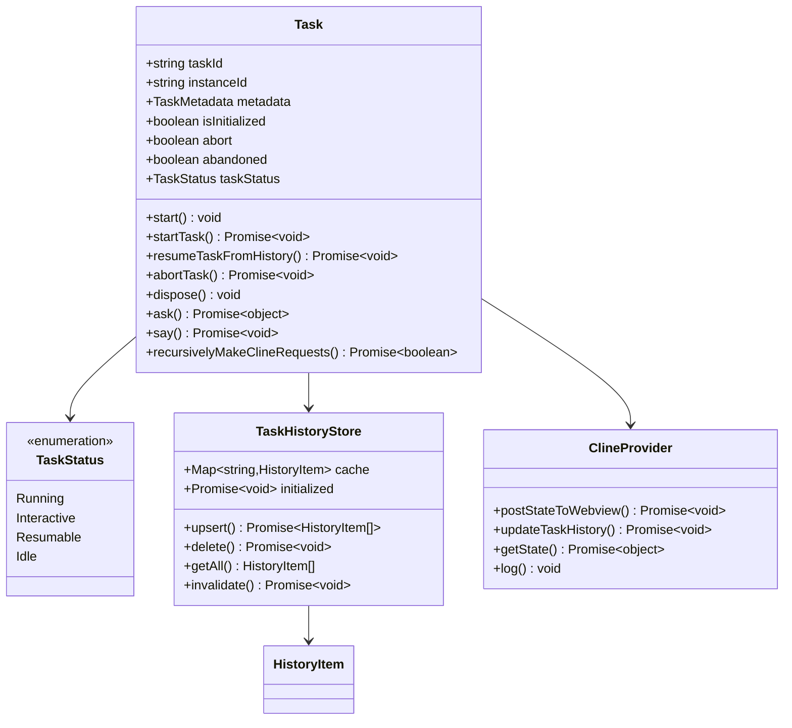

**图表来源**
- [Task.ts:176-587](file://src/core/task/Task.ts#L176-L587)
- [Task.ts:5222-5236](file://src/core/task/Task.ts#L5222-L5236)
- [TaskHistoryStore.ts:44-73](file://src/core/task-persistence/TaskHistoryStore.ts#L44-L73)

### 异步初始化机制

系统实现了两阶段异步初始化，确保任务状态的正确性和一致性：

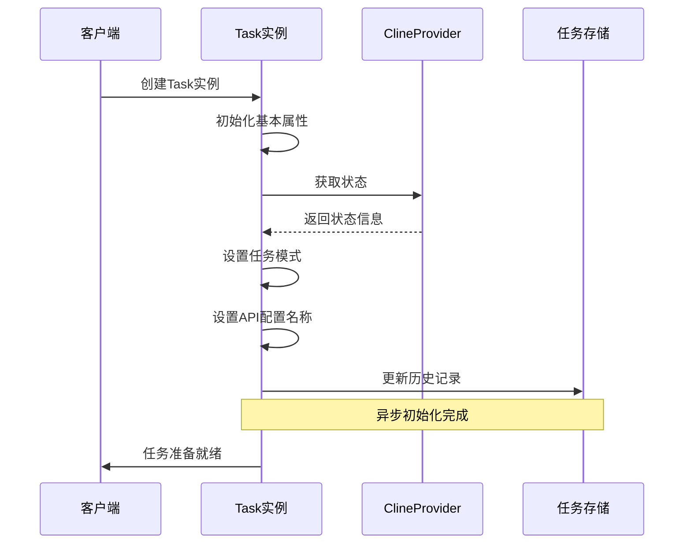

**图表来源**
- [Task.ts:610-662](file://src/core/task/Task.ts#L610-L662)
- [Task.ts:644-662](file://src/core/task/Task.ts#L644-L662)

**章节来源**
- [Task.ts:589-836](file://src/core/task/Task.ts#L589-L836)
- [Task.ts:610-662](file://src/core/task/Task.ts#L610-L662)

## 架构概览

### 状态机设计

系统采用有限状态机模型管理任务状态转换：

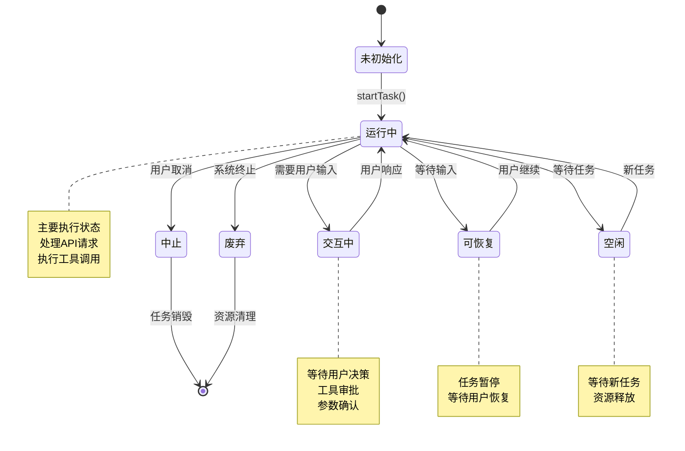

**图表来源**
- [Task.ts:5222-5236](file://src/core/task/Task.ts#L5222-L5236)
- [agent-state.ts:48-53](file://apps/cli/src/agent/agent-state.ts#L48-L53)

### 生命周期管理

任务生命周期包含完整的创建、执行、持久化和销毁流程：

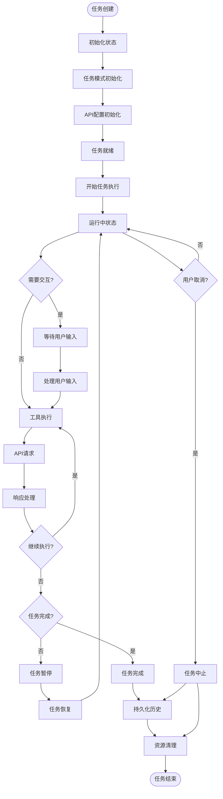

**图表来源**
- [Task.ts:1917-1990](file://src/core/task/Task.ts#L1917-L1990)
- [Task.ts:2248-2280](file://src/core/task/Task.ts#L2248-L2280)

**章节来源**
- [Task.ts:1859-2366](file://src/core/task/Task.ts#L1859-L2366)
- [Task.ts:1917-2223](file://src/core/task/Task.ts#L1917-L2223)

## 详细组件分析

### 任务状态管理

#### 状态枚举定义

系统定义了完整的任务状态枚举，支持多种执行场景：

| 状态 | 描述 | 触发条件 | 典型操作 |
|------|------|----------|----------|
| `Running` | 任务正在执行 | 正常任务执行流程 | API请求、工具调用、消息处理 |
| `Interactive` | 需要用户交互 | 工具调用需要审批 | 显示审批对话框、等待用户响应 |
| `Resumable` | 任务可恢复 | 等待用户输入或外部事件 | 暂停任务、保存状态、等待恢复 |
| `Idle` | 任务空闲 | 等待新任务或资源释放 | 清理资源、等待新任务 |

#### 状态转换规则

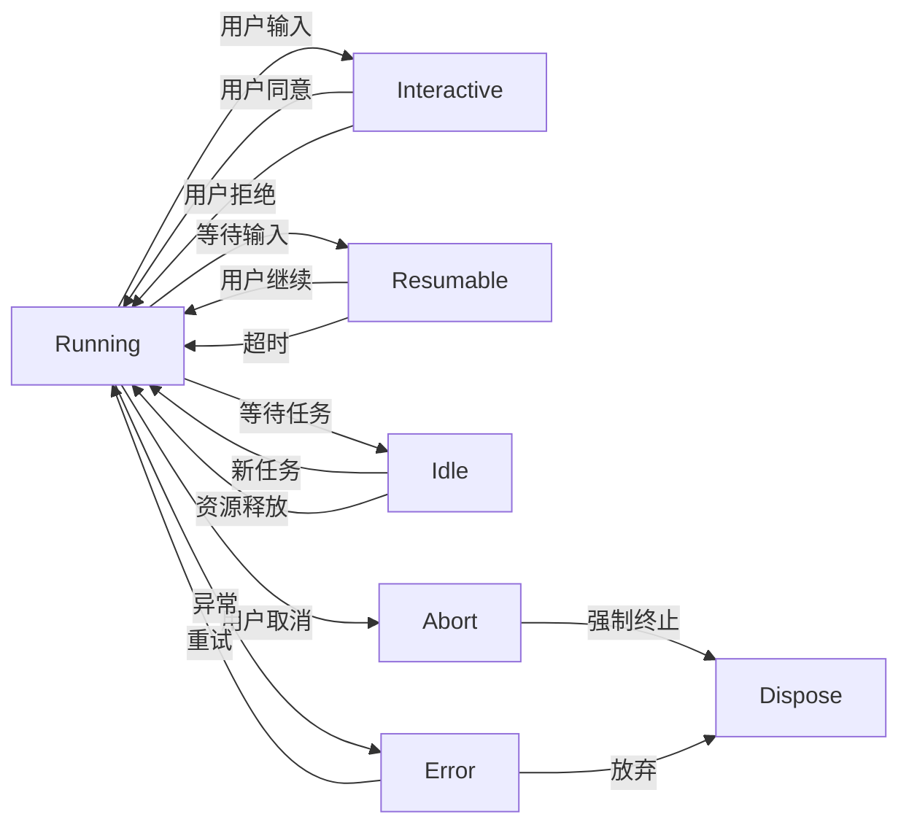

**图表来源**
- [Task.ts:5222-5236](file://src/core/task/Task.ts#L5222-L5236)
- [Task.ts:1373-1407](file://src/core/task/Task.ts#L1373-L1407)

**章节来源**
- [Task.ts:5222-5236](file://src/core/task/Task.ts#L5222-L5236)
- [Task.ts:1373-1477](file://src/core/task/Task.ts#L1373-L1477)

### 异步状态初始化机制

#### 任务模式初始化

系统实现了智能的任务模式初始化，支持从提供者状态动态获取模式信息：

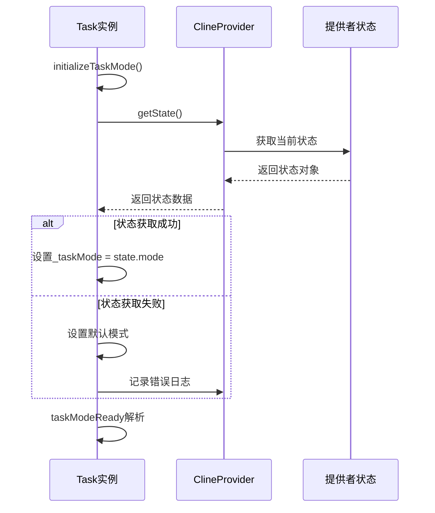

**图表来源**
- [Task.ts:610-621](file://src/core/task/Task.ts#L610-L621)

#### API配置初始化

API配置初始化确保任务能够正确连接到指定的AI服务提供商：

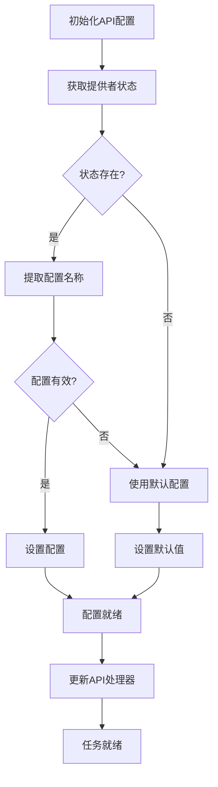

**图表来源**
- [Task.ts:644-662](file://src/core/task/Task.ts#L644-L662)
- [Task.ts:1558-1562](file://src/core/task/Task.ts#L1558-L1562)

**章节来源**
- [Task.ts:610-662](file://src/core/task/Task.ts#L610-L662)
- [Task.ts:1558-1562](file://src/core/task/Task.ts#L1558-L1562)

### 任务元数据管理

#### 元数据结构设计

任务元数据包含了任务执行过程中的所有重要信息：

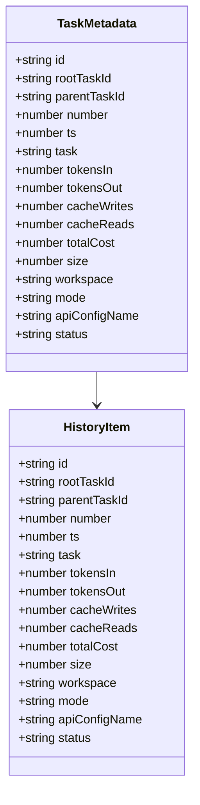

**图表来源**
- [taskMetadata.ts:96-115](file://src/core/task-persistence/taskMetadata.ts#L96-L115)

#### 元数据计算逻辑

系统自动计算任务的统计信息，包括令牌使用量、成本和存储大小：

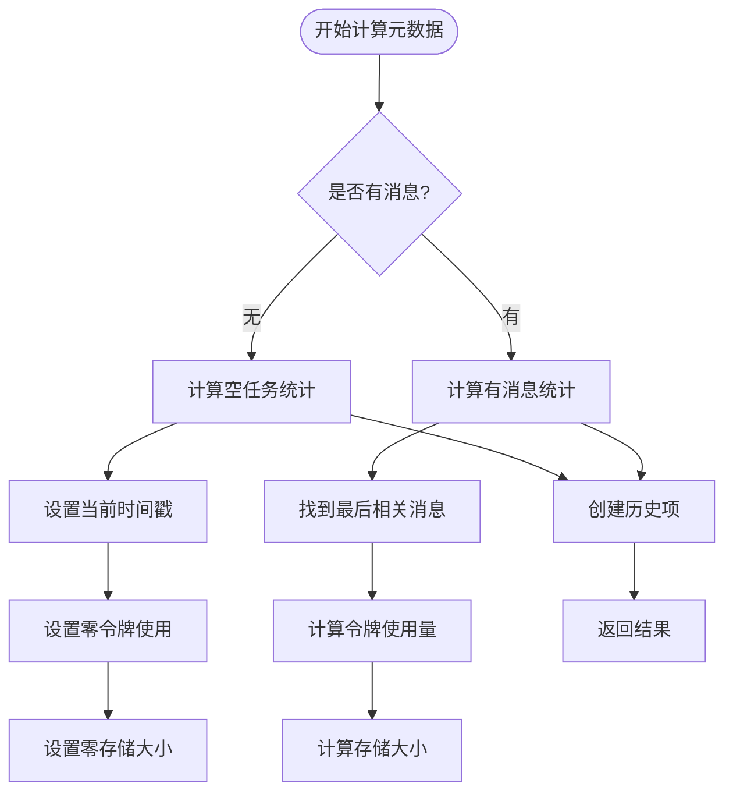

**图表来源**
- [taskMetadata.ts:30-118](file://src/core/task-persistence/taskMetadata.ts#L30-L118)

**章节来源**
- [taskMetadata.ts:1-119](file://src/core/task-persistence/taskMetadata.ts#L1-L119)

### 持久化策略

#### 任务历史存储架构

系统采用分层持久化策略，确保数据的一致性和可靠性：

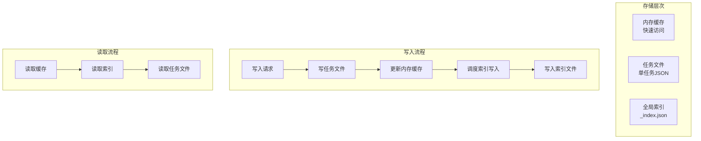

**图表来源**
- [TaskHistoryStore.ts:44-73](file://src/core/task-persistence/TaskHistoryStore.ts#L44-L73)
- [TaskHistoryStore.ts:160-184](file://src/core/task-persistence/TaskHistoryStore.ts#L160-L184)

#### 写入锁机制

系统实现了多层并发控制，防止数据竞争和不一致：

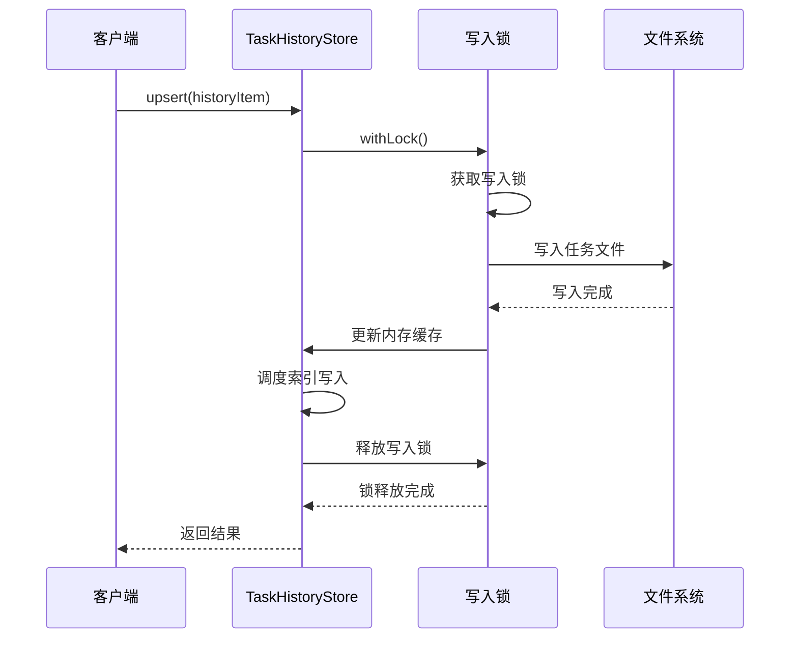

**图表来源**
- [TaskHistoryStore.ts:538-545](file://src/core/task-persistence/TaskHistoryStore.ts#L538-L545)

**章节来源**
- [TaskHistoryStore.ts:44-573](file://src/core/task-persistence/TaskHistoryStore.ts#L44-L573)
- [TaskHistoryStore.ts:538-545](file://src/core/task-persistence/TaskHistoryStore.ts#L538-L545)

### 状态恢复机制

#### 历史任务恢复流程

系统支持从历史记录中完整恢复任务状态：

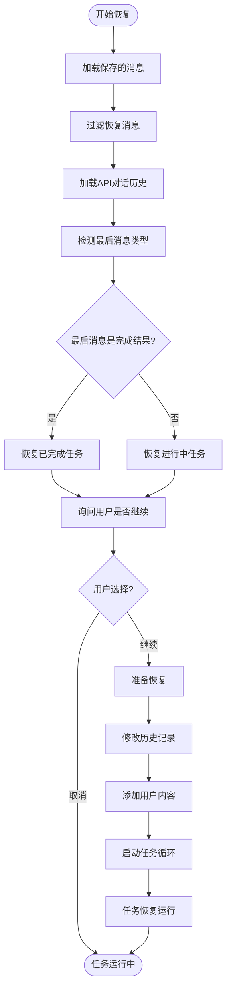

**图表来源**
- [Task.ts:1992-2223](file://src/core/task/Task.ts#L1992-L2223)

#### 恢复完整性检查

系统在恢复过程中执行完整性验证，确保任务状态的一致性：

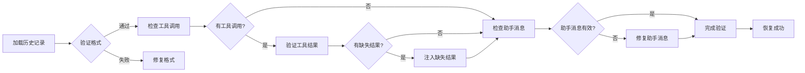

**图表来源**
- [Task.ts:2076-2223](file://src/core/task/Task.ts#L2076-L2223)

**章节来源**
- [Task.ts:1992-2223](file://src/core/task/Task.ts#L1992-L2223)

### 并发控制与资源管理

#### 事件驱动架构

系统采用事件驱动模式处理并发操作：

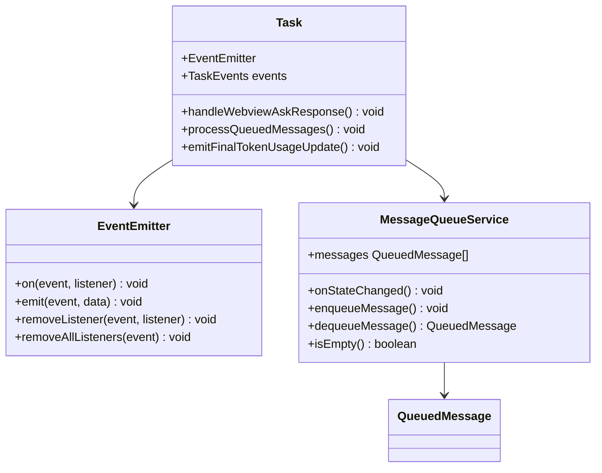

**图表来源**
- [Task.ts:530-541](file://src/core/task/Task.ts#L530-L541)
- [Task.ts:5297-5312](file://src/core/task/Task.ts#L5297-L5312)

#### 资源清理机制

系统实现了全面的资源清理策略，防止内存泄漏和资源占用：

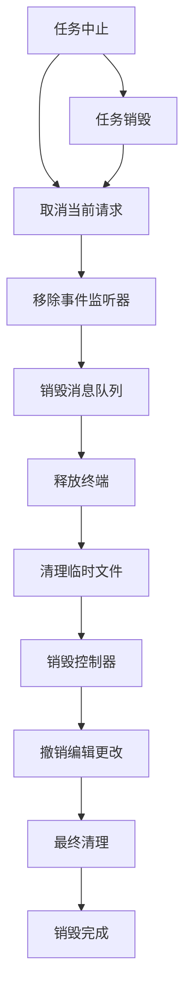

**图表来源**
- [Task.ts:2282-2366](file://src/core/task/Task.ts#L2282-L2366)

**章节来源**
- [Task.ts:2282-2366](file://src/core/task/Task.ts#L2282-L2366)
- [Task.ts:530-541](file://src/core/task/Task.ts#L530-L541)

## 依赖关系分析

### 组件耦合度分析

系统采用了合理的模块化设计，各组件之间保持适度的耦合度：

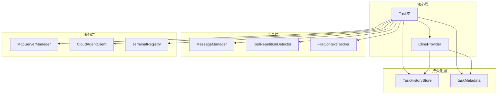

**图表来源**
- [Task.ts:75-148](file://src/core/task/Task.ts#L75-L148)
- [Task.ts:122-148](file://src/core/task/Task.ts#L122-L148)

### 外部依赖管理

系统对外部依赖进行了有效的抽象和封装：

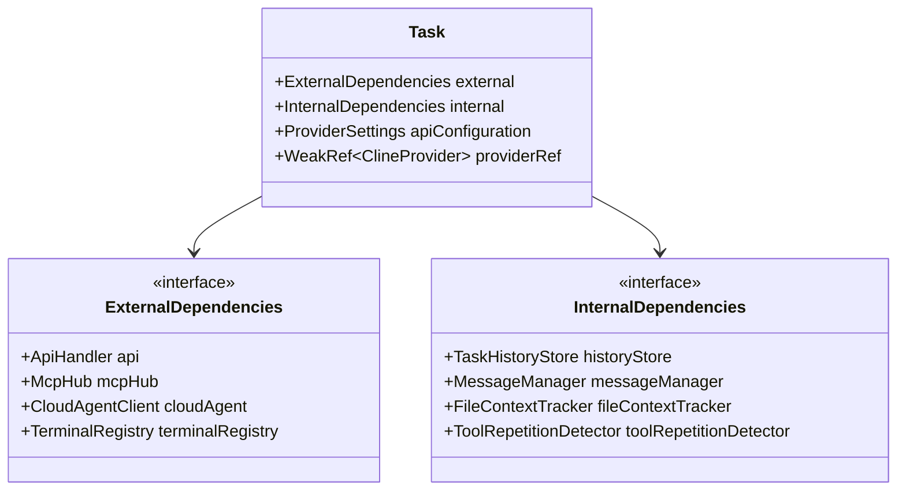

**图表来源**
- [Task.ts:59-148](file://src/core/task/Task.ts#L59-L148)

**章节来源**
- [Task.ts:75-148](file://src/core/task/Task.ts#L75-L148)

## 性能考虑

### 优化策略

系统实施了多项性能优化措施：

1. **内存优化**: 使用弱引用避免循环引用，及时清理事件监听器
2. **I/O优化**: 实现写入锁序列化磁盘操作，减少文件竞争
3. **网络优化**: 实现指数退避重试机制，避免频繁重试
4. **计算优化**: 使用缓存机制避免重复计算

### 性能监控

系统提供了详细的性能指标收集：

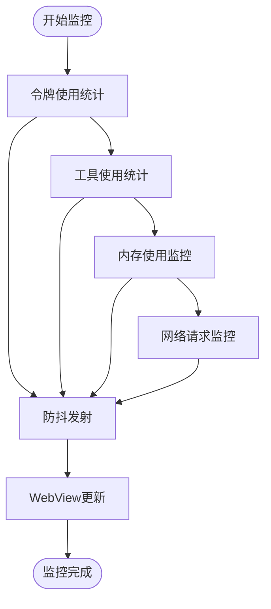

**图表来源**
- [Task.ts:558-573](file://src/core/task/Task.ts#L558-L573)
- [Task.ts:1215-1220](file://src/core/task/Task.ts#L1215-L1220)

## 故障排除指南

### 常见问题及解决方案

#### 任务初始化失败

**问题症状**: 任务创建后无法正常启动
**可能原因**:
- 提供者状态获取失败
- API配置无效
- 网络连接问题

**解决步骤**:
1. 检查提供者状态是否可用
2. 验证API配置的有效性
3. 确认网络连接状态
4. 查看错误日志获取详细信息

#### 任务恢复异常

**问题症状**: 从历史记录恢复任务时出现错误
**可能原因**:
- 历史文件损坏
- 工具调用结果不完整
- 状态不一致

**解决步骤**:
1. 检查历史文件完整性
2. 验证工具调用结果
3. 执行状态一致性检查
4. 必要时手动修复历史记录

#### 并发冲突

**问题症状**: 多个任务实例同时操作导致数据不一致
**可能原因**:
- 缺少适当的锁机制
- 事件监听器未正确清理
- 资源竞争

**解决步骤**:
1. 确保使用写入锁保护共享资源
2. 及时清理事件监听器
3. 实施适当的资源隔离
4. 检查并发访问模式

**章节来源**
- [Task.ts:2282-2366](file://src/core/task/Task.ts#L2282-L2366)
- [TaskHistoryStore.ts:538-545](file://src/core/task-persistence/TaskHistoryStore.ts#L538-L545)

### 异常终止处理

系统实现了完善的异常终止处理机制：

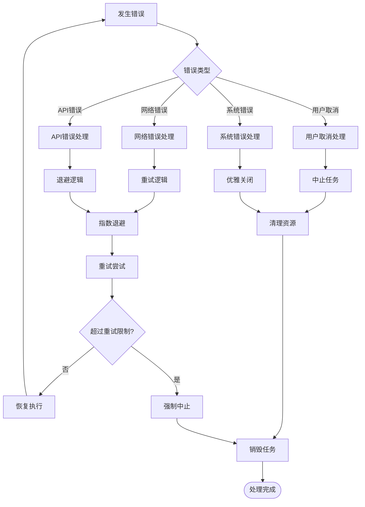

**图表来源**
- [Task.ts:4962-5033](file://src/core/task/Task.ts#L4962-L5033)
- [Task.ts:3824-3878](file://src/core/task/Task.ts#L3824-L3878)

**章节来源**
- [Task.ts:4962-5033](file://src/core/task/Task.ts#L4962-L5033)
- [Task.ts:3824-3878](file://src/core/task/Task.ts#L3824-L3878)

## 结论

Njust-AI的任务生命周期管理系统展现了高度的工程化设计，通过以下关键特性实现了可靠的异步任务管理：

1. **完整的状态管理**: 支持多种任务状态和复杂的转换规则
2. **健壮的初始化机制**: 实现两阶段异步初始化确保状态一致性
3. **可靠的数据持久化**: 采用分层存储策略保证数据安全
4. **完善的并发控制**: 实现多层锁机制防止资源竞争
5. **灵活的恢复机制**: 支持从历史记录完整恢复任务状态
6. **优雅的错误处理**: 提供全面的异常处理和恢复策略

该系统的设计充分考虑了实际应用场景的需求，在保证功能完整性的同时，也注重了性能优化和用户体验。通过模块化的架构设计和清晰的职责分离，为复杂任务管理提供了坚实的技术基础。