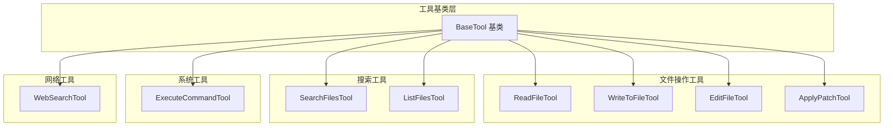
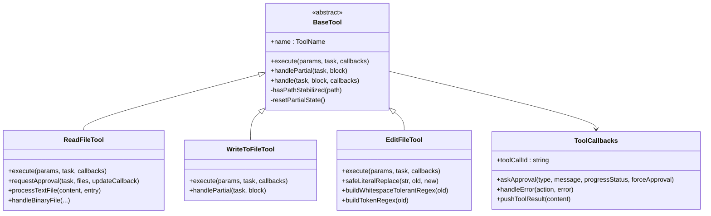
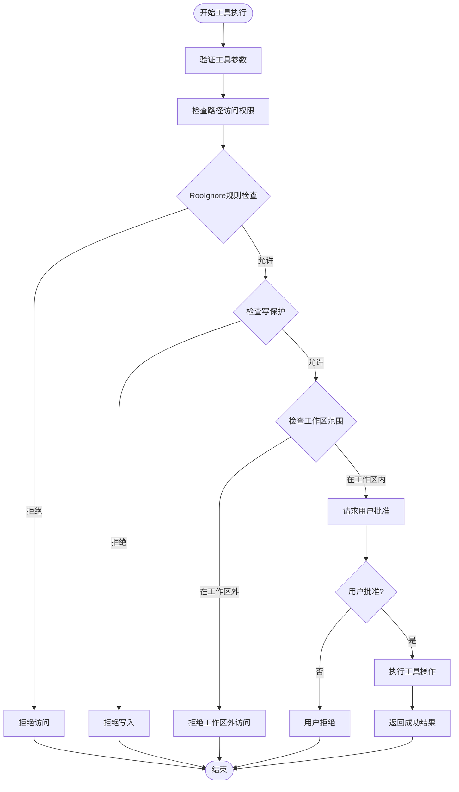
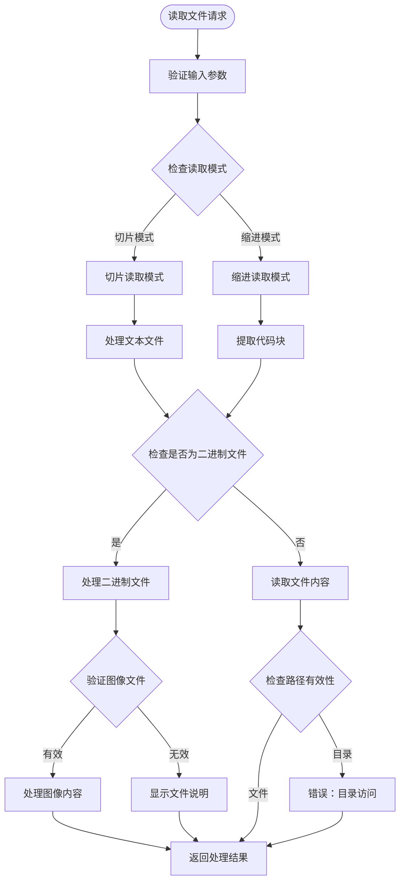
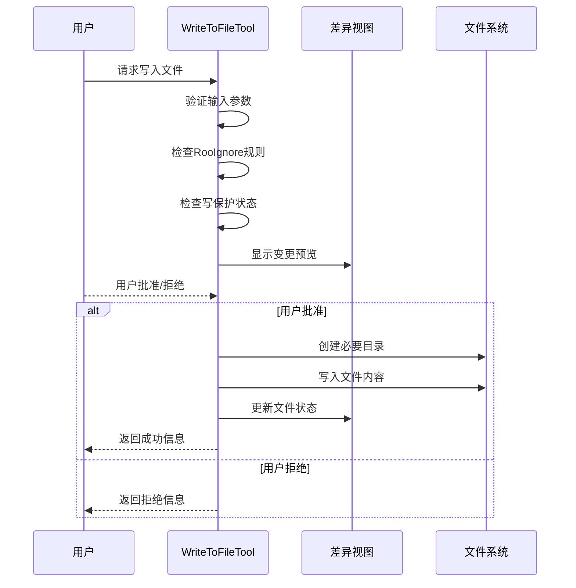
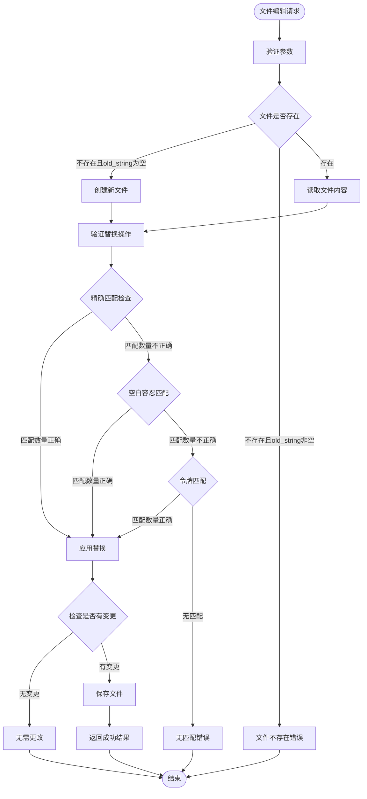
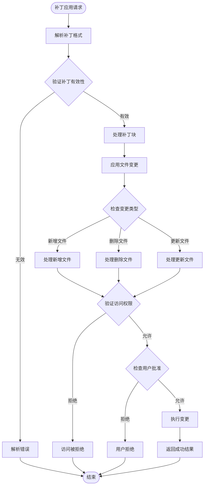
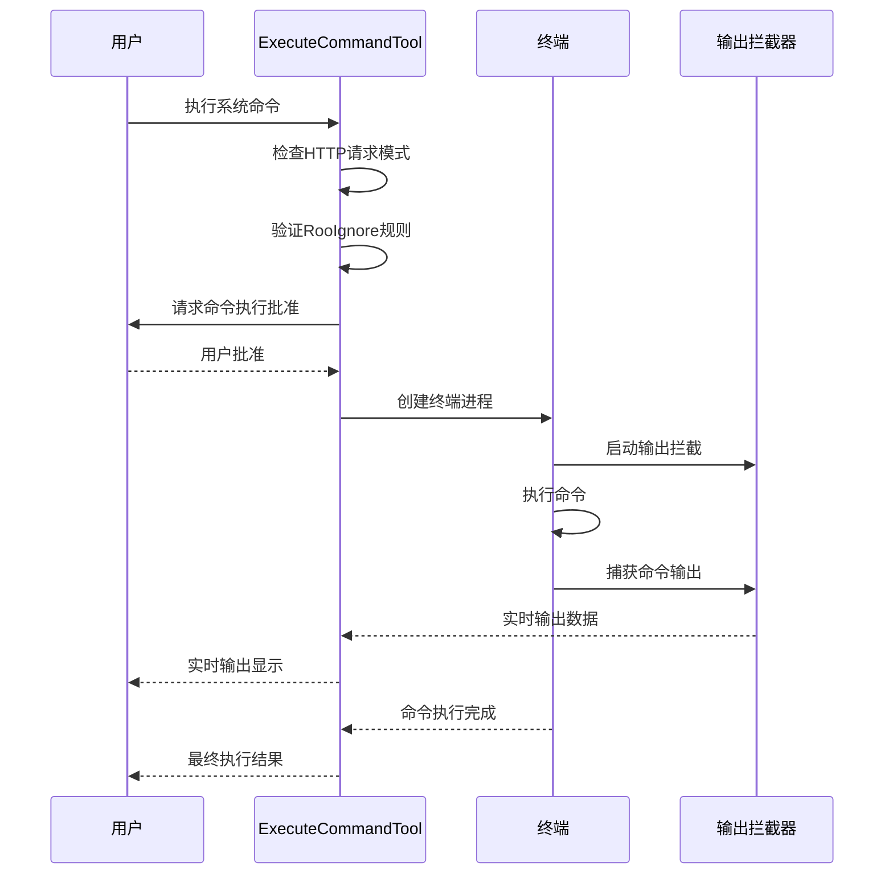

# 内置工具实现

<cite>
**本文档引用的文件**
- [ReadFileTool.ts](file://src/core/tools/ReadFileTool.ts)
- [WriteToFileTool.ts](file://src/core/tools/WriteToFileTool.ts)
- [EditFileTool.ts](file://src/core/tools/EditFileTool.ts)
- [SearchFilesTool.ts](file://src/core/tools/SearchFilesTool.ts)
- [ListFilesTool.ts](file://src/core/tools/ListFilesTool.ts)
- [ApplyPatchTool.ts](file://src/core/tools/ApplyPatchTool.ts)
- [ExecuteCommandTool.ts](file://src/core/tools/ExecuteCommandTool.ts)
- [WebSearchTool.ts](file://src/core/tools/WebSearchTool.ts)
- [BaseTool.ts](file://src/core/tools/BaseTool.ts)
- [tools.ts](file://src/shared/tools.ts)
- [build-tools.ts](file://src/core/task/build-tools.ts)
- [index.ts](file://src/core/tools/apply-patch/index.ts)
</cite>

## 目录
1. [简介](#简介)
2. [项目结构](#项目结构)
3. [核心组件](#核心组件)
4. [架构概览](#架构概览)
5. [详细组件分析](#详细组件分析)
6. [依赖关系分析](#依赖关系分析)
7. [性能考虑](#性能考虑)
8. [故障排除指南](#故障排除指南)
9. [结论](#结论)

## 简介

Njust-AI 项目的内置工具实现提供了一套完整的文件操作、搜索、代码编辑、系统命令执行和网络搜索工具集。这些工具通过统一的基类架构设计，实现了类型安全的参数处理、用户权限验证、资源限制控制和错误处理机制。

本项目采用现代化的工具调用协议，支持原生工具调用（nativeArgs）和 MCP（Model Context Protocol）工具集成，为 AI 模型提供了安全可控的环境交互能力。

## 项目结构

项目中的工具实现主要位于 `src/core/tools/` 目录下，每个工具都是一个独立的类，继承自 `BaseTool` 基类。工具按照功能分为以下几类：

**图表来源**
- [BaseTool.ts:30-167](file://src/core/tools/BaseTool.ts#L30-L167)
- [ReadFileTool.ts:74-84](file://src/core/tools/ReadFileTool.ts#L74-L84)
- [WriteToFileTool.ts:28-34](file://src/core/tools/WriteToFileTool.ts#L28-L34)
- [EditFileTool.ts:135-141](file://src/core/tools/EditFileTool.ts#L135-L141)

**章节来源**
- [BaseTool.ts:1-167](file://src/core/tools/BaseTool.ts#L1-L167)
- [tools.ts:96-125](file://src/shared/tools.ts#L96-L125)

## 核心组件

### 工具基类架构

所有工具都继承自 `BaseTool` 抽象基类，该基类提供了统一的工具执行框架：

- **类型安全参数处理**：通过 `NativeToolArgs` 类型映射确保工具参数的类型安全
- **流式部分消息处理**：支持工具调用过程中的流式更新显示
- **错误处理机制**：统一的错误捕获和处理流程
- **生命周期管理**：自动化的状态跟踪和清理

### 工具参数类型系统

项目定义了完整的工具参数类型系统，包括：

**图表来源**
- [BaseTool.ts:30-167](file://src/core/tools/BaseTool.ts#L30-L167)
- [ReadFileTool.ts:74-267](file://src/core/tools/ReadFileTool.ts#L74-L267)
- [WriteToFileTool.ts:28-196](file://src/core/tools/WriteToFileTool.ts#L28-L196)
- [EditFileTool.ts:135-487](file://src/core/tools/EditFileTool.ts#L135-L487)

**章节来源**
- [BaseTool.ts:17-101](file://src/core/tools/BaseTool.ts#L17-L101)
- [tools.ts:96-125](file://src/shared/tools.ts#L96-L125)

## 架构概览

### 工具执行流程

**图表来源**
- [BaseTool.ts:114-165](file://src/core/tools/BaseTool.ts#L114-L165)
- [ExecuteCommandTool.ts:48-163](file://src/core/tools/ExecuteCommandTool.ts#L48-L163)

### 权限验证流程

**图表来源**
- [ReadFileTool.ts:146-169](file://src/core/tools/ReadFileTool.ts#L146-L169)
- [WriteToFileTool.ts:52-58](file://src/core/tools/WriteToFileTool.ts#L52-L58)
- [EditFileTool.ts:211-220](file://src/core/tools/EditFileTool.ts#L211-L220)

**章节来源**
- [build-tools.ts:83-177](file://src/core/task/build-tools.ts#L83-L177)

## 详细组件分析

### 文件读取工具 (ReadFileTool)

ReadFileTool 提供了强大的文件读取功能，支持多种读取模式：

#### 功能特性

1. **双模式读取支持**：
   - 切片模式（Slice Mode）：按行范围读取文件内容
   - 缩进模式（Indentation Mode）：基于代码缩进层次提取语义块

2. **二进制文件处理**：
   - 图像文件识别和处理
   - 文档文件内容提取
   - 自动格式检测和转换

3. **智能权限控制**：
   - RooIgnore 规则检查
   - 工作区范围验证
   - 用户交互批准流程

#### 执行逻辑

**图表来源**
- [ReadFileTool.ts:89-267](file://src/core/tools/ReadFileTool.ts#L89-L267)
- [ReadFileTool.ts:354-441](file://src/core/tools/ReadFileTool.ts#L354-L441)

**章节来源**
- [ReadFileTool.ts:74-84](file://src/core/tools/ReadFileTool.ts#L74-L84)
- [ReadFileTool.ts:274-349](file://src/core/tools/ReadFileTool.ts#L274-L349)
- [ReadFileTool.ts:354-441](file://src/core/tools/ReadFileTool.ts#L354-L441)

### 文件写入工具 (WriteToFileTool)

WriteToFileTool 提供安全的文件写入功能，具有完善的权限控制和错误处理机制：

#### 安全控制机制

1. **路径验证**：
   - RooIgnore 规则检查
   - 工作区范围限制
   - 路径规范化处理

2. **写保护检查**：
   - 只读文件检测
   - 系统文件保护
   - 权限验证

3. **变更预览**：
   - 统一差异格式生成
   - 变更统计信息
   - 用户确认流程

#### 执行流程

**图表来源**
- [WriteToFileTool.ts:31-196](file://src/core/tools/WriteToFileTool.ts#L31-L196)

**章节来源**
- [WriteToFileTool.ts:28-34](file://src/core/tools/WriteToFileTool.ts#L28-L34)
- [WriteToFileTool.ts:101-196](file://src/core/tools/WriteToFileTool.ts#L101-L196)

### 文件编辑工具 (EditFileTool)

EditFileTool 实现了智能的文件内容替换功能，支持多种匹配策略：

#### 匹配算法

1. **精确字面量匹配**：
   - 直接字符串替换
   - 处理特殊字符转义
   - 支持 `$` 字符安全替换

2. **空白容忍正则匹配**：
   - 忽略水平空白字符变化
   - 保持缩进一致性
   - 支持换行符变化

3. **令牌正则匹配**：
   - 基于单词边界匹配
   - 智能上下文识别
   - 多种匹配策略组合

#### 错误处理机制

**图表来源**
- [EditFileTool.ts:141-487](file://src/core/tools/EditFileTool.ts#L141-L487)

**章节来源**
- [EditFileTool.ts:135-141](file://src/core/tools/EditFileTool.ts#L135-L141)
- [EditFileTool.ts:301-355](file://src/core/tools/EditFileTool.ts#L301-L355)

### 文件搜索工具 (SearchFilesTool)

SearchFilesTool 提供了高效的文件搜索功能，支持正则表达式和语义搜索：

#### 搜索策略

1. **正则表达式搜索**：
   - 支持复杂的文件名模式
   - 文件内容搜索
   - 性能优化的搜索算法

2. **语义搜索**：
   - 基于 CangjieCorpus 的语义索引
   - BM25 相关性评分
   - 上下文相关的搜索结果

3. **权限控制**：
   - 工作区范围限制
   - RooIgnore 规则检查
   - 用户批准流程

**章节来源**
- [SearchFilesTool.ts:25-117](file://src/core/tools/SearchFilesTool.ts#L25-L117)

### 文件列表工具 (ListFilesTool)

ListFilesTool 提供了文件系统浏览功能：

#### 功能特性

1. **递归文件列表**：
   - 支持深度递归遍历
   - 结果数量限制
   - 性能优化的遍历算法

2. **权限过滤**：
   - RooIgnore 文件过滤
   - 受保护文件标识
   - 工作区范围检查

3. **格式化输出**：
   - 标准化的文件列表格式
   - 访问权限信息
   - 文件大小和修改时间

**章节来源**
- [ListFilesTool.ts:21-78](file://src/core/tools/ListFilesTool.ts#L21-L78)

### 补丁应用工具 (ApplyPatchTool)

ApplyPatchTool 实现了标准的补丁应用功能：

#### 补丁处理流程

**图表来源**
- [ApplyPatchTool.ts:57-141](file://src/core/tools/ApplyPatchTool.ts#L57-L141)

**章节来源**
- [ApplyPatchTool.ts:25-141](file://src/core/tools/ApplyPatchTool.ts#L25-L141)
- [index.ts:1-15](file://src/core/tools/apply-patch/index.ts#L1-L15)

### 系统命令工具 (ExecuteCommandTool)

ExecuteCommandTool 提供了安全的系统命令执行功能：

#### 安全控制机制

1. **HTTP 请求阻断**：
   - 自动检测 HTTP 命令模式
   - 引导用户使用 web_search 工具
   - 正则表达式模式匹配

2. **超时控制**：
   - 用户配置的执行超时
   - 模型指定的代理超时
   - 双重超时保护机制

3. **终端集成**：
   - VSCode 终端集成
   - 输出拦截和持久化
   - 实时进度反馈

#### 命令执行流程

**图表来源**
- [ExecuteCommandTool.ts:48-163](file://src/core/tools/ExecuteCommandTool.ts#L48-L163)
- [ExecuteCommandTool.ts:180-552](file://src/core/tools/ExecuteCommandTool.ts#L180-L552)

**章节来源**
- [ExecuteCommandTool.ts:45-163](file://src/core/tools/ExecuteCommandTool.ts#L45-L163)
- [ExecuteCommandTool.ts:180-552](file://src/core/tools/ExecuteCommandTool.ts#L180-L552)

### 网络搜索工具 (WebSearchTool)

WebSearchTool 提供了安全的网络搜索功能：

#### 搜索引擎集成

1. **多引擎支持**：
   - 百度免费搜索
   - Bing 搜索引擎
   - 可扩展的搜索引擎接口

2. **API 密钥管理**：
   - 配置驱动的密钥管理
   - 引擎特定的密钥要求
   - 用户友好的错误提示

3. **结果格式化**：
   - 标准化的搜索结果格式
   - 相关性评分
   - 摘要信息提取

**章节来源**
- [WebSearchTool.ts:6-59](file://src/core/tools/WebSearchTool.ts#L6-L59)

## 依赖关系分析

### 工具依赖图

```mermaid
graph TB
subgraph "核心依赖"
BaseTool[BaseTool]
Task[Task]
ToolCallbacks[ToolCallbacks]
end
subgraph "文件系统依赖"
fs[fs/promises]
path[path]
isbinaryfile[isbinaryfile]
end
subgraph "终端依赖"
Terminal[Terminal]
TerminalRegistry[TerminalRegistry]
OutputInterceptor[OutputInterceptor]
end
subgraph "搜索依赖"
ripgrep[ripgrep]
CangjieCorpus[CangjieCorpusSemanticIndex]
end
subgraph "网络依赖"
WebSearchProvider[WebSearchProvider]
end
ReadFileTool --> BaseTool
WriteToFileTool --> BaseTool
EditFileTool --> BaseTool
ApplyPatchTool --> BaseTool
SearchFilesTool --> BaseTool
ListFilesTool --> BaseTool
ExecuteCommandTool --> BaseTool
WebSearchTool --> BaseTool
ReadFileTool --> fs
ReadFileTool --> isbinaryfile
WriteToFileTool --> fs
EditFileTool --> fs
ApplyPatchTool --> fs
ExecuteCommandTool --> Terminal
ExecuteCommandTool --> TerminalRegistry
ExecuteCommandTool --> OutputInterceptor
SearchFilesTool --> ripgrep
SearchFilesTool --> CangjieCorpus
WebSearchTool --> WebSearchProvider
```

**图表来源**
- [BaseTool.ts:1-167](file://src/core/tools/BaseTool.ts#L1-L167)
- [ReadFileTool.ts:11-27](file://src/core/tools/ReadFileTool.ts#L11-L27)
- [ExecuteCommandTool.ts:1-26](file://src/core/tools/ExecuteCommandTool.ts#L1-L26)

**章节来源**
- [build-tools.ts:1-177](file://src/core/task/build-tools.ts#L1-L177)

### 工具注册和配置

工具通过 `build-tools.ts` 进行统一管理和配置：

**图表来源**
- [build-tools.ts:83-177](file://src/core/task/build-tools.ts#L83-L177)

**章节来源**
- [build-tools.ts:83-177](file://src/core/task/build-tools.ts#L83-L177)

## 性能考虑

### 内存管理

1. **输出缓冲区限制**：
   - 终端输出累积缓冲区大小限制（100KB）
   - 防止长时间运行命令导致的内存泄漏
   - 自动压缩和截断机制

2. **文件读取优化**：
   - 二进制文件检测避免不必要的文本处理
   - 分块读取大文件内容
   - 智能缓存策略

### 并发安全

1. **工具执行隔离**：
   - 每个工具调用独立的状态管理
   - 流式部分消息的线程安全处理
   - 错误状态的原子性更新

2. **资源竞争防护**：
   - 文件系统操作的互斥访问
   - 终端进程的独占控制
   - 输出拦截器的同步机制

### 性能优化建议

1. **批量操作**：
   - 合理使用 `list_files` 的递归选项
   - 优化 `search_files` 的正则表达式
   - 使用 `read_file` 的 `limit` 参数控制输出大小

2. **缓存利用**：
   - 利用 `SearchFilesTool` 的语义搜索缓存
   - 避免重复的文件读取操作
   - 合理使用工具结果的复用

## 故障排除指南

### 常见问题诊断

#### 文件访问问题

1. **权限错误**：
   - 检查 RooIgnore 规则配置
   - 验证文件路径的有效性
   - 确认工作区范围内的访问权限

2. **路径解析错误**：
   - 使用绝对路径避免相对路径问题
   - 检查路径分隔符的兼容性
   - 验证路径字符编码

#### 工具执行失败

1. **参数验证失败**：
   - 检查必需参数的完整性
   - 验证参数类型的正确性
   - 确认参数值的范围限制

2. **用户拒绝**：
   - 查看用户反馈信息
   - 检查工具调用的历史记录
   - 重新发起工具调用请求

#### 系统命令执行问题

1. **超时问题**：
   - 检查用户配置的超时设置
   - 调整模型指定的代理超时
   - 优化命令执行的性能

2. **终端集成错误**：
   - 检查 VSCode 终端的可用性
   - 验证 shell 集成的配置
   - 查看终端输出拦截器的状态

**章节来源**
- [ReadFileTool.ts:247-267](file://src/core/tools/ReadFileTool.ts#L247-L267)
- [ExecuteCommandTool.ts:444-463](file://src/core/tools/ExecuteCommandTool.ts#L444-L463)

### 调试技巧

1. **启用详细日志**：
   - 查看工具执行的详细状态
   - 监控文件系统操作的执行情况
   - 跟踪网络请求的响应时间

2. **使用测试工具**：
   - 利用内置的测试工具验证功能
   - 检查工具参数的正确性
   - 验证权限控制的有效性

## 结论

Njust-AI 项目的内置工具实现展现了现代 AI 工具系统的最佳实践。通过统一的基类架构、严格的权限控制、智能的安全机制和完善的错误处理，这些工具为 AI 模型提供了安全、可靠、高效的环境交互能力。

工具系统的主要优势包括：

1. **安全性优先**：通过多层次的权限验证和访问控制，确保工具调用的安全性
2. **类型安全**：完整的 TypeScript 类型系统保证了工具参数的正确性和可靠性
3. **用户体验**：智能的用户交互流程和实时反馈机制提升了工具使用的便利性
4. **可扩展性**：模块化的架构设计支持新工具的快速集成和现有工具的功能扩展
5. **性能优化**：针对文件操作、网络请求和系统命令的专门优化确保了高效的执行性能

这些工具为 AI 辅助开发提供了坚实的基础，支持从简单的文件操作到复杂的系统管理任务，为开发者提供了强大而安全的自动化工具集。