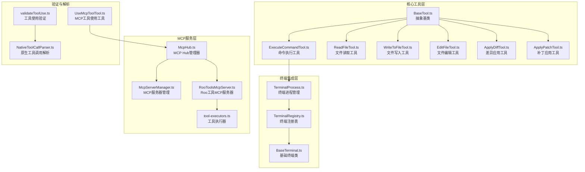
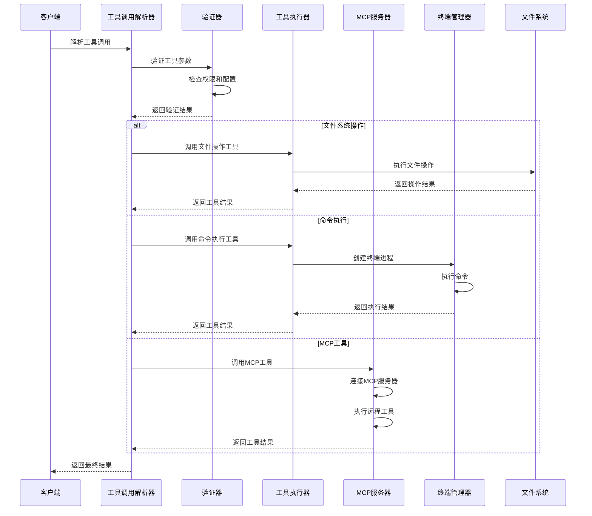
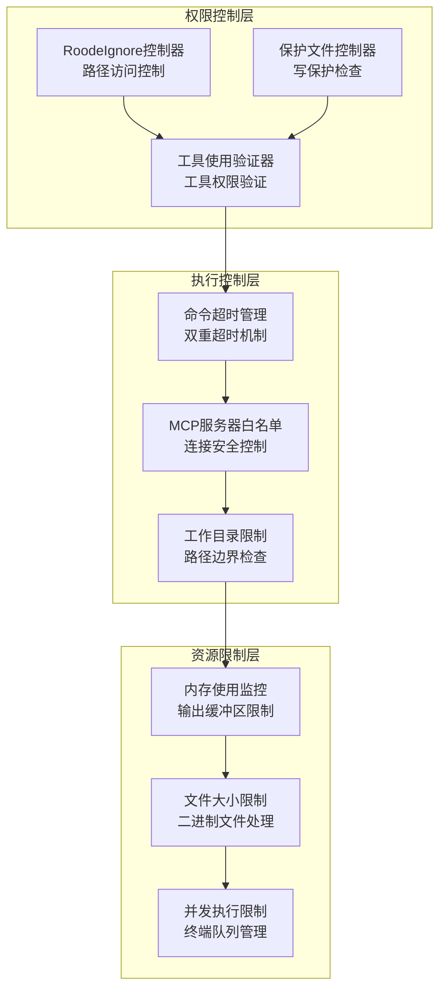
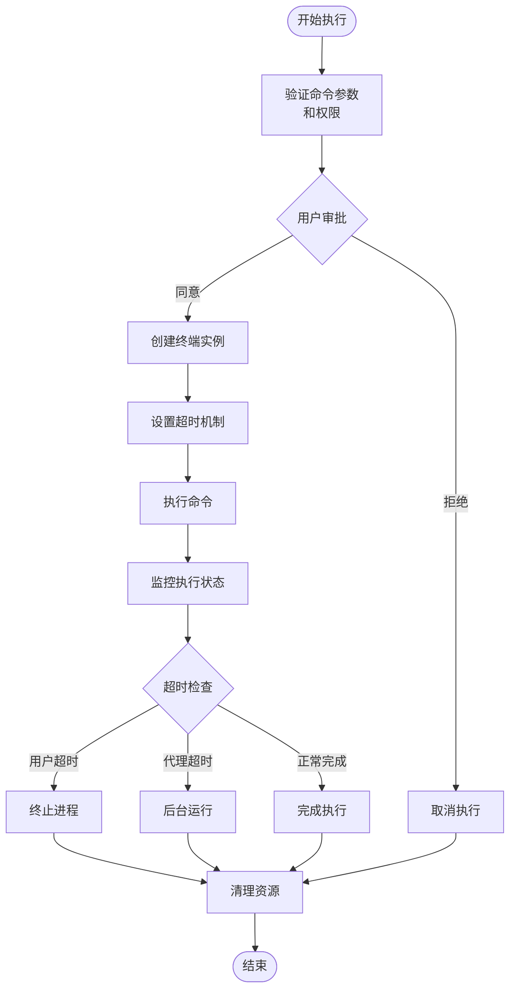
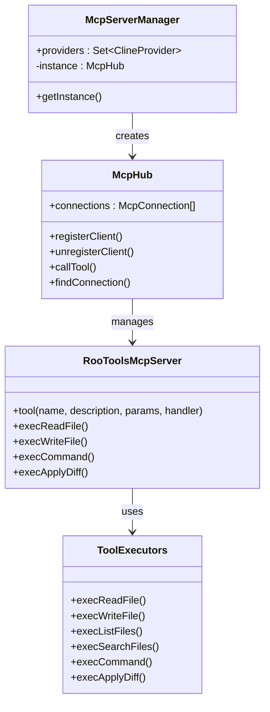
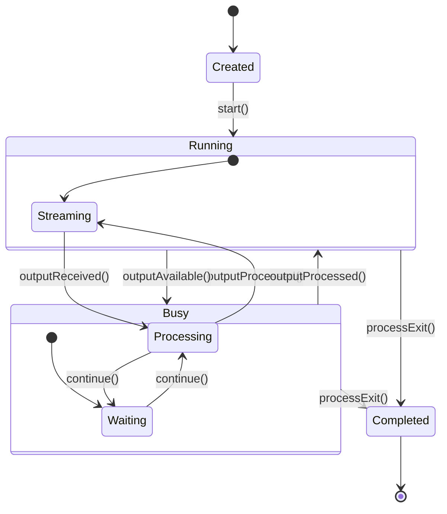
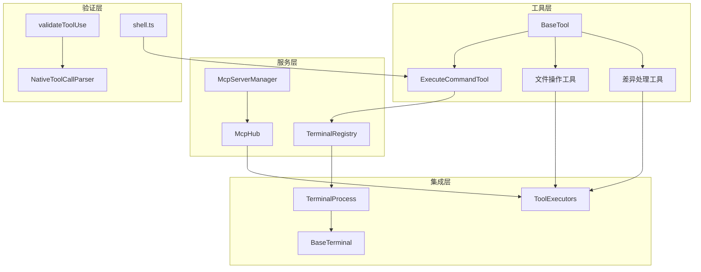

# 工具执行机制

<cite>
**本文档引用的文件**
- [ExecuteCommandTool.ts](file://src/core/tools/ExecuteCommandTool.ts)
- [BaseTool.ts](file://src/core/tools/BaseTool.ts)
- [ApplyDiffTool.ts](file://src/core/tools/ApplyDiffTool.ts)
- [ApplyPatchTool.ts](file://src/core/tools/ApplyPatchTool.ts)
- [EditFileTool.ts](file://src/core/tools/EditFileTool.ts)
- [ReadFileTool.ts](file://src/core/tools/ReadFileTool.ts)
- [WriteToFileTool.ts](file://src/core/tools/WriteToFileTool.ts)
- [tool-executors.ts](file://src/services/mcp-server/tool-executors.ts)
- [RooToolsMcpServer.ts](file://src/services/mcp-server/RooToolsMcpServer.ts)
- [McpHub.ts](file://src/services/mcp/McpHub.ts)
- [McpServerManager.ts](file://src/services/mcp/McpServerManager.ts)
- [TerminalProcess.ts](file://src/integrations/terminal/TerminalProcess.ts)
- [TerminalRegistry.ts](file://src/integrations/terminal/TerminalRegistry.ts)
- [BaseTerminal.ts](file://src/integrations/terminal/BaseTerminal.ts)
- [shell.ts](file://apps/cli/src/lib/utils/shell.ts)
- [validateToolUse.ts](file://src/core/tools/validateToolUse.ts)
- [NativeToolCallParser.ts](file://src/core/assistant-message/NativeToolCallParser.ts)
- [UseMcpToolTool.ts](file://src/core/tools/UseMcpToolTool.ts)
</cite>

## 目录
1. [简介](#简介)
2. [项目结构](#项目结构)
3. [核心组件](#核心组件)
4. [架构概览](#架构概览)
5. [详细组件分析](#详细组件分析)
6. [依赖关系分析](#依赖关系分析)
7. [性能考虑](#性能考虑)
8. [故障排除指南](#故障排除指南)
9. [结论](#结论)

## 简介

本文档深入分析了Njust-AI项目中的工具执行机制，涵盖了从基础工具抽象到具体执行器实现的完整体系。该机制支持多种类型的工具执行，包括文件系统操作、命令执行、差异应用等，并提供了完善的安全控制、权限验证和资源限制机制。

工具执行机制采用分层架构设计，通过抽象基类定义统一接口，具体工具实现各自的功能逻辑，同时通过MCP（Model Context Protocol）服务器提供外部工具集成能力。整个系统注重安全性、可扩展性和用户体验。

## 项目结构

工具执行机制主要分布在以下目录中：

**图表来源**
- [BaseTool.ts:1-167](file://src/core/tools/BaseTool.ts#L1-L167)
- [McpHub.ts:151-200](file://src/services/mcp/McpHub.ts#L151-L200)
- [TerminalProcess.ts:1-487](file://src/integrations/terminal/TerminalProcess.ts#L1-L487)

**章节来源**
- [BaseTool.ts:1-167](file://src/core/tools/BaseTool.ts#L1-L167)
- [McpHub.ts:151-200](file://src/services/mcp/McpHub.ts#L151-L200)
- [TerminalProcess.ts:1-487](file://src/integrations/terminal/TerminalProcess.ts#L1-L487)

## 核心组件

### 抽象工具基类

BaseTool作为所有工具的基础抽象类，定义了统一的工具执行接口和生命周期管理：

- **参数类型系统**：通过泛型约束确保工具参数的类型安全
- **回调机制**：提供审批、错误处理、结果推送等回调接口
- **流式处理**：支持工具调用的流式部分消息处理
- **状态管理**：维护工具执行过程中的状态信息

### 命令执行工具

ExecuteCommandTool实现了强大的命令执行功能：

- **双重超时机制**：支持代理超时和用户超时两种超时策略
- **智能回退**：自动在VSCode终端集成和独立执行器之间切换
- **输出拦截**：提供完整的命令输出捕获和持久化
- **工作目录管理**：支持自定义工作目录和路径验证

### 文件操作工具集

文件操作工具提供了完整的文件系统访问能力：

- **ReadFileTool**：支持切片模式和缩进模式的文件读取
- **WriteToFileTool**：提供安全的文件写入和差异显示
- **EditFileTool**：实现智能的文件内容替换和验证
- **ApplyDiffTool**：支持SEARCH/REPLACE格式的差异应用
- **ApplyPatchTool**：实现标准diff格式的补丁应用

**章节来源**
- [BaseTool.ts:30-167](file://src/core/tools/BaseTool.ts#L30-L167)
- [ExecuteCommandTool.ts:45-636](file://src/core/tools/ExecuteCommandTool.ts#L45-L636)
- [ReadFileTool.ts:74-855](file://src/core/tools/ReadFileTool.ts#L74-L855)
- [WriteToFileTool.ts:28-264](file://src/core/tools/WriteToFileTool.ts#L28-L264)
- [EditFileTool.ts:135-531](file://src/core/tools/EditFileTool.ts#L135-L531)

## 架构概览

工具执行机制采用分层架构设计，确保了系统的模块化和可扩展性：

**图表来源**
- [NativeToolCallParser.ts:1094-1130](file://src/core/assistant-message/NativeToolCallParser.ts#L1094-L1130)
- [validateToolUse.ts:70-117](file://src/core/tools/validateToolUse.ts#L70-L117)
- [ExecuteCommandTool.ts:48-163](file://src/core/tools/ExecuteCommandTool.ts#L48-L163)

### 安全架构

系统实施了多层次的安全控制机制：

**图表来源**
- [validateToolUse.ts:70-88](file://src/core/tools/validateToolUse.ts#L70-L88)
- [tool-executors.ts:13-20](file://src/services/mcp-server/tool-executors.ts#L13-L20)
- [shell.ts:15-47](file://apps/cli/src/lib/utils/shell.ts#L15-L47)

**章节来源**
- [validateToolUse.ts:70-117](file://src/core/tools/validateToolUse.ts#L70-L117)
- [tool-executors.ts:13-20](file://src/services/mcp-server/tool-executors.ts#L13-L20)
- [shell.ts:15-47](file://apps/cli/src/lib/utils/shell.ts#L15-L47)

## 详细组件分析

### 命令执行器实现

命令执行器是工具执行机制的核心组件，负责处理各种类型的命令执行请求：

#### 执行上下文管理

命令执行器通过以下机制管理执行上下文：

- **工作目录管理**：支持相对路径和绝对路径的工作目录解析
- **环境变量隔离**：为每个命令执行提供独立的环境变量空间
- **超时控制**：实现双重超时机制，确保系统稳定性
- **输出流管理**：提供实时输出捕获和持久化存储

#### 并发控制机制

系统采用多层并发控制确保执行安全：

**图表来源**
- [ExecuteCommandTool.ts:180-552](file://src/core/tools/ExecuteCommandTool.ts#L180-L552)
- [TerminalProcess.ts:38-249](file://src/integrations/terminal/TerminalProcess.ts#L38-L249)

#### 结果处理策略

命令执行器采用灵活的结果处理策略：

- **实时输出处理**：通过节流机制控制输出更新频率
- **持久化存储**：对大量输出进行文件持久化
- **状态通知**：向UI组件发送执行状态更新
- **错误恢复**：提供自动回退机制和错误恢复

**章节来源**
- [ExecuteCommandTool.ts:180-552](file://src/core/tools/ExecuteCommandTool.ts#L180-L552)
- [TerminalProcess.ts:38-249](file://src/integrations/terminal/TerminalProcess.ts#L38-L249)

### 文件系统操作实现

文件系统操作工具提供了完整的文件管理能力：

#### 文件读取机制

ReadFileTool支持多种读取模式：

- **切片模式**：按行范围读取文件内容
- **缩进模式**：基于代码缩进层次提取语义块
- **批量处理**：支持多个文件的批量读取和审批
- **二进制文件处理**：智能识别和处理图片、PDF等二进制文件

#### 文件写入与编辑

WriteToFileTool和EditFileTool提供了安全的文件修改机制：

- **差异预览**：在实际修改前显示差异预览
- **写保护检查**：防止对受保护文件的意外修改
- **实验性功能**：支持焦点干扰预防等实验性功能
- **自动保存**：提供智能的文件保存和版本控制

**章节来源**
- [ReadFileTool.ts:89-267](file://src/core/tools/ReadFileTool.ts#L89-L267)
- [WriteToFileTool.ts:31-196](file://src/core/tools/WriteToFileTool.ts#L31-L196)
- [EditFileTool.ts:141-487](file://src/core/tools/EditFileTool.ts#L141-L487)

### MCP工具执行器

MCP（Model Context Protocol）工具执行器提供了外部工具集成能力：

#### 工具执行器架构

**图表来源**
- [McpHub.ts:151-200](file://src/services/mcp/McpHub.ts#L151-L200)
- [McpServerManager.ts:9-39](file://src/services/mcp/McpServerManager.ts#L9-L39)
- [RooToolsMcpServer.ts:120-166](file://src/services/mcp-server/RooToolsMcpServer.ts#L120-L166)

#### 安全控制机制

MCP工具执行器实施了严格的安全控制：

- **路径边界检查**：确保文件操作仅限于工作空间范围内
- **命令白名单**：支持命令执行的允许和拒绝列表
- **工具权限管理**：提供工具级别的访问控制
- **连接状态监控**：实时监控MCP服务器的连接状态

**章节来源**
- [McpHub.ts:1731-1770](file://src/services/mcp/McpHub.ts#L1731-L1770)
- [RooToolsMcpServer.ts:120-166](file://src/services/mcp-server/RooToolsMcpServer.ts#L120-L166)
- [tool-executors.ts:13-20](file://src/services/mcp-server/tool-executors.ts#L13-L20)

### 终端进程管理

终端进程管理系统提供了强大的命令执行基础设施：

#### 终端生命周期管理

**图表来源**
- [TerminalProcess.ts:8-36](file://src/integrations/terminal/TerminalProcess.ts#L8-L36)
- [BaseTerminal.ts:47-85](file://src/integrations/terminal/BaseTerminal.ts#L47-L85)

#### 输出拦截与处理

终端进程管理器提供了完整的输出处理能力：

- **实时输出捕获**：通过异步迭代器捕获命令输出
- **输出过滤**：移除终端集成序列，保留有用的输出内容
- **状态同步**：与VSCode终端集成保持状态同步
- **错误处理**：提供详细的错误诊断和恢复机制

**章节来源**
- [TerminalProcess.ts:38-249](file://src/integrations/terminal/TerminalProcess.ts#L38-L249)
- [BaseTerminal.ts:47-85](file://src/integrations/terminal/BaseTerminal.ts#L47-L85)

## 依赖关系分析

工具执行机制的依赖关系体现了清晰的分层架构：

**图表来源**
- [BaseTool.ts:30-51](file://src/core/tools/BaseTool.ts#L30-L51)
- [McpServerManager.ts:20-39](file://src/services/mcp/McpServerManager.ts#L20-L39)
- [TerminalRegistry.ts:207-328](file://src/integrations/terminal/TerminalRegistry.ts#L207-L328)

**章节来源**
- [BaseTool.ts:30-51](file://src/core/tools/BaseTool.ts#L30-L51)
- [McpServerManager.ts:20-39](file://src/services/mcp/McpServerManager.ts#L20-L39)
- [TerminalRegistry.ts:207-328](file://src/integrations/terminal/TerminalRegistry.ts#L207-L328)

## 性能考虑

工具执行机制在设计时充分考虑了性能优化：

### 内存管理

- **输出缓冲区限制**：限制累积输出的大小，防止内存泄漏
- **异步处理**：采用异步I/O操作避免阻塞主线程
- **资源清理**：及时清理不再使用的资源和监听器

### 并发优化

- **终端池管理**：复用终端实例减少创建开销
- **队列管理**：通过队列系统管理并发执行的任务
- **超时控制**：防止长时间占用系统资源

### 缓存策略

- **文件内容缓存**：对频繁访问的文件内容进行缓存
- **工具结果缓存**：缓存工具执行结果减少重复计算
- **配置缓存**：缓存MCP服务器配置信息

## 故障排除指南

### 常见执行失败问题

#### 命令执行失败

当命令执行失败时，系统会提供详细的错误信息：

- **超时错误**：检查命令执行时间是否超过配置的超时限制
- **权限错误**：验证执行用户的权限和文件访问权限
- **路径错误**：确认工作目录和文件路径的有效性

#### 文件操作异常

文件操作失败的常见原因：

- **路径越界**：确保文件操作在工作空间范围内
- **权限不足**：检查文件的读写权限
- **文件锁定**：确认目标文件未被其他进程占用

#### MCP连接问题

MCP服务器连接失败的排查步骤：

- **服务器状态**：检查MCP服务器的运行状态
- **网络连接**：验证网络连接和防火墙设置
- **认证配置**：确认MCP服务器的认证配置

**章节来源**
- [ExecuteCommandTool.ts:444-467](file://src/core/tools/ExecuteCommandTool.ts#L444-L467)
- [tool-executors.ts:136-179](file://src/services/mcp-server/tool-executors.ts#L136-L179)
- [McpHub.ts:1731-1770](file://src/services/mcp/McpHub.ts#L1731-L1770)

## 结论

Njust-AI项目的工具执行机制展现了现代开发工具的先进设计理念。通过抽象基类、分层架构和多重安全控制，系统实现了功能强大且安全可靠的工具执行能力。

关键特性包括：

- **模块化设计**：清晰的分层架构便于维护和扩展
- **安全性保障**：多层权限控制和资源限制确保系统安全
- **用户体验**：智能的流式处理和实时反馈提升使用体验
- **可扩展性**：灵活的插件机制支持第三方工具集成

该机制为开发者提供了强大而安全的工具执行平台，能够满足各种复杂的开发任务需求。