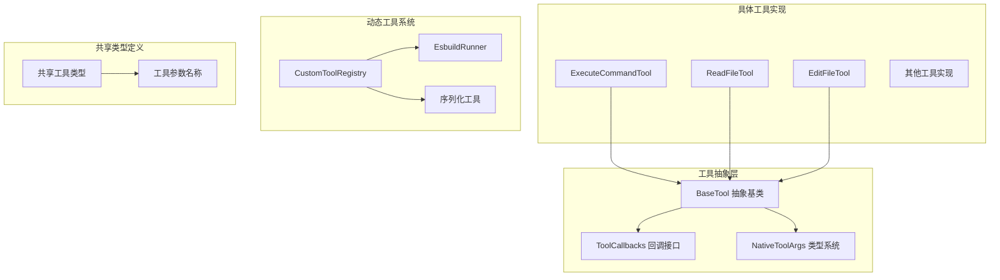
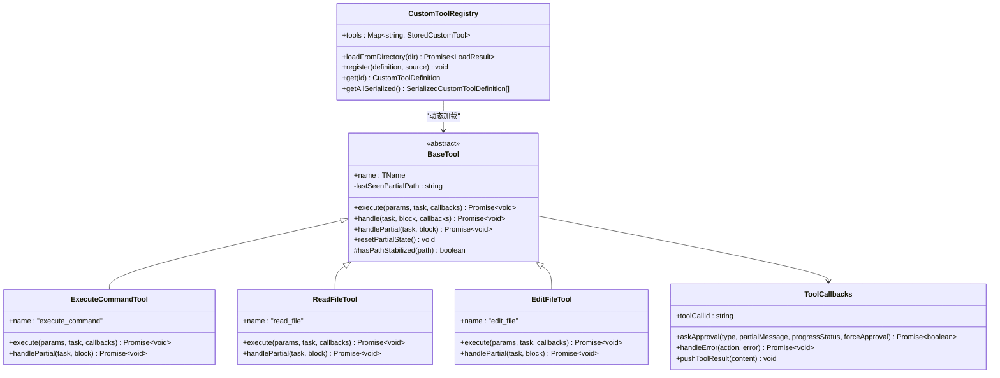
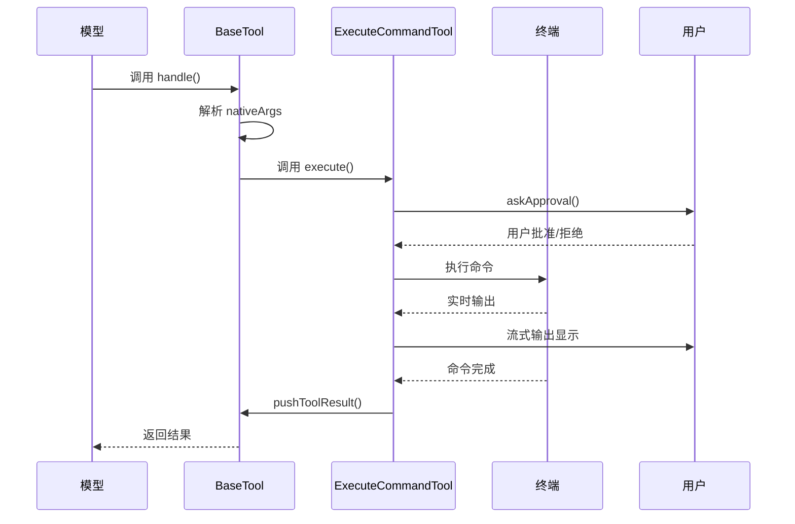
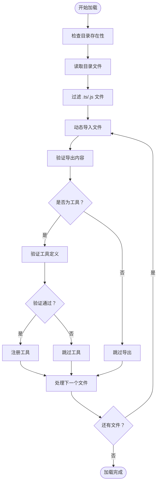
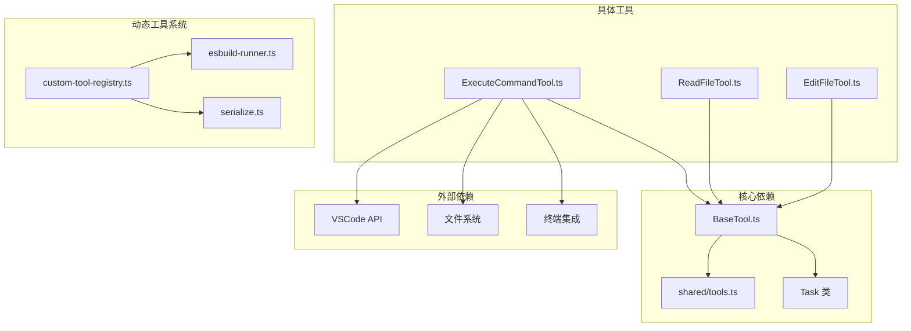

# 工具抽象层设计

<cite>
**本文档引用的文件**
- [BaseTool.ts](file://src/core/tools/BaseTool.ts)
- [tools.ts](file://src/shared/tools.ts)
- [custom-tool-registry.ts](file://packages/core/src/custom-tools/custom-tool-registry.ts)
- [esbuild-runner.ts](file://packages/core/src/custom-tools/esbuild-runner.ts)
- [serialize.ts](file://packages/core/src/custom-tools/serialize.ts)
- [ExecuteCommandTool.ts](file://src/core/tools/ExecuteCommandTool.ts)
- [ReadFileTool.ts](file://src/core/tools/ReadFileTool.ts)
- [EditFileTool.ts](file://src/core/tools/EditFileTool.ts)
</cite>

## 目录
1. [简介](#简介)
2. [项目结构](#项目结构)
3. [核心组件](#核心组件)
4. [架构概览](#架构概览)
5. [详细组件分析](#详细组件分析)
6. [依赖关系分析](#依赖关系分析)
7. [性能考虑](#性能考虑)
8. [故障排除指南](#故障排除指南)
9. [结论](#结论)

## 简介

工具抽象层是Njust-AI智能体系统的核心基础设施，负责统一管理各种工具的执行、参数验证、结果格式化和生命周期管理。该设计通过BaseTool抽象基类提供了标准化的工具接口，支持原生工具调用协议、参数类型推导、流式处理和错误处理机制。

本设计的关键特性包括：
- 统一的工具抽象接口
- 原生参数类型系统
- 流式工具消息处理
- 动态工具注册和加载
- 版本兼容性和向后兼容
- 完整的错误处理和状态管理

## 项目结构

工具抽象层位于`src/core/tools`目录下，采用模块化设计，每个工具都是BaseTool的具体实现。共享工具类型定义在`src/shared/tools.ts`中，动态工具注册机制在`packages/core/src/custom-tools`目录下实现。

**图表来源**
- [BaseTool.ts:30-51](file://src/core/tools/BaseTool.ts#L30-L51)
- [tools.ts:96-125](file://src/shared/tools.ts#L96-L125)
- [custom-tool-registry.ts:31-44](file://packages/core/src/custom-tools/custom-tool-registry.ts#L31-L44)

**章节来源**
- [BaseTool.ts:1-167](file://src/core/tools/BaseTool.ts#L1-L167)
- [tools.ts:1-392](file://src/shared/tools.ts#L1-L392)

## 核心组件

### BaseTool 抽象基类

BaseTool是所有工具的抽象基类，定义了统一的工具接口和生命周期管理机制。

**关键特性：**
- 泛型工具名称支持
- 原生参数类型推导
- 流式消息处理
- 部分状态跟踪
- 错误处理回调

**主要方法：**
- `execute()`: 核心执行方法，接收类型化参数
- `handle()`: 主入口点，处理参数解析和执行流程
- `handlePartial()`: 流式部分消息处理
- `resetPartialState()`: 重置部分状态跟踪

**章节来源**
- [BaseTool.ts:30-167](file://src/core/tools/BaseTool.ts#L30-L167)

### ToolCallbacks 接口

ToolCallbacks定义了工具执行所需的回调函数接口：

**回调函数：**
- `askApproval`: 请求用户批准工具执行
- `handleError`: 处理工具执行错误
- `pushToolResult`: 推送工具执行结果

**章节来源**
- [BaseTool.ts:10-15](file://src/core/tools/BaseTool.ts#L10-L15)

### NativeToolArgs 类型系统

NativeToolArgs提供了原生工具调用的类型安全机制：

**类型推导机制：**
- 基于工具名称的条件类型
- 自动参数类型映射
- 编译时类型检查

**支持的工具类型：**
- 文件操作工具（read_file, write_to_file, edit_file）
- 命令执行工具（execute_command）
- 搜索工具（search_files, codebase_search）
- 其他专用工具

**章节来源**
- [BaseTool.ts:21](file://src/core/tools/BaseTool.ts#L21)
- [tools.ts:96-125](file://src/shared/tools.ts#L96-L125)

## 架构概览

工具抽象层采用分层架构设计，从底层的BaseTool到上层的具体工具实现，形成了清晰的职责分离。

**图表来源**
- [BaseTool.ts:30-167](file://src/core/tools/BaseTool.ts#L30-L167)
- [ExecuteCommandTool.ts:45-169](file://src/core/tools/ExecuteCommandTool.ts#L45-L169)
- [ReadFileTool.ts:74-84](file://src/core/tools/ReadFileTool.ts#L74-L84)
- [EditFileTool.ts:135-531](file://src/core/tools/EditFileTool.ts#L135-L531)
- [custom-tool-registry.ts:31-433](file://packages/core/src/custom-tools/custom-tool-registry.ts#L31-L433)

## 详细组件分析

### 执行命令工具 (ExecuteCommandTool)

ExecuteCommandTool展示了BaseTool的最佳实践实现，包含了完整的参数验证、权限检查和流式输出处理。

**图表来源**
- [ExecuteCommandTool.ts:48-163](file://src/core/tools/ExecuteCommandTool.ts#L48-L163)
- [BaseTool.ts:114-167](file://src/core/tools/BaseTool.ts#L114-L167)

**实现特点：**
- 参数验证和清理
- 权限控制系统集成
- 流式终端输出处理
- 双重超时机制
- 错误恢复和降级处理

**章节来源**
- [ExecuteCommandTool.ts:45-636](file://src/core/tools/ExecuteCommandTool.ts#L45-L636)

### 文件读取工具 (ReadFileTool)

ReadFileTool实现了复杂的文件访问控制和多模式读取功能。

**核心功能：**
- 支持切片模式和缩进模式
- 遗留格式兼容性
- 图像文件特殊处理
- 批量文件处理

**章节来源**
- [ReadFileTool.ts:74-855](file://src/core/tools/ReadFileTool.ts#L74-L855)

### 文件编辑工具 (EditFileTool)

EditFileTool提供了智能的文件修改能力，包含多种匹配策略和差分计算。

**智能匹配策略：**
- 精确字面量匹配
- 空白字符容忍正则表达式
- 令牌基础正则表达式

**章节来源**
- [EditFileTool.ts:135-531](file://src/core/tools/EditFileTool.ts#L135-L531)

### 动态工具注册系统

CustomToolRegistry提供了强大的动态工具加载和管理能力。

**图表来源**
- [custom-tool-registry.ts:53-93](file://packages/core/src/custom-tools/custom-tool-registry.ts#L53-L93)

**核心特性：**
- TypeScript/JavaScript动态编译
- esbuild 集成
- 工具定义验证
- 缓存机制
- 版本兼容性处理

**章节来源**
- [custom-tool-registry.ts:31-433](file://packages/core/src/custom-tools/custom-tool-registry.ts#L31-L433)

### esbuild 运行器

esbuild-runner提供了跨平台的TypeScript编译支持。

**编译特性：**
- esbuild-wasm 集成
- Node.js 内建模块外部化
- CommonJS 兼容性支持
- 源码映射生成

**章节来源**
- [esbuild-runner.ts:1-210](file://packages/core/src/custom-tools/esbuild-runner.ts#L1-L210)

## 依赖关系分析

工具抽象层的依赖关系体现了清晰的分层架构和模块化设计。

**图表来源**
- [BaseTool.ts:1-5](file://src/core/tools/BaseTool.ts#L1-L5)
- [ExecuteCommandTool.ts:10-26](file://src/core/tools/ExecuteCommandTool.ts#L10-L26)
- [custom-tool-registry.ts:11-20](file://packages/core/src/custom-tools/custom-tool-registry.ts#L11-L20)

**依赖特点：**
- 底层依赖较少，上层依赖较多
- 清晰的接口隔离
- 可测试性良好
- 扩展性强

**章节来源**
- [tools.ts:1-392](file://src/shared/tools.ts#L1-L392)

## 性能考虑

工具抽象层在设计时充分考虑了性能优化：

**内存管理：**
- 流式输出处理，避免大对象驻留
- 部分状态跟踪的智能缓存
- 动态工具加载的缓存机制

**执行效率：**
- 泛型类型推导减少运行时检查
- 条件类型确保类型安全
- 异步处理避免阻塞主线程

**资源优化：**
- 终端输出压缩和节流
- 文件读取的缓冲区大小限制
- 图像处理的内存使用控制

## 故障排除指南

### 常见问题和解决方案

**工具参数错误：**
- 检查 nativeArgs 是否正确传递
- 验证参数类型是否符合 NativeToolArgs 定义
- 使用工具的内置参数验证

**动态工具加载失败：**
- 确认 TypeScript 编译环境
- 检查 esbuild-wasm 依赖
- 验证工具定义的完整性

**流式处理问题：**
- 检查路径稳定性检测逻辑
- 确保 handlePartial 方法正确实现
- 验证部分状态重置机制

**章节来源**
- [BaseTool.ts:86-100](file://src/core/tools/BaseTool.ts#L86-L100)
- [custom-tool-registry.ts:391-430](file://packages/core/src/custom-tools/custom-tool-registry.ts#L391-L430)

## 结论

工具抽象层设计成功地实现了以下目标：

**设计理念：**
- 统一的抽象接口，简化工具开发
- 类型安全的参数系统，提升代码质量
- 流式处理支持，改善用户体验
- 动态加载机制，增强扩展性

**技术优势：**
- 完善的错误处理和状态管理
- 良好的性能表现和资源控制
- 强大的向后兼容性支持
- 清晰的架构分层和模块化设计

**扩展性：**
- 易于添加新的工具实现
- 支持动态工具注册和加载
- 灵活的配置和定制选项
- 跨平台的编译和部署支持

该设计为Njust-AI智能体系统的工具生态奠定了坚实的基础，为未来的功能扩展和技术演进提供了充足的空间。