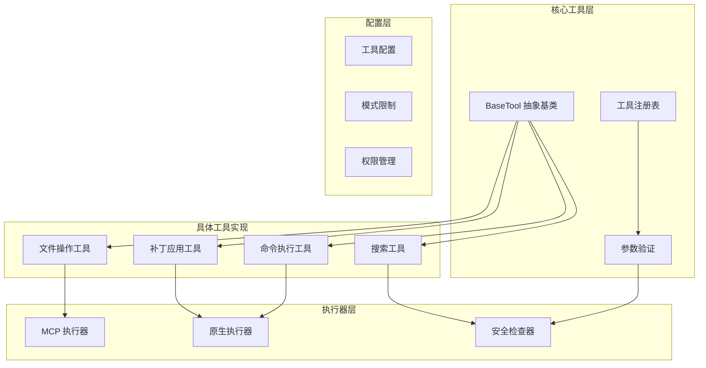
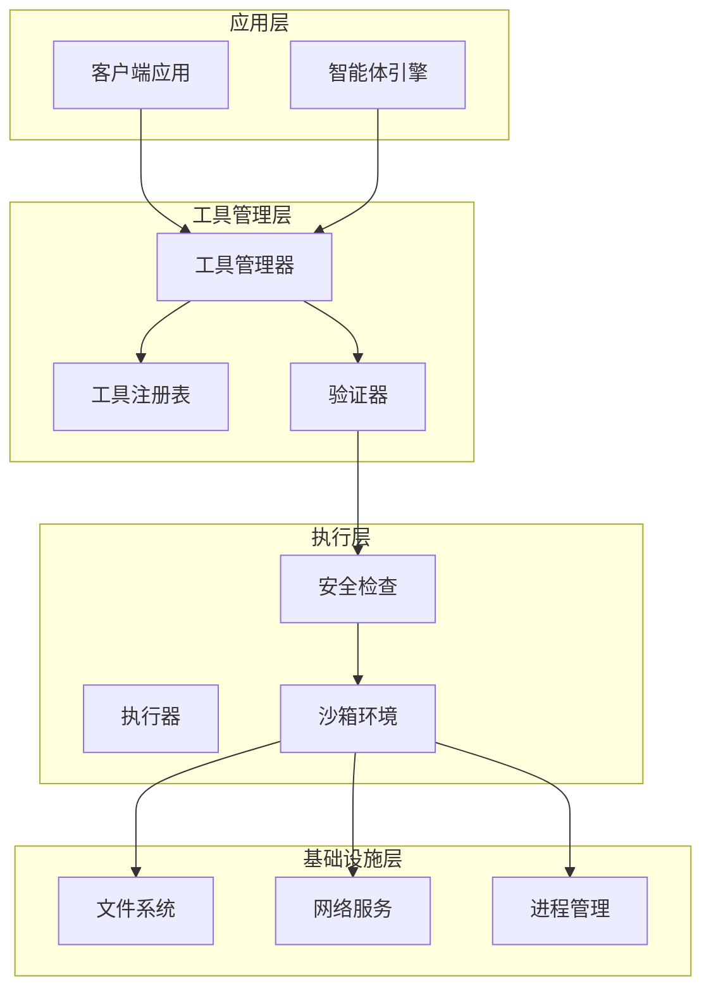
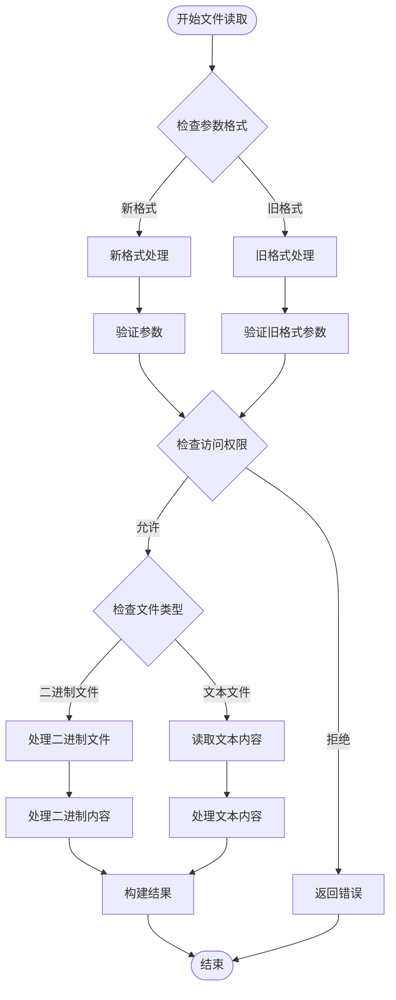
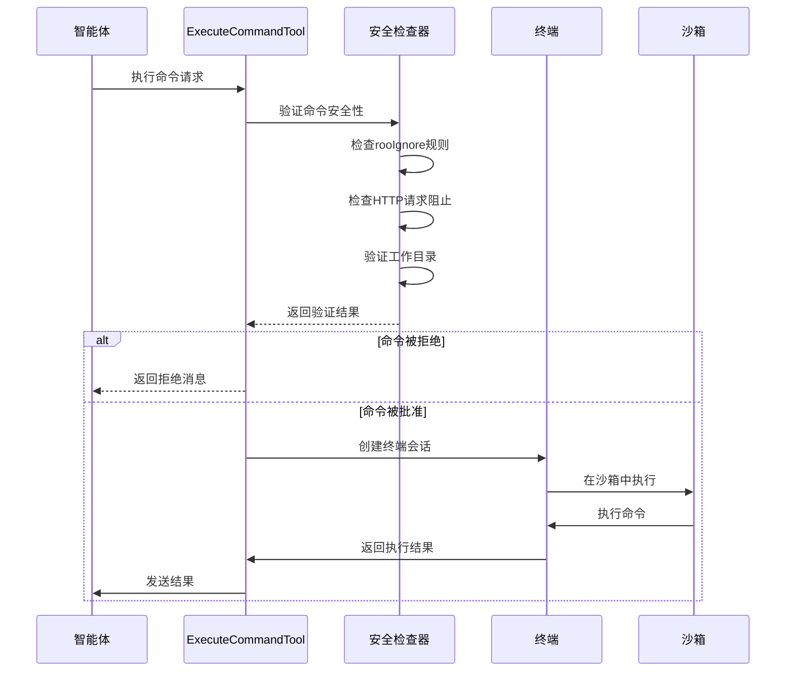
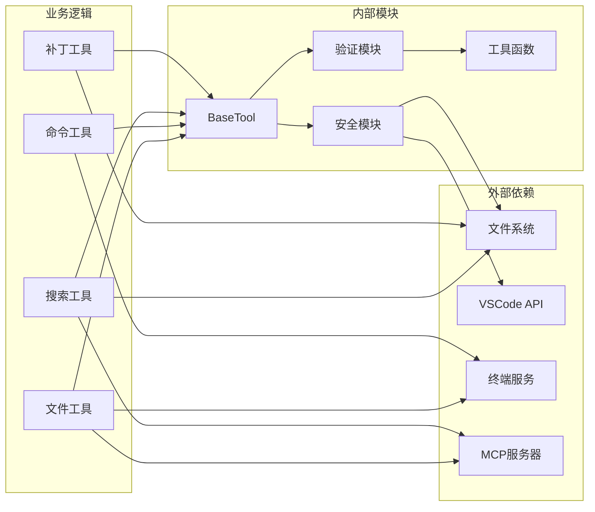

# 工具系统架构

<cite>
**本文档引用的文件**
- [BaseTool.ts](file://src/core/tools/BaseTool.ts)
- [validateToolUse.ts](file://src/core/tools/validateToolUse.ts)
- [build-tools.ts](file://src/core/task/build-tools.ts)
- [tools.ts](file://src/shared/tools.ts)
- [tool-executors.ts](file://src/services/mcp-server/tool-executors.ts)
- [ApplyPatchTool.ts](file://src/core/tools/ApplyPatchTool.ts)
- [EditFileTool.ts](file://src/core/tools/EditFileTool.ts)
- [ExecuteCommandTool.ts](file://src/core/tools/ExecuteCommandTool.ts)
- [ReadFileTool.ts](file://src/core/tools/ReadFileTool.ts)
- [ListFilesTool.ts](file://src/core/tools/ListFilesTool.ts)
</cite>

## 目录
1. [简介](#简介)
2. [项目结构](#项目结构)
3. [核心组件](#核心组件)
4. [架构概览](#架构概览)
5. [详细组件分析](#详细组件分析)
6. [依赖关系分析](#依赖关系分析)
7. [性能考虑](#性能考虑)
8. [故障排除指南](#故障排除指南)
9. [结论](#结论)

## 简介

Njust-AI 工具系统是一个高度模块化的抽象框架，支持多种工具类型（文件操作、命令执行、搜索等）的安全执行。该系统采用抽象基类设计、工具执行器模式和动态注册机制，提供了完整的工具生命周期管理。

系统的核心特性包括：
- **类型安全的工具调用**：通过 TypeScript 泛型确保工具参数的类型安全
- **多协议支持**：同时支持原生协议和 MCP（Model Context Protocol）
- **安全沙箱**：内置路径验证、权限控制和资源限制
- **流式处理**：支持工具执行过程中的实时反馈
- **工具链组合**：允许工具间的协作和数据传递

## 项目结构

工具系统主要分布在以下目录结构中：

**图表来源**
- [BaseTool.ts:30-51](file://src/core/tools/BaseTool.ts#L30-L51)
- [build-tools.ts:66-83](file://src/core/task/build-tools.ts#L66-L83)
- [validateToolUse.ts:57-88](file://src/core/tools/validateToolUse.ts#L57-L88)

**章节来源**
- [BaseTool.ts:1-167](file://src/core/tools/BaseTool.ts#L1-L167)
- [build-tools.ts:1-177](file://src/core/task/build-tools.ts#L1-L177)
- [validateToolUse.ts:1-265](file://src/core/tools/validateToolUse.ts#L1-L265)

## 核心组件

### 抽象基类设计

BaseTool 抽象基类是整个工具系统的基石，提供了统一的工具执行接口和生命周期管理。

**关键特性：**
- **泛型支持**：通过 `TName extends ToolName` 确保类型安全
- **回调机制**：定义了 `askApproval`、`handleError`、`pushToolResult` 三种核心回调
- **流式处理**：支持 `handlePartial` 方法进行部分结果处理
- **状态管理**：内置路径稳定性检测机制

**章节来源**
- [BaseTool.ts:30-167](file://src/core/tools/BaseTool.ts#L30-L167)

### 工具参数验证

validateToolUse 模块提供了完整的工具参数验证机制，确保工具调用的安全性和正确性。

**验证层次：**
1. **工具名称验证**：检查工具是否存在
2. **模式权限验证**：基于当前模式限制工具使用
3. **参数完整性验证**：确保必需参数存在
4. **路径安全性验证**：防止路径遍历攻击

**章节来源**
- [validateToolUse.ts:57-265](file://src/core/tools/validateToolUse.ts#L57-L265)

### 工具构建与注册

build-tools 模块负责工具的动态构建和注册，支持原生工具、MCP 工具和自定义工具的统一管理。

**构建流程：**
1. **工具发现**：扫描可用工具集合
2. **模式过滤**：根据当前模式限制工具可见性
3. **动态加载**：按需加载自定义工具
4. **格式化输出**：转换为模型可理解的格式

**章节来源**
- [build-tools.ts:83-177](file://src/core/task/build-tools.ts#L83-L177)

## 架构概览

工具系统采用分层架构设计，每层都有明确的职责分离：

**图表来源**
- [BaseTool.ts:114-167](file://src/core/tools/BaseTool.ts#L114-L167)
- [build-tools.ts:134-152](file://src/core/task/build-tools.ts#L134-L152)
- [validateToolUse.ts:145-265](file://src/core/tools/validateToolUse.ts#L145-L265)

## 详细组件分析

### 文件操作工具链

文件操作工具链提供了完整的文件读写、搜索和修改功能，支持多种模式和安全检查。

#### ReadFileTool 实现

ReadFileTool 支持两种读取模式：

**图表来源**
- [ReadFileTool.ts:77-267](file://src/core/tools/ReadFileTool.ts#L77-L267)
- [ReadFileTool.ts:354-441](file://src/core/tools/ReadFileTool.ts#L354-L441)

#### EditFileTool 实现

EditFileTool 提供了智能的文件编辑功能，支持多种匹配策略：

**匹配策略顺序：**
1. **精确字面量匹配**：严格匹配指定文本
2. **空白字符容忍正则**：忽略多余的空白字符
3. **令牌正则匹配**：基于单词边界匹配

**章节来源**
- [EditFileTool.ts:141-487](file://src/core/tools/EditFileTool.ts#L141-L487)

### 命令执行工具

ExecuteCommandTool 提供了安全的命令执行环境，具有多重安全保护机制：

**图表来源**
- [ExecuteCommandTool.ts:48-163](file://src/core/tools/ExecuteCommandTool.ts#L48-L163)
- [ExecuteCommandTool.ts:180-552](file://src/core/tools/ExecuteCommandTool.ts#L180-L552)

**章节来源**
- [ExecuteCommandTool.ts:1-636](file://src/core/tools/ExecuteCommandTool.ts#L1-L636)

### 补丁应用工具

ApplyPatchTool 实现了复杂的补丁应用逻辑，支持文件创建、删除和更新操作：

**补丁处理流程：**
1. **补丁解析**：解析统一差异格式
2. **变更检测**：识别文件操作类型
3. **权限验证**：检查文件访问权限
4. **安全检查**：验证路径安全性
5. **用户确认**：显示变更预览并等待确认
6. **应用变更**：执行文件操作

**章节来源**
- [ApplyPatchTool.ts:57-141](file://src/core/tools/ApplyPatchTool.ts#L57-L141)

### 列表文件工具

ListFilesTool 提供了安全的目录列表功能，支持递归搜索和权限过滤：

**安全特性：**
- **路径验证**：确保路径在工作空间内
- **权限过滤**：隐藏受保护的文件
- **大小限制**：防止大量文件导致的性能问题
- **用户确认**：显示目录内容供用户确认

**章节来源**
- [ListFilesTool.ts:24-78](file://src/core/tools/ListFilesTool.ts#L24-L78)

## 依赖关系分析

工具系统采用了清晰的依赖注入和接口分离设计：

**图表来源**
- [BaseTool.ts:10-15](file://src/core/tools/BaseTool.ts#L10-L15)
- [validateToolUse.ts:1-8](file://src/core/tools/validateToolUse.ts#L1-L8)
- [tool-executors.ts:1-20](file://src/services/mcp-server/tool-executors.ts#L1-L20)

**章节来源**
- [tools.ts:1-392](file://src/shared/tools.ts#L1-L392)

## 性能考虑

工具系统在设计时充分考虑了性能优化：

### 内存管理
- **流式处理**：命令输出采用流式处理，避免内存溢出
- **缓冲区限制**：设置最大累积输出大小（100KB）
- **垃圾回收**：及时清理临时对象和回调

### 并发控制
- **任务队列**：使用消息队列管理工具执行顺序
- **超时机制**：双重超时（用户超时和代理超时）
- **资源池**：复用终端和文件句柄

### 缓存策略
- **工具注册缓存**：避免重复加载自定义工具
- **文件内容缓存**：减少重复读取
- **权限检查缓存**：提高权限验证效率

## 故障排除指南

### 常见问题诊断

**工具调用失败**
1. 检查工具名称是否正确
2. 验证必需参数是否完整
3. 确认当前模式是否允许使用该工具

**权限被拒绝**
1. 检查 `.rooignore` 配置
2. 验证文件路径是否在工作空间内
3. 确认文件是否被标记为受保护

**命令执行超时**
1. 检查命令执行超时设置
2. 验证命令是否需要长时间运行
3. 考虑使用代理超时机制

### 调试技巧

**启用详细日志**
- 设置环境变量 `DEBUG=tools:*`
- 使用开发者工具查看控制台输出
- 检查工具执行的每个步骤

**测试工具行为**
- 使用单元测试验证工具逻辑
- 创建集成测试模拟真实场景
- 使用断点调试复杂流程

**性能监控**
- 监控内存使用情况
- 跟踪工具执行时间
- 分析并发执行的影响

**章节来源**
- [ExecuteCommandTool.ts:444-463](file://src/core/tools/ExecuteCommandTool.ts#L444-L463)
- [ReadFileTool.ts:247-267](file://src/core/tools/ReadFileTool.ts#L247-L267)

## 结论

Njust-AI 工具系统通过精心设计的架构实现了高度的安全性、可扩展性和易用性。其核心优势包括：

1. **类型安全**：完整的 TypeScript 类型系统确保编译时错误检测
2. **安全优先**：多层次的安全检查和沙箱机制
3. **灵活扩展**：支持原生工具、MCP 工具和自定义工具
4. **用户体验**：提供丰富的流式反馈和用户确认机制
5. **性能优化**：高效的内存管理和并发控制

该系统为 AI 驱动的开发工具提供了坚实的基础，支持从简单的文件操作到复杂的代码生成等各种应用场景。通过遵循本文档的最佳实践和安全指南，开发者可以构建更加可靠和高效的工具系统。