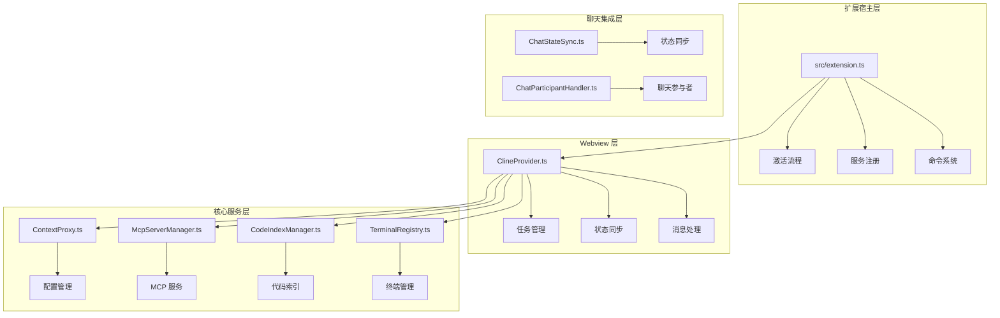
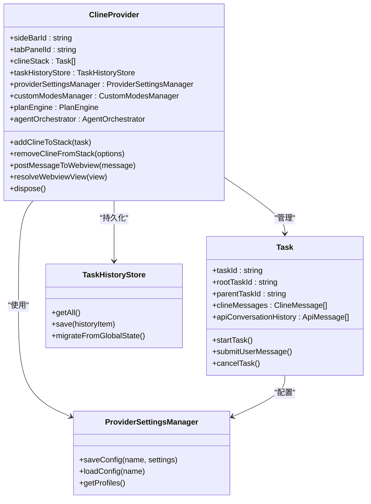
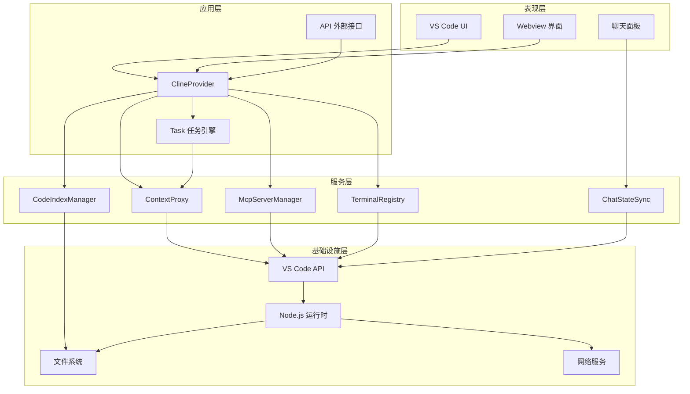
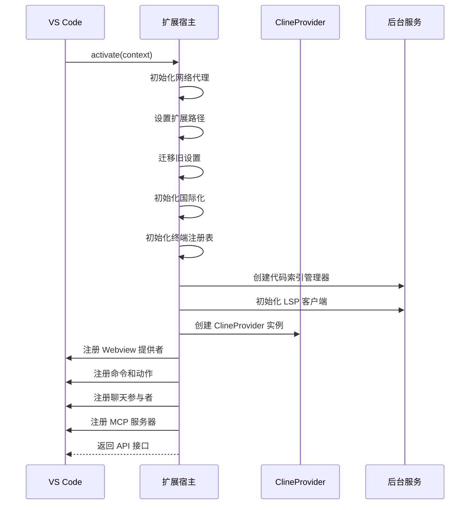
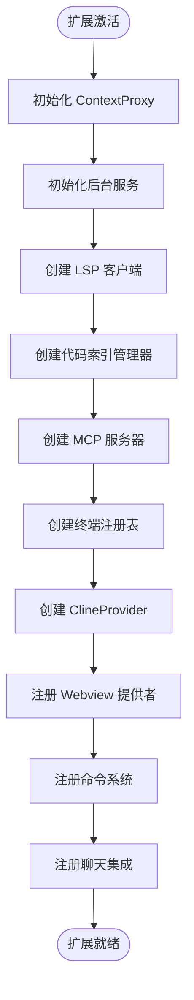
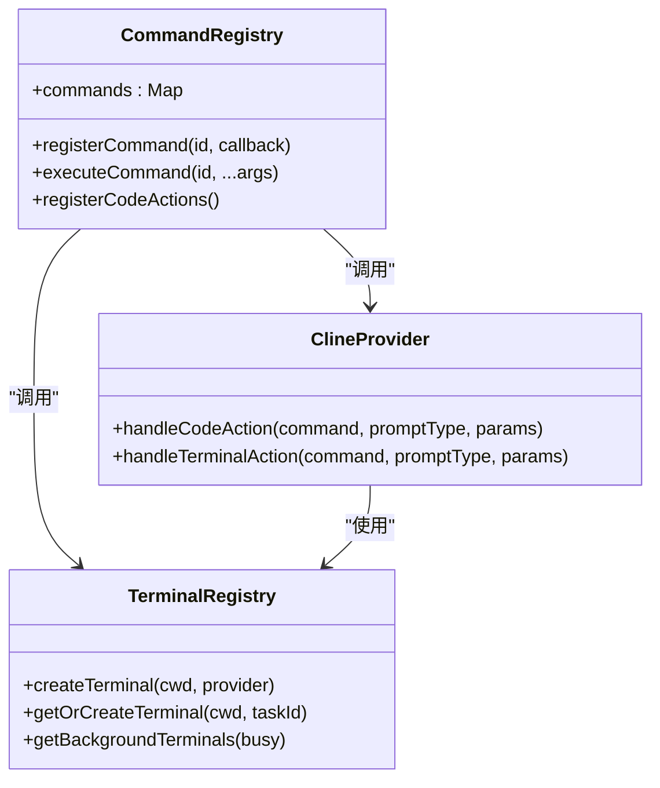
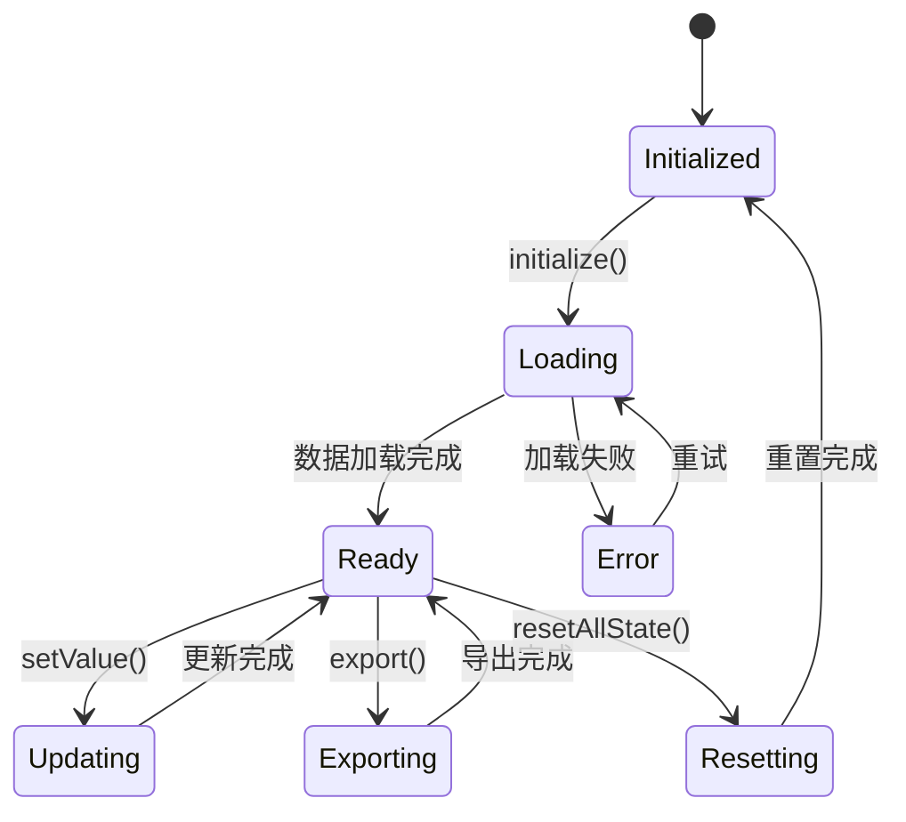
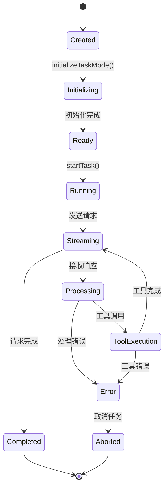
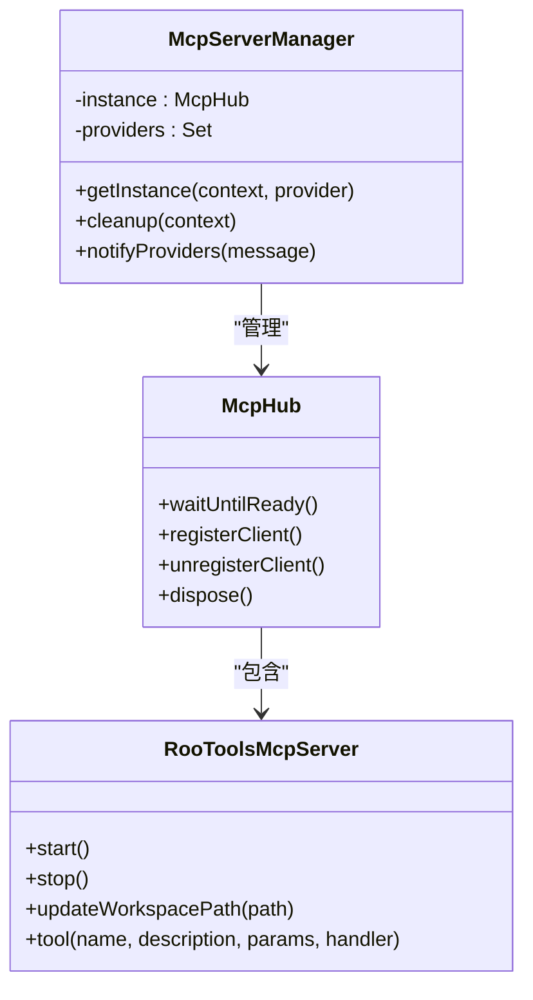
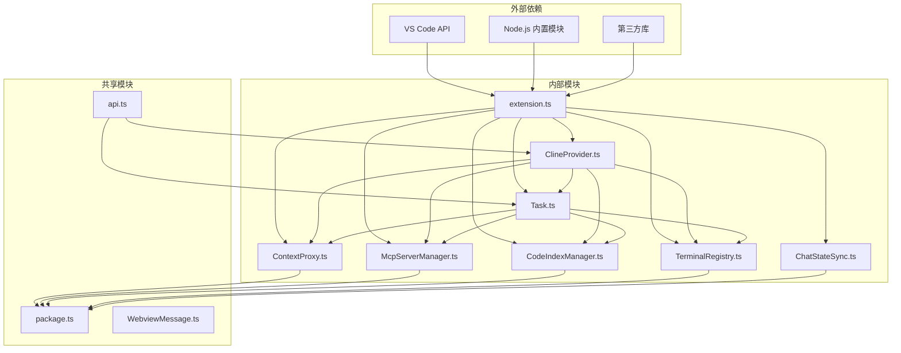

# 扩展架构设计

<cite>
**本文档引用的文件**
- [src/extension.ts](file://src/extension.ts)
- [src/core/webview/ClineProvider.ts](file://src/core/webview/ClineProvider.ts)
- [src/extension/api.ts](file://src/extension/api.ts)
- [src/activate/index.ts](file://src/activate/index.ts)
- [src/activate/registerCommands.ts](file://src/activate/registerCommands.ts)
- [src/activate/registerCodeActions.ts](file://src/activate/registerCodeActions.ts)
- [src/services/mcp-server/RooToolsMcpServer.ts](file://src/services/mcp-server/RooToolsMcpServer.ts)
- [src/services/code-index/manager.ts](file://src/services/code-index/manager.ts)
- [src/core/config/ContextProxy.ts](file://src/core/config/ContextProxy.ts)
- [src/services/mcp/McpServerManager.ts](file://src/services/mcp/McpServerManager.ts)
- [src/integrations/terminal/TerminalRegistry.ts](file://src/integrations/terminal/TerminalRegistry.ts)
- [src/chat/ChatStateSync.ts](file://src/chat/ChatStateSync.ts)
- [src/shared/package.ts](file://src/shared/package.ts)
- [src/core/task/Task.ts](file://src/core/task/Task.ts)
</cite>

## 目录
1. [简介](#简介)
2. [项目结构](#项目结构)
3. [核心组件](#核心组件)
4. [架构总览](#架构总览)
5. [详细组件分析](#详细组件分析)
6. [依赖关系分析](#依赖关系分析)
7. [性能考虑](#性能考虑)
8. [故障排除指南](#故障排除指南)
9. [结论](#结论)

## 简介

Njust-AI VS Code 扩展采用分离式架构设计，将扩展宿主（Extension Host）与 Webview 宿主进行清晰分离。该架构通过 ClineProvider 实现模式，构建了完整的任务执行引擎、服务注册机制和全局状态管理系统。

该扩展的核心设计理念包括：
- **分离式架构**：扩展宿主负责后台服务和状态管理，Webview 负责用户交互界面
- **组件生命周期管理**：通过 Disposable 模式确保资源正确释放
- **依赖注入模式**：使用 ContextProxy 提供统一的配置访问接口
- **事件驱动架构**：基于 EventEmitter 的异步事件处理机制
- **服务注册系统**：集中管理各类服务的初始化和清理

## 项目结构

扩展采用模块化组织方式，主要目录结构如下：

**图表来源**
- [src/extension.ts:95-543](file://src/extension.ts#L95-L543)
- [src/core/webview/ClineProvider.ts:126-620](file://src/core/webview/ClineProvider.ts#L126-L620)

**章节来源**
- [src/extension.ts:1-576](file://src/extension.ts#L1-L576)
- [src/activate/index.ts:1-6](file://src/activate/index.ts#L1-L6)

## 核心组件

### ClineProvider - 主要组件

ClineProvider 是扩展的核心组件，实现了 VS Code 的 WebviewViewProvider 接口，负责：

- **Webview 生命周期管理**：处理 Webview 的创建、销毁和状态同步
- **任务栈管理**：维护多任务的 LIFO 栈结构
- **状态持久化**：通过 TaskHistoryStore 管理任务历史
- **事件分发**：转发任务事件到外部监听器

**图表来源**
- [src/core/webview/ClineProvider.ts:126-620](file://src/core/webview/ClineProvider.ts#L126-L620)
- [src/core/task/Task.ts:176-587](file://src/core/task/Task.ts#L176-L587)

### ContextProxy - 配置管理层

ContextProxy 提供统一的配置访问接口，封装了 VS Code 的 ExtensionContext：

- **状态缓存**：在内存中缓存全局状态和密钥
- **类型安全**：使用 Zod Schema 进行配置验证
- **迁移支持**：自动处理配置格式变更
- **加密存储**：通过 VS Code Secrets API 管理敏感信息

**章节来源**
- [src/core/config/ContextProxy.ts:40-589](file://src/core/config/ContextProxy.ts#L40-L589)

## 架构总览

扩展采用分层架构设计，各层职责明确：

**图表来源**
- [src/extension.ts:95-543](file://src/extension.ts#L95-L543)
- [src/core/webview/ClineProvider.ts:126-620](file://src/core/webview/ClineProvider.ts#L126-L620)

## 详细组件分析

### 扩展激活流程

扩展激活采用异步初始化模式，确保所有服务正确启动：

**图表来源**
- [src/extension.ts:95-543](file://src/extension.ts#L95-L543)

### 服务注册机制

扩展通过集中式的服务注册系统管理各种后台服务：

**图表来源**
- [src/extension.ts:153-483](file://src/extension.ts#L153-L483)

### 命令注册系统

扩展实现了完整的命令注册系统，支持多种触发方式：

**图表来源**
- [src/activate/registerCommands.ts:64-183](file://src/activate/registerCommands.ts#L64-L183)
- [src/activate/registerCodeActions.ts:9-54](file://src/activate/registerCodeActions.ts#L9-L54)

**章节来源**
- [src/activate/registerCommands.ts:1-251](file://src/activate/registerCommands.ts#L1-L251)
- [src/activate/registerCodeActions.ts:1-54](file://src/activate/registerCodeActions.ts#L1-L54)

### 全局状态管理

扩展采用 ContextProxy 提供统一的状态管理接口：

**图表来源**
- [src/core/config/ContextProxy.ts:58-104](file://src/core/config/ContextProxy.ts#L58-L104)

**章节来源**
- [src/core/config/ContextProxy.ts:40-589](file://src/core/config/ContextProxy.ts#L40-L589)

### 任务执行引擎

Task 类实现了完整的任务生命周期管理：

**图表来源**
- [src/core/task/Task.ts:176-587](file://src/core/task/Task.ts#L176-L587)

**章节来源**
- [src/core/task/Task.ts:1-800](file://src/core/task/Task.ts#L1-L800)

### MCP 服务器管理

扩展提供了强大的 MCP（Model Context Protocol）服务器管理能力：

**图表来源**
- [src/services/mcp/McpServerManager.ts:9-87](file://src/services/mcp/McpServerManager.ts#L9-L87)
- [src/services/mcp-server/RooToolsMcpServer.ts:27-339](file://src/services/mcp-server/RooToolsMcpServer.ts#L27-L339)

**章节来源**
- [src/services/mcp-server/RooToolsMcpServer.ts:1-339](file://src/services/mcp-server/RooToolsMcpServer.ts#L1-L339)

## 依赖关系分析

扩展的依赖关系呈现清晰的层次结构：

**图表来源**
- [src/extension.ts:1-70](file://src/extension.ts#L1-L70)
- [src/core/webview/ClineProvider.ts:1-106](file://src/core/webview/ClineProvider.ts#L1-L106)

**章节来源**
- [src/shared/package.ts:1-16](file://src/shared/package.ts#L1-L16)

## 性能考虑

### 内存管理策略

扩展采用了多项内存管理优化措施：

- **延迟初始化**：大部分服务采用延迟初始化，避免启动时的性能开销
- **资源池管理**：终端和工具调用采用池化管理，减少对象创建开销
- **垃圾回收优化**：及时清理事件监听器和定时器，防止内存泄漏
- **缓存策略**：合理使用内存缓存，平衡内存占用和性能

### 并发处理机制

扩展通过以下机制处理并发操作：

- **Promise 链式调用**：避免回调地狱，提高代码可读性和维护性
- **事件驱动架构**：基于 EventEmitter 的异步事件处理
- **防抖和节流**：对频繁触发的操作进行性能优化
- **超时控制**：为长时间运行的操作设置合理的超时机制

### 性能监控

扩展集成了全面的性能监控机制：

- **指标收集**：记录 API 调用次数、响应时间等关键指标
- **错误追踪**：捕获和报告异常情况，便于问题诊断
- **资源使用**：监控内存和 CPU 使用情况
- **日志分级**：区分不同级别的日志输出，便于调试和生产环境监控

## 故障排除指南

### 常见问题及解决方案

**Webview 无法加载**
- 检查 Webview 权限配置
- 验证本地资源根路径设置
- 确认 retainContextWhenHidden 配置

**任务执行失败**
- 查看任务历史记录中的错误信息
- 检查 API 配置和认证信息
- 验证工作空间权限和文件访问

**MCP 服务器连接问题**
- 确认 MCP 服务器配置参数
- 检查防火墙和网络设置
- 验证认证令牌的有效性

**内存泄漏问题**
- 检查事件监听器是否正确清理
- 确认定时器和订阅是否及时注销
- 验证循环引用的消除

### 调试技巧

- 使用 VS Code 开发者工具进行调试
- 启用详细的日志输出
- 利用断点和条件断点定位问题
- 分析内存快照识别泄漏源

**章节来源**
- [src/extension.ts:545-576](file://src/extension.ts#L545-L576)

## 结论

Njust-AI VS Code 扩展展现了现代扩展开发的最佳实践，通过分离式架构设计实现了高度模块化和可维护的代码结构。该架构的主要优势包括：

1. **清晰的职责分离**：扩展宿主和 Webview 的职责明确划分
2. **强大的服务管理**：完善的依赖注入和生命周期管理
3. **灵活的事件系统**：基于 EventEmitter 的异步事件处理机制
4. **优秀的性能表现**：通过延迟初始化和资源池化优化性能
5. **全面的错误处理**：完善的异常捕获和恢复机制

该架构为后续功能扩展和维护奠定了坚实的基础，能够支持复杂的企业级应用场景。通过持续的性能优化和功能增强，该扩展有望成为 VS Code 生态系统中的重要组成部分。