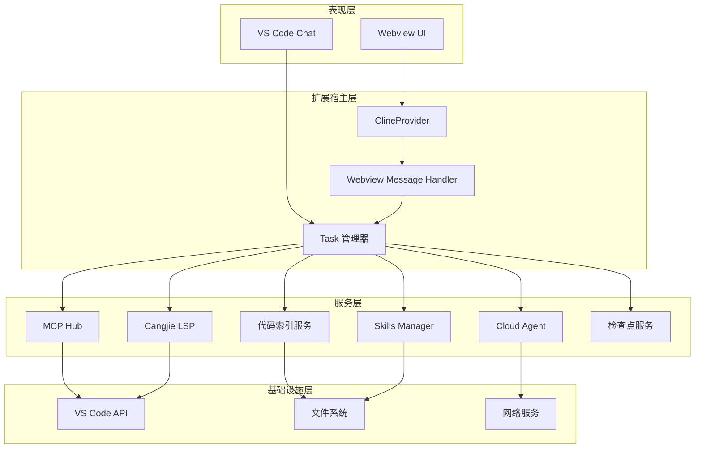
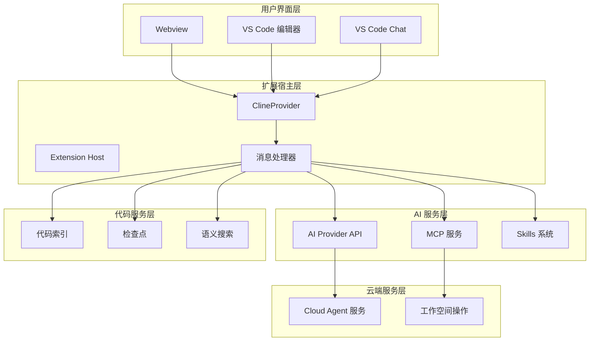
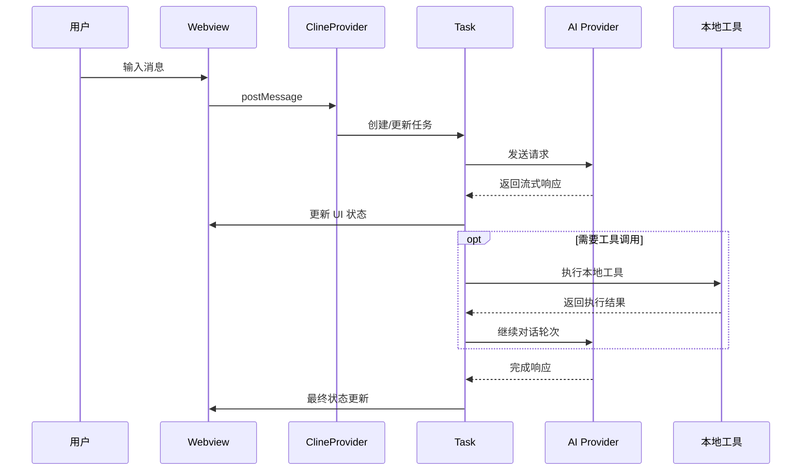
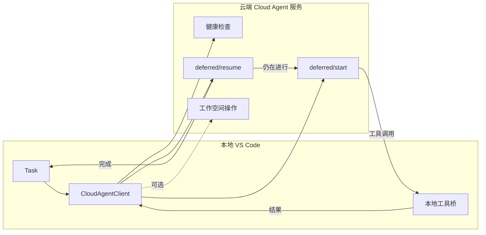
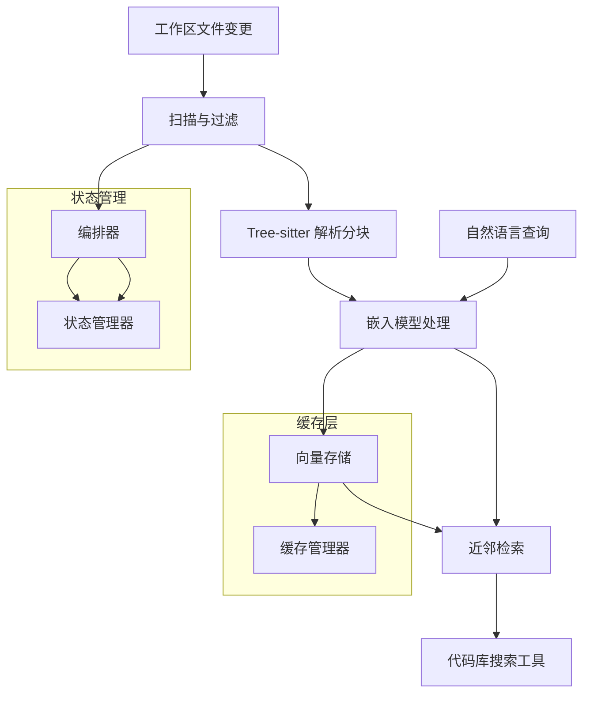
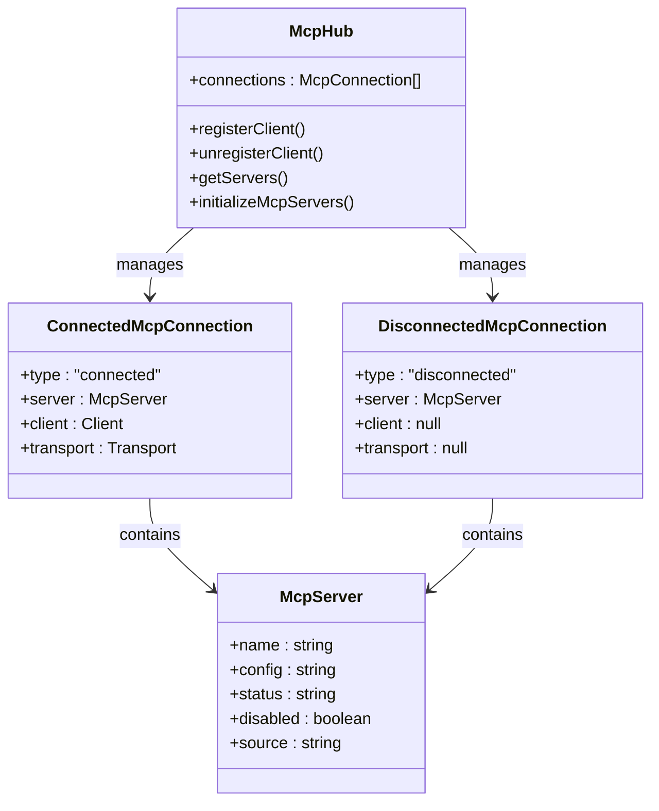
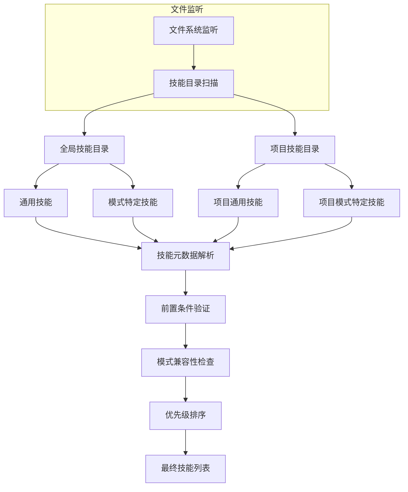
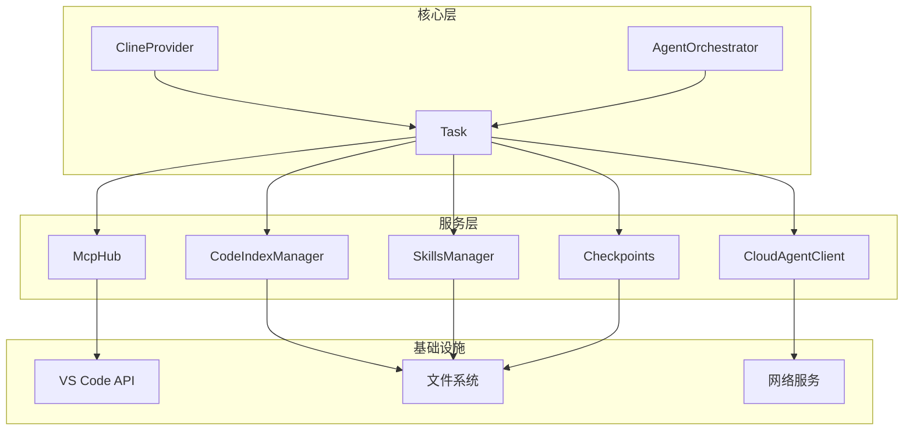
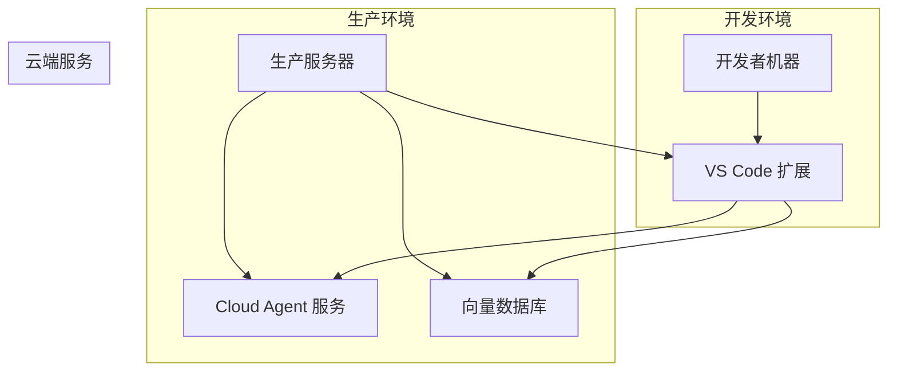

# 架构设计

<cite>
**本文档引用的文件**
- [README.md](file://README.md)
- [package.json](file://package.json)
- [Task.ts](file://src/core/task/Task.ts)
- [ClineProvider.ts](file://src/core/webview/ClineProvider.ts)
- [AgentOrchestrator.ts](file://src/core/agent/AgentOrchestrator.ts)
- [CloudAgentClient.ts](file://src/services/cloud-agent/CloudAgentClient.ts)
- [manager.ts](file://src/services/code-index/manager.ts)
- [orchestrator.ts](file://src/services/code-index/orchestrator.ts)
- [search-service.ts](file://src/services/code-index/search-service.ts)
- [McpHub.ts](file://src/services/mcp/McpHub.ts)
- [SkillsManager.ts](file://src/services/skills/SkillsManager.ts)
- [RepoPerTaskCheckpointService.ts](file://src/services/checkpoints/RepoPerTaskCheckpointService.ts)
</cite>

## 目录
1. [简介](#简介)
2. [项目结构](#项目结构)
3. [核心组件](#核心组件)
4. [架构概览](#架构概览)
5. [详细组件分析](#详细组件分析)
6. [依赖关系分析](#依赖关系分析)
7. [性能考虑](#性能考虑)
8. [故障排除指南](#故障排除指南)
9. [结论](#结论)
10. [附录](#附录)

## 简介

Njust-AI 是一个基于 VS Code 的 AI 编程助手扩展，采用 Webview 与扩展宿主分离的架构设计。该项目专注于提供智能代码辅助、任务编排和云端协作能力，支持多种 AI 模型提供商和本地/云端混合工作模式。

### 核心特性

- **分离式架构**：Webview 与扩展宿主进程完全分离，确保 UI 响应性和安全性
- **多模式支持**：包括 Cloud Agent、Architect、Code、Ask、Debug、Cangjie Dev、Orchestrator 等模式
- **云端协作**：通过 Cloud Agent 实现推理在服务端、工具在本地的混合执行模式
- **代码索引**：完整的向量语义搜索索引系统，支持增量更新和缓存优化
- **MCP 集成**：支持 Model Context Protocol，实现工具和服务的标准化接口

## 项目结构

项目采用模块化的分层架构，主要分为以下几个层次：

**图表来源**
- [README.md:37-68](file://README.md#L37-L68)
- [ClineProvider.ts:126-220](file://src/core/webview/ClineProvider.ts#L126-L220)

**章节来源**
- [README.md:346-364](file://README.md#L346-L364)
- [package.json:1-68](file://package.json#L1-L68)

## 核心组件

### 1. 任务管理系统 (Task)

Task 类是整个系统的中枢，负责管理单次用户请求的完整生命周期：

- **状态管理**：维护任务的完整状态，包括模式、API 配置、工具使用情况
- **流式处理**：支持 AI 模型的流式响应处理和工具调用
- **检查点机制**：提供任务级别的检查点和回滚能力
- **错误处理**：完善的错误捕获和恢复机制

### 2. ClineProvider

ClineProvider 作为 Webview 宿主，承担着以下职责：

- **状态聚合**：收集和管理所有任务的状态信息
- **消息路由**：在 Webview 和任务系统之间传递消息
- **UI 同步**：保持 Webview 界面与内部状态的一致性
- **资源管理**：管理各种服务的生命周期和资源分配

### 3. Cloud Agent 子系统

Cloud Agent 实现了推理在服务端、工具在本地的混合执行模式：

- **健康检查**：定期验证云端服务的可用性
- **延期协议**：支持多轮推理循环，直到达到完成状态
- **工具桥接**：将云端工具调用映射到本地工具实现
- **工作空间操作**：支持云端对本地文件系统的读写操作

**章节来源**
- [Task.ts:176-587](file://src/core/task/Task.ts#L176-L587)
- [ClineProvider.ts:126-220](file://src/core/webview/ClineProvider.ts#L126-L220)
- [CloudAgentClient.ts:43-339](file://src/services/cloud-agent/CloudAgentClient.ts#L43-L339)

## 架构概览

### 系统边界

**图表来源**
- [README.md:37-68](file://README.md#L37-L68)
- [ClineProvider.ts:126-220](file://src/core/webview/ClineProvider.ts#L126-L220)

### 数据流架构

**图表来源**
- [README.md:74-97](file://README.md#L74-L97)
- [Task.ts:176-587](file://src/core/task/Task.ts#L176-L587)

## 详细组件分析

### Cloud Agent 延期协议循环

Cloud Agent 实现了复杂的延期协议，支持推理在云端、工具在本地的混合执行模式：

**图表来源**
- [README.md:99-125](file://README.md#L99-L125)
- [CloudAgentClient.ts:306-333](file://src/services/cloud-agent/CloudAgentClient.ts#L306-L333)

### 代码索引流水线

代码索引系统实现了从文件到语义检索的完整流水线：

**图表来源**
- [README.md:127-141](file://README.md#L127-L141)
- [manager.ts:18-466](file://src/services/code-index/manager.ts#L18-L466)
- [orchestrator.ts:14-399](file://src/services/code-index/orchestrator.ts#L14-L399)
- [search-service.ts:11-66](file://src/services/code-index/search-service.ts#L11-L66)

### MCP 服务架构

MCP Hub 实现了 Model Context Protocol 的完整支持：

**图表来源**
- [McpHub.ts:151-800](file://src/services/mcp/McpHub.ts#L151-L800)

**章节来源**
- [CloudAgentClient.ts:43-339](file://src/services/cloud-agent/CloudAgentClient.ts#L43-L339)
- [manager.ts:18-466](file://src/services/code-index/manager.ts#L18-L466)
- [orchestrator.ts:14-399](file://src/services/code-index/orchestrator.ts#L14-L399)
- [search-service.ts:11-66](file://src/services/code-index/search-service.ts#L11-L66)
- [McpHub.ts:151-800](file://src/services/mcp/McpHub.ts#L151-L800)

### Skills 管理系统

Skills Manager 实现了灵活的技能发现和管理机制：

**图表来源**
- [SkillsManager.ts:44-521](file://src/services/skills/SkillsManager.ts#L44-L521)

**章节来源**
- [SkillsManager.ts:22-730](file://src/services/skills/SkillsManager.ts#L22-L730)

## 依赖关系分析

### 组件耦合度分析

**图表来源**
- [ClineProvider.ts:126-220](file://src/core/webview/ClineProvider.ts#L126-L220)
- [Task.ts:176-587](file://src/core/task/Task.ts#L176-L587)

### 外部依赖管理

项目使用 pnpm 进行依赖管理，主要依赖包括：

- **VS Code 扩展 API**：提供核心的编辑器集成能力
- **AI 模型提供商 SDK**：支持多种 AI 服务提供商
- **MCP 协议实现**：实现标准化的工具调用协议
- **向量数据库客户端**：支持语义搜索功能
- **文件系统监听**：实现增量索引更新

**章节来源**
- [package.json:1-68](file://package.json#L1-L68)

## 性能考虑

### 1. 缓存策略

- **代码索引缓存**：使用缓存管理器避免重复嵌入计算
- **API 响应缓存**：减少重复的 API 调用
- **工具结果缓存**：避免重复执行相同的工具调用

### 2. 异步处理

- **流式处理**：支持 AI 响应的流式传输，提升用户体验
- **批量处理**：文件索引采用批量处理策略，提高处理效率
- **并发控制**：通过任务队列管理并发操作

### 3. 资源管理

- **内存优化**：及时释放不再使用的资源
- **文件句柄管理**：合理管理文件访问权限
- **网络连接池**：复用网络连接，减少建立连接的开销

## 故障排除指南

### 常见问题诊断

1. **Cloud Agent 连接失败**
   - 检查服务端 URL 和 API Key 配置
   - 验证网络连通性和防火墙设置
   - 查看详细的错误日志信息

2. **代码索引构建失败**
   - 检查向量数据库连接状态
   - 验证嵌入模型配置正确性
   - 确认磁盘空间充足

3. **MCP 服务连接问题**
   - 验证 MCP 配置文件格式
   - 检查服务进程的可执行权限
   - 确认端口和网络配置

### 日志和监控

- **详细日志记录**：每个关键操作都有相应的日志输出
- **状态监控**：实时监控各个服务的运行状态
- **性能指标**：收集关键性能指标用于分析

**章节来源**
- [CloudAgentClient.ts:14-41](file://src/services/cloud-agent/CloudAgentClient.ts#L14-L41)
- [manager.ts:277-301](file://src/services/code-index/manager.ts#L277-L301)

## 结论

Njust-AI 项目采用了先进的分离式架构设计，通过 Webview 与扩展宿主的清晰分离，实现了高性能、高可用的 AI 编程助手系统。其核心优势包括：

1. **模块化设计**：各组件职责明确，易于维护和扩展
2. **混合执行模式**：Cloud Agent 支持推理在云端、工具在本地的灵活模式
3. **智能化索引**：完整的代码索引和语义搜索系统
4. **标准化接口**：MCP 协议支持实现工具和服务的标准化
5. **强大的扩展性**：支持多种 AI 模型提供商和自定义技能

该架构为后续的功能扩展和技术演进奠定了坚实的基础，能够适应不断变化的 AI 编程助手需求。

## 附录

### 技术栈详情

- **核心语言**：TypeScript
- **构建工具**：Turbo、ESBuild
- **包管理**：pnpm
- **测试框架**：Vitest
- **文档生成**：Markdown

### 环境要求

- **Node.js**: 20.19.2
- **pnpm**: 10.8.1
- **VS Code**: 最新稳定版本

### 部署拓扑

