# AI 模型集成

<cite>
**本文引用的文件**
- [src/api/providers/index.ts](file://src/api/providers/index.ts)
- [src/api/providers/base-provider.ts](file://src/api/providers/base-provider.ts)
- [src/api/providers/openai.ts](file://src/api/providers/openai.ts)
- [src/api/providers/anthropic.ts](file://src/api/providers/anthropic.ts)
- [src/api/providers/gemini.ts](file://src/api/providers/gemini.ts)
- [src/api/providers/qwen.ts](file://src/api/providers/qwen.ts)
- [src/api/providers/openai-compatible.ts](file://src/api/providers/openai-compatible.ts)
- [src/api/providers/router-provider.ts](file://src/api/providers/router-provider.ts)
- [src/api/providers/constants.ts](file://src/api/providers/constants.ts)
- [src/api/providers/utils/error-handler.ts](file://src/api/providers/utils/error-handler.ts)
- [src/api/transform/stream.ts](file://src/api/transform/stream.ts)
- [src/api/transform/model-params.ts](file://src/api/transform/model-params.ts)
- [src/shared/api.ts](file://src/shared/api.ts)
- [src/shared/cost.ts](file://src/shared/cost.ts)
</cite>

## 目录
1. [简介](#简介)
2. [项目结构](#项目结构)
3. [核心组件](#核心组件)
4. [架构总览](#架构总览)
5. [详细组件分析](#详细组件分析)
6. [依赖分析](#依赖分析)
7. [性能考虑](#性能考虑)
8. [故障排查指南](#故障排查指南)
9. [结论](#结论)
10. [附录](#附录)

## 简介
本文件面向 Njust-AI 的 AI 模型集成功能，系统化阐述提供商抽象层设计、具体提供商实现（OpenAI、Anthropic、Google Gemini、Qwen 等）、请求/响应转换机制、流式处理、成本计算、配置管理、API 调用封装、错误处理与重试、限流控制、以及与代理编排和工具系统的交互关系。文档同时提供新增提供商的扩展指南与常见问题的解决方案。

## 项目结构
AI 模型集成主要分布在以下模块：
- 提供商抽象与实现：src/api/providers
- 请求/响应转换与流式处理：src/api/transform
- 配置与参数管理：src/shared/api.ts
- 成本计算：src/shared/cost.ts
- 错误处理工具：src/api/providers/utils/error-handler.ts

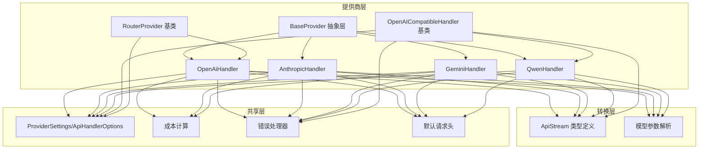

图表来源
- [src/api/providers/base-provider.ts:13-123](file://src/api/providers/base-provider.ts#L13-L123)
- [src/api/providers/openai.ts:31-535](file://src/api/providers/openai.ts#L31-L535)
- [src/api/providers/anthropic.ts:30-385](file://src/api/providers/anthropic.ts#L30-L385)
- [src/api/providers/gemini.ts:36-537](file://src/api/providers/gemini.ts#L36-L537)
- [src/api/providers/qwen.ts:10-63](file://src/api/providers/qwen.ts#L10-L63)
- [src/api/providers/openai-compatible.ts:50-212](file://src/api/providers/openai-compatible.ts#L50-L212)
- [src/api/providers/router-provider.ts:22-87](file://src/api/providers/router-provider.ts#L22-L87)
- [src/api/transform/stream.ts:1-115](file://src/api/transform/stream.ts#L1-L115)
- [src/api/transform/model-params.ts:75-190](file://src/api/transform/model-params.ts#L75-L190)
- [src/shared/api.ts:13-187](file://src/shared/api.ts#L13-L187)
- [src/shared/cost.ts:42-116](file://src/shared/cost.ts#L42-L116)
- [src/api/providers/constants.ts:3-7](file://src/api/providers/constants.ts#L3-L7)

章节来源
- [src/api/providers/index.ts:1-33](file://src/api/providers/index.ts#L1-L33)
- [src/api/providers/base-provider.ts:13-123](file://src/api/providers/base-provider.ts#L13-L123)

## 核心组件
- 抽象基类 BaseProvider：统一工具 Schema 转换、OpenAI 兼容模式、令牌计数等通用能力。
- 具体提供商：
  - OpenAiHandler：OpenAI 官方 API、Azure OpenAI、Azure AI Inference、DeepSeek R1、Groq/X.AI 等适配。
  - AnthropicHandler：Anthropic Claude API，支持提示缓存、思维块签名、推理参数。
  - GeminiHandler：Google Gemini API，支持思考/推理预算、思维签名、检索增强。
  - QwenHandler：基于 OpenAI 兼容基类的通义千问适配。
  - OpenAICompatibleHandler：Vercel AI SDK 的 OpenAI 兼容实现基类，Qwen 等通过继承复用。
  - RouterProvider：动态路由/网关基类，统一模型发现与缓存。
- 流式接口 ApiStream：统一文本、推理、工具调用、用量、检索溯源等事件类型。
- 参数与配置：ProviderSettings/ApiHandlerOptions、模型参数解析、最大输出令牌计算。
- 成本计算：按模型定价与缓存/推理令牌进行费用估算。
- 错误处理：统一错误包装、状态码保留、重试元数据传递。

章节来源
- [src/api/providers/base-provider.ts:13-123](file://src/api/providers/base-provider.ts#L13-L123)
- [src/api/providers/openai.ts:31-535](file://src/api/providers/openai.ts#L31-L535)
- [src/api/providers/anthropic.ts:30-385](file://src/api/providers/anthropic.ts#L30-L385)
- [src/api/providers/gemini.ts:36-537](file://src/api/providers/gemini.ts#L36-L537)
- [src/api/providers/qwen.ts:10-63](file://src/api/providers/qwen.ts#L10-L63)
- [src/api/providers/openai-compatible.ts:50-212](file://src/api/providers/openai-compatible.ts#L50-L212)
- [src/api/providers/router-provider.ts:22-87](file://src/api/providers/router-provider.ts#L22-L87)
- [src/api/transform/stream.ts:1-115](file://src/api/transform/stream.ts#L1-L115)
- [src/api/transform/model-params.ts:75-190](file://src/api/transform/model-params.ts#L75-L190)
- [src/shared/api.ts:13-187](file://src/shared/api.ts#L13-L187)
- [src/shared/cost.ts:42-116](file://src/shared/cost.ts#L42-L116)
- [src/api/providers/utils/error-handler.ts:38-116](file://src/api/providers/utils/error-handler.ts#L38-L116)

## 架构总览
AI 模型集成采用“抽象基类 + 多提供商实现 + 统一转换层”的分层设计。所有提供商均实现统一的 createMessage 接口，返回 ApiStream 异步生成器，内部完成消息格式转换、工具调用、推理参数注入、用量统计与成本计算，并通过错误处理器统一包装异常。

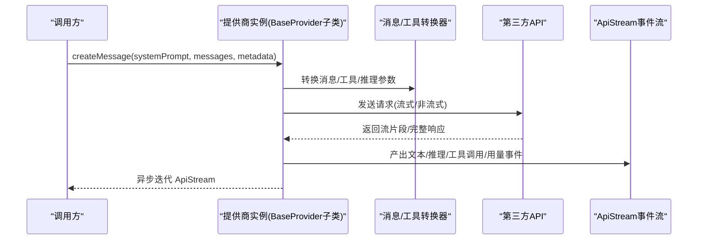

图表来源
- [src/api/providers/base-provider.ts:13-123](file://src/api/providers/base-provider.ts#L13-L123)
- [src/api/providers/openai.ts:82-270](file://src/api/providers/openai.ts#L82-L270)
- [src/api/providers/anthropic.ts:48-316](file://src/api/providers/anthropic.ts#L48-L316)
- [src/api/providers/gemini.ts:74-351](file://src/api/providers/gemini.ts#L74-L351)
- [src/api/transform/stream.ts:1-115](file://src/api/transform/stream.ts#L1-L115)

## 详细组件分析

### 抽象层：BaseProvider
- 工具 Schema 兼容：将 MCP 工具与严格模式要求对齐，确保 OpenAI 兼容链路可用。
- 令牌计数：默认使用 worker 计数，可被具体提供商覆盖。
- 统一接口：createMessage、getModel、countTokens。

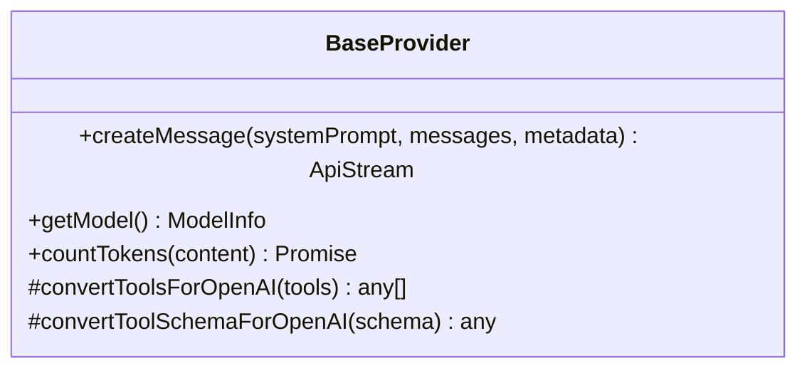

图表来源
- [src/api/providers/base-provider.ts:13-123](file://src/api/providers/base-provider.ts#L13-L123)

章节来源
- [src/api/providers/base-provider.ts:13-123](file://src/api/providers/base-provider.ts#L13-L123)

### OpenAI 兼容实现：OpenAiHandler
- 支持 OpenAI 官方、Azure OpenAI、Azure AI Inference、DeepSeek R1、Groq/X.AI 等。
- 自动识别 o1/o3/o4 家族模型，注入推理参数；支持 prompt cache 控制。
- 流式与非流式两种路径，统一产出 ApiStream 文本、推理、工具调用、用量事件。
- 最大输出令牌策略：优先用户配置，其次模型默认，兼容 max_tokens 与 max_completion_tokens。

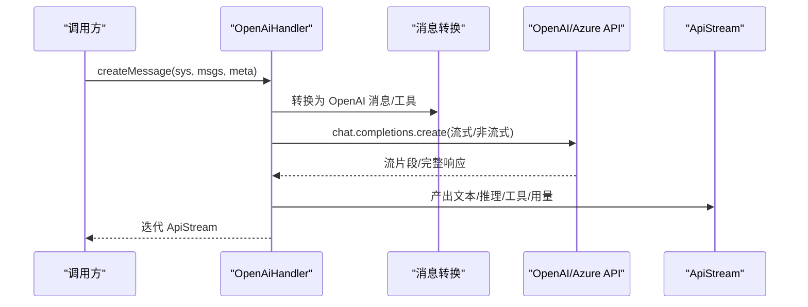

图表来源
- [src/api/providers/openai.ts:82-270](file://src/api/providers/openai.ts#L82-L270)
- [src/api/providers/openai.ts:295-327](file://src/api/providers/openai.ts#L295-L327)
- [src/api/providers/openai.ts:329-429](file://src/api/providers/openai.ts#L329-L429)
- [src/api/providers/openai.ts:431-457](file://src/api/providers/openai.ts#L431-L457)

章节来源
- [src/api/providers/openai.ts:31-535](file://src/api/providers/openai.ts#L31-L535)

### Anthropic 实现：AnthropicHandler
- 支持提示缓存（prompt caching）与思维块签名（thinking signature）。
- 针对特定模型启用 beta 标志，支持推理参数与工具调用。
- 流式事件包括 message_start/message_delta/content_block_* 等，统一映射到 ApiStream。

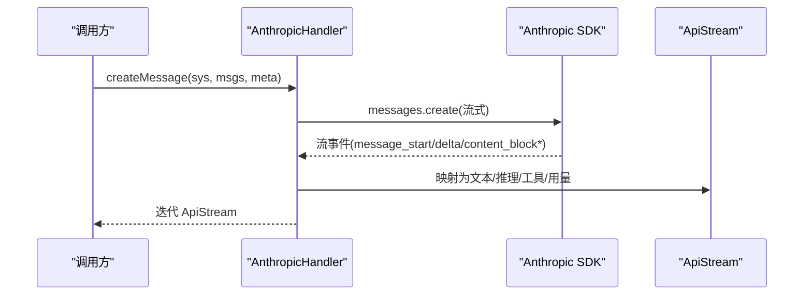

图表来源
- [src/api/providers/anthropic.ts:48-316](file://src/api/providers/anthropic.ts#L48-L316)

章节来源
- [src/api/providers/anthropic.ts:30-385](file://src/api/providers/anthropic.ts#L30-L385)

### Google Gemini 实现：GeminiHandler
- 支持 Hybrid 推理预算与 Effort 推理模式，自动选择 maxOutputTokens。
- 思维签名与工具调用签名回传，用于后续对话延续。
- 支持检索溯源（grounding），提取引用链接。

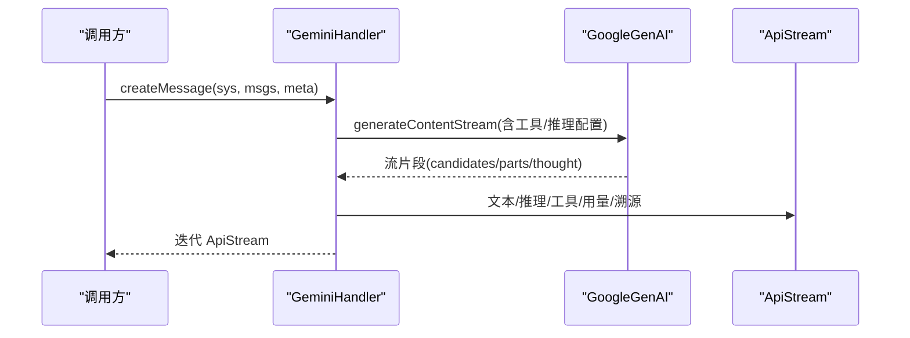

图表来源
- [src/api/providers/gemini.ts:74-351](file://src/api/providers/gemini.ts#L74-L351)

章节来源
- [src/api/providers/gemini.ts:36-537](file://src/api/providers/gemini.ts#L36-L537)

### 通义千问实现：QwenHandler
- 基于 OpenAI 兼容基类，统一消息与工具转换、用量指标处理。
- 通过 getModel 读取 qwenModels 并应用模型参数解析。

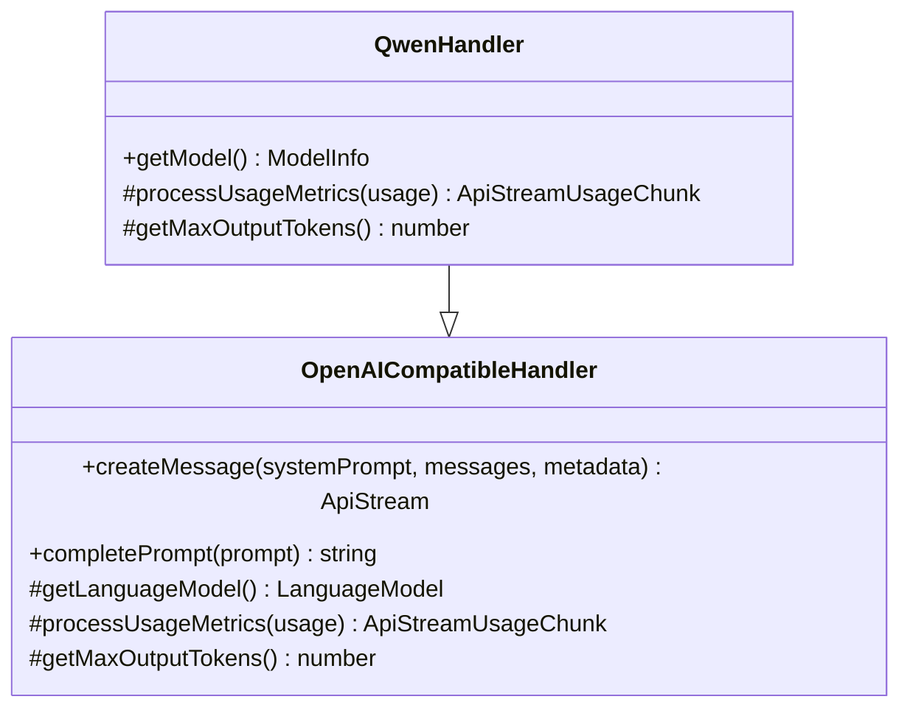

图表来源
- [src/api/providers/openai-compatible.ts:50-212](file://src/api/providers/openai-compatible.ts#L50-L212)
- [src/api/providers/qwen.ts:10-63](file://src/api/providers/qwen.ts#L10-L63)

章节来源
- [src/api/providers/qwen.ts:10-63](file://src/api/providers/qwen.ts#L10-L63)
- [src/api/providers/openai-compatible.ts:50-212](file://src/api/providers/openai-compatible.ts#L50-L212)

### 动态路由/网关：RouterProvider
- 统一从动态提供商拉取模型列表，支持本地缓存与实例缓存。
- 提供 supportsTemperature 等能力判断。

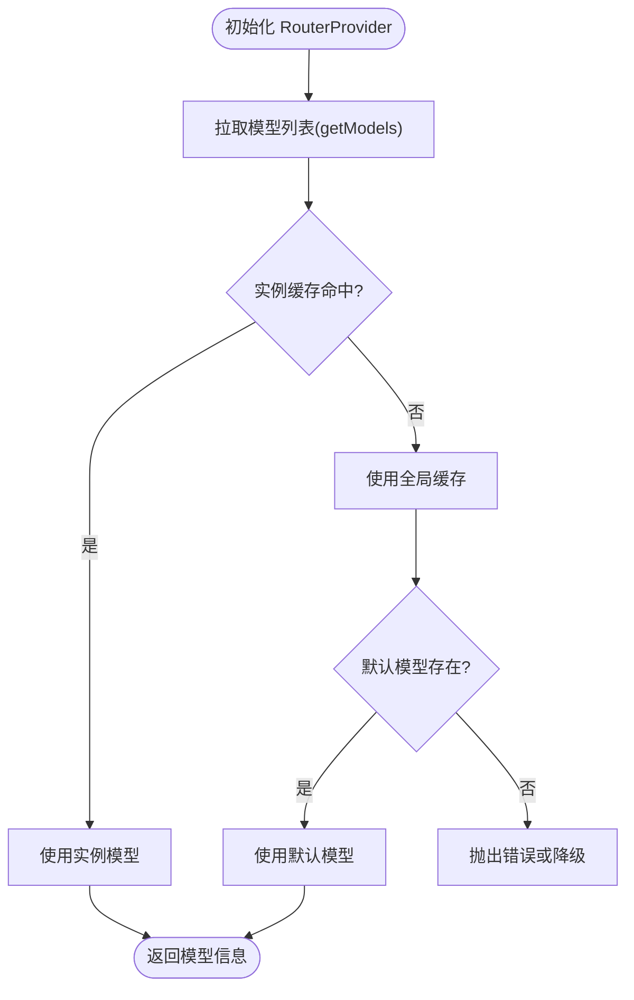

图表来源
- [src/api/providers/router-provider.ts:58-87](file://src/api/providers/router-provider.ts#L58-L87)

章节来源
- [src/api/providers/router-provider.ts:22-87](file://src/api/providers/router-provider.ts#L22-L87)

### 请求/响应转换与流式处理
- ApiStream 定义了统一的事件类型：文本、推理、工具调用、用量、检索溯源等。
- 各提供商在 createMessage 中将原生流事件映射为 ApiStream。

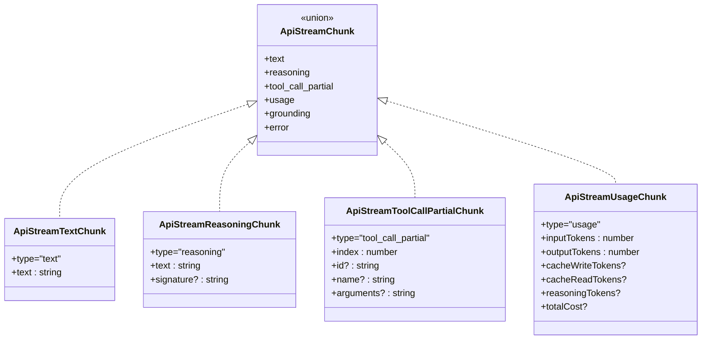

图表来源
- [src/api/transform/stream.ts:3-115](file://src/api/transform/stream.ts#L3-L115)

章节来源
- [src/api/transform/stream.ts:1-115](file://src/api/transform/stream.ts#L1-L115)

### 模型参数与推理策略
- getModelParams 统一解析温度、最大输出令牌、推理预算/努力级别、冗余度等。
- 针对不同格式（OpenAI/Anthropic/Gemini/OpenRouter）分别注入推理参数。

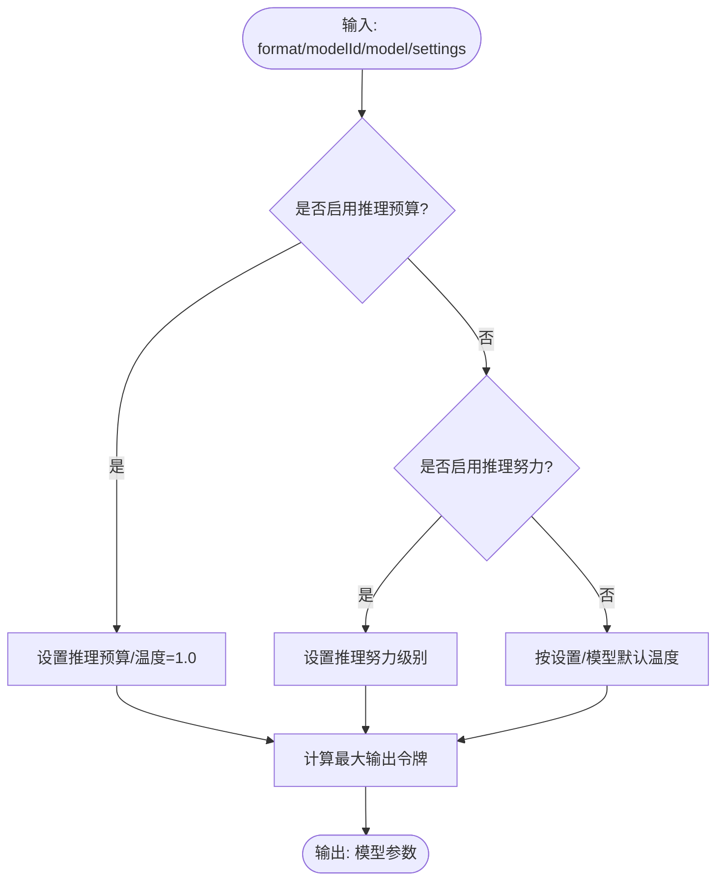

图表来源
- [src/api/transform/model-params.ts:75-190](file://src/api/transform/model-params.ts#L75-L190)
- [src/shared/api.ts:105-157](file://src/shared/api.ts#L105-L157)

章节来源
- [src/api/transform/model-params.ts:75-190](file://src/api/transform/model-params.ts#L75-L190)
- [src/shared/api.ts:44-157](file://src/shared/api.ts#L44-L157)

### 成本计算
- Anthropic：输入不包含缓存令牌，总输入=基础输入+缓存写入+缓存读取。
- OpenAI：输入已包含缓存令牌，需按未缓存输入计算。
- 支持长上下文定价与服务等级乘数。

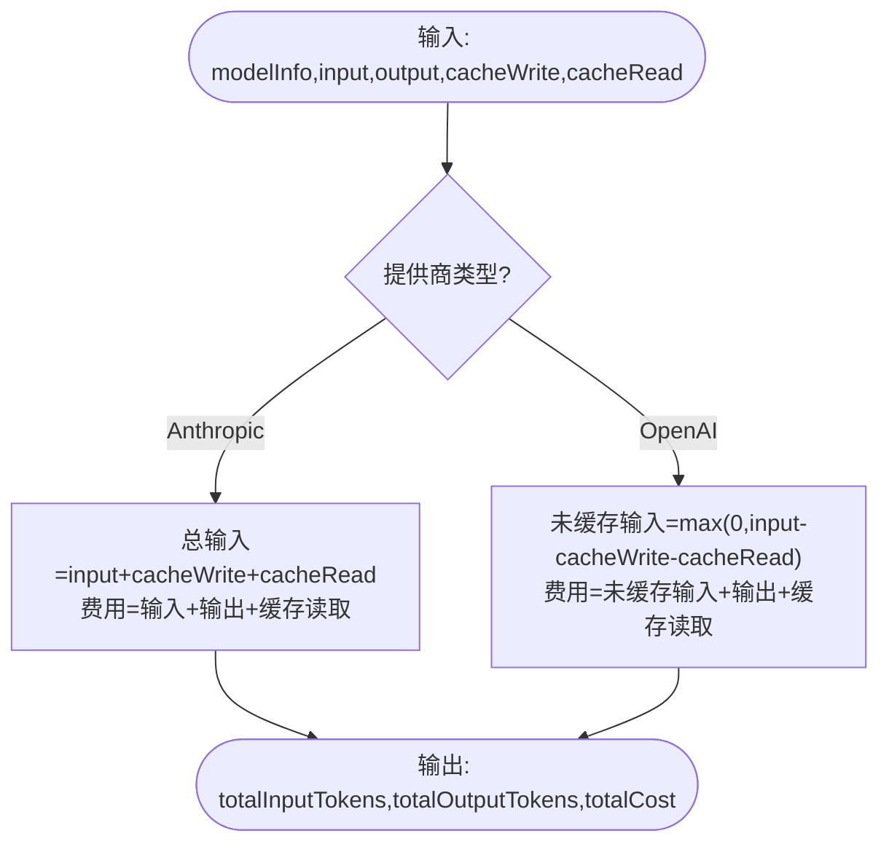

图表来源
- [src/shared/cost.ts:66-116](file://src/shared/cost.ts#L66-L116)

章节来源
- [src/shared/cost.ts:1-119](file://src/shared/cost.ts#L1-L119)

### 错误处理与重试
- handleProviderError 将技术错误包装为用户友好消息，保留状态码与重试元数据。
- OpenAI 兼容错误处理复用同一工具。

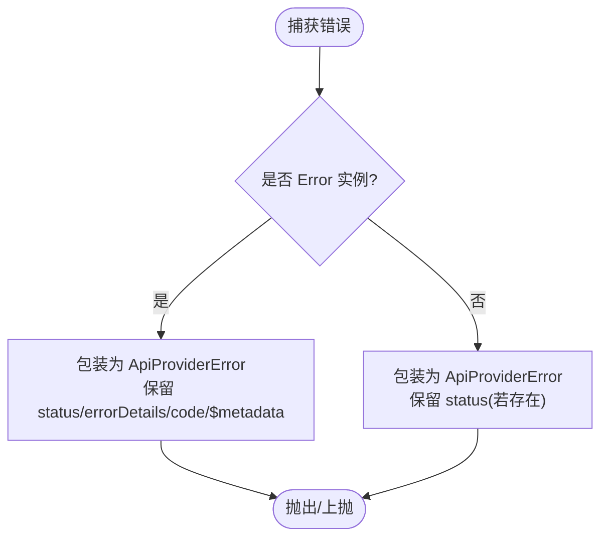

图表来源
- [src/api/providers/utils/error-handler.ts:38-116](file://src/api/providers/utils/error-handler.ts#L38-L116)

章节来源
- [src/api/providers/utils/error-handler.ts:1-116](file://src/api/providers/utils/error-handler.ts#L1-L116)

## 依赖分析
- 抽象与实现解耦：BaseProvider 与各提供商松耦合，便于扩展。
- 转换层独立：消息/工具/推理参数转换集中在 transform 层，降低提供商复杂度。
- 配置集中：ProviderSettings/ApiHandlerOptions 与模型参数解析统一入口。
- 成本与错误：成本计算与错误处理作为横切关注点被各提供商复用。

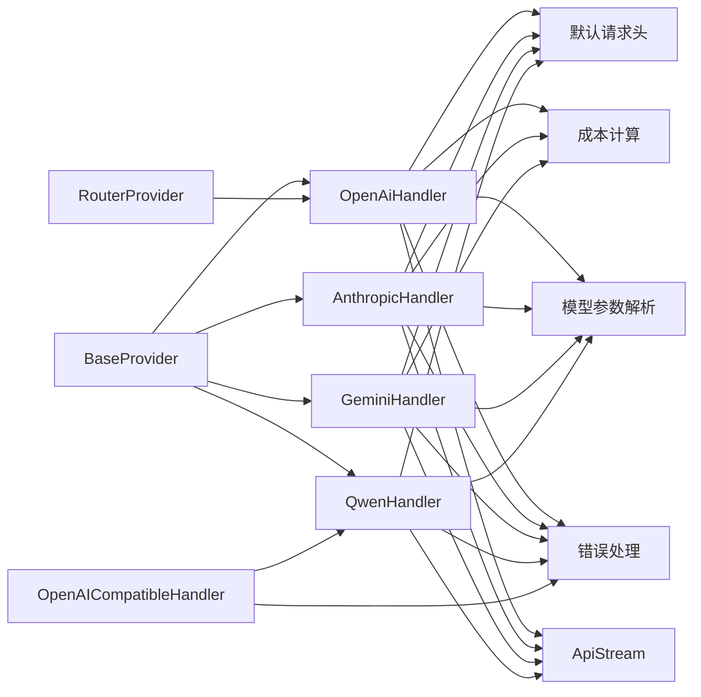

图表来源
- [src/api/providers/base-provider.ts:13-123](file://src/api/providers/base-provider.ts#L13-L123)
- [src/api/providers/openai.ts:31-535](file://src/api/providers/openai.ts#L31-L535)
- [src/api/providers/anthropic.ts:30-385](file://src/api/providers/anthropic.ts#L30-L385)
- [src/api/providers/gemini.ts:36-537](file://src/api/providers/gemini.ts#L36-L537)
- [src/api/providers/qwen.ts:10-63](file://src/api/providers/qwen.ts#L10-L63)
- [src/api/providers/openai-compatible.ts:50-212](file://src/api/providers/openai-compatible.ts#L50-L212)
- [src/api/providers/router-provider.ts:22-87](file://src/api/providers/router-provider.ts#L22-L87)
- [src/api/transform/stream.ts:1-115](file://src/api/transform/stream.ts#L1-L115)
- [src/api/transform/model-params.ts:75-190](file://src/api/transform/model-params.ts#L75-L190)
- [src/shared/cost.ts:42-116](file://src/shared/cost.ts#L42-L116)
- [src/api/providers/utils/error-handler.ts:38-116](file://src/api/providers/utils/error-handler.ts#L38-L116)
- [src/api/providers/constants.ts:3-7](file://src/api/providers/constants.ts#L3-L7)

章节来源
- [src/api/providers/index.ts:1-33](file://src/api/providers/index.ts#L1-L33)
- [src/api/providers/base-provider.ts:13-123](file://src/api/providers/base-provider.ts#L13-L123)
- [src/api/providers/openai.ts:31-535](file://src/api/providers/openai.ts#L31-L535)
- [src/api/providers/anthropic.ts:30-385](file://src/api/providers/anthropic.ts#L30-L385)
- [src/api/providers/gemini.ts:36-537](file://src/api/providers/gemini.ts#L36-L537)
- [src/api/providers/qwen.ts:10-63](file://src/api/providers/qwen.ts#L10-L63)
- [src/api/providers/openai-compatible.ts:50-212](file://src/api/providers/openai-compatible.ts#L50-L212)
- [src/api/providers/router-provider.ts:22-87](file://src/api/providers/router-provider.ts#L22-L87)
- [src/api/transform/stream.ts:1-115](file://src/api/transform/stream.ts#L1-L115)
- [src/api/transform/model-params.ts:75-190](file://src/api/transform/model-params.ts#L75-L190)
- [src/shared/api.ts:13-187](file://src/shared/api.ts#L13-L187)
- [src/shared/cost.ts:42-116](file://src/shared/cost.ts#L42-L116)
- [src/api/providers/utils/error-handler.ts:38-116](file://src/api/providers/utils/error-handler.ts#L38-L116)
- [src/api/providers/constants.ts:3-7](file://src/api/providers/constants.ts#L3-L7)

## 性能考虑
- 流式优先：默认启用流式，减少首字节延迟，提升交互体验。
- 令牌上限：按上下文窗口的 20% 或模型默认上限进行约束，避免超长输出。
- 缓存利用：Anthropic 提示缓存、Gemini 缓存读取，降低重复输入成本。
- 成本估算：实时统计用量并估算费用，便于预算控制。

## 故障排查指南
- 认证失败：检查 API Key 格式与权限范围，参考错误处理器中的特殊键值校验。
- 速率限制：错误中保留 status 与重试元数据，结合 UI 层退避策略处理。
- 模型不可用：确认模型 ID 是否在提供商处可用，必要时使用 RouterProvider 获取最新模型列表。
- 网络异常：统一由错误处理器包装，保留原始错误栈以便定位。
- 推理参数冲突：根据模型能力选择推理预算或推理努力，避免不支持的组合。

章节来源
- [src/api/providers/utils/error-handler.ts:38-116](file://src/api/providers/utils/error-handler.ts#L38-L116)
- [src/api/providers/router-provider.ts:58-87](file://src/api/providers/router-provider.ts#L58-L87)

## 结论
Njust-AI 的 AI 模型集成以 BaseProvider 为核心抽象，结合统一的转换层与流式事件模型，实现了多提供商、多格式的统一接入。通过模型参数解析、成本计算与错误处理的标准化，既保证了易用性，也为扩展新的提供商提供了清晰的路径。

## 附录

### 新增提供商扩展指南
- 继承 BaseProvider 或 OpenAICompatibleHandler：
  - 若遵循 OpenAI 协议风格，建议继承 OpenAICompatibleHandler，复用消息/工具转换与流式处理。
  - 若协议差异较大，继承 BaseProvider，自行实现 createMessage 与 getModel。
- 实现步骤：
  1) 在 providers 目录新增文件，导出类并实现 getModel 与 createMessage。
  2) 在 providers/index.ts 中导出新类。
  3) 如需模型列表，可参考 RouterProvider 的模型拉取与缓存逻辑。
  4) 如需成本计算，参考 shared/cost.ts 的实现方式。
  5) 如需错误处理，使用 handleProviderError 包装异常。
- 参考路径：
  - [src/api/providers/openai-compatible.ts:50-212](file://src/api/providers/openai-compatible.ts#L50-L212)
  - [src/api/providers/router-provider.ts:58-87](file://src/api/providers/router-provider.ts#L58-L87)
  - [src/api/providers/utils/error-handler.ts:38-116](file://src/api/providers/utils/error-handler.ts#L38-L116)
  - [src/api/providers/index.ts:1-33](file://src/api/providers/index.ts#L1-L33)

### 常见问题与解决方案
- API 限制：根据提供商文档调整请求头与查询参数，必要时切换到网关/路由模式。
- 网络错误：统一由错误处理器包装，保留状态码与元数据，便于 UI 与后端协同处理。
- 模型兼容性：通过 getModelParams 与 shouldUseReasoning* 判断模型能力，避免不支持的参数组合。
- 限流控制：结合错误中的重试元数据与 UI 退避策略，实现指数退避与抖动控制。

章节来源
- [src/shared/api.ts:44-157](file://src/shared/api.ts#L44-L157)
- [src/api/providers/utils/error-handler.ts:38-116](file://src/api/providers/utils/error-handler.ts#L38-L116)