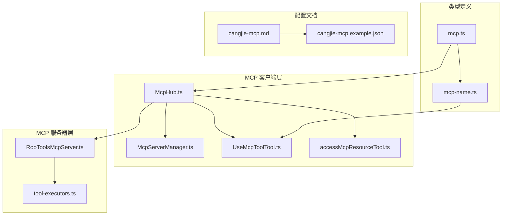
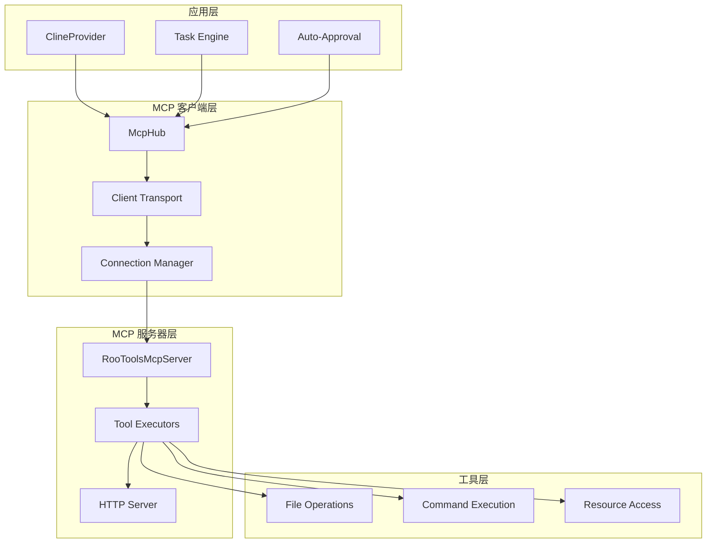
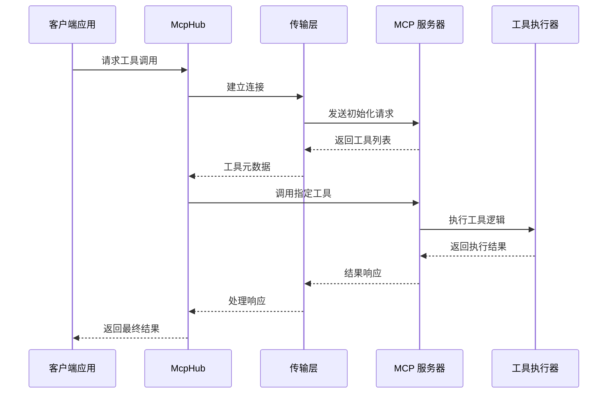
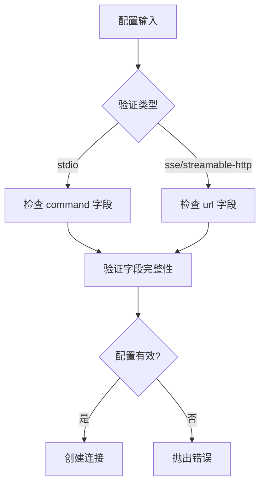
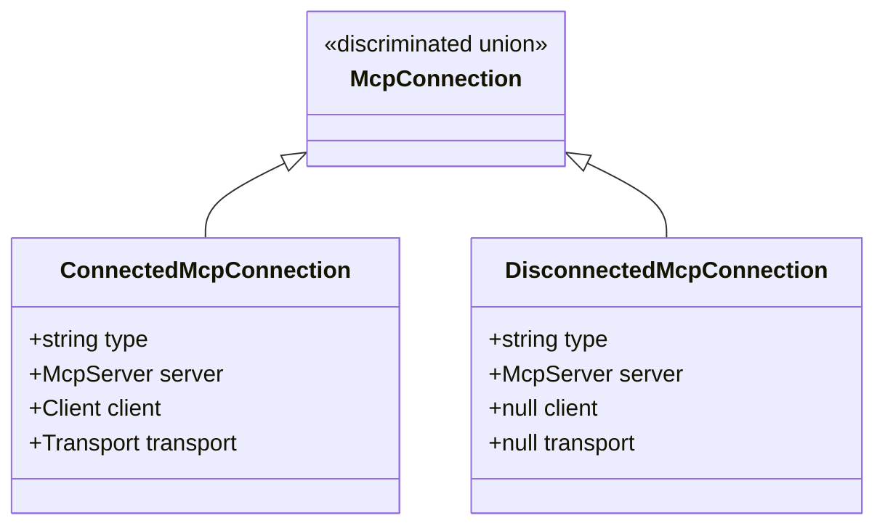
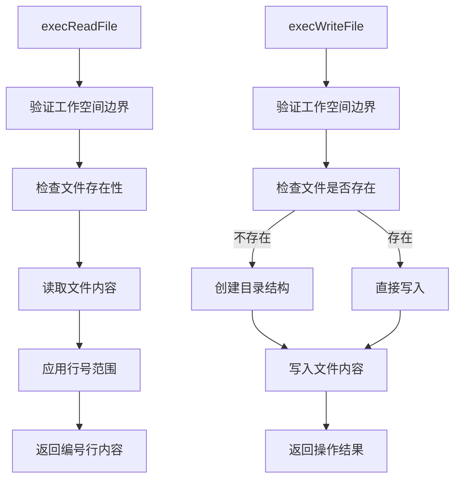
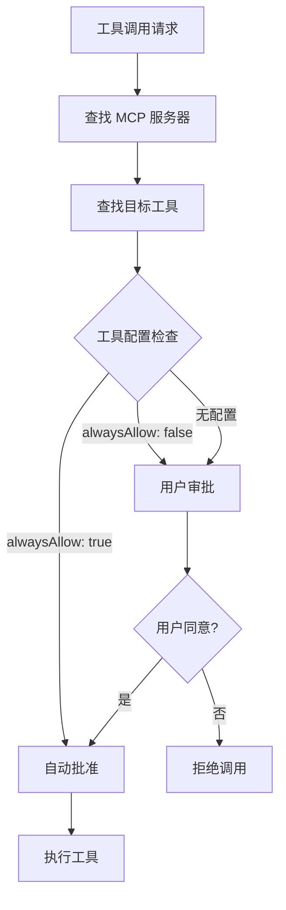
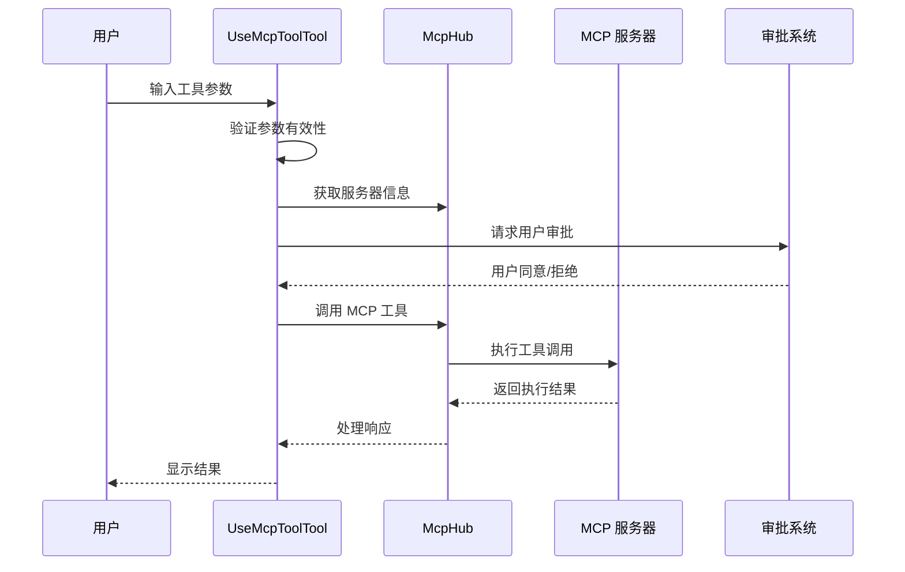

# MCP 协议支持

<cite>
**本文档引用的文件**
- [McpHub.ts](file://src/services/mcp/McpHub.ts)
- [McpServerManager.ts](file://src/services/mcp/McpServerManager.ts)
- [RooToolsMcpServer.ts](file://src/services/mcp-server/RooToolsMcpServer.ts)
- [tool-executors.ts](file://src/services/mcp-server/tool-executors.ts)
- [UseMcpToolTool.ts](file://src/core/tools/UseMcpToolTool.ts)
- [accessMcpResourceTool.ts](file://src/core/tools/accessMcpResourceTool.ts)
- [mcp.ts](file://src/core/auto-approval/mcp.ts)
- [mcp.ts](file://packages/types/src/mcp.ts)
- [mcp-name.ts](file://src/utils/mcp-name.ts)
- [cangjie-mcp.md](file://docs/cangjie-mcp.md)
- [cangjie-mcp.example.json](file://docs/examples/cangjie-mcp.example.json)
</cite>

## 目录
1. [简介](#简介)
2. [项目结构](#项目结构)
3. [核心组件](#核心组件)
4. [架构概览](#架构概览)
5. [详细组件分析](#详细组件分析)
6. [依赖关系分析](#依赖关系分析)
7. [性能考虑](#性能考虑)
8. [故障排除指南](#故障排除指南)
9. [结论](#结论)

## 简介

Njust-AI 的 MCP（Model Context Protocol）协议支持功能为开发者提供了强大的工具执行和资源访问能力。该功能实现了完整的 MCP 客户端和服务器架构，支持多种传输协议（stdio、SSE、streamable-http），并集成了安全认证、会话管理和自动审批机制。

MCP 协议支持包括两个主要方面：
- **MCP 客户端**：连接外部 MCP 服务器，调用远程工具和访问资源
- **MCP 服务器**：作为本地工具服务器，向其他 MCP 客户端提供工具和服务

该实现遵循 Model Context Protocol 标准，提供了类型安全的接口、完善的错误处理和灵活的配置选项。

## 项目结构

MCP 功能在项目中的组织结构如下：



**图表来源**
- [McpHub.ts:151-176](file://src/services/mcp/McpHub.ts#L151-L176)
- [RooToolsMcpServer.ts:27-34](file://src/services/mcp-server/RooToolsMcpServer.ts#L27-L34)
- [mcp.ts:54-68](file://packages/types/src/mcp.ts#L54-L68)

**章节来源**
- [McpHub.ts:151-176](file://src/services/mcp/McpHub.ts#L151-L176)
- [McpServerManager.ts:9-54](file://src/services/mcp/McpServerManager.ts#L9-L54)

## 核心组件

### MCP Hub 管理器

McpHub 是 MCP 功能的核心协调器，负责管理所有 MCP 服务器连接和状态。

**主要功能**：
- 服务器配置管理（全局和项目级）
- 连接生命周期管理
- 文件监控和自动重连
- 错误处理和状态跟踪

**关键特性**：
- 支持三种传输协议：stdio、SSE、streamable-http
- 自动配置验证和错误报告
- 文件系统监控和热重载
- 连接池管理和资源清理

### MCP 服务器管理器

McpServerManager 提供单例模式的 MCP 服务器实例管理，确保跨所有 webview 的一致性。

**核心职责**：
- 单例实例创建和初始化
- Provider 注册和通知
- 资源清理和销毁

### 内置 MCP 工具服务器

RooToolsMcpServer 提供本地工具访问能力，包含文件操作、命令执行等实用工具。

**内置工具**：
- 文件读取和写入
- 目录列表和文件搜索
- 命令执行和差异应用
- 安全的文件系统访问

**章节来源**
- [McpHub.ts:151-176](file://src/services/mcp/McpHub.ts#L151-L176)
- [McpServerManager.ts:9-54](file://src/services/mcp/McpServerManager.ts#L9-L54)
- [RooToolsMcpServer.ts:27-161](file://src/services/mcp-server/RooToolsMcpServer.ts#L27-L161)

## 架构概览

MCP 协议支持采用分层架构设计，确保模块间的松耦合和高内聚。



**图表来源**
- [McpHub.ts:151-176](file://src/services/mcp/McpHub.ts#L151-L176)
- [RooToolsMcpServer.ts:27-34](file://src/services/mcp-server/RooToolsMcpServer.ts#L27-L34)

### 数据流架构



**图表来源**
- [McpHub.ts:656-752](file://src/services/mcp/McpHub.ts#L656-L752)
- [RooToolsMcpServer.ts:284-302](file://src/services/mcp-server/RooToolsMcpServer.ts#L284-L302)

## 详细组件分析

### MCP Hub 实现

McpHub 提供了完整的 MCP 客户端功能，包括配置管理、连接处理和状态跟踪。

#### 配置验证系统



**图表来源**
- [McpHub.ts:216-274](file://src/services/mcp/McpHub.ts#L216-L274)

#### 连接状态管理

McpHub 使用区分联合类型来管理连接状态：



**图表来源**
- [McpHub.ts:44-59](file://src/services/mcp/McpHub.ts#L44-L59)

**章节来源**
- [McpHub.ts:67-144](file://src/services/mcp/McpHub.ts#L67-L144)
- [McpHub.ts:44-59](file://src/services/mcp/McpHub.ts#L44-L59)

### 工具执行器实现

工具执行器提供了安全的本地工具访问能力，通过严格的路径验证和权限控制确保系统安全。

#### 文件操作工具



**图表来源**
- [tool-executors.ts:28-50](file://src/services/mcp-server/tool-executors.ts#L28-L50)
- [tool-executors.ts:57-68](file://src/services/mcp-server/tool-executors.ts#L57-L68)

#### 命令执行安全机制

工具执行器实现了多层安全防护：

**路径安全验证**：
- 绝对路径解析和规范化
- 工作空间边界检查
- 路径逃逸攻击防护

**命令执行控制**：
- 白名单和黑名单机制
- 超时控制和资源限制
- 标准输出和错误流捕获

**章节来源**
- [tool-executors.ts:13-20](file://src/services/mcp-server/tool-executors.ts#L13-L20)
- [tool-executors.ts:116-180](file://src/services/mcp-server/tool-executors.ts#L116-L180)

### 自动审批机制

自动审批系统提供了智能的工具调用授权机制，支持基于配置的白名单和工具级别的权限控制。

#### 工具权限检查



**图表来源**
- [mcp.ts:3-11](file://src/core/auto-approval/mcp.ts#L3-L11)

**章节来源**
- [mcp.ts:3-11](file://src/core/auto-approval/mcp.ts#L3-L11)

### 客户端工具实现

UseMcpToolTool 和 AccessMcpResourceTool 提供了用户界面友好的工具调用体验。

#### 工具调用流程



**图表来源**
- [UseMcpToolTool.ts:30-82](file://src/core/tools/UseMcpToolTool.ts#L30-L82)
- [UseMcpToolTool.ts:294-351](file://src/core/tools/UseMcpToolTool.ts#L294-L351)

**章节来源**
- [UseMcpToolTool.ts:30-82](file://src/core/tools/UseMcpToolTool.ts#L30-L82)
- [accessMcpResourceTool.ts:18-85](file://src/core/tools/accessMcpResourceTool.ts#L18-L85)

## 依赖关系分析

MCP 功能的依赖关系体现了清晰的分层架构和模块化设计。

```mermaid
graph TB
subgraph "外部依赖"
A[@modelcontextprotocol/sdk]
B[zod]
C[chokidar]
D[reconnecting-eventsource]
end
subgraph "内部模块"
E[McpHub]
F[McpServerManager]
G[RooToolsMcpServer]
H[ToolExecutors]
I[Core Tools]
J[Auto-Approval]
K[Utilities]
end
subgraph "类型定义"
L[Mcp Types]
M[Tool Types]
N[Utility Types]
end
A --> E
B --> E
C --> E
D --> E
E --> F
F --> G
G --> H
E --> I
I --> J
E --> K
L --> E
M --> I
N --> K
```

**图表来源**
- [McpHub.ts:1-42](file://src/services/mcp/McpHub.ts#L1-L42)
- [RooToolsMcpServer.ts:1-7](file://src/services/mcp-server/RooToolsMcpServer.ts#L1-L7)

### 关键依赖特性

**类型安全**：
- 使用 Zod 进行运行时类型验证
- TypeScript 接口确保编译时类型安全
- 严格的配置模式定义

**异步处理**：
- Promise 和 async/await 模式
- 超时和取消机制
- 错误传播和恢复

**事件驱动**：
- 文件系统事件监听
- 连接状态变更通知
- 实时状态更新

**章节来源**
- [McpHub.ts:1-42](file://src/services/mcp/McpHub.ts#L1-L42)
- [RooToolsMcpServer.ts:1-7](file://src/services/mcp-server/RooToolsMcpServer.ts#L1-L7)

## 性能考虑

MCP 功能在设计时充分考虑了性能优化和资源管理。

### 连接池管理

- 最大连接数限制
- 连接复用和回收
- 空闲连接清理
- 超时配置优化

### 内存管理

- 弱引用避免循环引用
- 及时的资源释放
- 大文件处理优化
- 缓存策略配置

### 并发控制

- 请求队列管理
- 并发限制设置
- 优先级调度
- 资源竞争避免

## 故障排除指南

### 常见连接问题

**连接超时**
- 检查服务器启动状态
- 验证网络连接
- 调整超时配置
- 查看服务器日志

**认证失败**
- 验证认证令牌
- 检查 CORS 配置
- 确认传输协议支持
- 验证服务器地址

**配置错误**
- 使用配置验证工具
- 检查 JSON 格式
- 验证必需字段
- 参考示例配置

### 工具执行问题

**权限不足**
- 检查文件系统权限
- 验证命令执行权限
- 确认工作空间边界
- 查看安全策略

**超时错误**
- 调整超时设置
- 优化工具实现
- 检查资源可用性
- 实施分页处理

### 调试技巧

**启用详细日志**
- 设置日志级别
- 监控连接状态
- 跟踪请求响应
- 分析性能指标

**配置验证**
- 使用在线 JSON 验证器
- 检查字段类型
- 验证枚举值
- 测试边界条件

**章节来源**
- [cangjie-mcp.md:98-119](file://docs/cangjie-mcp.md#L98-L119)
- [cangjie-mcp.example.json:1-20](file://docs/examples/cangjie-mcp.example.json#L1-L20)

## 结论

Njust-AI 的 MCP 协议支持功能提供了企业级的工具执行和资源访问能力。通过模块化的架构设计、严格的安全控制和完善的错误处理机制，该实现能够满足各种复杂的开发需求。

### 主要优势

**灵活性**：支持多种传输协议和配置选项
**安全性**：多层次的安全防护和权限控制
**可扩展性**：模块化设计便于功能扩展
**可靠性**：完善的错误处理和恢复机制

### 未来发展方向

- 增强性能监控和优化
- 扩展更多传输协议支持
- 改进自动化审批机制
- 加强与其他系统的集成

该 MCP 功能为 Njust-AI 生态系统提供了强大的工具执行基础，为开发者提供了高效、安全的工具访问能力。