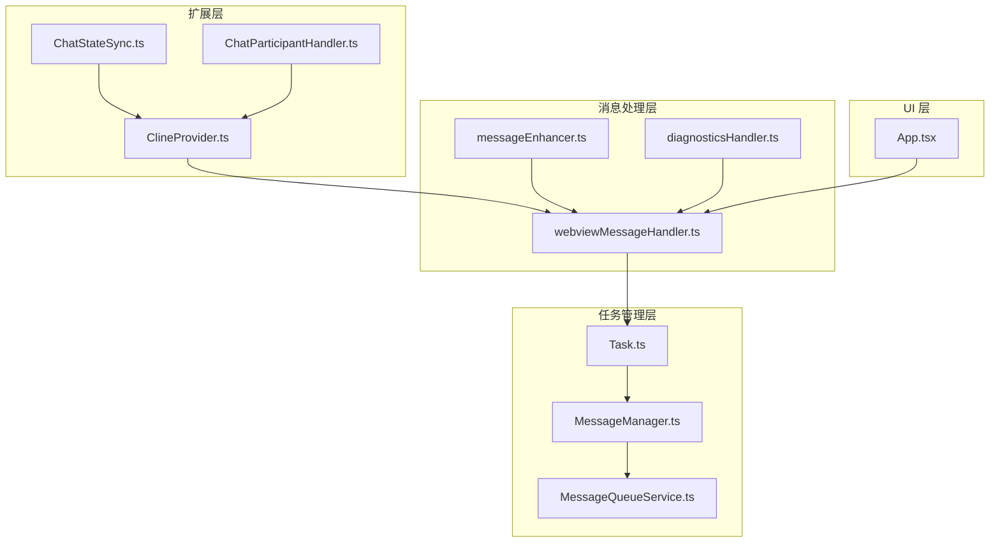
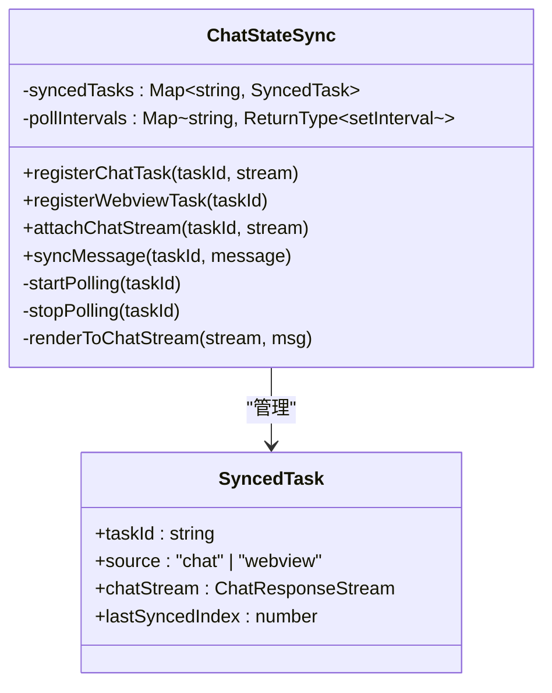
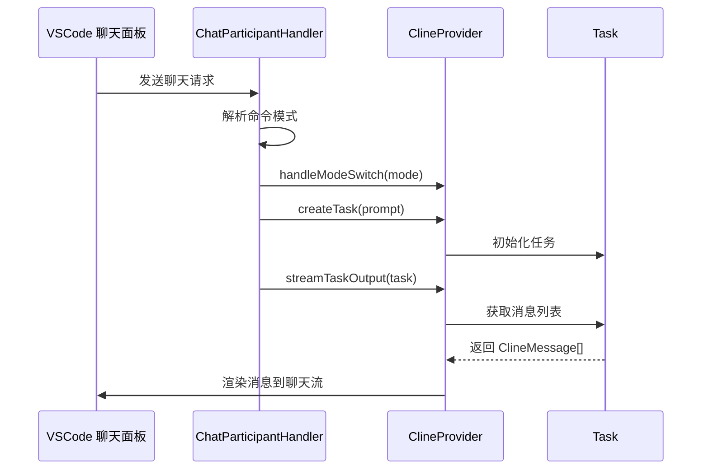
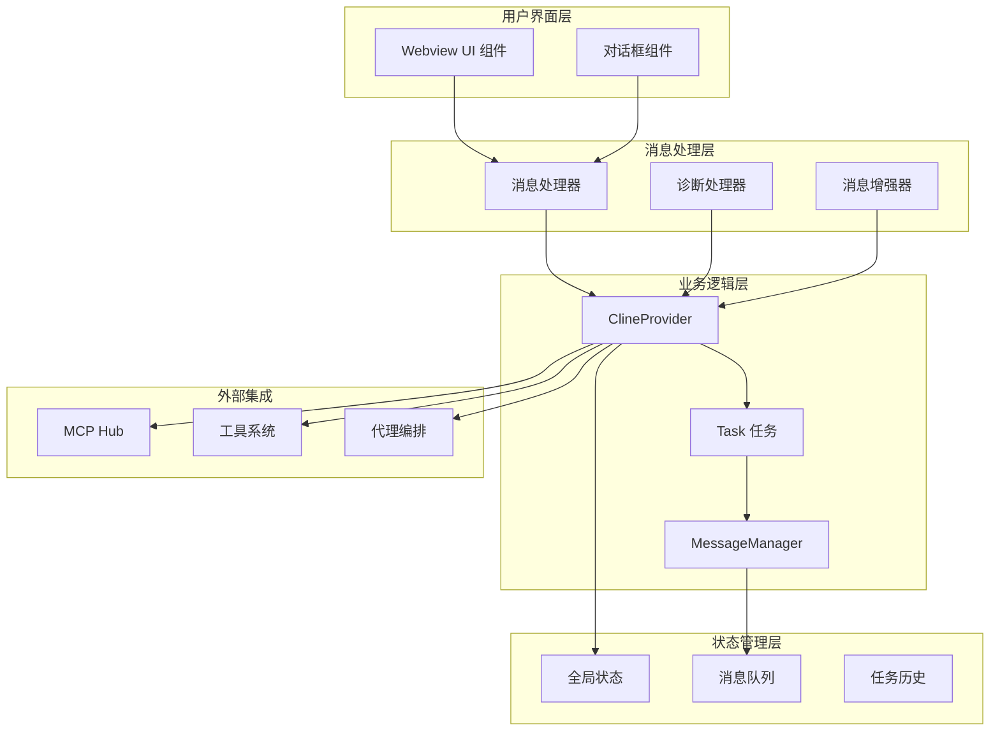
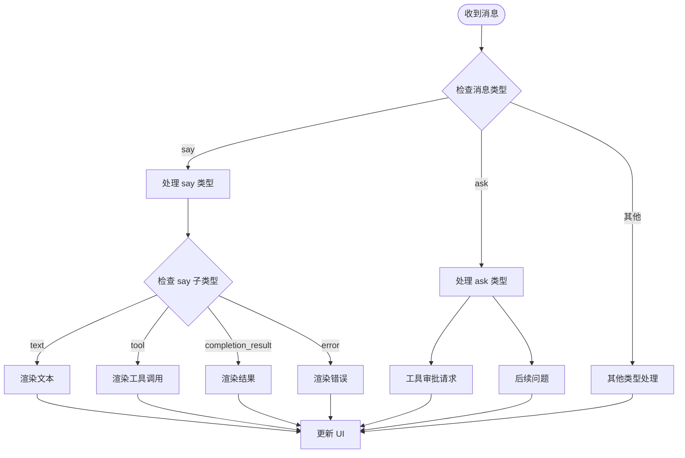
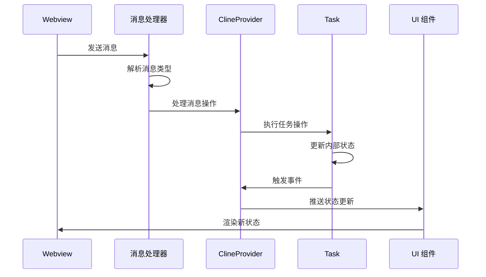
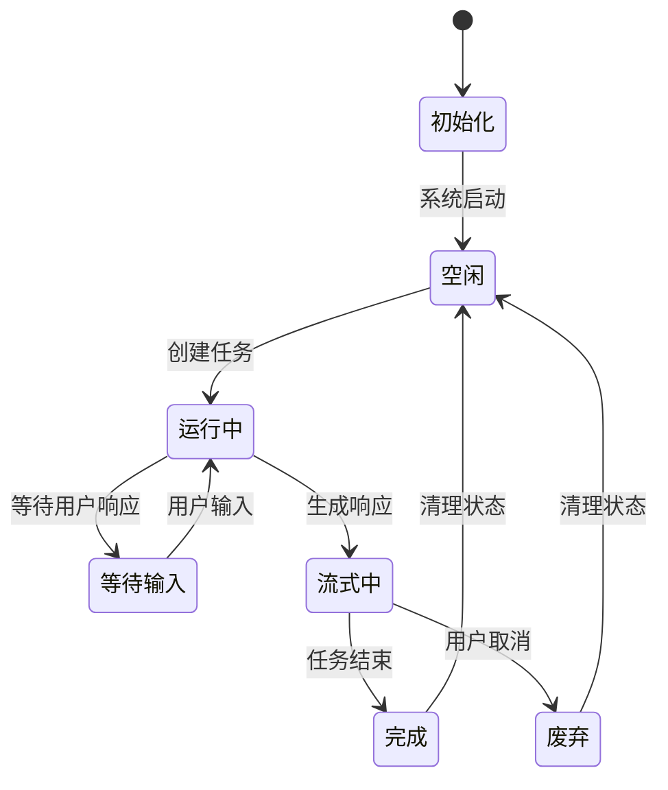
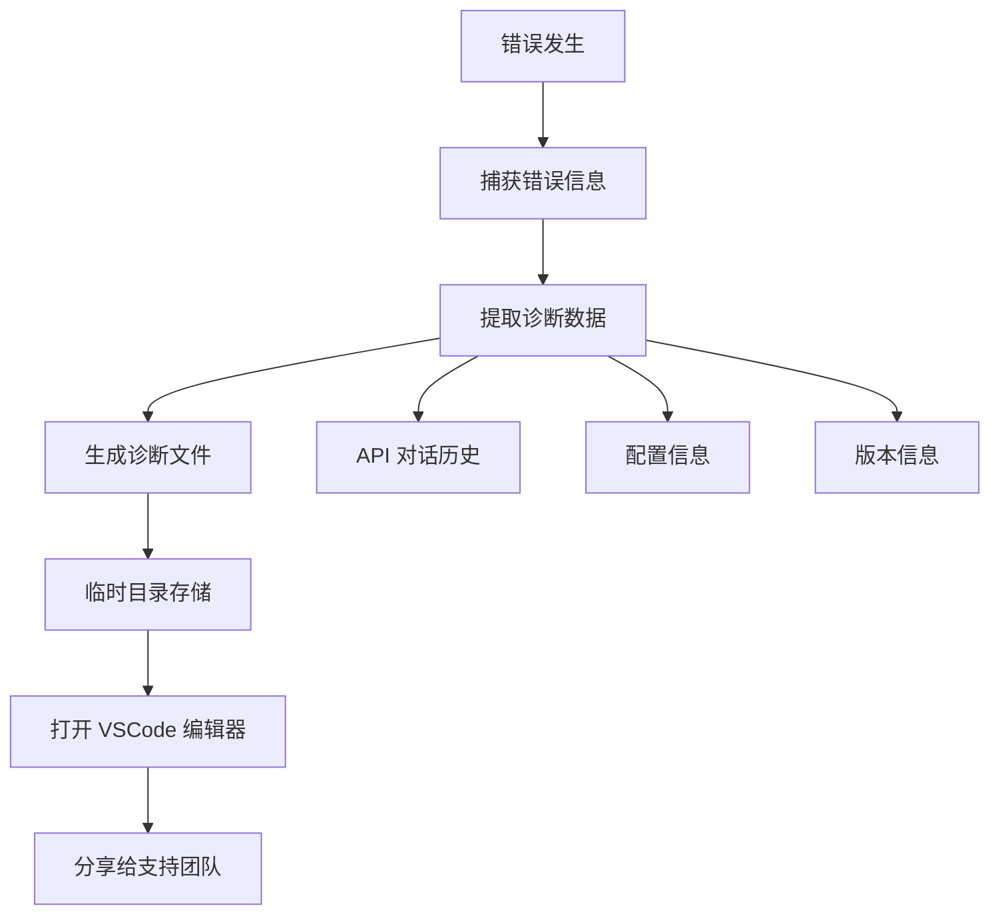
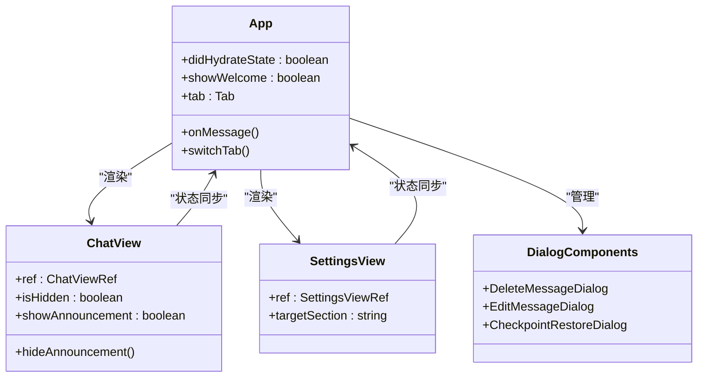
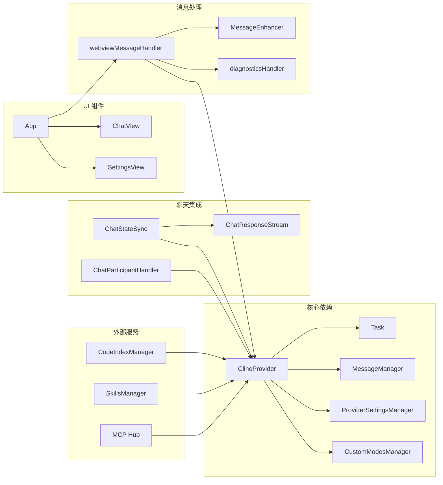

# Webview 聊天系统

<cite>
**本文档引用的文件**
- [ChatStateSync.ts](file://src/chat/ChatStateSync.ts)
- [ChatParticipantHandler.ts](file://src/chat/ChatParticipantHandler.ts)
- [ClineProvider.ts](file://src/core/webview/ClineProvider.ts)
- [webviewMessageHandler.ts](file://src/core/webview/webviewMessageHandler.ts)
- [diagnosticsHandler.ts](file://src/core/webview/diagnosticsHandler.ts)
- [App.tsx](file://webview-ui/src/App.tsx)
- [messageEnhancer.ts](file://src/core/webview/messageEnhancer.ts)
- [Task.ts](file://src/core/task/Task.ts)
- [MessageManager.ts](file://src/core/message-manager/index.ts)
- [MessageQueueService.ts](file://src/core/message-queue/MessageQueueService.ts)
</cite>

## 目录
1. [简介](#简介)
2. [项目结构](#项目结构)
3. [核心组件](#核心组件)
4. [架构概览](#架构概览)
5. [详细组件分析](#详细组件分析)
6. [依赖关系分析](#依赖关系分析)
7. [性能考虑](#性能考虑)
8. [故障排除指南](#故障排除指南)
9. [结论](#结论)

## 简介

Njust-AI 的 Webview 聊天系统是一个基于 VSCode 扩展框架构建的智能聊天界面，集成了任务管理、代理编排和工具系统。该系统提供了完整的聊天功能，包括消息处理、状态同步、诊断系统和 UI 组件管理。

系统的核心特点：
- **多界面同步**：支持 VSCode 聊天面板和 Webview 侧边栏之间的任务状态同步
- **智能消息处理**：支持文本、图像、工具调用等多种消息格式
- **状态管理**：提供完整的任务生命周期管理和状态持久化
- **诊断系统**：内置错误诊断和问题排查功能
- **性能优化**：采用轮询机制和事件驱动模式确保响应性

## 项目结构

Webview 聊天系统主要分布在以下目录结构中：



**图表来源**
- [ClineProvider.ts:126-312](file://src/core/webview/ClineProvider.ts#L126-L312)
- [ChatStateSync.ts:17-40](file://src/chat/ChatStateSync.ts#L17-L40)
- [webviewMessageHandler.ts:81-155](file://src/core/webview/webviewMessageHandler.ts#L81-L155)

**章节来源**
- [ClineProvider.ts:1-200](file://src/core/webview/ClineProvider.ts#L1-L200)
- [ChatStateSync.ts:1-50](file://src/chat/ChatStateSync.ts#L1-L50)

## 核心组件

### 聊天状态同步器 (ChatStateSync)

ChatStateSync 是系统的核心组件，负责在 VSCode 聊天面板和 Webview 侧边栏之间同步任务状态。



**图表来源**
- [ChatStateSync.ts:5-24](file://src/chat/ChatStateSync.ts#L5-L24)

### 聊天参与者处理器 (ChatParticipantHandler)

处理 VSCode 原生聊天参与者的请求，桥接现有 ClineProvider/Task 系统。



**图表来源**
- [ChatParticipantHandler.ts:54-94](file://src/chat/ChatParticipantHandler.ts#L54-L94)
- [ChatParticipantHandler.ts:96-167](file://src/chat/ChatParticipantHandler.ts#L96-L167)

### 主要配置参数

系统支持多种配置参数来定制聊天行为：

| 参数名称 | 类型 | 默认值 | 描述 |
|---------|------|--------|------|
| `mode` | string | "code" | 当前工作模式 |
| `currentApiConfigName` | string | "default" | 当前 API 配置名称 |
| `maxImageFileSize` | number | 5MB | 图像文件大小限制 |
| `maxTotalImageSize` | number | 10MB | 总图像大小限制 |
| `terminalShellIntegrationTimeout` | number | 5000ms | 终端集成超时时间 |
| `ttsEnabled` | boolean | false | 文本转语音启用状态 |

**章节来源**
- [ClineProvider.ts:162-166](file://src/core/webview/ClineProvider.ts#L162-L166)
- [webviewMessageHandler.ts:633-732](file://src/core/webview/webviewMessageHandler.ts#L633-L732)

## 架构概览

Webview 聊天系统采用分层架构设计，确保各组件职责清晰分离：



**图表来源**
- [ClineProvider.ts:172-225](file://src/core/webview/ClineProvider.ts#L172-L225)
- [webviewMessageHandler.ts:80-81](file://src/core/webview/webviewMessageHandler.ts#L80-L81)

## 详细组件分析

### 聊天界面渲染机制

系统采用事件驱动的消息渲染机制，支持多种消息类型的动态渲染：



**图表来源**
- [ChatParticipantHandler.ts:169-225](file://src/chat/ChatParticipantHandler.ts#L169-L225)
- [ChatStateSync.ts:121-145](file://src/chat/ChatStateSync.ts#L121-L145)

### 消息处理流程

消息处理采用异步事件驱动模式，确保系统的响应性和可靠性：



**图表来源**
- [webviewMessageHandler.ts:522-595](file://src/core/webview/webviewMessageHandler.ts#L522-L595)
- [ClineProvider.ts:374-389](file://src/core/webview/ClineProvider.ts#L374-L389)

### 状态管理系统

系统实现了完整的状态管理机制，包括任务状态、全局状态和 UI 状态的协调：



**图表来源**
- [Task.ts:5239-5281](file://src/core/task/Task.ts#L5239-L5281)
- [MessageManager.ts:48-61](file://src/core/message-manager/index.ts#L48-L61)

### 诊断系统

内置的诊断系统提供完整的错误排查能力：



**图表来源**
- [diagnosticsHandler.ts:35-92](file://src/core/webview/diagnosticsHandler.ts#L35-L92)

**章节来源**
- [diagnosticsHandler.ts:1-93](file://src/core/webview/diagnosticsHandler.ts#L1-L93)

### UI 组件架构

Webview UI 采用 React 架构，提供响应式的用户界面：



**图表来源**
- [App.tsx:49-268](file://webview-ui/src/App.tsx#L49-L268)

**章节来源**
- [App.tsx:1-331](file://webview-ui/src/App.tsx#L1-L331)

## 依赖关系分析

系统各组件之间的依赖关系如下：



**图表来源**
- [ClineProvider.ts:172-225](file://src/core/webview/ClineProvider.ts#L172-L225)
- [webviewMessageHandler.ts:30-40](file://src/core/webview/webviewMessageHandler.ts#L30-L40)

**章节来源**
- [ClineProvider.ts:98-105](file://src/core/webview/ClineProvider.ts#L98-L105)
- [ChatStateSync.ts:1-24](file://src/chat/ChatStateSync.ts#L1-L24)

## 性能考虑

系统在多个层面进行了性能优化：

### 轮询机制优化
- **300ms 轮询间隔**：平衡实时性和性能开销
- **智能停止条件**：任务完成或流被销毁时自动停止轮询
- **内存管理**：及时清理轮询定时器避免内存泄漏

### 状态同步优化
- **增量同步**：只同步新增的消息，避免全量传输
- **序列号机制**：防止过期状态覆盖当前状态
- **防抖处理**：批量状态更新减少 UI 重绘次数

### 内存管理
- **任务栈管理**：LIFO 结构确保及时释放已完成任务
- **事件监听器清理**：任务完成后自动移除所有监听器
- **资源清理**：统一的 dispose 方法确保资源完全释放

## 故障排除指南

### 常见问题及解决方案

#### 消息延迟问题
**症状**：消息发送后延迟显示
**原因分析**：
- 轮询间隔设置不当
- 网络连接不稳定
- 任务处理阻塞

**解决方案**：
1. 检查网络连接稳定性
2. 调整轮询间隔参数
3. 查看任务执行日志
4. 重启 VSCode 扩展

#### 状态不同步问题
**症状**：VSCode 聊天面板和 Webview 显示不一致
**原因分析**：
- 同步任务未正确注册
- 聊天流已销毁
- 序列号冲突

**解决方案**：
1. 确认任务已正确注册到 ChatStateSync
2. 检查聊天流状态
3. 验证序列号递增
4. 重新初始化同步状态

#### UI 响应性问题
**症状**：界面卡顿或无响应
**原因分析**：
- 大量状态更新导致 UI 重绘
- 事件监听器过多
- 内存泄漏

**解决方案**：
1. 实施状态更新防抖
2. 清理不必要的事件监听器
3. 监控内存使用情况
4. 优化 React 组件渲染

### 调试技巧

#### 日志分析
系统提供了详细的日志输出，可通过 VSCode 输出面板查看：

```typescript
// 查看聊天状态同步日志
outputChannel.appendLine(`[ChatStateSync] 注册任务: ${taskId}`)

// 查看任务状态变化
provider.log(`任务状态变更: ${oldState} -> ${newState}`)

// 查看消息处理过程
console.log(`处理消息类型: ${message.type}`)
```

#### 性能监控
使用浏览器开发工具监控 Webview 性能：
- **Network 面板**：查看消息传输延迟
- **Performance 面板**：分析 UI 渲染性能
- **Memory 面板**：监控内存使用情况

**章节来源**
- [ChatStateSync.ts:38-39](file://src/chat/ChatStateSync.ts#L38-L39)
- [ClineProvider.ts:570-620](file://src/core/webview/ClineProvider.ts#L570-L620)

## 结论

Njust-AI 的 Webview 聊天系统是一个功能完整、架构清晰的智能聊天平台。通过精心设计的状态同步机制、灵活的消息处理系统和完善的诊断功能，系统能够为用户提供流畅的聊天体验。

### 主要优势
- **多界面同步**：VSCode 聊天面板和 Webview 侧边栏无缝同步
- **丰富的消息类型**：支持文本、图像、工具调用等多种内容格式
- **强大的状态管理**：完整的任务生命周期管理和状态持久化
- **完善的诊断系统**：内置错误排查和问题定位功能
- **优秀的性能表现**：优化的轮询机制和内存管理

### 技术特色
- **事件驱动架构**：基于事件的异步消息处理模式
- **模块化设计**：清晰的组件分离和职责划分
- **可扩展性**：支持自定义模式和工具集成
- **用户体验**：直观的 UI 设计和流畅的交互体验

该系统为 Njust-AI 平台提供了强大的聊天能力，是整个 AI 辅助开发生态系统的重要组成部分。通过持续的优化和改进，系统将继续为开发者提供更好的聊天体验。