# 代理编排系统

<cite>
**本文档引用的文件**
- [AgentOrchestrator.ts](file://src/core/agent/AgentOrchestrator.ts)
- [PlanEngine.ts](file://src/core/agent/PlanEngine.ts)
- [types.ts](file://src/core/agent/types.ts)
- [index.ts](file://src/core/agent/index.ts)
- [ClineProvider.ts](file://src/core/webview/ClineProvider.ts)
- [Task.ts](file://src/core/task/Task.ts)
- [webviewMessageHandler.ts](file://src/core/webview/webviewMessageHandler.ts)
- [handleTask.ts](file://src/activate/handleTask.ts)
- [AGENTS.md](file://AGENTS.md)
</cite>

## 目录
1. [简介](#简介)
2. [项目结构](#项目结构)
3. [核心组件](#核心组件)
4. [架构概览](#架构概览)
5. [详细组件分析](#详细组件分析)
6. [依赖关系分析](#依赖关系分析)
7. [性能考虑](#性能考虑)
8. [故障排除指南](#故障排除指南)
9. [结论](#结论)

## 简介

Njust-AI 的代理编排系统是一个强大的多代理协作框架，它扩展了传统的单任务 ClineProvider 模型，通过维护独立的后台任务池来实现多个代理实例的并发运行，同时共享上下文信息。该系统支持并行任务执行、计划引擎、代理状态管理等功能，为复杂的 AI 代理协作提供了完整的基础设施。

系统的核心价值在于：
- **并行执行能力**：允许多个代理同时工作，提高整体效率
- **智能上下文共享**：在代理间共享修改的文件和结果
- **依赖关系管理**：支持有向无环图(DAG)的任务依赖关系
- **状态监控**：实时跟踪代理的启动、完成和失败状态
- **错误处理**：完善的异常捕获和恢复机制

## 项目结构

代理编排系统位于 `src/core/agent/` 目录下，采用模块化设计：

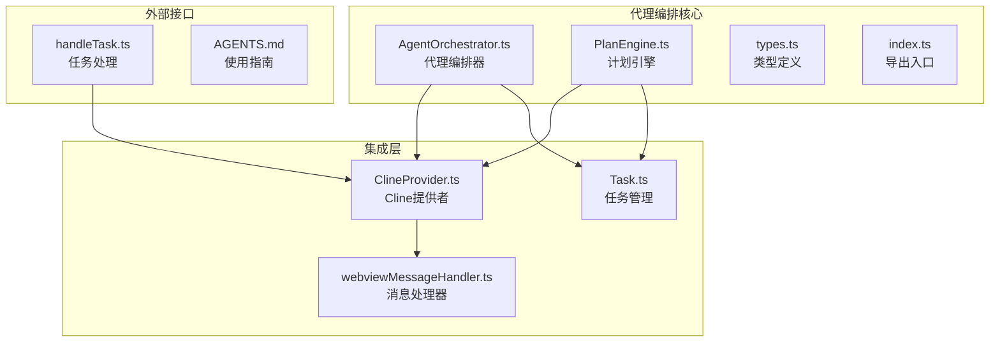

**图表来源**
- [AgentOrchestrator.ts:1-288](file://src/core/agent/AgentOrchestrator.ts#L1-L288)
- [PlanEngine.ts:1-429](file://src/core/agent/PlanEngine.ts#L1-L429)
- [ClineProvider.ts:126-312](file://src/core/webview/ClineProvider.ts#L126-L312)

**章节来源**
- [AgentOrchestrator.ts:1-288](file://src/core/agent/AgentOrchestrator.ts#L1-L288)
- [PlanEngine.ts:1-429](file://src/core/agent/PlanEngine.ts#L1-L429)
- [types.ts:1-68](file://src/core/agent/types.ts#L1-L68)

## 核心组件

### AgentOrchestrator - 代理编排器

AgentOrchestrator 是整个系统的核心，负责管理多个代理实例的并发执行。它继承自 EventEmitter，提供了完整的事件驱动架构。

**主要特性**：
- **并行任务管理**：支持独立和依赖任务的混合执行
- **上下文共享**：维护共享上下文，包括修改的文件和代理结果
- **状态跟踪**：实时监控代理的生命周期状态
- **错误处理**：提供完善的异常捕获和恢复机制

**关键数据结构**：
- `agents: Map<string, AgentInfo>`：存储所有活动代理的信息
- `sharedContext: SharedContext`：跨代理共享的数据
- `activeTasks: Map<string, Task>`：当前活跃任务的映射

### PlanEngine - 计划引擎

PlanEngine 实现了计划-执行(Plan-and-Execute)范式，利用 LLM 生成结构化的执行计划，并通过现有的 Task/ClineProvider 基础设施逐步执行。

**核心功能**：
- **计划生成**：基于用户任务描述生成 JSON 结构化计划
- **依赖解析**：自动识别和管理步骤间的依赖关系
- **并行执行**：支持最大并行度配置的步骤执行
- **状态管理**：跟踪计划和步骤的完整生命周期

**执行模型**：
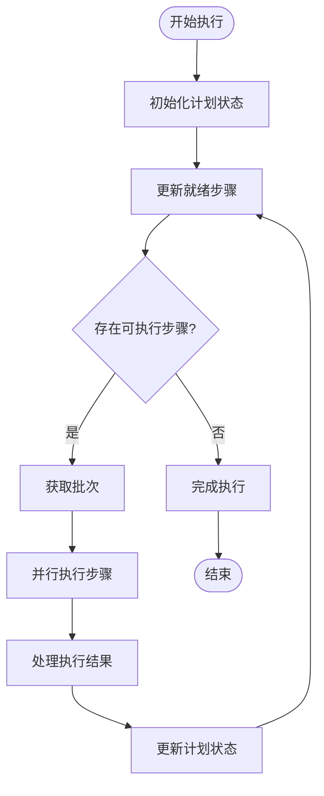

**图表来源**
- [PlanEngine.ts:113-148](file://src/core/agent/PlanEngine.ts#L113-L148)

**章节来源**
- [AgentOrchestrator.ts:39-288](file://src/core/agent/AgentOrchestrator.ts#L39-L288)
- [PlanEngine.ts:44-429](file://src/core/agent/PlanEngine.ts#L44-L429)

## 架构概览

代理编排系统采用分层架构设计，确保各组件职责清晰、耦合度低：

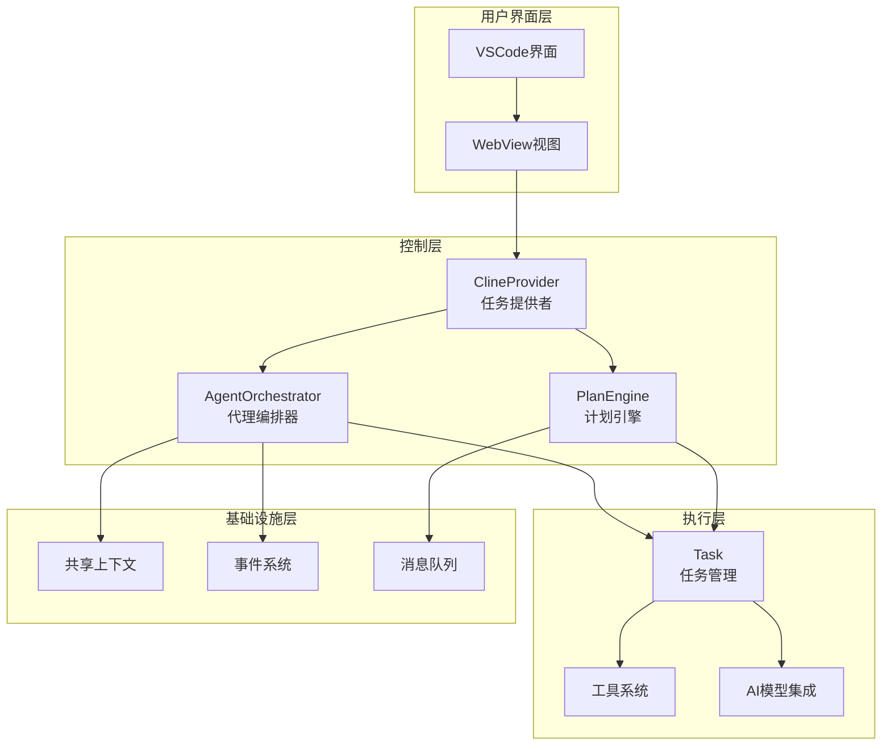

**图表来源**
- [ClineProvider.ts:168-225](file://src/core/webview/ClineProvider.ts#L168-L225)
- [AgentOrchestrator.ts:39-55](file://src/core/agent/AgentOrchestrator.ts#L39-L55)

系统的关键设计原则：
- **事件驱动**：通过 EventEmitter 实现松耦合的组件通信
- **异步处理**：充分利用 Promise 和 async/await 处理并发操作
- **状态隔离**：每个组件维护自己的状态，通过明确定义的接口交互
- **错误边界**：在各个层次设置适当的错误处理和恢复机制

## 详细组件分析

### AgentOrchestrator 组件详解

#### 并行任务执行机制

AgentOrchestrator 实现了智能的并行任务调度算法：

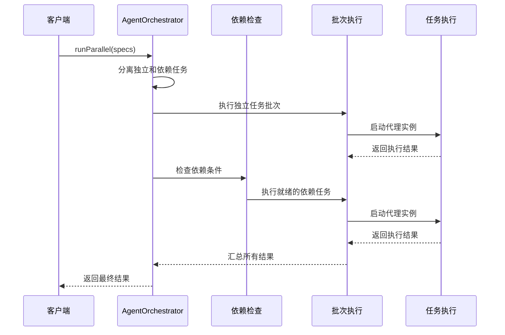

**图表来源**
- [AgentOrchestrator.ts:61-96](file://src/core/agent/AgentOrchestrator.ts#L61-L96)
- [AgentOrchestrator.ts:98-114](file://src/core/agent/AgentOrchestrator.ts#L98-L114)

#### 代理状态管理系统

系统提供了完整的代理生命周期管理：

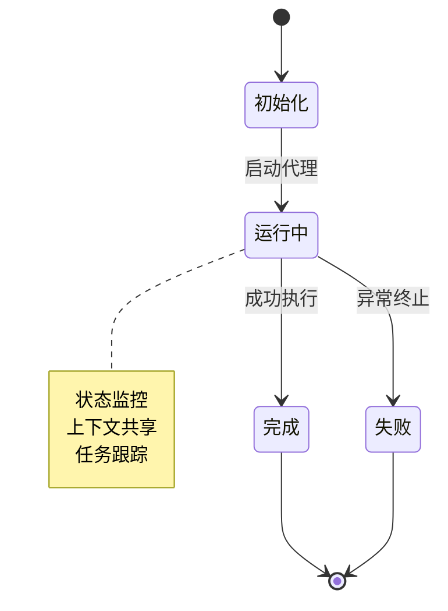

**关键方法**：
- `runParallel()`: 主要的并行执行入口
- `runSingleAgent()`: 单个代理的执行逻辑
- `waitForCompletion()`: 任务完成等待机制
- `buildSharedContextPrompt()`: 上下文构建

#### 错误处理和恢复机制

系统实现了多层次的错误处理策略：

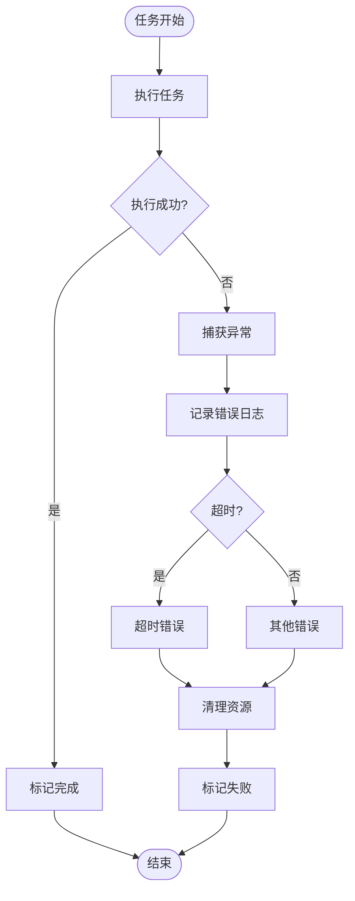

**图表来源**
- [AgentOrchestrator.ts:160-176](file://src/core/agent/AgentOrchestrator.ts#L160-L176)

**章节来源**
- [AgentOrchestrator.ts:57-176](file://src/core/agent/AgentOrchestrator.ts#L57-L176)

### PlanEngine 组件详解

#### 计划生成流程

PlanEngine 使用 LLM 生成结构化的执行计划：

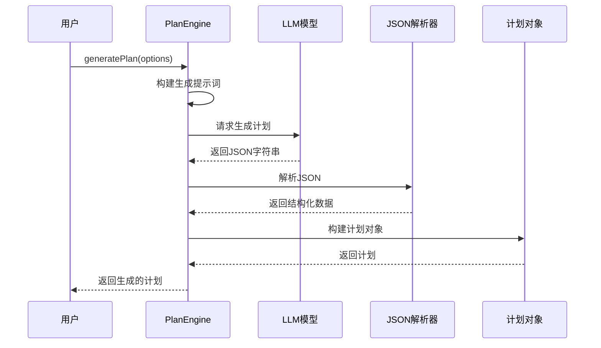

**图表来源**
- [PlanEngine.ts:54-67](file://src/core/agent/PlanEngine.ts#L54-L67)
- [PlanEngine.ts:250-263](file://src/core/agent/PlanEngine.ts#L250-L263)

#### 步骤执行引擎

PlanEngine 实现了智能的步骤执行和依赖管理：

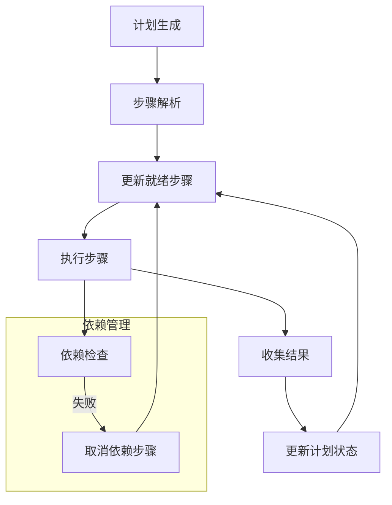

**图表来源**
- [PlanEngine.ts:113-148](file://src/core/agent/PlanEngine.ts#L113-L148)
- [PlanEngine.ts:341-367](file://src/core/agent/PlanEngine.ts#L341-L367)

**章节来源**
- [PlanEngine.ts:54-238](file://src/core/agent/PlanEngine.ts#L54-L238)
- [PlanEngine.ts:341-428](file://src/core/agent/PlanEngine.ts#L341-L428)

### 类关系图

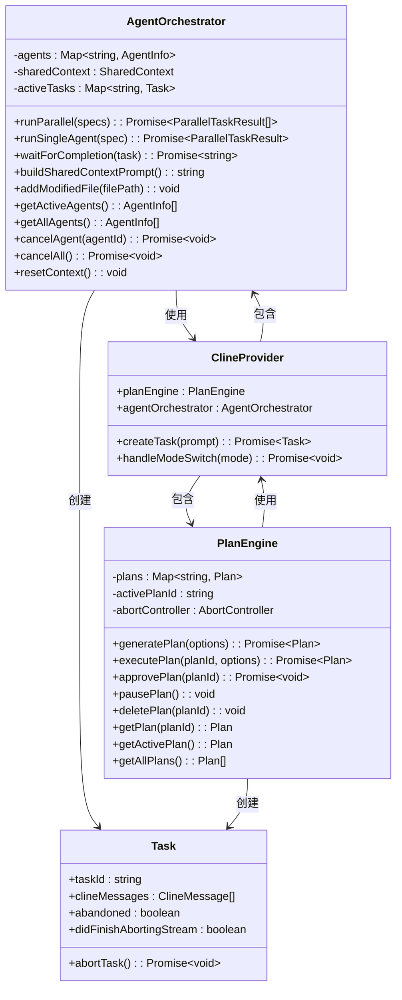

**图表来源**
- [AgentOrchestrator.ts:39-288](file://src/core/agent/AgentOrchestrator.ts#L39-L288)
- [PlanEngine.ts:44-429](file://src/core/agent/PlanEngine.ts#L44-L429)
- [ClineProvider.ts:168-225](file://src/core/webview/ClineProvider.ts#L168-L225)

**章节来源**
- [types.ts:1-68](file://src/core/agent/types.ts#L1-L68)
- [ClineProvider.ts:168-225](file://src/core/webview/ClineProvider.ts#L168-L225)

## 依赖关系分析

代理编排系统的依赖关系体现了清晰的分层架构：

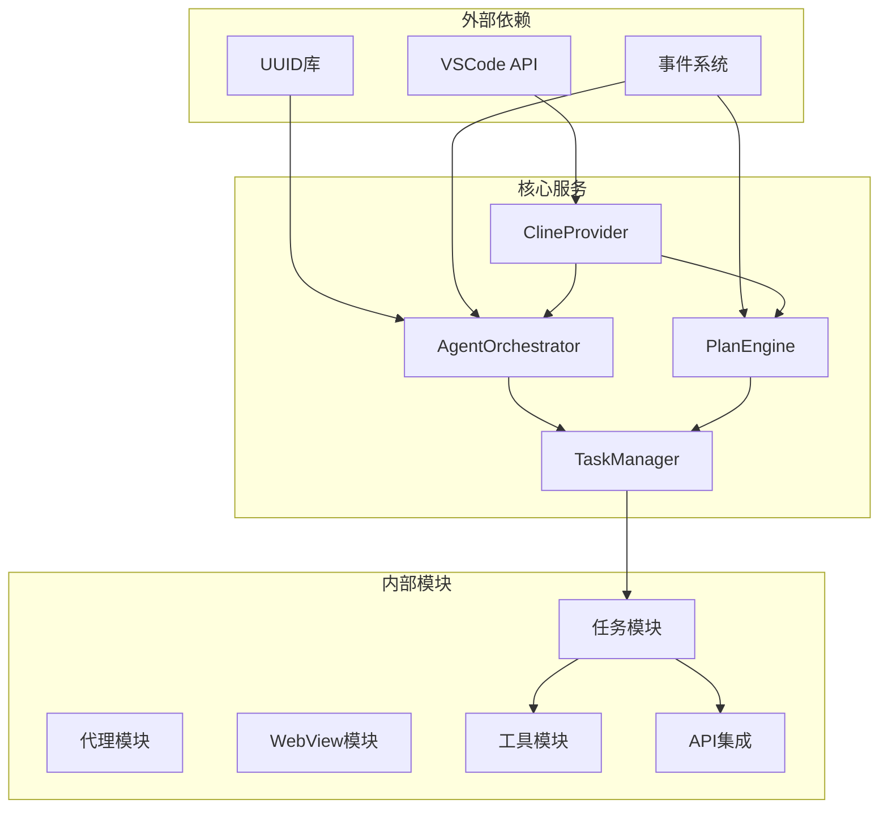

**图表来源**
- [AgentOrchestrator.ts:1-8](file://src/core/agent/AgentOrchestrator.ts#L1-L8)
- [ClineProvider.ts:94-96](file://src/core/webview/ClineProvider.ts#L94-L96)

**依赖特点**：
- **低耦合高内聚**：各模块职责明确，接口清晰
- **事件驱动通信**：通过 EventEmitter 实现松耦合通信
- **异步处理**：充分利用现代 JavaScript 的异步特性
- **类型安全**：完整的 TypeScript 类型定义

**章节来源**
- [index.ts:1-14](file://src/core/agent/index.ts#L1-L14)
- [ClineProvider.ts:168-225](file://src/core/webview/ClineProvider.ts#L168-L225)

## 性能考虑

### 并发控制策略

系统采用了智能的并发控制机制来优化资源利用率：

1. **动态批次大小**：根据系统负载动态调整并行度
2. **资源监控**：实时监控内存和 CPU 使用情况
3. **超时管理**：为长时间运行的任务设置合理的超时限制
4. **背压处理**：当系统过载时自动降低并发度

### 内存管理

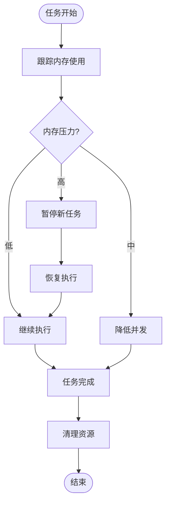

### 缓存策略

系统实现了多级缓存机制：
- **上下文缓存**：共享上下文的增量更新
- **任务结果缓存**：避免重复计算相同的结果
- **模型响应缓存**：缓存 LLM 的中间结果

## 故障排除指南

### 常见问题及解决方案

#### 代理冲突问题

**症状**：多个代理同时访问同一资源导致冲突

**解决方案**：
1. 使用共享上下文中的 `modifiedFiles` 集合跟踪已修改文件
2. 实现文件锁定机制，避免并发写入
3. 使用版本控制确保操作的原子性

#### 死锁问题

**症状**：代理等待依赖任务完成但永远不会发生

**诊断方法**：
1. 检查依赖图是否形成循环依赖
2. 验证任务的完成条件
3. 监控代理的状态变化

**预防措施**：
1. 在生成计划时验证依赖关系的有效性
2. 设置合理的超时时间
3. 实现依赖关系的拓扑排序

#### 资源竞争问题

**症状**：内存泄漏或 CPU 占用过高

**监控指标**：
- 活跃代理数量
- 内存使用量
- 任务执行时间
- 错误率统计

**缓解策略**：
1. 实施资源使用上限
2. 定期清理僵尸代理
3. 优化任务的生命周期管理

### 调试技巧

#### 日志分析

系统提供了详细的日志输出：
- 代理启动和完成事件
- 任务执行进度
- 错误和异常信息
- 性能统计数据

#### 性能分析

使用 VSCode 的性能分析工具：
1. 监控代理的 CPU 使用情况
2. 分析内存分配模式
3. 识别性能瓶颈
4. 优化热点代码

**章节来源**
- [AgentOrchestrator.ts:178-215](file://src/core/agent/AgentOrchestrator.ts#L178-L215)
- [PlanEngine.ts:201-238](file://src/core/agent/PlanEngine.ts#L201-L238)

## 结论

Njust-AI 的代理编排系统展现了现代 AI 代理协作的最佳实践。通过精心设计的架构和实现，系统在以下方面表现出色：

**技术优势**：
- **可扩展性**：模块化设计支持功能的渐进式扩展
- **可靠性**：完善的错误处理和恢复机制
- **性能**：智能的并发控制和资源管理
- **易用性**：清晰的 API 设计和丰富的配置选项

**应用场景**：
- 复杂项目的自动化处理
- 多阶段任务的协调执行
- AI 代理间的协作编排
- 动态工作流的自动化

**未来发展**：
- 支持更复杂的依赖关系图
- 增强的监控和调试功能
- 更好的资源调度算法
- 扩展到分布式部署场景

该系统为 AI 代理的规模化应用奠定了坚实的基础，为未来的智能化开发工具提供了重要的技术支撑。