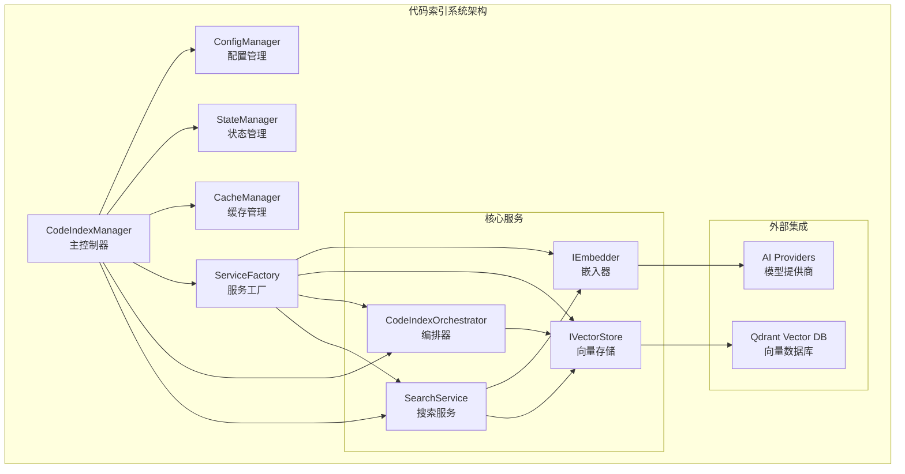
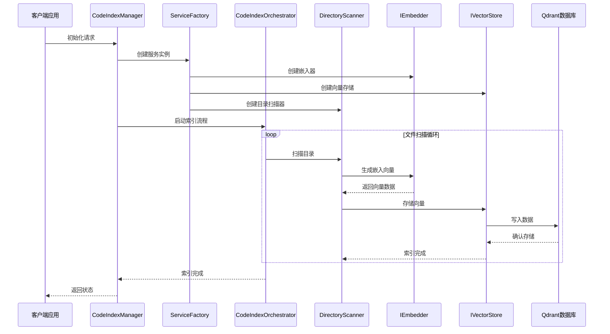
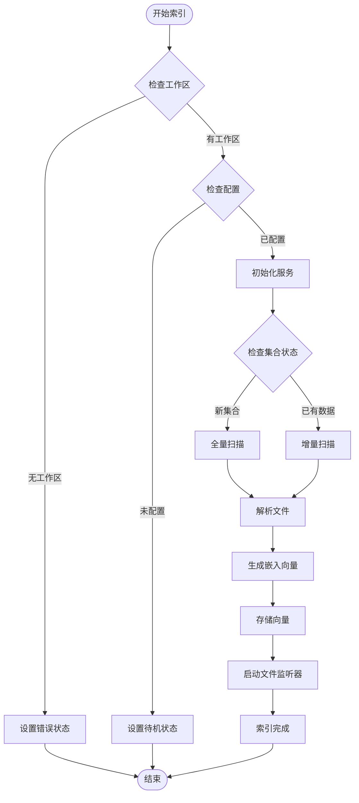
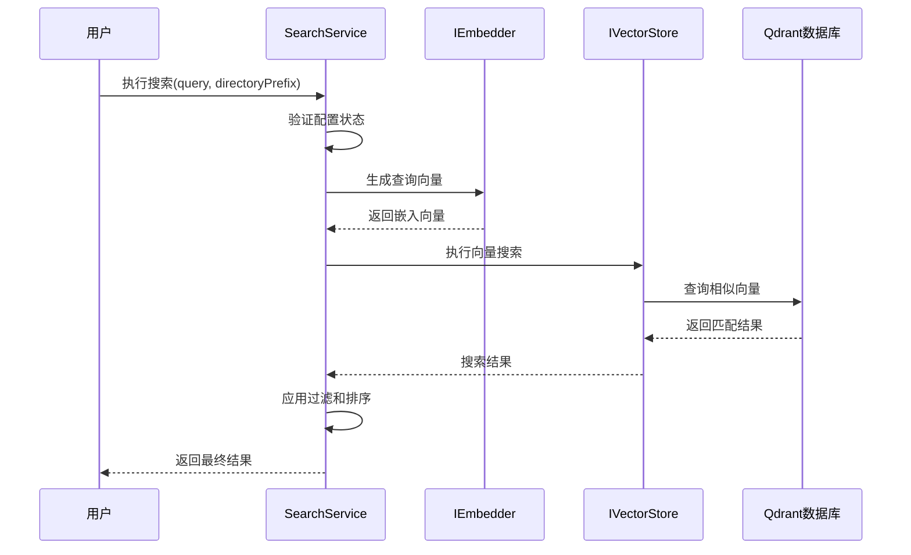
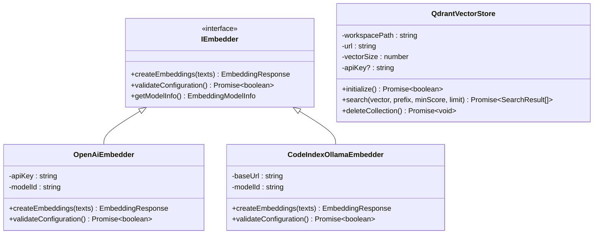
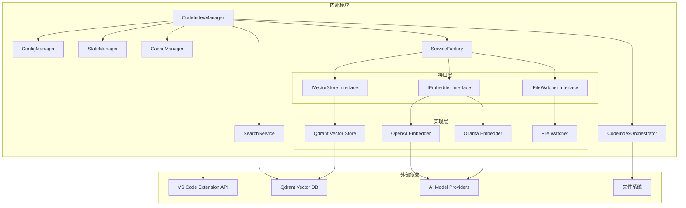
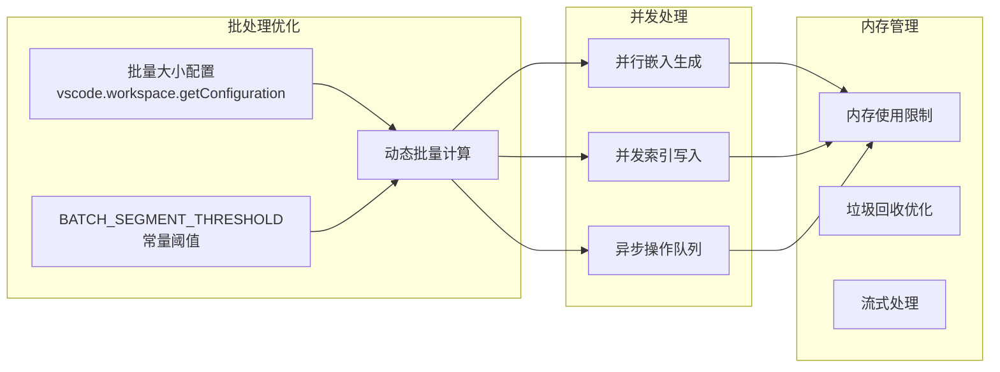

# 代码索引系统

<cite>
**本文档引用的文件**
- [manager.ts](file://src/services/code-index/manager.ts)
- [orchestrator.ts](file://src/services/code-index/orchestrator.ts)
- [search-service.ts](file://src/services/code-index/search-service.ts)
- [cache-manager.ts](file://src/services/code-index/cache-manager.ts)
- [state-manager.ts](file://src/services/code-index/state-manager.ts)
- [config-manager.ts](file://src/services/code-index/config-manager.ts)
- [service-factory.ts](file://src/services/code-index/service-factory.ts)
- [embeddingModels.ts](file://src/shared/embeddingModels.ts)
- [index.ts](file://src/services/code-index/interfaces/index.ts)
</cite>

## 目录
1. [简介](#简介)
2. [项目结构](#项目结构)
3. [核心组件](#核心组件)
4. [架构概览](#架构概览)
5. [详细组件分析](#详细组件分析)
6. [依赖关系分析](#依赖关系分析)
7. [性能考虑](#性能考虑)
8. [故障排除指南](#故障排除指南)
9. [结论](#结论)

## 简介

Njust-AI 的代码索引系统是一个基于向量数据库的智能代码检索平台，旨在为开发者提供高效的代码搜索和理解能力。该系统通过将代码内容转换为高维向量表示，并利用相似度计算技术来实现精确的代码匹配和推荐。

系统支持多种嵌入模型提供商（OpenAI、Ollama、Google Gemini、Mistral等），并集成了Qdrant向量数据库进行高效的数据存储和检索。通过智能缓存机制和增量索引策略，系统能够在大型代码库中提供快速的搜索响应。

## 项目结构

代码索引系统位于 `src/services/code-index/` 目录下，采用模块化设计，主要包含以下核心组件：

**图表来源**
- [manager.ts:18-92](file://src/services/code-index/manager.ts#L18-L92)
- [service-factory.ts:31-36](file://src/services/code-index/service-factory.ts#L31-L36)

**章节来源**
- [manager.ts:18-92](file://src/services/code-index/manager.ts#L18-L92)
- [service-factory.ts:31-36](file://src/services/code-index/service-factory.ts#L31-L36)

## 核心组件

### 主控制器 (CodeIndexManager)

CodeIndexManager 是整个索引系统的主控制器，采用单例模式设计，负责协调所有子组件的工作。它提供了完整的生命周期管理，包括初始化、启动、停止和清理操作。

**关键特性：**
- 单例模式确保每个工作区只有一个索引实例
- 支持动态配置更新和重启
- 提供错误恢复机制
- 集成进度监控和状态报告

### 配置管理器 (ConfigManager)

ConfigManager 负责处理所有配置相关的逻辑，包括从 VS Code 存储中加载配置、验证配置的有效性，以及确定是否需要重启服务。

**支持的配置项：**
- 嵌入模型提供商选择
- API 密钥和认证信息
- Qdrant 向量数据库连接参数
- 搜索参数配置（最小分数、最大结果数）
- 模型维度和特定阈值设置

### 状态管理器 (StateManager)

StateManager 提供统一的状态管理和进度报告机制。它跟踪索引过程中的各种状态变化，并通过事件系统通知订阅者。

**状态类型：**
- Standby（待机）
- Indexing（索引中）
- Indexed（已索引）
- Error（错误）
- Stopping（停止中）

### 缓存管理器 (CacheManager)

CacheManager 实现了智能缓存机制，用于存储文件哈希值以支持增量索引。它使用防抖机制优化磁盘写入操作，减少 I/O 开销。

**缓存策略：**
- 文件内容哈希缓存
- 防抖写入优化
- 自动清理机制
- 跨会话持久化

**章节来源**
- [manager.ts:18-92](file://src/services/code-index/manager.ts#L18-L92)
- [config-manager.ts:12-545](file://src/services/code-index/config-manager.ts#L12-L545)
- [state-manager.ts:5-120](file://src/services/code-index/state-manager.ts#L5-L120)
- [cache-manager.ts:10-111](file://src/services/code-index/cache-manager.ts#L10-L111)

## 架构概览

代码索引系统采用分层架构设计，通过服务工厂模式实现松耦合的组件集成。

**图表来源**
- [manager.ts:162-214](file://src/services/code-index/manager.ts#L162-L214)
- [service-factory.ts:226-262](file://src/services/code-index/service-factory.ts#L226-L262)
- [orchestrator.ts:92-333](file://src/services/code-index/orchestrator.ts#L92-L333)

## 详细组件分析

### 编排器 (CodeIndexOrchestrator)

CodeIndexOrchestrator 是索引流程的核心协调者，负责管理完整的索引生命周期。

#### 索引流程控制

**图表来源**
- [orchestrator.ts:92-333](file://src/services/code-index/orchestrator.ts#L92-L333)

#### 增量索引策略

系统实现了智能的增量索引机制，通过缓存文件哈希值来避免重复处理未更改的文件。

**增量索引优势：**
- 显著减少索引时间
- 降低网络带宽消耗
- 支持离线工作场景
- 实时文件变更检测

### 搜索服务 (SearchService)

SearchService 提供高效的代码搜索功能，支持语义相似度搜索和目录过滤。

#### 搜索算法实现

**图表来源**
- [search-service.ts:27-64](file://src/services/code-index/search-service.ts#L27-L64)

#### 相似度计算策略

系统采用余弦相似度作为主要的相似度计算方法，结合可配置的分数阈值和结果数量限制。

**搜索参数配置：**
- 最小相似度分数：支持用户自定义或模型特定阈值
- 最大返回结果数：默认值可根据需求调整
- 目录前缀过滤：支持按路径前缀筛选结果

### 嵌入器实现

系统支持多种嵌入模型提供商，每种提供商都有专门的实现类。

#### 模型配置管理

**图表来源**
- [service-factory.ts:41-109](file://src/services/code-index/service-factory.ts#L41-L109)
- [embeddingModels.ts:8-90](file://src/shared/embeddingModels.ts#L8-L90)

**章节来源**
- [orchestrator.ts:14-399](file://src/services/code-index/orchestrator.ts#L14-L399)
- [search-service.ts:11-66](file://src/services/code-index/search-service.ts#L11-L66)
- [service-factory.ts:41-109](file://src/services/code-index/service-factory.ts#L41-L109)
- [embeddingModels.ts:8-90](file://src/shared/embeddingModels.ts#L8-L90)

## 依赖关系分析

代码索引系统的依赖关系清晰明确，遵循依赖倒置原则，通过接口抽象实现松耦合设计。

**图表来源**
- [manager.ts:1-16](file://src/services/code-index/manager.ts#L1-L16)
- [service-factory.ts:13-25](file://src/services/code-index/service-factory.ts#L13-L25)

**章节来源**
- [manager.ts:1-16](file://src/services/code-index/manager.ts#L1-L16)
- [service-factory.ts:13-25](file://src/services/code-index/service-factory.ts#L13-L25)

## 性能考虑

### 缓存策略优化

系统采用了多层次的缓存策略来优化性能：

1. **文件哈希缓存**：通过 CacheManager 存储文件内容哈希值，避免重复处理
2. **防抖写入机制**：使用 lodash.debounce 减少频繁的磁盘写入操作
3. **增量索引**：只处理新增或修改的文件，显著减少索引时间

### 并行处理优化

**图表来源**
- [service-factory.ts:178-219](file://src/services/code-index/service-factory.ts#L178-L219)

### 网络通信优化

系统针对不同嵌入模型提供商实现了优化的网络通信策略：

- **连接池管理**：复用网络连接减少建立开销
- **请求重试机制**：自动处理临时网络故障
- **超时控制**：防止长时间阻塞影响用户体验
- **背压处理**：在高负载时优雅降级

## 故障排除指南

### 常见问题诊断

#### 索引失败问题

**症状：** 索引过程中出现错误，状态停留在 "Error"

**可能原因：**
1. Qdrant 连接失败
2. API 密钥配置错误
3. 磁盘空间不足
4. 网络连接异常

**解决方案：**
1. 检查 Qdrant 服务状态和网络连接
2. 验证 API 密钥配置正确性
3. 确保有足够的磁盘空间
4. 检查防火墙和代理设置

#### 搜索性能问题

**症状：** 搜索响应缓慢或返回空结果

**可能原因：**
1. 向量维度不匹配
2. 搜索阈值设置过高
3. 索引数据不完整
4. 模型配置错误

**解决方案：**
1. 验证嵌入模型维度配置
2. 调整搜索阈值参数
3. 重新执行索引操作
4. 检查模型提供商配置

#### 内存占用过高

**症状：** 系统内存使用持续增长

**可能原因：**
1. 批处理大小设置过大
2. 缓存数据过多
3. 内存泄漏
4. 大文件处理

**解决方案：**
1. 减小批量处理大小
2. 清理过期缓存数据
3. 检查内存泄漏点
4. 优化大文件处理策略

### 调试工具和日志

系统提供了丰富的调试功能：

- **状态事件监听**：通过 `onProgressUpdate` 事件获取实时进度
- **错误状态报告**：详细的错误信息和恢复建议
- **性能指标收集**：索引速度、内存使用等关键指标
- **配置验证**：运行时配置检查和有效性验证

**章节来源**
- [orchestrator.ts:297-332](file://src/services/code-index/orchestrator.ts#L297-L332)
- [search-service.ts:58-63](file://src/services/code-index/search-service.ts#L58-L63)
- [cache-manager.ts:48-54](file://src/services/code-index/cache-manager.ts#L48-L54)

## 结论

Njust-AI 的代码索引系统通过精心设计的架构和优化的实现，为开发者提供了一个强大而高效的代码检索平台。系统的主要优势包括：

1. **模块化设计**：清晰的组件分离和接口抽象，便于维护和扩展
2. **智能缓存**：多层缓存策略显著提升性能表现
3. **灵活配置**：支持多种嵌入模型提供商和自定义参数
4. **健壮性**：完善的错误处理和恢复机制
5. **可扩展性**：插件化的架构设计支持未来功能扩展

通过合理配置和使用，该系统能够有效提升开发者的代码理解和搜索效率，在大型项目中发挥重要作用。建议根据具体需求调整配置参数，如批量大小、搜索阈值等，以获得最佳的性能和准确性平衡。