# 任务管理系统

<cite>
**本文档引用的文件**
- [Task.ts](file://src/core/task/Task.ts)
- [index.ts](file://src/core/checkpoints/index.ts)
- [index.ts](file://src/core/message-manager/index.ts)
- [TaskHistoryStore.ts](file://src/core/task-persistence/TaskHistoryStore.ts)
- [taskMessages.ts](file://src/core/task-persistence/taskMessages.ts)
- [apiMessages.ts](file://src/core/task-persistence/apiMessages.ts)
- [MessageQueueService.ts](file://src/core/message-queue/MessageQueueService.ts)
- [RepoPerTaskCheckpointService.ts](file://src/services/checkpoints/RepoPerTaskCheckpointService.ts)
- [Task.spec.ts](file://src/core/task/__tests__/Task.spec.ts)
</cite>

## 目录
1. [简介](#简介)
2. [项目结构](#项目结构)
3. [核心组件](#核心组件)
4. [架构概览](#架构概览)
5. [详细组件分析](#详细组件分析)
6. [依赖关系分析](#依赖关系分析)
7. [性能考虑](#性能考虑)
8. [故障排除指南](#故障排除指南)
9. [结论](#结论)

## 简介

Njust-AI 任务管理系统是一个基于 TypeScript 构建的高级 AI 代理任务管理框架，专为复杂开发工作流设计。该系统提供了完整的任务生命周期管理、状态持久化、消息管理机制和检查点系统。

本系统的核心特性包括：
- **完整的任务生命周期管理**：从创建到销毁的全生命周期支持
- **智能状态持久化**：基于文件系统的可靠数据存储
- **实时消息管理**：支持用户消息队列和 AI 对话历史
- **强大的检查点系统**：基于 Git 的版本控制和回滚能力
- **并发安全保证**：通过锁机制确保数据一致性
- **扩展性设计**：支持 MCP（Model Context Protocol）工具集成

## 项目结构

任务管理系统采用模块化架构，主要分为以下几个核心模块：

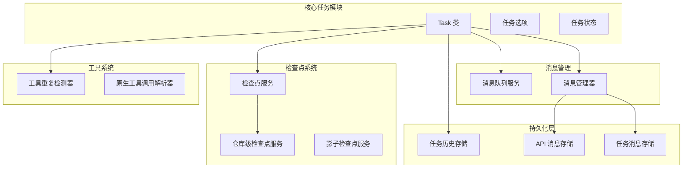

**图表来源**
- [Task.ts:431-587](file://src/core/task/Task.ts#L431-L587)
- [TaskHistoryStore.ts:44-100](file://src/core/task-persistence/TaskHistoryStore.ts#L44-L100)
- [index.ts:28-130](file://src/core/checkpoints/index.ts#L28-L130)

**章节来源**
- [Task.ts:176-587](file://src/core/task/Task.ts#L176-L587)
- [TaskHistoryStore.ts:1-573](file://src/core/task-persistence/TaskHistoryStore.ts#L1-L573)

## 核心组件

### Task 类设计

Task 类是整个任务管理系统的核心，实现了完整的任务生命周期管理。该类继承自 EventEmitter，提供了丰富的事件驱动功能。

#### 主要属性和状态

| 属性类别 | 关键属性 | 描述 |
|---------|----------|------|
| **标识信息** | taskId, instanceId, rootTaskId | 唯一任务标识符和实例标识符 |
| **任务关系** | parentTask, childTaskId | 父子任务关系管理 |
| **状态管理** | isPaused, isInitialized, abandoned | 任务运行状态跟踪 |
| **消息管理** | clineMessages, apiConversationHistory | 用户消息和 API 对话历史 |
| **工具使用** | toolUsage, consecutiveMistakeCount | 工具使用统计和错误计数 |
| **检查点** | enableCheckpoints, checkpointTimeout | 检查点启用和超时设置 |

#### 异步初始化机制

任务系统采用了精心设计的异步初始化机制，确保所有依赖项正确加载：

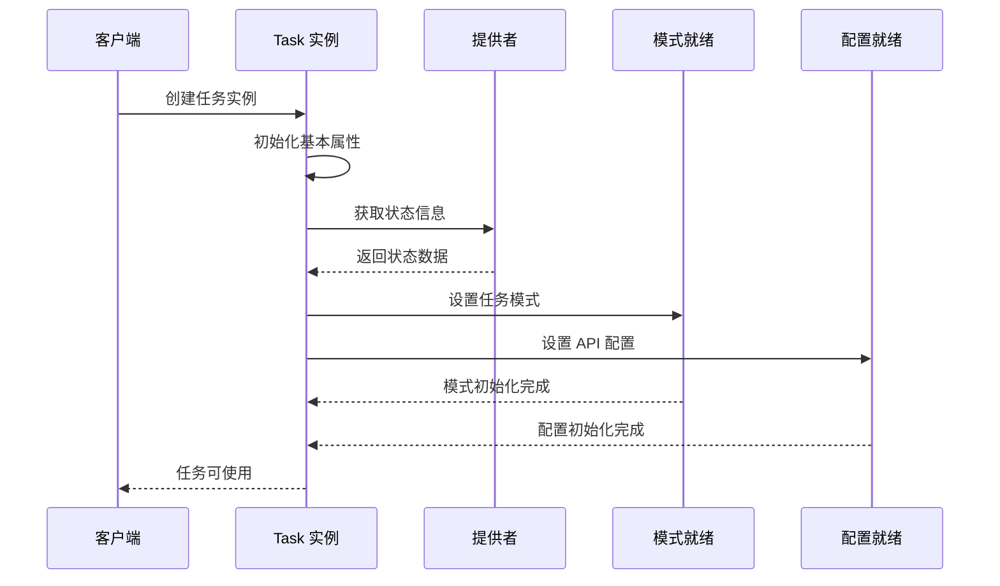

**图表来源**
- [Task.ts:590-662](file://src/core/task/Task.ts#L590-L662)
- [Task.ts:716-781](file://src/core/task/Task.ts#L716-L781)

**章节来源**
- [Task.ts:176-427](file://src/core/task/Task.ts#L176-L427)
- [Task.ts:590-781](file://src/core/task/Task.ts#L590-L781)

### 消息管理机制

消息管理系统提供了高效的消息存储和检索功能，支持复杂的对话历史管理。

#### 消息类型定义

系统支持多种消息类型，每种类型都有特定的用途和格式：

| 消息类型 | 用途 | 关键字段 |
|---------|------|----------|
| **ClineMessage** | 用户界面消息 | ts, type, say, text |
| **ApiMessage** | API 对话消息 | role, content, ts, isSummary |
| **QueuedMessage** | 队列消息 | timestamp, id, text, images |
| **HistoryItem** | 历史项目 | id, task, ts, workspace |

#### 消息持久化策略

消息持久化采用分层存储策略，确保数据的一致性和可靠性：

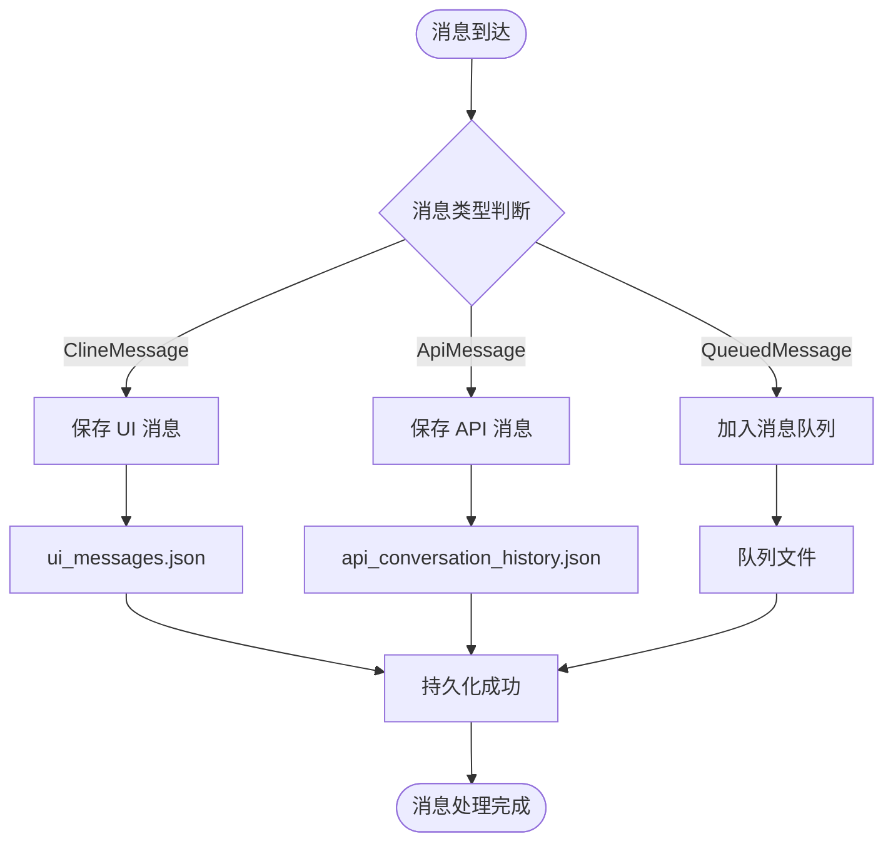

**图表来源**
- [taskMessages.ts:17-56](file://src/core/task-persistence/taskMessages.ts#L17-L56)
- [apiMessages.ts:40-121](file://src/core/task-persistence/apiMessages.ts#L40-L121)

**章节来源**
- [taskMessages.ts:1-57](file://src/core/task-persistence/taskMessages.ts#L1-L57)
- [apiMessages.ts:1-122](file://src/core/task-persistence/apiMessages.ts#L1-L122)

### 检查点系统

检查点系统是任务管理的核心功能之一，提供了基于 Git 的版本控制和回滚能力。

#### 检查点服务架构

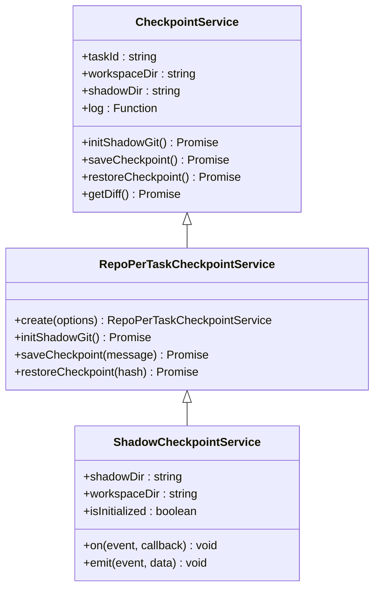

**图表来源**
- [RepoPerTaskCheckpointService.ts:6-15](file://src/services/checkpoints/RepoPerTaskCheckpointService.ts#L6-L15)
- [index.ts:28-130](file://src/core/checkpoints/index.ts#L28-L130)

#### 检查点生命周期

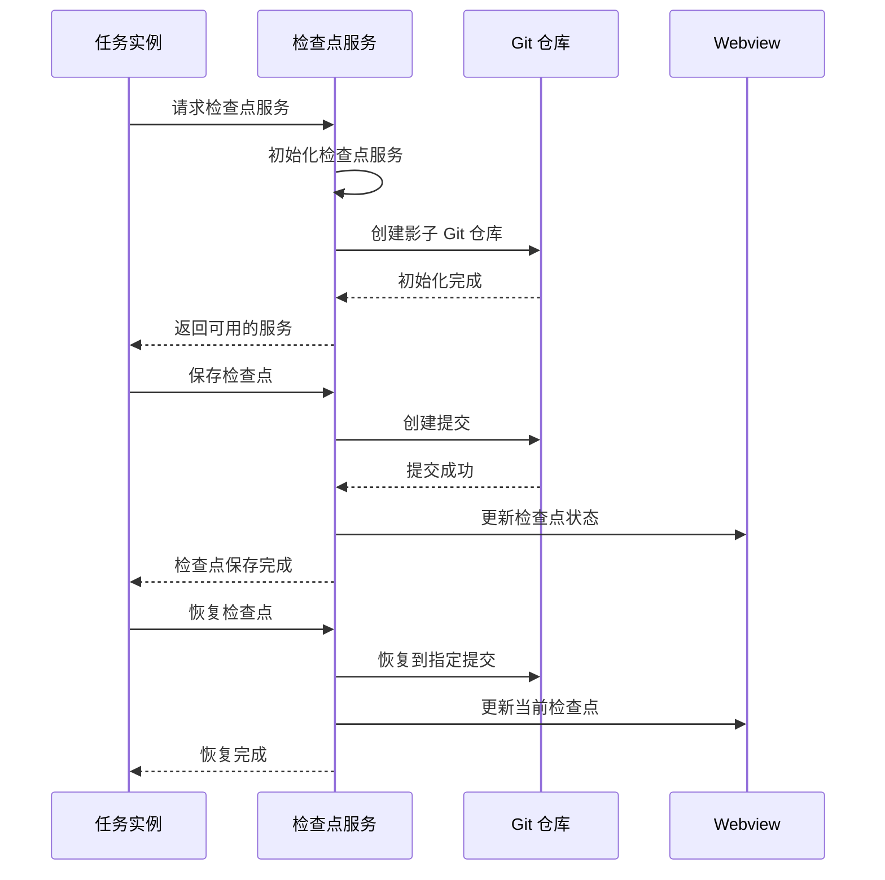

**图表来源**
- [index.ts:212-302](file://src/core/checkpoints/index.ts#L212-L302)
- [index.ts:317-392](file://src/core/checkpoints/index.ts#L317-L392)

**章节来源**
- [index.ts:1-393](file://src/core/checkpoints/index.ts#L1-L393)
- [RepoPerTaskCheckpointService.ts:1-16](file://src/services/checkpoints/RepoPerTaskCheckpointService.ts#L1-L16)

## 架构概览

任务管理系统采用分层架构设计，确保各组件之间的松耦合和高内聚。

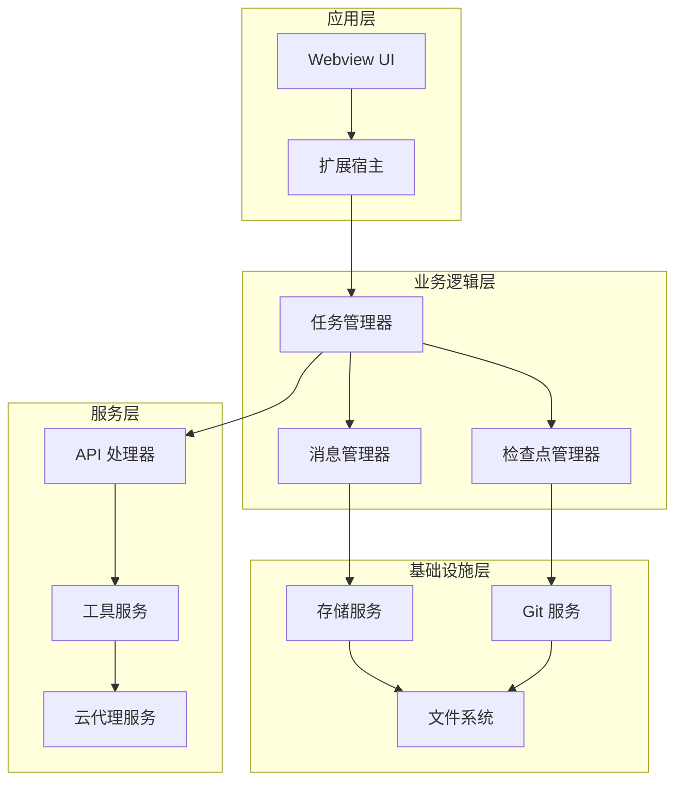

**图表来源**
- [Task.ts:176-587](file://src/core/task/Task.ts#L176-L587)
- [index.ts:28-130](file://src/core/checkpoints/index.ts#L28-L130)

## 详细组件分析

### 任务生命周期管理

任务生命周期管理是系统的核心功能，涵盖了从创建到销毁的完整过程。

#### 生命周期状态转换

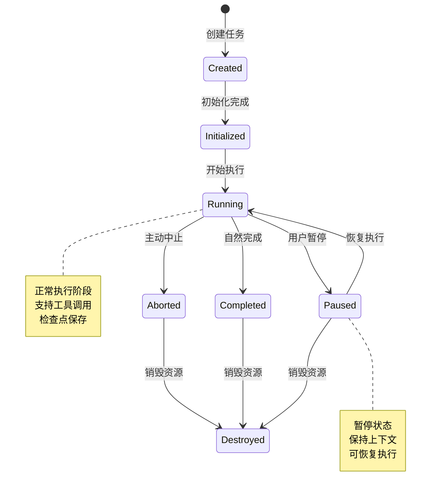

#### 任务创建流程

任务创建过程涉及多个步骤和验证：

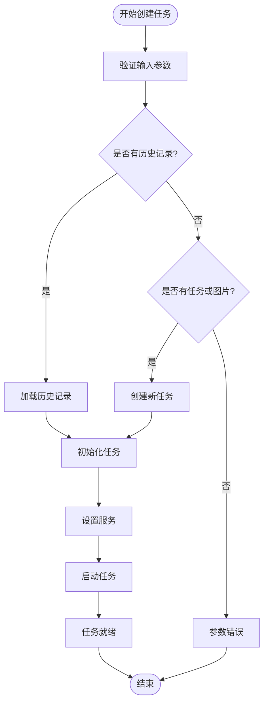

**图表来源**
- [Task.ts:431-587](file://src/core/task/Task.ts#L431-L587)
- [Task.ts:850-864](file://src/core/task/Task.ts#L850-L864)

**章节来源**
- [Task.ts:431-864](file://src/core/task/Task.ts#L431-L864)

### 消息管理器

消息管理器提供了统一的消息操作接口，确保消息历史的一致性和完整性。

#### 消息回滚机制

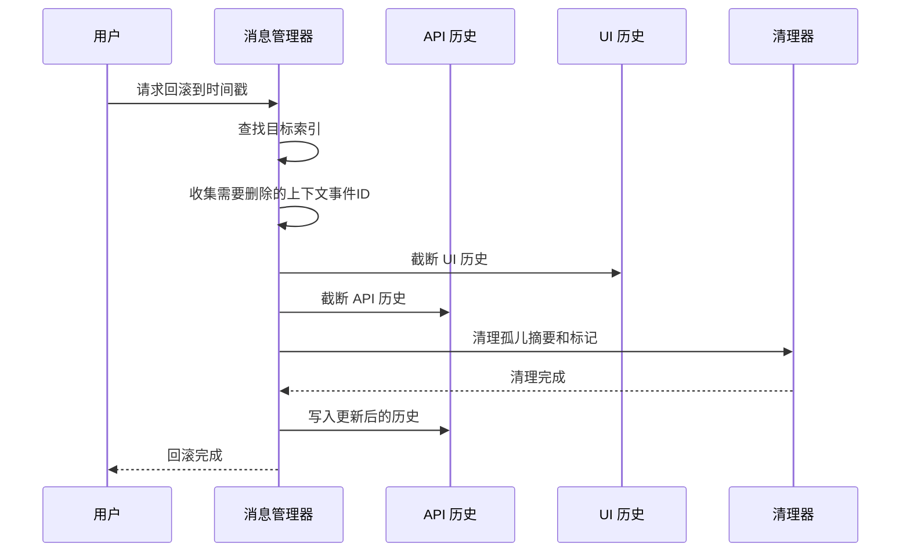

**图表来源**
- [index.ts:48-89](file://src/core/message-manager/index.ts#L48-L89)
- [index.ts:148-246](file://src/core/message-manager/index.ts#L148-L246)

#### 上下文事件管理

消息管理器能够智能识别和处理各种上下文管理事件：

| 事件类型 | 作用 | 影响范围 |
|---------|------|----------|
| **condense_context** | 内容压缩事件 | 摘要消息和关联内容 |
| **sliding_window_truncation** | 滑动窗口截断 | 截断标记和隐藏内容 |
| **user_feedback** | 用户反馈 | 相关的工具调用结果 |
| **tool_result** | 工具执行结果 | 工具调用链的完整性 |

**章节来源**
- [index.ts:1-272](file://src/core/message-manager/index.ts#L1-L272)

### 任务历史存储

任务历史存储系统提供了可靠的持久化机制，支持跨会话的任务恢复。

#### 存储架构设计

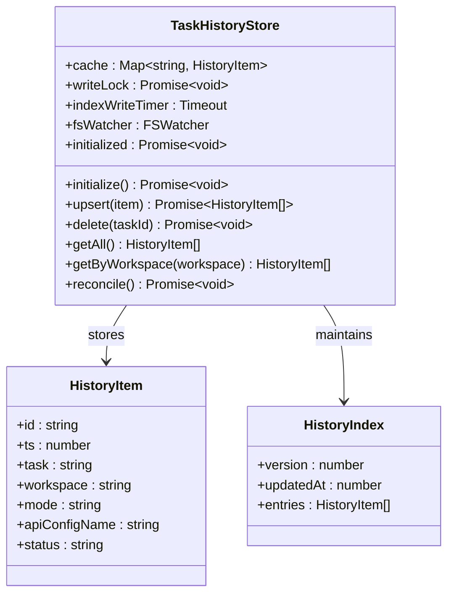

**图表来源**
- [TaskHistoryStore.ts:44-100](file://src/core/task-persistence/TaskHistoryStore.ts#L44-L100)
- [TaskHistoryStore.ts:14-18](file://src/core/task-persistence/TaskHistoryStore.ts#L14-L18)

#### 并发控制机制

系统采用了多层并发控制机制，确保数据一致性：

1. **进程间锁**：使用 `proper-lockfile` 确保跨进程安全
2. **写锁序列化**：单进程内通过 Promise 链确保写操作顺序
3. **文件系统监控**：自动检测外部修改并进行协调

**章节来源**
- [TaskHistoryStore.ts:1-573](file://src/core/task-persistence/TaskHistoryStore.ts#L1-L573)

### 工具系统集成

任务系统深度集成了工具调用机制，支持复杂的工具链操作。

#### 工具调用流程

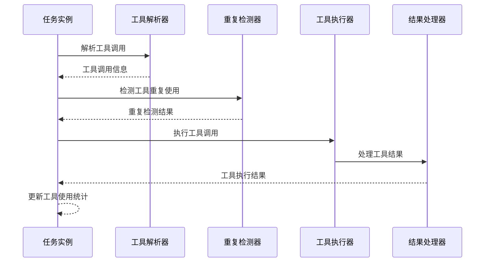

**图表来源**
- [Task.ts:311-427](file://src/core/task/Task.ts#L311-L427)

#### 工具重复检测

系统内置了智能的工具重复检测机制，防止无限循环和资源浪费：

| 检测类型 | 阈值 | 行为 |
|---------|------|------|
| **连续错误次数** | configurable | 超过限制时停止工具调用 |
| **工具重复使用** | configurable | 检测相同工具的连续调用 |
| **无工具使用** | configurable | 检测长时间无工具调用 |
| **无助手消息** | configurable | 检测长时间无 AI 响应 |

**章节来源**
- [Task.ts:311-427](file://src/core/task/Task.ts#L311-L427)

## 依赖关系分析

任务管理系统具有清晰的依赖关系，各组件之间通过明确定义的接口进行交互。

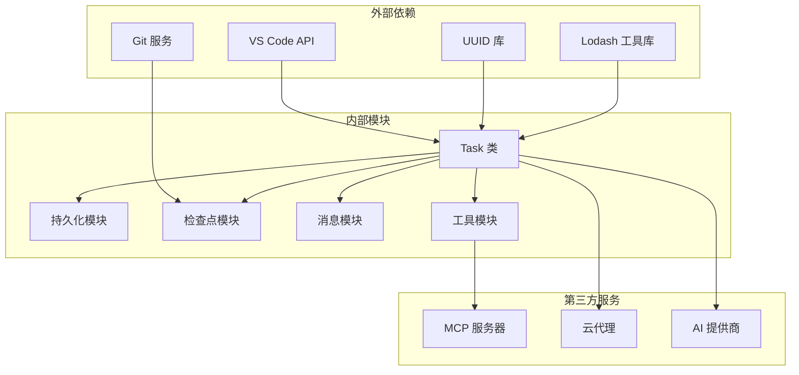

**图表来源**
- [Task.ts:1-150](file://src/core/task/Task.ts#L1-L150)
- [index.ts:1-393](file://src/core/checkpoints/index.ts#L1-L393)

### 组件耦合度分析

系统采用了低耦合设计原则：

1. **接口隔离**：每个模块都通过明确定义的接口与其他模块交互
2. **依赖注入**：通过构造函数注入依赖，便于测试和维护
3. **事件驱动**：使用 EventEmitter 实现松耦合的组件通信
4. **工厂模式**：使用工厂方法创建复杂对象，降低创建成本

**章节来源**
- [Task.ts:1-150](file://src/core/task/Task.ts#L1-L150)
- [index.ts:1-393](file://src/core/checkpoints/index.ts#L1-L393)

## 性能考虑

任务管理系统在设计时充分考虑了性能优化，采用了多种策略来提升系统响应速度和资源利用率。

### 缓存策略

系统实现了多层次的缓存机制：

1. **内存缓存**：任务状态和配置信息缓存在内存中
2. **文件缓存**：持久化数据采用增量更新策略
3. **工具调用缓存**：避免重复的工具调用和计算

### 异步处理

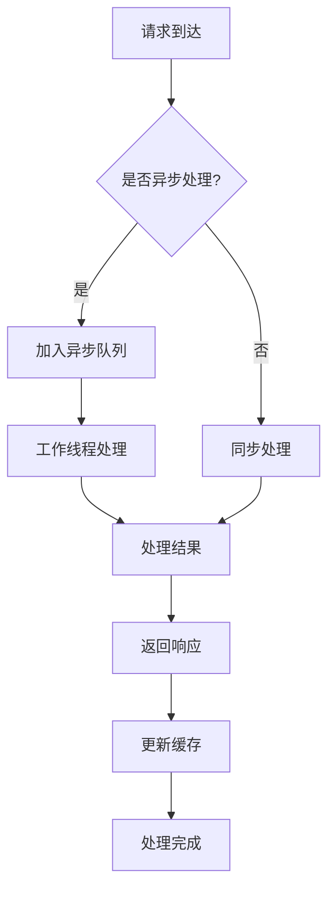

### 内存管理

系统采用了智能的内存管理策略：

1. **弱引用**：对大型对象使用 WeakRef 避免内存泄漏
2. **延迟加载**：按需加载大型数据结构
3. **垃圾回收**：定期清理不再使用的临时数据

## 故障排除指南

### 常见问题及解决方案

#### 任务状态不一致

**问题描述**：任务状态在不同组件间出现不一致

**解决方案**：
1. 检查事件监听器是否正确注册
2. 验证状态更新的原子性
3. 使用事务性操作确保数据一致性

#### 检查点初始化失败

**问题描述**：检查点服务无法正常初始化

**解决方案**：
1. 确认 Git 已正确安装和配置
2. 检查工作目录权限
3. 验证全局存储路径有效性

#### 消息丢失问题

**问题描述**：用户消息或 API 消息在持久化过程中丢失

**解决方案**：
1. 检查文件系统权限
2. 验证磁盘空间充足
3. 确认写锁机制正常工作

### 调试技巧

#### 日志分析

系统提供了详细的日志记录机制，便于问题诊断：

```typescript
// 启用详细日志
console.log("[Task] 任务初始化开始");
console.warn("[Task] 检测到潜在问题");
console.error("[Task] 发生错误:", error);
```

#### 性能监控

```typescript
// 性能计时
const startTime = performance.now();
// 执行耗时操作
const endTime = performance.now();
console.log(`操作耗时: ${endTime - startTime}ms`);
```

**章节来源**
- [Task.ts:1-150](file://src/core/task/Task.ts#L1-L150)
- [index.ts:21-130](file://src/core/checkpoints/index.ts#L21-L130)

## 结论

Njust-AI 任务管理系统是一个设计精良、功能完备的任务管理框架。通过模块化架构、完善的生命周期管理、智能的持久化机制和强大的检查点系统，该系统为复杂的 AI 代理应用提供了坚实的基础。

### 主要优势

1. **完整的生命周期管理**：从创建到销毁的全生命周期支持
2. **可靠的持久化机制**：基于文件系统的可靠数据存储
3. **智能的并发控制**：通过多层锁机制确保数据一致性
4. **灵活的扩展性**：支持 MCP 工具集成和自定义扩展
5. **强大的调试能力**：完善的日志记录和性能监控

### 未来发展方向

1. **性能优化**：进一步优化大文件处理和内存使用
2. **用户体验**：改进界面交互和状态反馈
3. **安全性增强**：加强数据加密和访问控制
4. **监控完善**：增加更详细的性能指标和告警机制

该系统为 Njust-AI 生态系统中的任务管理提供了标准化的解决方案，为构建复杂的 AI 应用奠定了坚实的技术基础。