# 工具系统

<cite>
**本文档引用的文件**
- [BaseTool.ts](file://src/core/tools/BaseTool.ts)
- [validateToolUse.ts](file://src/core/tools/validateToolUse.ts)
- [build-tools.ts](file://src/core/task/build-tools.ts)
- [tools.ts](file://src/shared/tools.ts)
- [ToolRepetitionDetector.ts](file://src/core/tools/ToolRepetitionDetector.ts)
- [ReadFileTool.ts](file://src/core/tools/ReadFileTool.ts)
- [ExecuteCommandTool.ts](file://src/core/tools/ExecuteCommandTool.ts)
- [EditFileTool.ts](file://src/core/tools/EditFileTool.ts)
- [CodebaseSearchTool.ts](file://src/core/tools/CodebaseSearchTool.ts)
- [tool-executors.ts](file://src/services/mcp-server/tool-executors.ts)
- [imageHelpers.ts](file://src/core/tools/helpers/imageHelpers.ts)
- [accessMcpResourceTool.ts](file://src/core/tools/accessMcpResourceTool.ts)
</cite>

## 目录
1. [简介](#简介)
2. [项目结构](#项目结构)
3. [核心组件](#核心组件)
4. [架构概览](#架构概览)
5. [详细组件分析](#详细组件分析)
6. [依赖分析](#依赖分析)
7. [性能考虑](#性能考虑)
8. [故障排除指南](#故障排除指南)
9. [结论](#结论)
10. [附录](#附录)

## 简介

Njust-AI 的工具系统是一个高度模块化和可扩展的框架，用于支持智能代理与环境的交互。该系统提供了统一的工具抽象基类、内置工具实现、工具验证机制和工具执行器，能够处理文件读写、命令执行、代码搜索等多种操作。

系统的核心设计理念包括：
- **类型安全**：通过 TypeScript 泛型确保工具参数的类型安全
- **可扩展性**：支持自定义工具的动态注册和执行
- **安全性**：内置路径验证、权限控制和资源限制
- **用户体验**：提供渐进式反馈和用户确认机制
- **性能优化**：支持流式处理和内存管理

## 项目结构

工具系统的组织结构采用按功能分层的设计模式：

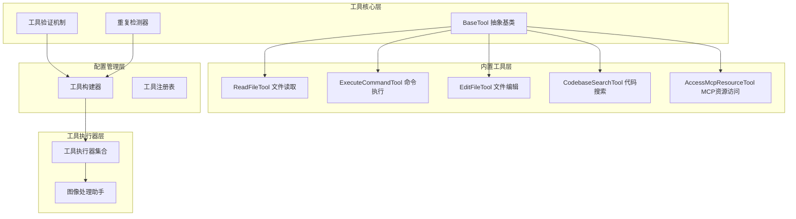

**图表来源**
- [BaseTool.ts:30-167](file://src/core/tools/BaseTool.ts#L30-L167)
- [validateToolUse.ts:57-88](file://src/core/tools/validateToolUse.ts#L57-L88)
- [build-tools.ts:83-177](file://src/core/task/build-tools.ts#L83-L177)

**章节来源**
- [BaseTool.ts:1-167](file://src/core/tools/BaseTool.ts#L1-L167)
- [tools.ts:266-392](file://src/shared/tools.ts#L266-L392)
- [build-tools.ts:1-177](file://src/core/task/build-tools.ts#L1-L177)

## 核心组件

### 工具抽象基类设计

BaseTool 抽象基类是整个工具系统的核心，提供了统一的工具执行框架：

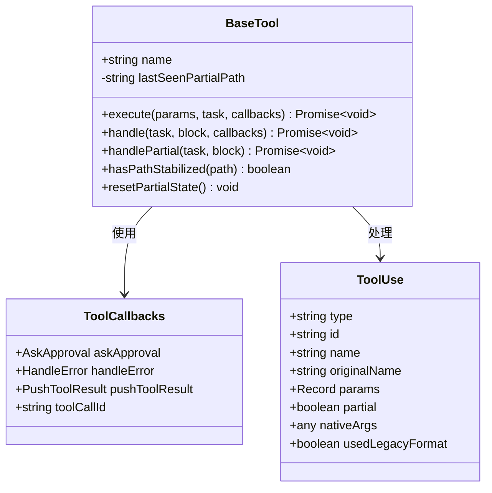

**图表来源**
- [BaseTool.ts:30-167](file://src/core/tools/BaseTool.ts#L30-L167)
- [tools.ts:132-152](file://src/shared/tools.ts#L132-L152)

### 工具验证机制

validateToolUse 模块提供了全面的工具验证功能：

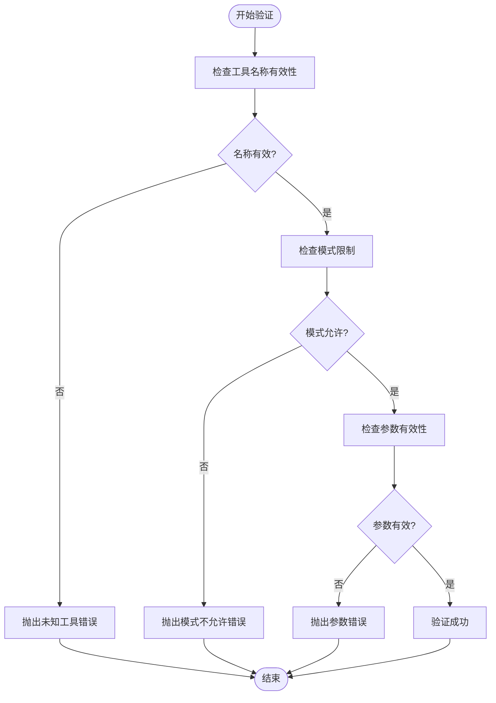

**图表来源**
- [validateToolUse.ts:57-88](file://src/core/tools/validateToolUse.ts#L57-L88)
- [validateToolUse.ts:145-264](file://src/core/tools/validateToolUse.ts#L145-L264)

**章节来源**
- [validateToolUse.ts:1-265](file://src/core/tools/validateToolUse.ts#L1-L265)
- [BaseTool.ts:102-167](file://src/core/tools/BaseTool.ts#L102-L167)

## 架构概览

工具系统的整体架构采用分层设计，确保了高内聚低耦合：

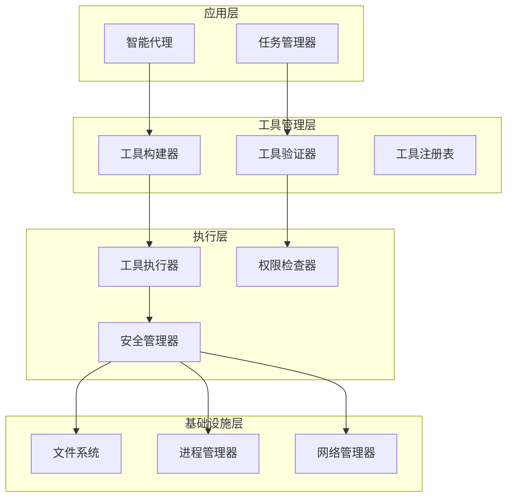

**图表来源**
- [build-tools.ts:83-177](file://src/core/task/build-tools.ts#L83-L177)
- [validateToolUse.ts:57-88](file://src/core/tools/validateToolUse.ts#L57-L88)

## 详细组件分析

### 文件读取工具 (ReadFileTool)

ReadFileTool 提供了强大的文件读取功能，支持多种读取模式：

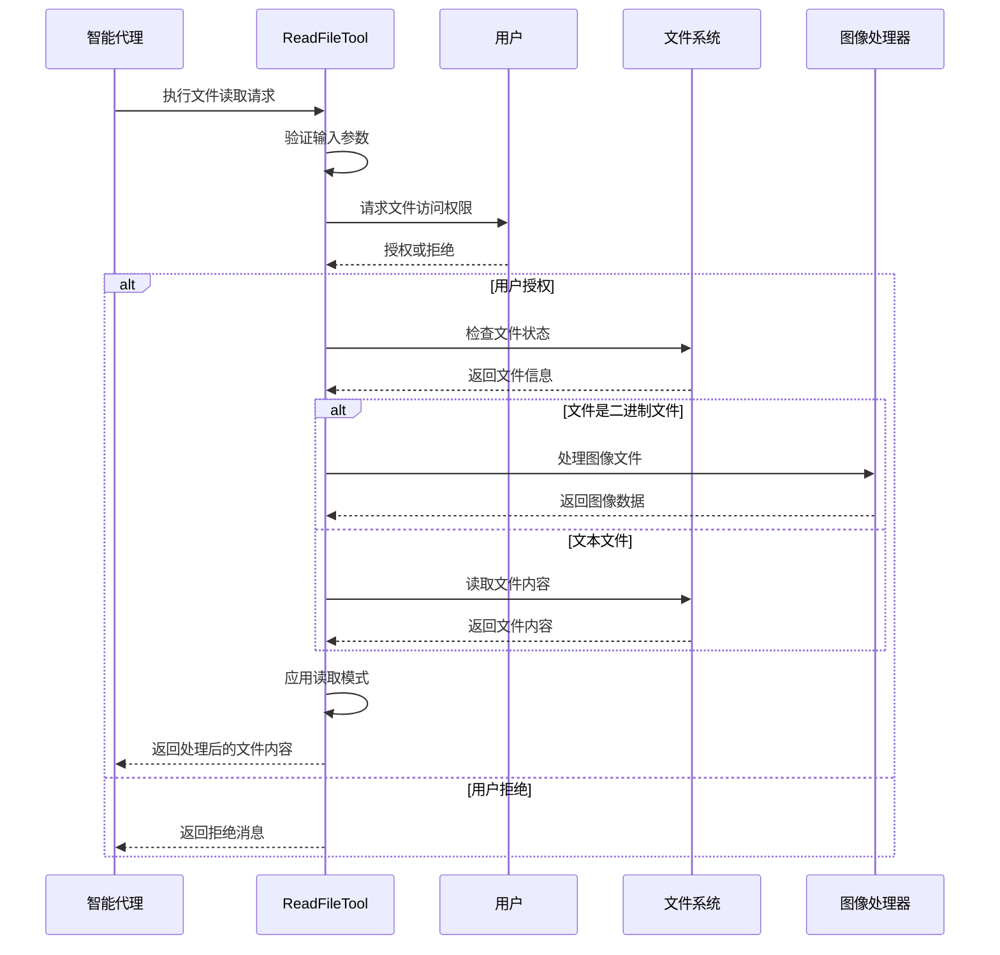

**图表来源**
- [ReadFileTool.ts:77-267](file://src/core/tools/ReadFileTool.ts#L77-L267)
- [ReadFileTool.ts:446-569](file://src/core/tools/ReadFileTool.ts#L446-L569)

#### 图像处理功能

ReadFileTool 内置了完整的图像处理能力：

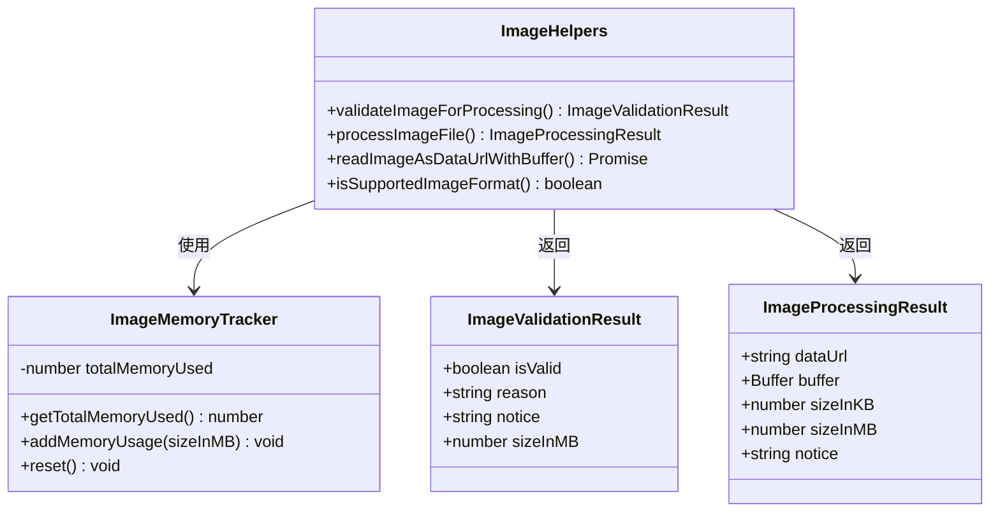

**图表来源**
- [imageHelpers.ts:96-193](file://src/core/tools/helpers/imageHelpers.ts#L96-L193)

**章节来源**
- [ReadFileTool.ts:1-855](file://src/core/tools/ReadFileTool.ts#L1-L855)
- [imageHelpers.ts:1-193](file://src/core/tools/helpers/imageHelpers.ts#L1-L193)

### 命令执行工具 (ExecuteCommandTool)

ExecuteCommandTool 提供了安全的命令执行功能，具有多重安全保护机制：

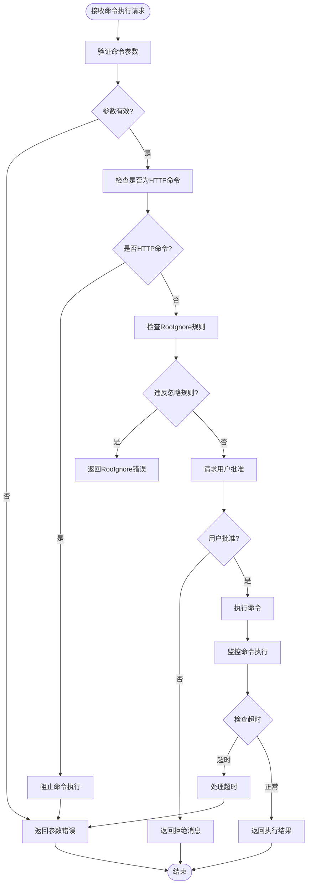

**图表来源**
- [ExecuteCommandTool.ts:48-163](file://src/core/tools/ExecuteCommandTool.ts#L48-L163)
- [ExecuteCommandTool.ts:180-552](file://src/core/tools/ExecuteCommandTool.ts#L180-L552)

#### 终端集成机制

ExecuteCommandTool 支持多种终端执行模式：

| 执行模式 | 描述 | 特点 |
|---------|------|------|
| VS Code集成 | 使用VS Code终端 | 支持Shell集成，实时输出显示 |
| Execa模式 | 使用Execa库 | 跨平台兼容，无Shell依赖 |
| 背景执行 | 命令在后台运行 | 支持代理超时和用户超时 |

**章节来源**
- [ExecuteCommandTool.ts:1-636](file://src/core/tools/ExecuteCommandTool.ts#L1-L636)

### 文件编辑工具 (EditFileTool)

EditFileTool 提供了智能的文件编辑功能，支持多种匹配策略：

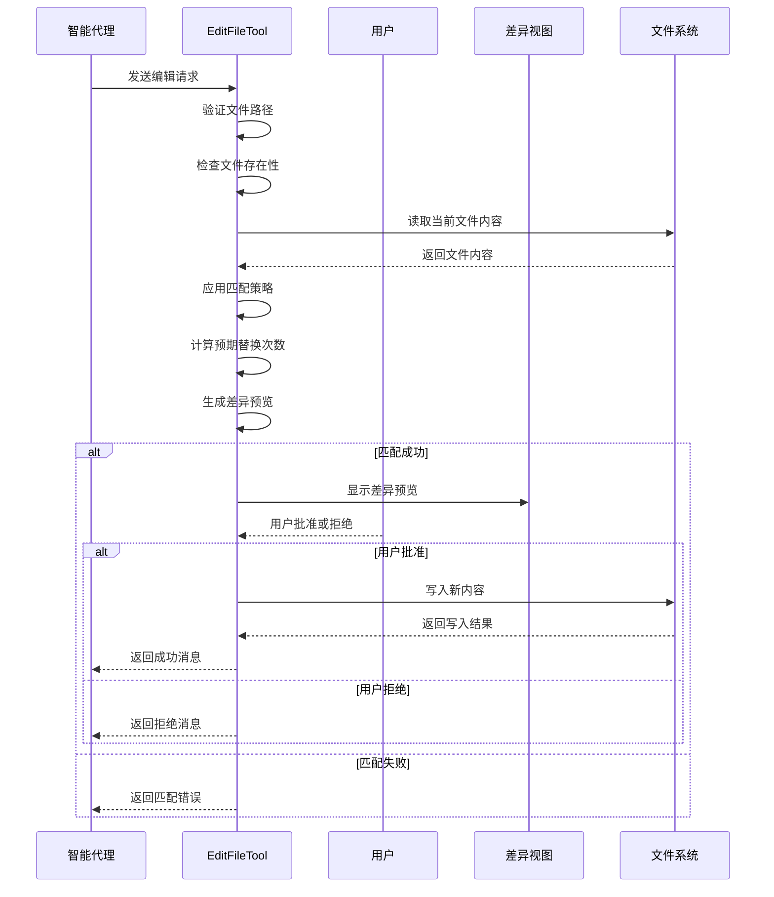

**图表来源**
- [EditFileTool.ts:141-487](file://src/core/tools/EditFileTool.ts#L141-L487)

#### 匹配策略算法

EditFileTool 实现了三种智能匹配策略：

1. **精确字面量匹配**：严格匹配字符串内容
2. **空白容忍正则匹配**：忽略空白字符差异
3. **令牌正则匹配**：基于单词边界匹配

**章节来源**
- [EditFileTool.ts:1-531](file://src/core/tools/EditFileTool.ts#L1-L531)

### 代码搜索工具 (CodebaseSearchTool)

CodebaseSearchTool 提供了基于向量索引的智能代码搜索功能：

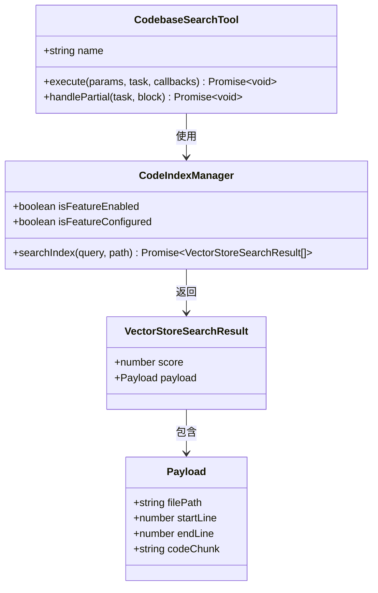

**图表来源**
- [CodebaseSearchTool.ts:19-148](file://src/core/tools/CodebaseSearchTool.ts#L19-L148)

**章节来源**
- [CodebaseSearchTool.ts:1-148](file://src/core/tools/CodebaseSearchTool.ts#L1-L148)

### MCP工具执行器

MCP工具执行器提供了标准化的外部工具调用接口：

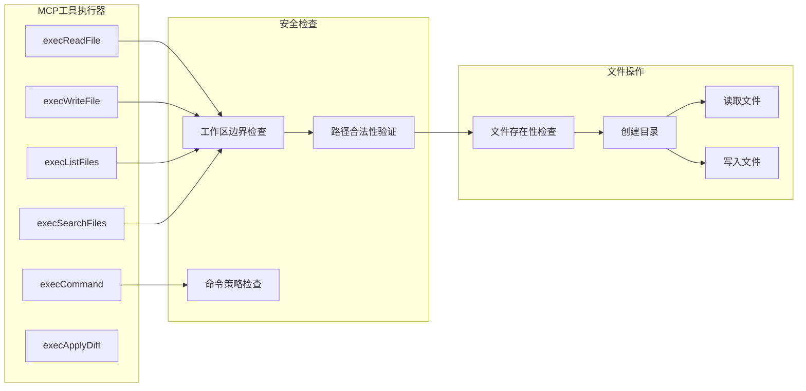

**图表来源**
- [tool-executors.ts:28-208](file://src/services/mcp-server/tool-executors.ts#L28-L208)

**章节来源**
- [tool-executors.ts:1-208](file://src/services/mcp-server/tool-executors.ts#L1-L208)

## 依赖分析

工具系统的依赖关系展现了清晰的分层架构：

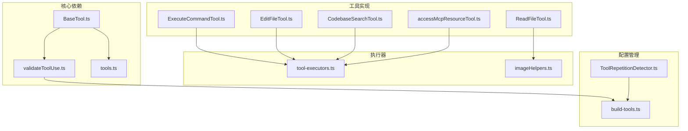

**图表来源**
- [BaseTool.ts:30-167](file://src/core/tools/BaseTool.ts#L30-L167)
- [build-tools.ts:83-177](file://src/core/task/build-tools.ts#L83-L177)

**章节来源**
- [tools.ts:266-392](file://src/shared/tools.ts#L266-L392)
- [build-tools.ts:83-177](file://src/core/task/build-tools.ts#L83-L177)

## 性能考虑

工具系统在多个层面进行了性能优化：

### 内存管理
- **流式输出**：终端输出采用流式处理，避免内存溢出
- **图像内存追踪**：实时跟踪图像处理内存使用情况
- **输出缓冲限制**：限制累积输出大小防止内存增长

### 并发控制
- **工具重复检测**：防止AI陷入工具调用循环
- **超时机制**：双重超时控制（代理超时和用户超时）
- **任务队列**：有序处理工具调用请求

### 缓存策略
- **工具构建缓存**：避免重复构建工具定义
- **文件内容缓存**：减少重复文件读取
- **权限检查缓存**：优化权限验证性能

## 故障排除指南

### 常见问题及解决方案

#### 工具调用失败
**问题**：工具执行过程中出现错误
**解决方案**：
1. 检查工具参数的有效性
2. 验证工作目录的可访问性
3. 确认用户权限和RooIgnore规则
4. 查看详细的错误日志

#### 权限不足
**问题**：工具调用被拒绝
**解决方案**：
1. 检查RooIgnore配置
2. 验证文件路径的安全性
3. 确认工作区边界内的访问
4. 审查用户权限设置

#### 执行超时
**问题**：命令执行超过设定时间
**解决方案**：
1. 调整命令执行超时设置
2. 检查命令的复杂度和执行时间
3. 考虑使用背景执行模式
4. 优化命令的执行策略

#### 资源限制
**问题**：内存或磁盘空间不足
**解决方案**：
1. 检查系统资源使用情况
2. 调整内存限制设置
3. 清理临时文件和缓存
4. 优化工具的资源使用策略

**章节来源**
- [ToolRepetitionDetector.ts:1-90](file://src/core/tools/ToolRepetitionDetector.ts#L1-L90)
- [ExecuteCommandTool.ts:444-463](file://src/core/tools/ExecuteCommandTool.ts#L444-L463)

## 结论

Njust-AI 的工具系统通过精心设计的架构和丰富的功能特性，为智能代理提供了强大而安全的工具调用能力。系统的主要优势包括：

1. **类型安全**：完整的 TypeScript 类型系统确保工具使用的安全性
2. **可扩展性**：灵活的工具抽象和注册机制支持自定义工具开发
3. **安全性**：多层次的安全检查和权限控制保护系统安全
4. **用户体验**：智能的用户交互和反馈机制提升使用体验
5. **性能优化**：高效的内存管理和并发控制确保系统性能

该系统为开发者提供了完整的工具开发框架，包括工具抽象、验证机制、执行器和安全控制等核心组件，能够满足各种复杂的工具调用需求。

## 附录

### 工具开发指南

#### 创建自定义工具步骤
1. 继承 BaseTool 抽象类
2. 实现 execute 方法
3. 在 NativeToolArgs 中定义参数类型
4. 注册工具到工具系统
5. 测试工具功能和安全性

#### 工具配置选项
- **参数验证**：自动验证工具参数的有效性
- **权限控制**：基于RooIgnore和工作区边界的访问控制
- **超时设置**：可配置的执行超时和用户超时
- **内存限制**：图像处理和输出缓冲的内存限制

#### 最佳实践
- 始终进行参数验证和错误处理
- 实现适当的权限检查
- 使用流式处理避免内存问题
- 提供清晰的用户反馈和进度指示
- 实现适当的超时和重试机制