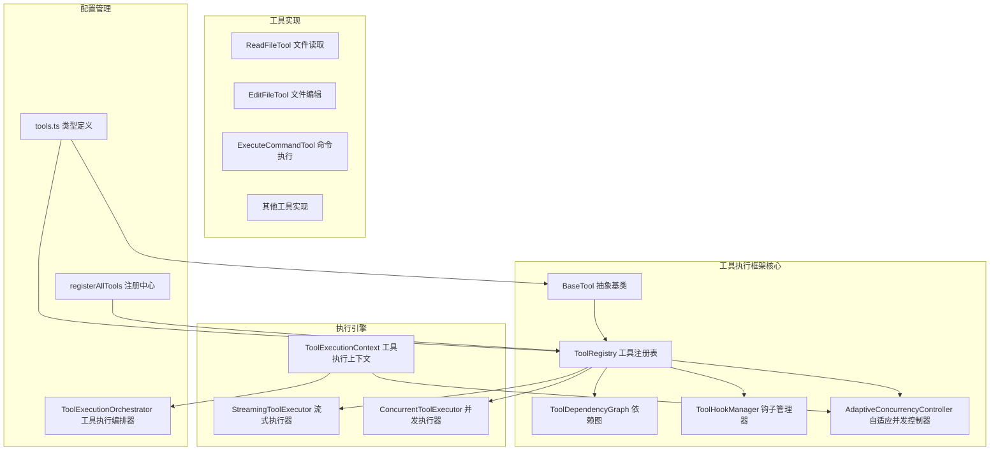
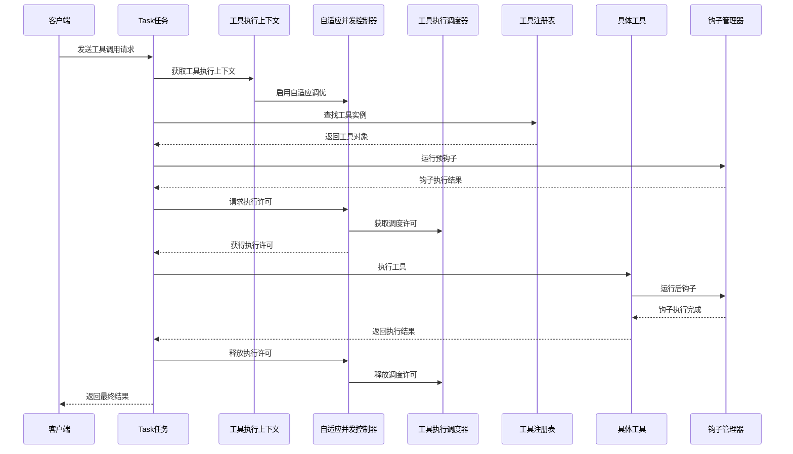
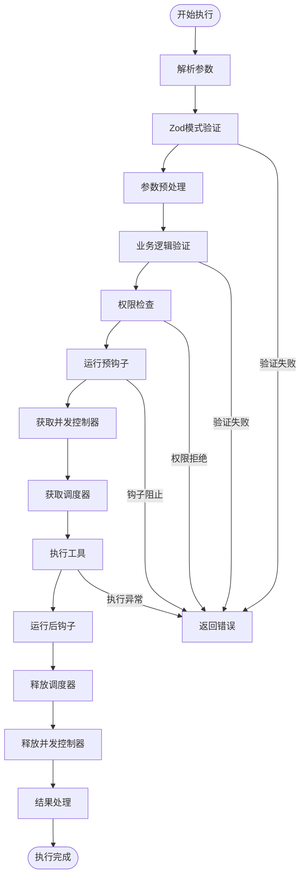
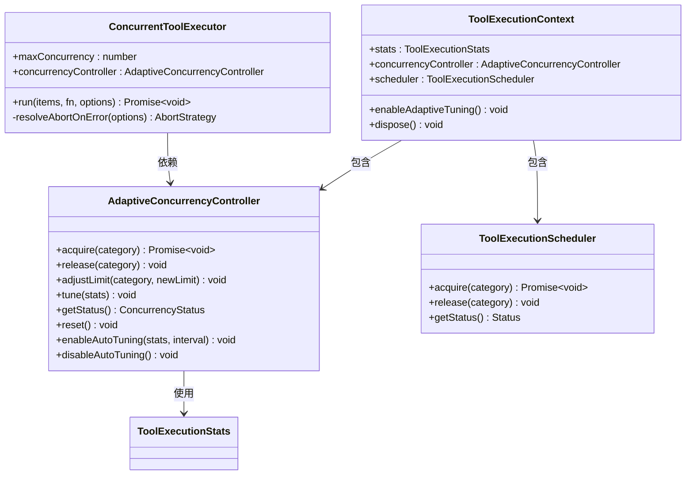
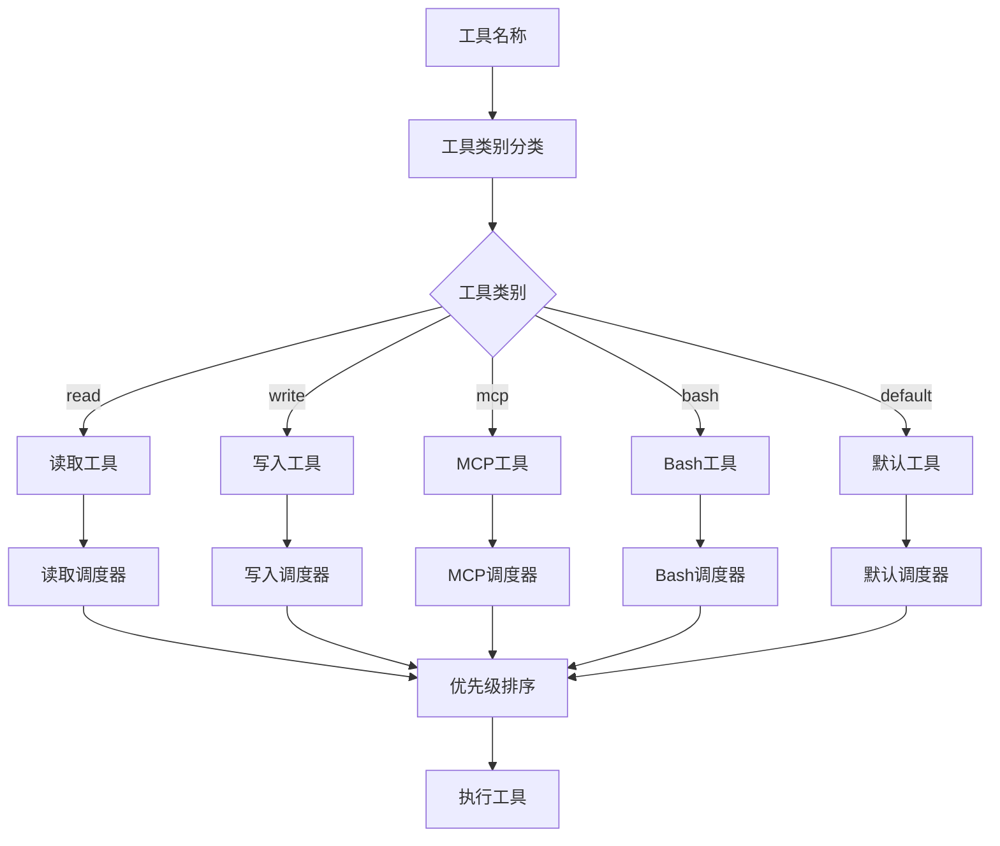
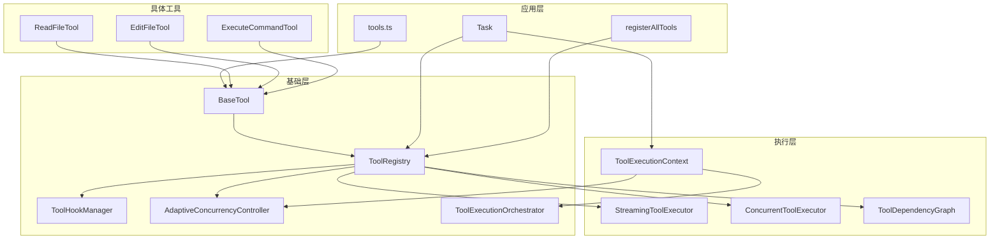

# 统一工具执行框架

<cite>
**本文档引用的文件**
- [BaseTool.ts](file://src/core/tools/BaseTool.ts)
- [ToolRegistry.ts](file://src/core/tools/ToolRegistry.ts)
- [toolOrchestration.ts](file://src/core/tools/toolOrchestration.ts)
- [Task.ts](file://src/core/task/Task.ts)
- [registerAllTools.ts](file://src/core/tools/registerAllTools.ts)
- [ToolDependencyGraph.ts](file://src/core/tools/ToolDependencyGraph.ts)
- [ToolHookManager.ts](file://src/core/tools/ToolHookManager.ts)
- [tools.ts](file://src/shared/tools.ts)
- [ReadFileTool.ts](file://src/core/tools/ReadFileTool.ts)
- [EditFileTool.ts](file://src/core/tools/EditFileTool.ts)
- [ExecuteCommandTool.ts](file://src/core/tools/ExecuteCommandTool.ts)
- [StreamingToolExecutor.ts](file://src/core/tools/StreamingToolExecutor.ts)
- [ConcurrentToolExecutor.ts](file://src/core/tools/ConcurrentToolExecutor.ts)
- [AdaptiveConcurrencyController.ts](file://src/core/tools/AdaptiveConcurrencyController.ts)
- [ToolExecutionContext.ts](file://src/core/task/ToolExecutionContext.ts)
- [ToolExecutionOrchestrator.ts](file://src/core/task/ToolExecutionOrchestrator.ts)
</cite>

## 更新摘要
**变更内容**
- 新增自适应并发控制器（AdaptiveConcurrencyController）章节，详细介绍智能并发限制和自动调优功能
- 更新并发执行策略部分，增加自适应并发控制的架构说明
- 新增工具类别分类和调度器章节，展示工具分类和优先级管理
- 更新性能考虑部分，增加自适应调优对性能的影响分析
- 新增故障排除指南，包含自适应并发控制器的调试方法

## 目录
1. [简介](#简介)
2. [项目结构](#项目结构)
3. [核心组件](#核心组件)
4. [架构概览](#架构概览)
5. [详细组件分析](#详细组件分析)
6. [依赖关系分析](#依赖关系分析)
7. [性能考虑](#性能考虑)
8. [故障排除指南](#故障排除指南)
9. [结论](#结论)

## 简介

统一工具执行框架是Njust-AI项目中的核心基础设施，负责管理、调度和执行各种AI代理工具。该框架提供了标准化的工具接口、强大的注册机制、并发执行控制、权限管理和钩子系统，确保所有工具能够在统一的架构下安全、高效地运行。

**重大更新**：框架引入了自适应并发控制器（AdaptiveConcurrencyController），支持不同工具类别的智能并发限制和自动调优，显著增强了工具执行的性能和可靠性。

框架的主要目标包括：
- 提供统一的工具抽象接口
- 支持工具的动态注册和发现
- 实现智能的并发执行和资源管理
- 建立完善的权限控制和审计机制
- 提供灵活的钩子系统用于扩展功能
- 支持工具结果缓存和持久化
- **新增**：实现自适应并发控制和自动调优机制

## 项目结构

统一工具执行框架位于项目的`src/core/tools`目录下，采用模块化设计，包含以下主要组件：

**图表来源**
- [BaseTool.ts:1-716](file://src/core/tools/BaseTool.ts#L1-L716)
- [ToolRegistry.ts:1-220](file://src/core/tools/ToolRegistry.ts#L1-L220)
- [registerAllTools.ts:1-128](file://src/core/tools/registerAllTools.ts#L1-L128)
- [AdaptiveConcurrencyController.ts:1-177](file://src/core/tools/AdaptiveConcurrencyController.ts#L1-L177)
- [ToolExecutionContext.ts:1-34](file://src/core/task/ToolExecutionContext.ts#L1-L34)
- [ToolExecutionOrchestrator.ts:1-215](file://src/core/task/ToolExecutionOrchestrator.ts#L1-L215)

**章节来源**
- [BaseTool.ts:1-716](file://src/core/tools/BaseTool.ts#L1-L716)
- [ToolRegistry.ts:1-220](file://src/core/tools/ToolRegistry.ts#L1-L220)
- [registerAllTools.ts:1-128](file://src/core/tools/registerAllTools.ts#L1-L128)
- [AdaptiveConcurrencyController.ts:1-177](file://src/core/tools/AdaptiveConcurrencyController.ts#L1-L177)
- [ToolExecutionContext.ts:1-34](file://src/core/task/ToolExecutionContext.ts#L1-L34)
- [ToolExecutionOrchestrator.ts:1-215](file://src/core/task/ToolExecutionOrchestrator.ts#L1-L215)

## 核心组件

### BaseTool 抽象基类

BaseTool是所有工具的抽象基类，定义了统一的工具接口和生命周期管理：

**核心特性：**
- **类型安全的参数处理**：支持Zod模式验证和JSON Schema转换
- **完整的执行流程**：包含参数解析、验证、权限检查、执行和结果处理
- **流式支持**：支持部分参数稳定性和流式工具调用
- **错误处理**：内置重试机制和错误恢复策略
- **性能监控**：记录工具执行时间和内存使用情况

**关键方法：**
- `execute()`：工具的核心执行逻辑
- `validateInput()`：输入参数验证
- `checkPermissions()`：权限检查和自动审批
- `handlePartial()`：流式部分消息处理

**章节来源**
- [BaseTool.ts:85-716](file://src/core/tools/BaseTool.ts#L85-L716)

### ToolRegistry 工具注册表

ToolRegistry提供集中式的工具注册和管理功能：

**核心功能：**
- **工具注册**：支持条件注册和别名映射
- **查询功能**：提供工具查找、可用性检查
- **缓存机制**：缓存并发安全工具和检查点需求
- **依赖管理**：构建和维护工具依赖图

**关键特性：**
- 单例模式确保全局一致性
- 支持条件工具（如平台特定工具）
- 自动索引工具别名
- 智能缓存失效机制

**章节来源**
- [ToolRegistry.ts:27-220](file://src/core/tools/ToolRegistry.ts#L27-L220)

### ToolHookManager 钩子管理器

ToolHookManager管理各种类型的钩子，提供强大的扩展能力：

**支持的钩子类型：**
- **工具执行钩子**：预执行、后执行、失败钩子
- **权限钩子**：权限拒绝审计日志
- **生命周期钩子**：会话开始/结束、设置/停止、子代理管理

**执行策略：**
- 可配置的钩子执行顺序
- 错误隔离，避免钩子失败影响主流程
- 支持钩子链式调用和参数传递

**章节来源**
- [ToolHookManager.ts:31-302](file://src/core/tools/ToolHookManager.ts#L31-L302)

### AdaptiveConcurrencyController 自适应并发控制器

**新增组件**：AdaptiveConcurrencyController是框架的核心创新，实现了智能的并发控制和自动调优功能。

**核心特性：**
- **多类别并发控制**：支持read、write、mcp、bash、default五种工具类别
- **智能调优算法**：基于执行统计自动调整并发限制
- **无死锁设计**：即使在极限并发下也能保证系统稳定性
- **实时状态监控**：提供详细的并发状态和等待队列信息

**关键功能：**
- `acquire(category)`：获取指定类别的执行许可
- `release(category)`：释放执行许可
- `adjustLimit(category, newLimit)`：手动调整并发限制
- `tune(stats)`：基于统计信息自动调优
- `getStatus()`：获取当前并发状态

**章节来源**
- [AdaptiveConcurrencyController.ts:23-177](file://src/core/tools/AdaptiveConcurrencyController.ts#L23-L177)

### ToolExecutionContext 工具执行上下文

**新增组件**：ToolExecutionContext整合了工具执行所需的所有原语，提供统一的资源管理接口。

**核心功能：**
- **聚合管理**：统一管理并发控制器、调度器和流式执行器
- **自适应调优**：支持启用和禁用自适应调优功能
- **资源清理**：提供统一的资源清理和重置接口
- **统计收集**：收集工具执行统计信息用于调优

**章节来源**
- [ToolExecutionContext.ts:9-34](file://src/core/task/ToolExecutionContext.ts#L9-L34)

## 架构概览

统一工具执行框架采用分层架构设计，确保各组件职责清晰、耦合度低：

**图表来源**
- [Task.ts:475-475](file://src/core/task/Task.ts#L475-L475)
- [ToolExecutionContext.ts:20-27](file://src/core/task/ToolExecutionContext.ts#L20-L27)
- [AdaptiveConcurrencyController.ts:47-59](file://src/core/tools/AdaptiveConcurrencyController.ts#L47-L59)
- [ToolExecutionOrchestrator.ts:75-107](file://src/core/task/ToolExecutionOrchestrator.ts#L75-L107)

## 详细组件分析

### 工具执行流水线

工具执行采用严格的流水线模式，确保每个步骤都有明确的职责：

**图表来源**
- [BaseTool.ts:450-688](file://src/core/tools/BaseTool.ts#L450-L688)
- [AdaptiveConcurrencyController.ts:47-59](file://src/core/tools/AdaptiveConcurrencyController.ts#L47-L59)

### 并发执行策略

**更新**：框架现在集成了自适应并发控制器，提供智能的并发执行策略：

**图表来源**
- [AdaptiveConcurrencyController.ts:23-177](file://src/core/tools/AdaptiveConcurrencyController.ts#L23-L177)
- [ConcurrentToolExecutor.ts:28-138](file://src/core/tools/ConcurrentToolExecutor.ts#L28-L138)
- [ToolExecutionOrchestrator.ts:65-126](file://src/core/task/ToolExecutionOrchestrator.ts#L65-L126)
- [ToolExecutionContext.ts:9-34](file://src/core/task/ToolExecutionContext.ts#L9-L34)

### 工具类别分类和调度器

**新增组件**：工具执行编排器提供了智能的工具分类和调度功能：

**图表来源**
- [ToolExecutionOrchestrator.ts:24-49](file://src/core/task/ToolExecutionOrchestrator.ts#L24-L49)
- [ToolExecutionOrchestrator.ts:144-164](file://src/core/task/ToolExecutionOrchestrator.ts#L144-L164)

### 权限管理系统

权限系统提供多层次的安全控制：

**权限决策流程：**
1. **规则引擎评估**：基于配置的权限规则
2. **自动审批**：只读工具自动批准
3. **用户交互**：需要人工确认的危险操作
4. **审计日志**：记录所有权限决策

**章节来源**
- [BaseTool.ts:348-371](file://src/core/tools/BaseTool.ts#L348-L371)
- [ToolHookManager.ts:196-209](file://src/core/tools/ToolHookManager.ts#L196-L209)

### 工具编排系统

工具编排系统负责优化工具调用序列：

**去重机制：**
- 识别重复的只读工具调用
- 合并相同的文件读取请求
- 维护原始调用映射关系

**批处理策略：**
- 将连续的并发安全工具分组
- 动态调整批处理大小
- 支持串行和并行混合执行

**章节来源**
- [toolOrchestration.ts:17-67](file://src/core/tools/toolOrchestration.ts#L17-L67)

## 依赖关系分析

统一工具执行框架建立了清晰的依赖层次结构：

**图表来源**
- [Task.ts:475-475](file://src/core/task/Task.ts#L475-L475)
- [registerAllTools.ts:15-128](file://src/core/tools/registerAllTools.ts#L15-L128)
- [AdaptiveConcurrencyController.ts:1-177](file://src/core/tools/AdaptiveConcurrencyController.ts#L1-L177)

**章节来源**
- [Task.ts:475-475](file://src/core/task/Task.ts#L475-L475)
- [registerAllTools.ts:15-128](file://src/core/tools/registerAllTools.ts#L15-L128)

## 性能考虑

统一工具执行框架在多个层面进行了性能优化：

### 缓存策略
- **工具结果缓存**：对只读工具的输出进行缓存
- **文件读取缓存**：避免重复的文件访问
- **工具定义缓存**：减少工具元数据重建开销

### 内存管理
- **流式处理**：大文件和命令输出的流式处理
- **内存限制**：工具结果大小限制和令牌预算
- **垃圾回收**：及时释放不再使用的资源

### 并发优化

**更新**：新增自适应并发控制对性能的增强：

- **智能并发限制**：根据不同工具类别动态调整并发数量
- **自动调优算法**：基于执行统计自动优化并发配置
- **无死锁设计**：确保系统在高负载下的稳定性
- **多级别并发控制**：read、write、mcp、bash、default五类工具分别管理
- **实时状态监控**：提供详细的并发使用情况和等待队列信息

### 自适应调优机制

**新增功能**：自适应并发控制器通过以下机制提升性能：

- **统计收集**：收集工具执行时间、失败率等关键指标
- **智能判断**：根据平均执行时间和失败率决定是否调整并发限制
- **渐进式调整**：每次调整幅度适中，避免过度波动
- **类别感知**：不同工具类别采用不同的调优策略
- **上限保护**：防止并发限制超出合理范围

**章节来源**
- [AdaptiveConcurrencyController.ts:110-135](file://src/core/tools/AdaptiveConcurrencyController.ts#L110-L135)
- [ToolExecutionContext.ts:20-27](file://src/core/task/ToolExecutionContext.ts#L20-L27)

## 故障排除指南

### 常见问题诊断

**工具执行失败**
1. 检查工具参数验证是否通过
2. 确认权限检查结果
3. 查看钩子执行状态
4. 分析错误重试机制

**并发执行问题**
1. **自适应并发控制器问题**：
   - 检查工具类别分类是否正确
   - 验证并发限制配置是否合理
   - 监控自适应调优日志
   - 检查是否有死锁或饥饿现象

2. **工具执行阻塞**：
   - 检查调度器状态
   - 验证工具依赖关系
   - 分析等待队列长度
   - 确认资源释放是否正常

**性能问题**
1. 检查缓存命中率
2. 分析内存使用模式
3. 优化工具参数大小
4. 调整并发配置

### 调试技巧

**启用详细日志**
- 设置环境变量`DEBUG=tool:*`
- 监控工具执行时间统计
- 记录权限决策过程
- **新增**：启用自适应并发控制器调试日志

**性能分析**
- 使用内存分析工具
- 监控并发执行指标
- 分析工具调用频率
- **新增**：跟踪自适应调优事件和统计信息

**自适应并发控制器调试**
1. **状态监控**：使用`getStatus()`方法查看当前并发状态
2. **调优事件**：监听调优事件以了解自动调整过程
3. **统计分析**：分析执行统计数据以诊断性能问题
4. **手动干预**：必要时手动调整并发限制

**章节来源**
- [BaseTool.ts:689-713](file://src/core/tools/BaseTool.ts#L689-L713)
- [ToolHookManager.ts:146-148](file://src/core/tools/ToolHookManager.ts#L146-L148)
- [AdaptiveConcurrencyController.ts:82-84](file://src/core/tools/AdaptiveConcurrencyController.ts#L82-L84)
- [ToolExecutionContext.ts:20-27](file://src/core/task/ToolExecutionContext.ts#L20-L27)

## 结论

统一工具执行框架为Njust-AI项目提供了一个强大、灵活且安全的工具管理基础设施。通过标准化的工具接口、智能的注册机制、完善的权限控制和高效的执行引擎，该框架能够支持复杂的AI代理工作流。

**主要优势：**
- **统一抽象**：所有工具遵循相同的设计模式
- **安全可靠**：多层次的权限控制和审计机制
- **高性能**：智能缓存、并发执行和资源管理
- **可扩展**：灵活的钩子系统和插件机制
- **易于维护**：清晰的架构分离和文档化
- **智能调优**：自适应并发控制和自动性能优化

**重大改进**：
- **自适应并发控制**：根据实际执行情况自动调整并发限制
- **智能工具分类**：基于工具特性的智能分类和调度
- **实时性能监控**：提供详细的并发状态和统计信息
- **无死锁设计**：确保系统在高负载下的稳定性

该框架为未来的功能扩展和技术演进奠定了坚实的基础，能够适应不断变化的AI代理需求。自适应并发控制器的引入使得框架在处理复杂、高并发的工具执行场景时更加稳健和高效。