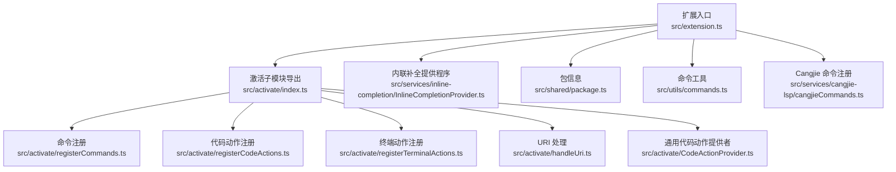
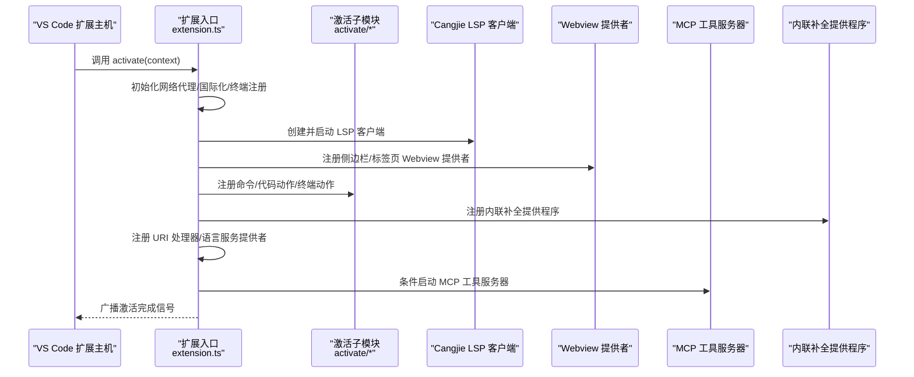
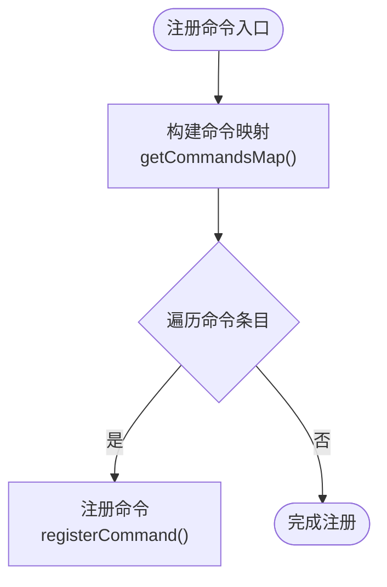
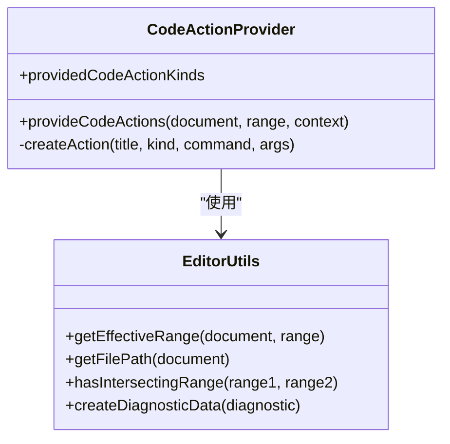
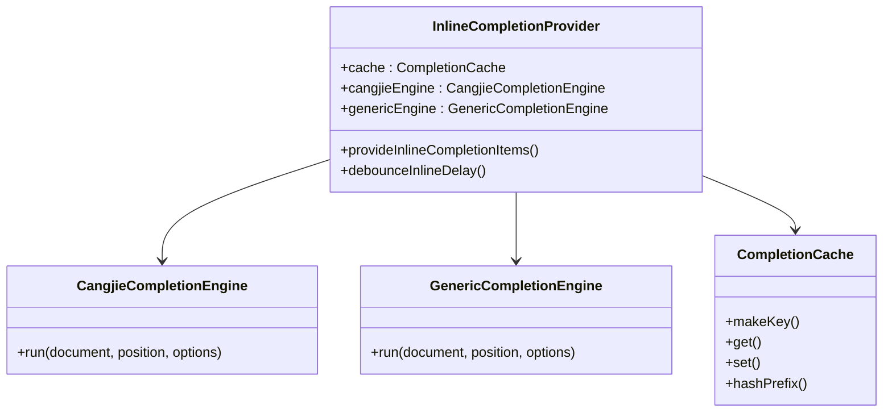
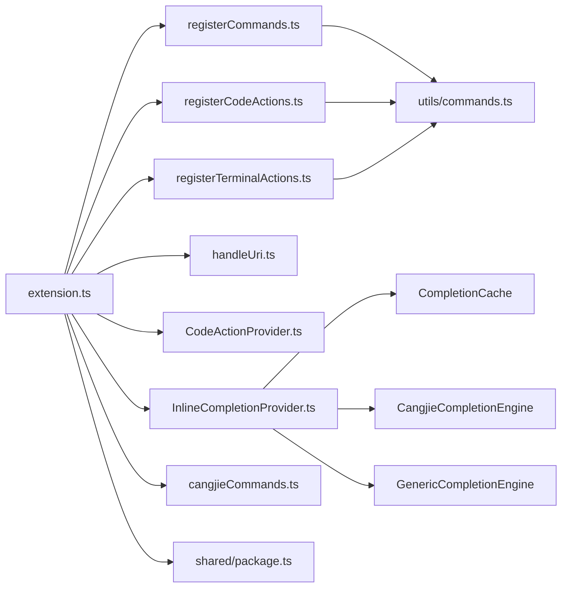

# 扩展激活机制

<cite>
**本文引用的文件**
- [extension.ts](file://src/extension.ts)
- [index.ts](file://src/activate/index.ts)
- [registerCommands.ts](file://src/activate/registerCommands.ts)
- [registerCodeActions.ts](file://src/activate/registerCodeActions.ts)
- [registerTerminalActions.ts](file://src/activate/registerTerminalActions.ts)
- [handleUri.ts](file://src/activate/handleUri.ts)
- [CodeActionProvider.ts](file://src/activate/CodeActionProvider.ts)
- [InlineCompletionProvider.ts](file://src/services/inline-completion/InlineCompletionProvider.ts)
- [commands.ts](file://src/utils/commands.ts)
- [package.ts](file://src/shared/package.ts)
- [package.json](file://package.json)
- [cangjieCommands.ts](file://src/services/cangjie-lsp/cangjieCommands.ts)
</cite>

## 更新摘要
**所做更改**
- 新增内联补全提供程序章节，详细说明内联补全激活机制
- 更新扩展激活架构图，包含内联补全提供程序
- 增强多文档方案支持说明，涵盖文件编辑、未命名文档、笔记本单元格
- 添加内联补全配置参数和命令映射说明
- 更新故障排除指南，包含内联补全相关问题

## 目录
1. [简介](#简介)
2. [项目结构](#项目结构)
3. [核心组件](#核心组件)
4. [架构总览](#架构总览)
5. [详细组件分析](#详细组件分析)
6. [内联补全提供程序](#内联补全提供程序)
7. [依赖分析](#依赖分析)
8. [性能考虑](#性能考虑)
9. [故障排除指南](#故障排除指南)
10. [结论](#结论)

## 简介
本文件系统性阐述 Njust-AI（NJUST_AI）VS Code 扩展的激活机制，覆盖扩展启动、服务初始化、事件监听、资源清理的完整流程；详解命令注册系统、代码动作提供者、URI 处理、终端动作、内联补全提供程序等核心功能；并给出激活配置参数、命令映射、快捷键绑定、代码动作配置的说明。文档同时解释与 VS Code API、其他扩展模块的交互关系，并提供可直接定位到源码位置的示例路径，帮助开发者快速定位实现细节。

## 项目结构
Njust-AI 将"激活相关逻辑"集中于 src/activate 目录，包含：
- 命令注册：registerCommands.ts
- 代码动作注册：registerCodeActions.ts
- 终端动作注册：registerTerminalActions.ts
- URI 处理：handleUri.ts
- 通用代码动作提供者：CodeActionProvider.ts
- 激活入口导出：index.ts

扩展主入口位于 src/extension.ts，负责在激活时完成环境变量加载、网络代理初始化、国际化、终端注册、LSP 客户端、Webview 提供者、聊天参与者、MCP 工具服务器、代码索引、语言服务提供者、命令与动作注册、内联补全提供程序等。

**图表来源**
- [extension.ts:95-543](file://src/extension.ts#L95-L543)
- [index.ts:1-6](file://src/activate/index.ts#L1-L6)
- [registerCommands.ts:64-71](file://src/activate/registerCommands.ts#L64-L71)
- [registerCodeActions.ts:9-14](file://src/activate/registerCodeActions.ts#L9-L14)
- [registerTerminalActions.ts:10-14](file://src/activate/registerTerminalActions.ts#L10-L14)
- [handleUri.ts:5-33](file://src/activate/handleUri.ts#L5-L33)
- [CodeActionProvider.ts:36-51](file://src/activate/CodeActionProvider.ts#L36-L51)
- [InlineCompletionProvider.ts:44-64](file://src/services/inline-completion/InlineCompletionProvider.ts#L44-L64)
- [package.ts:9-15](file://src/shared/package.ts#L9-L15)
- [commands.ts:5-9](file://src/utils/commands.ts#L5-L9)
- [cangjieCommands.ts:64-81](file://src/services/cangjie-lsp/cangjieCommands.ts#L64-L81)

**章节来源**
- [extension.ts:95-543](file://src/extension.ts#L95-L543)
- [index.ts:1-6](file://src/activate/index.ts#L1-L6)

## 核心组件
- 扩展激活与生命周期管理：负责输出通道、网络代理、国际化、全局状态、设备令牌、代码索引、LSP 客户端、Webview、聊天参与者、MCP 工具服务器、订阅管理与资源清理。
- 命令注册系统：统一通过 getCommand 生成命令 ID，批量注册扩展命令，支持面板控制、任务创建、设置导入、焦点管理、代码运行等。
- 代码动作提供者：基于 VS Code CodeActionProvider 接口，为普通文本与 Cangjie 语言提供"解释、修复、改进、添加到上下文、新建任务"等动作。
- URI 处理：注册 UriHandler，处理外部回调（如 OpenRouter、Requesty），驱动 Webview 执行相应操作。
- 终端动作：从当前终端内容或选择中提取文本，调用 ClineProvider 执行"添加到上下文、修复命令、解释命令"。
- **内联补全提供程序**：基于 VS Code InlineCompletionItemProvider 接口，支持文件编辑、未命名文档、笔记本单元格等多种文档方案，提供智能代码补全功能。

**章节来源**
- [extension.ts:95-543](file://src/extension.ts#L95-L543)
- [registerCommands.ts:64-183](file://src/activate/registerCommands.ts#L64-L183)
- [CodeActionProvider.ts:36-129](file://src/activate/CodeActionProvider.ts#L36-L129)
- [handleUri.ts:5-33](file://src/activate/handleUri.ts#L5-L33)
- [registerTerminalActions.ts:10-39](file://src/activate/registerTerminalActions.ts#L10-L39)
- [InlineCompletionProvider.ts:44-153](file://src/services/inline-completion/InlineCompletionProvider.ts#L44-L153)

## 架构总览
下图展示了扩展激活的关键流程：从激活函数开始，初始化网络代理、国际化、终端注册、LSP 客户端与状态栏、代码索引、MCP 工具服务器；随后注册命令、代码动作、语言服务提供者、URI 处理器与 Webview 提供者；最后向其他扩展广播激活完成信号。

**图表来源**
- [extension.ts:95-543](file://src/extension.ts#L95-L543)
- [index.ts:1-6](file://src/activate/index.ts#L1-L6)

## 详细组件分析

### 扩展激活与服务初始化
- 环境变量加载：优先尝试加载本地 .env，失败不阻断激活。
- 网络代理：在首次网络请求前初始化，支持 HTTP/HTTPS 流量经代理转发。
- 国际化：根据 VS Code UI 语言或用户扩展状态设置语言。
- 终端注册：初始化终端注册表，为后续终端动作提供支持。
- 全局状态：读取/写入 allowedCommands，生成/同步 Cloud Agent 设备令牌。
- 代码索引：为每个工作区文件夹初始化 CodeIndexManager（后台异步初始化，不阻塞激活）。
- LSP 客户端：延迟启动，仅在 .cj 文件激活后按需初始化格式化器、诊断器、编译守卫、状态栏。
- Webview：注册侧边栏与标签页提供者，保留上下文以提升体验。
- 聊天与 LM 工具：注册聊天参与者、状态同步、VS Code 语言模型工具。
- 语言服务提供者：为 Cangjie 语言注册定义、引用、重命名、悬停、符号、折叠、宏等能力。
- MCP 工具服务器：按配置条件启动，支持动态更新工作区路径与鉴权令牌。
- 自动重载：开发模式下监视核心 TS 文件变化，防抖后触发窗口重载。

**章节来源**
- [extension.ts:95-543](file://src/extension.ts#L95-L543)

### 命令注册系统
- 统一命令 ID 生成：通过 getCommand 以扩展名前缀拼接命令 ID。
- 批量注册：遍历命令映射，使用 context.subscriptions.push 注册命令。
- 面板与交互：支持 plusButtonClicked、popoutButtonClicked、openInNewTab、settingsButtonClicked、historyButtonClicked 等面板控制命令。
- 任务与设置：newTask 新建任务、importSettings 导入设置、focusInput/focusPanel 焦点管理、acceptInput 输入确认、toggleAutoApprove 自动批准切换。
- 运行与存储：runCode 运行编辑器代码、setCustomStoragePath 设置自定义存储路径。
- ClineProvider 集成：通过可见实例与 Webview 通信，确保 UI 行为一致。

**图表来源**
- [registerCommands.ts:64-71](file://src/activate/registerCommands.ts#L64-L71)
- [commands.ts:5-9](file://src/utils/commands.ts#L5-L9)

**章节来源**
- [registerCommands.ts:64-183](file://src/activate/registerCommands.ts#L64-L183)
- [commands.ts:5-9](file://src/utils/commands.ts#L5-L9)

### 代码动作提供者
- 通用代码动作：基于 VS Code CodeActionProvider，支持 QuickFix 与 RefactorRewrite 类别。
- 动作类型：解释、修复、改进、添加到上下文、新建任务。
- Cangjie 特定增强：当文档为 cangjie 语言时，结合诊断数据与错误模式匹配，注入针对性修复建议。
- 参数传递：支持从代码动作或命令面板两种入口传参，自动解析选区范围与诊断信息。

**图表来源**
- [CodeActionProvider.ts:36-129](file://src/activate/CodeActionProvider.ts#L36-L129)

**章节来源**
- [CodeActionProvider.ts:36-129](file://src/activate/CodeActionProvider.ts#L36-L129)

### 代码动作注册
- 注册入口：registerCodeActions 批量注册 explainCode、fixCode、improveCode、addToContext 四类动作。
- 参数解析：区分来自代码动作（带文件路径、选区、诊断）与命令面板（自动获取编辑器上下文）两种调用方式。
- 统一处理：调用 ClineProvider.handleCodeAction，透传参数至 Webview。

**章节来源**
- [registerCodeActions.ts:9-53](file://src/activate/registerCodeActions.ts#L9-L53)

### 终端动作
- 注册入口：registerTerminalActions 批量注册终端动作命令。
- 内容获取：优先使用调用参数中的 selection，否则从当前终端获取最近 N 行内容。
- 统一处理：调用 ClineProvider.handleTerminalAction，透传终端内容参数。

**章节来源**
- [registerTerminalActions.ts:10-39](file://src/activate/registerTerminalActions.ts#L10-L39)

### URI 处理
- 注册处理器：context.subscriptions.push(vscode.window.registerUriHandler({ handleUri }))。
- 处理逻辑：根据路径分发到不同回调（如 OpenRouter、Requesty），将授权码交由 Webview 处理。

**章节来源**
- [handleUri.ts:5-33](file://src/activate/handleUri.ts#L5-L33)
- [extension.ts:300-300](file://src/extension.ts#L300-L300)

### Cangjie 命令注册
- CJPM 命令：构建、运行、测试、检查、清理等常用命令，自动解析 cjpm 可执行路径与工作区根目录。
- LSP 重启：提供重启 Cangjie LSP 的便捷命令。
- 模板库：插入模板的命令，委托模板库提供者。
- 性能剖析：在 cjpm 项目中进行性能剖析并可视化结果。
- 重构：基于符号索引提供抽取函数、移动文件等重构能力。

**章节来源**
- [cangjieCommands.ts:64-141](file://src/services/cangjie-lsp/cangjieCommands.ts#L64-L141)

## 内联补全提供程序

### 激活机制与注册
内联补全提供程序通过 InlineCompletionProvider 类实现 VS Code 的 InlineCompletionItemProvider 接口，在扩展激活时注册到 VS Code 编辑器中。

**更新** 新增内联补全提供程序激活机制，支持多种文档方案

### 多文档方案支持
内联补全提供程序针对以下三种文档方案进行了专门优化：

- **文件编辑文档**：scheme: "file"，pattern: "**"，支持所有本地文件
- **未命名文档**：scheme: "untitled"，pattern: "**"，支持新建文件和临时文档
- **笔记本单元格**：scheme: "vscode-notebook-cell"，pattern: "**"，支持 Jupyter 笔记本编辑

### 核心功能特性
- **智能引擎选择**：自动识别 Cangjie 语言文件（.cj 扩展名或 cangjie 语言ID），在 Cangjie 文件中启用增强补全
- **缓存机制**：内置 CompletionCache，支持最多 20 个条目的缓存，5 分钟 TTL
- **延迟触发**：支持可配置的触发延迟（默认 300ms），避免频繁请求
- **并发控制**：使用 CancellationToken 确保请求取消和超时处理
- **详细日志**：支持详细日志记录，便于调试和性能分析

### 配置参数
内联补全功能通过以下配置参数控制：

- `inlineCompletion.enabled`：启用/禁用内联补全功能（默认：true）
- `inlineCompletion.triggerDelayMs`：触发延迟毫秒数（默认：300ms）
- `inlineCompletion.maxLines`：最大补全行数（默认：10行）
- `inlineCompletion.enableCangjieEnhanced`：启用 Cangjie 增强补全（默认：true）
- `inlineCompletion.verboseLog`：启用详细日志记录（默认：false）

### 命令映射
内联补全提供程序注册了两个实用命令：

- `njust-ai.triggerInlineCompletion`：手动触发内联补全
- `njust-ai.inlineCompletionDiagnostics`：显示内联补全诊断信息

### 实现架构

**图表来源**
- [InlineCompletionProvider.ts:44-153](file://src/services/inline-completion/InlineCompletionProvider.ts#L44-L153)

**章节来源**
- [InlineCompletionProvider.ts:44-153](file://src/services/inline-completion/InlineCompletionProvider.ts#L44-L153)
- [extension.ts:368-398](file://src/extension.ts#L368-L398)

## 依赖分析
- VS Code API 依赖：commands.registerCommand、languages.register*、window.registerWebviewViewProvider、window.registerUriHandler、workspace.onDidChangeConfiguration 等。
- 扩展内部依赖：ClineProvider、ContextProxy、TerminalRegistry、McpServerManager、CodeIndexManager、CangjieLspClient 等。
- 配置与环境：通过 Package.name 获取扩展配置，支持 allowedCommands、mcpServer.*、cloudAgent.deviceToken 等设置项。
- 命令 ID 规范：统一通过 getCommand/getCodeActionCommand/getTerminalCommand 生成，避免硬编码与冲突。
- **内联补全依赖**：依赖 ClineProvider 获取 AI API 处理器，使用 CompletionCache 进行结果缓存。

**图表来源**
- [extension.ts:95-543](file://src/extension.ts#L95-L543)
- [registerCommands.ts:64-71](file://src/activate/registerCommands.ts#L64-L71)
- [registerCodeActions.ts:9-14](file://src/activate/registerCodeActions.ts#L9-L14)
- [registerTerminalActions.ts:10-14](file://src/activate/registerTerminalActions.ts#L10-L14)
- [handleUri.ts:5-33](file://src/activate/handleUri.ts#L5-L33)
- [CodeActionProvider.ts:36-51](file://src/activate/CodeActionProvider.ts#L36-L51)
- [InlineCompletionProvider.ts:44-64](file://src/services/inline-completion/InlineCompletionProvider.ts#L44-L64)
- [cangjieCommands.ts:64-81](file://src/services/cangjie-lsp/cangjieCommands.ts#L64-L81)
- [commands.ts:5-9](file://src/utils/commands.ts#L5-L9)
- [package.ts:9-15](file://src/shared/package.ts#L9-L15)

**章节来源**
- [extension.ts:95-543](file://src/extension.ts#L95-L543)
- [package.json:1-68](file://package.json#L1-L68)

## 性能考虑
- 异步初始化：代码索引管理器与 LSP 诊断器采用后台初始化，避免阻塞激活主线程。
- 延迟启动：Cangjie LSP 客户端与相关语言服务在首次 .cj 文件激活时才初始化，减少常驻内存占用。
- 防抖重载：开发模式下对核心文件变更进行防抖处理，降低频繁重载带来的性能损耗。
- 订阅管理：所有资源均加入 context.subscriptions，确保激活失败或卸载时正确释放。
- **内联补全缓存**：使用 CompletionCache 减少重复请求，提高响应速度。
- **智能延迟**：可配置的触发延迟避免频繁 API 调用。
- **并发控制**：使用 CancellationToken 确保请求及时取消，避免资源浪费。

## 故障排除指南
- 激活失败
  - 症状：扩展未完全启用或报错。
  - 排查要点：检查输出通道日志、确认 .env 加载是否异常、网络代理配置是否有效、LSP 启动是否抛错。
  - 相关实现参考：[extension.ts:95-233](file://src/extension.ts#L95-L233)
- 命令冲突
  - 症状：命令无法执行或与其他扩展冲突。
  - 解决方案：确认命令 ID 通过 getCommand 生成且唯一，避免重复注册；检查 allowedCommands 与 deniedCommands 配置。
  - 相关实现参考：[commands.ts:5-9](file://src/utils/commands.ts#L5-L9)、[registerCommands.ts:64-71](file://src/activate/registerCommands.ts#L64-L71)
- 资源泄漏
  - 症状：内存占用持续增长、LSP 未停止、终端进程未清理。
  - 解决方案：确保在 deactivate 中调用 dispose/stop 并清理订阅；关注 context.subscriptions 的正确性。
  - 相关实现参考：[extension.ts:546-575](file://src/extension.ts#L546-L575)
- 代码动作无效
  - 症状：右键菜单无动作或动作不生效。
  - 解决方案：确认 enableCodeActions 开启、语言过滤器匹配 cangjie 或任意文件、诊断范围计算正确。
  - 相关实现参考：[CodeActionProvider.ts:53-128](file://src/activate/CodeActionProvider.ts#L53-L128)
- 终端动作无内容
  - 症状：提示"无终端内容"。
  - 解决方案：确认终端已激活且有输出；检查选择内容或默认读取策略。
  - 相关实现参考：[registerTerminalActions.ts:22-38](file://src/activate/registerTerminalActions.ts#L22-L38)
- **内联补全不工作**
  - 症状：内联补全建议不出现或无响应。
  - 排查要点：检查 editor.inlineSuggest.enabled 是否启用、inlineCompletion.enabled 是否开启、文档方案是否匹配（file/untitled/vscode-notebook-cell）、AI API 配置是否正确。
  - 解决方案：确认扩展设置中内联补全功能已启用，检查输出面板中的详细日志，验证 AI 服务连接状态。
  - 相关实现参考：[InlineCompletionProvider.ts:72-100](file://src/services/inline-completion/InlineCompletionProvider.ts#L72-L100)、[extension.ts:368-398](file://src/extension.ts#L368-L398)

**章节来源**
- [extension.ts:546-575](file://src/extension.ts#L546-L575)
- [registerCommands.ts:64-71](file://src/activate/registerCommands.ts#L64-L71)
- [CodeActionProvider.ts:53-128](file://src/activate/CodeActionProvider.ts#L53-L128)
- [registerTerminalActions.ts:22-38](file://src/activate/registerTerminalActions.ts#L22-L38)
- [InlineCompletionProvider.ts:72-100](file://src/services/inline-completion/InlineCompletionProvider.ts#L72-L100)

## 结论
Njust-AI 的扩展激活机制以 src/extension.ts 为核心，围绕"延迟初始化 + 异步后台启动 + 统一订阅管理"的设计，实现了稳定、可扩展的激活流程。通过 src/activate 下的模块化组件，扩展将命令、代码动作、终端动作、URI 处理与语言服务提供者有机整合，既满足日常开发需求，又为第三方扩展提供了良好的协作基础。

**更新** 新增的内联补全提供程序进一步增强了扩展的智能化水平，通过支持文件编辑、未命名文档、笔记本单元格等多种编辑场景，为开发者提供了无缝的代码补全体验。该功能采用智能引擎选择、缓存机制、延迟触发等技术手段，在保证性能的同时提供了高质量的 AI 辅助编程能力。

建议在二次开发中遵循统一的命令 ID 生成规范与订阅管理模式，确保扩展的健壮性与可维护性。对于新功能开发，应充分考虑多文档方案的支持和性能优化，为用户提供最佳的开发体验。