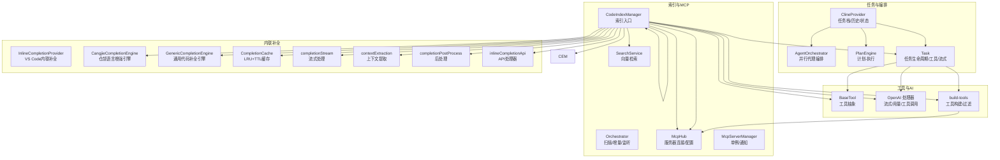
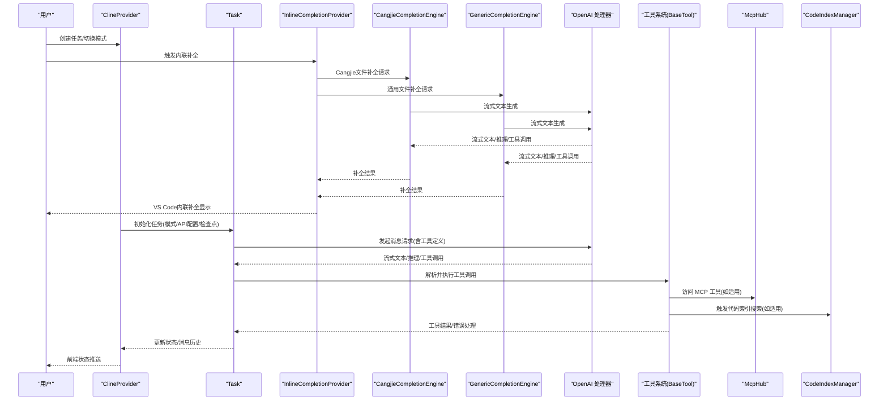
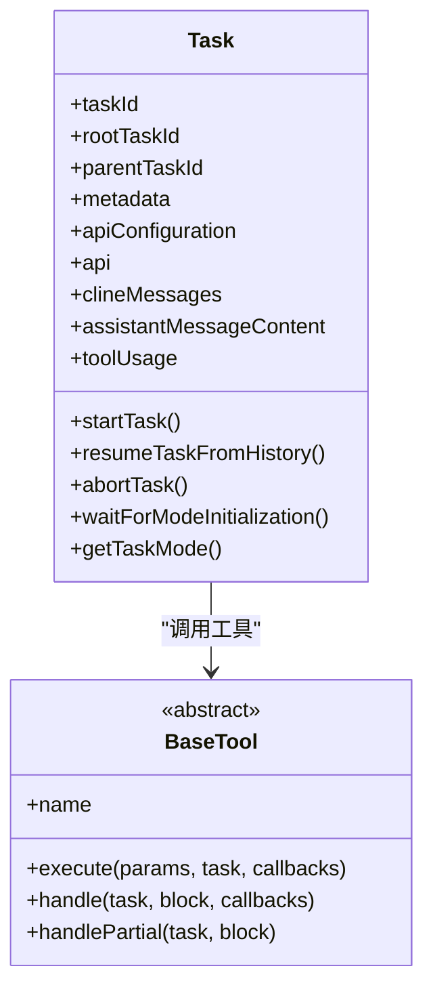
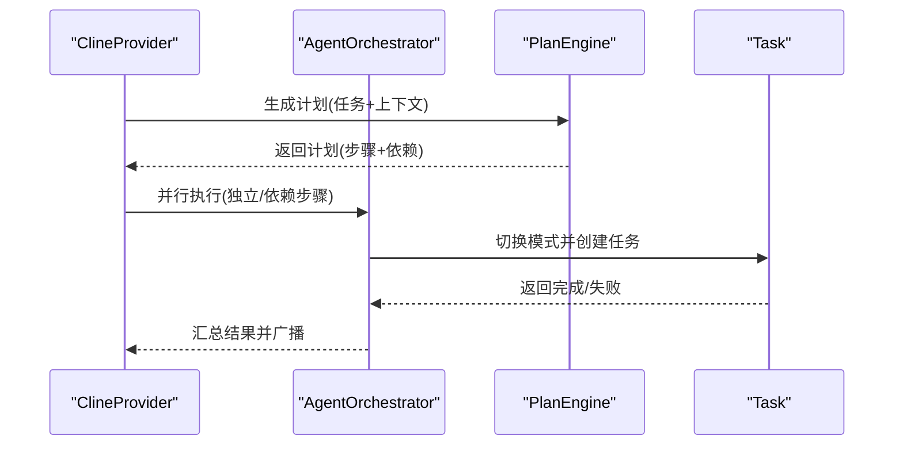
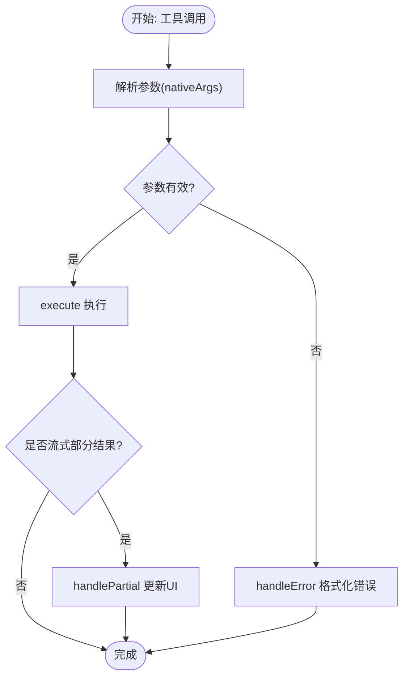
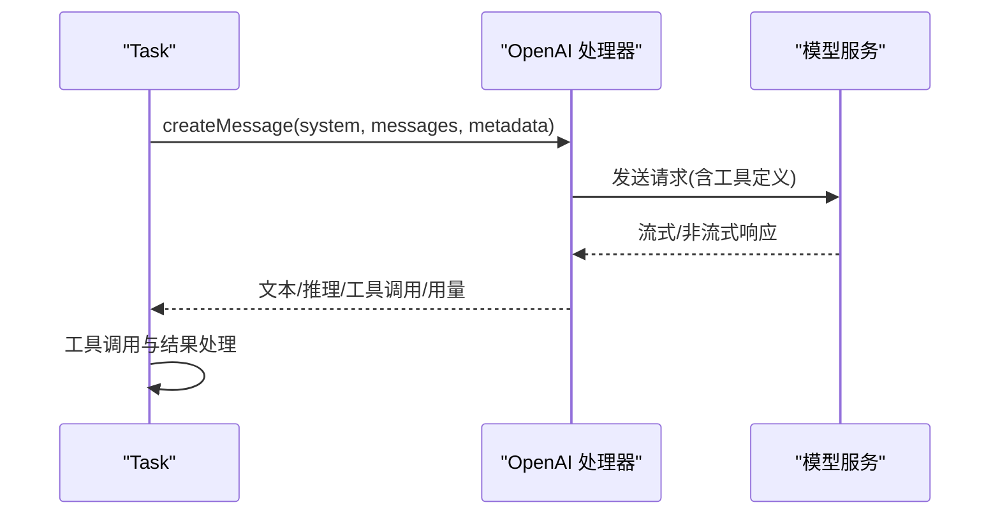
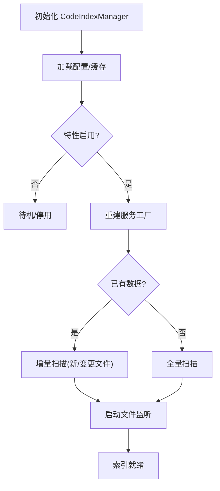
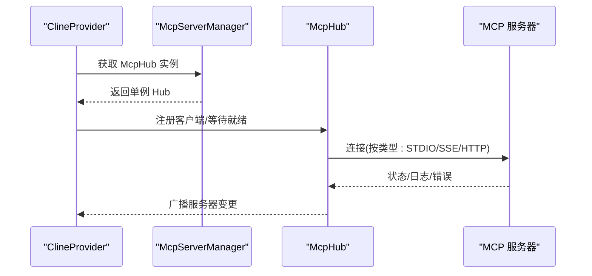
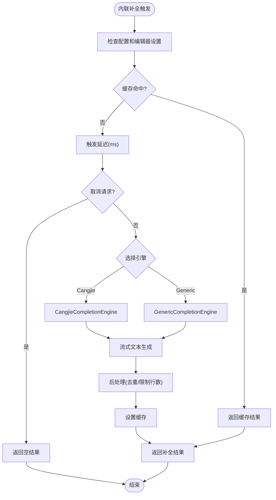
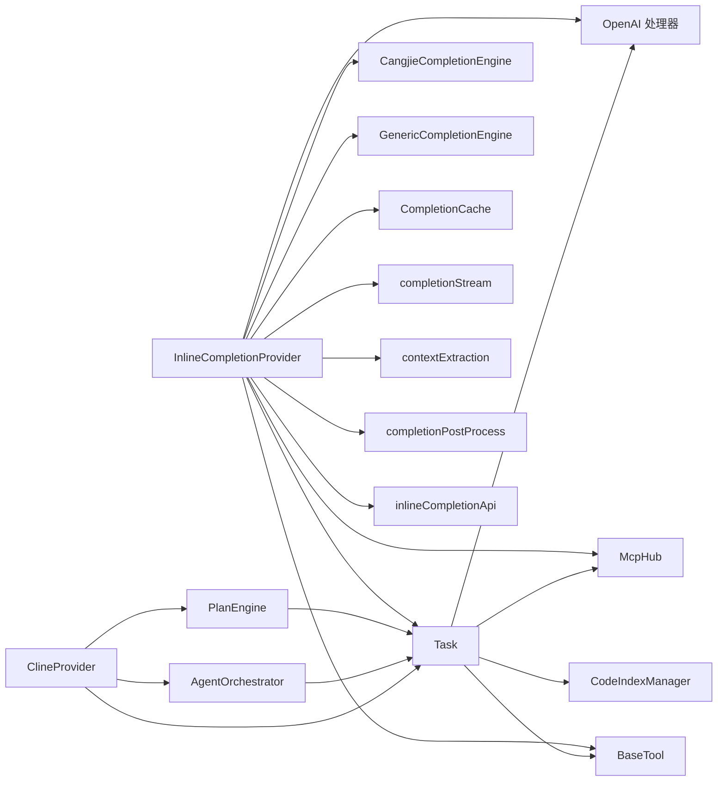

# 核心功能

<cite>
**本文引用的文件**
- [src/core/task/Task.ts](file://src/core/task/Task.ts)
- [src/core/agent/AgentOrchestrator.ts](file://src/core/agent/AgentOrchestrator.ts)
- [src/core/agent/PlanEngine.ts](file://src/core/agent/PlanEngine.ts)
- [src/core/tools/BaseTool.ts](file://src/core/tools/BaseTool.ts)
- [src/services/code-index/manager.ts](file://src/services/code-index/manager.ts)
- [src/services/code-index/orchestrator.ts](file://src/services/code-index/orchestrator.ts)
- [src/services/code-index/search-service.ts](file://src/services/code-index/search-service.ts)
- [src/services/mcp/McpHub.ts](file://src/services/mcp/McpHub.ts)
- [src/services/mcp/McpServerManager.ts](file://src/services/mcp/McpServerManager.ts)
- [src/api/providers/openai.ts](file://src/api/providers/openai.ts)
- [src/core/webview/ClineProvider.ts](file://src/core/webview/ClineProvider.ts)
- [src/core/task/build-tools.ts](file://src/core/task/build-tools.ts)
- [src/services/inline-completion/InlineCompletionProvider.ts](file://src/services/inline-completion/InlineCompletionProvider.ts)
- [src/services/inline-completion/CangjieCompletionEngine.ts](file://src/services/inline-completion/CangjieCompletionEngine.ts)
- [src/services/inline-completion/GenericCompletionEngine.ts](file://src/services/inline-completion/GenericCompletionEngine.ts)
- [src/services/inline-completion/CompletionCache.ts](file://src/services/inline-completion/CompletionCache.ts)
- [src/services/inline-completion/completionStream.ts](file://src/services/inline-completion/completionStream.ts)
- [src/services/inline-completion/contextExtraction.ts](file://src/services/inline-completion/contextExtraction.ts)
- [src/services/inline-completion/completionPostProcess.ts](file://src/services/inline-completion/completionPostProcess.ts)
- [src/services/inline-completion/inlineCompletionApi.ts](file://src/services/inline-completion/inlineCompletionApi.ts)
- [src/package.json](file://src/package.json)
</cite>

## 更新摘要
**所做更改**
- 新增内联代码补全系统作为核心功能模块的详细分析
- 添加内联补全引擎、缓存机制、流式处理等组件的技术规范
- 更新架构图以反映内联补全系统的集成
- 增加配置选项、参数说明和使用模式
- 添加故障排查指南中关于内联补全的问题诊断

## 目录
1. [简介](#简介)
2. [项目结构](#项目结构)
3. [核心组件](#核心组件)
4. [架构总览](#架构总览)
5. [详细组件分析](#详细组件分析)
6. [依赖分析](#依赖分析)
7. [性能考虑](#性能考虑)
8. [故障排查指南](#故障排查指南)
9. [结论](#结论)

## 简介
本文件面向 Njust-AI 的核心功能模块，系统化梳理任务管理系统、AI 模型集成、代理编排系统、工具系统、代码索引系统、MCP 协议支持以及**新增的内联代码补全系统**等关键子系统。文档以"从代码到架构"的方式，逐层解释各模块的职责、数据流、调用关系、配置项与返回值，并提供可视化图示与排障建议，兼顾初学者可读性与资深开发者的深度需求。

**更新** 新增内联代码补全系统，这是一个重大的新功能添加，包含了完整的补全引擎、缓存机制、流式处理等组件，显著增强了编辑器的智能代码补全能力。

## 项目结构
Njust-AI 的核心能力由以下层次构成：
- 任务层：Task 负责单次对话任务的生命周期管理、上下文与消息持久化、工具调用与结果处理、检查点与流式输出控制等。
- 编排层：ClineProvider 提供任务栈、历史管理、全局状态、MCP Hub 与技能管理接入；AgentOrchestrator 支持多 Agent 并行执行；PlanEngine 提供计划-执行范式。
- 工具层：BaseTool 抽象出统一的工具执行模型，结合工具过滤与 MCP 工具动态注入。
- AI 集成层：OpenAI 兼容处理器封装流式/非流式请求、工具调用、用量统计与错误处理。
- 代码索引层：CodeIndexManager 统一入口，Orchestrator 协调扫描/增量索引与文件监听，SearchService 执行向量检索。
- MCP 层：McpHub/McpServerManager 管理 MCP 服务器连接、配置热更新与跨视图广播。
- **内联补全层**：InlineCompletionProvider 提供 VS Code 内联补全支持，包含 CangjieCompletionEngine 和 GenericCompletionEngine 两种引擎，以及完整的缓存和流式处理机制。

**图表来源**
- [src/core/webview/ClineProvider.ts:126-312](file://src/core/webview/ClineProvider.ts#L126-L312)
- [src/core/agent/AgentOrchestrator.ts:39-96](file://src/core/agent/AgentOrchestrator.ts#L39-L96)
- [src/core/agent/PlanEngine.ts:44-111](file://src/core/agent/PlanEngine.ts#L44-L111)
- [src/core/task/Task.ts:176-587](file://src/core/task/Task.ts#L176-L587)
- [src/core/tools/BaseTool.ts:30-167](file://src/core/tools/BaseTool.ts#L30-L167)
- [src/api/providers/openai.ts:31-270](file://src/api/providers/openai.ts#L31-L270)
- [src/core/task/build-tools.ts:83-177](file://src/core/task/build-tools.ts#L83-L177)
- [src/services/code-index/manager.ts:18-155](file://src/services/code-index/manager.ts#L18-L155)
- [src/services/code-index/orchestrator.ts:14-91](file://src/services/code-index/orchestrator.ts#L14-L91)
- [src/services/code-index/search-service.ts:11-65](file://src/services/code-index/search-service.ts#L11-L65)
- [src/services/mcp/McpHub.ts:151-184](file://src/services/mcp/McpHub.ts#L151-L184)
- [src/services/mcp/McpServerManager.ts:9-54](file://src/services/mcp/McpServerManager.ts#L9-L54)
- [src/services/inline-completion/InlineCompletionProvider.ts:44-154](file://src/services/inline-completion/InlineCompletionProvider.ts#L44-L154)
- [src/services/inline-completion/CangjieCompletionEngine.ts:33-120](file://src/services/inline-completion/CangjieCompletionEngine.ts#L33-L120)
- [src/services/inline-completion/GenericCompletionEngine.ts:16-70](file://src/services/inline-completion/GenericCompletionEngine.ts#L16-L70)
- [src/services/inline-completion/CompletionCache.ts:19-55](file://src/services/inline-completion/CompletionCache.ts#L19-L55)

**章节来源**
- [src/core/webview/ClineProvider.ts:126-312](file://src/core/webview/ClineProvider.ts#L126-L312)
- [src/core/agent/AgentOrchestrator.ts:39-96](file://src/core/agent/AgentOrchestrator.ts#L39-L96)
- [src/core/agent/PlanEngine.ts:44-111](file://src/core/agent/PlanEngine.ts#L44-L111)
- [src/core/task/Task.ts:176-587](file://src/core/task/Task.ts#L176-L587)
- [src/core/tools/BaseTool.ts:30-167](file://src/core/tools/BaseTool.ts#L30-L167)
- [src/api/providers/openai.ts:31-270](file://src/api/providers/openai.ts#L31-L270)
- [src/core/task/build-tools.ts:83-177](file://src/core/task/build-tools.ts#L83-L177)
- [src/services/code-index/manager.ts:18-155](file://src/services/code-index/manager.ts#L18-L155)
- [src/services/code-index/orchestrator.ts:14-91](file://src/services/code-index/orchestrator.ts#L14-L91)
- [src/services/code-index/search-service.ts:11-65](file://src/services/code-index/search-service.ts#L11-L65)
- [src/services/mcp/McpHub.ts:151-184](file://src/services/mcp/McpHub.ts#L151-L184)
- [src/services/mcp/McpServerManager.ts:9-54](file://src/services/mcp/McpServerManager.ts#L9-L54)
- [src/services/inline-completion/InlineCompletionProvider.ts:44-154](file://src/services/inline-completion/InlineCompletionProvider.ts#L44-L154)
- [src/services/inline-completion/CangjieCompletionEngine.ts:33-120](file://src/services/inline-completion/CangjieCompletionEngine.ts#L33-L120)
- [src/services/inline-completion/GenericCompletionEngine.ts:16-70](file://src/services/inline-completion/GenericCompletionEngine.ts#L16-L70)
- [src/services/inline-completion/CompletionCache.ts:19-55](file://src/services/inline-completion/CompletionCache.ts#L19-L55)

## 核心组件
- 任务管理系统（Task）
  - 职责：维护任务元数据、模式与 API 配置、消息历史、工具使用计数、流式输出与断点恢复、队列与并发控制、自动审批与上下文压缩。
  - 关键点：构造时校验检查点超时范围、异步初始化任务模式与 API 配置名、提供等待初始化的同步访问器、流式工具调用去重与顺序一致性保障。
- 代理编排系统（ClineProvider + AgentOrchestrator + PlanEngine）
  - 职责：任务栈管理、历史持久化、MCP Hub 与技能管理接入；并行代理执行与共享上下文；计划-执行范式（PlanEngine）。
  - 关键点：单例 MCP Hub 管理、Provider 事件转发至前端、并行任务批处理与依赖调度、计划步骤依赖链与失败传播。
- 工具系统（BaseTool + build-tools）
  - 职责：统一工具抽象、参数解析与错误处理、部分结果流式展示、工具过滤与 MCP 动态注入。
  - 关键点：原生工具调用参数类型安全、XML 工具调用弃用提示、工具别名解析与允许函数名限制。
- AI 模型集成（OpenAI 处理器）
  - 职责：兼容 OpenAI 协议、Azure/OpenRouter/Azure AI Inference 等变体、流式/非流式响应、工具调用与用量统计、错误映射。
  - 关键点：o1/o3 家族特殊路径、prompt cache 控制、reasoning 内容透传、工具调用分片与结束事件。
- 代码索引系统（CodeIndexManager + Orchestrator + SearchService）
  - 职责：工作区扫描与增量索引、文件监听、向量检索、缓存与错误恢复。
  - 关键点：服务工厂重建、错误状态清理与缓存策略、增量扫描与全量扫描切换。
- MCP 协议支持（McpHub + McpServerManager）
  - 职责：服务器配置校验与连接、文件变更监听与热更新、全局/项目级优先级、跨视图状态广播。
  - 关键点：配置模式校验、占位连接与禁用原因、STDIO/SSE/HTTP 传输适配、引用计数与延迟释放。
- **内联代码补全系统（InlineCompletionProvider + 引擎 + 缓存）**
  - 职责：提供 VS Code 内联补全支持，包含 CangjieCompletionEngine 和 GenericCompletionEngine 两种引擎，以及完整的缓存和流式处理机制。
  - 关键点：支持 Cangjie 语言增强和通用代码补全、LRU+TTL 缓存、流式文本生成、上下文提取与后处理、取消令牌支持。

**章节来源**
- [src/core/task/Task.ts:155-587](file://src/core/task/Task.ts#L155-L587)
- [src/core/webview/ClineProvider.ts:126-312](file://src/core/webview/ClineProvider.ts#L126-L312)
- [src/core/agent/AgentOrchestrator.ts:39-96](file://src/core/agent/AgentOrchestrator.ts#L39-L96)
- [src/core/agent/PlanEngine.ts:44-111](file://src/core/agent/PlanEngine.ts#L44-L111)
- [src/core/tools/BaseTool.ts:30-167](file://src/core/tools/BaseTool.ts#L30-L167)
- [src/core/task/build-tools.ts:83-177](file://src/core/task/build-tools.ts#L83-L177)
- [src/api/providers/openai.ts:31-270](file://src/api/providers/openai.ts#L31-L270)
- [src/services/code-index/manager.ts:18-155](file://src/services/code-index/manager.ts#L18-L155)
- [src/services/code-index/orchestrator.ts:14-91](file://src/services/code-index/orchestrator.ts#L14-L91)
- [src/services/code-index/search-service.ts:11-65](file://src/services/code-index/search-service.ts#L11-L65)
- [src/services/mcp/McpHub.ts:151-184](file://src/services/mcp/McpHub.ts#L151-L184)
- [src/services/mcp/McpServerManager.ts:9-54](file://src/services/mcp/McpServerManager.ts#L9-L54)
- [src/services/inline-completion/InlineCompletionProvider.ts:44-154](file://src/services/inline-completion/InlineCompletionProvider.ts#L44-L154)
- [src/services/inline-completion/CangjieCompletionEngine.ts:33-120](file://src/services/inline-completion/CangjieCompletionEngine.ts#L33-L120)
- [src/services/inline-completion/GenericCompletionEngine.ts:16-70](file://src/services/inline-completion/GenericCompletionEngine.ts#L16-L70)
- [src/services/inline-completion/CompletionCache.ts:19-55](file://src/services/inline-completion/CompletionCache.ts#L19-L55)

## 架构总览
下图展示从用户输入到工具执行与结果回传的关键流程，以及与 AI 与索引系统的交互，**新增内联补全系统的集成**。

**图表来源**
- [src/core/webview/ClineProvider.ts:126-312](file://src/core/webview/ClineProvider.ts#L126-L312)
- [src/core/task/Task.ts:176-587](file://src/core/task/Task.ts#L176-L587)
- [src/services/inline-completion/InlineCompletionProvider.ts:66-154](file://src/services/inline-completion/InlineCompletionProvider.ts#L66-L154)
- [src/services/inline-completion/CangjieCompletionEngine.ts:40-120](file://src/services/inline-completion/CangjieCompletionEngine.ts#L40-L120)
- [src/services/inline-completion/GenericCompletionEngine.ts:22-70](file://src/services/inline-completion/GenericCompletionEngine.ts#L22-L70)
- [src/api/providers/openai.ts:82-270](file://src/api/providers/openai.ts#L82-L270)
- [src/core/tools/BaseTool.ts:114-167](file://src/core/tools/BaseTool.ts#L114-L167)
- [src/services/mcp/McpHub.ts:656-800](file://src/services/mcp/McpHub.ts#L656-L800)
- [src/services/code-index/manager.ts:336-342](file://src/services/code-index/manager.ts#L336-L342)

## 详细组件分析

### 任务管理系统（Task）
- 生命周期与状态
  - 构造阶段：校验检查点超时范围、初始化模式与 API 配置名（异步）、设置消息队列与事件监听。
  - 运行阶段：流式输出控制、工具调用去重、连续错误计数与阈值控制、上下文压缩与历史合并。
  - 结束阶段：保存历史、触发断点、清理资源。
- 关键接口与行为
  - 异步模式与配置初始化：提供等待初始化的 Promise 与同步访问器，避免竞态。
  - 工具调用：pushToolResultToUserContent 防重复；handlePartial 支持流式 UI 更新；handle 主流程串联参数解析与执行。
  - 流式控制：assistantMessageSavedToHistory 保证工具结果在助手消息之后写入，避免 API 错误。
- 配置与参数
  - enableCheckpoints、checkpointTimeout、consecutiveMistakeLimit、initialStatus 等。
- 返回值与事件
  - 通过 NJUST_AIEventName 系列事件对外广播状态变化，前端据此更新 UI。

**图表来源**
- [src/core/task/Task.ts:176-587](file://src/core/task/Task.ts#L176-L587)
- [src/core/tools/BaseTool.ts:30-167](file://src/core/tools/BaseTool.ts#L30-L167)

**章节来源**
- [src/core/task/Task.ts:155-587](file://src/core/task/Task.ts#L155-L587)
- [src/core/tools/BaseTool.ts:114-167](file://src/core/tools/BaseTool.ts#L114-L167)

### 代理编排系统（ClineProvider + AgentOrchestrator + PlanEngine）
- ClineProvider
  - 任务栈管理：addClineToStack/removeClineFromStack，委托修复与历史持久化。
  - 全局状态与事件：getState、事件转发至前端、MCP Hub 注册与清理。
- AgentOrchestrator
  - 并行任务：按依赖拆分为独立批次，批量执行并聚合结果；超时与失败处理。
  - 共享上下文：构建共享上下文提示，汇总其他代理修改文件与结果。
- PlanEngine
  - 计划生成：基于 LLM 的 JSON 计划；步骤依赖与模式选择。
  - 执行引擎：批量运行就绪步骤，失败传播与暂停/恢复。

**图表来源**
- [src/core/webview/ClineProvider.ts:126-312](file://src/core/webview/ClineProvider.ts#L126-L312)
- [src/core/agent/AgentOrchestrator.ts:61-96](file://src/core/agent/AgentOrchestrator.ts#L61-L96)
- [src/core/agent/PlanEngine.ts:69-111](file://src/core/agent/PlanEngine.ts#L69-L111)

**章节来源**
- [src/core/webview/ClineProvider.ts:126-312](file://src/core/webview/ClineProvider.ts#L126-L312)
- [src/core/agent/AgentOrchestrator.ts:39-96](file://src/core/agent/AgentOrchestrator.ts#L39-L96)
- [src/core/agent/PlanEngine.ts:44-111](file://src/core/agent/PlanEngine.ts#L44-L111)

### 工具系统（BaseTool + build-tools）
- BaseTool
  - 参数类型安全：根据 ToolName 推导参数类型；仅支持 nativeArgs，XML 工具调用已弃用。
  - 流式处理：handlePartial 支持流式 UI 更新；hasPathStabilized 防止半解析路径截断。
  - 错误处理：AskIgnoredError 特殊处理；回调 handleError 自动格式化错误结果。
- build-tools
  - 工具构建：组合原生工具、MCP 工具与自定义工具；按模式过滤与别名解析。
  - 限制模式：支持返回全部工具定义但提供 allowedFunctionNames，用于 Gemini 等受限调用场景。

**图表来源**
- [src/core/tools/BaseTool.ts:114-167](file://src/core/tools/BaseTool.ts#L114-L167)
- [src/core/task/build-tools.ts:83-177](file://src/core/task/build-tools.ts#L83-L177)

**章节来源**
- [src/core/tools/BaseTool.ts:30-167](file://src/core/tools/BaseTool.ts#L30-L167)
- [src/core/task/build-tools.ts:83-177](file://src/core/task/build-tools.ts#L83-L177)

### AI 模型集成（OpenAI 处理器）
- 请求形态
  - 流式：逐块产出文本/推理/工具调用片段；支持工具调用结束事件。
  - 非流式：一次性返回完整内容与用量。
- 特殊模型
  - o1/o3 家族：使用专用路径与 reasoning_effort；不支持旧版 max_tokens，改用 max_completion_tokens。
- 工具调用
  - 自动转换消息格式；支持 parallel_tool_calls；用量统计与缓存控制。
- 错误处理
  - 统一错误映射与重试策略；Azure/Azure AI Inference 路径差异处理。

**图表来源**
- [src/api/providers/openai.ts:82-270](file://src/api/providers/openai.ts#L82-L270)
- [src/core/task/Task.ts:176-587](file://src/core/task/Task.ts#L176-L587)

**章节来源**
- [src/api/providers/openai.ts:31-270](file://src/api/providers/openai.ts#L31-L270)

### 代码索引系统（CodeIndexManager + Orchestrator + SearchService）
- CodeIndexManager
  - 单例模式：按工作区路径实例化；工作区启用/自动启用开关；错误恢复与服务重建。
  - 初始化：加载配置、缓存管理、服务工厂重建、启动索引或重启。
- Orchestrator
  - 全量/增量扫描：根据向量库已有数据决定扫描策略；标记索引完成/未完成；文件监听与批处理进度上报。
  - 错误处理：连接失败保留缓存；部分失败清理缓存；停止索引与清理集合。
- SearchService
  - 查询嵌入生成与向量检索；目录前缀过滤；状态检查与错误上报。

**图表来源**
- [src/services/code-index/manager.ts:162-214](file://src/services/code-index/manager.ts#L162-L214)
- [src/services/code-index/orchestrator.ts:92-333](file://src/services/code-index/orchestrator.ts#L92-L333)
- [src/services/code-index/search-service.ts:27-64](file://src/services/code-index/search-service.ts#L27-L64)

**章节来源**
- [src/services/code-index/manager.ts:18-155](file://src/services/code-index/manager.ts#L18-L155)
- [src/services/code-index/orchestrator.ts:14-91](file://src/services/code-index/orchestrator.ts#L14-L91)
- [src/services/code-index/search-service.ts:11-65](file://src/services/code-index/search-service.ts#L11-L65)

### MCP 协议支持（McpHub + McpServerManager）
- 配置与连接
  - 支持 STDIO/SSE/Streamable-HTTP 三种传输；字段校验与混合字段保护；禁用/超时/监控路径等通用配置。
  - 全局/项目级配置优先级；文件变更监听与防抖更新；占位连接与禁用原因标注。
- 单例管理
  - McpServerManager 提供线程安全的单例获取与引用计数；跨视图状态广播；清理与实例回收。
- 运行时
  - 连接建立、错误捕获与状态上报；stderr 日志分级处理；断开与重连策略。

**图表来源**
- [src/services/mcp/McpServerManager.ts:20-54](file://src/services/mcp/McpServerManager.ts#L20-L54)
- [src/services/mcp/McpHub.ts:151-184](file://src/services/mcp/McpHub.ts#L151-L184)
- [src/services/mcp/McpHub.ts:656-800](file://src/services/mcp/McpHub.ts#L656-L800)

**章节来源**
- [src/services/mcp/McpServerManager.ts:9-54](file://src/services/mcp/McpServerManager.ts#L9-L54)
- [src/services/mcp/McpHub.ts:151-184](file://src/services/mcp/McpHub.ts#L151-L184)

### 内联代码补全系统（InlineCompletionProvider + 引擎 + 缓存）
- InlineCompletionProvider
  - VS Code 内联补全提供者：实现 vscode.InlineCompletionItemProvider 接口，支持自动触发和手动触发。
  - 配置管理：支持 inlineCompletion.enabled、inlineCompletion.triggerDelayMs、inlineCompletion.maxLines 等配置。
  - 缓存机制：使用 CompletionCache 实现 LRU+TTL 缓存，提高补全性能。
  - 引擎选择：根据文件类型自动选择 CangjieCompletionEngine 或 GenericCompletionEngine。
- CangjieCompletionEngine
  - 仓颉语言增强：专门针对 Cangjie 语言的补全引擎，支持语法高亮和语言特性。
  - 上下文提取：提取当前行前后文、标识符、项目引用等上下文信息。
  - Grep 搜索：集成 ripgrep 进行项目和语料库搜索，提供丰富的参考信息。
- GenericCompletionEngine
  - 通用代码补全：支持所有编程语言的通用补全功能。
  - 上下文处理：提取代码上下文，提供准确的补全建议。
  - 流式生成：使用 streamCompletionText 进行流式文本生成。
- CompletionCache
  - LRU+TTL 缓存：实现最近最少使用和生存时间双重缓存策略。
  - 键值设计：基于文件路径、行号、字符位置、前缀哈希和引擎类型生成缓存键。
  - 性能优化：限制缓存大小和过期时间，平衡内存使用和命中率。
- completionStream
  - 流式处理：从 API 流中收集纯文本，支持取消令牌。
  - 错误处理：处理流中的错误事件，提供优雅的错误恢复。
  - 回退机制：当主要文本为空时，使用 reasoning 通道的内容作为回退。
- contextExtraction
  - 上下文提取：提取当前行前后文，支持最大行数和字符限制。
  - 标识符提取：提取光标前的标识符，用于 Grep 搜索。
  - 正则转义：对搜索模式进行正则表达式转义，确保安全搜索。
- completionPostProcess
  - 文本后处理：去除 Markdown 代码块包装、限制最大行数等。
  - 重复检测：检测并移除重复的前缀和后缀。
  - 标记清理：移除插入标记，确保最终文本的纯净性。
- inlineCompletionApi
  - API 解析：优先使用当前任务的 API 处理器，否则从配置文件构建。
  - 错误处理：处理 API 配置缺失的情况，提供友好的错误提示。

**图表来源**
- [src/services/inline-completion/InlineCompletionProvider.ts:66-154](file://src/services/inline-completion/InlineCompletionProvider.ts#L66-L154)
- [src/services/inline-completion/CangjieCompletionEngine.ts:40-120](file://src/services/inline-completion/CangjieCompletionEngine.ts#L40-L120)
- [src/services/inline-completion/GenericCompletionEngine.ts:22-70](file://src/services/inline-completion/GenericCompletionEngine.ts#L22-L70)
- [src/services/inline-completion/CompletionCache.ts:35-55](file://src/services/inline-completion/CompletionCache.ts#L35-L55)
- [src/services/inline-completion/completionStream.ts:10-50](file://src/services/inline-completion/completionStream.ts#L10-L50)
- [src/services/inline-completion/completionPostProcess.ts:77-98](file://src/services/inline-completion/completionPostProcess.ts#L77-L98)

**章节来源**
- [src/services/inline-completion/InlineCompletionProvider.ts:44-154](file://src/services/inline-completion/InlineCompletionProvider.ts#L44-L154)
- [src/services/inline-completion/CangjieCompletionEngine.ts:33-120](file://src/services/inline-completion/CangjieCompletionEngine.ts#L33-L120)
- [src/services/inline-completion/GenericCompletionEngine.ts:16-70](file://src/services/inline-completion/GenericCompletionEngine.ts#L16-L70)
- [src/services/inline-completion/CompletionCache.ts:19-55](file://src/services/inline-completion/CompletionCache.ts#L19-L55)
- [src/services/inline-completion/completionStream.ts:1-50](file://src/services/inline-completion/completionStream.ts#L1-L50)
- [src/services/inline-completion/contextExtraction.ts:1-62](file://src/services/inline-completion/contextExtraction.ts#L1-L62)
- [src/services/inline-completion/completionPostProcess.ts:1-116](file://src/services/inline-completion/completionPostProcess.ts#L1-L116)
- [src/services/inline-completion/inlineCompletionApi.ts:1-37](file://src/services/inline-completion/inlineCompletionApi.ts#L1-L37)

## 依赖分析
- 组件耦合
  - Task 依赖 ApiHandler、工具系统、MCP Hub、代码索引管理器、检查点服务等。
  - ClineProvider 作为中枢，协调 Task、AgentOrchestrator、PlanEngine、McpHub、SkillsManager。
  - OpenAI 处理器与工具系统解耦，通过统一消息格式对接。
  - **InlineCompletionProvider 依赖 ClineProvider、CangjieCompletionEngine、GenericCompletionEngine、CompletionCache、completionStream 等组件**。
- 外部依赖
  - MCP SDK、向量存储（Qdrant）、VSCode API、文件系统监听、网络请求（Axios）、ripgrep 搜索工具。
- 循环依赖
  - 通过单例管理（McpServerManager）与延迟导入（CodeIndexManager）规避循环引用风险。
  - **内联补全系统通过模块化设计避免循环依赖，各组件职责清晰分离**。

**图表来源**
- [src/core/task/Task.ts:176-587](file://src/core/task/Task.ts#L176-L587)
- [src/core/webview/ClineProvider.ts:126-312](file://src/core/webview/ClineProvider.ts#L126-L312)
- [src/core/agent/AgentOrchestrator.ts:39-96](file://src/core/agent/AgentOrchestrator.ts#L39-L96)
- [src/core/agent/PlanEngine.ts:44-111](file://src/core/agent/PlanEngine.ts#L44-L111)
- [src/api/providers/openai.ts:31-270](file://src/api/providers/openai.ts#L31-L270)
- [src/core/tools/BaseTool.ts:30-167](file://src/core/tools/BaseTool.ts#L30-L167)
- [src/services/mcp/McpHub.ts:151-184](file://src/services/mcp/McpHub.ts#L151-L184)
- [src/services/code-index/manager.ts:18-155](file://src/services/code-index/manager.ts#L18-L155)
- [src/services/inline-completion/InlineCompletionProvider.ts:44-154](file://src/services/inline-completion/InlineCompletionProvider.ts#L44-L154)
- [src/services/inline-completion/CangjieCompletionEngine.ts:33-120](file://src/services/inline-completion/CangjieCompletionEngine.ts#L33-L120)
- [src/services/inline-completion/GenericCompletionEngine.ts:16-70](file://src/services/inline-completion/GenericCompletionEngine.ts#L16-L70)
- [src/services/inline-completion/CompletionCache.ts:19-55](file://src/services/inline-completion/CompletionCache.ts#L19-L55)

**章节来源**
- [src/core/task/Task.ts:176-587](file://src/core/task/Task.ts#L176-L587)
- [src/core/webview/ClineProvider.ts:126-312](file://src/core/webview/ClineProvider.ts#L126-L312)
- [src/core/agent/AgentOrchestrator.ts:39-96](file://src/core/agent/AgentOrchestrator.ts#L39-L96)
- [src/core/agent/PlanEngine.ts:44-111](file://src/core/agent/PlanEngine.ts#L44-L111)
- [src/api/providers/openai.ts:31-270](file://src/api/providers/openai.ts#L31-L270)
- [src/core/tools/BaseTool.ts:30-167](file://src/core/tools/BaseTool.ts#L30-L167)
- [src/services/mcp/McpHub.ts:151-184](file://src/services/mcp/McpHub.ts#L151-L184)
- [src/services/code-index/manager.ts:18-155](file://src/services/code-index/manager.ts#L18-L155)
- [src/services/inline-completion/InlineCompletionProvider.ts:44-154](file://src/services/inline-completion/InlineCompletionProvider.ts#L44-L154)

## 性能考虑
- 流式处理
  - 任务侧使用 debounce 控制令牌用量事件频率，避免频繁 UI 更新。
  - 工具侧 handlePartial 分段渲染，提升交互体验。
  - **内联补全使用流式文本生成，支持实时显示补全结果，提升用户体验**。
- 索引性能
  - 增量扫描跳过未变更文件，结合缓存减少重复计算。
  - 批量处理与进度上报，降低 UI 卡顿。
- MCP 连接
  - 引用计数与延迟释放，避免频繁启停；文件变更防抖更新，减少不必要的重启。
- 模型调用
  - prompt cache 与工具调用并行策略，合理设置温度与最大输出，平衡质量与成本。
- **内联补全性能优化**
  - **LRU+TTL 缓存机制：限制缓存大小为 20 个条目，TTL 为 5 分钟，平衡内存使用和命中率**。
  - **触发延迟：默认 300ms，支持 100-2000ms 调整，避免频繁触发影响性能**。
  - **最大行数限制：默认 10 行，最多 50 行，防止过长补全影响编辑器性能**。
  - **引擎选择优化：Cangjie 文件自动启用增强引擎，通用文件使用通用引擎，提高补全准确性**。

## 故障排查指南
- 任务初始化失败
  - 检查 checkpointTimeout 是否在允许范围内；确认模式与 API 配置初始化是否成功。
  - 参考：[src/core/task/Task.ts:457-469](file://src/core/task/Task.ts#L457-L469)
- 工具调用异常
  - 若出现 XML 工具调用错误，需迁移到 nativeArgs；关注 AskIgnoredError 的处理分支。
  - 参考：[src/core/tools/BaseTool.ts:132-161](file://src/core/tools/BaseTool.ts#L132-L161)
- MCP 连接问题
  - 检查配置字段类型与混合字段冲突；查看 stderr 日志中的 INFO/ERROR 区分；确认占位连接与禁用原因。
  - 参考：[src/services/mcp/McpHub.ts:216-274](file://src/services/mcp/McpHub.ts#L216-L274)
- 索引失败
  - 若连接 Qdrant 失败，会清理缓存并提示错误；若部分失败率过高，需检查网络与磁盘空间。
  - 参考：[src/services/code-index/orchestrator.ts:297-332](file://src/services/code-index/orchestrator.ts#L297-L332)
- AI 请求错误
  - 使用 handleOpenAIError 映射错误；Azure/Azure AI Inference 路径差异需正确设置 baseURL 与路径。
  - 参考：[src/api/providers/openai.ts:176-178](file://src/api/providers/openai.ts#L176-L178)
- **内联补全问题排查**
  - **补全不显示：检查 editor.inlineSuggest.enabled 和 njust-ai.inlineCompletion.enabled 配置**。
  - **补全延迟：调整 njust-ai.inlineCompletion.triggerDelayMs 配置，范围 100-2000ms**。
  - **补全过多/过少：调整 njust-ai.inlineCompletion.maxLines 配置，范围 1-50**。
  - **Cangjie 文件补全异常：检查 njust-ai.inlineCompletion.enableCangjieEnhanced 配置**。
  - **性能问题：查看 Output 面板中的 NJUST_AI 日志，启用 njust-ai.inlineCompletion.verboseLog 进行调试**。
  - **API 配置问题：内联补全会复用聊天任务的 API 配置，检查 ClineProvider 的 API 配置状态**。

**章节来源**
- [src/core/task/Task.ts:457-469](file://src/core/task/Task.ts#L457-L469)
- [src/core/tools/BaseTool.ts:132-161](file://src/core/tools/BaseTool.ts#L132-L161)
- [src/services/mcp/McpHub.ts:216-274](file://src/services/mcp/McpHub.ts#L216-L274)
- [src/services/code-index/orchestrator.ts:297-332](file://src/services/code-index/orchestrator.ts#L297-L332)
- [src/api/providers/openai.ts:176-178](file://src/api/providers/openai.ts#L176-L178)
- [src/services/inline-completion/InlineCompletionProvider.ts:72-85](file://src/services/inline-completion/InlineCompletionProvider.ts#L72-L85)
- [src/services/inline-completion/inlineCompletionApi.ts:13-36](file://src/services/inline-completion/inlineCompletionApi.ts#L13-L36)

## 结论
Njust-AI 的核心功能围绕"任务-工具-AI-索引-MCP-内联补全"六大支柱构建，通过清晰的职责划分与事件驱动的编排机制，实现了从任务生命周期管理到多 Agent 并行与计划执行的完整闭环。**新增的内联代码补全系统显著增强了编辑器的智能代码补全能力，包含完整的补全引擎、缓存机制、流式处理等组件**。工具系统与 MCP 集成提供了强大的扩展能力；代码索引与 AI 模型集成则为智能检索与推理提供基础。**内联补全系统的设计充分考虑了性能优化和用户体验，通过 LRU+TTL 缓存、触发延迟、最大行数限制等机制，在保证准确性的同时提升了响应速度**。建议在生产环境中重点关注配置校验、流式处理与错误恢复策略，以及内联补全系统的性能调优，以获得稳定可靠的用户体验。