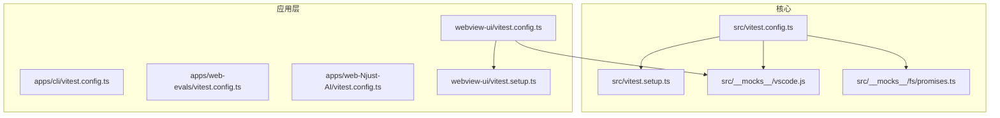
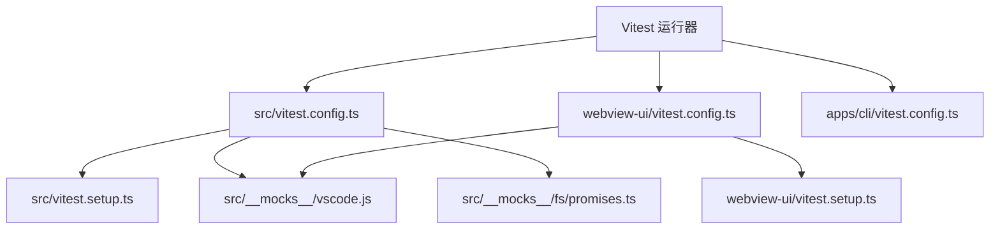
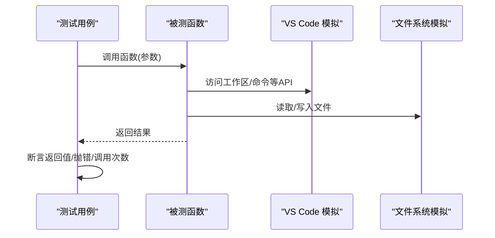
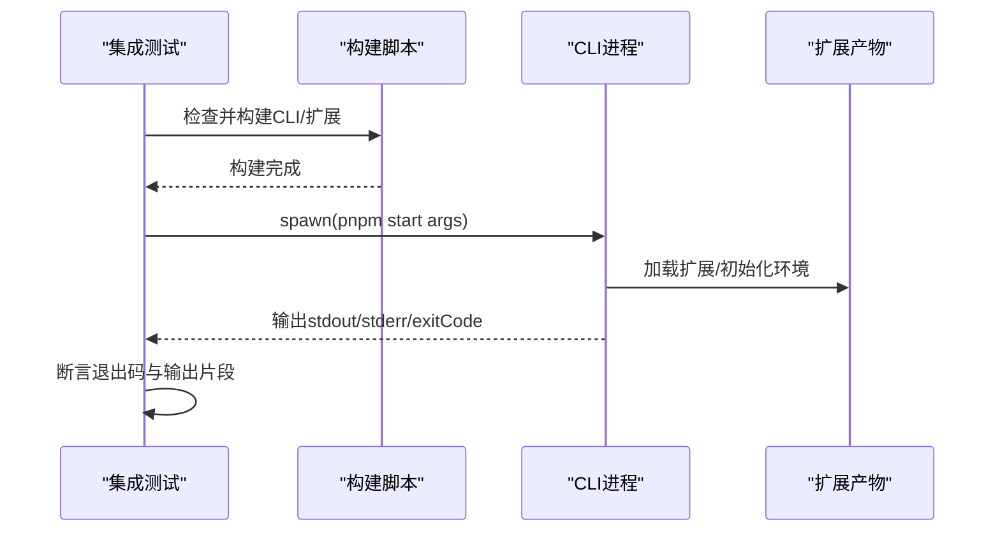
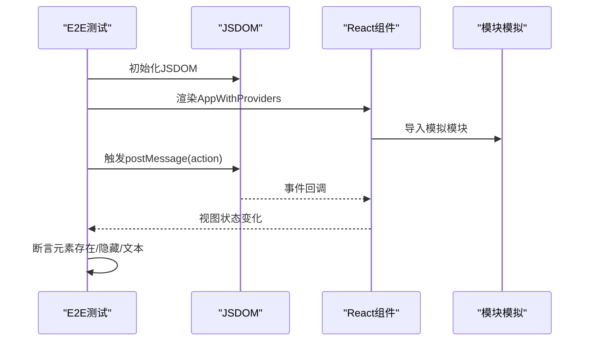
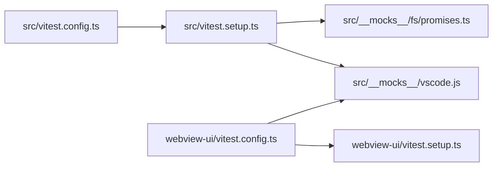

# 测试策略

<cite>
**本文引用的文件**
- [src/vitest.config.ts](file://src/vitest.config.ts)
- [src/vitest.setup.ts](file://src/vitest.setup.ts)
- [webview-ui/vitest.config.ts](file://webview-ui/vitest.config.ts)
- [webview-ui/vitest.setup.ts](file://webview-ui/vitest.setup.ts)
- [apps/cli/vitest.config.ts](file://apps/cli/vitest.config.ts)
- [apps/web-evals/vitest.config.ts](file://apps/web-evals/vitest.config.ts)
- [apps/web-Njust-AI/vitest.config.ts](file://apps/web-Njust-AI/vitest.config.ts)
- [src/__mocks__/vscode.js](file://src/__mocks__/vscode.js)
- [src/__mocks__/fs/promises.ts](file://src/__mocks__/fs/promises.ts)
- [src/__tests__/commands.spec.ts](file://src/__tests__/commands.spec.ts)
- [apps/cli/src/__tests__/index.test.ts](file://apps/cli/src/__tests__/index.test.ts)
- [apps/web-evals/src/lib/__tests__/formatters.spec.ts](file://apps/web-evals/src/lib/__tests__/formatters.spec.ts)
- [webview-ui/src/__tests__/App.spec.tsx](file://webview-ui/src/__tests__/App.spec.tsx)
</cite>

## 目录
1. [引言](#引言)
2. [项目结构](#项目结构)
3. [核心组件](#核心组件)
4. [架构总览](#架构总览)
5. [详细组件分析](#详细组件分析)
6. [依赖关系分析](#依赖关系分析)
7. [性能考虑](#性能考虑)
8. [故障排查指南](#故障排查指南)
9. [结论](#结论)
10. [附录](#附录)

## 引言
本测试策略文档面向Njust-AI项目，系统化阐述单元测试、集成测试、端到端测试与性能测试的实施方法与工具配置，明确测试框架选择（Vitest）、测试环境搭建、模拟对象使用与断言策略，并给出测试覆盖率要求、持续集成配置建议与测试报告生成方案。同时提供测试数据准备、测试环境隔离与测试结果分析的最佳实践，辅以具体示例与图示，帮助不同技术背景的读者高效落地。

## 项目结构
Njust-AI采用多包工作区结构，测试配置与实现分布于多个子应用与共享模块中：
- 核心测试框架：Vitest
- 应用层测试：
  - CLI应用：集成测试驱动外部可执行与扩展构建
  - Web-Evals：轻量前端功能测试
  - Web-Njust-AI：Next.js应用测试
  - WebView UI：React前端组件测试（JSDOM环境）
- 共享模块：VS Code API与文件系统模拟、全局测试设置

**图表来源**
- [src/vitest.config.ts:1-24](file://src/vitest.config.ts#L1-L24)
- [src/vitest.setup.ts:1-18](file://src/vitest.setup.ts#L1-L18)
- [webview-ui/vitest.config.ts:1-29](file://webview-ui/vitest.config.ts#L1-L29)
- [webview-ui/vitest.setup.ts:1-57](file://webview-ui/vitest.setup.ts#L1-L57)
- [apps/cli/vitest.config.ts:1-18](file://apps/cli/vitest.config.ts#L1-L18)
- [apps/web-evals/vitest.config.ts:1-9](file://apps/web-evals/vitest.config.ts#L1-L9)
- [apps/web-Njust-AI/vitest.config.ts:1-15](file://apps/web-Njust-AI/vitest.config.ts#L1-L15)
- [src/__mocks__/vscode.js:1-175](file://src/__mocks__/vscode.js#L1-L175)
- [src/__mocks__/fs/promises.ts:1-194](file://src/__mocks__/fs/promises.ts#L1-L194)

**章节来源**
- [src/vitest.config.ts:1-24](file://src/vitest.config.ts#L1-L24)
- [webview-ui/vitest.config.ts:1-29](file://webview-ui/vitest.config.ts#L1-L29)
- [apps/cli/vitest.config.ts:1-18](file://apps/cli/vitest.config.ts#L1-L18)
- [apps/web-evals/vitest.config.ts:1-9](file://apps/web-evals/vitest.config.ts#L1-L9)
- [apps/web-Njust-AI/vitest.config.ts:1-15](file://apps/web-Njust-AI/vitest.config.ts#L1-L15)

## 核心组件
- 测试框架与配置
  - Vitest作为统一测试运行器，支持快照、覆盖率、并发与报告等能力
  - 各应用独立配置文件，覆盖别名、环境、超时与包含规则
- 模拟对象体系
  - VS Code API模拟：提供工作区、窗口、命令、语言服务等常用接口的最小可用实现
  - 文件系统模拟：基于内存Map的读写、目录创建、重命名与访问控制，便于断言状态
- 全局测试设置
  - 禁止网络请求（默认），通过allowNetConnect按需放行
  - React开发模式强制开启，JSDOM兼容性修补（ResizeObserver、focus属性、matchMedia、scrollIntoView等）

**章节来源**
- [src/__mocks__/vscode.js:1-175](file://src/__mocks__/vscode.js#L1-L175)
- [src/__mocks__/fs/promises.ts:1-194](file://src/__mocks__/fs/promises.ts#L1-L194)
- [src/vitest.setup.ts:1-18](file://src/vitest.setup.ts#L1-L18)
- [webview-ui/vitest.setup.ts:1-57](file://webview-ui/vitest.setup.ts#L1-L57)

## 架构总览
下图展示测试运行在不同应用与共享模块间的交互关系，以及模拟层对真实依赖的解耦作用。

**图表来源**
- [src/vitest.config.ts:1-24](file://src/vitest.config.ts#L1-L24)
- [webview-ui/vitest.config.ts:1-29](file://webview-ui/vitest.config.ts#L1-L29)
- [apps/cli/vitest.config.ts:1-18](file://apps/cli/vitest.config.ts#L1-L18)
- [src/vitest.setup.ts:1-18](file://src/vitest.setup.ts#L1-L18)
- [webview-ui/vitest.setup.ts:1-57](file://webview-ui/vitest.setup.ts#L1-L57)
- [src/__mocks__/vscode.js:1-175](file://src/__mocks__/vscode.js#L1-L175)
- [src/__mocks__/fs/promises.ts:1-194](file://src/__mocks__/fs/promises.ts#L1-L194)

## 详细组件分析

### 单元测试（Unit Tests）
- 范围与目标
  - 验证函数、纯逻辑与边界条件；确保小范围变更不破坏既有行为
  - 使用模拟对象隔离外部依赖（VS Code API、文件系统）
- 断言策略
  - 基于期望值的直接断言，覆盖正常路径、异常路径与边界输入
  - 对异步函数使用await与合理的超时设置
- 示例参考
  - 命令工具函数测试：验证文件名解析、Markdown识别与错误处理
  - 格式化工具测试：验证时间与令牌数格式化输出

**图表来源**
- [src/__tests__/commands.spec.ts:1-97](file://src/__tests__/commands.spec.ts#L1-L97)
- [src/__mocks__/vscode.js:1-175](file://src/__mocks__/vscode.js#L1-L175)
- [src/__mocks__/fs/promises.ts:1-194](file://src/__mocks__/fs/promises.ts#L1-L194)

**章节来源**
- [src/__tests__/commands.spec.ts:1-97](file://src/__tests__/commands.spec.ts#L1-L97)
- [apps/web-evals/src/lib/__tests__/formatters.spec.ts:1-31](file://apps/web-evals/src/lib/__tests__/formatters.spec.ts#L1-L31)

### 集成测试（Integration Tests）
- 范围与目标
  - 验证模块间协作、外部进程与真实配置的交互
  - CLI集成测试通过spawn外部进程，结合构建产物与API密钥进行端到端流程验证
- 关键点
  - 条件执行：通过环境变量开关控制是否运行
  - 构建前置：自动检测并构建CLI与扩展产物
  - 超时与清理：合理设置超时，捕获标准输出与错误输出
- 示例参考
  - CLI集成测试：启动CLI进程，传入模型与任务参数，断言退出码与输出内容

**图表来源**
- [apps/cli/src/__tests__/index.test.ts:1-127](file://apps/cli/src/__tests__/index.test.ts#L1-L127)

**章节来源**
- [apps/cli/src/__tests__/index.test.ts:1-127](file://apps/cli/src/__tests__/index.test.ts#L1-L127)
- [apps/cli/vitest.config.ts:1-18](file://apps/cli/vitest.config.ts#L1-L18)

### 端到端测试（E2E Tests）
- 范围与目标
  - 在真实浏览器或UI环境中验证用户操作流与组件行为
  - WebView UI使用JSDOM与React Testing Library进行组件级E2E验证
- 关键点
  - 环境配置：JSDOM环境、React开发模式、DOM兼容性修补
  - 组件模拟：对第三方组件与上下文进行模块级模拟，保证渲染稳定性
  - 事件驱动：通过window.postMessage触发视图切换，断言可见性与隐藏状态
- 示例参考
  - App组件：默认显示聊天视图，接收消息后切换至设置/历史视图，再返回聊天视图

**图表来源**
- [webview-ui/src/__tests__/App.spec.tsx:1-252](file://webview-ui/src/__tests__/App.spec.tsx#L1-L252)
- [webview-ui/vitest.config.ts:1-29](file://webview-ui/vitest.config.ts#L1-L29)
- [webview-ui/vitest.setup.ts:1-57](file://webview-ui/vitest.setup.ts#L1-L57)

**章节来源**
- [webview-ui/src/__tests__/App.spec.tsx:1-252](file://webview-ui/src/__tests__/App.spec.tsx#L1-L252)
- [webview-ui/vitest.config.ts:1-29](file://webview-ui/vitest.config.ts#L1-L29)
- [webview-ui/vitest.setup.ts:1-57](file://webview-ui/vitest.setup.ts#L1-L57)

### 性能测试（Performance Tests）
- 范围与目标
  - 验证关键路径在不同数据规模下的响应时间与资源占用
  - 通过基准测试与压力测试识别瓶颈
- 实施建议
  - 使用Vitest计时与多次采样，计算平均耗时与方差
  - 对I/O密集型场景（文件系统、网络）进行隔离与模拟，避免环境波动
  - 结合覆盖率报告定位热点代码，优先优化高频路径

[本节为通用指导，无需特定文件引用]

## 依赖关系分析
- 组件耦合
  - 测试配置对模拟层存在强依赖，确保测试稳定与可重复
  - 共享模拟（VS Code API、文件系统）降低各应用测试的重复成本
- 外部依赖
  - 网络请求默认禁用，通过allowNetConnect按需放行，避免测试受外部服务影响
  - React与JSDOM兼容性修补减少UI测试的环境差异

**图表来源**
- [src/vitest.config.ts:1-24](file://src/vitest.config.ts#L1-L24)
- [src/vitest.setup.ts:1-18](file://src/vitest.setup.ts#L1-L18)
- [webview-ui/vitest.config.ts:1-29](file://webview-ui/vitest.config.ts#L1-L29)
- [webview-ui/vitest.setup.ts:1-57](file://webview-ui/vitest.setup.ts#L1-L57)
- [src/__mocks__/vscode.js:1-175](file://src/__mocks__/vscode.js#L1-L175)
- [src/__mocks__/fs/promises.ts:1-194](file://src/__mocks__/fs/promises.ts#L1-L194)

**章节来源**
- [src/vitest.setup.ts:1-18](file://src/vitest.setup.ts#L1-L18)
- [webview-ui/vitest.setup.ts:1-57](file://webview-ui/vitest.setup.ts#L1-L57)

## 性能考虑
- 测试执行效率
  - 合理设置超时与并发度，避免长时间阻塞CI流水线
  - 将大体量测试拆分为独立套件，按需运行
- 数据与环境
  - 使用内存模拟替代真实I/O，减少磁盘与网络抖动
  - 在JSDOM中预置必要polyfill，避免渲染阶段的额外开销
- 报告与可视化
  - 生成多种格式报告（如HTML、JSON），便于趋势分析与回归定位

[本节为通用指导，无需特定文件引用]

## 故障排查指南
- 网络相关问题
  - 症状：测试因网络请求失败而中断
  - 排查：确认全局设置是否禁用网络；对需要的主机使用allowNetConnect放行
- DOM/React兼容性问题
  - 症状：ResizeObserver未定义、focus属性不可写、matchMedia缺失
  - 排查：检查JSDOM设置与全局修补逻辑是否生效
- 模块导入冲突
  - 症状：VS Code API或文件系统模拟未按预期注入
  - 排查：核对别名配置与setupFiles加载顺序
- CLI集成测试失败
  - 症状：进程无法启动或输出为空
  - 排查：确认构建产物存在、环境变量正确传递、超时时间充足

**章节来源**
- [src/vitest.setup.ts:1-18](file://src/vitest.setup.ts#L1-L18)
- [webview-ui/vitest.setup.ts:1-57](file://webview-ui/vitest.setup.ts#L1-L57)
- [apps/cli/src/__tests__/index.test.ts:1-127](file://apps/cli/src/__tests__/index.test.ts#L1-L127)

## 结论
通过统一的Vitest配置、完善的模拟体系与分层测试策略，Njust-AI能够在保证质量的同时提升测试效率与可维护性。建议在CI中启用覆盖率阈值与报告归档，并持续优化关键路径的性能与稳定性。

[本节为总结性内容，无需特定文件引用]

## 附录

### 测试覆盖率要求（建议）
- 行覆盖率：≥80%
- 分支覆盖率：≥70%
- 函数覆盖率：≥85%
- 语句覆盖率：≥80%
- 覆盖率统计：通过Vitest内置覆盖率插件生成报告

[本节为通用指导，无需特定文件引用]

### 持续集成配置（建议）
- 触发策略
  - 主分支保护：PR需通过单元测试与覆盖率检查
  - 定时任务：全量集成测试与端到端测试
- 步骤建议
  - 安装依赖与构建
  - 运行单元测试与覆盖率收集
  - 可选：运行集成测试（带环境变量开关）
  - 可选：运行端到端测试（JSDOM环境）
  - 上传测试报告与覆盖率文件

[本节为通用指导，无需特定文件引用]

### 测试报告生成
- 报告类型
  - 控制台摘要：快速反馈
  - HTML报告：交互式浏览与对比
  - JSON/Cobertura：供CI系统解析
- 生成位置
  - 默认输出目录由各应用配置决定，建议统一归档到CI制品库

**章节来源**
- [src/vitest.config.ts:1-24](file://src/vitest.config.ts#L1-L24)
- [webview-ui/vitest.config.ts:1-29](file://webview-ui/vitest.config.ts#L1-L29)
- [apps/cli/vitest.config.ts:1-18](file://apps/cli/vitest.config.ts#L1-L18)
- [apps/web-evals/vitest.config.ts:1-9](file://apps/web-evals/vitest.config.ts#L1-L9)
- [apps/web-Njust-AI/vitest.config.ts:1-15](file://apps/web-Njust-AI/vitest.config.ts#L1-L15)

### 测试数据准备与环境隔离
- 测试数据
  - 使用内存Map模拟文件系统，预先填充规则文件与默认设置，便于断言
  - 通过别名与路径映射隔离真实文件系统
- 环境隔离
  - 每个应用独立配置，避免相互污染
  - 在JSDOM中修补缺失的Web API，确保UI测试一致性

**章节来源**
- [src/__mocks__/fs/promises.ts:1-194](file://src/__mocks__/fs/promises.ts#L1-L194)
- [webview-ui/vitest.config.ts:1-29](file://webview-ui/vitest.config.ts#L1-L29)

### 测试结果分析方法
- 趋势分析：对比多次运行的覆盖率与耗时，识别回归与退化
- 失败分类：区分断言失败、超时、网络受限与环境问题
- 报告解读：结合源码行号与测试名称定位问题根因

[本节为通用指导，无需特定文件引用]