# 部署与运维

<cite>
**本文档引用的文件**
- [package.json](file://package.json)
- [pnpm-workspace.yaml](file://pnpm-workspace.yaml)
- [turbo.json](file://turbo.json)
- [scripts/bootstrap.mjs](file://scripts/bootstrap.mjs)
- [apps/web-Njust-AI/package.json](file://apps/web-Njust-AI/package.json)
- [apps/web-evals/package.json](file://apps/web-evals/package.json)
- [packages/evals/docker-compose.yml](file://packages/evals/docker-compose.yml)
- [ellipsis.yaml](file://ellipsis.yaml)
</cite>

## 目录
1. [简介](#简介)
2. [项目结构](#项目结构)
3. [核心组件](#核心组件)
4. [架构概览](#架构概览)
5. [详细组件分析](#详细组件分析)
6. [依赖关系分析](#依赖关系分析)
7. [性能考虑](#性能考虑)
8. [故障排除指南](#故障排除指南)
9. [结论](#结论)
10. [附录](#附录)

## 简介

本项目是一个基于 Monorepo 架构的 AI 辅助开发平台，采用 Turbo 作为构建系统，PNPM 作为包管理器。项目包含多个应用和包，支持 VS Code 扩展、Web 应用、评估系统等多种部署形态。

项目的核心特点包括：
- 基于 Turbo 的高性能构建系统
- 使用 PNPM 进行依赖管理
- 支持多种部署环境（本地开发、生产环境）
- 完整的 CI/CD 流水线支持
- Docker 容器化部署能力

## 项目结构

项目采用 Monorepo 结构，主要包含以下核心目录：

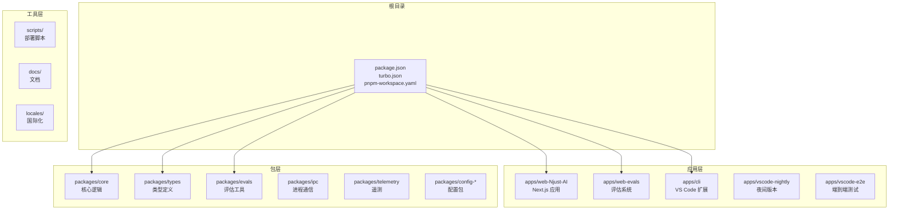

**图表来源**
- [pnpm-workspace.yaml:1-6](file://pnpm-workspace.yaml#L1-L6)
- [package.json:1-68](file://package.json#L1-L68)

**章节来源**
- [pnpm-workspace.yaml:1-6](file://pnpm-workspace.yaml#L1-L6)
- [package.json:1-68](file://package.json#L1-L68)

## 核心组件

### Turbo 构建系统

Turbo 是项目的核心构建引擎，提供了以下功能：

- **任务编排**：统一管理所有构建、测试、格式化任务
- **缓存机制**：智能缓存构建结果，加速重复构建
- **并行执行**：充分利用多核 CPU 能力
- **增量构建**：只重新构建受影响的包

关键配置特性：
- 任务依赖管理
- 输出目录定义
- 输入文件监控
- 缓存策略优化

**章节来源**
- [turbo.json:1-22](file://turbo.json#L1-L22)

### PNPM 包管理系统

PNPM 提供了高效的包管理能力：

- **工作区支持**：原生支持 Monorepo 结构
- **符号链接**：避免重复安装相同包
- **锁定文件**：确保依赖一致性
- **安全扫描**：内置依赖安全检查

配置要点：
- 工作区包定义
- 依赖覆盖规则
- 只构建依赖配置

**章节来源**
- [package.json:50-66](file://package.json#L50-L66)
- [pnpm-workspace.yaml:1-6](file://pnpm-workspace.yaml#L1-L6)

### 自动引导脚本

项目包含智能的引导脚本，确保开发环境的一致性：

- **PNPM 检测**：自动检测并使用 PNPM
- **本地安装**：在需要时自动安装 PNPM
- **环境隔离**：防止循环依赖问题
- **错误处理**：完善的错误恢复机制

**章节来源**
- [scripts/bootstrap.mjs:1-82](file://scripts/bootstrap.mjs#L1-L82)

## 架构概览

项目采用分层架构设计，支持多种部署模式：

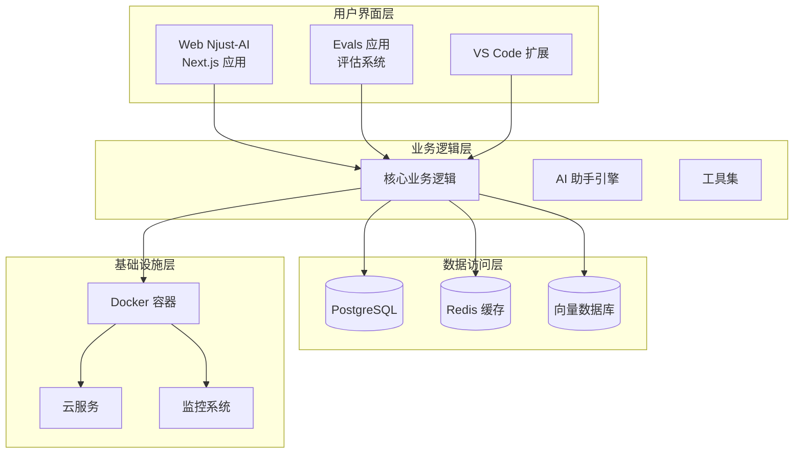

**图表来源**
- [apps/web-Njust-AI/package.json:1-62](file://apps/web-Njust-AI/package.json#L1-L62)
- [apps/web-evals/package.json:1-64](file://apps/web-evals/package.json#L1-L64)
- [packages/evals/docker-compose.yml:16-88](file://packages/evals/docker-compose.yml#L16-L88)

## 详细组件分析

### Web Njust-AI 应用

Web Njust-AI 是主要的 Web 应用程序，基于 Next.js 构建：

#### 核心功能模块

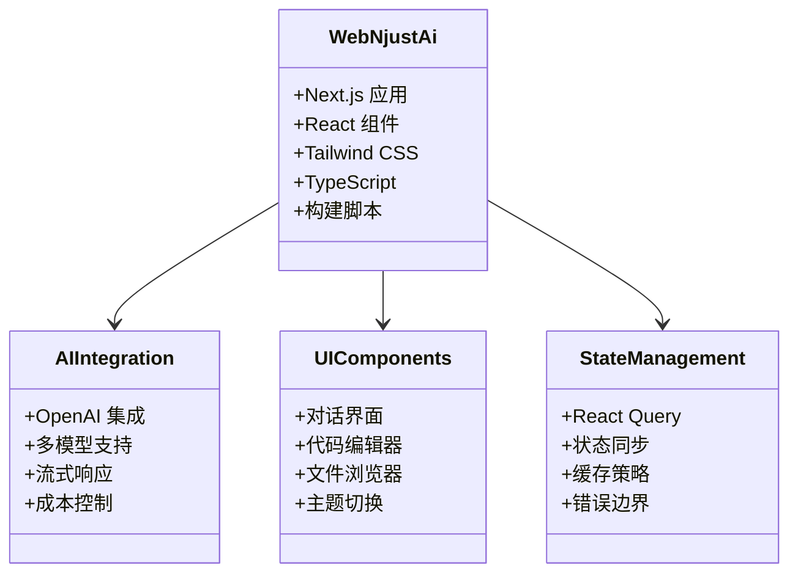

**图表来源**
- [apps/web-Njust-AI/package.json:16-47](file://apps/web-Njust-AI/package.json#L16-L47)

#### 部署配置

应用支持多种部署方式：

- **静态生成**：使用 Next.js SSG
- **服务器渲染**：支持 SSR 和 ISR
- **环境变量**：灵活的配置管理
- **SEO 优化**：完整的 SEO 支持

**章节来源**
- [apps/web-Njust-AI/package.json:1-62](file://apps/web-Njust-AI/package.json#L1-L62)

### Evals 评估系统

评估系统是专门用于 AI 模型评估的 Web 应用：

#### 架构设计

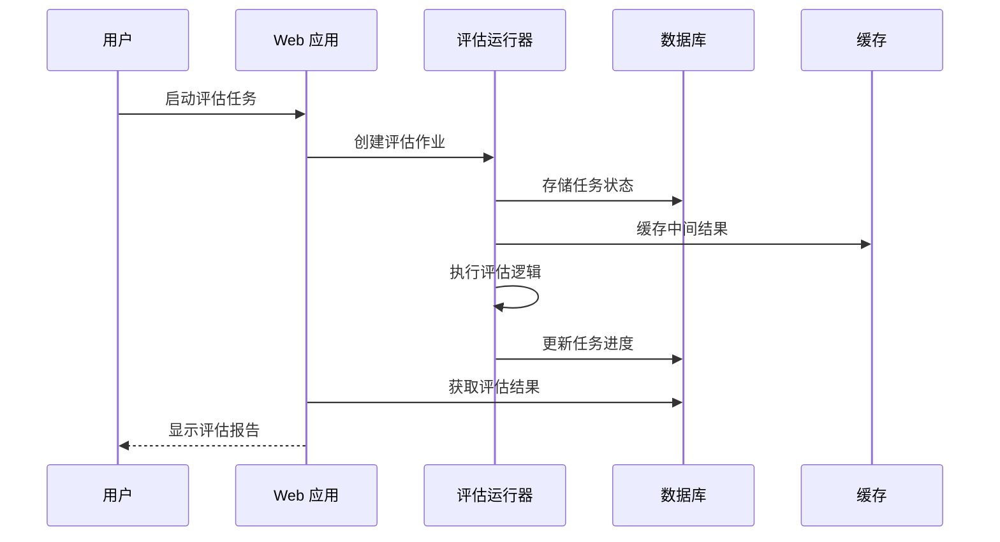

**图表来源**
- [packages/evals/docker-compose.yml:49-82](file://packages/evals/docker-compose.yml#L49-L82)

#### Docker 配置

评估系统采用 Docker Compose 进行容器编排：

- **数据库服务**：PostgreSQL 15.4
- **缓存服务**：Redis 7-alpine
- **Web 服务**：评估 Web 应用
- **运行器服务**：评估执行器
- **网络配置**：自定义桥接网络

**章节来源**
- [packages/evals/docker-compose.yml:1-88](file://packages/evals/docker-compose.yml#L1-L88)

### VS Code 扩展

VS Code 扩展提供桌面端的 AI 辅助开发体验：

#### 功能特性

- **智能代码补全**：基于上下文的代码建议
- **代码重构**：安全的代码转换工具
- **多模型支持**：集成多种 AI 模型
- **会话管理**：持久化的对话历史
- **插件生态**：支持 MCP 协议

**章节来源**
- [package.json:7-28](file://package.json#L7-L28)

## 依赖关系分析

### 包依赖图

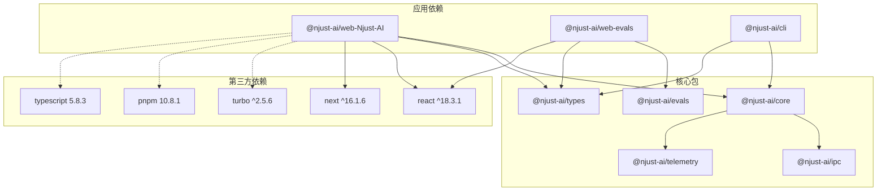

**图表来源**
- [apps/web-Njust-AI/package.json:16-47](file://apps/web-Njust-AI/package.json#L16-L47)
- [apps/web-evals/package.json:14-51](file://apps/web-evals/package.json#L14-L51)
- [package.json:30-49](file://package.json#L30-L49)

### 构建流程

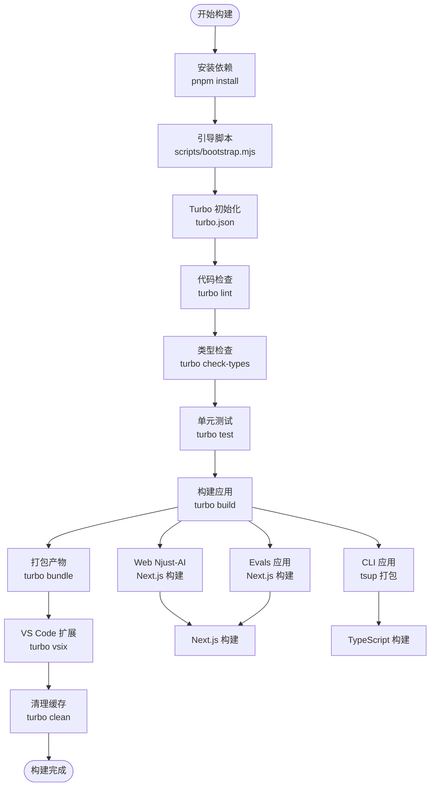

**图表来源**
- [package.json:7-28](file://package.json#L7-L28)
- [turbo.json:3-20](file://turbo.json#L3-L20)
- [scripts/bootstrap.mjs:42-78](file://scripts/bootstrap.mjs#L42-L78)

**章节来源**
- [package.json:7-28](file://package.json#L7-L28)
- [turbo.json:3-20](file://turbo.json#L3-L20)

## 性能考虑

### 构建性能优化

项目采用了多项性能优化策略：

#### Turbo 缓存策略
- **智能缓存**：基于文件内容哈希的缓存机制
- **增量构建**：只重建受影响的包
- **并行执行**：充分利用多核 CPU
- **远程缓存**：支持团队共享构建缓存

#### PNPM 依赖优化
- **符号链接**：避免重复安装
- **工作区优化**：直接链接本地包
- **依赖扁平化**：减少嵌套层级
- **内存优化**：高效的包索引管理

#### 应用性能优化

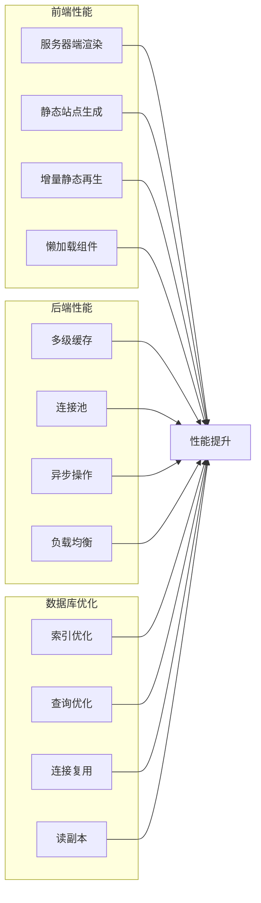

**图表来源**
- [apps/web-Njust-AI/package.json:8-14](file://apps/web-Njust-AI/package.json#L8-L14)
- [apps/web-evals/package.json:6-12](file://apps/web-evals/package.json#L6-L12)

### 监控和日志

#### 日志管理策略

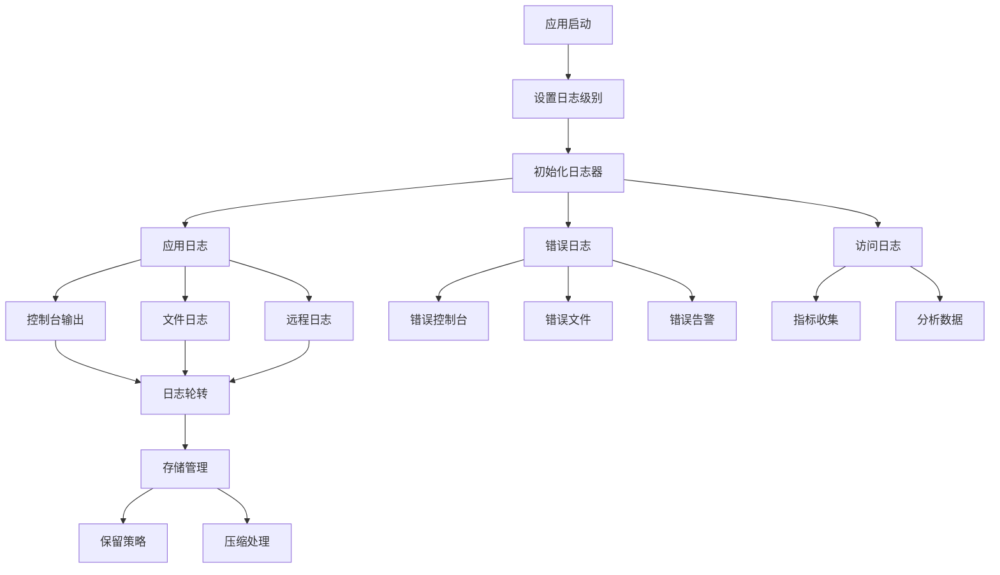

**图表来源**
- [ellipsis.yaml:1-23](file://ellipsis.yaml#L1-L23)

## 故障排除指南

### 常见问题诊断

#### 构建问题

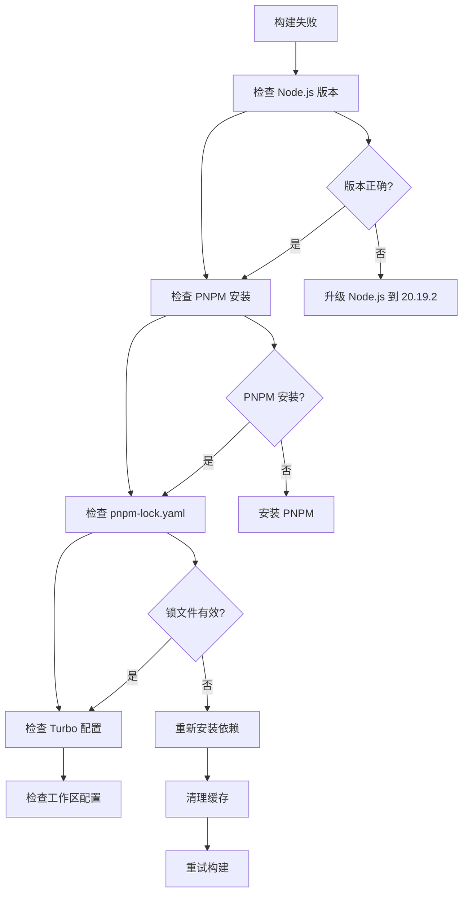

#### 开发环境问题

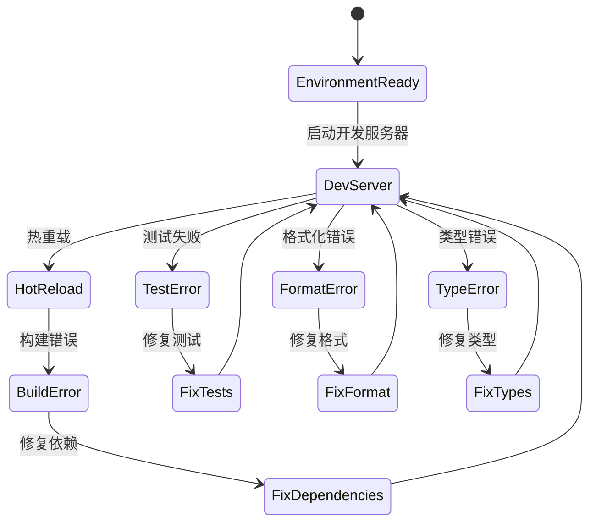

**图表来源**
- [scripts/bootstrap.mjs:42-82](file://scripts/bootstrap.mjs#L42-L82)

#### Docker 部署问题

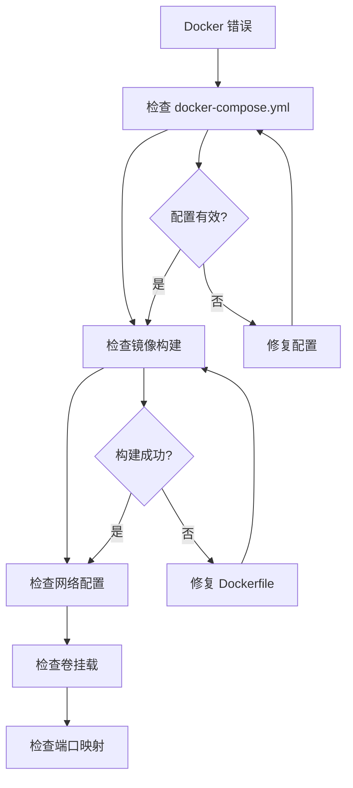

**图表来源**
- [packages/evals/docker-compose.yml:16-88](file://packages/evals/docker-compose.yml#L16-L88)

### 性能问题排查

#### 内存泄漏检测

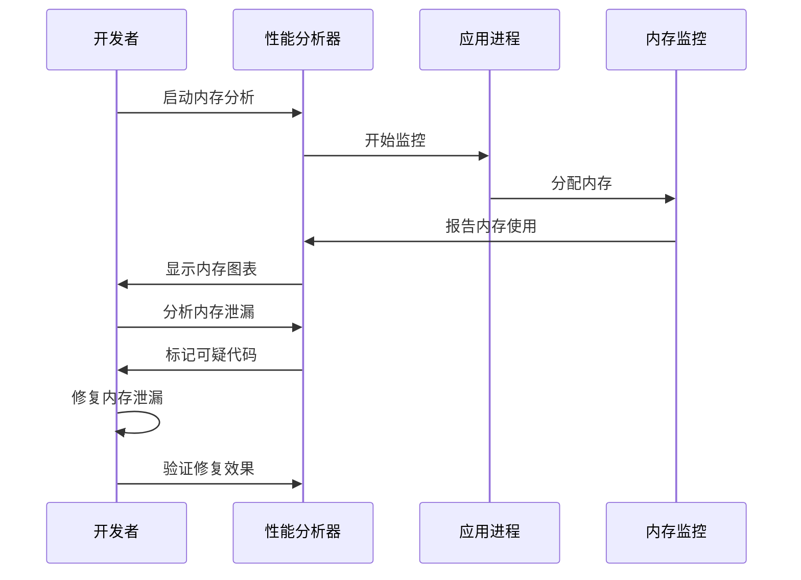

#### 数据库性能优化

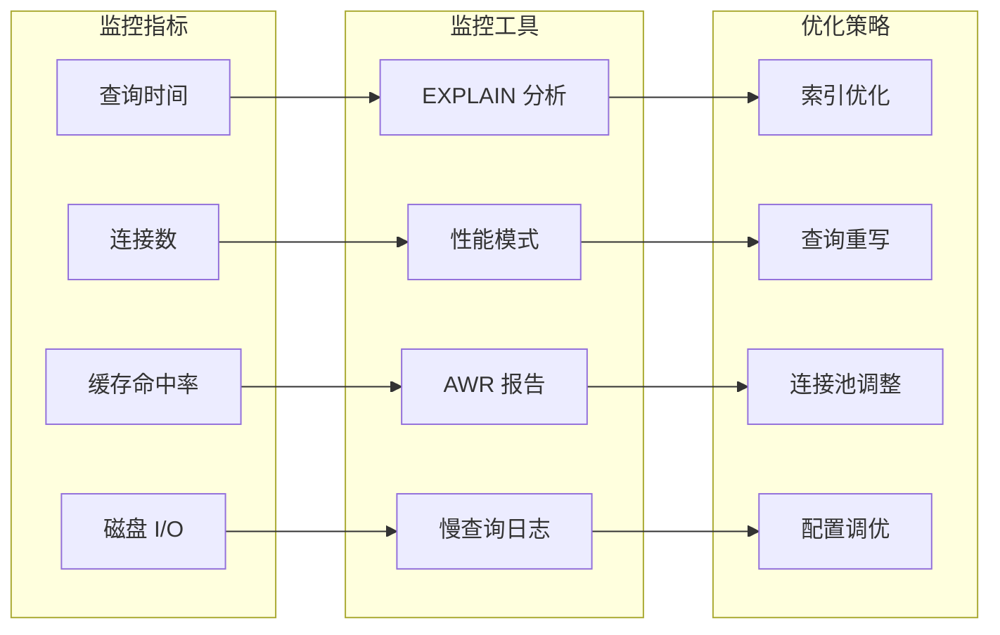

**图表来源**
- [packages/evals/docker-compose.yml:19-35](file://packages/evals/docker-compose.yml#L19-L35)

**章节来源**
- [scripts/bootstrap.mjs:42-82](file://scripts/bootstrap.mjs#L42-L82)
- [packages/evals/docker-compose.yml:16-88](file://packages/evals/docker-compose.yml#L16-L88)

## 结论

本项目的部署与运维体系具有以下优势：

1. **高效构建**：Turbo + PNPM 的组合提供了卓越的构建性能
2. **灵活部署**：支持多种部署模式，从本地开发到生产环境
3. **完整监控**：内置日志管理和性能监控能力
4. **容器化支持**：完整的 Docker 部署解决方案
5. **CI/CD 集成**：为自动化部署做好准备

建议在生产环境中重点关注：
- 监控系统的完善和告警配置
- 容灾备份和灾难恢复计划
- 性能基准测试和容量规划
- 安全审计和合规性检查

## 附录

### 部署最佳实践

#### 生产环境部署清单

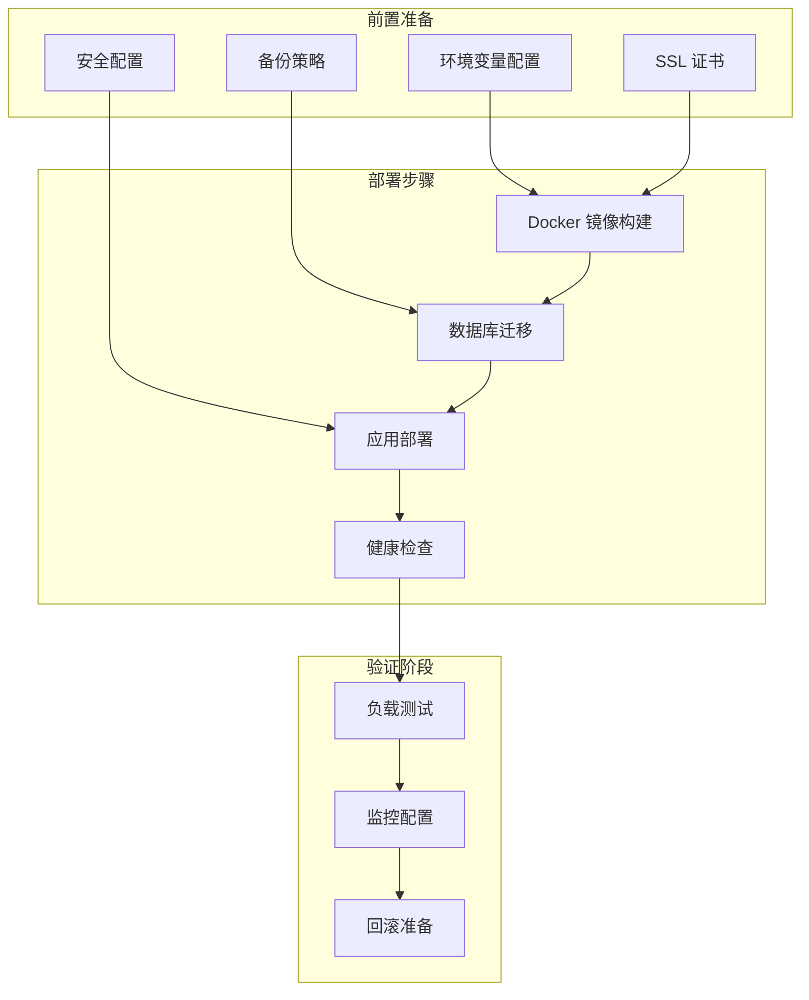

#### 性能基准测试

建议实施的性能测试包括：
- **响应时间测试**：测量关键 API 的响应时间
- **并发用户测试**：模拟高并发场景
- **内存使用测试**：监控长时间运行的内存使用
- **数据库性能测试**：评估数据库查询性能
- **缓存效率测试**：验证缓存命中率和效果

#### 安全加固措施

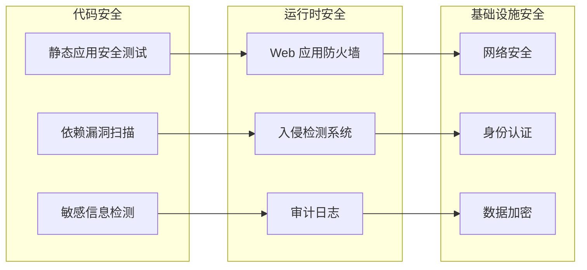