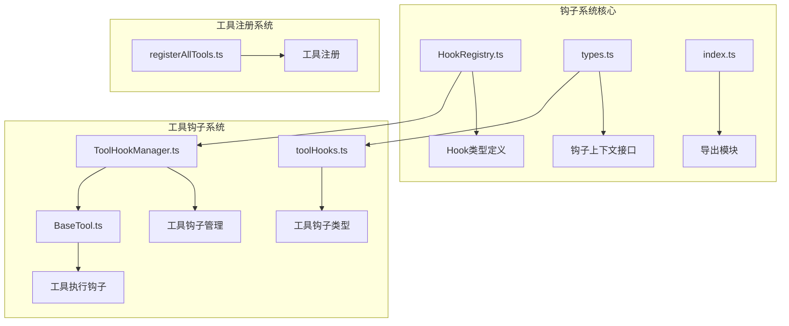
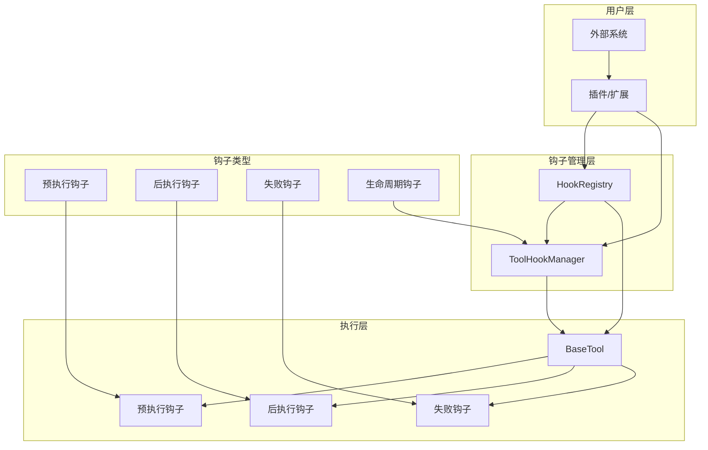
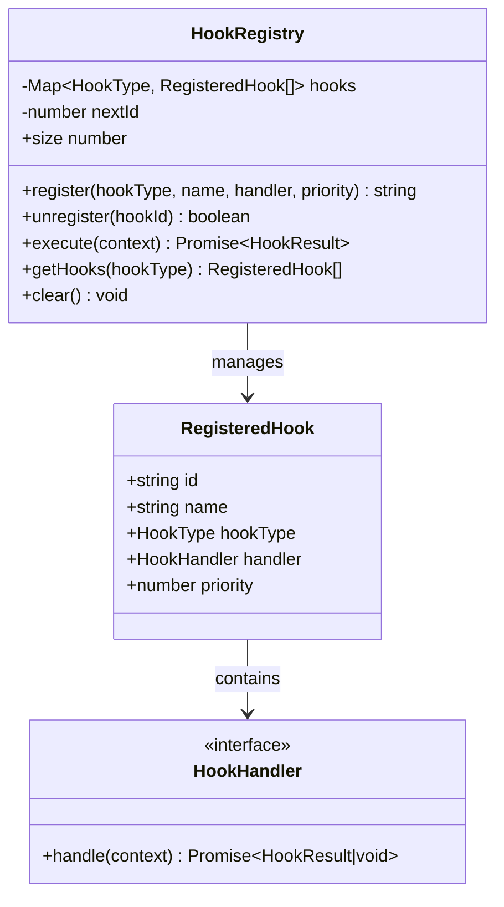
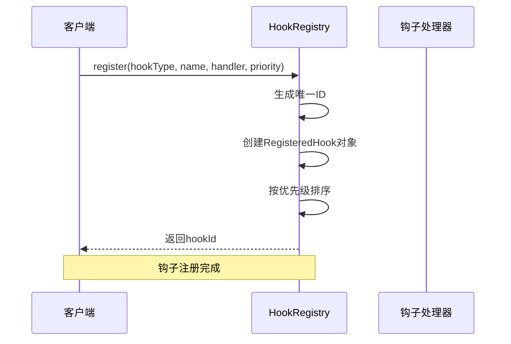
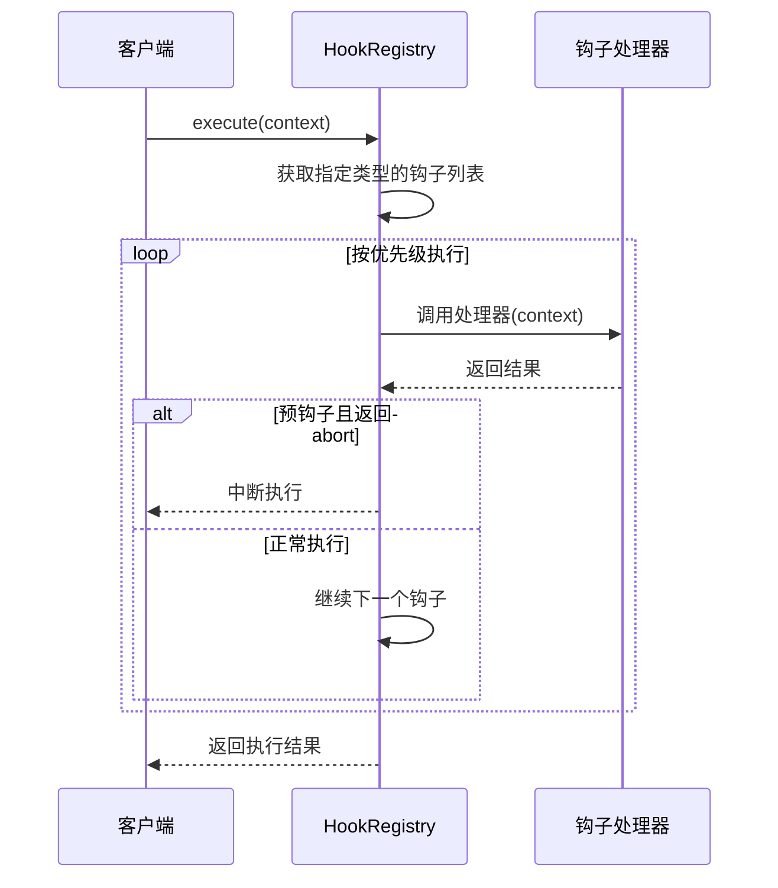
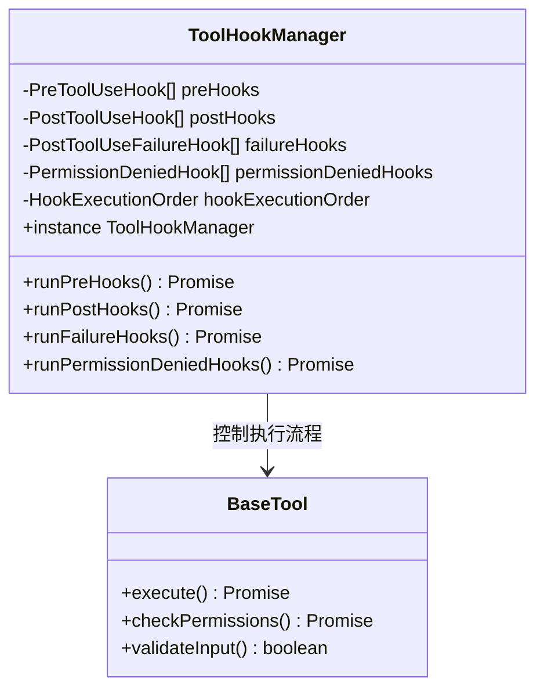
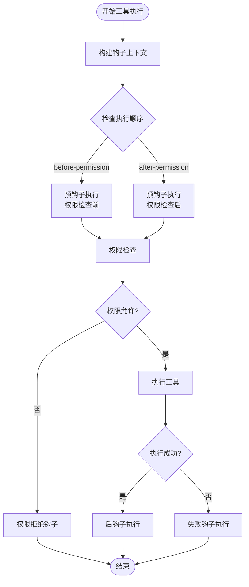
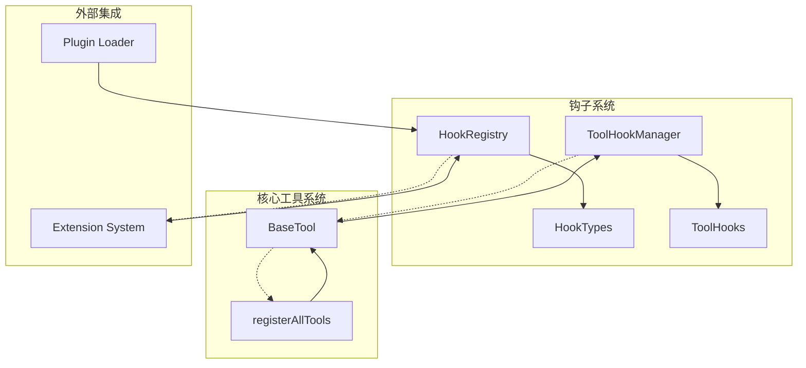

# 钩子注册系统

<cite>
**本文档引用的文件**
- [HookRegistry.ts](file://src/core/hooks/HookRegistry.ts)
- [types.ts](file://src/core/hooks/types.ts)
- [index.ts](file://src/core/hooks/index.ts)
- [ToolHookManager.ts](file://src/core/tools/ToolHookManager.ts)
- [toolHooks.ts](file://src/core/tools/toolHooks.ts)
- [BaseTool.ts](file://src/core/tools/BaseTool.ts)
- [registerAllTools.ts](file://src/core/tools/registerAllTools.ts)
</cite>

## 目录
1. [简介](#简介)
2. [项目结构](#项目结构)
3. [核心组件](#核心组件)
4. [架构概览](#架构概览)
5. [详细组件分析](#详细组件分析)
6. [依赖关系分析](#依赖关系分析)
7. [性能考虑](#性能考虑)
8. [故障排除指南](#故障排除指南)
9. [结论](#结论)

## 简介

钩子注册系统是Njust-AI项目中的一个关键扩展机制，它为系统提供了灵活的事件驱动架构。该系统允许开发者在不修改核心代码的情况下，向工具执行流程中插入自定义逻辑。

系统主要包含两个层面的钩子：

1. **全局钩子系统**：基于HookRegistry类的通用钩子注册机制
2. **工具钩子系统**：专门针对工具执行的ToolHookManager管理器

这两个系统相互配合，为整个应用提供了强大的可扩展性。

## 项目结构

钩子注册系统主要分布在以下目录结构中：

**图表来源**
- [HookRegistry.ts:1-120](file://src/core/hooks/HookRegistry.ts#L1-L120)
- [ToolHookManager.ts:1-302](file://src/core/tools/ToolHookManager.ts#L1-L302)
- [BaseTool.ts:480-679](file://src/core/tools/BaseTool.ts#L480-L679)

**章节来源**
- [HookRegistry.ts:1-120](file://src/core/hooks/HookRegistry.ts#L1-L120)
- [ToolHookManager.ts:1-302](file://src/core/tools/ToolHookManager.ts#L1-L302)

## 核心组件

### HookRegistry类

HookRegistry是全局钩子注册系统的核心，提供以下功能：

- **钩子注册**：支持按优先级注册钩子处理器
- **钩子执行**：按优先级顺序执行钩子，支持中断机制
- **钩子管理**：提供查询、注销和清理功能

### 工具钩子管理器

ToolHookManager专门处理工具执行相关的钩子，包括：

- **预执行钩子**：在工具执行前运行，可阻止或修改输入
- **后执行钩子**：在工具成功执行后运行
- **失败钩子**：在工具执行失败时运行
- **生命周期钩子**：处理任务会话、扩展生命周期等

**章节来源**
- [HookRegistry.ts:13-119](file://src/core/hooks/HookRegistry.ts#L13-L119)
- [ToolHookManager.ts:31-301](file://src/core/tools/ToolHookManager.ts#L31-L301)

## 架构概览

钩子注册系统采用分层架构设计，确保了系统的模块化和可扩展性：

**图表来源**
- [HookRegistry.ts:68-89](file://src/core/hooks/HookRegistry.ts#L68-L89)
- [ToolHookManager.ts:126-189](file://src/core/tools/ToolHookManager.ts#L126-L189)
- [BaseTool.ts:495-561](file://src/core/tools/BaseTool.ts#L495-L561)

## 详细组件分析

### HookRegistry类深度分析

HookRegistry实现了完整的钩子生命周期管理：

**图表来源**
- [HookRegistry.ts:13-43](file://src/core/hooks/HookRegistry.ts#L13-L43)
- [HookRegistry.ts:81-87](file://src/core/hooks/HookRegistry.ts#L81-L87)

#### 注册流程序列图

**图表来源**
- [HookRegistry.ts:21-43](file://src/core/hooks/HookRegistry.ts#L21-L43)

#### 执行流程序列图

**图表来源**
- [HookRegistry.ts:68-89](file://src/core/hooks/HookRegistry.ts#L68-L89)

**章节来源**
- [HookRegistry.ts:13-119](file://src/core/hooks/HookRegistry.ts#L13-L119)

### 工具钩子系统分析

工具钩子系统提供了更精细的工具执行控制：

**图表来源**
- [ToolHookManager.ts:31-301](file://src/core/tools/ToolHookManager.ts#L31-L301)
- [BaseTool.ts:487-561](file://src/core/tools/BaseTool.ts#L487-L561)

#### 工具执行流程

**图表来源**
- [BaseTool.ts:495-561](file://src/core/tools/BaseTool.ts#L495-L561)
- [BaseTool.ts:668-679](file://src/core/tools/BaseTool.ts#L668-L679)

**章节来源**
- [ToolHookManager.ts:31-301](file://src/core/tools/ToolHookManager.ts#L31-L301)
- [BaseTool.ts:487-679](file://src/core/tools/BaseTool.ts#L487-L679)

### 钩子类型定义

系统定义了多种钩子类型以满足不同的扩展需求：

| 钩子类型 | 触发时机 | 主要用途 | 返回值 |
|---------|---------|---------|--------|
| preToolUse | 工具执行前 | 输入验证、权限检查、参数修改 | `{allow: boolean, modifiedInput?: any}` |
| postToolUse | 工具执行后成功 | 日志记录、审计跟踪 | void |
| postToolUseFailure | 工具执行失败 | 错误处理、监控告警 | void |
| preCompact | 上下文压缩前 | 性能优化、数据备份 | 可中断 |
| postCompact | 上下文压缩后 | 结果验证、清理工作 | 无中断 |

**章节来源**
- [types.ts:7-57](file://src/core/hooks/types.ts#L7-L57)
- [toolHooks.ts:24-108](file://src/core/tools/toolHooks.ts#L24-L108)

## 依赖关系分析

钩子注册系统与其他组件的依赖关系如下：

**图表来源**
- [registerAllTools.ts:15-128](file://src/core/tools/registerAllTools.ts#L15-L128)
- [BaseTool.ts:488](file://src/core/tools/BaseTool.ts#L488)

### 关键依赖点

1. **HookRegistry依赖**：依赖types.ts中的类型定义
2. **ToolHookManager依赖**：依赖toolHooks.ts中的工具钩子类型
3. **BaseTool依赖**：依赖ToolHookManager进行工具执行控制
4. **registerAllTools依赖**：依赖ToolRegistry进行工具注册

**章节来源**
- [registerAllTools.ts:15-128](file://src/core/tools/registerAllTools.ts#L15-L128)
- [BaseTool.ts:488](file://src/core/tools/BaseTool.ts#L488)

## 性能考虑

钩子注册系统在设计时充分考虑了性能因素：

### 时间复杂度
- **注册操作**：O(n log n)，主要由排序操作决定
- **执行操作**：O(n)，其中n为特定类型钩子的数量
- **查找操作**：O(1)，通过Map数据结构实现

### 内存优化
- 使用Map结构存储钩子，提供高效的查找性能
- 支持钩子的动态注册和注销
- 提供钩子清理功能，防止内存泄漏

### 异步处理
- 所有钩子处理器都支持异步执行
- 使用Promise确保异步操作的正确处理
- 错误处理不影响主执行流程

## 故障排除指南

### 常见问题及解决方案

#### 钩子执行失败
**问题**：钩子处理器抛出异常导致主流程中断
**解决方案**：系统已内置错误捕获机制，异常会被记录但不会影响主流程

#### 钩子优先级冲突
**问题**：多个钩子具有相同的优先级导致执行顺序不确定
**解决方案**：使用不同的优先级数值，数值越小执行优先级越高

#### 钩子内存泄漏
**问题**：注册的钩子无法被释放
**解决方案**：使用unregister方法注销不需要的钩子，或调用clear方法清理所有钩子

#### 工具执行阻塞
**问题**：预钩子返回allow: false导致工具无法执行
**解决方案**：检查预钩子的逻辑，确保只在必要时阻止执行

**章节来源**
- [HookRegistry.ts:82-85](file://src/core/hooks/HookRegistry.ts#L82-L85)
- [ToolHookManager.ts:145-148](file://src/core/tools/ToolHookManager.ts#L145-L148)

## 结论

钩子注册系统为Njust-AI项目提供了强大而灵活的扩展机制。通过分层设计和清晰的职责分离，系统既保证了易用性，又确保了高性能和可靠性。

### 主要优势

1. **模块化设计**：钩子系统独立于核心业务逻辑
2. **灵活配置**：支持优先级排序和条件执行
3. **错误隔离**：钩子异常不会影响主流程
4. **易于扩展**：新的钩子类型可以轻松添加

### 应用场景

- **权限控制**：在工具执行前进行权限验证
- **日志审计**：记录工具使用情况和结果
- **性能监控**：收集执行时间和资源使用信息
- **数据备份**：在关键操作前后进行数据保护

该系统为Njust-AI的未来发展奠定了坚实的基础，支持更多的插件和扩展功能。