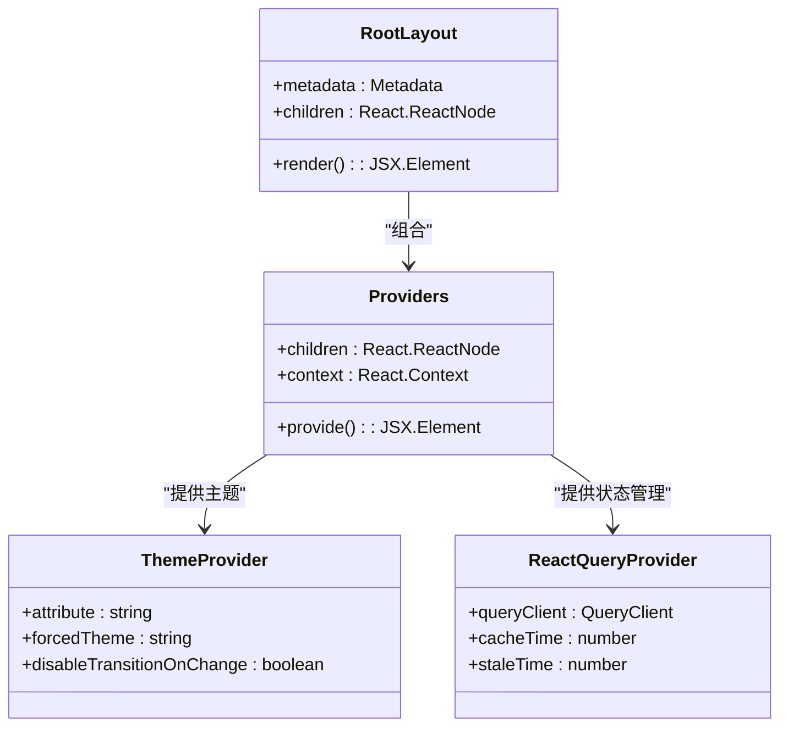
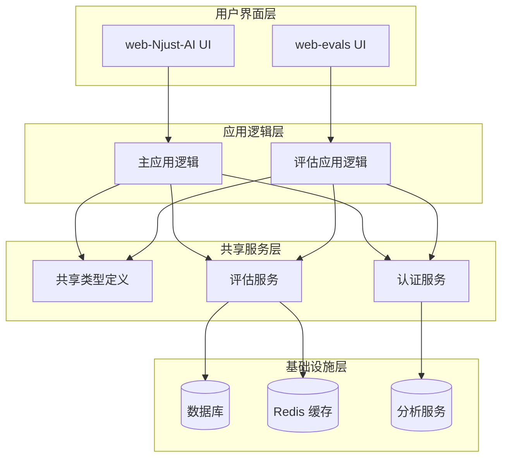
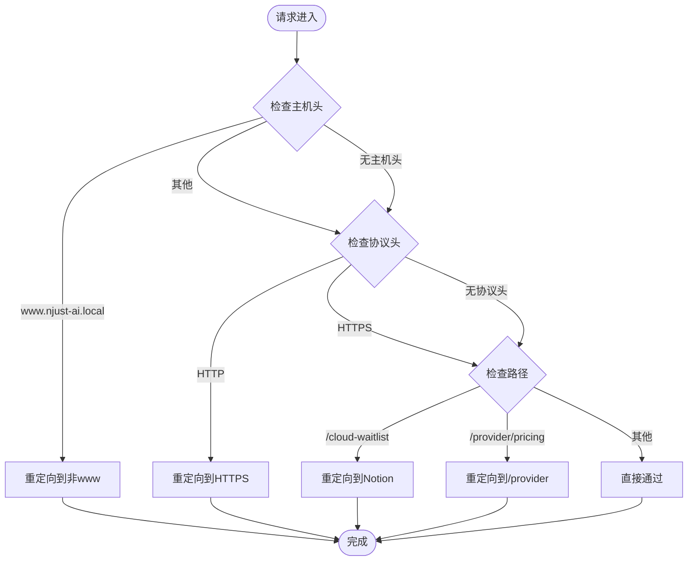
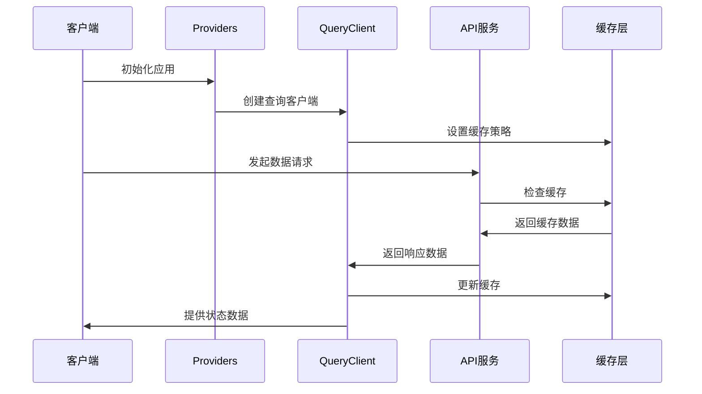
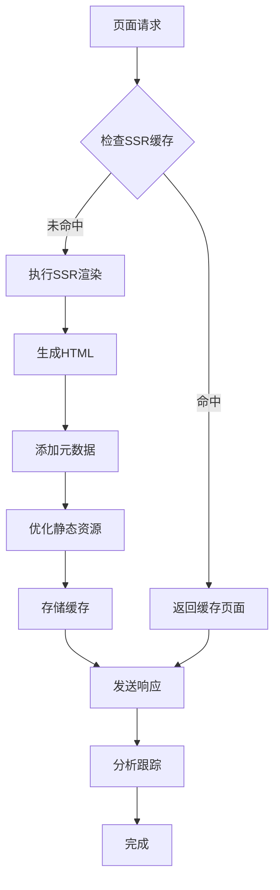
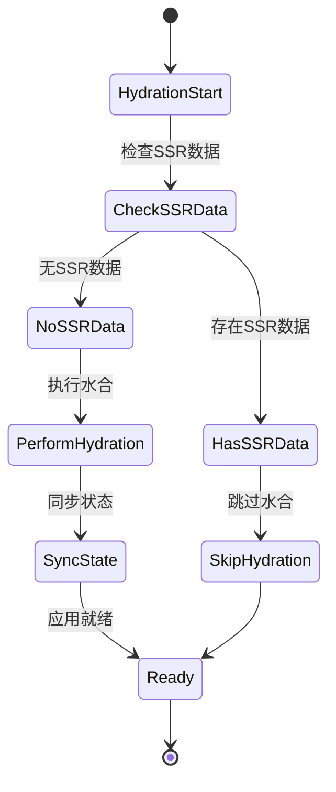
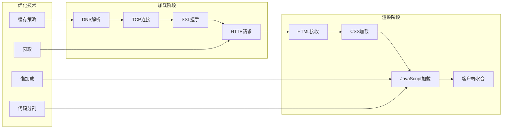

# Web 应用集成

<cite>
**本文档引用的文件**
- [apps/web-Njust-AI/package.json](file://apps/web-Njust-AI/package.json)
- [apps/web-evals/package.json](file://apps/web-evals/package.json)
- [apps/web-Njust-AI/next.config.ts](file://apps/web-Njust-AI/next.config.ts)
- [apps/web-evals/next.config.ts](file://apps/web-evals/next.config.ts)
- [apps/web-Njust-AI/src/app/layout.tsx](file://apps/web-Njust-AI/src/app/layout.tsx)
- [apps/web-evals/src/app/layout.tsx](file://apps/web-evals/src/app/layout.tsx)
- [apps/web-Njust-AI/src/components/providers/index.ts](file://apps/web-Njust-AI/src/components/providers/index.ts)
- [apps/web-evals/src/components/providers/index.ts](file://apps/web-evals/src/components/providers/index.ts)
</cite>

## 目录
1. [简介](#简介)
2. [项目结构](#项目结构)
3. [核心组件](#核心组件)
4. [架构概览](#架构概览)
5. [详细组件分析](#详细组件分析)
6. [依赖关系分析](#依赖关系分析)
7. [性能考虑](#性能考虑)
8. [故障排除指南](#故障排除指南)
9. [结论](#结论)

## 简介

本文件为 NJUST_AI 项目的 Web 应用集成开发文档，重点阐述主 Web 应用（web-Njust-AI）与评估 Web 应用（web-evals）的架构设计、组件集成模式和 API 端点设计。文档涵盖 Next.js 应用的路由配置、状态管理方案、服务器端渲染优化和客户端水合策略，并提供具体的集成示例、性能优化技巧和安全考虑。同时，解释两个 Web 应用之间的数据共享机制和统一认证系统的实现方式。

## 项目结构

两个 Web 应用均采用 Next.js 16 架构，分别位于 `apps/web-Njust-AI` 和 `apps/web-evals` 目录下。它们通过 Monorepo 工作区进行管理，共享类型定义和通用包。

```mermaid
graph TB
subgraph "Monorepo 根目录"
Root[根配置文件]
Workspaces[工作区配置]
end
subgraph "Web 应用"
WebNjustAi[web-Njust-AI<br/>主应用]
WebEvals[web-evals<br/>评估应用]
end
subgraph "共享包"
Types[@njust-ai/types]
EvalsPkg[@njust-ai/evals]
end
Root --> Workspaces
Workspaces --> WebNjustAi
Workspaces --> WebEvals
WebNjustAi --> Types
WebNjustAi --> EvalsPkg
WebEvals --> Types
WebEvals --> EvalsPkg
```

**图表来源**
- [apps/web-Njust-AI/package.json:1-62](file://apps/web-Njust-AI/package.json#L1-L62)
- [apps/web-evals/package.json:1-64](file://apps/web-evals/package.json#L1-L64)

**章节来源**
- [apps/web-Njust-AI/package.json:1-62](file://apps/web-Njust-AI/package.json#L1-L62)
- [apps/web-evals/package.json:1-64](file://apps/web-evals/package.json#L1-L64)

## 核心组件

### 应用配置对比

两个应用在配置层面存在显著差异：

| 特性 | web-Njust-AI | web-evals |
|------|-------------|-----------|
| **构建工具** | Next.js 16.1.6 | Next.js 16.1.6 |
| **开发端口** | 默认端口 | 3446 |
| **依赖管理** | Turbopack 根路径 | 标准配置 |
| **脚本命令** | 包含 sitemap 生成 | 无特殊脚本 |

### 布局组件架构

两个应用都实现了基于 React 的布局组件体系：



**图表来源**
- [apps/web-Njust-AI/src/app/layout.tsx:89-112](file://apps/web-Njust-AI/src/app/layout.tsx#L89-L112)
- [apps/web-evals/src/app/layout.tsx:17-35](file://apps/web-evals/src/app/layout.tsx#L17-L35)

**章节来源**
- [apps/web-Njust-AI/src/app/layout.tsx:1-112](file://apps/web-Njust-AI/src/app/layout.tsx#L1-L112)
- [apps/web-evals/src/app/layout.tsx:1-36](file://apps/web-evals/src/app/layout.tsx#L1-L36)

## 架构概览

两个 Web 应用采用分层架构设计，通过共享包实现功能复用和数据一致性。



**图表来源**
- [apps/web-Njust-AI/package.json:16-47](file://apps/web-Njust-AI/package.json#L16-L47)
- [apps/web-evals/package.json:14-51](file://apps/web-evals/package.json#L14-L51)

## 详细组件分析

### 路由配置与重定向

#### web-Njust-AI 路由配置

主应用实现了多层重定向和安全策略：



**图表来源**
- [apps/web-Njust-AI/next.config.ts:8-36](file://apps/web-Njust-AI/next.config.ts#L8-L36)

#### web-evals 路由配置

评估应用采用简化的路由配置，专注于功能路由：

**章节来源**
- [apps/web-Njust-AI/next.config.ts:1-40](file://apps/web-Njust-AI/next.config.ts#L1-L40)
- [apps/web-evals/next.config.ts:1-8](file://apps/web-evals/next.config.ts#L1-L8)

### 状态管理方案

两个应用都采用了 React Query 进行状态管理：

#### web-Njust-AI 状态管理



**图表来源**
- [apps/web-Njust-AI/src/components/providers/index.ts:1-2](file://apps/web-Njust-AI/src/components/providers/index.ts#L1-L2)

#### web-evals 状态管理

评估应用的状态管理配置更加简洁，专注于核心功能：

**章节来源**
- [apps/web-Njust-AI/src/components/providers/index.ts:1-2](file://apps/web-Njust-AI/src/components/providers/index.ts#L1-L2)
- [apps/web-evals/src/components/providers/index.ts:1-3](file://apps/web-evals/src/components/providers/index.ts#L1-L3)

### 服务器端渲染优化

#### web-Njust-AI SSR 优化

主应用实现了全面的 SEO 和 SSR 优化：



**图表来源**
- [apps/web-Njust-AI/src/app/layout.tsx:19-87](file://apps/web-Njust-AI/src/app/layout.tsx#L19-L87)

#### web-evals SSR 优化

评估应用采用轻量级的 SSR 策略，专注于核心功能：

**章节来源**
- [apps/web-Njust-AI/src/app/layout.tsx:1-112](file://apps/web-Njust-AI/src/app/layout.tsx#L1-L112)
- [apps/web-evals/src/app/layout.tsx:1-36](file://apps/web-evals/src/app/layout.tsx#L1-L36)

### 客户端水合策略

两个应用都实现了智能的客户端水合策略：



**图表来源**
- [apps/web-Njust-AI/src/app/layout.tsx:91-92](file://apps/web-Njust-AI/src/app/layout.tsx#L91-L92)

## 依赖关系分析

### 共享依赖分析

两个应用通过工作区配置共享核心依赖：

```mermaid
graph TB
subgraph "web-Njust-AI 依赖"
RR1[@radix-ui/react-dialog]
RR2[@radix-ui/react-navigation-menu]
RR3[@njust-ai/evals]
RR4[@njust-ai/types]
RR5[@tanstack/react-query]
RR6[next-themes]
end
subgraph "web-evals 依赖"
RE1[@radix-ui/react-alert-dialog]
RE2[@radix-ui/react-checkbox]
RE3[@njust-ai/evals]
RE4[@njust-ai/types]
RE5[@tanstack/react-query]
RE6[react-hook-form]
end
subgraph "共享包"
SharedEvals[@njust-ai/evals]
SharedTypes[@njust-ai/types]
end
RR3 --> SharedEvals
RR4 --> SharedTypes
RE3 --> SharedEvals
RE4 --> SharedTypes
```

**图表来源**
- [apps/web-Njust-AI/package.json:16-47](file://apps/web-Njust-AI/package.json#L16-L47)
- [apps/web-evals/package.json:14-51](file://apps/web-evals/package.json#L14-L51)

### 组件集成模式

两个应用都采用了模块化的组件集成模式：

**章节来源**
- [apps/web-Njust-AI/package.json:1-62](file://apps/web-Njust-AI/package.json#L1-L62)
- [apps/web-evals/package.json:1-64](file://apps/web-evals/package.json#L1-L64)

## 性能考虑

### 构建优化

两个应用都针对性能进行了优化配置：

1. **Turbopack 配置**：web-Njust-AI 配置了根路径优化
2. **缓存策略**：React Query 实现智能缓存管理
3. **资源优化**：自动优化静态资源和图片处理

### 加载性能



## 故障排除指南

### 常见问题诊断

1. **路由重定向问题**
   - 检查 `next.config.ts` 中的重定向规则
   - 验证主机头和协议头匹配条件

2. **状态同步问题**
   - 确认 React Query 配置正确
   - 检查缓存时间设置

3. **构建错误**
   - 清理 `.next` 和 `.turbo` 缓存目录
   - 重新安装工作区依赖

### 性能监控

建议使用以下工具进行性能监控：
- Next.js 内置性能分析器
- 浏览器开发者工具
- React DevTools Profiler

**章节来源**
- [apps/web-Njust-AI/next.config.ts:8-36](file://apps/web-Njust-AI/next.config.ts#L8-L36)
- [apps/web-evals/next.config.ts:1-8](file://apps/web-evals/next.config.ts#L1-L8)

## 结论

本集成文档展示了 NJUST_AI 项目中两个 Web 应用的完整架构设计和实现细节。通过共享包机制、统一的状态管理和优化的路由配置，两个应用实现了高效的数据共享和一致的用户体验。

关键成功因素包括：
- 清晰的分层架构设计
- 智能的缓存和水合策略
- 完善的安全和重定向机制
- 可扩展的组件集成模式

这种架构为未来的功能扩展和维护提供了坚实的基础，同时确保了良好的性能表现和用户体验。